# 2025.03.22【海南见面会】 小伞-《从职场宝妈到年入 25W+ 自由职业者，一个人活成一支队伍》

> 来源：[https://jpyt7zz6q8.feishu.cn/docx/IhpadUXUGodUvnxU9lHclrwBnEg](https://jpyt7zz6q8.feishu.cn/docx/IhpadUXUGodUvnxU9lHclrwBnEg)

## 嘉宾介绍

小伞

*   95后自由职业者

*   深耕公众号IP爆文领域

# 契机：自由职业的种子是如何埋下的

2020年那时的我，在一家事业单位上班，在海南这座工作岗位并不多的小岛上，拿着还算不错的工资。

但是当时的我，其实整个人状态都不太好。一方面，刚生完小宝宝，重返职场后，我感受到了职场对生育女性不友好的一面；另一方面，对工作的价值感很低，也不喜欢事业单位里的风气，比较厌倦勾心斗角，整个人压力都很大。毫不夸张的说，早上睡醒，一想到要去上班，就觉得很无助和绝望，上班真的如同上坟。

当时我感觉再继续工作下去，我的精神状态可能会出问题，所以哪怕是在疫情的大背景下，我还是选择了裸辞。裸辞之后，其实内心还是很没有底的，也非常的迷茫，辞去别人眼中不错的工作，不知道如何规划未来的职业方向。

我记得很清楚，裸辞第一天，我在漆黑的房间里躺在床上刷手机，看到了一个我很喜欢的博主，写了一篇文章，说她找到了能够干一辈子的工作，就是自由职业。

我就感觉自己好像一下子被击中了，虽然当时我也不知道自由职业到底是要做什么，但我几乎可以确定，我想要的就是这种脱离职场，独立出来自己做事情的工作。

这就是我走上自由职业最初的契机。

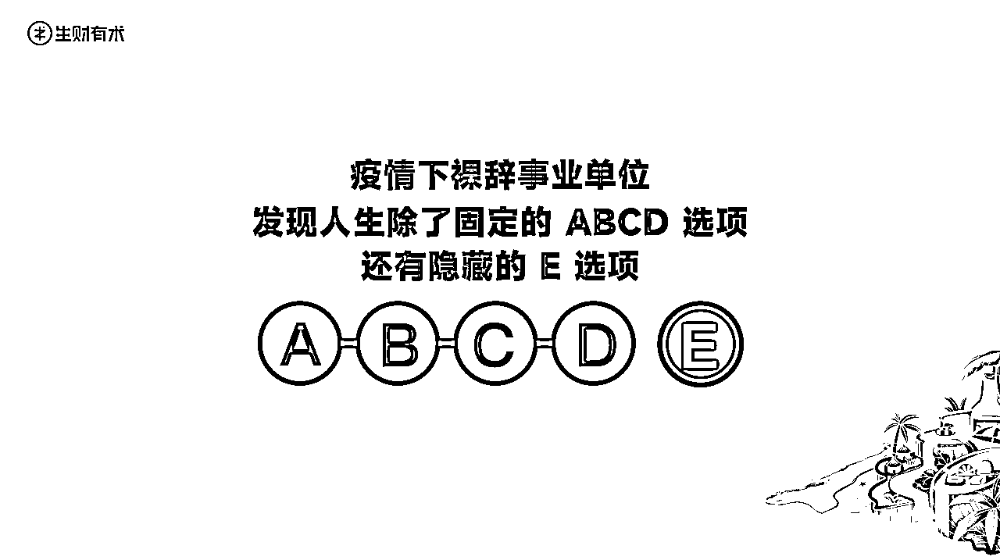

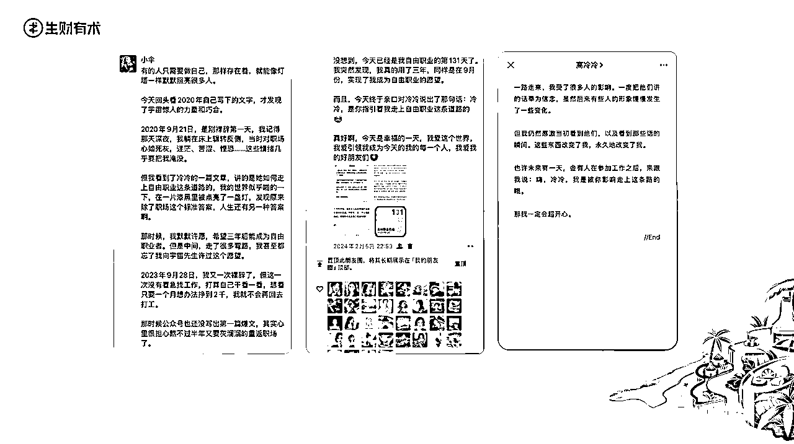

# 弯路：第一次裸辞，两个月后灰溜溜重返职场

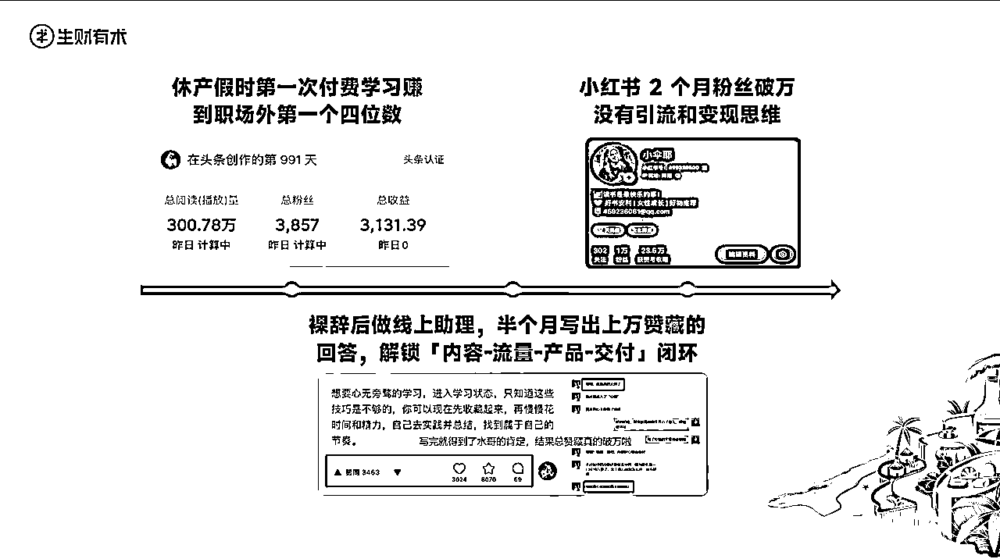

因为没有稳定收入，我又开始有点慌了，其实深层的原因是，当时在心理上还没准备好去做自由职业，也不知道原来开辟第二曲线的前期，赚的比职场少是很正常的，也没有做好半年一年收入不多的心理准备。

更重要的是，我还没有完全从职场的确定性解放出来，去拥抱不确定性。

于是，我暂停了深耕小红书，又灰溜溜的重返职场，放弃了自由职业，调整策略为在职做副业，多赚一份收入就行了。

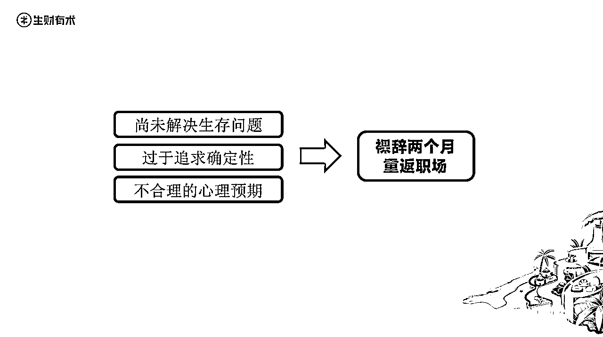

「退路思维」让我不敢迈开步伐。想着先找个班上，再重新考个公务员，有一个铁饭碗后，再放心的去折腾副业，这样就能对冲项目和自媒体的不确定性了。

「标签虚荣」让我为了满足别人的期待而活。从小到大当乖乖女和好学生多了，辞掉之前体制内的工作，我感觉到父母的失望和担忧。

边工作边考公，失败收场。

让我明白不要一开始就退而求其次。请径直走向最想要的东西

于是，22年的12月份，我又重新卷土重来，上牌桌了，我这次要径直走向我最想要的东西，重新开始折腾自媒体！

# 上岸：成功转型自由职业，我做对了哪些事？

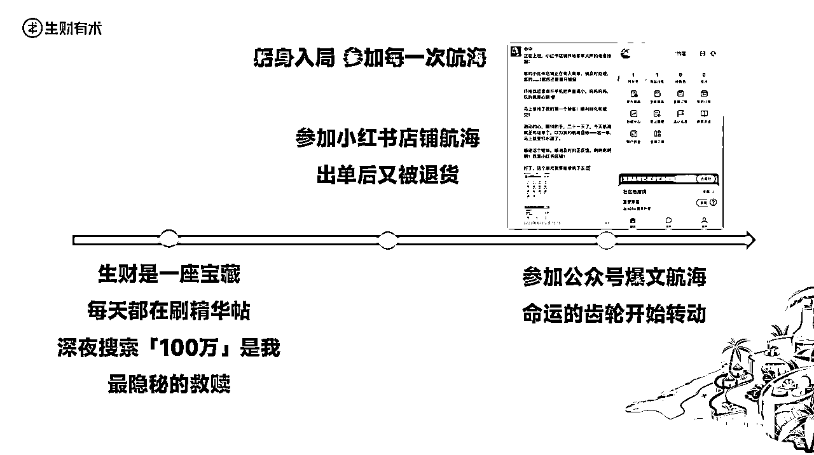

第二次裸辞是做好最坏打算后「主动」做出的选择

副业探索一年多

在生财看了很多关于心态、认知、原则的帖子

我做好了拥抱不确定性的充足准备

# 经验分享：新手如何写出10W+爆文

## 第一步：搜索关键词，筛选优质对标

假设我们是做【极简领域】的，那么就要找到出这个领域标题可能会出现的关键词，【用对的关键词】在微信搜索栏搜索。

那我们尝试用【极简生活】在微信搜索栏搜索，记得筛选一下，只出现文章，按热度排序，时间上选近半年或者最近7天的。

我们就能得到一波这个领域做得不错的账号。

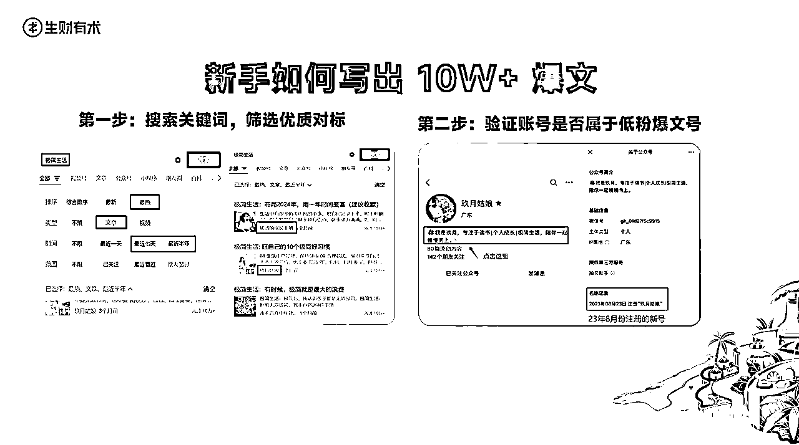

## 第二步：验证账号是否属于低粉爆文号

点进账号，看两个指标：

① 一个是注册时间：点击公众号简介，查看账号的注册时间，一般日期越近越好，近半年内最佳。

② 二是看账号数据：看它的发文篇数以及爆文率，来判断这个号值不值得对标。

## 第三步：复制爆款标题找出更多对标

从筛选出的优质对标账号中，选取该账号的爆款文章标题，再次在微信搜索栏搜，又能得到一堆把这个选题写爆的账号。

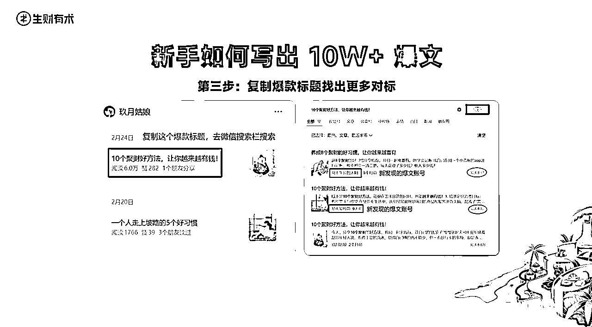

## 第四步：重复第二、三步，又能无限套娃了！！

这样一套动作下来，我们就找到了很多优质的对标账号和爆款文章，毕竟爆文最重要的是选题和标题。

那么，直接对标找出来的这些爆文的标题，98%改写这些标题，正文内容自己创作，就能提高写出爆文的概率了。

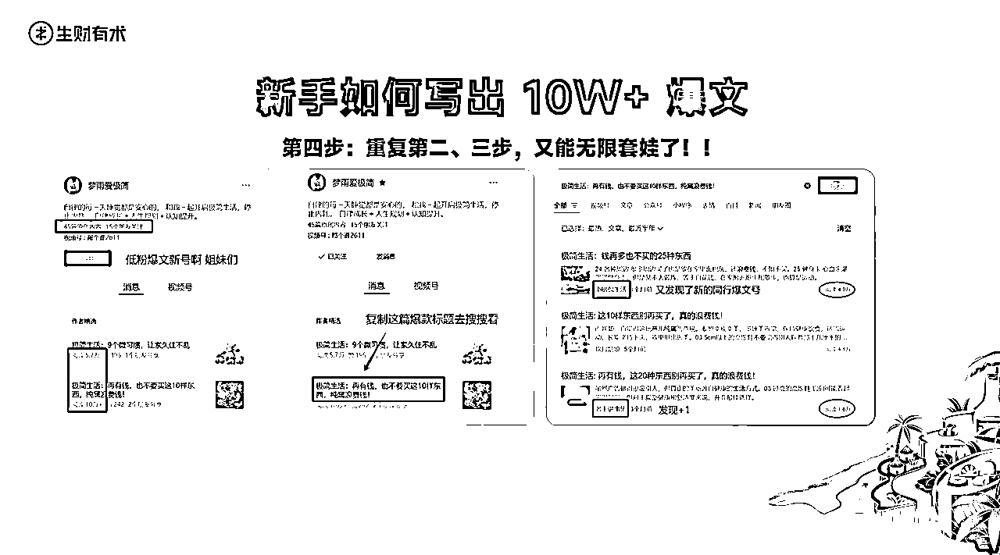

## 不断深耕，死磕公众号IP爆文，一年引流1W+

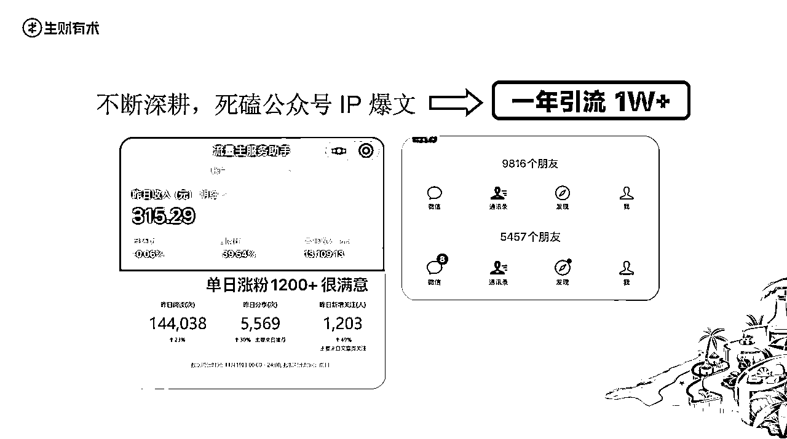

于是，我运用这套方法，开始深耕公众号爆文，且是属于小众的手搓党，有了上次小红书没抓住流量的教训，我这次很机智的留下了钩子，往微信上加好友。

我当时还是坚持选择了手写，因为我发现，用爆文的做号思维，来做IP号，真的是王炸组合，这也为我成为稳定的自由职业者奠定了基础。

账号数据好的时候，一天能涨上千粉丝，更关键的是一天能加三四百好友，不敢一下子通过太多，每天加好友到手软。就这样，将近一年的时间，我就拥有了一万的私域好友，收入就更加多元了，除了有流量主收益、接广收益，还有在慢慢和二爷的帮助下，踏出了做产品的第一步。

正是因为私域的价值，让我即使在流量不稳定，账号掉池的阶段，也能稳定军心，穿越周期，持续做事，迎来新的流量拐点。

至此，我的自由职业，经过了3年的弯路和探索，终于上岸了！

# 真相：自由职业第一年的真实感受

## 新的困境：自由背后，是混乱与失序

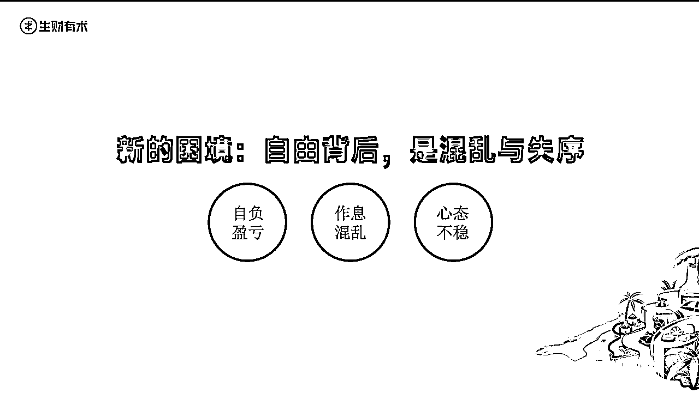

接下来要谈论的话题，可能是很多在职但想自由职业的伙伴感兴趣的，那就是——不要美化，不要丑化，客观的分享一下，真实的自由职业生活是怎么样的？

说实话，自由职业的刚开始阶段，我还没有完全放松下来，相比上班，其实压力是更大的。

#### 第一点：自负盈亏

因为上班可以摸鱼，干得不好也不用赔钱，每个月还有稳定的工资入账，但是自由职业是要自负盈亏的，做得不好就没饭吃，需要有强烈的自驱力。

#### 第二点：作息混乱

那时候，虽然第二个月就月入过万了，但很担心无法持续，自己给自己施加压力，虽然脱离了职场，心里却也不轻松，晚上还是会失眠睡不着觉。

#### 第三点：心态不稳定

有一次见朋友，她说我气色怎么这么差，脸颊都凹进去了，是不是压力太大了，但只是压力大，内心是不痛苦的。

自由职业一年之后，我已经开始慢慢建立起自己的秩序，找到比较舒服的生活和工作方式了。

说完自由职业的B面，我想再讲讲自由职业对我而言很棒的A面。

## 自由职业对我而言很棒的A面

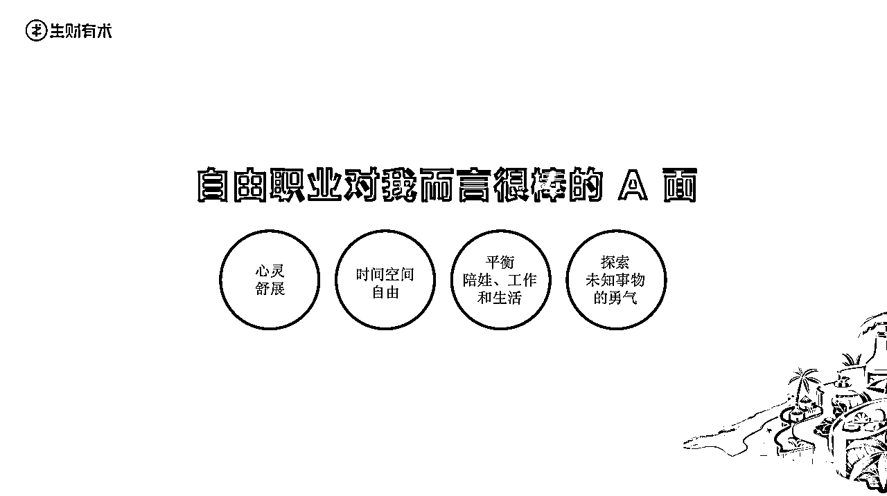

#### 第一点：我的心灵获得了极大的空间和自由

在职场工作了快五年，也换过几份岗位，我清晰的知道这条路不是我想要走的路，会扼杀我的灵魂（笑死，用灵魂这个词是不是太文艺了）。

但是自由职业，却能够让我得到舒展，我可以自由的写想写的内容，当然也要部分迎合平台，但那种能掌控自己的感觉，我觉得很爽。

#### 第二点：时间和空间都很自由

我可以睡到自然醒，也可以早早就起来，没有通勤时间，办公地点灵活，可以错峰做很多事，比如看电影、去健身房、带孩子出去玩，这种错峰的体验感很棒。

#### 第三点：能够相对好的平衡陪娃、工作和生活

在职场难以解决的困境，在自由职业里有了迂回的空间。安排好工作后，能够送孩子上学，接他放学，陪他读绘本，去游乐场玩，我觉得这应该是很多职场妈妈所想要有充分的时间做的事情。当然，我也很感谢我的公公婆婆，可以在我没时间时带孩子，支撑起家庭的大后方。

#### 第四点：我能够有勇气探索更多的未知事物，拥抱新的东西，让这些东西流向自己了

比如，自由职业第一年，我尝试了剪寸头，漂染头发，上各种体验课，勇敢的走进健身房的力量区，慢慢养成运动的习惯，未来还想解锁更多有意思的事情。

如果在职场，我可能也没有勇气，也没有条件，去尝试做这么多新的事情。

光是这几点，我都觉得自己赚到了很多，承受一些不确定性的压力，都是应该付出的成本。

所以我一直都很感激有自媒体的存在，感激生财带领我进入更广阔的搞钱但又不仅仅是搞钱的世界，感激有自由职业这样的生活方式。

## 破局之道：与焦虑共舞，持续地做事

说回自由职业的B面，即如何与不确定性相处，去和焦虑共存。

很多压力，除了一部分是客观存在的，大部分都是内在的自我批判施加给我的。

比如，如果我今天一天，只写了一篇稿子，本来计划要做的营销动作，要优化的环节，要推进的重点工作都没有做，我就会开始自我批判。

觉得我这样下去就要完了，我应该要更努力，投入更多的时间到这里面来。

但越是给自己施压，我就越开始动弹不得，其实没必要。

就像慢慢跟我说的，换一个角度想，只要我写完一篇稿子了，那么今天的工作就算是已经完成了，如果接下来我还做了其他事情，那就是锦上添花。

有趣的是，一旦怀着这样的心态，反而就能做更多的事情了，就算没做到，也不会在内心里批判自己，而是觉得自己很棒，有更多的信心和勇气继续前行。

所以，与焦虑共舞的秘诀就是——不要过度自我批判，只要在做事，在牌桌上，那就是在前进。

未必是要与工作相关的，才叫做事，去运动，去阅读，去尝试新事物，也算是在做事。

以上就是我，从一个职场宝妈，花了3年时间，裸辞两次，尝试过不少项目，一路走来，终于找到属于自己的道路，成为自由职业者的故事。

我是一个很普通的宝妈，没啥背景和资源，不算聪明，不够圆滑，走过弯路，也经历过很多怀疑和内耗，但最后还是抵达了今天这里。

我觉得，最重要的两点，是「信念感」与「主动选择」。

#### 第一个，信念感

在加入生财后，我的信念感变得尤其强烈，看了很多普通人额逆袭的故事，哪怕我当时只是一个菜鸟，没有拿得出手的成绩，但第二次裸辞时，我就觉得，我这次一定能成。

在做公众号时，虽然账号还是个位阅读量，但我不断的想，我一定可以写出10W+爆文的，没想到一个礼拜就实现了。

在自由职业初期，还没赚到什么钱时，我躺在床上，就想着什么时候我的文章标题能取“自由职业月入过万”啊，没想到第二个月，我就实现了。

我还想着要赚到人生的第一个100万，2023年就开始想了，现在还没实现，但我相信只是时间问题。

所以，信念感是很重要的东西，能支撑我们去做别人或许觉得不可理喻或难以达成的事情，让我们在徘徊中，选择坚定的前行。

#### 第二个，就是拥有「主动选择」的勇气。

我很喜欢李笑来的一句话，他说：

「衡量一个人是否活真正活着的根本方法，就是看他是否有意愿、有能力做出主动的选择。一生随波逐流，一生逆来顺受，算不上活着，甚至生不如死。在一个关键节点上，人必须做出主动的选择。只有这样，活着才有意义。」

这也鼓舞着我，从拥有确定性的职场上跳出来，去主动选择不确定性，抛弃掉那些虚假的安全感，更加勇敢的投身进入到未知的海洋里。

到现在，我能够更坦然的直视外界的眼光，不再为了满足世俗的期待，而是遵从我的内心，去大胆的探索和体验更多的事物了。

希望我们不仅仅是职业自由，更是人生自由！