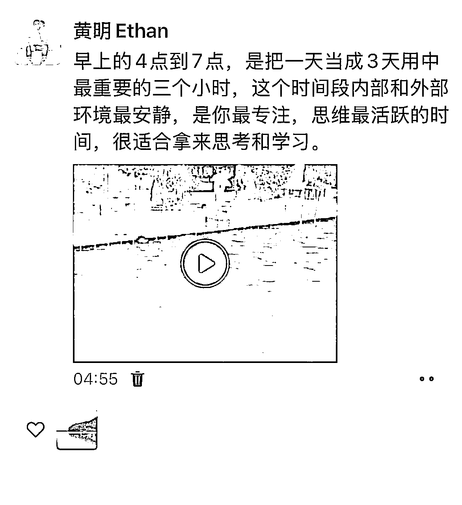
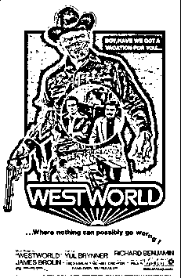

# AI数字人发展阶段梳理

> 来源：[https://wppopmriov.feishu.cn/docx/IsLjdBkrcouEsFxxLadc4HQInUf](https://wppopmriov.feishu.cn/docx/IsLjdBkrcouEsFxxLadc4HQInUf)

今早4点半起来梳理了关于AI数字人的发展阶段，结合数字人技术的演进以及应用场景和市场趋势，让我自己收获也非常大，其中我还找到了很多的案例，突然发现输出其实是最好的学习方式，让我对Ai数字人有了一个全新的认识。

# AI数字人发展分为五个关键阶段：

## 一、技术萌芽与初步探索阶段（1970s-2010s）

### 技术特征：

以计算机图形学（CGI）为核心，通过手动建模和动画技术生成虚拟形象，缺乏交互能力。

## 典型案例：

包括《西部世界》（1973年）的早期CGI应用，西部世界这个电影

《最终幻想：灵魂深处》（2001年）的3D虚拟角色。

应用场景：主要应用于影视特效、游戏角色和广告，如日本虚拟歌姬“初音未来”（2007年）的诞生。

局限性：依赖人工制作，成本高、效率低，形象多为卡通化或低写实度。

# 二、技术突破与动态交互阶段（2010s-2020s）

## 技术特征：

引入动作捕捉（Mocap）、语音合成和深度学习技术，实现动态表情和初步交互。

例如，电影《阿凡达》（2009年）推动动捕技术普及。

微软小冰（2014年）结合NLP实现简单对话

## 应用场景：

虚拟主播（如绊爱）

智能客服（如苹果Siri）

包括很多游戏的NPC等，开始向企业服务领域渗透。

## 技术分级：

对应商汤定义的L1-L2级（人工制作→动捕驱动）。

### L1级：人工制作为主

#### 技术特征：

L1级数字人完全依赖人工设计、建模和动画制作，属于“静态展示”阶段。制作流程包括手工绘制、3D建模、关键帧动画等，耗时较长且成本高昂。例如，《阿凡达》中的早期CG角色即属于L1级。

#### 应用场景：

主要用于影视特效、平面广告等需要高精度但交互性要求低的场景，如静态虚拟形象展示或预渲染动画。

#### 局限性：

缺乏实时交互能力，内容更新需重新制作，无法适应动态需求。

### L2级：动捕设备驱动

#### 技术特征：

L2级数字人通过动作捕捉（Motion Capture）设备采集真人演员的表情、肢体动作和口型数据，再映射到虚拟角色上。例如，电影动画制作中常见的动捕技术应用。

*   需依赖专业设备（如光学动捕服、面部传感器）；

*   数据采集后仍需人工调整和后期处理。

#### 应用场景：

适用于虚拟主播录播、游戏角色动画等需要动态表现但交互性有限的场景。

#### 局限性：

*   设备成本高，操作复杂；

*   实时性不足，无法支持即时交互；

*   依赖真人演员表演，难以规模化生产。

# 三、智能化与垂直应用阶段（2020-2023年）

这是最重要的几年

## 技术特征：

AI技术深度融合，如生成对抗网络（GAN）提升写实度，自然语言处理（NLP）实现多轮对话。数字人进入L3-L4级，支持算法驱动的实时交互。

*   L3级：算法驱动口型、表情同步（如虚拟化身直播）。

*   L4级：垂直领域智能化服务，如AI客服、虚拟教师。

## 应用场景：

直播电商（如抖音数字人主播）

教育（虚拟导师）

金融（智能理财顾问）

## 市场变化：

2023年ChatGPT热潮推动AI普及，数字人制作成本大幅下降。企业数量从60万家锐减至6000家（优胜劣汰）。

ChatGPT的热潮对AI数字人技术的普及与成本下降起到了关键作用，其核心逻辑在于技术突破、生态协同与应用场景扩展的结合。以下从技术、产业、成本三个维度展开分析：

### 一、技术突破：生成式AI驱动数字人技术成熟

#### 自然语言处理（NLP）能力的跃升

ChatGPT基于大语言模型（LLM）的对话能力，显著提升了数字人的交互自然度。例如，京东的LiveHuman模型通过结合GPT技术，实现多模态语义对齐，使数字人能理解复杂指令并生成自然应答，解决了传统数字人“答非所问”的痛点。

案例：京东言犀数字人仅需输入自然语言或1秒视频即可生成4K高清形象，口型匹配度达100%，无需传统建模流程。

#### 内容生成效率的革命

ChatGPT的文本生成能力降低了脚本创作门槛。例如，影视公司利用AI生成剧本，将创作周期从数周缩短至几分钟，间接降低了数字人配套内容的制作成本。

数据支撑：光线传媒通过AI技术将动画电影制作效率提升30%。

### 二、产业协同：大模型生态加速技术普惠

#### 大模型开源与工具链完善

ChatGPT的爆发推动百度、阿里等企业开放大模型能力（如文心一言、通义千问），使中小企业和个人开发者能低成本调用API开发数字人应用。

例如，闪剪等工具通过集成大模型，实现“输入文案即生成视频”，制作成本降至千元级。

#### 算力成本下降与工具简化

随着AI芯片性能提升及云计算普及，训练数字人模型的算力成本大幅降低。

例如，魔珐科技通过优化算法，将虚拟人制作周期从3个月压缩至1周，人力成本减少70%。

### 三、成本下降的直接动因

#### 技术替代人力密集型环节

传统数字人需人工建模、动捕设备，成本高达数十万元；而生成式AI（如京东LiveTTS）通过扩散模型实现“零样本”语音合成，省去真人录音与后期处理。

#### 

数据支撑：AI虚拟主播制作成本从2022年的几万美元降至2023年的千元级。

#### 工业化生产与规模化效应

企业通过标准化工具链（如魔珐科技的智能化产线）实现数字人批量生产，边际成本趋近于零。

例如，百度数字人制作成本从2018年的500万元降至2023年的千元级。

# 四、超写实与元宇宙融合阶段（2023-2025年）

## 技术特征：

*   真人3D数字人：通过3D云阵扫描、多模态AI（语音+视觉+情感识别）实现高度拟真，如Meta的元宇宙数字分身。

*   生成式AI（AIGC）：几分钟生成逼真数字人，降低制作门槛。

## 应用场景：

元宇宙：虚拟会议、社交（如Meta的VR化身）。

metahuman数字人

Meta新项目非侵入式神经接口

Meta扎克伯克的元宇宙

文旅与历史复现：

如故宫数字导览员

历史人物动态复现。

## 政策支持：

中国发布《北京市促进数字人产业创新发展行动计划》，目标2025年产业规模超500亿元。

# 五、通用智能与全民普及阶段（2026年及未来）

## 技术目标：

达到L5级完全智能交互，实现个性化虚拟助手，具备情感计算和跨场景自适应能力。

## 技术驱动：

大模型（如GPT-5）、量子计算提升算力，实时渲染与AI生成无缝融合。

## 应用愿景：

*   个人数字分身：

人人拥有定制化3D数字人

用于政务

社交

医疗

教育

*   产业变革：

数字人成为“新生产力工具”，在制造业、医疗远程协作中广泛应用。

## 市场规模：

预计2026年中国AI数字人市场规模达102.4亿元，全球进入万亿级市场。