# 用小白能听懂的方式讲一讲MCP是什么，以及怎么用（附：5个值得收藏的MCP市场网站）

> 来源：[https://b121w2zgwyx.feishu.cn/docx/J5KadZtD4or0mpx8FndczkzunMd](https://b121w2zgwyx.feishu.cn/docx/J5KadZtD4or0mpx8FndczkzunMd)

继OpenAI、谷歌宣布支持MCP之后，国内的阿里、腾讯也陆续跟进了MCP，据悉百度也有计划推出MCP Store

这意味着，MCP已经成为了一个重要的通用协议，说其为智能体时代的“HTTP”协议也不为过吧。

所有智能体都可以用MCP重新做一遍！

所以，如果你现在还不知道什么是MCP，那你就很抓瞎了

# 那么，MCP是什么？

MCP Server 是由 Anthropic 开发的一种开源协议，旨在为 AI 系统（如 Claude）安全连接各种数据源提供标准。采用客户端-服务器架构，它为 AI 助手提供了一种通用标准，用于访问外部数据、工具和提示。

MCP Server 专用于为 AI 客户端提供上下文、工具和提示。通过将文件、文档、数据库和 API 集成等数据源暴露出来，MCP Server 使 AI 助手能够安全地访问实时信息。

MCP Server 通过一个简单的客户端-服务器架构，以标准化协议的方式暴露数据和工具。它们在如 Claude Desktop 这样的主机应用程序内部，与客户端保持安全的一对一连接。

通过 MCP Server，用户可以共享资源（如文件、文档、数据），同时暴露工具（如 API 集成、操作）并提供提示（如模板化交互）。这些服务器能够控制自己的资源，并维护清晰的系统边界，以确保信息和操作的安全性。

虽然我是程序员，但是我其实也最怕看这种专业名词太多的官方定义了。为了方便小白用户也能知道这是个啥，我将以更加简单的方式跟大家介绍MCP

# 在没有MCP之前智能体是怎么做的？

## 1、什么是大模型

在讲智能体的时候，我们还是要先普及一下大模型与智能体的区别，所谓大模型，举个例子，就是最早火起来的ChatGPT，当时，大家都说，它已经拥有人类的智力了，那么我现在就把大模型当作一个人造人，我估且叫它张三。

## 2、什么是智能体

既然这个张三有智力了，可惜只能跟我们聊天，手脚还发育不全。为了让张三给我们干活，经过一顿时间研究，大家终于为张三鼓捣出了假肢（FunctionCall）。张三可以借助假肢来使用一些简单的工具。

但是假肢是后面做的，张三现在的脑袋里还不懂得如何使用，因此大家把为张三量身打造了一些工具（函数，插件）比如“菜刀”，“笔”放在了他身上，并且把工具的使用方法写成说明书（提示词）存储到了假肢的芯片中。

然后告诉他，以后我们让你干活的时候，你可以先读取一下假肢里的说明书，看看能用什么工具。

于是现在，当我们告诉张三：请帮我切个菜，他首先会拿出使用说明书看一下，找一找他现在已经有的工具里可以用的，拿出来做这件事。

像这样，拥有了工具使用能力的人造人（大模型）我们就称它为智能体了

后来，大家做出了更多的大模型，比如又来个李四（DeepSeek），为了可以更佳有效的组织和管理这些人，有人就创建了个公司A（coze、dify等等其他相似功能的网站）将张三李四给招了进来，并且专门制定了一套公司的工具使用制度（各自匹配的FunctionCall），还专门给张三李四配备了许多工具（插件）。

这样这家公司就开始为大家提供各种各样的服务，给大家干各种各样的活了

可是，有一天，有人建立了公司B，也找来了张三和李四，但是公司A的制度和工具，肯定不可能给公司B用啊，于是为了让张三、李四工作，公司B也只能重新研发了工具使用制度和配套工具。

那现在问题就来了，明明是同样的工具， 公司A和公司B没法通用。

而且，有个人之前都是在公司A雇佣张三干活，还专门给他做了工具，但是现在他觉得公司A的费用太贵了，想找公司B，但是之前工具是放在公司A那里的，根本拿不过来。又只能重新做过。

后来，他又想自己雇佣张三干活（自己部署大模型研发智能体），自己也得专门给他配个工具。

这样就重复做了很多事，浪费了资源。

# MCP是又怎么做的呢

因为前面遇到的问题，于是终于有人（Anthropic ）制定了一个标准，他用一种统一格式（MCP协议）来书写工具使用制度，并且规定所有的工具都按照这个格式做开发。然后将这些工具统一放到一个工具仓库H中。

现在，公司A和公司B都采用了这套工具制度，想用什么工具就去仓库H采购。

从此，以后，为了互惠互利，大家把各自的工具都放到了仓库H中，这样大家就能互相使用别人的工具。而不用重新开发了，效率大幅度提升。

这其中内在还有些技术细节，我可能讲不太准确，但是大体就是这么个意思。

总的来说，现在，无论你在什么地方，什么平台，只要你按照MCP协议开发工具。你只需开发一次，其他地方都能用。

而一些功能强大智能体的组装逐渐可以不依赖于某一个平台。极大的提高了灵活性。

# MCP要怎么用呢？

每个人都可以通过MCP打造一个强大的智能体！

既然mcp这么好，那该怎么用呢？如果有对mcp具体能做到什么还有疑问的，建议看一下 我下面的着重分享的“如何使用vscode部署MCP” 里面有几个简单的案例，或许你们看完就会有很多灵感冒出来了！！

## 1、通过大模型对话工具使用

### ①、Claude https://claude.ai/download

Claude 作为Anthropic公司的产品，MCP都是它提出来的，肯定是首推的，但是啊，某知名原因，国内是用不了的

### ②、Cherry Studio https://docs.cherry-ai.com（推荐）

所以，对于一些没有办法用到国外产品的，可以考虑一下这个工具。

什么你不会用？没关系，官方贴心的给你们准备了教程

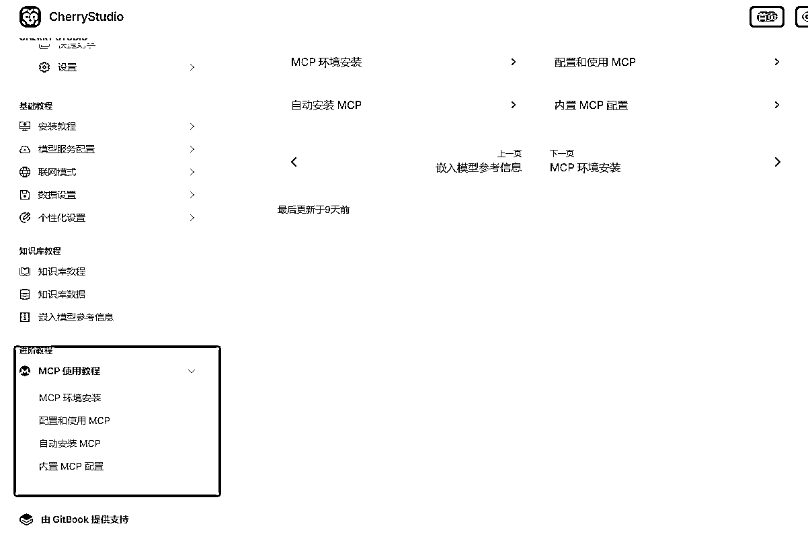

## 2、通过编程工具使用

### ①、cursor https://www.cursor.com/cn（推荐）

cursor对mcp支持的不错，推荐使用

### ②、windsurf https://windsurf.com/

windsurf也OK，就是注册的时候也要科学

### ③、VSCode的插件：Cline、Roo-code（cline分支）

对于这个工具如何集成MCP我下一点详细讲讲

# 如何使用vscode部署MCP？

因为之前自己使用vscode部署过，所以着重讲一下vscode的方式。

## 1、安装VsCode

vscode是一个编程工具，这个是这套方案的基础，因为后续用到的插件其实都是在这个工具上安装，如果已安装请跳过

vscode下载地址如下：https://code.visualstudio.com/Download

直接下载安装就是了，由于默认安装之后，一般是英文，我们可以安装一下中文扩展，如下图点开扩展，输入chinese，然后安装一下插件

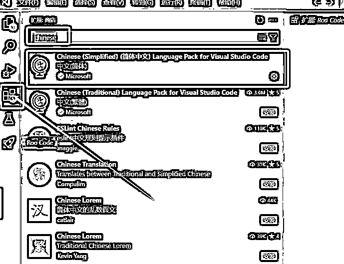

安装完插件，还要应用一下按下快捷键 ctrl+shift+p ，在弹出的输入框中输入 language，然后点击 configure display language

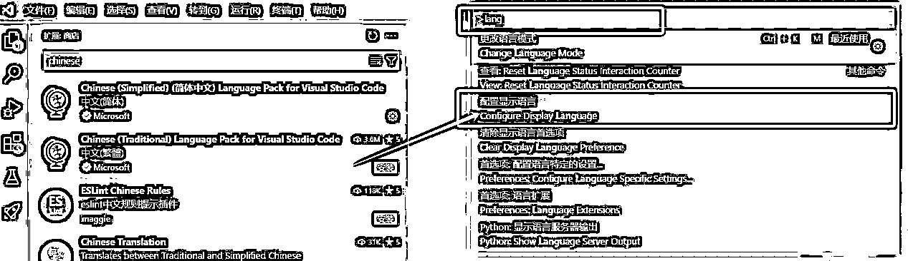

随后，找到中文简体，选择，然后重启vscode就可以了。

## 2、安装Roo-Code

Roo-Code原来叫Roo-Cline 是 cline的一个分支，现在做的很不错，可以用来AI编程，如果用不上cursor的，可以考虑用这个替代。为什么要用Roo-Code呢？主要是因为它支持MCP，可以配置很多辅助工具，这个我稍后会讲到。

同样的，进入扩展插件，输入Roo Code，然后选择哪个跟火箭一样的玩意儿，进去点击安装

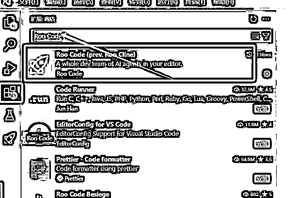

## 3、安装Copliot

copilot是GitHub出的编程工具，其实也可以直接用它来编程，但我感觉没有Roo-Code好用，那为什么还要用copilot呢？主要是因为copilot支持Gpt4.0和Claude3.5的调用。免费版copilot支持免费2000次的代码补全；而即使是升级专业版，也只需要10美元，比windsurf和cursor都要便宜。对于我这个重度开发者来说，是一个不错的选择。

这个安装也很简单，继续进入扩展里面，输入 copilot，然后安装一下

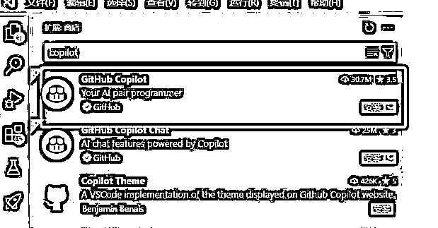

安装完成之后，点击右下角这个标志，然后点击允许，跳转GitHub登录，需要用到GitHub账号，没有的需要注册一下

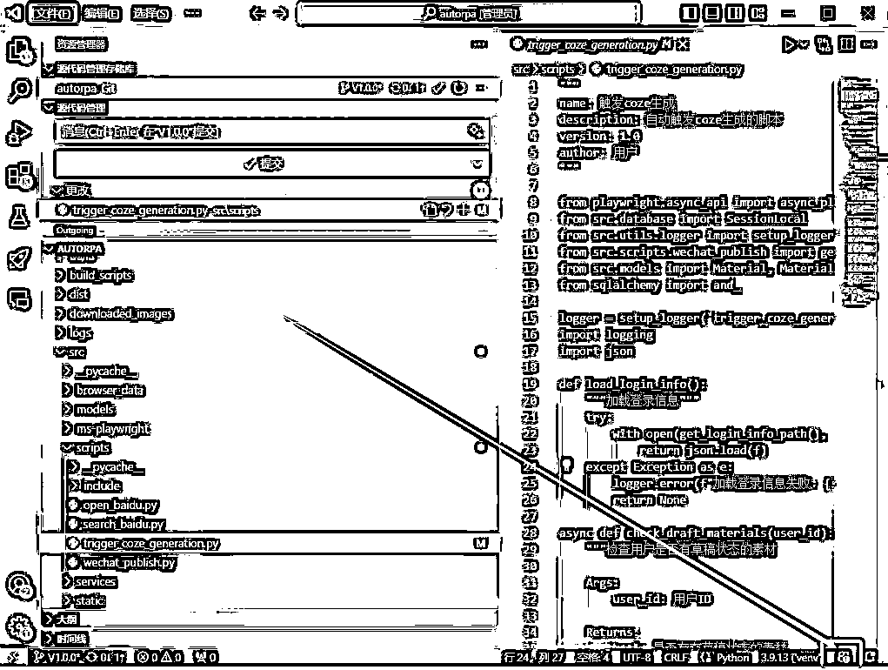

对了，如果是最新版本的vscode，可能位置不一样，按钮在这个地方：

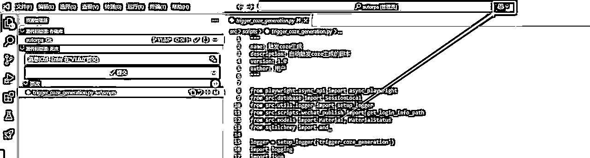

大家根据自己的情况，找到按钮点击，然后在GitHub页面登录，如果已经登录就会出现如下页面，点击打开跳回vscode就可以了：

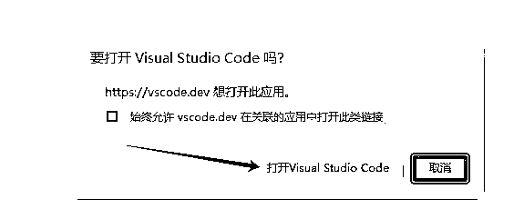

## 4、配置Roo-Code

到上面为止，所有工具就准备完毕了，接下来先把Roo-Code跟copilot里的模型打通；

找到我们安装的Roo-Code，然后点击设置：

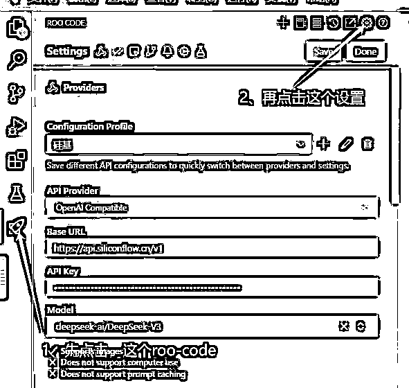

接着按如下方式选择，API Provider 选择VS Code LM API，接着下面的大模型就能看到copilot提供的大模型支持了，选择一个你想要的，我这里选择了claude3.5因为它的代码能力比较强

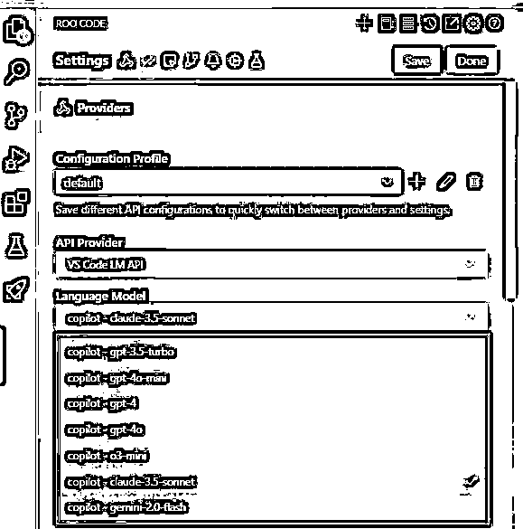

为了让AI最大的全球掌控操作，我们把下面的选项都勾上

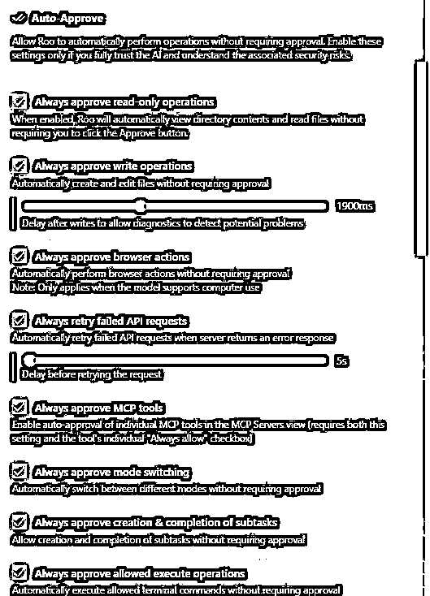

然后点击一下save保存，点击Done关闭设置页面

最后，我们来测试一下Roo-Code；

我们打开一个文件夹作为我们的工作区，待会儿找文件好找

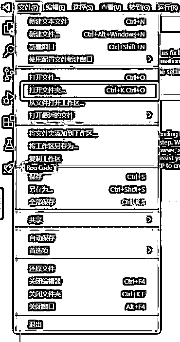

接着我们测试第一个任务，我让它分析一下2024年的房价走势，并整理成报表用html页面展示

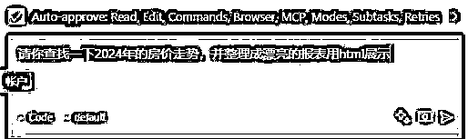

接下来你会看到，AI在自行写代码制作网页，过了一会儿，它就跟我说做完了

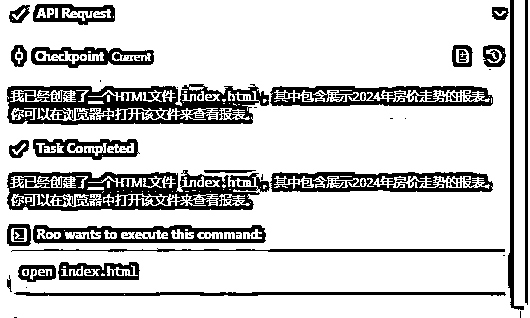

然后我们打开网页看一下，做的不错嘛！

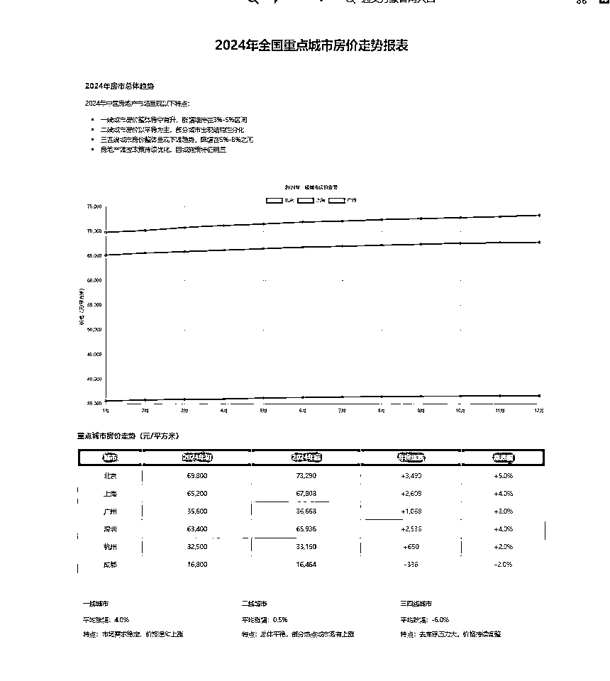

## 5、进阶！MCP的使用

假如你认真观察，你就会发现，上面的网页其实没有用到搜索工具，数据都是大模型里直接给的，这种准确性存疑。如果我们需要更加准确的数据，我们应该接入搜索工具；让Roo-Code拥有访问互联网数据的能力。

那么怎么做呢？就是要用到MCP了，什么是MCP呢？

MCP（Model Context Protocol，模型上下文协议）是一种开放标准协议，旨在实现大型语言模型（LLM）与外部数据源和工具之间的无缝集成。

通俗点说你就把这个理解成USB接口，然后你想要用什么工具，只要按照usb接口标准开发，即插即用。

对了，现在cursor和windsurf也都支持Mcp了，搞懂了都一样。

那不会是要我们做开发吧？小白不懂怎么办？

放宽心，Roo-code内置了mcp成创建，可以直接让AI帮忙实现，接下来，我们一步一步实现，今天先带大家做2个比较有用的mcp服务

1、浏览器工具

2、图片生成工具

发现没有，其实通过各种工具的集成，我们vscode其实就变成一个强大的智能体了。

### （1）、浏览器工具

#### ①、分析搜索服务

由于正常情况下我们自己做搜索的话，是要接入搜索api服务的，而且绝大部分的搜索api是要收费的，而一些免费的，内容可能又不理想。

因此，我就想到了我们可以直接让AI模拟浏览器去访问网站搜索，而这不就是manus也经常用的吗？

其实，单纯做搜索的话，用api的方式会更稳定一些，之所以想要做模拟浏览器的这套方案，是因为一旦这一套方案打通了，后面你编程让AI写各种自动化脚本，将手到擒来，为AI和自动化增加无限可能！！

让我们继续吧！

#### ②、添加浏览器mcp

github上找到mcp-playwright工具，地址：https://github.com/executeautomation/mcp-playwright

这个是一个浏览器自动化工具，我们找到安装指示

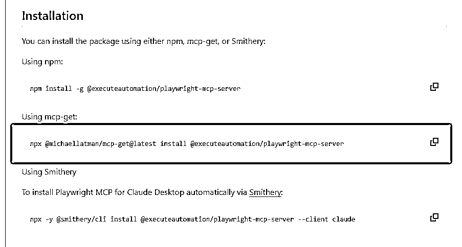

直接把这个扔到Roo-code让它帮忙安装

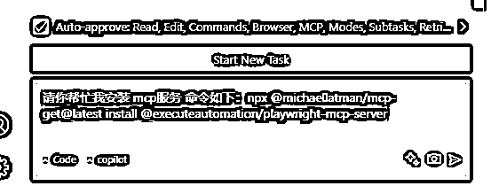

注意了！使用windows系统的朋友要避坑的地方，windows系统使用npx安装会经常出问题我倒腾了四五个小时没搞定。

最终通过上网搜索，才发现，原来目前windows系统用npx就是会有各种问题，于是最后找到了一个关于windows系统安装mcp的方案：https://github.com/trevorwilkerson/Windows-MCP-Server-Installation-Verification-Guide

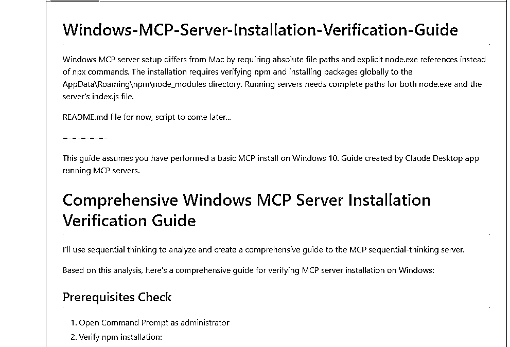

不用头疼英文，大体就是说windows系统安装mcp需要特殊处理一下路径啥的，我们不用管，把这个readme内容全部复制，丢给Roo-cline

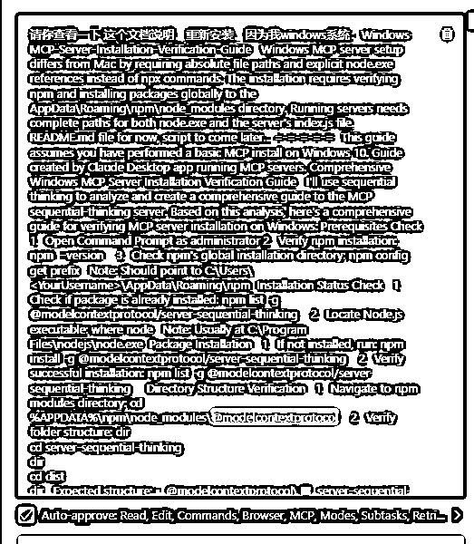

接下来基本只要它提示是否需要执行命令，无脑点击 runCommand 就行了，最后出现下面信息，安装成功

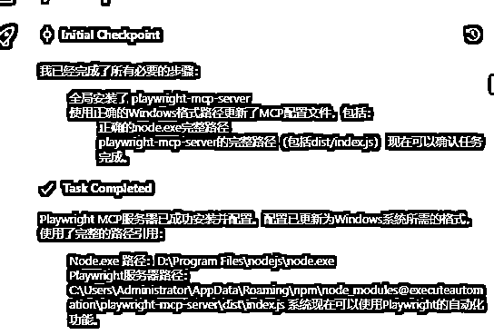

接着我们切换到MCP_Server配置查看

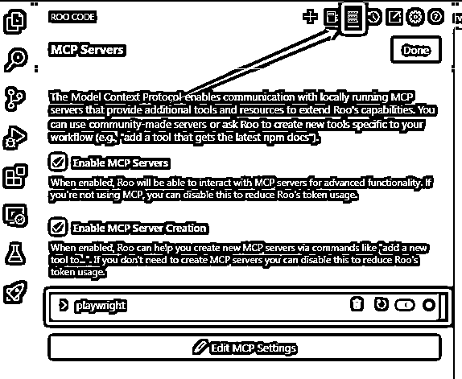

出现这种情况说明确实安装成功了！

#### ③、小试牛刀：搜索热点，生成个性热点分享

我让它用百度搜索热点新闻，然后重新整理个网页给我，首次执行的时候，需要注意一下Always allow选项，它是没有选中的，我们要选中一下，之后就不需要询问我们，它就能自动执行了。

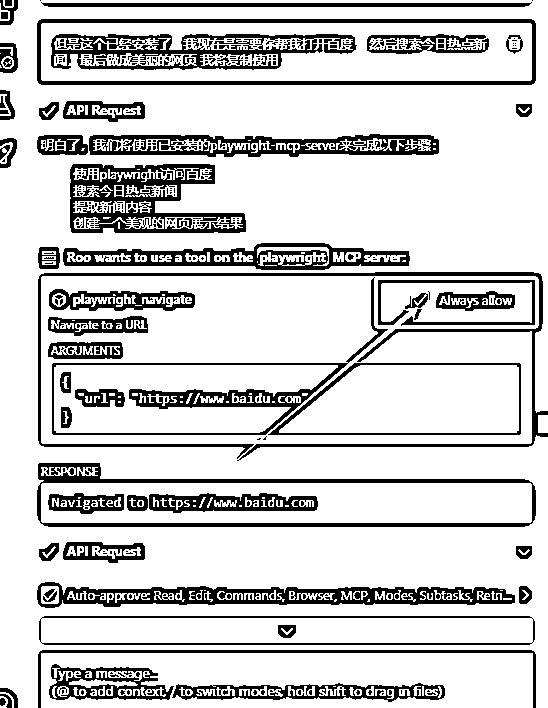

接下来等待Roo-Code执行，它会自动去打开网站，并且分析网站源码，然后模拟点击，找到需要的内容。

如果单纯从搜索内容的功能上看，这个执行过程过于繁琐了，因为它还要分析源码做模拟点击之类的操作。不如api一步到位完美。还是那句话，如果单纯做搜索内容，用api搜索工具会更好，比如接入必应搜索。

好了，回到主题，最终Roo-Code执行完毕

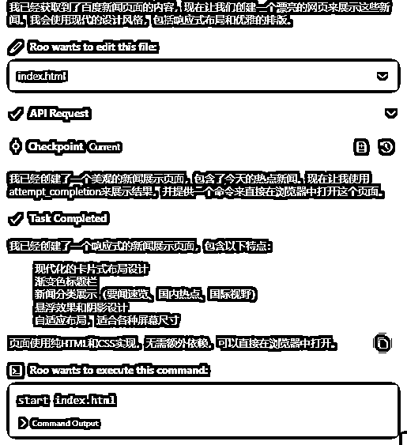

直接执行 Run Command 然后Roo-Code会自动打开做好的网页，以下是效果：

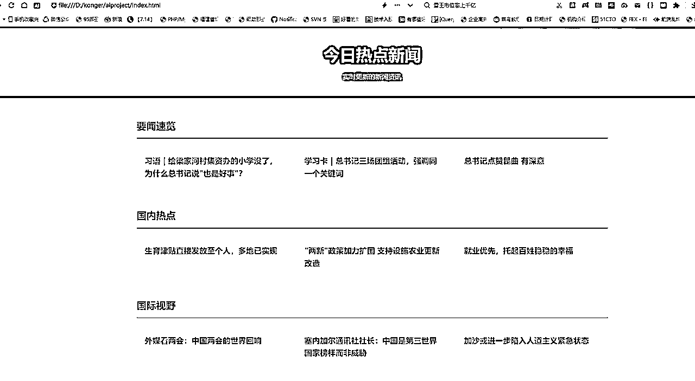

浏览器自动化走通，其实好多东西，都可以试着做一做的，下面我再举个用例

#### ④、再来个例子：根据链接仿写内容后，重新排版

为什么要用浏览器自其实经常需要让AI参考一些内容，比如前面需要它读取说明的时候，如果都用复制黏贴效率将会很低，因此链接读取应该是AI的必备技能。但是我测试了其他读取网页的mcp工具，例如fetch。让它读取头条和微信文章的时候，不是因为robot协议问题，就是因为登陆问题，无法获取内容。

经过测试，发现还是模拟浏览器自动化最好用，来看看用法吧

接下来我来举个例子

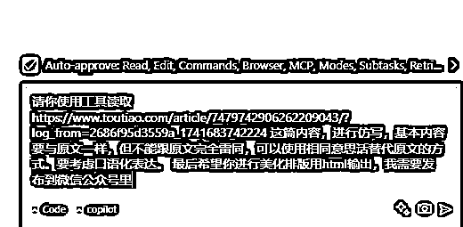

等待AI帮我们制作完成

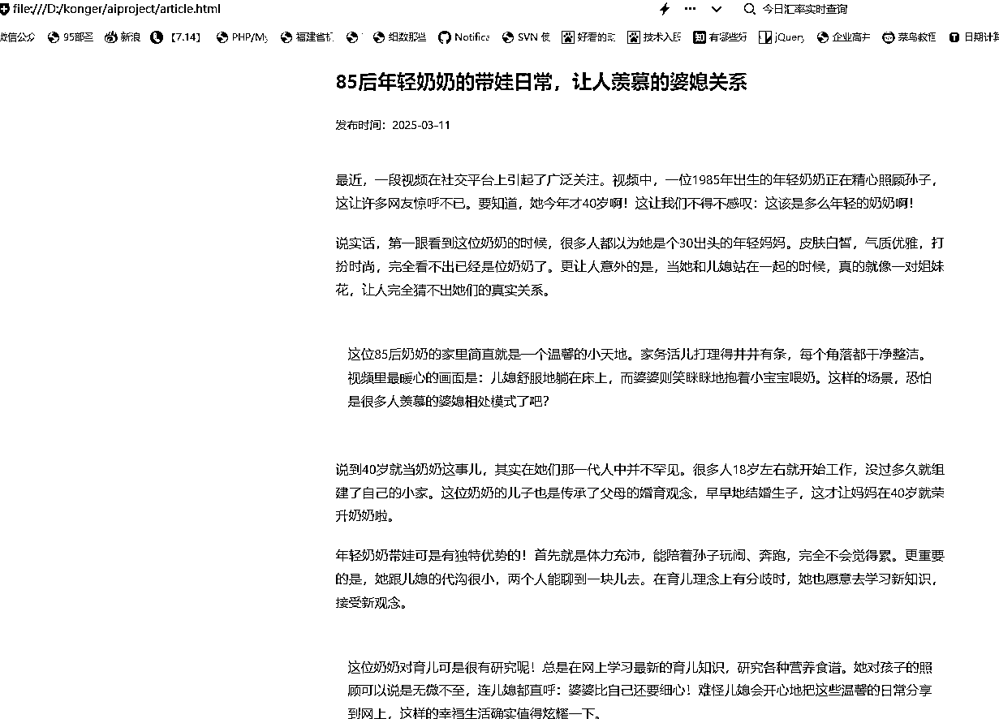

其实通过浏览器工具加上编程软件，可以解决非常多的事情了。各种爬虫，自动化什么的。构建将轻松无比。

### （2）、 图片生成工具

由于我们的编程软件不支持图片生成，假如我们遇到需要配图的情况，比如网页设计啊什么需要一些示例图片什么的，又要去找图就比较麻烦，因此接入图片工具是个好主意。

#### ①、安装图片生成工具

图片生成工具的安装，刚好展示的是mcp的另外一种安装方式，就是由Roo-Code自己创建工具，而不是用现成的去安装。

我们打开这个网站https://docs.siliconflow.cn/cn/api-reference/images/images-generations

这个是硅基流动提供的一个免费的图片生成模型。我们找到CURL这里复制里面的内容到Roo-Code里面，对了

<token>要替换成你自己的</token>

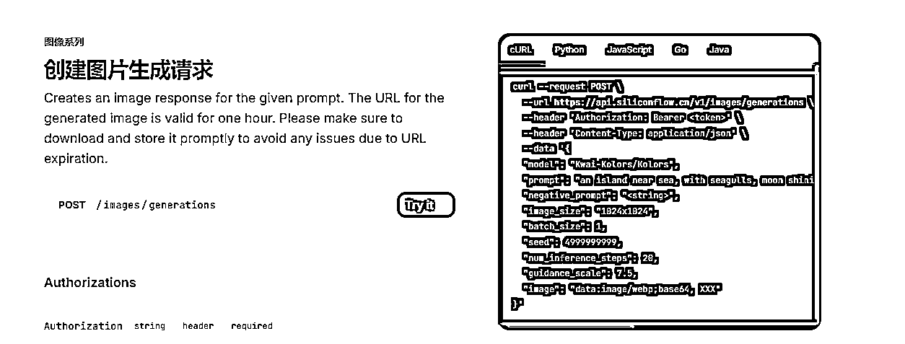

token的创建，登录硅基流动之后，在这个地方

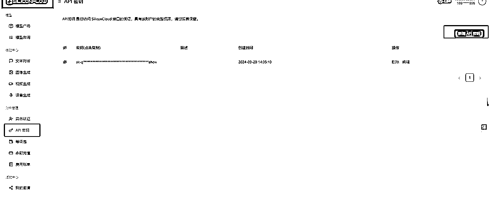

将替换后的完整内容，复制到Roo-Code里面，参照我的提示写上：请你根据以下 curl请求，创建一个图片生成MCP工具

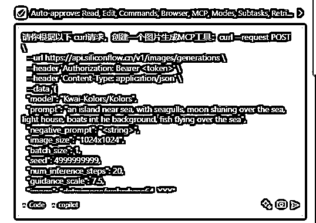

开始创建工具创建过程，要注意有个安装确认的地方，需要手动输入一下 Y，继续

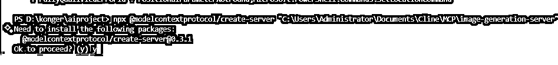

还有这几个选项，默认回车就行了

有几个踩坑点，就是windows系统 很难一次性成功，一直会有路径问题，要调试老半天。如果有朋友们实在调不通的，可以找我拿一下我做的源码，环境差不多的话可以直接用，不顺利的话也可以给AI参考。

#### ②、案例1：自动生成图片，并做成网站

在Roo-Code下面输入以下提示词开始建站：

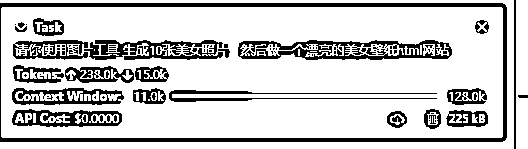

然后工具就会自行生成图片，最终将图片放入网页做成网站

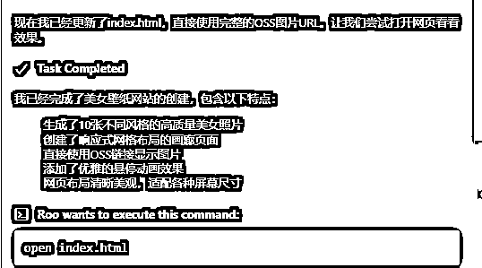

好了我们打开看一下，哈哈，免费的模型生成图片就是丑呀..

但是打通了这个环节，我们如果接入comfyui 的接口，那就是各种图片都没问题了。

#### ③、案例2：自动生成文章自动配图

接下来我来尝试一下用这个来写文章和配图，看看怎么样，输入如下提示词：

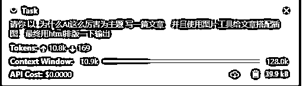

等待AI生成完毕，查看一下效果，还是挺不错的：

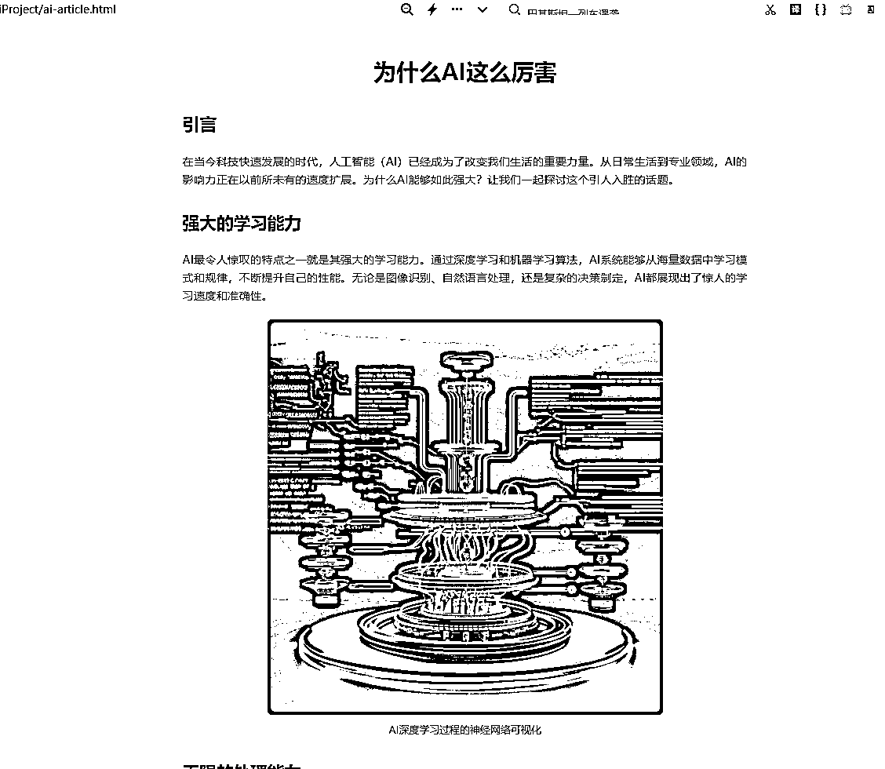

这些只是简单示例，更多的优化和更多的使用场景，等着你们开动脑筋探索起来。

比如，如果接入PPTapi 是不是就能自己生成ppt了？

比如，接入视频生成api，是不是就可以一键生成视频了呢？

真的！无限可能；而且应该会越来越完善。

这里只是介绍了vscode，其他的编程工具大同小异。

# 最后，推荐几个MCP 市场给大家，集成MCP不用愁

## 1、魔塔社区（推荐）

https://modelscope.cn/

如果你是做AI的，应该不可能不知道这个魔塔社区了，作为国内大型的模型库，里面集合了各种各样的AI模型。

最近，跟着趋势，它也开放了MCP server

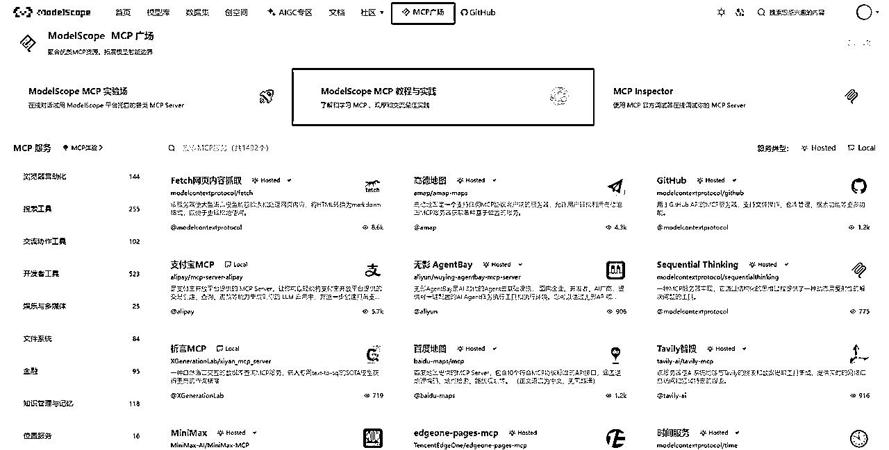

推荐大家去看看，因为它不仅有mcp市场，而且还贴心的为大家提供了MCP的教程，而且可以在线调试MCP，非常友好。

对了，支付宝开发的 支付交易相关的MCP首发在魔塔社区，这个可是其他市场没有的！！

## 2、阿里云百炼

https://bailian.console.aliyun.com/?tab=mcp#/mcp-market

## 3、腾讯云开发

https://tcb.cloud.tencent.com/

腾讯云开发默默上线了MCP的支持，最大的特点是，它还有个自带的Agent智能体开发，可以直接调用MCP，然后可以把Agent部署到我们的公众号，甚至小程序上。这个应该是目前市场独有的吧，还没发现其他家的智能体可以集成mcp。

## 4、smithery

https://smithery.ai/

## 5、pulsemcp（推荐）

https://www.pulsemcp.com/

最后这两个是当时mcp刚出来时候，我用的两个老外的网站，当时国内这几个估计都还没出来。我觉得种类也挺齐全的，如果国内几个没有合适的工具，也可以上这两个网站找找