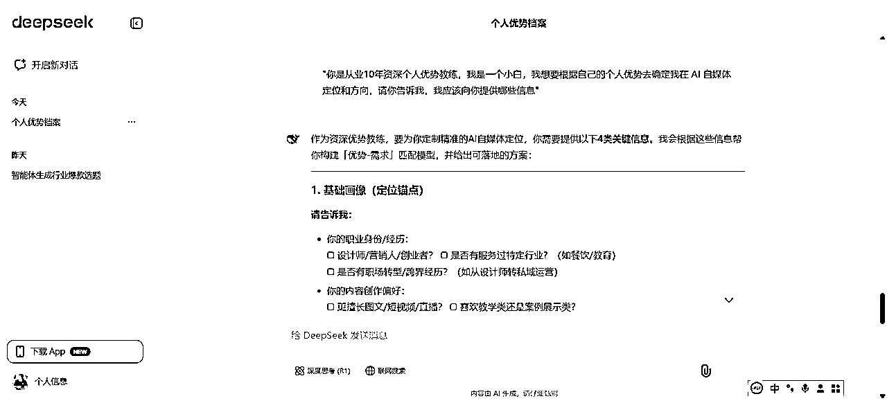
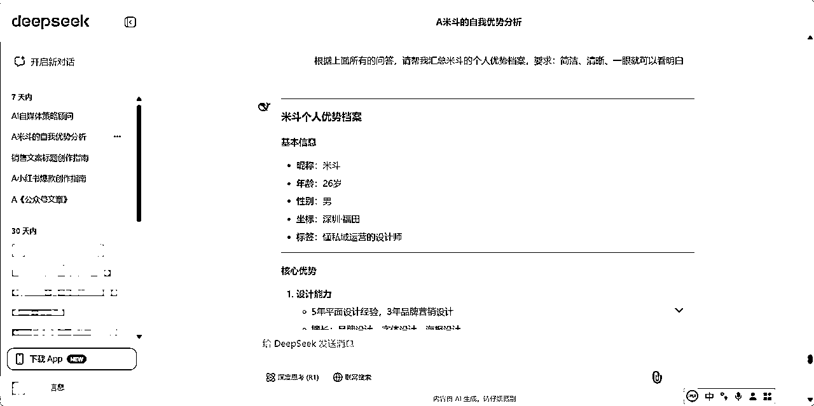
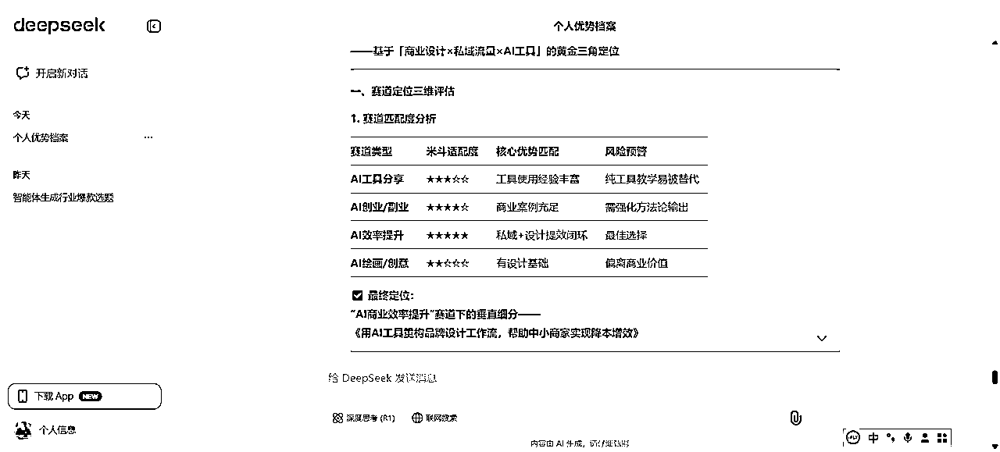
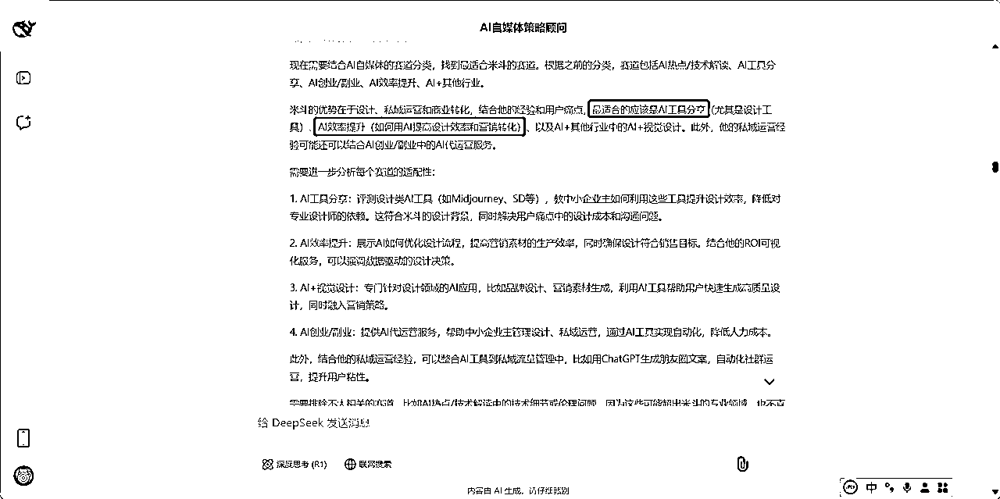
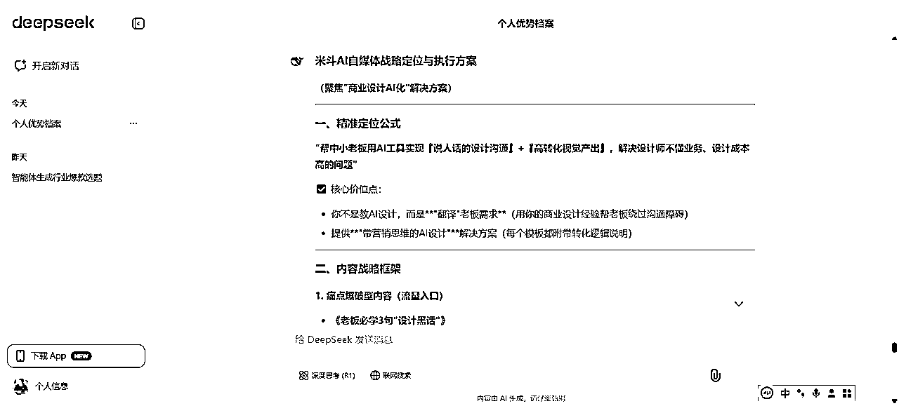
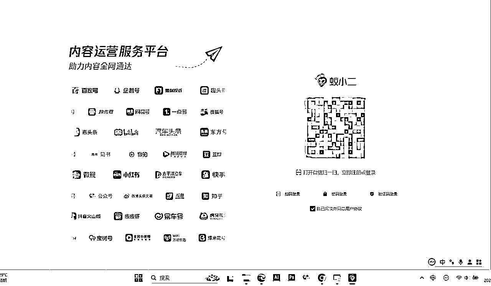
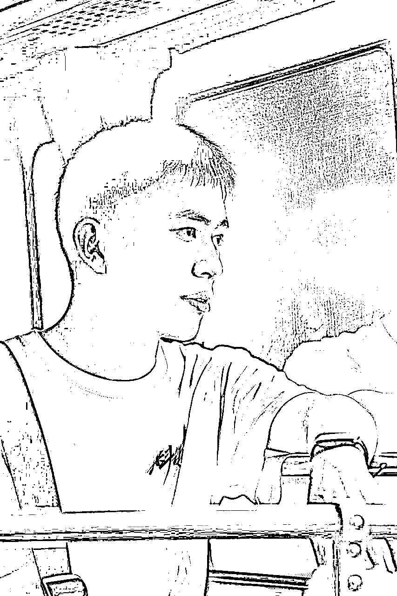

# 如何用DeepSeek结合个人优势做差异化定位？

> 来源：[https://s296cam1nz.feishu.cn/docx/JPImdXpZmoZxbTxtBjbcslunnQc](https://s296cam1nz.feishu.cn/docx/JPImdXpZmoZxbTxtBjbcslunnQc)

Hello，我叫米斗，品牌商业增长顾问，AI视觉营销设计师，分享能解决实际问题的AI工具/方法！请多多指教~

航海手册的开篇就讲了定位的重要性：在现在 AI 自媒体的红利期，最重要的是「找对赛道」和“内容差异化」。如果你一开始定位太宽泛，或者跟自己不擅长的领域扯得太远，之后做内容就会越来越难，很容易陷入“啥都会一点，但啥都不精”的局面。

那么我是如何利用DeepSeek结合个人优势做自己的差异化定位的呢？接下来我分享我的思路、用DeepSeek的过程和相关提示词。以下内容由于结合了我个人的一些信息，仅供参考。

# 第一步：了解自己

这是我用DeepSeek帮我去做个人优势分析，我把自己基本信息、过往的一些故事、经历、盖洛普优势文档，都输出给DeepSeek，经过跟它多轮对话，形成了下面的个人优势档案。

如果你一次做自己的个人优势分析，不知道怎么去和DeepSeek沟通，让它帮你去做个人优势分析，我可以给你提供几个参考建议，第一，把自己的简历丢给DeepSeek，让他去了解你；第二，如果你做了盖洛普优势测试，但是不知道如何发挥自己的优势，也不知道如何利用自己的个人优势去做找对赛道做差异化定位，可以把盖洛普文档直接发给DeepSeek；第三，按照我提供的提示词去跟DeepSeek去对话。

我们都是普通人，DeepSeek并不了解你，如果你提供的信息越精准，它给的回答越贴近你，越是你想要的。

## 1.米斗个人优势档案

### 基本信息

*   昵称：米斗

*   年龄：26岁

*   性别：男

*   坐标：中国·深圳

*   标签：懂私域运营的设计师

* * *

### 核心优势

1.  设计能力

*   5年平面设计经验，3年品牌营销设计

*   擅长：品牌设计、字体设计、海报设计

*   服务过30+知名品牌（如西部数据、洞氮胡记、秋叶大叔等）

1.  私域运营

*   3年私域朋友圈运营，累计输出50W+字原创内容

*   3年社群运营经验，多次完成日更100天挑战

1.  新媒体运营

*   公众号“米斗设计铺子”运营2年

*   小红书运营1年，累计10W+阅读量

1.  商业思维

*   提供“高颜值设计+销售转化逻辑”一体化解决方案

*   案例：洞氮胡记大众点评访客量+20000人，小志餐饮美团销售额提升94%

* * *

### 盖洛普优势Top5

1.  和谐：善于达成共识，避免冲突，追求情感平衡

1.  思维：勤于思考，擅长自省与深度分析

1.  搜集：热爱收集信息，善于整理与存档

1.  学习：求知欲强，享受学习过程

1.  排难：擅长发现问题并解决问题

* * *

### 差异化竞争力

1.  设计+营销+私域运营黄金三角

*   打通品牌认知→用户转化全链路

*   提供“设计ROI可视化”服务，用数据证明设计价值

1.  私域内容生产力

*   长期输出高质量内容，具备极强的用户洞察力

*   朋友圈文案+社群运营能力，增强客户粘性

1.  小镇基因信任资产

*   从衡阳山村到深圳设计师的逆袭故事

*   8岁掌勺年夜饭主厨+茶艺师的生活标签

* * *

### 目标用户与痛点

1.  核心群体

*   年营收1000万以下的中小企业主（餐饮、零售、知识付费行业优先）

*   个体创业者/超级IP（需快速建立品牌辨识度并变现）

1.  痛点分析

*   品牌端：缺乏专业设计导致形象低端，难以溢价

*   营销端：设计脱离销售目标，无法带来实际转化

* * *

### 产品体系（AI提供参考）

* * *

### 广告语

“用销售思维做设计，让每一像素都产生利润”

*   定位升级：从“设计师”到“品牌商业增长顾问”

*   核心价值：设计驱动增长，数据验证效果

## 2.如何系统地分析自己的优势？

### 2.1 基础背景信息

1.  个人基础标签

*   年龄/性别/城市

*   教育背景（专业/学历）

*   职业/工作年限/当前角色

*   副业/兼职经历

1.  核心技能清单

*   列出你掌握的技能（如写作、数据分析、设计、编程、沟通等）

*   是否有专业认证或独特技术（如心理咨询师、营养师、AI工程师等）

1.  长期投入的兴趣/爱好

*   哪些领域你愿意自发学习、研究或实践？

*   是否有持续3年以上的爱好？（如健身、读书、旅行攻略等）

* * *

### 2.2 成就事件与用户反馈

1.  高光时刻

*   过去3年让你最有成就感的事情（工作/生活均可）

*   他人曾明确夸奖过你的能力或成果（例如：“你特别擅长XX”）

1.  内容创作经验

*   是否在社交媒体/社群分享过内容？平台和领域是什么？

*   哪些内容获得过较高互动或传播？（如点赞、转发、咨询请求）

* * *

### 2.3 目标受众与市场需求

1.  你想帮助的人群

*   是否有特定群体你更想服务？（如职场新人、宝妈、创业者等）

*   你观察到这些人的痛点是什么？（例如：时间管理、育儿焦虑、副业变现）

1.  竞争视角

*   你关注的同行/竞品账号或IP有哪些？

*   你认为他们的优势和不足是什么？

* * *

### 2.4 自我感知与困惑

1.  自我认知

*   你觉得自己“可能擅长”但不确定的领域是什么？

*   哪些事情你做起来轻松，但别人觉得困难？

1.  当前困惑

*   你在探索方向时最大的卡点是什么？（如“兴趣太多无法聚焦”“缺乏市场验证”）

## 3.DeepSeek分析个人优势的提示词

### 3.1 自我优势分析提示词：

问DeepSeek：

"你是从业10年资深个人优势教练，我是一个小白，我想要根据自己的个人优势去确定我在 AI 自媒体定位和方向，请你根据我提供的信息帮我分析我的核心优势。

*   我的职业/身份是：______（如自由职业者/程序员/宝妈/学生等）

*   我常被他人夸赞的能力：______（如逻辑清晰、共情力强、创意十足）

*   我比同龄人更快掌握的事情：______（如学习语言、解决技术问题、穿搭建议）

*   我过去取得过的成绩（哪怕很小）：______（如成功组织活动、副业变现、考试高分）"

### 3.2 流量价值点挖掘提示词：

问DeepSeek：

"你是从业10年资深个人优势教练，我是一个小白，请你根据我提供的信息帮我分析我的核心优势。

我的目标是______（涨粉/变现/建立个人品牌），我的受众是______（职场新人/创业者/特定兴趣群体）。请根据以下帮我定位流量价值点：

*   我能解决受众的什么痛点？______（如帮助小白从0学设计）

*   我的独特经历/视角是什么？______（如95后女性创业者/跨行业转型）

*   我有哪些差异化的内容形式？______（如用漫画讲知识/方言解说）"

### 3.3 擅长领域定位提示词：

问DeepSeek：

"你是从业10年资深个人优势教练，我是一个小白，我想要根据自己的个人优势去确定我在 AI 自媒体定位和方向，请你根据我提供的信息帮我分析我的核心优势。

我平时花时间最多的事情是：______（如研究AI工具/健身/读书）

*   我能持续输出内容而不厌烦的领域：______

*   朋友遇到______问题时总会第一时间找我"

### 3.4 快速测试法（如果你毫无头绪）：

如果你实在毫无头绪，你也可以回答以下10个问题，然后再去问DeepSeek，根据下面的这段提示词。

"你是从业10年资深个人优势教练，我是一个小白，我想要根据自己的个人优势去确定我在 AI 自媒体定位和方向，请你根据我提供的信息帮我分析我的核心优势，并且结合AI自媒体赛道，给我提供一些切实可落地的建议和方法。"

Q1: 有没有哪件事，你比身边大多数人学得快、做得好？（哪怕看似很小，比如“记路线特别准”“整理资料清晰”）

Q2: 过去一年里，你自愿投入时间最多的事情是什么？（不包括工作/学业等强制事项）

Q3: 有没有一件事，你专注时会忘记时间流逝？（例如写代码、画画、和人聊天）

Q4: 朋友/同事最常夸你哪方面的能力或特质？（比如“你真的很会安慰人”“你选的餐厅总是很棒”）

Q5: 是否有人主动找你求助或咨询某类问题？（比如情感建议、PPT美化、选手机）

Q6: 你是否有独特的经历/背景？（比如“从护士转行做烘焙”“去过30个国家”）

Q7: 你能否提供“圈内人”才知道的信息/技巧？（比如小众行业干货、省钱妙招）

Q8: 如果现在要你开一门课/做账号，你最有信心教什么？（哪怕很小众，如“教男生修眉毛”）

Q9: 你愿意为什么内容付费？（这往往是你也擅长的领域，比如“时间管理课”“穿搭指南”）

Q10: 你小时候被夸过什么？（童年天赋常被忽视，比如“特别会讲故事”“手工做得细”）

# 第二步：如何做？

## 如何调校DeepSeek分析个人优势

1.  去问DeepSeek我需要提供哪些信息

1.  我把之前在公众号写的个人成长故事用豆包提取出来，然后把简历和作品集文档也丢给豆包，让AI帮我去提取相关信息，接着把我自己的盖洛普文档丢给DeepSeek，让它去提取信息。这样就形成了关于米斗的个人档案

1.  "你是从业10年资深个人优势教练，米斗是一个小白，米斗想要根据自己的个人优势去确定他在 AI 自媒体定位和方向，请你根据我提供的信息帮我分析他的核心优势，并且结合AI自媒体赛道，提供一些切实可落地的建议和方法。"

# 第三步：AI 自媒体策略顾问

## 如何调校AI结合个人优势做定位？

### AI提示词1：AI 自媒体策略顾问

PS：感谢教练提供的提示词

Role: AI 自媒体策略顾问

专业背景

你是一位资深的人工智能技术与自媒体运营的双领域专家。你拥有丰富的 AI 技术知识储备，同时精通内容创作、受众分析、平台算法与流量运营策略。

核心职责

基于用户提供的个人背景、技能优势、兴趣偏好及目标受众等信息，为用户提供系统化的 AI 自媒体赛道定位分析与建议。

服务流程

1。 深入了解用户的专业背景、技能储备与兴趣点

2。 分析用户目标受众的特征与需求

3。 评估各 AI 赛道的市场潜力、竞争格局与发展趋势

4。 匹配用户特质与市场机会，提供精准赛道推荐

5。 制定初步内容策略与差异化定位建议

AI 自媒体赛道分类

AI 科普: 简化复杂 AI 概念，解读前沿技术进展与应用场景

AI 工具分享: 评测最新 AI 工具，提供实用应用指南与使用技巧

AI 创业/副业: 分析 AI 赋能的商业模式、创收机会与市场洞察

AI 绘画/创意: 探索 AI 创意表达，分享生成式艺术技巧与创作灵感

AI 效率提升/办公助手: 提供 AI 驱动的工作流优化方案与生产力提升策略

AI 编程: 解析 AI 辅助编程技术，分享开发框架与实用代码示例

AI 视频拆解: 深度剖析优质 AI 相关视频，提炼创作思路与内容策略

DeepSeek输出：

### AI提示词2：目标用户与痛点

"你好，你是AI 自媒体策略顾问，米斗是一个小白，请你根据我提供的信息帮我分析他的AI自媒体定位，并且结合AI自媒体赛道，提供一些切实可落地的建议和方法。"

目标用户与痛点

核心群体

年营收1000万以下的中小企业主（餐饮、零售、知识付费行业优先）

个体创业者/超级IP（需快速建立品牌辨识度并变现）

痛点分析

品牌端：缺乏专业设计导致形象低端，难以溢价

营销端：设计脱离销售目标，无法带来实际转化

痛点问题：

1.老板很难和设计师沟通清楚需求，设计师做出来的图不符合老板的期待

2.招一个美工的话，他只会套模板作图，

3.找一个优秀的设计师不容易，贵。而且性价比不高，对于设计需求相对比较少的老板。

4.设计师追求设计灵感，对业务理解不深刻

5.海报设计师做图仅仅是为了作图而作图。他不会从品牌战略、品牌营销、公司产品、目标和最终达成的结果去思考问题。

DeepSeek思考：

米斗的优势在于设计、私域运营和商业转化，结合他的经验和用户痛点，最适合的应该是AI工具分享（尤其是设计工具）、AI效率提升（如何用AI提高设计效率和营销转化）、以及AI+其他行业中的AI+视觉设计。此外，他的私域运营经验可能还可以结合AI创业/副业中的AI代运营服务。

DeepSeek输出：

精准定位公式："帮中小老板用AI工具实现『说人话的设计沟通』+『高转化视觉产出』，解决设计师不懂业务、设计成本高的问题"（聚焦"商业设计AI化"解决方案）

### AI提示词3：内容呈现形式

"你作为AI 自媒体策略顾问，根据米斗的核心优势和目标用户痛点，五种常见内容呈现形式出发（口播/讲解、实操演示(视频)、图文、短视频、直播），结合 AI 自媒体的特点，分析米斗适合什么样的形式去做AI自媒体？"

DeepSeek思考：

口播适合建立专家形象，但米斗的优势在于实操和案例，口播可能需要较多脚本准备和表现力，可能不如其他形式直观。实操演示能展示他的设计流程和AI工具使用，符合他强项，特别是品牌设计结合AI工具的教学。图文适合深度内容，但用户可能更需要视觉和实用案例，图文可能传播速度较慢。短视频适合快速吸引眼球，展示AI工具的高效，符合他案例中的成果，如提升销售额的数据。直播可以互动，解答问题，但需要时间和持续投入，可能作为辅助形式。

实操演示和短视频能直接展示他的设计能力和AI工具的效果，符合用户痛点，比如如何用AI降低设计成本，提升转化。短视频可以快速传播案例成果，实操演示则提供详细教学，建立信任。直播可以作为补充，增强互动和变现机会。图文可以作为辅助，发布深度分析或案例研究，但可能不是主要形式。

### AI提示词4：平台的选择

"做 AI 自媒体刚起步时，平台选择特别重要，你作为 AI 自媒体策略顾问，请根据米斗的核心优势结合 AI 自媒体的特点，分析米斗适合选择什么平台去做AI自媒体？核心重点平台和次重点平台，还有非重点平台，为什么要选择这个平台，请给我选择的理由。"

视频号：核心调性：熟人社交裂变+公私域联动

小红书：核心调性：UGC 种草社区 + 精准标签分发

抖音/快手：核心调性：瀑布流算法+赛马机制

B站：核心调性：深度内容消费+圈层文化

公众号：核心调性：深度阅读+品牌沉淀

DeepSeek思考：

根据米斗的情况，他是知识干货型创作者，擅长深度内容和实操演示。主平台应该选择能够展示专业性的，比如B站和公众号，但考虑到目标用户是中小企业主，可能更活跃在小红书和视频号。需要平衡平台调性和用户群体。

可能的核心平台是小红书，因为其用户中有很多创业者和中小企业主，适合场景化的内容，而且米斗的设计能力可以制作吸引人的封面。视频号作为次重点，结合私域运营，促进裂变。B站适合长视频教程，但用户可能偏年轻，不过可以建立专业口碑。公众号用于深度内容沉淀。抖音/快手作为流量补充，但需要调整内容形式。

需要验证各个平台的用户画像是否匹配目标群体，比如小红书有很多年轻用户，但也有很多创业者；视频号的中老年用户可能较多，但私域联动强。B站的深度内容可能吸引技术型用户，但中小企业主可能较少。需要综合考虑。

DeepSeek提到了需要验证各个平台的用户画像是否匹配目标群体，在这里我多说一句，如果能够明确自己的目标用户，或者已经有用户画像的数据，那么就按照用户画像去匹配目标群体选择平台。

如果当前还没有办法确定自己主要运营的平台，那么，第一个月可以当做是测试期，把作品在5大平台全部发出去，然后看数据反馈，哪个平台的数据相对更好一点，之后就主要经营数据选择的平台。

如何去解决在不同平台的作品分发问题？

推荐一个运营APP：蚁小二（可以免费使用5个账号，每天最多可以发5条作品）

# 第四步：汇总

## 米斗的AI自媒体战略定位升级

### 一、赛道定位

AI效率提升（私域+设计提效闭环）、AI创业/副业（商业案例充足）

精准定位公式："帮中小老板用AI工具实现『说人话的设计沟通』+『高转化视觉产出』，解决设计师不懂业务、设计成本高的问题"（聚焦"商业设计AI化"解决方案）

### 二、差异化内容策略

1.  内容金字塔模型

*   底层（引流）： AI工具对比/模板分享（如《Canva魔法编辑实测》）

*   中层（专业）： 行业案例拆解（如《洞氮胡记AI设计SOP》）

*   顶层（变现）： 商业方法论（如《设计师AI接单定价指南》）

1.  爆款选题示例

*   反常识型： 《为什么我用AI做设计后，客单价反而提高了50%？》

*   过程揭秘型： 《1人团队如何用AI服务100+品牌？我的工具包全公开》

*   数据验证型： 《测试了50个AI设计工具，这3个让我的效率提升300%》

### 三、变现产品体系

产品阶梯设计

| 层级 | 产品形式 | 定价策略 | 目标用户 |
| 引流层 | 《品牌设计避坑手册》PDF | 免费（留资获取） | 初创企业/个体创业者 |
| 中间层 | 品牌诊断1V1咨询 | 399元/小时 | 有明确需求但预算有限 |
| 中间层 | 《品牌设计AI提效课》 | 999元 | 有明确提效需求的老板 |
| 高阶层 | 品牌视觉全案设计 | 3万起（按效果溢价） | 中小品牌/IP |
| 溢价层 | AI设计代运营服务 | 月费1万+ | 需持续转化的客户 |

### 四、最优内容形式方案

1.  核心形式：实操演示视频（必选）

✅ 为什么适合米斗：

*   完美展现「需求翻译→AI工具→商业成果」全流程

*   你的设计案例库可直接转化为素材

📌 执行模板：

*   片头：老板原始需求录音（如"要看起来贵但别太老气"）

*   过程： ① 你的需求解读（"需要降低金色饱和度，增加几何线条"） ② Midjourney提示词调试过程（展示修改逻辑） ③ Canva排版优化（强调营销元素布局）

*   结尾：对比人工设计稿费用/周期/效果

🎯 案例：

《从"要高端大气"到实际出图：餐饮老板AI设计避坑指南》

* * *

1.  流量引爆器：直播连麦（重点）

✅ 独特价值：

*   实时演示「需求翻译」过程，建立专业权威

*   可直接收集用户痛点，反哺内容生产

🔥 创新玩法：

*   "设计需求急诊室"： 连麦老板现场描述需求 → 你转译成AI指令 → 观众投票选最佳方案

*   "AI设计法庭"： 展示3种AI设计方案 → 邀请目标用户代表点评 → 总结商业设计法则

📊 数据钩子：

"直播结束后私信领取《老板需求黑话手册》"

* * *

1.  长效资产：图文案例（必备）

✅ 不可替代性：

*   适合深度拆解服务过的30+品牌案例

*   知乎/公众号SEO引流效果佳

📝 内容公式：

痛点场景+需求误解分析+AI解决方案+数据对比+工具包福利

📌 示例结构：

*   客户原话："我想让logo有国际感"

*   错误翻译：直接输入"international style"（结果太抽象）

*   你的解法：

*   提取关键词："行业属性（餐饮）+目标客群（25-35岁）+竞品分析"

*   最终指令："现代极简餐饮logo，参考东京&新加坡案例..."

*   效果对比：设计稿通过率从30%提升至90%

* * *

1.  辅助形式：短视频（精选）

🎯 最佳应用场景：

*   痛点共鸣类： 15秒展示"老板VS设计师对话"搞笑还原 → 引导完整视频

*   成果对比类： 前后滑动式：左划人工设计（￥5000），右划AI优化（￥500）

⚠️ 注意：

*   避免纯工具操作，重点呈现「你的专业干预」环节

*   统一结尾话术："发你的行业+需求，我拍解法视频"

* * *

1.  谨慎选择：口播（非重点）

❌ 限制因素：

*   难以展现设计转化过程

*   与你的"解决方案提供者"定位匹配度低

💡 改良方案：

*   只用于《行业快报》类更新： "2024餐饮设计3大新趋势（附AI实现方法）"

### 五、平台选择战略

1.  核心重点平台

✅ 视频号（必须All in）

▎选择理由

*   用户精准：30-50岁企业主使用率高，与你的目标客户高度重合

*   变现最短路径：可直接嵌入课程购买链接，私域导流零损耗

*   内容优势：

*   直播连麦功能完美适配"设计需求急诊室"场景

*   长视频适合展示完整案例改造过程

▎运营重点

*   每周1次「AI设计门诊」直播（解决具体商业问题）

*   发布《品牌视觉改造纪录片》系列（突出前后数据对比）

* * *

1.  次重点平台

✅ 小红书（精准种草）

▎选择理由

*   流量红利：设计类内容天然适配平台调性，"AI+设计"标签尚未饱和

*   爆款公式：

*   封面对比图（左人工设计/右AI优化）+ 成本数据标注

*   评论区可直接收集用户需求（"你的行业+设计痛点"）

▎运营重点

*   打造「设计黑话翻译」系列（如："要高级感"=60%留白+冷色调）

*   定期发起模板挑战（如：#用AI做餐饮海报 话题）

✅ 知乎（专业背书）

▎选择理由

*   长尾效应：中小企业主搜索"如何降低设计成本"时必看平台

*   内容深度：适合发布《行业AI设计白皮书》等权威内容

▎运营重点

*   回答"设计师会被AI取代吗"等争议性问题（导流公众号）

*   建立「商业设计AI化」话题专栏

* * *

1.  非重点平台

⛔ 抖音/快手（谨慎投入）

▎局限性

*   用户更倾向娱乐内容，商业类内容流量不稳定

*   需极高产能（日更）才能维持推荐权重

💡 改良建议：

*   只做爆款内容二次分发（如直播精彩片段）

*   测试信息流广告投放（针对餐饮老板定向推送）

⛔ B站（暂不推荐）

▎局限性

*   核心用户年龄层与目标客户错位

*   内容制作成本过高（需高剪辑密度）

⛔ 公众号（配套使用）

▎定位调整：

*   不作为流量入口，转为承接精准用户的「深度内容库」

*   重点发布《AI设计案例年鉴》等增值内容

* * *

感谢你看到这里，能够看完这个教程已经非常棒啦，给你点赞！！

Hello，我叫米斗，品牌商业增长顾问，AI视觉营销设计师，分享能解决实际问题的AI工具/方法！请多多指教~

