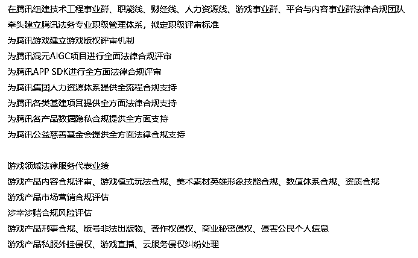
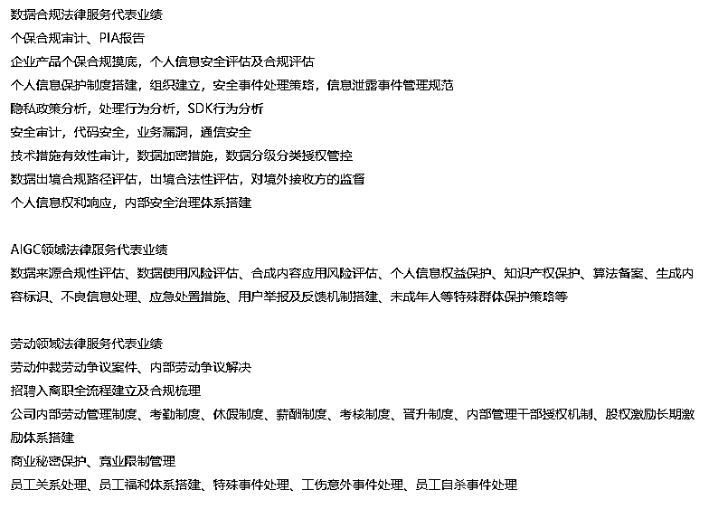
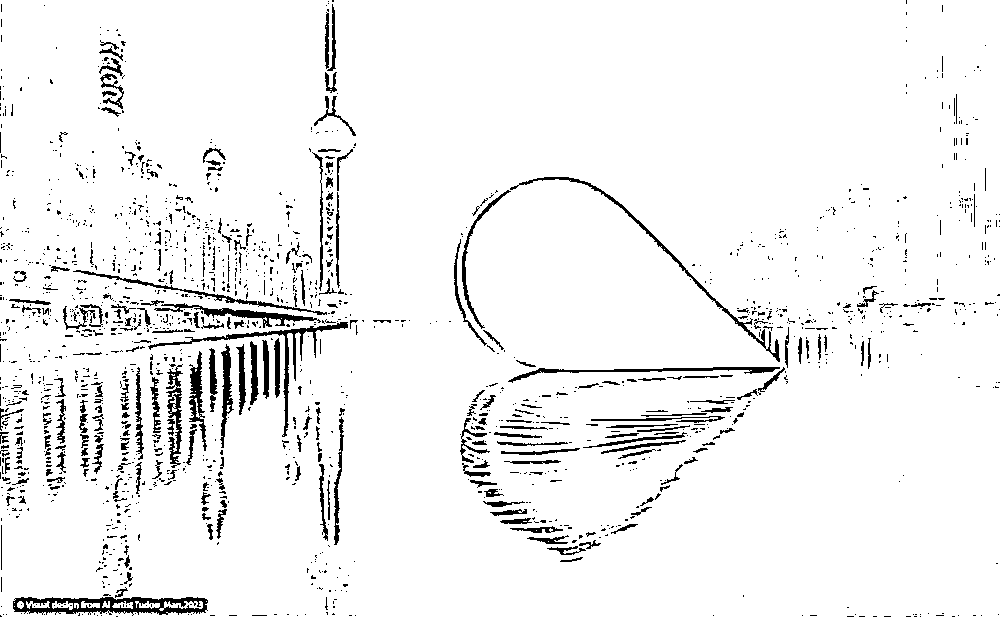
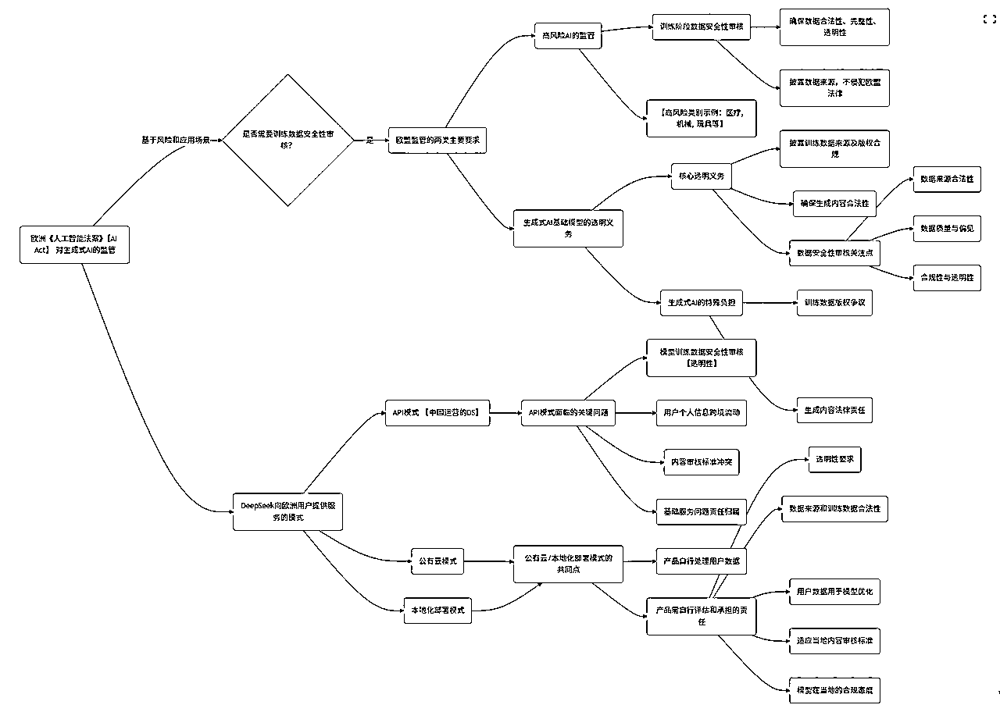
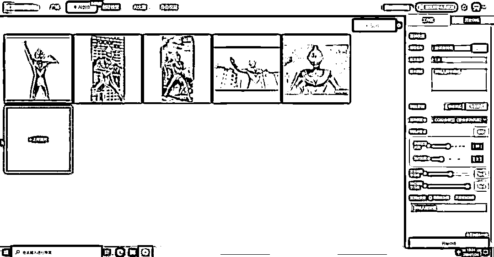

# AI创富，你应该关注的埋点

> 来源：[https://iik3odicycr.feishu.cn/docx/GESYdOF1Iorsm4xqP9BcScDhnRX](https://iik3odicycr.feishu.cn/docx/GESYdOF1Iorsm4xqP9BcScDhnRX)

## 写在前面的话

本文并非完全原创，而是通过课程内容，元宝ai问答，通过agi摘录等多个途径汇总。

本文旨在提醒广大圈友，在使用ai进行提效或商业化的过程中，必须要关注违规违法问题和自身的权益。

## 主流产品的协议之谜

### Deep-seek

5.1 深度求索为本服务的开发、运营主体，对本服务（包括但不限于软件、技术、程序、代码、模型权重、用户界面、网页、文字、图表、版面设计、商标、电子文档等）享有法律法规允许范围内的全部权利（包括但不限于著作权、商标权、专利权和其他知识产权），但相关权利人依照法律规定或本协议的约定应享有权利（如输入与输出）的除外。

有点慌是不是，我们来看下它说的输入输出部分的关键

4.2 在符合法律规定和我们的条款的条件下，您对本服务的输入与输出享有以下权利：（1）您保留在提交的输入中拥有的任何权利、所有权和利益（如有）；（2）我们将本服务输出的内容的任何权利、所有权和利益（如有）归属于您。（3）您可将本服务的输入与输出应用于广泛的使用场景中，包括个人使用、学术研究、衍生产品开发、训练其他模型（如模型蒸馏）等。

### 元宝

https://rule.tencent.com/rule/202403110001

5.3您上传至本服务平台的内容以及您使用本服务生成的内容，权利归您或依法享有该知识产权的权利人所有，您使用本服务不会对前述内容及本服务生成的内容的权利归属产生影响。请您在使用前述内容时，注意遵守相关法律规定。

腾讯的协议，求生欲很强，法务是很有水平的。

### 百度文心一言

https://yiyan.baidu.com/infoUser

5.4 您知悉、理解并同意，如果您按照法律规定对您的输入（包括您使用本服务过程中自行上传、发布的全部内容）和/或输出享有权利的（包括但不限于知识产权、肖像权等），您使用本服务均不会造成前述合法权利的转移或减损，除非我们与您另有约定。与此同时，您理解并同意百度将在法律允许的范围内为实现本服务目的对您上传、发布的内容进行存储及使用（包括但不限于复制、分发、传送、公开展示、编辑等）。

百度写的有点绕。

### 阿里通义千问

10.2 您可以向本服务提供输入内容（“输入”），并接收基于输入产生的输出内容（“输出”），输入和输出统称为“内容” 。您保证，在使用通义产品及相关服务时输入的文字、图片、视频、音频等内容均由您原创或已获合法授权（含转授权），不侵犯任何人的知识产权、肖像权、名誉权、姓名权、隐私权、个人信息权益、商业秘密等合法权益。

10.3 您通过通义输入的内容的知识产权和/或相关权益归属您或原始权利人所有。关于“输出”，在您与通义公司之间，且在适用法律允许的范围内，您拥有输出内容的任何权利、所有权和权益（如有）。您知悉并授权，在经安全加密技术处理、严格去标识化且无法重新识别特定个人的前提下，我们可能会使用内容来提供、维护、开发和改进我们的服务，遵守适用的法规政策、执行我们的条款和通义产品规则，以及确保我们的服务安全。

### Claude

https://www.anthropic.com/legal/consumer-terms

1.  Inputs, Outputs, and Materials.

You may be allowed to interact with our Services in a variety of formats (we call these “Inputs”). Our Services may generate responses based on your Inputs (we call these “Outputs”). Inputs and Outputs collectively are “Materials.”

Rights to Materials. You are responsible for all Inputs you submit to our Services. By submitting Inputs to our Services, you represent and warrant that you have all rights, licenses, and permissions that are necessary for us to process the Inputs under our Terms and to provide the Services to you, including for example, to integrate with third-party services and to share Materials with others at your direction. You also represent and warrant that your submitting Inputs to us will not violate our Terms, our Acceptable Use Policy, or any laws or regulations applicable to those Inputs. As between you and Anthropic, and to the extent permitted by applicable law, you retain any right, title, and interest that you have in the Inputs you submit. Subject to your compliance with our Terms, we assign to you all of our right, title, and interest—if any—in Outputs.

Reliance on Outputs. Artificial intelligence and large language models are frontier technologies that are still improving in accuracy, reliability and safety. When you use our Services, you acknowledge and agree:

1.  Outputs may not always be accurate and may contain material inaccuracies even if they appear accurate because of their level of detail or specificity.

1.  You should not rely on any Outputs without independently confirming their accuracy.

1.  The Services and any Outputs may not reflect correct, current, or complete information.

1.  Outputs may contain content that is inconsistent with Anthropic’s views.

### Chatgpt

https://openai.com/policies/terms-of-use/

Your content. You may provide input to the Services (“Input”), and receive output from the Services based on the Input (“Output”). Input and Output are collectively “Content.” You are responsible for Content, including ensuring that it does not violate any applicable law or these Terms. You represent and warrant that you have all rights, licenses, and permissions needed to provide Input to our Services.

Ownership of content. As between you and OpenAI, and to the extent permitted by applicable law, you (a) retain your ownership rights in Input and (b) own the Output. We hereby assign to you all our right, title, and interest, if any, in and to Output.

Similarity of content. Due to the nature of our Services and artificial intelligence generally, output may not be unique and other users may receive similar output from our Services. Our assignment above does not extend to other users’ output or any Third Party Output.

Our use of content. We may use Content to provide, maintain, develop, and improve our Services, comply with applicable law, enforce our terms and policies, and keep our Services safe. If you're using ChatGPT through Apple's integrations, see this Help Center article⁠(opens in a new window) for how we handle your Content.

### gork-3

因为某些原因无法访问，暂时缺省

### Monica

您理解并同意，您在使用本服务时所输入的内容不得侵犯任何人的合法权益，包括但不限于知识产权、肖像权、名誉权、荣誉权、姓名权、隐私权及个人信息权益等。同时，您的输入不得涉及国家秘密、商业秘密、重要数据或其他可能危害国家安全或公共利益的内容。如因您的行为导致侵权或其他违法后果，相关风险与责任均由您自行承担。若因此给本公司造成任何直接或间接损失（包括但不限于经济损失、商誉损害、维权费用及律师费等），您需全额赔偿。

## 个人和企业或组织使用ai的相关风险by@张鑫律师

张鑫

曾先后任职于深圳市公安局、上海市锦天城律师事务所深圳分所

2008年4月加入腾讯公司法务团队，腾讯司龄近16年。

2015年任职腾讯平台法务中心总监，2018年晋升为13级法律专家，法律与公共策略专业通道评委。

2024年1月加入广东广悦（深圳）律师事务所。超过20年的法律工作经验。

从第一部分个主流产品的协议部分来看，它们都把输入输出的部分权益，归属给了用户，

但是，这并不意味着不存在侵权风险。

值得注意的是，如果不用于商用，基本没有太大的风险，但是，我们这里要看的就是商用

### AI幻觉

我们都知道ai幻觉一般是指ai在处理过程中出现了ai凭空捏造事实的情况或者是虚假信息，或者是偷懒直接篡改，或输出偏离。

这件事情本身不致命，致命的是有人当真了，然后用于某些场景，产生了不可预计的后果，如gpt幻觉编造的内容被用于诉讼案证据支持。最后被发现是捏造的，这个在我们的法律定义上叫做提供不实证据。

我们来看下法律界的定义

核心条款：

《民事诉讼法》第114条：明确伪造证据的罚款、拘留及刑事责任

《刑法》第307条之一：界定虚假诉讼罪的构成要件

司法态度：法院对虚假证据“零容忍”，通过技术审查、关联证据比对等方式主动核查证据真实性。

### ai黄色小说案

湖北省大冶市人民法院审理了一起，利用人工智能（AI）技术撰写色情小说并牟利案件，被告人柯某因犯制作、贩卖、传播淫秽物品牟利罪被判处有期徒刑十个月，并处罚金人民币五千元、退缴违法所得。

公诉机关指控，2022年11月至2023年3月期间，被告人柯某（大专文化，网文作者）以牟利为目的，利用AI程序撰写色情小说，并使用翻墙软件在境外黄色网站发布，同时在另一网站售卖。短短五个月时间，柯某共计发布色情小说数十篇，每篇小说1万字-3万字，每篇15元-30元，总计售卖760篇次，共计获利人民币2万余元。经鉴定，送检的7篇小说均为淫秽物品。

法院经审理认为，被告人柯某以牟利为目的，利用某AI文本生成工具，制作、贩卖、传播淫秽物品，非法获利2万余元，其行为严重违反了我国相关法律法规，对社会风气造成了不良影响，已构成制作、贩卖、传播淫秽物品牟利罪，公诉机关指控罪名成立。被告人柯某到案后能如实供述其犯罪事实、自愿认罪认罚、退缴违法所得，可依法从轻处罚、从宽处理。根据本案犯罪事实、量刑情节、公诉机关量刑建议，法院遂作出上述判决。

柯某利用AI技术制作、贩卖色情小说案，是我国司法实践中，首次明确将AI生成淫秽内容纳入刑事打击范围的典型案例。根据我国刑法第七条规定，属人管辖原则适用于中国公民在境外实施的犯罪行为。柯某虽通过翻墙软件在境外网站发布淫秽内容，但其行为本质上仍受我国刑法约束。本案中，柯某作为具有完全刑事责任能力的中国公民，主观上以牟利为目的，客观上利用AI工具生成并传播淫秽物品，其行为完全符合《刑法》第三百六十三条规定的制作、贩卖、传播淫秽物品牟利罪构成要件。司法机关依据属人管辖原则对其追责，既维护了国家法律尊严，也彰显了我国对公民境外行为的管辖权主张。

柯某的案件也从侧面提醒了国内的AI创业者，技术创新必须与法律风险防控同步推进，即使是完全的出海业务，也应考虑到相应的业务红线，对于色情类、诈骗类、赌博类的业务应该坚决拒绝，技术中立并不等同于法律免责，虚拟的国界也不是刑事责任的天然屏障。唯有将法律规范内化为技术开发的底层逻辑，才能真正实现创业事业的长久发展。

元宝版deepseek 案例：

案例：湖北柯某使用AI工具撰写色情小说并出售，非法获利2万余元，被判处有期徒刑10个月。

手段：利用AI生成淫秽、虚假新闻等内容，规避人工审核机制。

法律后果：

构成制作、传播淫秽物品牟利罪（《刑法》第363条）或编造、故意传播虚假信息罪（《刑法》第291条）

### ai 侵权案

土豆人tudou_man用ai工具创作了一张图片，发现有两家公司未经授权在公共场合搭建了类似的水面爱心装置，并将相关图片发布到多个平台后，然后采取了法律行动。根据网上公布的判决书，土豆人最终胜诉，两家公司被判需赔偿土豆人经济损失及维权费用合计1万元。

https://www.whaleip.com/seo/infoDetail/4579

这个案例非常典型，虽然土豆人是用AI和PS来创作的，但是法院判定，其作品整体具有独创性，受著作权法保护。

所以侵权的公司，传播的图片和原图近似（PS掉水印），是侵权；但是水面装置是创意体现，不侵权。

能感受到这种案件的复杂性吗。但是也可以了解到：即便是用AI创作的，如果能证明有人的独创性工作，版权也是属于创作者的。

元宝deepseek版本案例：

案例：犯罪分子利用AI技术伪造明星、企业高管等身份实施诈骗。例如“AI某东”直播诱导转账，或重庆某公司员工被“AI董事长”指令转账895万元。

手段：通过采集目标声音、面部信息，生成虚假音视频，欺骗受害人信任。

法律后果：

可能构成诈骗罪（《刑法》第266条），最高可判无期徒刑；

若涉及伪造公众人物身份，可能叠加侵犯肖像权、名誉权（《民法典》第1019条）

## 开发ai应用和服务需要注意的点@by张鑫律师

### 合规评审

通常律师或者法务在给产品做合规评审的时候，会给大家发一个很大的表格，让产品来填写各种信息作为判断问题的依据。其中包含：

*   产品的基本信息，发布时间，功能介绍使用场景，特色，收费模式，运营地点，上线国家，版权登记主体，相关的功能截图等等。

*   产品的资质问题，内容类产品中著作权侵权问题，是否涉及不正当竞争，相关的平台责任，实名制，内容安全，广告情况，应用分发是否涉及，侵权投诉机制。

*   是否有第三方服务，相关责任如何承担；

*   是否涉及收费，是否涉及虚拟货币或者虚拟道具问题，虚拟道具是否提供交易途径或用户间流转。

*   数据隐私上，隐私政策的情况包含内容和展示以及用户提示；

*   隐私政策的弹窗设计，用户勾选设计；

*   个人信息采集情况，是否向用户明示；

*   敏感个人信息是否显著告知；

*   调用权限和声明权限的匹配情况；

*   申请权限的同步告知，权限类型是否超过必要范围；等等。

*   个人信息收集清单，用户权限获取清单，第三方信息共享清单。

*   特定类型的服务，还有相关法律的规定，比如电商法等等。

### 大模型聚合运营其中的风险

这里我们回到产品功能设计上，大家还记得Monica的功能很多，我们挑选一个点，DeepSeek在欧洲地区向用户提供服务。

根据欧洲的《人工智能法案》（AI Act）对生成式人工智能（Generative AI）提出了新的监管要求，特别是在生成式AI基础模型方面。

那么欧盟对于生成式AI系统，是否需要进行训练模型的数据安全性审核？

答案是：要做。

欧盟的监管逻辑是，根据其风险类别和适用场景决定审核程度。

层层逻辑，有点复杂，直接跳到重点

需要做审核的有两类：

*   一类是高风险AI的监管要求；（高风险：指对人类健康、安全或基本权利构成重大风险的。有个很复杂的附录，例如医疗器械、机械设备、航空器、车辆、船舶、铁路、儿童玩具等等）

*   一类是生成式AI基础模型的透明义务。

高风险AI的监管要求

对于被归类为高风险的生成式AI系统，AI Act要求开发者在模型训练阶段进行数据安全性审核，确保训练数据的合法性、完整性和透明性。

具体而言，开发者需披露训练过程中使用的数据来源，并确保数据不会侵犯欧盟法律（如著作权法）或对用户造成潜在风险。

生成式AI基础模型的透明义务

生成式AI基础模型（如大型语言模型）需要满足透明性义务：

1.披露训练数据的来源：开发者需公开训练数据是否涉及版权内容，以及如何确保数据合规。

2.确保生成内容的合法性：开发者需采取措施避免生成内容违反欧盟法律（如歧视性内容或虚假信息）。

数据安全性审核的重点：

根据AIA文件，生成式AI在数据安全性审核中需关注以下方面：

数据来源的合法性：

确保训练数据不侵犯版权或其他知识产权。

避免使用非法获取或未经用户同意收集的数据。

数据质量与偏见：

审查训练数据是否存在偏见或歧视性内容，以避免生成有害或不公平的结果。

确保数据的多样性和代表性，减少模型输出中的偏差。

合规性与透明性：

提供清晰的文档说明训练数据的来源和处理方式。

确保用户能够了解生成式AI的工作原理和潜在风险。

生成式AI的特殊要求

文件中特别提到，生成式AI模型的开发者需承担更多的合规负担，包括：

训练数据的版权争议：

开发者需明确训练数据是否包含受版权保护的内容，并采取措施避免侵权。

这可能引发更多版权相关的争议，特别是在使用大规模网络爬取数据时。

生成内容的责任：

生成式AI开发者需确保模型生成的内容不会违反欧盟法律（如仇恨言论、虚假信息等）。

这需要开发者在模型设计中加入内容过滤机制。

再探讨下向欧洲用户提供DeepSeek服务的模式。不同模式意味着服务提供方的风险承担也会有不同。

我们暂分为API模式、公有云模式和本地化部署模式。

如果是公有云模式和本地化部署，那么产品自己处理相关个人信息和数据。

产品会面对的问题，自行评估是否满足透明性要求，数据来源和训练数据合法性问题，用户提供数据是否可以用于模型优化，适合当地的内容审核标准，各个国家对该模型的态度。

简单分析下责任承担，如果是API模式接入中国运营的DS，向欧洲用户提供AIGC服务，我们会面对几个问题：

*   第一，模型训练数据的安全性审核，也就是欧盟监管文件中的透明性原则。

*   第二，用户个人信息跨境流动问题，需要分析相关数据是否流入DS，其中的各个服务器节点，各方的权利义务以及责任。

*   第三，使用中国运营的AIGC，意味着该模型本身是根据中国的训练数据、内容审核标准在做训练。各个国家地区的内容审核标准是不同的，其中有很多价值观相关内容。当其中相关标准存在冲突的时候。会导致实际面向用户的产品，在该地区提供了不合规的内容。

*   第四，如果DS基础服务出问题，例如出现用户数据泄露，承担责任的是面向用户的产品。

我想大家能够意识到问题的复杂性。

欧洲的《人工智能法》号称史上“最严”的针对AI的全面监管规则，将AI产业链上的各主体均列入监管范畴，包括与欧盟市场有连接点的AI系统提供商、使用商、进口商、分销商和产品制造商等。

AI Act还拓展了监管工具：不仅引入了以风险为导向的分级管理模式，还设计了“监管沙盒”，减少中小企业和初创企业的合规负担。

其高额的罚款亦引发关注：如违反相关条款，企业最高可能被处以3500万欧元（约2.7亿人民币），或上一财年全球年营业总额7%的罚款（以数额较高者为准）。

另，大家还记得吧，这只是产品功能的一个小点，很多跨法域的更复杂的问题可能性呢。所以开发者在做产品设计的时候，真的要好好思考一下。一定要找专业律师咨询下产品的风险面儿。

### ai应用侵权案

奥特曼案

这个案例，一审判决，认定被告也就是AI平台构成侵害信息网络传播权的帮助侵权，判决被告立即停止侵权并赔偿经济损失及合理费用3万元。

该案判决已生效。

帮不了解的同学快速介绍一下。基本的案情是：

原告系奥特曼系列形象的知识产权权利人。

被告运营某AI平台，该平台提供Checkpoint基础模型和LoRA模型，支持图生图、模型在线训练等诸多功能。

在该平台首页及“推荐”“IP作品”项下存在有关奥特曼的智能生成图片以及LoRA模型，可应用、下载、发布或分享链接。

奥特曼LoRA模型系由用户上传奥特曼图片，选择平台基础模型，调整参数进行训练后生成。

其后，其他用户可通过输入提示词，选择基础模型、叠加奥特曼LoRA模型进行训练后生成与奥特曼形象实质性相似的图片等。

LoRA模型简介，LoRA全称为Low-Rank Adaptation of Large Language Models，是一种用于微调大型语言模型的低秩适应技术，适用于NLP领域，特别是在Stable Diffusion模型中表现突出。

LoRA的工作原理，通过引入低秩矩阵，LoRA模型可以在不修改预训练模型的情况下，实现快速适应和调优，提高生成效果。

LoRA模型的应用，此模型可以用于生成特定风格的图像，能够为原有的生成图像进行微调，广泛应用于AI绘画等领域。

其实通过这里可以延伸，你搞的那些ip，如果别人要告你，基本都是成立的。

原告诉称：（一句话：你侵权了）

被告通过对输入图片进行训练后生成的方式将侵权图片和侵权模型置于信息网络中，侵害其信息网络传播权；被告利用生成式人工智能技术定向训练奥特曼LoRA模型和生成侵权图片，构成不正当竞争。故诉请被告停止侵权并赔偿经济损失30万元。

被告辩称：（一句话：别人传的）

某AI平台通过调用第三方开源模型代码，结合平台使用场景需求进行技术整合和应用部署等工程化操作，集合成可供用户直接应用的生成式人工智能平台，但平台不提供训练数据，系由用户将图片素材投喂给模型进行学习训练后生成图片，故其属于“避风港”规则下的平台免责范围，不构成侵权。

本案主要争议焦点在于：被诉AI平台的行为是否构成侵害信息网络传播权、是否构成不正当竞争以及民事责任的确定。

在判断生成式人工智能服务提供者是否构成侵权时，应区分不同应用场景、具体被诉行为，分类分层分别界定侵权责任。

下面的分析有点长，（一句话：你收钱了，你应该管）

这是法律上常常采用的红旗原则：你应该尽到监管义务。

一方面，若生成式人工智能平台直接实施了受著作权专有权控制的行为，可构成直接侵权。但本案无证据证明被告与用户共同提供侵权作品，被告未直接实施受信息网络传播权控制的行为。

另一方面，本案在由用户输入侵权图片等训练语料并决定是否生成及发布时，被告对用户输入的训练图片以及生成物的传播行为并不当然负有事先审查的义务，只有当其对具体侵权行为具有过错时，才可能构成帮助侵权。

具体从以下方面进行综合考量：（这里分析的其实是产品的商业模式！）

首先，生成式人工智能服务的性质和营利模式。开源生态是人工智能产业的重要组成部分，开源模型提供的是通用的基础算法逻辑。被告作为应用层直接面向终端用户的服务提供者，在开源模型的基础上结合特定应用场景进行了针对性的修改和完善，提供直接满足使用需求的方案和结果，与开源模型的提供者相比，其直接参与商业实践并基于定向生成的内容获益，从服务类型、商业逻辑和防范成本角度看，应当对具体应用场景下的内容保持足够的了解，承担相应的注意义务。且被告通过用户充值会员和积分获取收益，并设置奖励措施鼓励用户发布训练模型等，可以认为被告从平台提供的创作服务中直接获得经济利益。

其次，权利作品的知名度和被诉侵权事实的明显程度。奥特曼作品具有相当高的知名度，在平台首页以及特定分类中浏览，分别存在多张侵权图片，且LoRA模型封面图或示例图直接展示侵权图片，属于可以较为明显感知的侵权信息。

再次，生成式人工智能可能引发的侵权后果。一般而言，生成式人工智能对于用户使用行为的结果并不具有可识别性、可干预性，生成的图片亦具有随机性，但本案因为叠加奥特曼LoRA模型，可以稳定输出角色形象的特征，此时平台对于用户使用行为的结果增强了可识别性、可干预性。且因技术的便捷性，用户生成发布的图片和LoRA模型可以被其他用户反复使用，其引发侵权扩散后果的态势已相当明显，被告应当预见到侵权行为发生的可能性。

最后，是否积极采取了预防侵权的合理措施。被告在平台用户服务协议中声明不对用户上传和发布的内容进行审核。在收到诉讼通知后，已采取将相关内容进行屏蔽、在后台进行知识产权审核等举措，证明其有能力采取却怠于采取符合侵权损害发生时技术水平的必要措施来预防侵权。

综上，被告应当知道网络用户利用其服务侵害信息网络传播权而未采取必要措施，其未尽到合理注意义务，主观上存在过错，构成帮助侵权。

因为平台的商业模式，是收了钱，并且明知用户侵权，这个IP你平台明显认识，却还是帮助用户实施了侵权行为。

（这里面有个小插曲很有意思，当庭被告说已经停止了，原告说来，马上搜索迪迦，又出来了。。。）

还有民事责任的确定。（一句话：删了赔钱）

对于停止侵权应区分情形予以判定。

被告在输出端需防范生成内容侵犯他人著作权，应立即删除已生成并发布的涉案侵权图片以及包含能够体现权利作品独创性设计特征的涉案侵权LoRA模型，并采取必要措施有效制止侵权行为。

在责任认定方面，杭州互联网法院认为原告指控的奥特曼LoRA模型，无论是输入端上传奥特曼素材进行微调训练，还是生成端通过提示词生产奥特曼图片，行为主体均为用户，被告并未直接实施侵犯信息网络传播权的行为，不构成直接侵权，但被告并未尽到合理的注意义务，主观上存在过错，因此构成帮助侵犯信息网络传播权的行为。

在认定量生成式人工智能服务提供者的注意义务时，杭州互联网法院提供了一系列标准。例如，根据生成式人工智能服务提供的场景和服务类型、是否可明显感知侵权信息以及对其控制程度、营利模式、是否及时采取合理措施等因素判断平台承担相应注意义务的强弱。

AIGC服务提供者的注意义务还待明晰。实践中，AIGC服务提供者往往不直接生成内容，而是提供技术服务，不是直接侵权主体。

技术黑箱和人工智能生成的非公开性，令外部观察者难以认定AIGC服务提供者是否存在过错，有学者认为，传统直接侵权与间接侵权的分析框架难以适用于侵权责任主体的分析，过错理论无法实现对AIGC服务提供者侵权责任的彻底说明，需要在过错之外进一步寻找正当化AIGC服务提供者承担版权侵权注意义务及随之产生的侵权责任的基础，应构建以注意义务为中心的归责模式以明确责任主体，这有益于为AIGC服务提供者提供稳定预期进行合规风控，在权利保护与技术发展之间取得适度平衡。

详细分析上述案件的判决要点，以及被告的行为模式，可以看出，在相关产品提供服务的方式上，产品设计上，功能推广上，在上市前要做全面的合规评估，否则很有可能在一些功能设计上，会被法院认为相关功能没有尽到注意义务，构成帮助侵权。

这个案例的判罚非常值得重视，熟悉法律的同学可能知道，在示范案例出来以后，很有可能会在三年沉淀后，有大量的权利人诉讼维权，那时候相关的服务提供方，就会被卷入到海量的诉讼案件中。

通过这个案件，同时也可以看出，虽然AI应用已经客观上改变了大家的作品创作模式。但著作权的司法判决仍然在延续以往的审判逻辑和思路。在这种环境下，相关产品的功能设计客观上必须做全面的合规审查，避免商业化上会遇到阻碍。

也许未来，在已经没有纯粹的自然人创作的作品时，相关著作权的保护思路和逻辑会发生变化，这我们可以共同关注。

之前说了我们作为用户使用产品的时候要看用户协议，下面说说我们提供产品对外提供服务时候用户权益问题。

用户权益保护

这个篇幅比较简单，就是买了Monica的无限制套餐，结果发现需要高级积分，退款无门，还需要写邮件申请。

## 监管应对@by 张鑫律师

目前AIGC监管的法律架构。

中国大陆：

2023年7月10日，中国网信办等七部委发布《生成式人工智能服务管理暂行办法》（下文简称《暂行办法》），率先提出治理生成式人工智能大模型的中国方案。

《生成式人工智能服务管理暂行办法》进一步细分规定了人工智能服务的管理规范。在此之前，中国已陆续发布多部关于人工智能、算法的部门规章，比如国家互联网信息办公室联合工业和信息化部、公安部、市场监督管理总局联合发布的《互联网信息服务深度合成管理规定》（下文简称为《深度合成管理规定》）、《互联网信息服务算法推荐管理规定》（下文简称为《算法推荐管理规定》）。虽然中国目前尚未颁布一部名为《人工智能法》的全面法律，但这些法规和指导原则为生成式人工智能大模型的发展和管理提供了法律框架。

整体而言，中国已经发布了一些与人工智能相关的法规和指导原则，倾向于用行政手段做软法规制，关于人工智能的全面立法已列入议程。

欧盟：

《人工智能法》《人工智能责任指令》《产品责任指令》是欧盟人工智能治理领域的三项重要立法。《人工智能法》（AI Intelligence Act，以下简称“AI Act”）由欧盟委员会于 2021 年 4 月提出，是第一个具有约束力的全球人工智能综合性法规，为人工智能的使用制定了共同框架。《人工智能责任指令》与《人工智能法》和其他一系列欧盟数字领域立法共同构成欧盟人工智能的法律框架。

好聚焦回到本次分享的主题点，如果你穿透法条看AI应用的监管，目前国内的法律架构，大致逻辑如下：

保护国家安全，

保护网络安全，

保障社会公共秩序，

尊重知识产权，

保护权利人的合法权利。

基本上是这一层层的保护思路，对应到各个法条上，逐步落地成为对各个产品的细节要求

# 总结AI应用的合规准备 @by张鑫律师

认知一 红线不能碰。

国家安全、网络安全。这个是底线。

认知二 社会公共秩序

刚刚颁布的《人工智能生成合成内容标识办法》，通过规定：

显式标识

在生成内容或交互界面中添加文字、声音、图像、视频、数字水印等可直接识别的标识。

示例：图片右下角标注“AI生成”水印，视频开头添加语音声明。

隐式标识

通过元数据、数字指纹等不可直接识别的技术手段嵌入标识信息。

来防止人工智能合成工具成为侵害社会公共秩序的帮凶。

要求用户使用网络信息内容传播服务发布生成合成内容的，应当主动声明并使用服务提供者提供的标识功能进行标识。

这个在众多社会新闻中，大家都能看到，刚刚发生的就有公安部发布对有人利用大模型生成某男明星赌博输掉十几亿，制造假新闻热点。

认知三 长期的发展

与著作权侵权的纠缠，预计要持续很多年，直至产生权利的表达行为与AI应用密不可分。可能我们才会有个被社会公认的判定标准和适合内容事业未来发展的管理方式。

认知四 做好服务者

要非常重视与用户之间的关系。做好用户教育引导工作。把自己的服务边界完整的告知用户。

把有可能发生的风险告知客户，把使用AI工具可能导致的问题，提前给用户做预警提示。避免出现因为用户不了解功能实现方式，导致的误解产生。

# AGI之路版权和法规相关

# 写在最后的话

其实整体来说，简单的情况就是，如果你只是娱乐，不传播，不牟利，大概率一笑置之。

如果你的内容需要商业，那么需要在几个方面注意。

当地的法律法规政策，输入内容的合法性和合规性，输出内容的合法性和合规性。

很懵逼怎么办？参考总结ai应用的合规准备那个章节。

我只是搞点小私域，应该没事吧？ 幸存者偏差在小范围大概率无事，在大范围大概率有事，参考某舟。

实在看不懂怎么搞？ 花钱找专业律师看，有时候花钱也是一种提效。

律师不会选？ 输出后尝试尝试注册版权，有了就安全，侵权就删。

创业维艰，AIGC时代，更要如履薄冰！