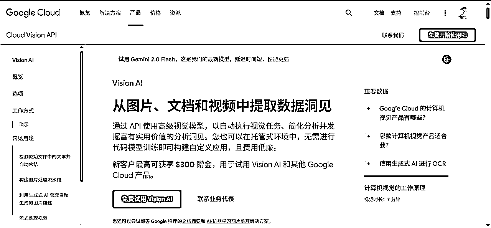
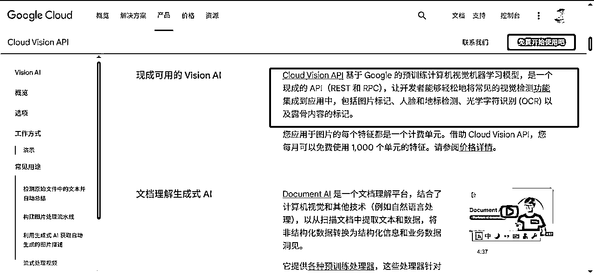
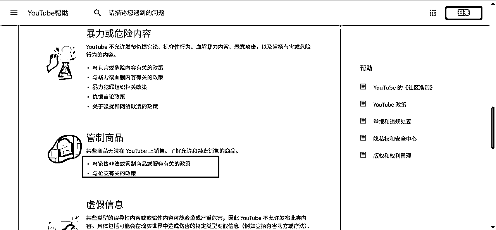
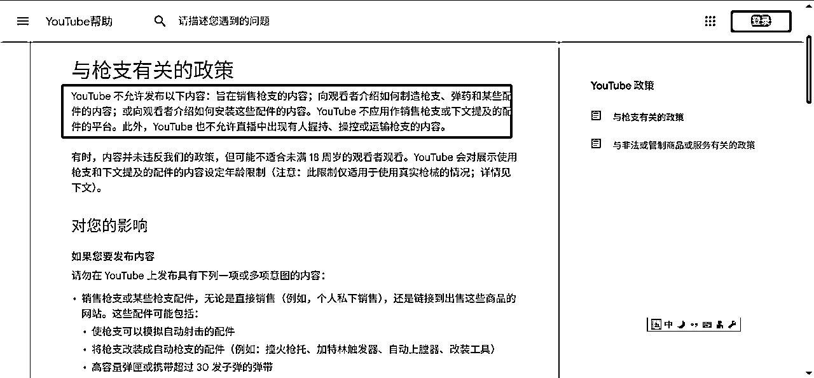
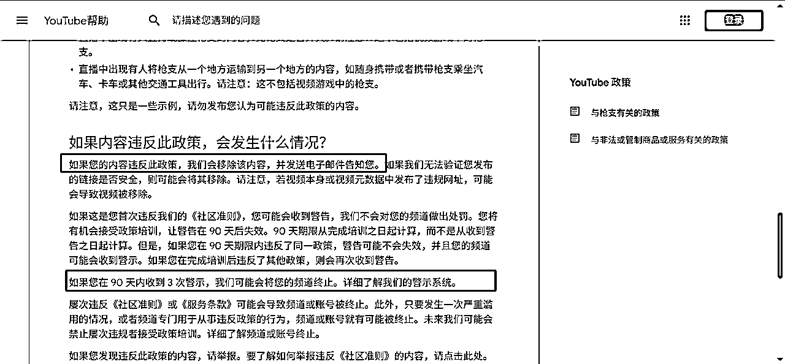
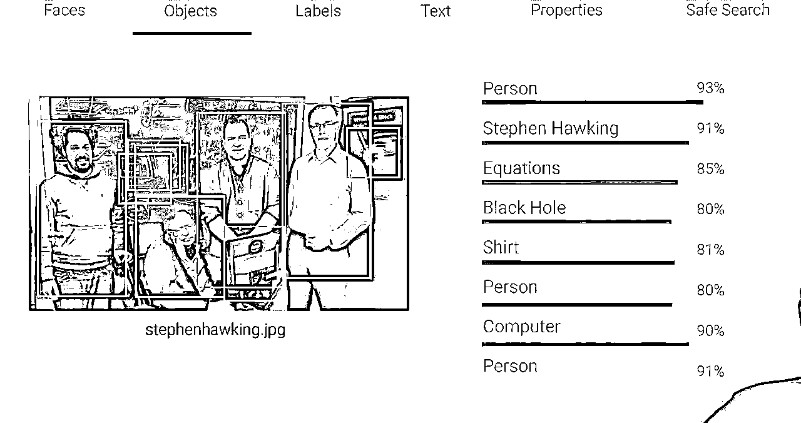
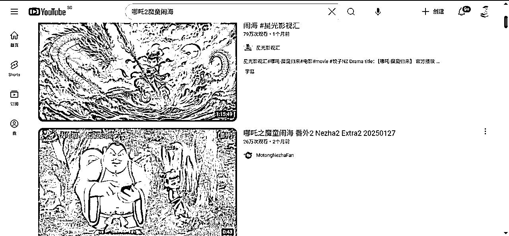
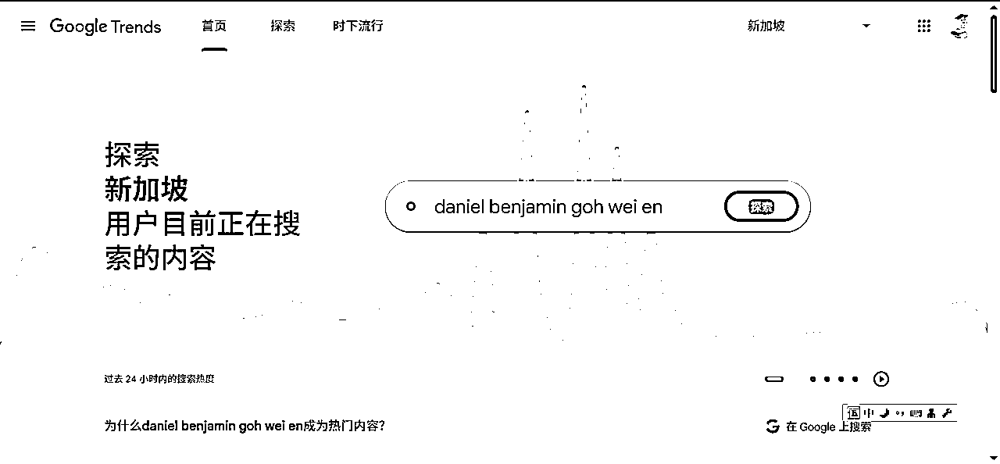
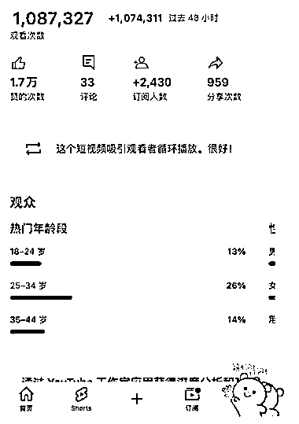

# YouTube算法解析

> 来源：[https://rlwxa0zgke.feishu.cn/docx/KEKzdOzAco3rV5xcVi2cQ2GCnXd](https://rlwxa0zgke.feishu.cn/docx/KEKzdOzAco3rV5xcVi2cQ2GCnXd)

我们在做YouTube的时候下意识的会把国内的一些玩法放到YouTube上来，在我看来有种刻舟求剑的想法，我们对YouTube的推荐算法有更好的了解，那么就会少一些自以为是的想法了。

YouTube 的目标:

1、预测观众想看什么

2、最大限度地提高观众的长期参与度和满意度

作为一个平台，油管的目标是以上两点

1、预测观众想看什么

当你访问YouTube，YouTube会根据你的喜好提供视频，目的是让你尽可能长时间地留在平台上，

2、最大限度地提高观众的长期参与度和满意度

通过一组荐算法让你带着一定的满意度离开，推荐算法在后面会详细解释

如何做到这一点 ?

1、收集和使用数据

2、一组算法

YouTube是如何实现这两个目标的呢？方法其实很简单，就是通过收集和使用数据。

它需要知己知彼，既要了解用户的数据，也要掌握视频的数据，然后在中间进行匹配，在一些教程中，所谓的养号是养用户端的，对于视频的生产端不会有直接的关联的。这个点很多人搞不清楚。

有了这些数据后，油管会通过一组算法（注意，是一组算法，而不是单一算法）来实现这一目标。

YouTube 每天从用户行为中收集800 亿个数据点

1、用户观看哪些视频

2、他们跳过哪些视频

3、他们看了多长时间

4、喜欢或不喜欢

5、不感兴趣”反馈

6、观看视频后的调查

7、重新观看/继续观看/稍后观看

这里说的【YouTube 每天从用户行为中收集800 亿个数据点】 是之前公开的数据，到现在2025年，只会更多，具体多少大家就不要纠结了。

YouTube收集的数据量非常庞大。它不仅收集你在平台上的每一个动作，还包括其他用户的所有有价值的行为数据。

比如，你观看了哪些视频，跳过了哪些视频，每个视频观看了多长时间，是否喜欢或不喜欢某个视频，甚至你是否明确告诉油管不再推荐某类视频或某个频道。

你可能会注意到，油管经常会在你观看视频后弹出一个小调查表，询问你对刚刚观看的视频的反馈。这就是所谓的观看后调查。此外，油管还会关注你是否重新观看某个视频，是否在观看一半后离开，比如去上班，然后晚上回来继续观看。

还有一个重要的行为是“稍后观看”。当你看到一个视频但没有时间立即观看时，你可以将其添加到“稍后观看”播放列表中，这实际上相当于收藏。

油管会跟踪你是否真的回去观看了这些视频，还是只是保存后就不再理会。所有这些用户行为，油管都在持续收集和分析。

根据我自身的体会，如果你长时间刷某一个领域的视频，那么你的首页就会出现非常多相关的视频，同样的你养号只是会让你刷到你要看的视频，并不会对你做的视频会怎么样，不是说你养了号，你做的视频就有播放量，这两者无直接关联。

收集元数据

1、封面/缩略图:cloud vision 图像识别/安全评级，可以单独使用

2、视频:扫描每一帧，记录重要信息

3、字幕:自动/手工(可能不是人声)，匹配视频中的信息

4、语音:不一定跟字幕同步

5、标题/说明:很多人忽视说明

这里列举的只是部分重要的用户行为，实际上油管收集的数据远不止这些。那么，在视频方面，它具体会收集哪些信息呢？前面我们主要讨论了用户数据，现在让我们来看看视频数据。

视频有一个叫做“元数据”的概念。什么是元数据呢？这个技术术语指的是“关于数据的数据”，即用来描述数据的数据。通常，一个视频最重要的元数据包括封面、标题、说明、字幕等，这些都是视频文件之外的信息，用来描述视频本身。

那么，油管会收集哪些元数据呢？首先是封面或缩略图。

这里用到了一个特别的技术，叫做“Cloud Vision”，中文可以勉强翻译为“云视图”或“云端视觉技术”。

简单来说，这是一种在云端进行图像识别的技术。通过扫描图片内容，它可以识别出一些不恰当的内容，比如少儿不宜、宣传仇恨、枪支、香烟、酒精等。同时，它还会对这些内容进行安全评级。

需要注意的是，Cloud Vision 技术可以单独使用，不一定要与油管绑定。

什么叫单独使用呢？举个例子，如果你做了一个封面图，但不确定它是否符合平台规范，担心会被油管打上黄标或限制广告投放。

这时，你可以先把这张封面图单独上传到Cloud Vision平台上，让系统进行安全评估。油管会通过谷歌的Cloud Vision技术为你的图片打分，比如在安全性上打两个或三个勾。

官方文档

Cloud Vision API 从图片、文档和视频中提取数据洞见

具体来说，Cloud Vision会识别图片中的内容。

这项在线技术可以独立使用。如果你对某些内容不确定，比如担心上传视频后会被打黄标或限制，原因可能涉及标题、封面、视频内容或特定画面。

这时，你可以使用Cloud Vision技术来提前检查。比如，你可以把视频中可能有问题的画面截图，然后上传到Cloud Vision进行评估。因为油管后台也是使用这项技术来判断视频内容是否存在问题的。

关于封面图和缩略图，YouTube会扫描视频的每一帧。在导出视频时，我们通常会看到帧率设置为24帧、25帧、30帧或60帧。

上传到YouTube后，平台确实具备扫描每一帧的技术能力。不过，由于工作量巨大，平台并不会对每个视频都进行完整的逐帧扫描。

这里就不得不提到一个词语——食色，性也，有些人会考虑动这个歪脑筋，实际上当你视频观看量较少时，YouTube通常不会特别关注，可能不会仔细扫描每一帧。

然而，一旦视频达到某个量级并开始火爆，平台就会更加谨慎，担心出现问题，这时就会进行更详细的扫描。这类似于国内很多平台的做法：当视频播放量较小时，平台不太在意；但当播放量超过某个阈值（比如5万、10万 这个只有平台才知道）时，平台会进行人工或智能审核，然后再决定是否继续推广。

毕竟，如果一个视频一夜之间获得数百万播放量，却出现了重大问题，相关工作人员可能会因此丢掉工作。

同样的道理也适用于YouTube。这就是为什么某些视频在政治敏感内容出现时会被打上黄标。平台有能力扫描每一帧，其原理与扫描封面图类似。如果视频中出现了平台的社区规范不允许出现的内容，平台都能检测到并采取相应措施。

建议大家好好看官方文档，这里列出几个常见的

YouTube 的《社区准则》

YouTube 政策

举报和违规处置

YouTube 社区准则警示基础知识

这世上没有后悔药吃的，不要等你频道被封了才想起要看官方文档，要提前就留意关注平台的一个政策，避免违规，上传一些不该上传的视频。

平台会将这些关键信息提取出来，并结合视频的封面图、字幕等元素进行综合分析。

值得一提的是，字幕可以是手动添加的，也可以是自动生成的。自动生成的字幕功能支持英语、法语、韩语、西班牙语等多种语言，但遗憾的是，目前还不支持中文识别。

字幕可以是手工添加的。也就是说，即使视频中没有说话，也可以有字幕。

补充一点，如果你视频有字幕，其实就是一个挺聪明的策略，YouTube官方会读到你视频中的字幕，这样更好的了解你视频的内容，从而更有针对性的把你的视频推荐给适合的观众。

同时YouTube会根据画面以及字幕做综合的判断，比如说你的视频中有一把枪，但是你视频的字幕明确说了是一把玩具枪，YouTube就结合你给出的字幕判定这是把假枪，那么就不会认为你视频中出现枪支而做出相关不好的措施了。

官方的解释如下

另外语音和字幕并不一定是一一对应的，它们也不一定是同步的。我们刚才提到，字幕是可以人工添加的，但语音识别完全依赖于语音听写技术。

即使字幕里没有粗话，但如果你说话时全是粗话，系统通过语音识别就能检测到，并可能因此给视频打上黄标，认为这个视频有问题。

接下来，我们聊聊标题和说明的重要性。这一点毋庸置疑，我们一再强调封面和标题的重要性。标题里不能出现过于惊悚的内容，因为观众会从封面图中获取第一印象，然后在标题里寻找对应的关键词。这样能加深他们对整个视频的理解。

很多人忽视了说明部分，其实说明非常重要。如果你有自己的字幕文件，可以生成一份，然后交给ChatGPT帮你写一个简介或说明。

这样做的好处是，虽然简介和说明可能不够全面或完整，但会有足够多的关键字和长尾关键字出现在这里。

下面就举个例子，关于Cloud Vision技术，当你上传一张照片时，它能够识别人脸、物件，并自动贴上标签。如果封面中有文字，它还能通过文字识别技术提取出来。也就是说，一张图片可以包含如此丰富的信息，它都能一一识别。

你可以看到，在这张图片中，它识别出了名人霍金，以及其他三位与他合影的人物。虽然这些人也是业界大拿，但显然没有达到霍金那样的知名度。能够与霍金合影，自然也是不简单的人物。

它识别出这张图片中有霍金，以及其他三位与他合影的人物。此外，它还识别出这张图片可能与黑洞有关，准确率高达80%。这些人穿着衬衫，你也能看到。

此外，系统还识别出了图片中的计算机和黑板上的方程式。你看，黑板上用方框标注了好几个地方，系统准确地识别出了这些数学公式。这就是谷歌云视图技术的强大之处，它不仅能识别人脸，还能识别各种其他元素。

我们制作封面图时，常常会在上面添加文字。无论使用什么字体，只要不是手写体，系统都能准确识别出来。即便是手写体，只要不是太潦草，系统也能识别。因此，谷歌的云视图技术非常强大，能够准确地识别出图片中的各种元素。

关于图片的安全性，系统会判断图片是否包含不适宜的内容。如果图片超出了安全限制，系统会亮起红灯，提示这可能是不适宜的内容。例如，如果封面图看起来有些少儿不宜，系统会进行标记。

最后，系统会扫描整个视频，如果发现封面图虽然吸引人，但视频内容却与之不符，系统会判断这是在玩“封面党”，即通过吸引人的封面图来增加点击量。系统会整合所有信息，对视频进行综合判断。

人工智能使用多个系统/算法

1、浏览功能:首页(个性化推荐(新的和旧的))和订阅

2、推荐视频:“接下来播放”，同类或相关

3、趋势视频:区域/社群当下关心的热点

4、通知:打开小铃铛

5、搜索:依赖元数据，观众反馈和新鲜度

接下来，我们聊聊如何将用户信息和视频信息进行匹配。YouTube的推荐算法其实是一个复杂的人工智能系统，正如前面提到的，它整合了多个子系统和算法。

1、浏览功能:首页(个性化推荐(新的和旧的))和订阅

首先，有一个专门处理浏览功能的算法。这里的"浏览功能"主要涉及两个页面：首页和订阅页面。YouTube未来的设计方向是弱化订阅页面的重要性，因为他们发现现在很少有人会专门去订阅页面查看视频更新。

意思是说，你就算没有订阅某个博主，YouTube会根据你的一个观看记录还是在你的首页给你推荐你经常看的博主的视频尽管你没有对这个博主进行一个订阅操作，当然了你直接去到你订阅的博主频道首页看也是可以的。

关于首页的个性化推荐，每个人的首页都是独一无二的。首页会展示新旧内容：既包括你订阅的频道视频，也会推荐你未订阅但可能感兴趣的内容。

比如，如果你昨天连续观看了三个某个频道主的视频，那么今天打开首页时，这个频道主的新视频很可能会出现在你的首页顶部。

这就是为什么YouTube一直在淡化订阅的概念——你不需要订阅某个博主，系统也能准确判断你是否喜欢他的内容。

目前，订阅功能唯一剩下的意义就是：当你真的是某个博主的铁粉时，它能第一时间通知你该博主的新视频更新。

绝大多数用户都习惯通过首页来观看视频，这里既有你熟悉的内容，也有新鲜的内容。所谓"旧"的内容，就是你订阅的频道或者你经常观看的视频；而"新"的内容，则是那些你从未表达过兴趣的频道或视频。

YouTube通过分析视频之间的关联性，运用大数据算法，能够推测出你可能喜欢的内容。

如果没有新内容的引入，每次打开首页都会像陷入信息茧房一样。这样做显然是不行的，你就刷不到新的内容了。

YouTube的推荐机制其实是在不断试探你的喜好。这种新旧结合的推荐方式，既让你能够持续看到喜欢的内容，比如说，你看一个具体的视频时，在视频右侧会出现与你当前看的视频相关的视频。

这其实就引申出一个话题——如何找对标账号，你当前播放视频的右侧就是对标，答案就是这么简单直接。

2、推荐视频:“接下来播放”，同类或相关

接下来，我们来聊聊第二个算法——视频推荐机制。这个算法的重要性不言而喻，尤其是在你观看完一个视频后，系统会自动推荐接下来播放的内容。我个人认为，这是整个推荐系统中最为关键的一环。

为什么呢？想象一下，无论是首页还是订阅页面，你都会看到大量的视频滚动展示。你可能会从几十个视频中挑选一个来观看，但如果你看完后觉得不满意，接下来的推荐内容就显得尤为重要。

如果推荐的内容杂乱无章，你可能会感到失望，甚至直接离开。

因此，真正重要的是，你在观看完一个视频后的感受如何？你的互动行为是什么？这些都会影响系统接下来推荐的内容。推荐内容大致可以分为两类：

第一类是同类推荐。

比如，你发现了某个宝藏频道，假设这个频道为NB频道，系统会紧接着推荐这个叫NB频道的第二个、第三个视频，让你继续深入这个频道的内容。再比如，你观看了一个关于哪吒2魔童闹海的视频，系统可能会推荐同类别中最受欢迎的大频道视频，让你在垂直类目中发现更多精彩内容。

第二类是相关推荐。国内流行的歌曲，也有可能会给你推荐国外流利的歌曲，或者是说国内票房最高的电影是什么，同时给你推荐国外票房最高的电影是什么，我只是举个例子，大家能听懂就行。

总之系统会通过层层递进的方式，帮助你突破原有的兴趣圈，发现更多可能。具体来讲，我之前有段时间喜欢看电视、电视剧，发现了美剧比较优秀的如越狱、毒命绝师、权利的游戏等 一系列国外优秀的电影、电视剧

这种推荐机制不仅让你能够持续看到喜欢的内容，还能在熟悉的领域中不断发现新的惊喜，保持探索的兴趣。

总结来说：

同类推荐的意思是，也许你还没看够呢，系统会继续推荐类似的内容。

相关性推荐则是，如果你看累了，系统会引导你去看一些相关但不同的内容。

这种设计很巧妙，就是为了让你继续留在平台上，看完一个又看下一个。

3、趋势视频:区域/社群当下关心的热点

第三个是趋势视频。这些视频通常出现在首页，展示的是当前正在流行的热点内容。

需要注意的是，这些视频不一定是流量最大的，而是正在形成热点或可能成为热点的内容。YouTube会根据你的区域来推荐这些视频。比如，YouTube有全世界不同地区的网站，每个地区的推荐内容都不一样。

这里简单来说，那就是你的IP是哪，那么就会给你推荐哪个地区的的趋势视频，这里要补充说明一点，那就是你自己频道的地区定位到哪，比如说你的频道定位在美国，这里你在选节点的时候，你要选美国的节点。

需要说明的是趋势视频，不一定是最火爆的，但可能是你所在区域正在关注的热点。

当某个区域正在形成一个热点，这个时候，在YouTube上会有人制作视频，或者刚好有人做的第一个视频，这个视频特别粗糙，质量也不怎么样。

但是，如果这个事件已经在推特或者其他应用上火起来了，系统能够侦测到有人在谷歌里搜索相关关键字，就会认为这可能是一个正在形成的区域热点，并将其放入趋势视频中。这个算法专门处理趋势视频。

如下图，我的IP是在新加坡，那么在 https://trends.google.com/trends/?hl=zh-cn 页面就会显示关于新加坡地区的用户正在搜索的内容。

4、通知:打开小铃铛

这个通知算法仅限于打开小铃铛的用户，只有打开了小铃铛，系统才会通知你。通知的方式有小铃铛通知，也可以通过电子邮件通知。

这里补充说明：理论上只要是你的粉丝打开了小铃铛，系统会在你发布视频时通知你的粉丝。但实际情况又有细节。

即通知不是无限制的通知，YouTube会对通知会进行优化，根据你发布视频的频率。比如，如果你一天发布15个视频，系统顶多通知你的粉丝两到三个，或者将通知进行折叠。

这么做的原因是什么？很显然YouTube试图避免过多打扰粉丝。因为如果你的更新频率越高，通知过多的话，会使得粉丝感到困扰。

比如你的粉丝在忙，但是因为你更新过多，系统不断的往你粉丝推送，太多的打扰可能会导致粉丝取消订阅你的频道，有了这个机制系统就不会不断的通知你的粉丝了。

5、搜索:依赖元数据，观众反馈和新鲜度

最后一个要讲的是搜索功能。搜索主要依赖的是元数据。也就是说，当你搜索关键字时，如果你的频道名里包含这个关键字，系统就能搜索到你的频道。

同样，搜索视频时，视频的标题里也要有这个关键字。

这里有一个SEO的小技巧，那就是标题里要有关键字，而且关键字要尽量放在标题的前面。你可以设置多个标题，标题与标题之间可以用|进行一个隔开处理。

元数据还包括前面提到的视频说明，这些都能明确告诉搜索算法你视频所包含的信息。

类似于公众号爆文一样，一些封面一些标题能带来很多的流量，这就衍生出一个群休——封面标题党。

其实YouTube当然知道标题党和封面党的套路。作为一个搜索引擎，YouTube和这些套路斗智斗勇多年。每次推出新方案，都有人试图钻空子。所以，光靠元数据是不够的，还需要观众的反馈来综合评估。

这里说的综合评估指的是搜索是一个指标，即你的标题关键字匹配的一个程度，同时也会考虑到观众看视频的反馈，比如说点倒赞就是一个指标。代码观众不喜欢这个视频，不喜欢的原因多种多样，比如说标题党，封面党，当然了，观众也可以对视频进行一个投诉给YouTube官方处理。

这里观众的反馈是多个指标，我说的点赞行动之外，还包括如评论，评论是比点赞权限更重要的指标，点赞同就点一个就好，不用费多大劲，而评论则是要手输的，如果评论的字数很多，花的时间就更长了，即观众停留在这个视频的时间更长。

从上可以得知，评论是比点赞权限更大的指标，当然还有转发，观众喜欢你这个视频才会进行一个转发，转发的指标类似于点赞没有评论权限大，当然了，对于一个视频来说，在目前YouTube的推荐算法中，视频的观看完播率是最大的指标。

如果你的视频是Shorts，那么下图的指标可以说是关键性指标，你只要看到这个提示【这个短视频吸引观看者循环播放。很好!】那么你Shorts的观看次数也就基本稳了。

观众的反馈和视频的新鲜度是非常重要的因素，这与谷歌搜索不同。

在谷歌搜索中，新鲜度并不是一个很大的权重，但在YouTube搜索中，我们可以看到，当我们播放视频时，通常都是最近24小时内的。如果视频表现一般，48小时后可能就没有什么推流了。

所以，在搜索时，如果你的视频是最近发布的，比如24小时内，仍然算是比较新鲜的。再加上观众反馈良好，元数据准确，那么这个视频就有可能在YouTube搜索中排在前几名。

你可以注意一下，在YouTube搜索时，尤其是一些长尾关键字的搜索，你会发现排在前几名的视频，可能播放量比后面的少很多，甚至只有后面视频的1/100。但就是因为它们比较新鲜，所以能够排在前列。

这里要说明一个事实，那就是你视频发布后就有一个时间了，单纯的改标题意思不大，比如说去年是2024年，你是做电影频道后，你做了一个视频标题为2024年年度排盘最火的TOP10电影，现在2025年了，你手改把标题改成2025年年度排盘最火的TOP10电影，这是一种自欺欺人的做法。

YouTube的推荐算法依赖于元数据、观众反馈和视频新鲜度，仅仅改个标题怎么可能有效呢？难道你觉得YouTube的算法那么好骗吗？