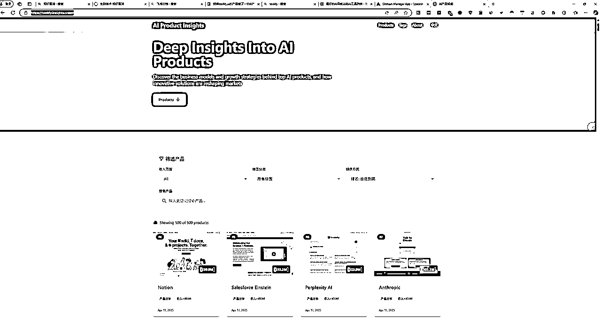
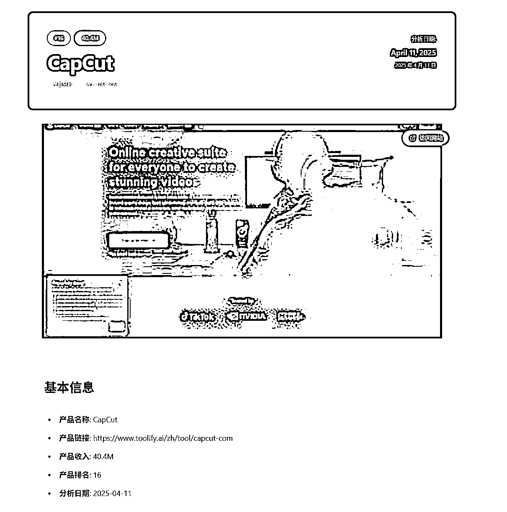
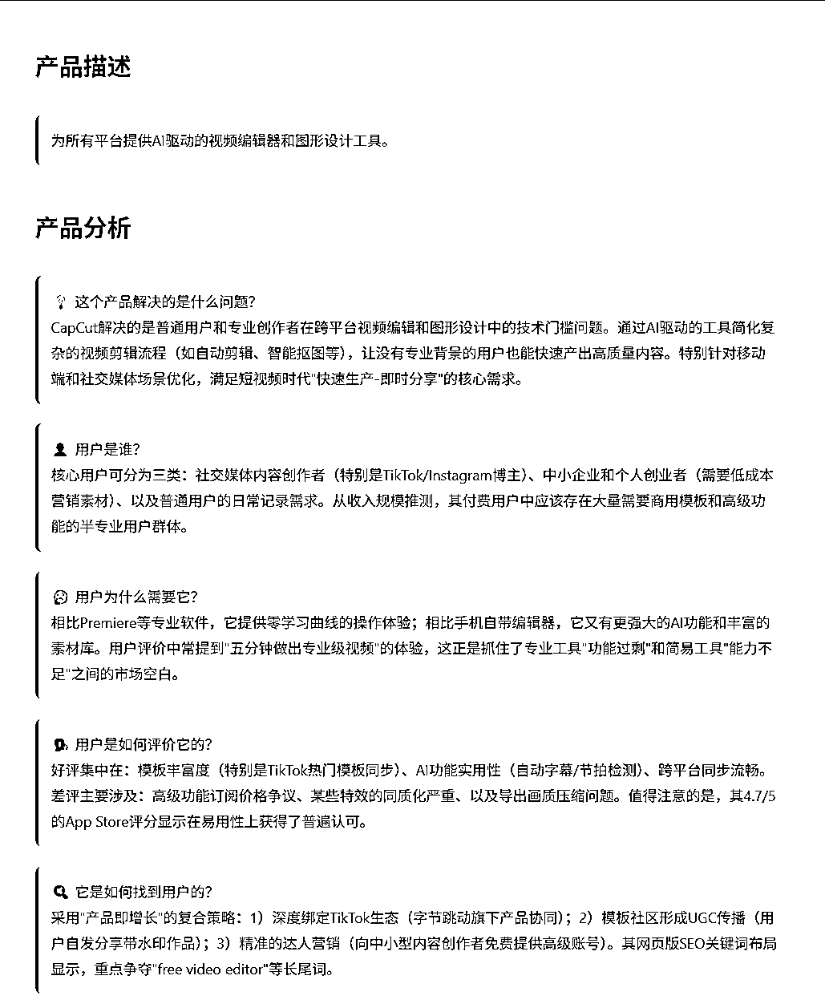
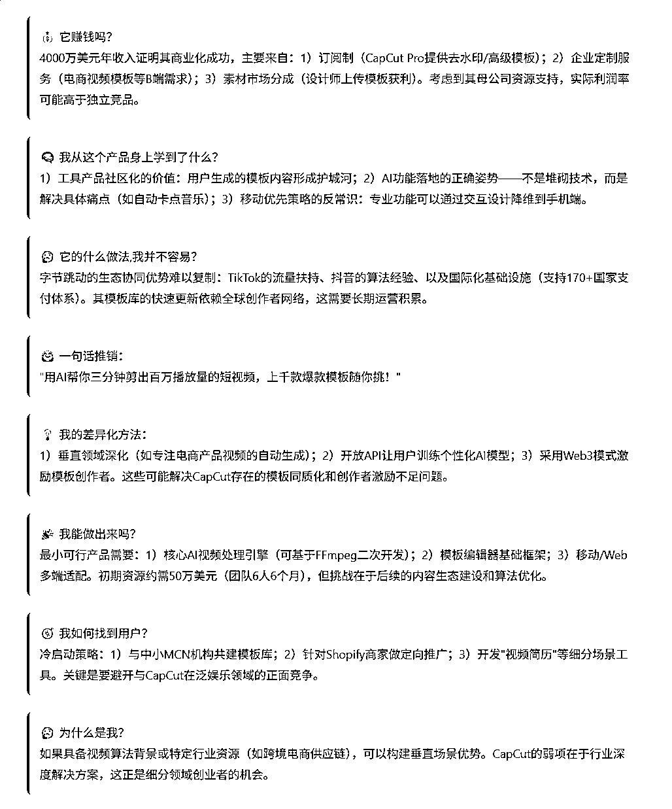
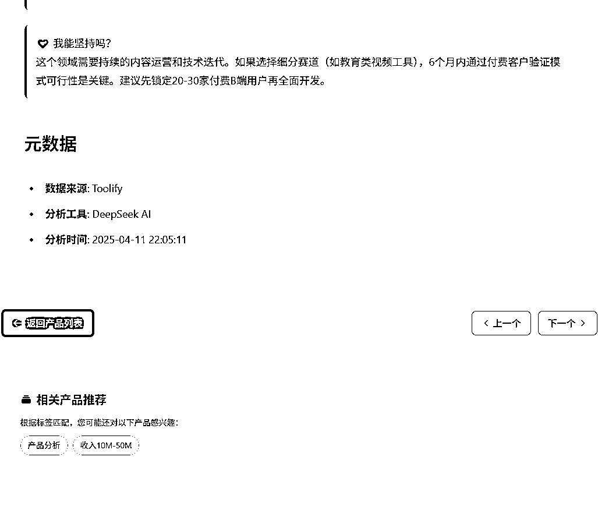
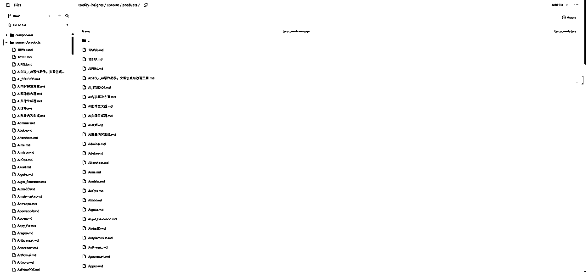
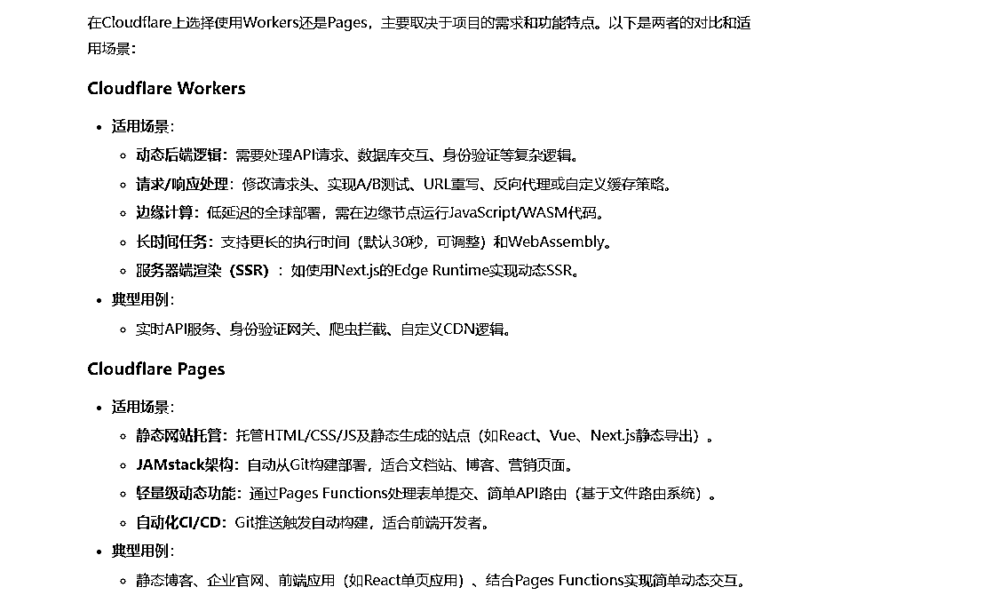
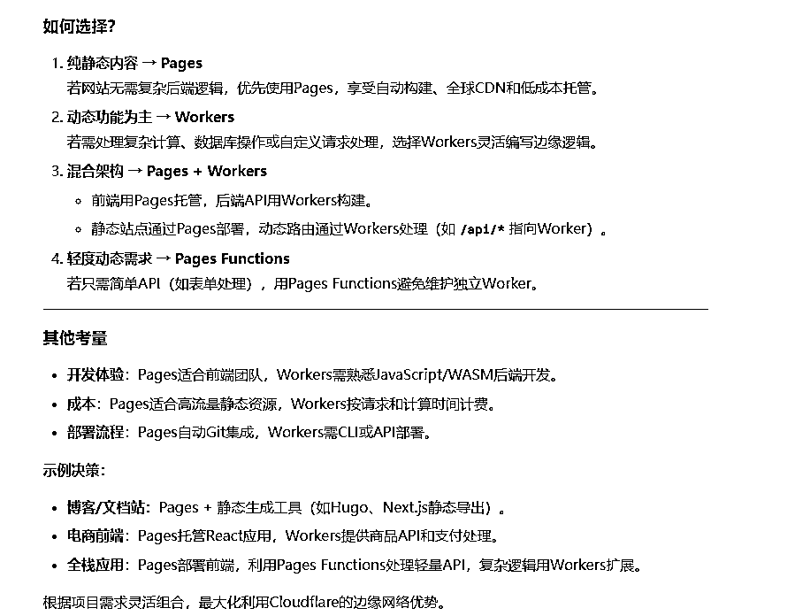
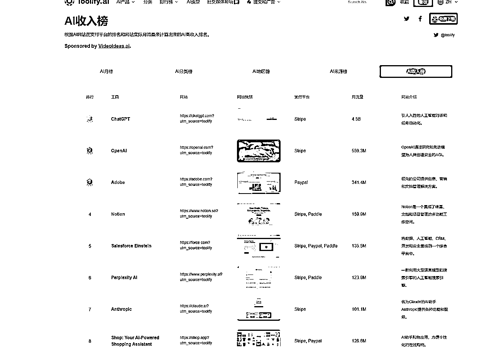

# 我将toolify.ai的AI产品做了一个AI产品解读网站

> 来源：[https://si06f5z4e71.feishu.cn/docx/SA6qdPPgaonChjxpJUZc1vn7nEy](https://si06f5z4e71.feishu.cn/docx/SA6qdPPgaonChjxpJUZc1vn7nEy)

先展示效果：https://toolify-insights.online/

你看到的是我的一个网站的示例解析，这个网站是基于圈友@小学生的开源项目的基础上做的，在此非常感谢圈友

@小学生，我的理解需求的寻找可能不只是教练教的那些方法，我目前大部分的网站需求都是来自于生财，生财需

要的，可能也会是市场的真需求。

通过本次开发，让我比较受益较大的有以下几点：

1.需要将单独的文件独立出来，可以实现更好的更新和删除。

2.解决了之前在本地开发过程中老是需要服务器，我一直以为这样就避不开使用服务器，一直很懊恼，这次发现直接通过cloudfare的page就可以解决掉，嘎嘎香。怎么区分使用workers还是pages？让我们看看AI怎么回答的：

3.通过圈友小学生分享的开源代码，对AI产品的解析，让我学会了使用API，似乎真的很香，我又把从toolify.ai下载重新跑了一遍，因为圈友做出来的md文件的产品链接是基于toolify的，我想增加的可以访问对应的网站。

本网站优化点：

1.增加产品分析的英文界面，暂时没有转化过来

2.增加原网站访问链接

3.添加更多AI产品解析

4.增加赞赏功能

5.增加支付功能

对网站有更多建议的朋友欢迎提意见！！！