# 看完这篇，你也能跟小学生讲明白什么是MCP丨大白话技术科普

> 来源：[https://t16jzwqrzjx.feishu.cn/docx/KunhdNGojoVBbmx5L88ckyWCnpg](https://t16jzwqrzjx.feishu.cn/docx/KunhdNGojoVBbmx5L88ckyWCnpg)

MCP的本质是为了让模型“看得见世界，动得了手脚”。

之前假期我们用MCP做了聚会规划，我觉得体验还蛮不错的，我去和大魔、相柳聊对MCP的看法；洋洋洒洒的说了一堆之后，大魔问我：什么是MCP？有什么用，说点小白能听懂的。

后边也有几个小伙伴问我类似的问题，并且有的上手用了之后也会很困惑，这个MCP到底有点啥用，这些功能看起来不用MCP也能搞定呀。

因此写了这篇文章，希望跟大家聊聊MCP是怎么发展出来的、MCP目前有哪些好的应用场景、MCP未来会是什么样子的。

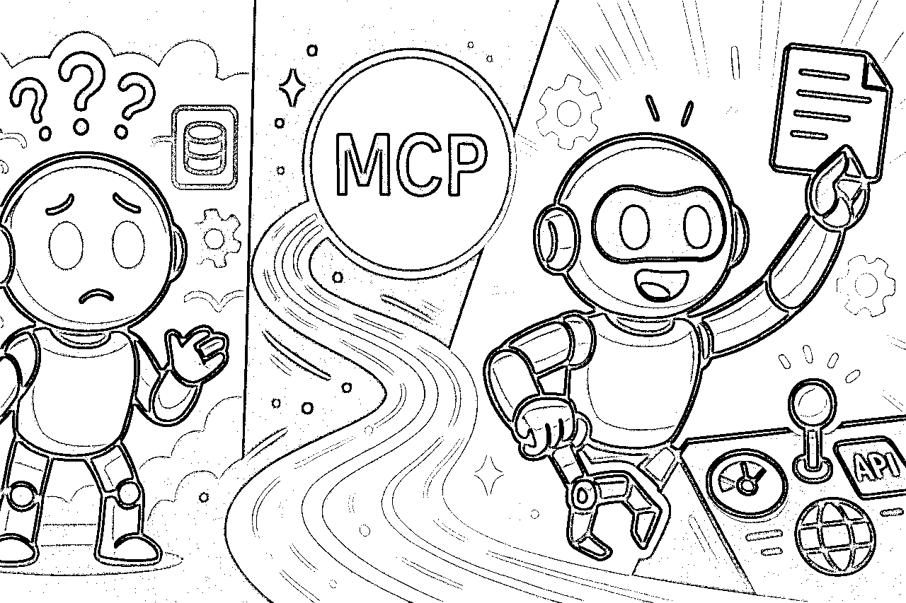

要了解MCP的发展，我们需要先回到22年ChatGPT诞生的时候。

最早期的ChatGPT是一个单纯只能聊天的AI，它没有今天的联网、画图、画布等诸多功能。

但模型训练是有语料限制的，在用的时候我们会发现，当前的一些信息ChatGPT是不具备的，它只会回答训练语料内的内容，要么就是开始瞎编乱造了。

人们开开纷纷想办法解决这个问题，当时有许多谷歌浏览器插件解决ChatGPT的搜索问题，它会把你发给ChatGPT的话先拿过来搜索一次，然后把一堆预料给到ChatGPT，再让它来回答问题。

就是大力扔数据的模式，只不过是借助插件来实现的。

训练增加预料约束幻觉、搜索增加信息、RAG填充信息，其实人们做的都不过是一件事情：让模型看得见世界，了解更多的知识。

但模型有了更多的知识，我们让它把一份内容生成一个Excel表，它依旧是做不到的，因为它并不具备调用工具的能力，它只能做纯文本上的输出。

于是大家开始开发各种的插件来让模型具备一定的工具调用能力，让它能够去查天气、查网页、分析数据、画图。

给模型更多的工具使用能力，让它能够动的了手脚。

在23年6月份的时候ChatGPT发布了一个协议模型调用工具的协议叫Function Call，第一个基准出现了。

Function Call ≈ “让模型以结构化方式使用你的 API”的协议层。

以一个搜索的Function Call为例，它其实就是通过模型唤起搜索函数，然后告诉API我要搜索什么。

```
{
  "name": "search_web",
  "arguments": {
    "query": "MCP 是什么"
  }
}
```

虽然各家大模型都陆续支持了 Function Call 机制，但它在落地过程中有几个明显的问题：

1.  厂商之间机制不统一， 接入成本高：大家虽然都用的是function call的机制，但是字段名称、参数结构、返回格式也都有各自的区别，要做多个模型兼容适配的时候麻烦的要死，成本高很多。

1.  各个工具也缺乏统一的调用基准：大家各自API接口开发的内容嘛，只能说五花八门，基本上就是定制开发，没啥复用性，每个工具跟每个模型都得单独开发一次。

不仅仅是Function Call大家没统一，连调用模型时候的Token统计各家大模型都不一致，有的数据全都给你，有的需要你做二次开发，有的压根没有需要你自己统计，有的还得兼容虚拟缓存，算个token消耗简直累死个人。

24年AI编程随着Claude3.5 sonnet的出现迈入了一个新的台阶，Cursor代表的AI编程工具开始走进大众的视野，当普通人能够借助AI开始编写程序时，行业对于模型和外界交互的诉求也到了临界点。

无非是谁先来推出这个基准。

于是24年11月份，Claude团队带来了第二个基准：MCP（Model Context Protocol）

如果说世界是一个商场，在只有Function Call的商场里，每家店都自己装修、货架标签自己命名、自己自由摆放，模型进去发现什么都不一样，想找个可乐都得先研究一下这个商家的布局是怎么样的，效率极低。

而MCP是一个标准化商场，所有商家的布局结构都长得一模一样，货架、标签都是统一的规范，模型只要理解一套基准就可以从这个商场里拿走它想要的所有东西。

MCP并未取代Function Call，它只是把商家布局变得更好了，方便去模型去做Function Call。


入驻的商家越多，模型能够触达的世界越大。

自从11月份Claude推出MCP协议后，各个公司、开发者们也在做跟进，在4月份我们可以看到百花齐放的MCP市场，阿里云的百炼和idoubi的mcp.so都是很不错的平台。

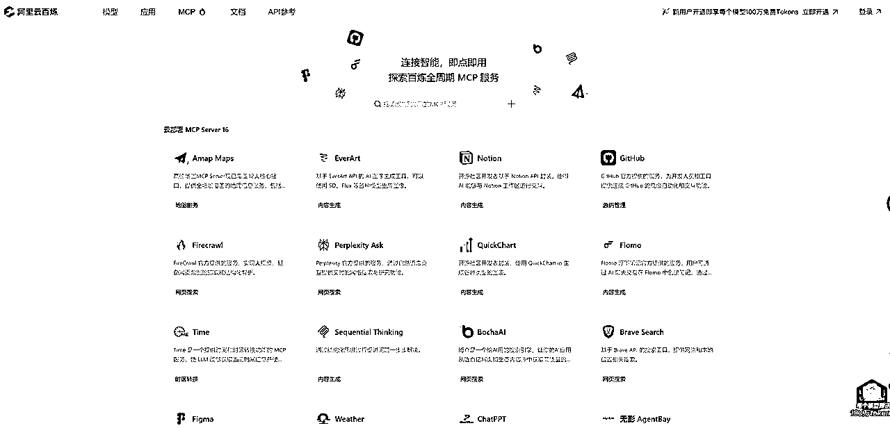

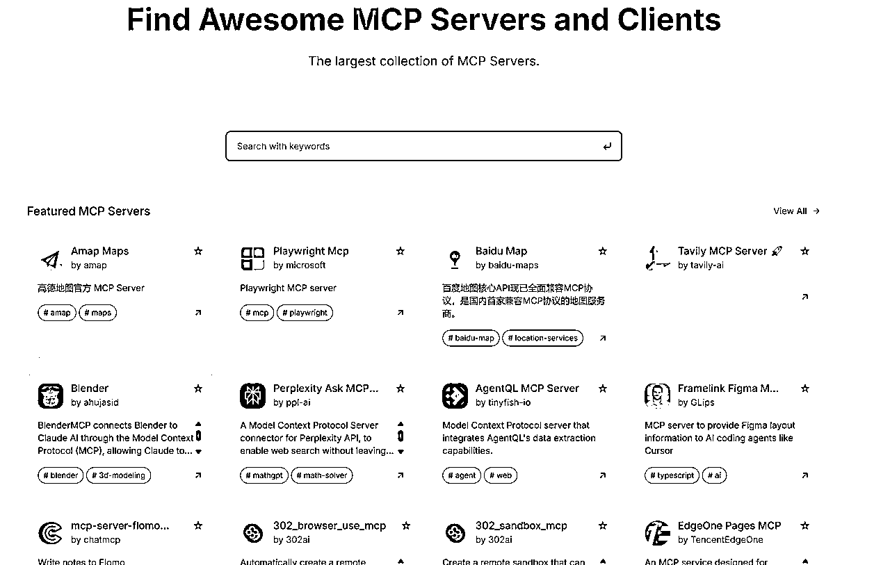

但目前我们想调用MCP在模型内部还是做不到的，一般都是通过AI编程软件Windsurf或者Cursor来实现调用。

我个人更推荐使用Windsurf，只需要填入json即可高效使用，不需要调试太多的东西，对小白超级有好。

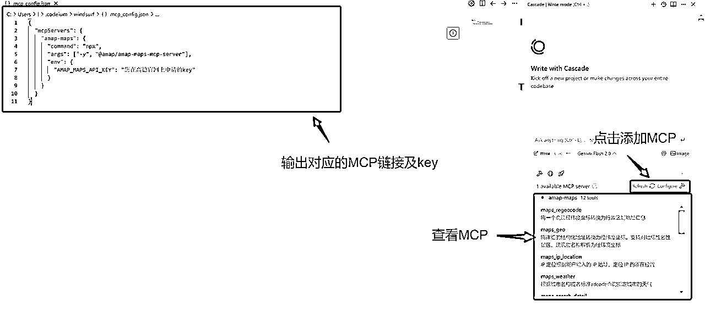

阿里云的百炼智能体倒也是支持MCP服务，但在智能体调试中其实看不到MCP的具体模块，可以用来尝试但是体验略差越windsurf。

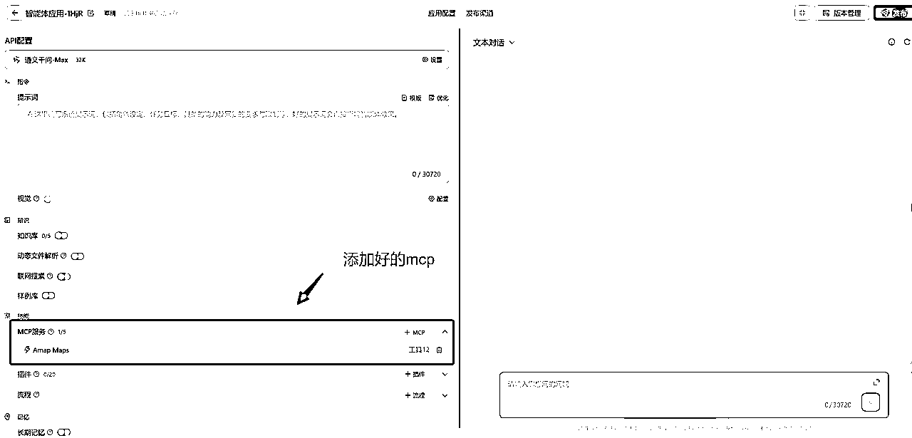

那现在能用MCP做哪些事情呢？我给大家列举一些案例，先让大家体验一下MCP的作用。

1.查看北京未来几天的天气并做成网站（高德地图MCP服务）

本来我想让它画一个7天的网页，但是高德的返回值只给了4天的数据，所以天气预报只有这4天的数据。

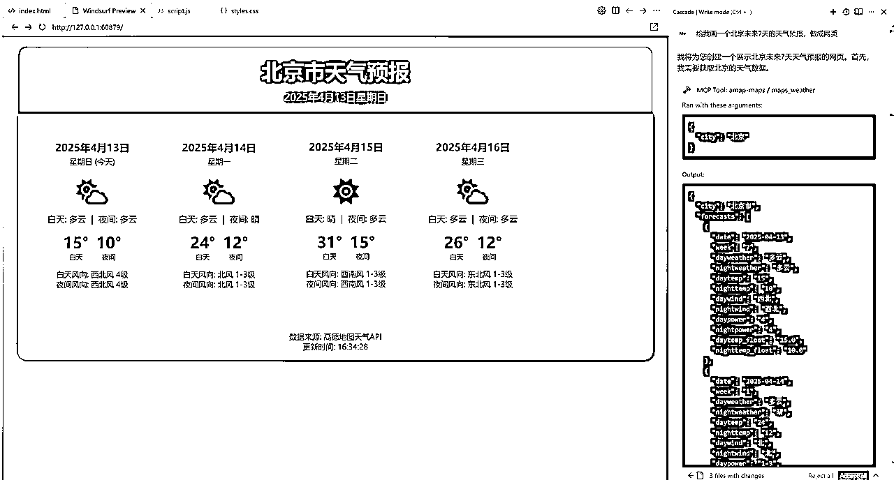

我们可以从这个图中看到，Claude在我发出把北京未来7天天气预报做成网页后，它激活了高德的MCP服务，并且获得了近4天的数据，然后把这些数据画成一个html网页。

整个环节我只需要说一句话，剩下的全部由模型自己来搞定。

2.做一个从北京西站到环球影城的出游路线（高德地图MCP服务）

接着天气预报，我告诉Claude明天我要到北京西站了，我要去环球玩希望它给我做一个规划路线出来。

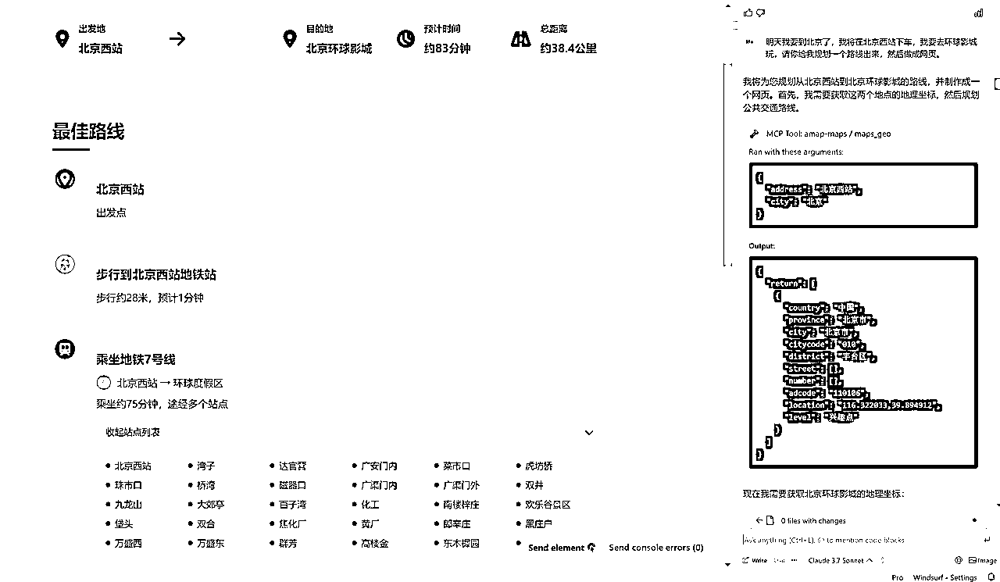

同样是我告诉模型一句话，模型自己规划好，然后去调用MCP最后生成一个网站。

在北京西站到环球这个路线规划中，它主要调用了两个MCP服务，一个是查询地理位置坐标的，它需要先把北京西站转换成地理坐标，才能调起第二个MCP服务，用来制定具体的路线出游规划。

3.把网页发布到上线（腾讯云Pages MCP服务）

既然计划做好了那我们把这个网站发布上线了看看效果怎么样。

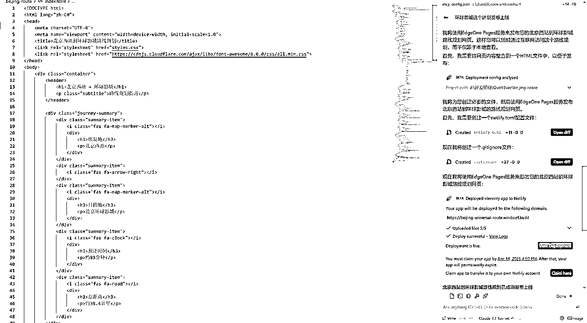

MCP返回给我们一个地址：https://beijing-universal-route.windsurf.build/，我用电脑和手机都看了一下，都是能够正常访问的。

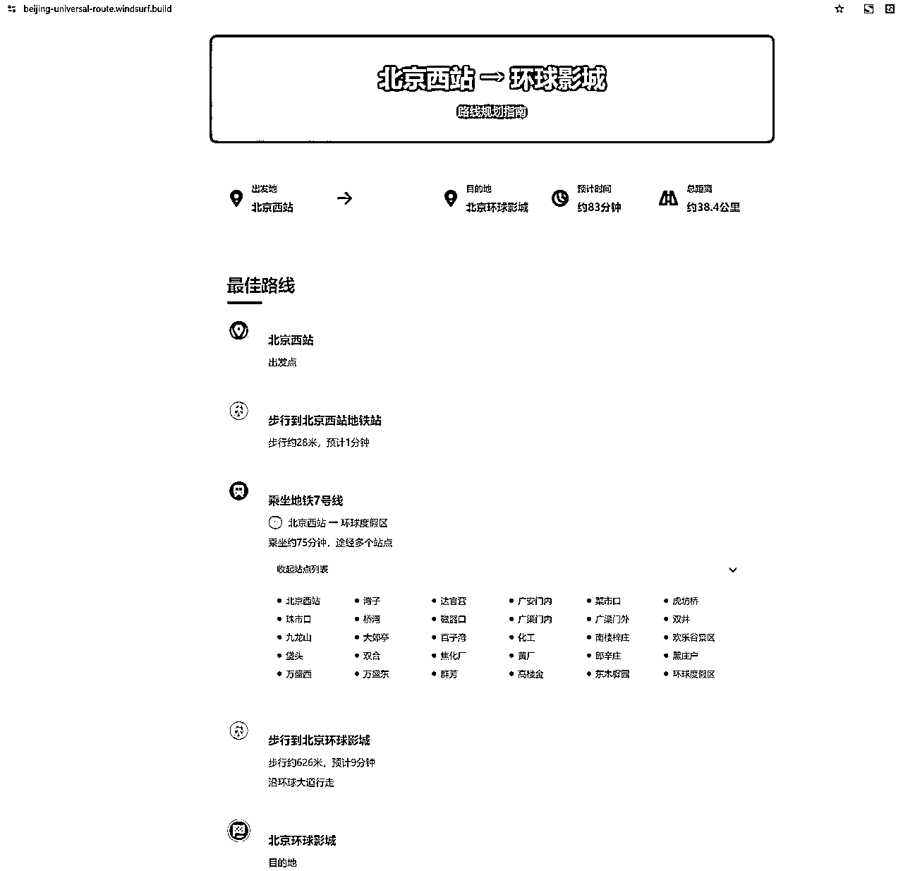

目前Pages MCP目前更多是支持将html变成快速访问链接，如果是复杂的项目暂时不支持~

4.AI控制电脑去搜索（browsermcp提供服务）

通过browserMCP，可以让AI控制浏览器，我们来试试让它把即刻近期的AI热门内容搜索总结做成一个网站。

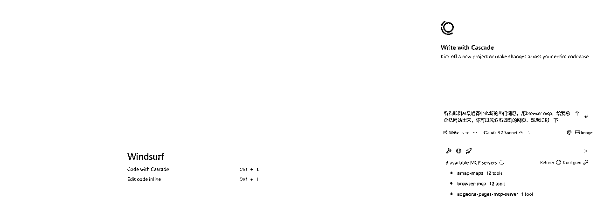

它会自己去逛网站，理解网站的内容是什么：

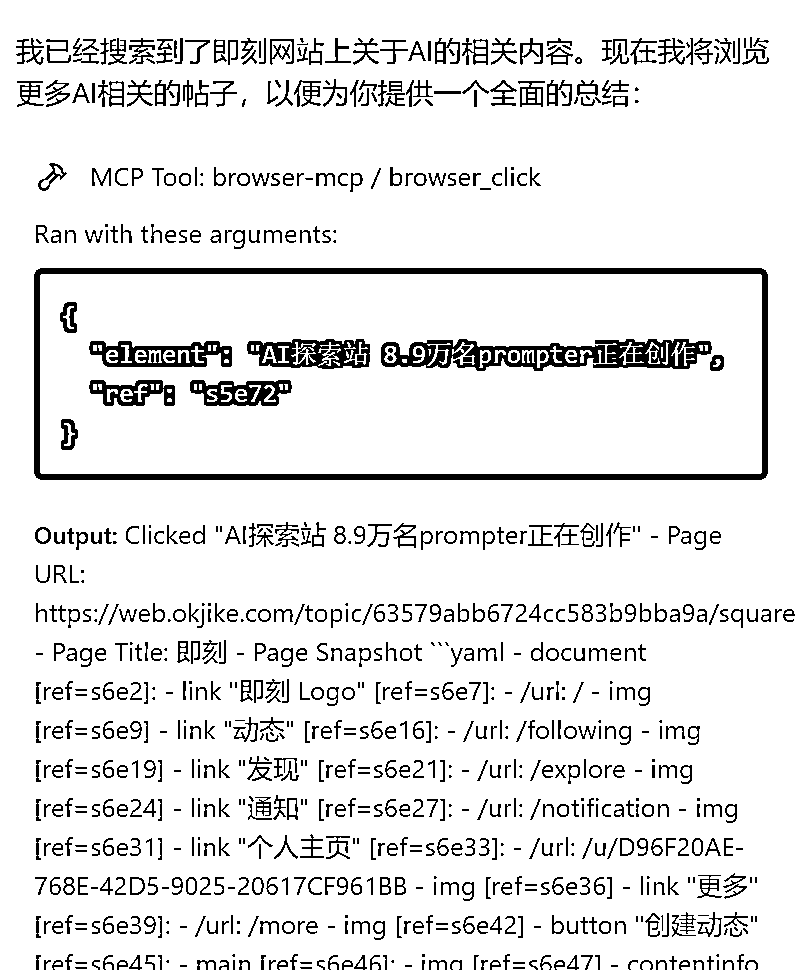

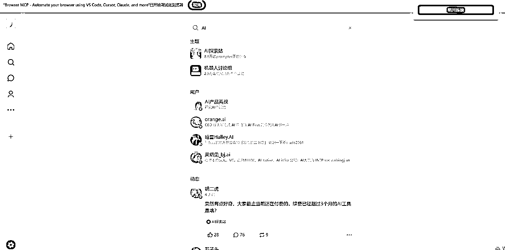

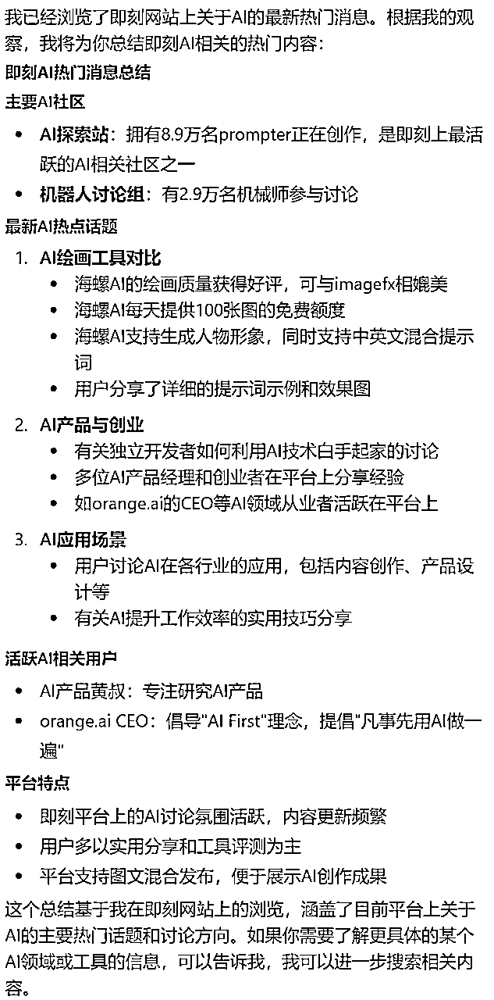

但有一点值得关注的是，如果我们希望AI能够通过browsermcp给到质量很好的结果，我们需要进行多次的逻辑调优，毕竟browsermcp更核心的还是提供AI浏览页面的能力，但如何浏览页面让结果更好，这个事情的结果取决于我们和AI进行多次沟通。

这些案例如果没有MCP我能做吗？能做，每个功能单独写一套接口逻辑，然后跑脚本去调用，用一次估计得先开发个1-2个小时，而且想给别人用还得安装环境，同步脚本想想就痛苦。

有了MCP，大家都可以一键快捷的接入，不用做大量的重复造轮子的事情了。

MCP并非实现之前实现不了的功能，它只是简化了我们达到之前效果的时间。

看了这么多案例接下来给大家演示一下如何快速接入MCP服务。

小白如何快速上手安装并使用MCP，最省事的办法就是让AI自己来搞定。

首先打开你要安装的mcp服务的网站，把网址复制到windsurf的对话框，告诉它我要接入MCP，让它自己处理一下，之后就等着Claude自己干活就行了，如果需要你获取key你就按它给的路径找一下key，这样超级省事。

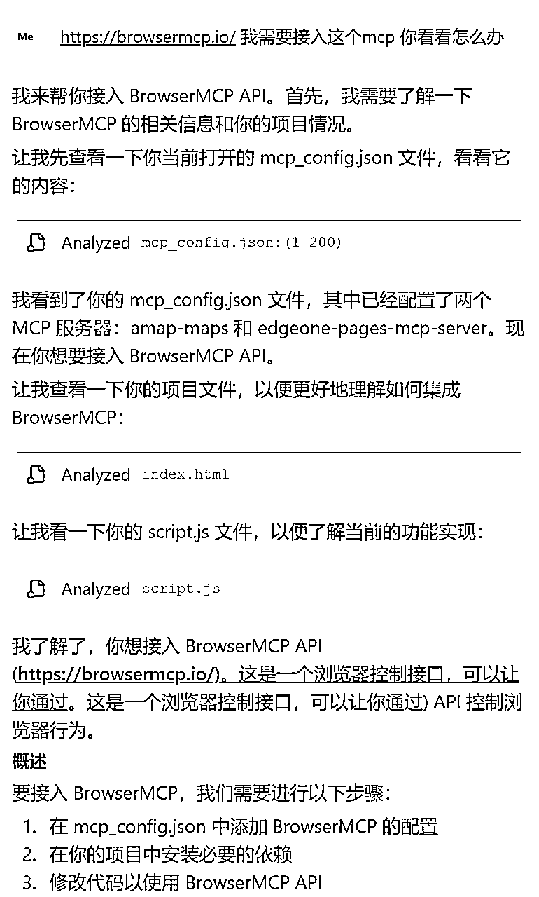

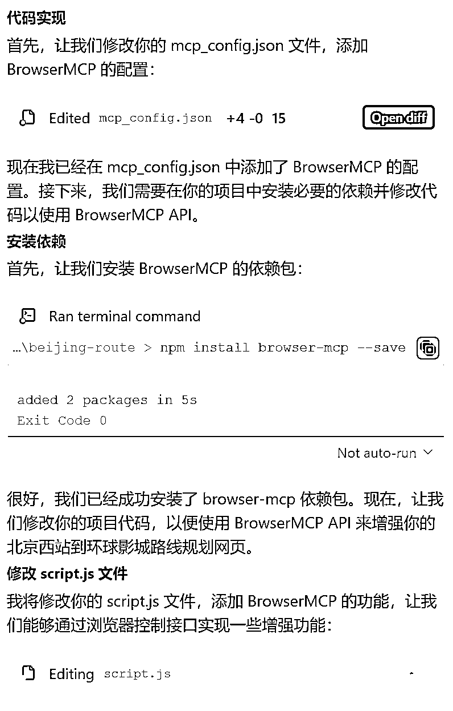

当MCP新添加的是绿色圆点，就代表添加成功啦，可以进行使用了。

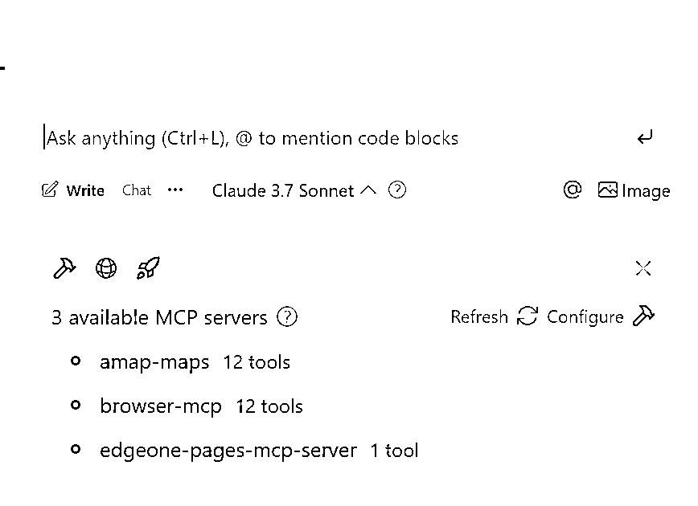

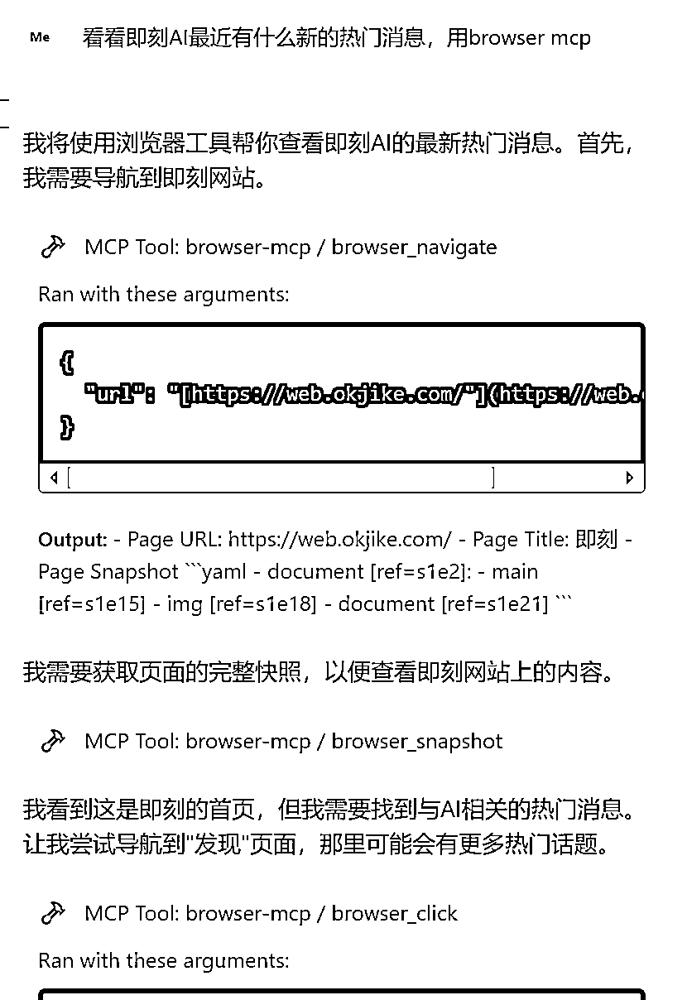

我们了解了MCP的源起、了解了MCP的实践效果，是时候来看看MCP的未来了。

在这里我们现忘掉MCP，我来给大家讲个我用CursorAI编程的故事。

我是在去年8月份开始用Cursor进行AI编程的，当时Cursor有两个模式，一个是ChatAI、一个是Composer。现在这两个模式都在Cursor上改成了不同的名字。

ChatAI主要是跟AI聊天要代码，然后人操作为主；Composer则是AI自己直接去文件里写代码，全自动的模式。

我当时两个模式都深度用过一段时间，Composer给我写了无数个bug，我真的要崩溃了；最后我回到了ChatAI的模型，有事没事问问AI，以人为主导进行编程。

但Cursor一直在进化，模型不能用终端，他们在对话处加了终端环境；模型上下文能力不够，他们升级了codebase；模型只会蛮干，他们追加了agent模式，让模型具备更强的规划和执行能力。

最终Agent模式扫平了ChatAI和Composer，我当时坚持了一段时间ChatAI，后来不得不感慨Agent模式真香，只需要你描述清楚需求AI就能自己专注的写代码，还可以随时纠错。

这一切花了多长的时间？6个月而已。

我现在有点不敢想6个月后的AI编程是什么样子的，反正肯定会比现在再强上很多倍。

MCP的未来是什么？我也不知道。

但我肯定一点，今天MCP好用不好用都不重要，它是模型进化中不可或缺的一环，它一定会变得好用。

先用起来，一点点解决它的问题是对待MCP最好的态度。

实践永远是最好的老师。

最后让我们用一句话总结一下MCP吧，让我们一起拥抱新的时代。

看得见世界，动得了手脚——MCP让模型能够更好的了解现实，变得更智能。

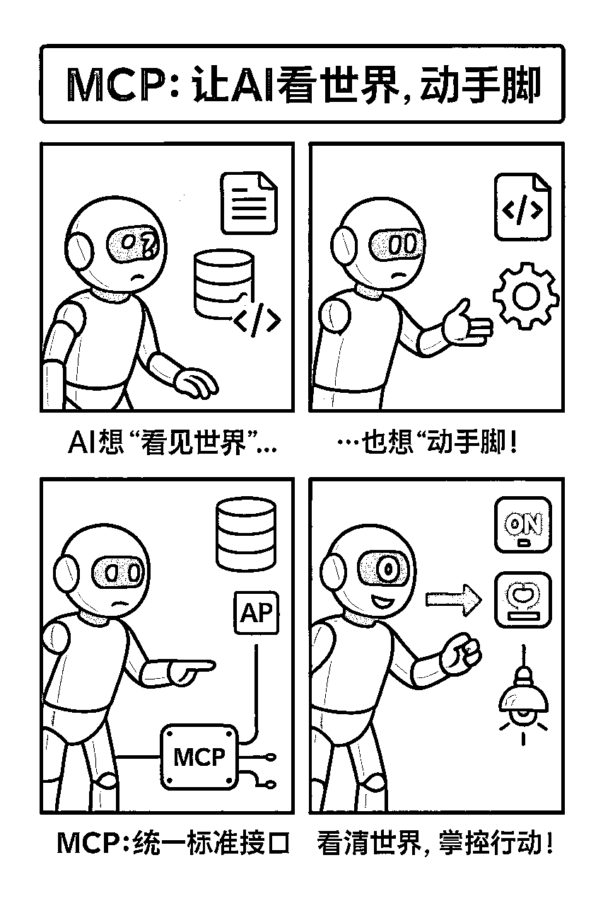