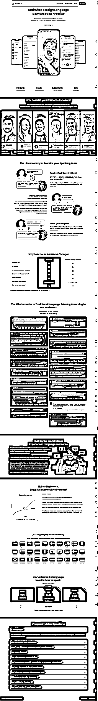
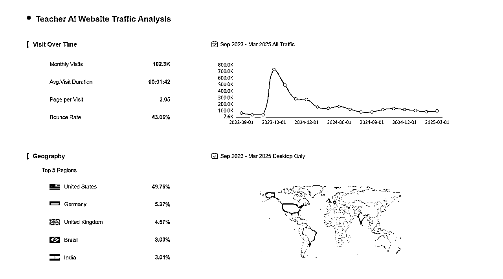
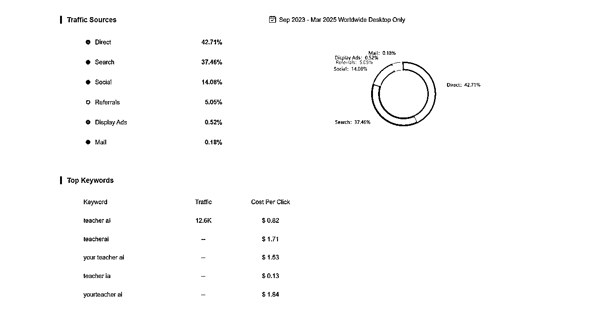
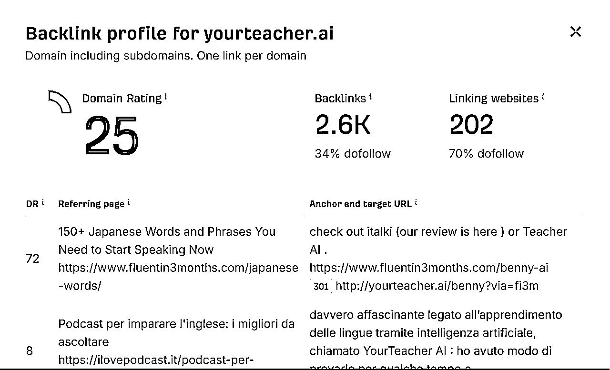
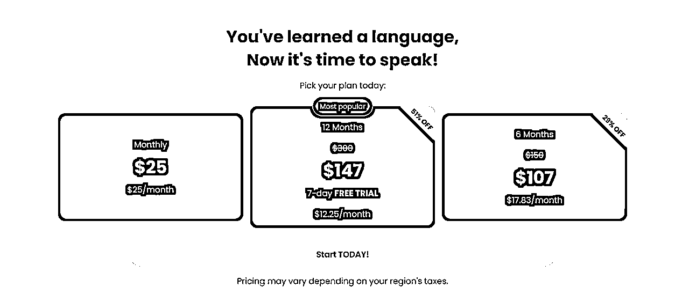
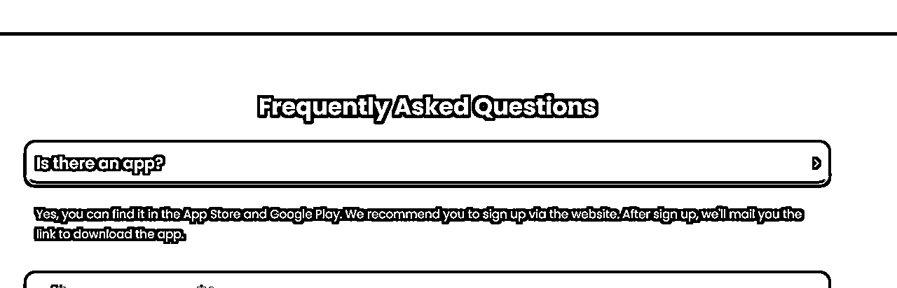

# 502 Teacher AI

> 来源：[https://vz1gcav68m.feishu.cn/docx/Gk6NdKbMIo8PJgxZGfMchbQkn5b](https://vz1gcav68m.feishu.cn/docx/Gk6NdKbMIo8PJgxZGfMchbQkn5b)

# 更新日志

## 2025-04-12

*   当前排位：502

*   这个产品 23年 12 月 流量高峰期，后面一路走低；

*   产品刚上线的时候，Loading Page 做不是很完善，基本上非常粗糙；

*   域名是 6 月底注册，12月流量垂直起来的，说明有付费广告；

*   产品的视频更容易被市场传递；

# 基本信息

## 产品链接

https://yourteacher.ai/

## Home Page

这些落地页，都是经过验证的，是非常值得学习的；

从上面可以推测出，整个产品非常擅长社媒的推广

## 流量

### 基本信息

### 外链

# 问题清单

## 这个产品解决的是什么问题？

统的外语学习方式往往依赖于人工家教，但人工家教存在时间和成本上的限制，难以满足学习者随时随地进行口语练习的需求 。YourTeacher AI 应运而生，它提供了一个全天候开放、价格更具竞争力的替代方案，让学习者可以随时随地进行无限次的个性化会话练习 。对于许多学习者而言，与真人交流外语时常伴有焦虑感，而 YourTeacher AI 提供了一个无压力的练习环境，有效缓解了这种心理障碍 。

## 用户是谁？

*   语言学习者

YourTeacher AI 的主要目标用户是已经具备一定语言基础，但缺乏足够的口语练习机会以提升水平的中级语言学习者 。该平台的设计理念更侧重于口语能力的提升，因此不适合大多数初学者，因为它缺乏系统的课程结构 。此外，对于那些在与真人进行外语交流时感到焦虑或尴尬的学习者，YourTeacher AI 提供了一个更加舒适和放松的练习选择。

## 用户为什么需要它？

中级语言学习者的主要动机在于提高其外语的流利度和口语自信心。他们需要的是个性化的口语练习，而这在传统的语言学习方法中往往难以实现 。

YourTeacher AI 通过提供无限次的对话机会、逼真的 AI 语音以及个性化的学习体验来满足这些需求 。

平台提供的错误纠正、语法解释以及词汇跟踪等功能，也有效地支持了用户的学习进步

## 用户是如何评价它的？包括好评和差评？

### 好评

许多用户认为 YourTeacher AI 是一款能够显著改变他们语言学习方式的产品 。对于性格内向的学习者来说，该平台提供了一个没有压力的口语练习环境，让他们能够更自在地进行交流 。

一些用户反馈表示，通过使用 YourTeacher AI，他们的语言水平在短时间内取得了显著的进步，例如在一周内从 A2 提升到 B1 水平 。用户普遍赞赏 AI 语音的自然度、语言识别的准确性以及随时随地进行练习的便利性 。词汇跟踪功能以及点击生词查看释义的功能也受到了用户的喜爱 。在 YouTube 等视频平台上，也有用户发布了积极的评测，肯定了该平台在语音质量、功能选项和用户体验方面的持续改进 。与聘请真人教师相比，YourTeacher AI 的成本效益也被认为是其重要的优势之一 。

### 差评

尽管 YourTeacher AI 获得了许多积极评价，但也存在一些负面反馈需要关注。

*   部分用户反映该平台的网页版和移动应用都存在技术问题，导致使用不稳定 。用户还抱怨 AI 的响应加载时间不稳定，有时会长时间没有反应 。

*   许多潜在用户希望在订阅之前能够获得免费试用机会 。

*   一些用户指出，AI 有时会听不清他们说的话或者难以理解语境 。

*   尽管平台声称 AI 语音质量有所提高，但仍有用户认为其声音略显机械化 。

*   另一个被提及的缺点是，平台不会自动保存上次对话的进度 。

*   有用户认为，在当前阶段，免费或更便宜的 ChatGPT 可能提供类似甚至更好的价值 。尤其对于需要至少 6 个月起订的订阅模式，部分用户认为其价格偏高 。

*   此外，用户普遍认为 YourTeacher AI 更适合有一定语言基础的学习者，不适合完全的初学者 。还有用户反映手机应用和网页版之间的数据同步存在问题 。

## 它是如何找到用户的？SEO吗？口碑吗？投放吗？达人营销吗？

### 营销渠道与策略

*   YourTeacher AI 与多位在社交媒体上颇受欢迎的语言教师建立了合作关系，例如 Xiaoma (Arieh Smith)，这被认为是其关键的营销策略之一 。

*   该平台还在其网站上展示用户评价，通过积极的用户体验来吸引潜在用户 。

*   通过在 Toolify 等平台上发布文章，展示产品的改进和新功能，可以推断出 YourTeacher AI 也在利用内容营销 。

*   该应用在 App Store 和 Google Play 均有上架，表明其采取了移动优先的策略 。

*   网站流量分析显示，“搜索”（44.01%）和“直接访问”（37.22%）是其重要的流量来源 。这暗示着搜索引擎优化（SEO）和品牌认知度在该平台的推广中发挥着作用。

*   “社交”流量占比 11.36%，这很可能得益于其与网红的合作 。

### 不同获客方式的效果分析

高达 37.22% 的直接访问流量表明 YourTeacher AI 拥有较强的品牌认知度或有效的直接营销手段。44.01% 的搜索流量则说明用户正在积极寻找 YourTeacher AI 提供的解决方案，并且该平台在相关关键词的搜索结果中可能排名较高。11.36% 的社交流量，特别是与 Xiaoma 等知名语言学习者的合作，表明网红营销是其触达目标用户的重要渠道。尽管难以量化，但在 Reddit 和应用商店中存在大量用户评论，也表明该平台具有一定的自然流量和口碑传播效应。提供的资料中没有明确提及付费广告，这可能意味着 YourTeacher AI 更侧重于自然流量和网红驱动的获客方式。

## 它赚钱吗？多少？

YourTeacher AI 采用订阅制的商业模式，提供月度、6 个月和 12 个月三种不同的订阅方案 。月度订阅价格为 25 美元，6 个月订阅价格为 107 美元（平均每月 17.83 美元），12 个月订阅价格为 147 美元（平均每月 12.25 美元） 。所有订阅方案都包含免费试用期，月度方案提供 3 天免费试用，而 6 个月和 12 个月方案则提供 7 天免费试用 。此外，价格可能会因地区税收而有所不同 。

### 定价

### MRR 估算

但根据流量分析，网站月访问量达到 102.3k，那对应的UV是 102.3k /3.05 = 33.5k。

下面的估算是根据月访问量进行估算的，通常每个用户访问的页面越多，可以推测出这个转换率就越高；

着是从网站上的估算，对应的移动端的转会更高。

在没有关于不同订阅方案用户分布和实际转化率的情况下，难以准确估算 MRR。假设一个保守的转化率，即 1% 的网站月访问量转化为付费用户。为了估算 MRR，我们需要对订阅用户在不同方案之间的分布做出假设。根据 SaaS 行业的常见情况，年度订阅通常比月度订阅更受欢迎，占比可能在 42% 左右，其次是月度订阅（36%），季度订阅较少（11%）。YourTeacher AI 提供月度、6 个月和 12 个月的订阅选项。我们可以将 6 个月和 12 个月的订阅都视为年度订阅的范畴，因为它们都代表了更长期的套餐。

假设 42% 的用户选择年度（6 个月和 12 个月）订阅，58% 的用户选择月度订阅 。进一步假设在年度订阅用户中，6 个月订阅和 12 个月订阅各占一半。

*   订阅用户总数估算（基于 1% 转化率）： 102.3k * 0.01 = 1023人。

*   月度订阅用户数： 1023* 0.58 = 593人。

*   年度订阅用户数： 1023* 0.42 = 430人。

*   6 个月订阅用户数： 430/ 2 = 215人。

*   12 个月订阅用户数： 370 / 2 = 215人。

*   更贴近实际的 MRR 估算：

*   月度订阅收入：593 * 25 = 14825

*   6 个月订阅收入：215 * 147 = 31,605

*   12 个月订阅收入：215 * 107 = 23,005

*   总 MRR 估算： 69,435

从三方数据平台查看，ios 和安卓分别是 5k、8k

从官方网站上可以看出来，尽量地去引导用户在官方进行订阅，这样的话

MRR = web MRR + app MRR = 69,435 + 13000 = 82,435

## 我从这个产品身上学到了什么我以前不知道的东西？

*   服务好细分人群: 专注于特定的用户群体（中级学习者）能够更好地定制产品功能和营销策略。

*   订阅制模式对于此类服务来说是一种有效的产生经常性收入的方式 。

*   多种产品方式（web、app），可以多个渠道进行获取流量；

## 它的什么做法,我并不容易？为什么？

### YourTeacher AI 难以被模仿的方面

与知名语言学习网红建立的合作关系，如果没有大量的现有资源或人脉，可能难以复制 。

用于创建逼真语音和准确语言识别的特定 AI 模型和微调技术可能是专有的，需要专业的知识和技能 。随着时间的推移，平台积累的用户数据和反馈，用于提升 AI 的个性化能力，将构成越来越大的优势 。

通过早期进入市场和网红代言建立的品牌认知度和信任度，使其拥有先发优势 。

7.2\. 所需的基础技术与专业知识

YourTeacher AI 构建于 ChatGPT 之上，表明其依赖于大型语言模型 。为多种语言开发和维护高质量的文本转语音软件至关重要，需要专业的知识 。需要强大的服务器基础设施来处理大量并发用户以及 AI 对话的计算需求 。自然语言处理（NLP）和机器学习（ML）方面的专业知识对于持续改进 AI 的准确性、流畅性和个性化能力至关重要 。开发和维护 iOS 和 Android 移动应用程序需要软件开发技能 。

## 如果我是产品的作者,我如何只用一句话,把产品推销给用户？

YourTeacher AI，您的专属 AI 语言教师，随时随地提供无限次个性化口语练习，助您自信流利地说外语。

## 如果我做一个产品解决同样场景的同样问题,我可能采用哪些和它不同的方法? 我的方法比它能更好地解决用户的问题吗？

在产品形态上，我会去考虑去切更垂直的领域或者其他区域的用法，可以考虑 日本、韩国、印度和非洲这些区域。当前产品，官方出现用户体验上的问题，但并没有去很好地解决，我推测很有可能，这个不是绝对性的问题。另外，很有可能这个成本太高，关键还是你能找到正需求，即使产品有些小的问题，用户还是愿意付费。

## 我能做出来吗?需要什么资源？需要的资源我能承受吗？

需要大量投资于 AI 模型的访问和训练（即使是利用像 ChatGPT 这样的现有模型） 。开发多语言高质量的文本转语音和语音识别能力 。

下面重要，但不是那么重要；

*   需要 Web 和移动应用程序（iOS 和 Android）的软件开发专业知识 。

*   需要 UX/UI 设计技能来创建直观且引人入胜的用户体验 。

*   营销和用户获取工作，可能包括合作伙伴关系或广告 。持续的 AI 使用、服务器维护和软件更新成本 。

*   构建和维护强大且可扩展的技术基础设施（服务器、数据库） 。

## 我如何找到用户?

为与 YourTeacher AI 竞争的产品制定用户获取策略时，可以考虑以下渠道和方法：

*   利用搜索引擎优化（SEO），识别相关的关键词 。通过创建对语言学习者有价值的资源（博客文章、指南、比较）进行内容营销 。

*   考虑与语言学习社区、教育机构或组织建立合作伙伴关系 。

*   评估在语言学习者经常使用的平台上进行付费广告的可能性 。

*   探索与规模较小或新兴的语言学习网红合作，他们可能更容易接触 。提供引人注目的免费试用或免费增值模式，以吸引用户并展示价值 。

*   移动端专注于应用商店优化（ASO），以提高在应用搜索结果中的可见性 。

## 为什么是我?我有什么独特之处和这个产品需要的能力特别契合吗?

## 我喜欢这个产品吗?或者说,如果半年我都没有正反馈,我能够在半年内持续不断地和用户沟通、迭代这个产品

# 总结

YourTeacher AI 通过提供便捷、经济且个性化的 AI 口语练习，有效地解决了中级语言学习者在口语练习方面的痛点。其与社交媒体网红的合作以及对用户反馈的重视是其成功的关键因素。然而，技术稳定性、定价策略以及对初学者的适用性仍有改进空间。对于潜在的竞争者而言，复制其成功模式需要克服技术、合作伙伴关系和品牌认知度等多重挑战。创新机会在于结合其优势，弥补其不足，例如提供更全面的课程体系、更灵活的定价以及利用新兴技术。最终，开发类似产品的可行性和成功潜力将取决于对所需资源的充分评估以及个人的长期投入和热情。