# 0基础TK跨境电商 月销万单的调研思路公开！

> 来源：[https://xikbp3he4xj.feishu.cn/docx/OhJkddWSAoa6WlxaVmYcruQlnQd](https://xikbp3he4xj.feishu.cn/docx/OhJkddWSAoa6WlxaVmYcruQlnQd)

调研全流程思维脑图

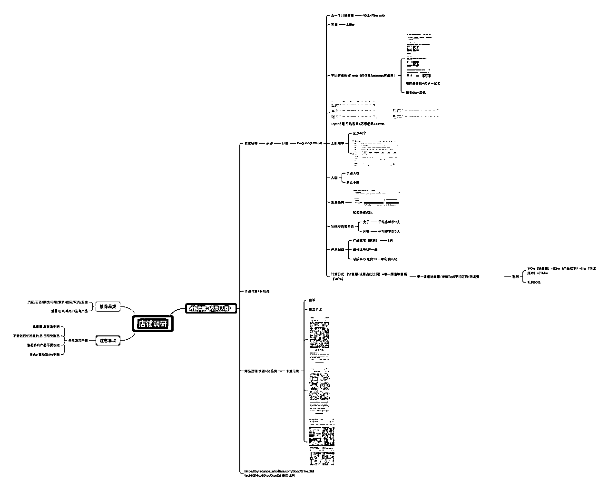

调研本土店原因（调研本土店铺 看模式 看打法 看Top5品类属性 看盈利空间）

## 1.近一个月销售额

第一步 选定商品搜索 地区 品类 本土店

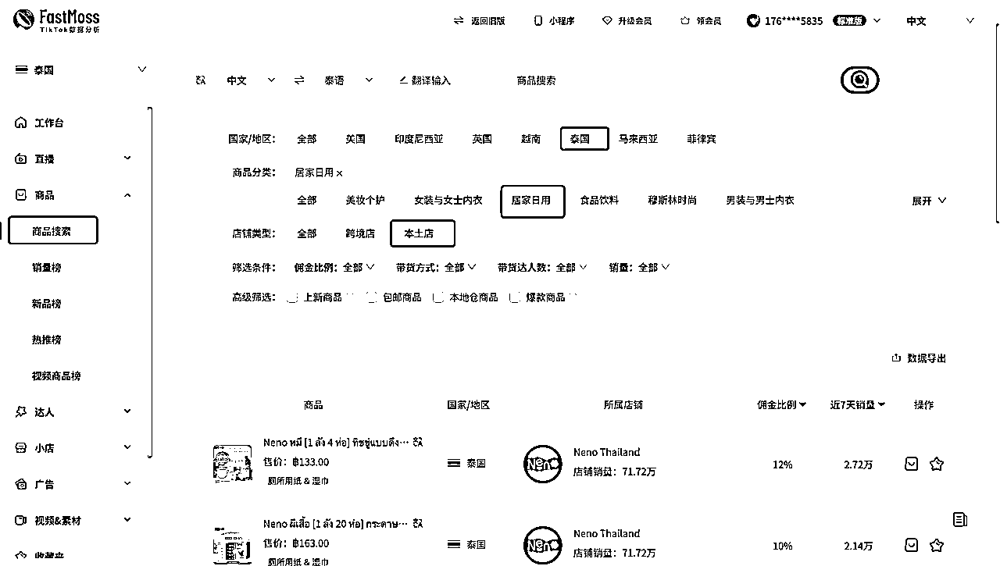

第二步 选定对标卖家 看月GMV+销量

为什么看月的而不是半年的，因为半年前的品跟现在不一样，不同品类都会有应季跟趋势 调研这个环节是为了算利润

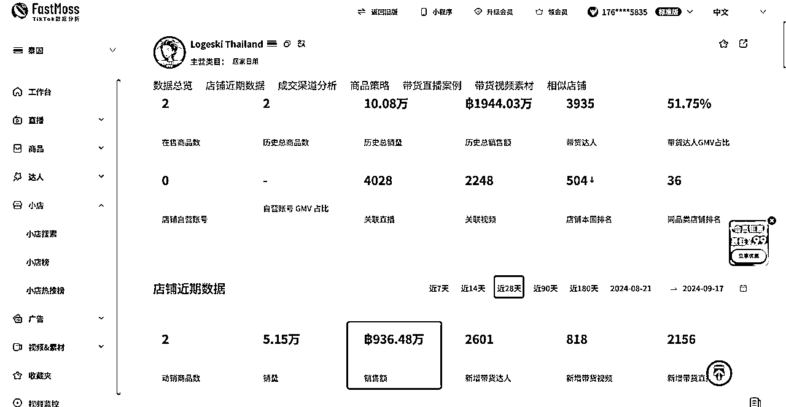

## 2.品类平均客单价（公式：销售额/销量=单价）

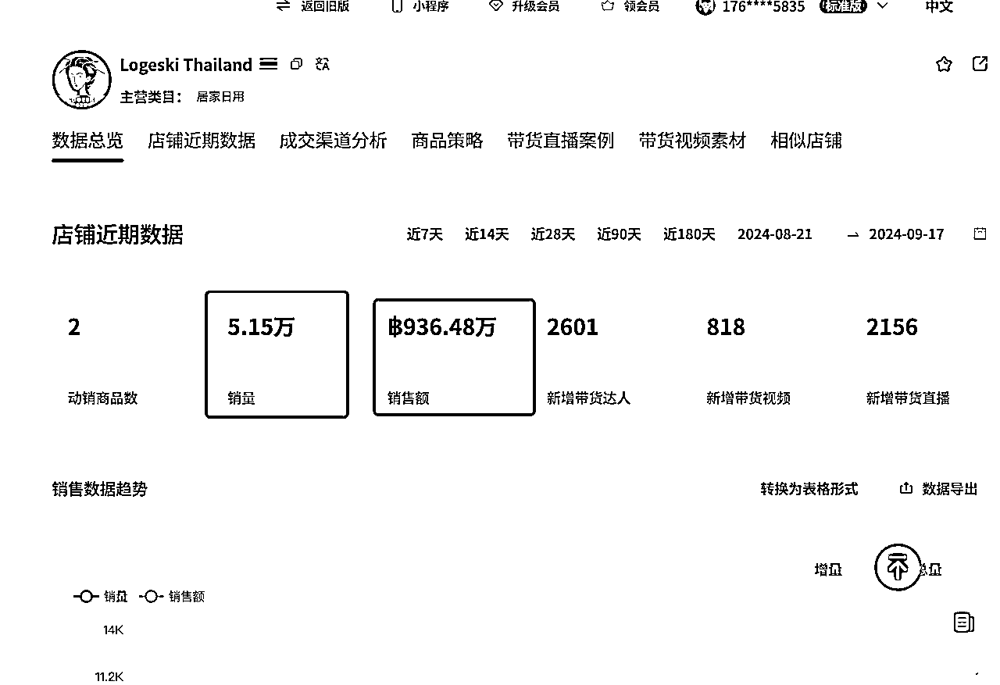

调研平均客单价是为了算利润+了解这个品类在市场的平均客单价

## 3.TOP5销量产品 （公式：Top5的销售额/销量=单价）下方举例：（1740.48w/91659=189）改卖家平均客单价 189泰铢 37.8人民币 3瓶品牌洁厕灵

调研TOP5的商品逻辑是 基本上店铺只有产品爆了才会有利润 产品没爆其实其他的品的销量都是打平或者亏钱的 所以 我们调研top5的产品的选品逻辑+了解他们一个产品挣了多少钱

## 4.上新频率

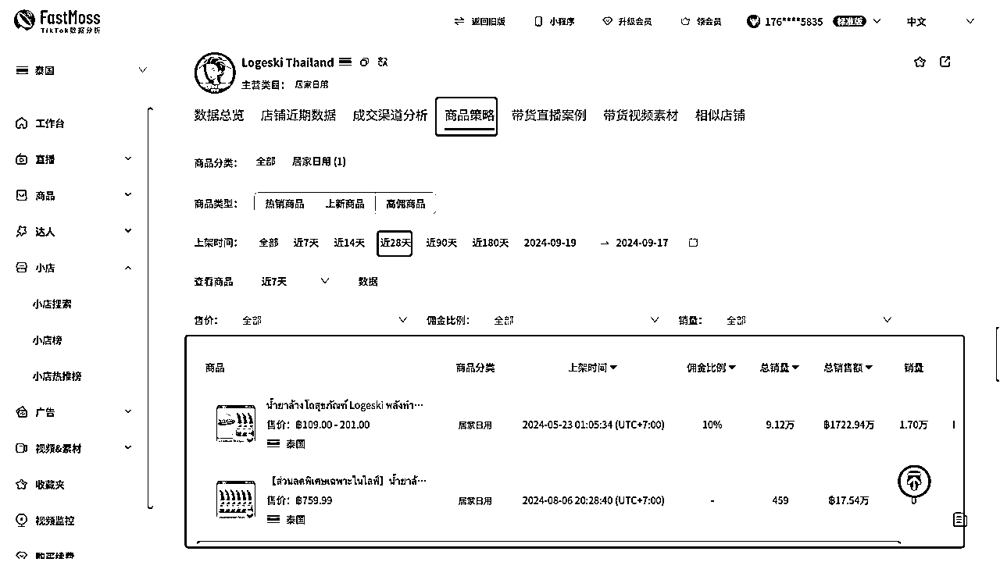

上新频率在跨境店铺上更加关注 本土其实跟跨境上新频率有一些区别 或者从模式上有很大的区别

## 5.流量结构

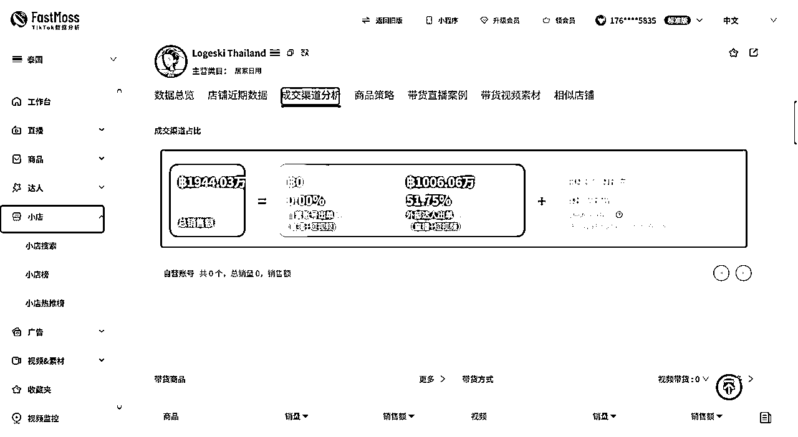

明确该卖家的品类玩法跟打法策略

## 6.单品销售路径

第一步锁定这个单品

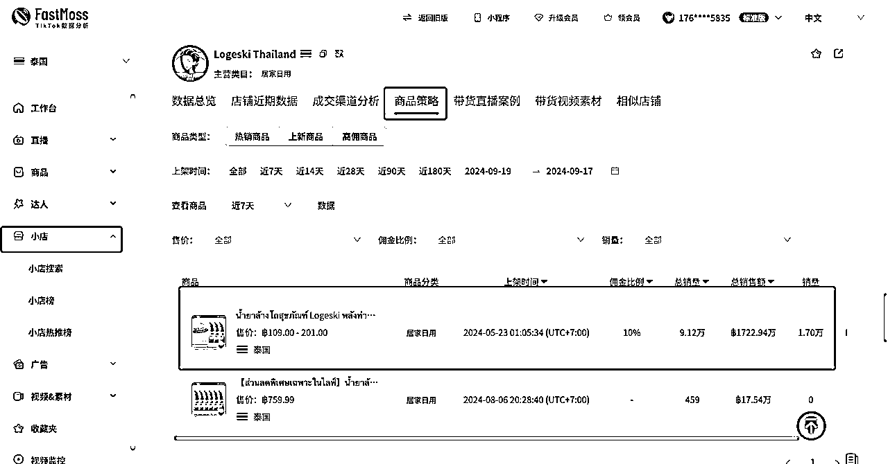

第二步 查看单品销售节奏与销售路径

第三步 查看单品销售路径与成交占比

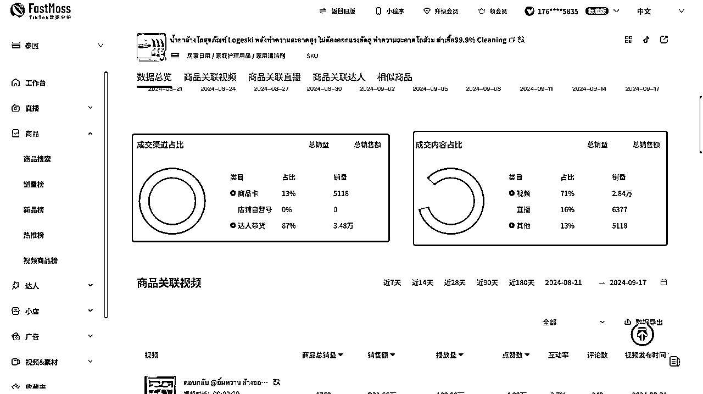

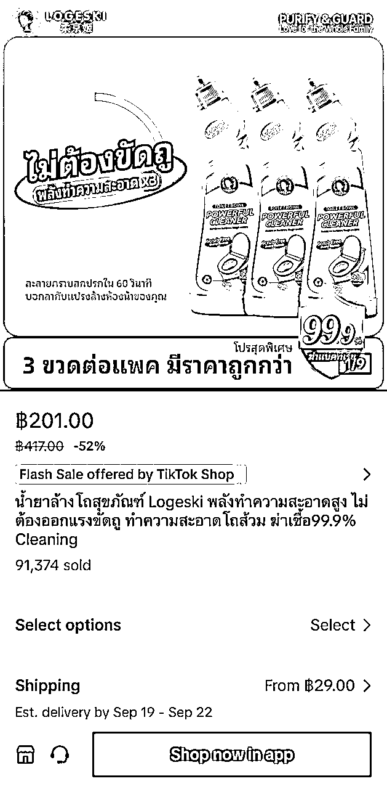

## 7.本土店总结（总结模式 总结打法 总结利润）

总结模式：店铺类型为本土店 而且是柔京姬品牌，这家店铺可能是品牌自己 也可能是品牌授权贴牌，有可能是跨境备货也有可能是本土生产，但是这类型本土备货海运成本会更高，所以他们可能是本地生产贴的中国牌子 或者是品牌自己海运备货也有可能

总结打法：商品卡成交占比是13% 达人带货占比87% 进一步确定是品牌自己，因为经销商是不会帮品牌干这个事的，所以几乎可以确定 品牌找代工厂 自己卖货，整体路径是 GMV MAX+ 视频投流+达人带货，视频占比71%也就说明 店铺卖家的核心动作有三个 1.投流做基础动销+GMV MAX投放 2 达人产生素材投流 3.找直播团队做直播带货

总结利润，因为是品牌 整体ROI很难估算 今天就只算品牌的商城

*   （30天总销售额*最大流量渠道占比）=30天单一渠道销售额 936.48w*48.25%=451.8w泰铢 （30天商品卡销售额）

*   （30天总销量*最大流量渠道占比）=30天单一渠道销量 51500*48.25%=24848单 （30天商品卡销量）

*   （单一渠道GMV/单一渠道单量=单一渠道平均客单价）451.8w/24848=181.82泰铢=平均36rmb

目前如果1688常规同款成本在1-3块一瓶 如果东南亚本地代工厂会更便宜，我们假定成本是3块+本土物流成本的话是3块 加起来成本是6块 也就是30泰铢

*   毛利公式=销售额-产品成本-投流成本 =总毛利（451.8w-74.5w-x）=377.3w泰铢-x

也就是说他的毛利在83%左右-投流成本 净利润需要数据来测算

目前东南亚本土的毛利 基本也都在50%以上 除非是高频复购的刚需品 东南亚的模式非常多也非常杂 具体要根据实际情况来测算，通过这个卖家我们知道了 模式 打法跟利润，下一步我们要调研无货源，为什么调研本土 是因为 无货源可能只是做东南亚的第一步 接下来我们看看东南亚无货源的利润是如何的

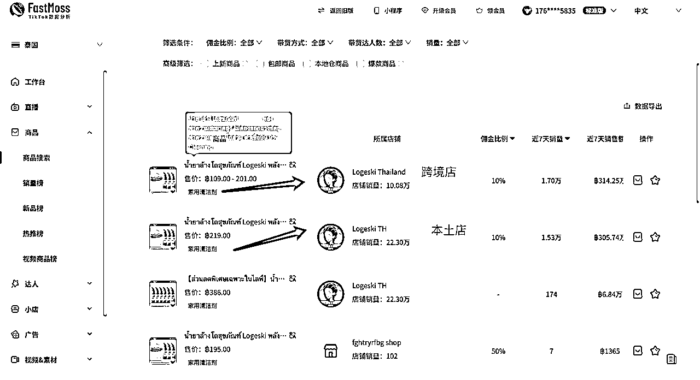

二,跨境店铺调研路径

## 1.单品单店销售额数据

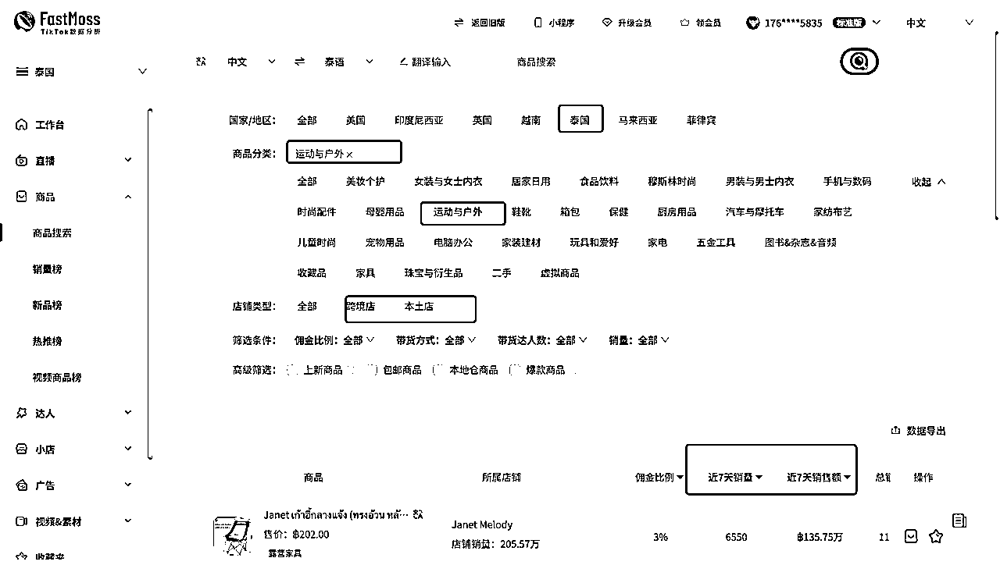

做跨境店铺调研 首先我们理解透 跨境店 不是靠店铺赚钱 而是靠单品赚钱的，所以 我们检索好后 直接看销量就好，我们就看新品利润即可

## 2.找到单品可跟品的产品

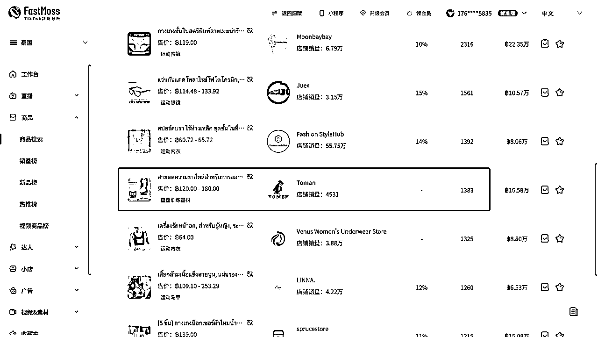

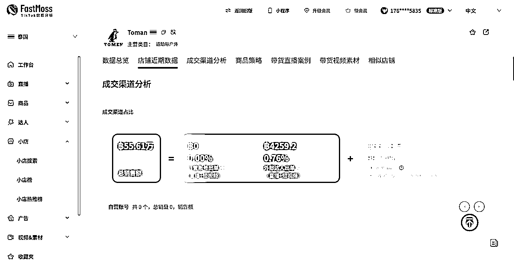

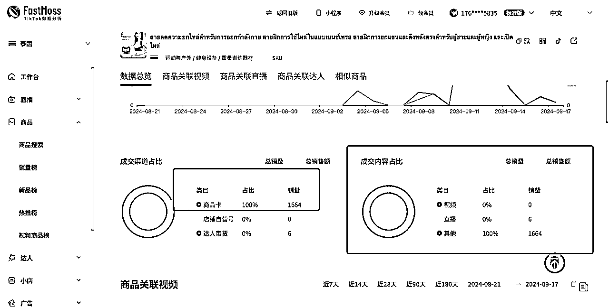

1688产品成本6块运费6块 卖价24-36 一单大概10-20的利润 7天买了1383单 也就是单品挣了一万多块钱 纯商品卡自然流 无投流 无达人，这个本质上就是跨境无货源的逻辑，所以其实跨境无货源没有所谓的复杂的调研，前期大量的找品 能赚钱就可以 大规模上品 通过运营的方法来把链接打起来

以上就是TikTok调研全流程，我认为没有比这一步更重要的事儿了 所以大家再去做TikTok的时候 找准核心