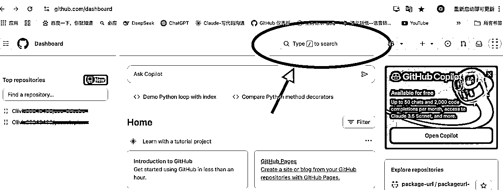

# 小白Web航海手册（结合Web航海手册服用）

> 来源：[https://kw0us09kc94.feishu.cn/docx/Lb8hdUTJcoJanXxq9LscqIgRnnf](https://kw0us09kc94.feishu.cn/docx/Lb8hdUTJcoJanXxq9LscqIgRnnf)

大家好，我是花花。

对于一个新手小白来说，跟着手册依然会遇到很多问题，有时候可能手册步骤写的没有那么详尽，我就会不敢轻易乱动，生怕一个不小心就前功尽弃。同时我也发现群里好多小伙伴都遇到和我一样的困惑，所以决定写这篇小白手册，补充一下我觉得航海手册里可能会有疑虑的地方（有基础的大神可以自动忽略我这篇哈哈哈哈哈），希望能帮助到小白们尽快成功上线第一个网站！（我已经成功上线第一个网站啦！开心！大家一起加油！）

【目录】

一、找单页小游戏并上线

二、数据分析与网站调整（大白话来说就是能帮助你看到有多少人访问你网站）

一、找单页小游戏并上线（以下序号为航海手册中序号，方便大家定位）

3.3.2

好多人会对这里有疑惑，我就写一下我是怎么做的。

1.这里写的就是手册下面3.3.3.1里你自己购买的域名，比如我的就是zoo-3dcube.online

2.这里写的是游戏名，我的理解是介绍一下你这个网站的功能，我就写的和网址上差不多，zoo-3dcube

3.这里要去GitHub自己找一个可以iframe嵌入的开源小游戏，并且打开游戏后复制网址，就是3这个位置要填写的内容。具体做法如下：

注册GitHub后打开，会有两种界面，没关系，都一样，去上面搜索框搜索就可以。

我是搜索iframe game

从下面的帖子里找到可以打开的小游戏，我就随便挑了一个，打开，复制游戏网址，然后粘贴到上面那段话的“3”位置，就可以了。

3.3.3.1注册域名

这里搜索的是你网站前面的名字，也是你将来想让别人搜索的时候搜索的名字（不包含后缀），我就搜索的是zoo-3dcube

（有时候自动登录进去是这个页面，点击domains就可以）

然后在domains里输入你网址前面的名字，选择一个你喜欢的后缀付款就可以了。

这边先点一下右边的add to cart，加入购物车，然后才能进行结算。

结算的时候我选择的支付宝，会要求填写你的地址什么的，随便写就好啦！

我在付款时候付了好几次都不成功，要么是实名不成功要么是付款不成功，没关系的，多试几次就好啦！

3.3.3.2

这里的名字就写后缀前面的名字就好啦，比如我写的就是zoo-3dcube

下面有个选择公有仓库（public）还是私有仓库（private），如果你不想让人被看见仓库就私有，不过好像私有有数量限制。

3.3.3.3 在cf绑定域名

这里好多人看到这步没看懂，其实上图的两个域名是为了复制到spaceship的。

在cloudflare操作到这步时候，图上画圈的地方会显示你自己的子域名，你复制下来以后，打开spaceship

在spaceship里搜索你购买的域名（如果比较少可以直接找到，不需要搜索），点击右边的columns

然后点击右边nameservers

点击change

下面把你刚刚在cloudflare里复制的子域名粘贴到这里

后面按照手册里的步骤继续往下就可以啦！

二、数据分析与网站调整

3.5.3.3

这一步代码不会立即出来，要等一会儿，我点了右上角下一步以后半天没出来，还以为哪里出问题了，其实就是多等一会儿，大概将近1分钟，如果你长时间没出来，刷新一下重复步骤就可以。

下面把你这个代码发给Claude，让它帮你加到原来代码里，我是有历史问答记录，就在原来的对话框里输入了。

历史记录：

我是这么和它说的：

然后Claude会把完整代码发给我，复制以后，打开你存代码的地方，我是用的GitHub

登陆GitHub后在左边选择对应的项目

选择index文件

点击右边的编辑，把原来代码删掉，粘贴新的完整代码

保存，点击右边commit changes

然后就可以去GSA里测试了

上面是我作为新手小白会遇到的一些困惑和问题，我按我的理解整理出来了，如果有不对的欢迎大家批评指正，也希望能够帮助到大家！