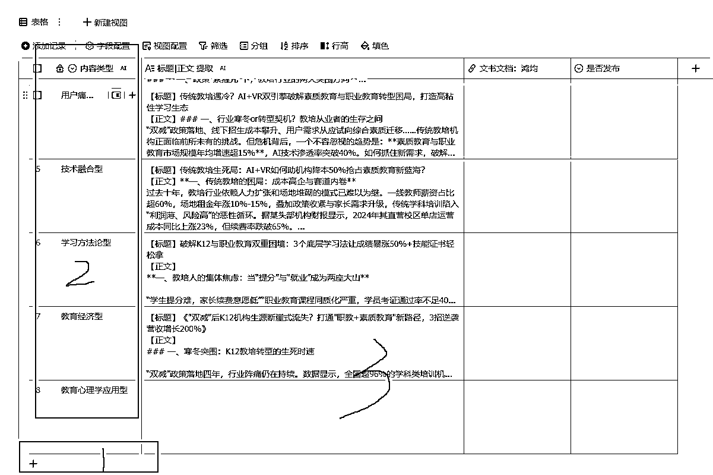
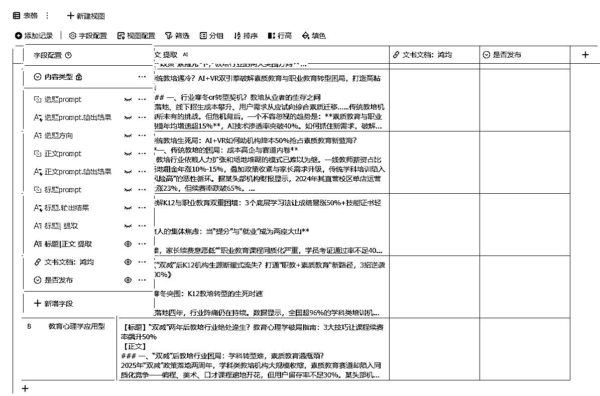
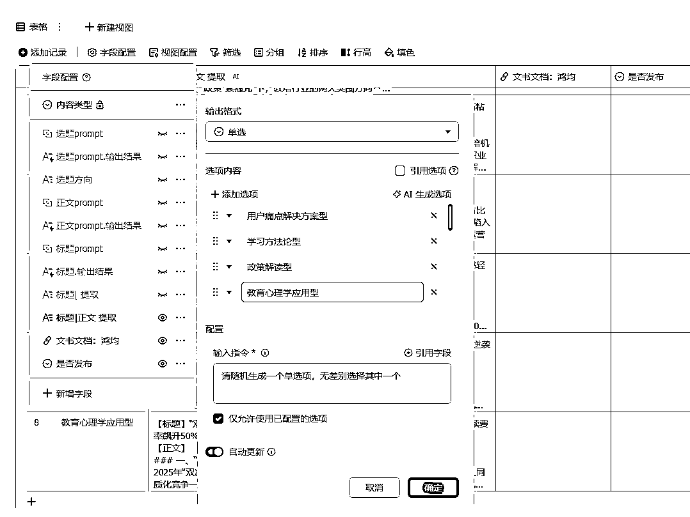
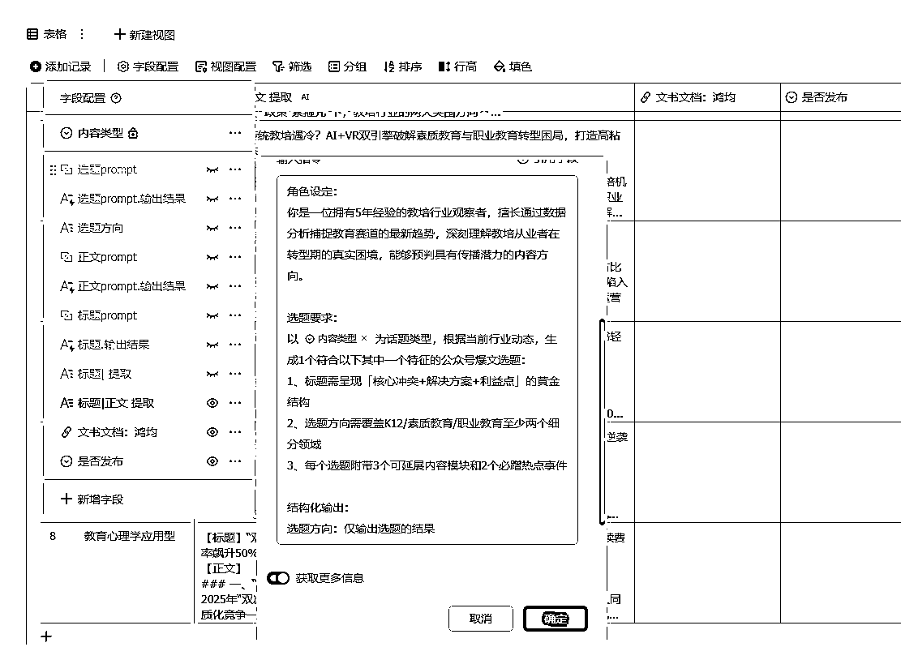
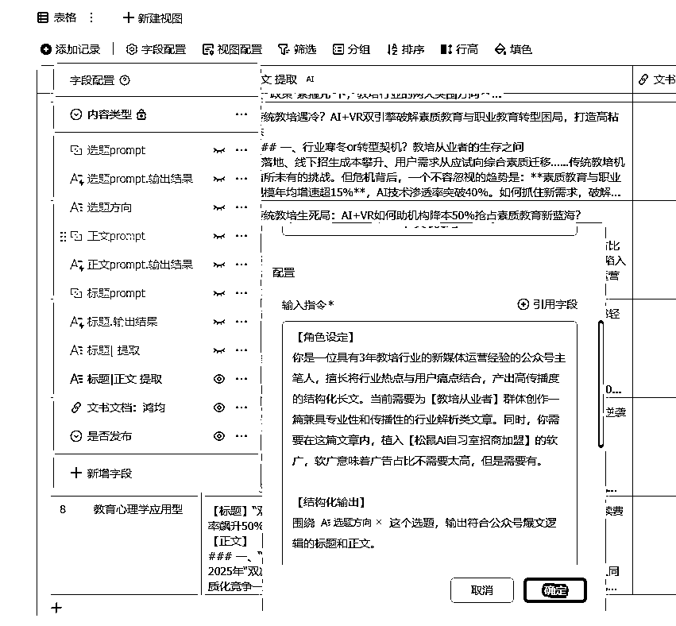
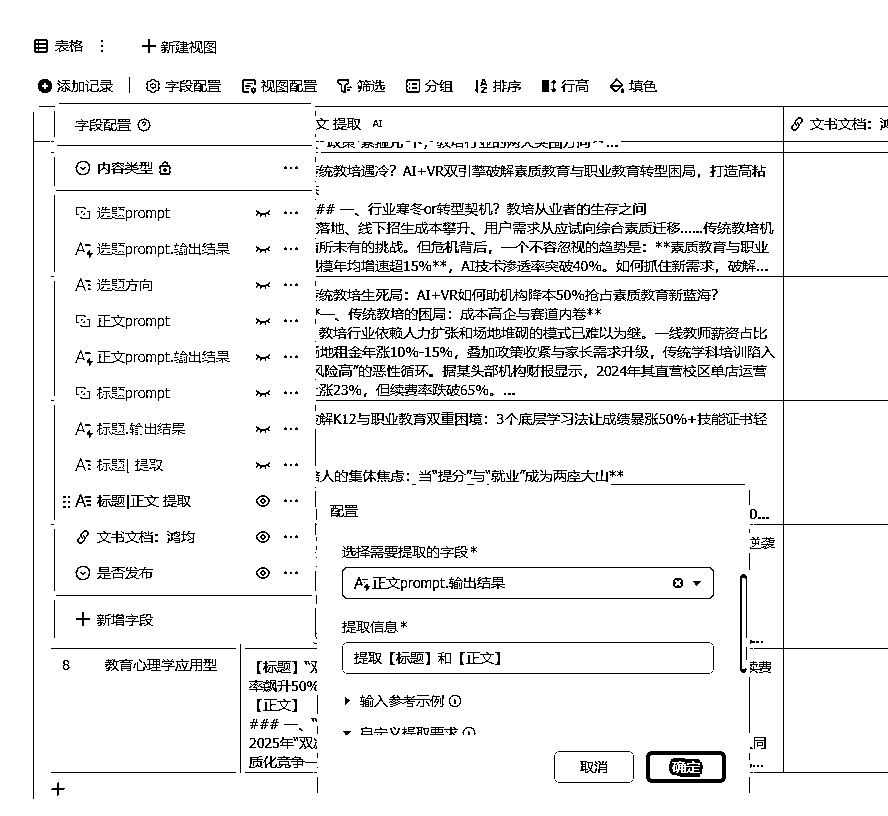
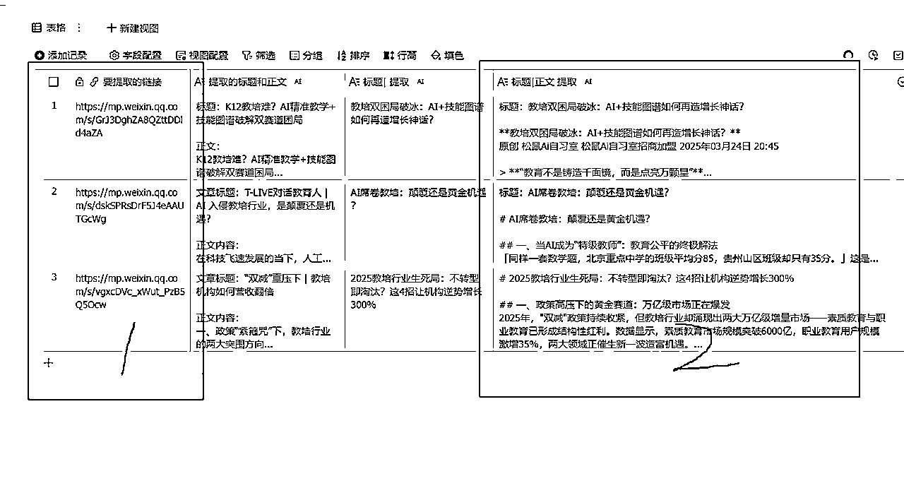
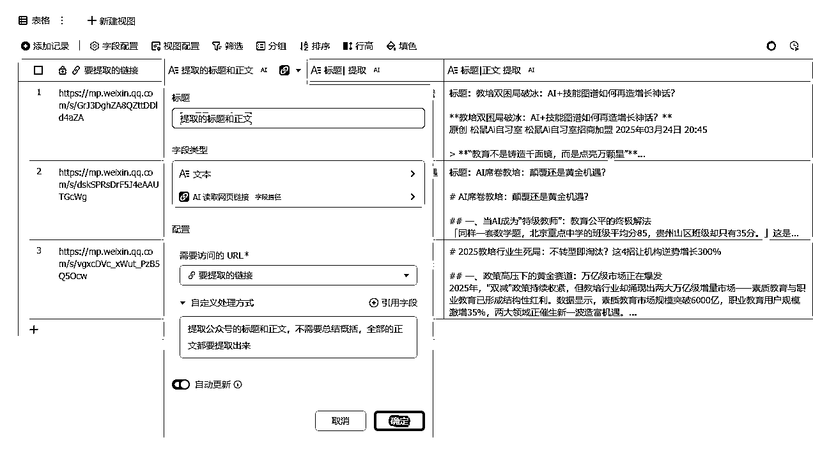
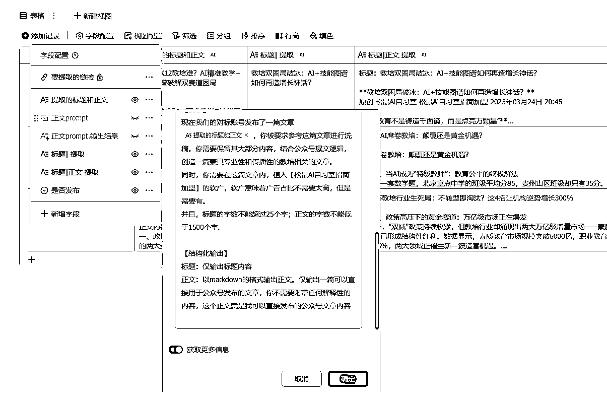

# 飞书+多维表格，十倍提高生产效率

> 来源：[https://dvf2zng5ylz.feishu.cn/docx/LbjcdeQLyoo7Y8x0xe0cEW3knC2](https://dvf2zng5ylz.feishu.cn/docx/LbjcdeQLyoo7Y8x0xe0cEW3knC2)

今天和朋友分享了个多维表格，本来也觉得没啥，但朋友大受震撼。本着哪怕让一小部分人受益也是好事的原则，决定做个经验贴。但又着急下班，于是做个简单的分享，和操作演示（懒得美化排版了 hhh）

背景是：最近和朋友搞 K12 的一个项目的招商，要做公众号内容。我本身是不咋会写公众号内容，并且这类型内容就是糅合各种资讯，我写的多半也不如 AI 写的好，于是一开始用 AI 写了几篇。但发现了两个问题：

1.  每次写完还要重新调整格式，输出的结果不是很统一，还得手动微调

1.  每次问完后，第二篇文章又得再问一次，还基本都是重复性的内容，太费时间了

于是，想到用多维表格来自动生成。我上个月才开始了解多维表格，于是那个时候花了 2 天学习了多维表格，后来也花了 2 天时间做了点小的应用案例，觉得应该难度不大，就动手做了下面的东西，也就是今天想要分享给大家的。

# 一、公众号写作自生成

先说一下最终的效果，大概是三步走：

1.  点击【+】

1.  自动生成 12 种内容类型的其中 1 种（这 12 种类似是 AI 告诉我的）

1.  【3】就会生成一篇标准化的公众号文章，包含标题和正文。标题符合了公众号的爆款逻辑，正文符合我设定的结构模版。

最终就是，我想要写一篇文章，我只需要点个【+】，就自动生成一篇符合我要求的公众号内容。并且这篇公众号内容 100%符合公众号的爆款逻辑，因为我设定的指令就是要他这么写的

具体怎么操作呢？ 我给出里面设置的字段吧，稍微懂点多维表格能 get 到逻辑就好了，毕竟我的指令也全部是 AI 帮我写的，整个多维表格没一个是我写的，我真的好没用....

写让 AI 帮我生成个内容类型

再生成个选题

再输出正文

再根据要求提取标题和正文，前面还有一步是优化标题，但是这步后面可以删了，我的指令微调一下就好了

* * *

# 二、公众号写作自动洗稿

搞定，蛮简单的。除此之外，我还做了个自动洗稿的玩意，我觉得也挺好玩的。

简单来说是两步走：

1.  输入要洗稿的公众号文章的链接

1.  生成洗稿后的标题和正文。并且，标题和正文都符合公众号爆款逻辑，因为我设定的指令就是如此。

具体操作也很简单：

先提取链接的文字

再根据提取的文字洗稿

其实我还做了个短视频的版本，但逻辑也一样，做完公众号的再去做短视频的，也就花了 1 个小时。

做完就是感慨，如果请个实习生，一天写 3 篇就够呛，而且写的质量还参差不齐。但是我现在可以让 AI 一天给我写 100 篇，并且几乎篇篇高质量，写 100 篇的 API 价格可能就 10 块钱吧。

真香。

世界真是个巨大的草台班子。