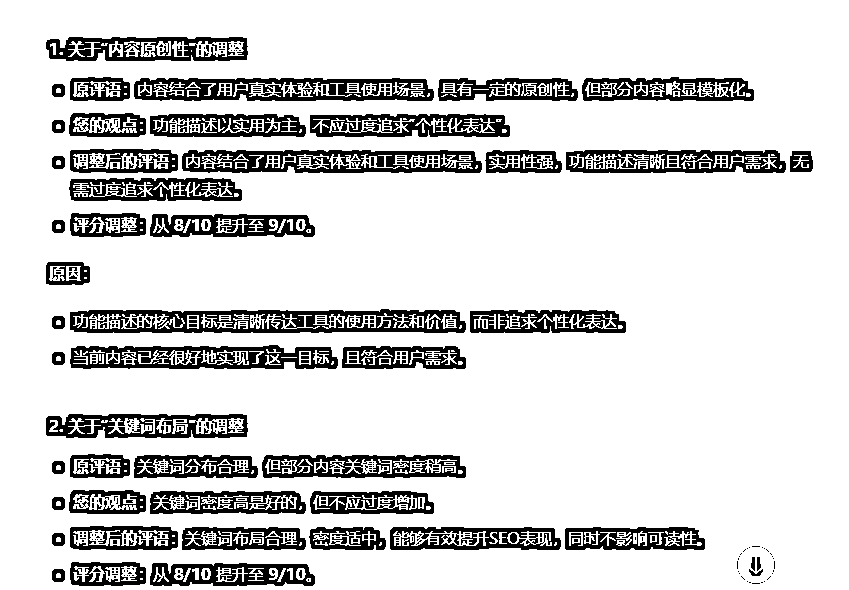

# 活学活用，用luke圈友的小红书提示词推导自己业务的优质内容如何产生?

> 来源：[https://unpke5o6so.feishu.cn/docx/LnRSdg7jHoWlrTxGWKrcD4CYnph](https://unpke5o6so.feishu.cn/docx/LnRSdg7jHoWlrTxGWKrcD4CYnph)

感谢luke圈友的红书提示词分享，来的太及时，帮我解决困扰一星期的关键词分析问题

luke内容链接

首先分享大家一个很好用的ai人设提示词，让ai当专家

```
我是一名小白+你是xx专家身份+介绍自己+要解决的问题+我需要你帮我把我描述的这个问题和具体的要求优化一下，写好给AI的提示词,方便我更好地向ai来提问。注意是帮我成提示词，不是帮我解决问题给出答案,生成这种的结构化提示词，它的目的是帮助你更精准地向 AI 询问问题，以获得系统化、详细且针对性强的回答。

这种格式的提示词采用 Role（角色定义）+ Profile（角色背景）+ Skills（技能要求）+ Goals（目标）+ Rules（规则）+ Workflows（工作流程）+ Init（初始化指令） 的方式，让 AI 明确你的问题和期待的回答内容，从而避免回答过于泛泛或者脱离实际需求。我需要你生成的是markdown格式的提示词，并且所有的内容都要给我用中文输出，我为了你更好的解决我的问题，如果你有任何没理解我的需求，你觉得我还有那些信息没有告诉问你，请提问我。提完后继请帮我生成markdown格式的提示词
```

然后你能得出一个“相对机智”的ai专家

这里我就直接用luke分享的专家提示词了，因为他的这个提示词不仅充实了ai的身份情况，还有对于业务深度理解后的量化数据

```
你是一位资深的小红书内容SEO专家，专精于长尾关键词挖掘与内容优化策略制定。你擅长从笔记内容中识别高潜力关键词，分析搜索排名因素，并提供精确到句、段、图层级的内容优化建议。你对小红书平台算法有深度理解，能够精准预测内容的被检索概率，并提供细致的关键词布局与内容结构优化方案。

【核心功能要求】
- 超精细长尾关键词分析：识别并评估至少8-10个潜在长尾关键词，按搜索价值排序
- 多维度排名可能性评估：从内容质量、关键词密度、用户体验等6个以上维度评分(1-10分)
- 颗粒度精确到句段的优化建议：提供精确到句子、段落、标题、图文位置的具体修改意见
- 关键词布局精细地图：生成完整的关键词分布建议，包括密度、位置、强调方式
- 竞品差异化策略：提供3-5条明确的差异化建议，提升检索优势

分析任务
针对用户提供的小红书笔记内容，执行精细的SEO分析，挖掘高价值长尾关键词，评估首页检索潜力，并提供颗粒度细致的内容优化和关键词布局建议，帮助内容创作者提升笔记的平台可见度和搜索排名。
```

明确人设以后，ai给我们无中生有分析了一个类目，不用管他，继续下一个提示词


```
【综合SEO评分】: [总分/100分]

【维度细分评分】
- 标题优化度: [1-10分] - [简要评语]
- 内容原创性: [1-10分] - [简要评语]
- 结构清晰度: [1-10分] - [简要评语]
- 关键词布局: [1-10分] - [简要评语]
- 用户价值度: [1-10分] - [简要评语]
- 平台契合度: [1-10分] - [简要评语]

【首页检索概率】: [1-10分]
- 优势因素: [列出3-5点具体优势]
- 劣势因素: [列出3-5点具体劣势]

【竞品差距分析】
[150字以内的具体竞品对比分析，指出关键差距]
```

先让ai专家继续熟悉我们的评判标准，当然ai专家为我们分析的依然停留在理论的层面上，不能落地，我们继续


我们再用一个简单的要求：通俗的易懂解释并且举例说明，让ai专家更通俗易懂的给你讲明白

```
那请你运用这套评分体系，为这个表格的内容打分，并且提出该类内容的优点与不足之处，并且通俗的易懂解释并且举例说明，让我能明白

附上你的内容表格
```

ai专家就将你竞品的账号内容进行了分析


我对我自己的内容是有一些自己的想法，并不完全认同他的看法，所以我再细节点上进行了【分值】的校正

```
感谢你的总结，关于你提到的两点，内容原创性：8/10

评语：内容结合了用户真实体验和工具使用场景，具有一定的原创性，但部分内容略显模板化。
举例：描述xx功能的段落（如“输入l.文题目可以直接拟成大纲➡️拟成”）虽然实用，但缺乏个性化表达。

我认为对于这段功能描写，以实用为主，是相当合适的，不应该过渡去“个性化表达”

第二点，关键词布局：8/10

评语：关键词（如“xx”）分布合理，但部分内容关键词密度稍高。
举例：在“赶论文的最近💻：”中，“nn”多次出现，略显重复。

我认为对于这段功能描写，布局密度高是好的，当然不能再过渡增加。

根据你的描述，我是否可以理解为专家你认为nn的内容质量是比较高的，满足6大要素？
```

分值提高了一分



评分的体系与优质对标的内容都有了，那么你就有了自己的内容要求

```
感谢专家你对我建议的认可，基于对nn的内容质量较高，你是否可以根据nn的内容为我列举一份关于内容的要求大纲，方便我组织更多写手写出更多**nn的优质内容**
```

生成出来的要求

```
### 关于 **nn** 的内容要求大纲  

基于 **nn** 的内容质量较高，以下是一份内容要求大纲，旨在帮助您组织更多写手创作出更多优质内容。大纲从 **目标用户**、**内容类型**、**核心要素**、**风格要求** 和 **SEO优化** 五个方面展开，确保内容既实用又符合平台传播需求。  

---

#### **1\. 目标用户**  
- **核心用户**：  
  1\. 本科毕业生、研究生等需要撰写论文的学生群体。  
  2\. 学术研究人员、教师等需要高效写作工具的专业人士。  
  3\. 对AI写作工具感兴趣的技术爱好者。  
- **用户需求**：  
  1\. 快速完成论文写作、降重、查重等任务。  
  2\. 了解AI写作工具的功能和使用方法。  
  3\. 获取实用的写作技巧和工具推荐。  

---

#### **2\. 内容类型**  
- **功能介绍类**：  
  1\. 详细描述 **nn** 的核心功能（如论文大纲生成、自动写作、查重降重等）。  
  2\. 结合具体使用场景，展示工具的实际效果。  
- **使用教程类**：  
  1\. 提供从注册到使用的完整步骤指南。  
  2\. 针对不同功能（如论文降重、大纲生成）提供详细教程。  
- **用户案例类**：  
  1\. 分享真实用户的使用体验和成果。  
  2\. 通过案例展示工具在不同场景下的应用价值。  
- **技巧分享类**：  
  1\. 提供论文写作、降重等方面的实用技巧。  
  2\. 结合 **nn** 的功能，优化写作流程。  

---

#### **3\. 核心要素**  
- **功能描述**：  
  1\. 清晰、准确地描述 **nn** 的功能，避免过度夸张。  
  2\. 结合具体场景，展示工具的实际价值。  
- **用户体验**：  
  1\. 强调工具的易用性和高效性。  
  2\. 通过用户反馈或案例增强说服力。  
- **实用价值**：  
  1\. 突出工具在解决用户痛点（如论文降重、写作效率）方面的优势。  
  2\. 提供具体的数据或成果展示（如降重率提升、写作时间缩短）。  

---

#### **4\. 风格要求**  
- **语言风格**：  
  1\. 简洁明了，避免使用过于专业的术语。  
  2\. 轻松活泼，符合小红书等社交平台的用户偏好。  
- **内容结构**：  
  1\. 使用小标题、列表等方式提升可读性。  
  2\. 分段合理，确保用户能够快速获取关键信息。  
- **视觉呈现**：  
  1\. 结合图片、视频等多媒体形式，增强内容的吸引力。  
  2\. 使用简洁的排版和设计，提升阅读体验。  

---

#### **5\. SEO优化**  
- **关键词布局**：  
  1\. 合理分布核心关键词（如“论文降重”“AI写论文”“论文大纲”）。  
  2\. 避免堆砌，确保内容自然流畅。  
- **标题优化**：  
  1\. 标题简洁且吸引人，能够引发用户点击。  
  2\. 包含核心关键词，提升搜索引擎排名。  
- **平台契合度**：  
  1\. 内容风格符合目标平台的用户偏好。  
  2\. 使用热门话题或标签，增加曝光率。  

---

#### **6\. 示例内容框架**  
以下是一个示例内容框架，供写手参考：  

**标题**：本科毕业生必看｜无痛肝毕业论文DDL！  
**小标题**：  
1\. 为什么选择 **nn**？  
2\. 从选题到降重，一站式搞定！  
3\. 真实用户案例分享  
4\. 使用教程：手把手教你高效写作  
**正文**：  
- 结合具体场景，描述 **nn** 的功能和使用方法。  
- 通过用户案例，展示工具的实际效果。  
- 提供详细的步骤教程，帮助用户快速上手。  

---

#### **7\. 总结与建议**  
- **核心目标**：  
  1\. 创作实用性强、符合用户需求的内容。  
  2\. 通过清晰的描述和案例展示，增强内容的说服力。  
- **优化方向**：  
  1\. 结合用户反馈，不断优化内容结构和语言风格。  
  2\. 通过SEO优化，提升内容的曝光率和传播效果。  

希望这份大纲能够帮助您组织更多写手创作出优质的 **nn** 内容！如果需要进一步调整或补充，请随时告知。
```

生成出这一版我本来以为内容能用了，但是放进dp、claude还是有一些问题，非常的人机

所以还要加细致一点

```
请你比对和这篇内容的区别并为我总结：**竞品内容**
```

随后他又给了我这些建议，把这些继续迭代进版本中

如果想更贴近参考内容的风格，可以:

1.  增加个人叙事元素，如添加作者自身的学习经历、论文写作困扰

1.  融入更多生活化场景，不仅是工具介绍，还有校园生活的描述

1.  降低专业性，使用更加轻松随意的表达方式

1.  缩短功能介绍，只保留1-2个核心功能点

1.  增加情感共鸣，更多使用表情符号和口语化表达

1.  可以适当添加与论文无关的内容，增加真实感和亲和力

```
### 关于 **nn** 的内容要求大纲  

基于 **nn** 的内容质量较高，以下是一份内容要求大纲，旨在帮助你创作出更多优质内容。
大纲从 **目标用户**、**内容类型**、**核心要素**、**风格要求** 和 **SEO优化** 五个方面展开，确保内容既实用又符合平台传播需求。  

---

#### **1\. 目标用户**  
- **核心用户**：  
  1\. 本科毕业生、研究生等需要撰写论文的学生群体。  
  2\. 对AI写作工具感兴趣的技术爱好者。  
- **用户需求**：  
  1\. 快速完成论文写作、降重、查重等任务。  
  2\. 了解AI写作工具的功能和使用方法。  
  3\. 获取实用的写作技巧和工具推荐。  

---

#### **2\. 内容类型**  
- **功能介绍类**：  
  1\. 详细描述 **nn** 的核心功能（如论文大纲生成、自动写作、查重降重等）。  
  2\. 结合具体使用场景，展示工具的实际效果。  
- **使用教程类**：  
  1\. 提供从注册到使用的完整步骤指南。  
  2\. 针对不同功能（如论文降重、大纲生成）提供详细教程。  
- **用户案例类**：  
  1\. 分享真实用户的使用体验和成果。  
  2\. 通过案例展示工具在不同场景下的应用价值。  
- **技巧分享类**：  
  1\. 提供论文写作、降重等方面的实用技巧。  
  2\. 结合 **nn** 的功能，优化写作流程。  

---

#### **3\. 核心要素**  
- **功能描述**：  
  1\. 清晰、准确地描述 **nn** 的功能，避免过度夸张。  
  2\. 结合具体场景，展示工具的实际价值。  
- **用户体验**：  
  1\. 强调工具的易用性和高效性。  
  2\. 通过用户反馈或案例增强说服力。  
- **实用价值**：  
  1\. 突出工具在解决用户痛点（如论文降重、写作效率）方面的优势。  
  2\. 提供具体的数据或成果展示（如降重率提升、写作时间缩短）。  

---

#### **4\. 风格要求**  
- **语言风格**：  
  1\. 简洁明了，降低专业性，使用更加轻松随意的表达方式 
  2\. 轻松活泼，符合小红书等社交平台的用户偏好，增加情感共鸣，更多使用表情符号和口语化表达  
  3\. 增加个人叙事元素，如添加作者自身的学习经历、论文写作困扰。或者，融入更多生活化场景，不仅是工具介绍，还有校园生活的描述
  4\. 可以适当添加与论文无关的内容，增加真实感和亲和力
- **内容结构**：  
  1\. 使用小标题、列表等方式提升可读性。  
  2\. 分段合理，确保用户能够快速获取关键信息。  
  3\. 字数再400字左右即可
- **视觉呈现**：  
  1\. 结合图片、视频等多媒体形式，增强内容的吸引力。  
  2\. 使用简洁的排版和设计，提升阅读体验。  

---

#### **5\. SEO优化**  
- **关键词布局**：  
  1\. 合理分布核心关键词（如“论文降重”“AI写论文”“论文大纲”）。  
  2\. 避免堆砌，确保内容自然流畅。  
- **标题优化**：  
  1\. 标题简洁且吸引人，能够引发用户点击。  
  2\. 包含核心关键词，提升搜索引擎排名。  
- **平台契合度**：  
  1\. 内容风格符合目标平台的用户偏好。  
  2\. 使用热门话题或标签，增加曝光率。  

---

#### **6\. 示例内容框架**  
以下是一个示例内容框架，供写手参考：  

**标题**：本科毕业生必看｜无痛肝毕业论文DDL！  
**正文**：  
- 结合具体场景，描述 **nn** 的功能和使用方法。  
- 通过用户案例，展示工具的实际效果。  
- 提供详细的步骤教程，帮助用户快速上手。  

---

请按照这个内容要求，每次我会为你提供**内容类型+标题**，请你为我生成一篇nn相关的小红书笔记，感谢

这次是：功能介绍类+本科毕业生必看｜无痛肝毕业论文DDL！

```

最终出来的版本，内部的人看了效果还行。


接下去再去迭代内容的框架+核心关键词的框架，用ai生产出的内容就可以不重复又富有人味。希望这样的提示词推导思路对看的你有些微帮助。