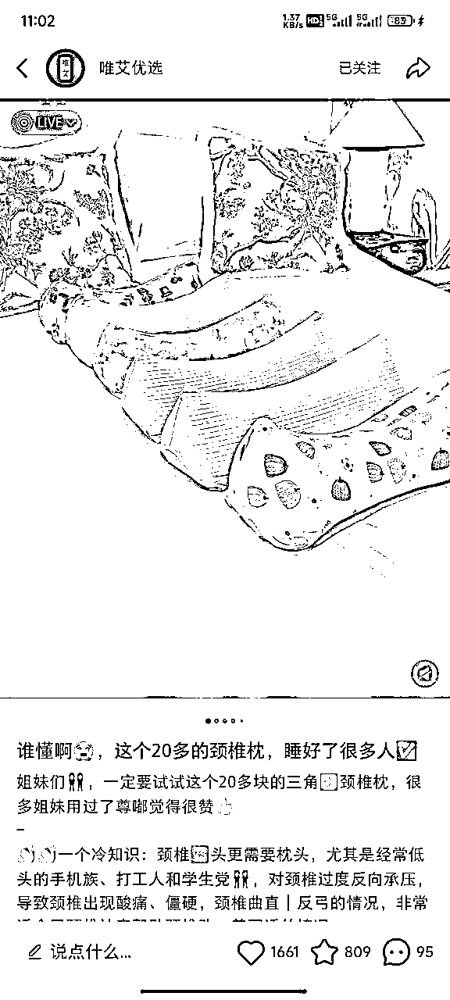

# 小红书单店月销90万的实操流程分享（纯笔记带货 原创实拍）

> 来源：[https://nr5lp7qluq.feishu.cn/docx/M4tCdSj3FoQAFzxRoa7cjx3vnNc](https://nr5lp7qluq.feishu.cn/docx/M4tCdSj3FoQAFzxRoa7cjx3vnNc)

首先感谢坤哥和seven老师。

因为坤哥的指点，我选择了小红书笔记带货。因为seven老师的选品文章，我选择了做原创实拍。（ps：seven老师价值百万的选品方法确实有用，我根据文章思路做了款微原创的产品卖了200万，目前每天还是大几千的销售额。）

做合法合规的产品和玩法，做有积累能沉淀的事情，而小红书恰恰是个长尾流量很长的平台，长坡厚雪。

【店铺情况】

单店月销90万多，原创实拍纯笔记带货，没做直播，每天6-800元微付费乘风投流。

1个蓝V号+3个关联子账号，每日发30多篇挂车笔记，图文占比60%视频占比40%。

接下来我简单分享下，小红书笔记带货的整个实操流程。

第一步：确定品类

我们可以先问问自己，这次做小红书带货的目的是什么，想达到什么样的成绩，现在有什么能力和资源。而不是人云亦云随波逐流，毫无目的的开始。

如果你想快速拿到正反馈，那可以盯着热门类目7天内的低粉爆款；如果你想有个长久的副业收入，那就找个一年四季都能卖的品类；如果你有教培优势，可以先看虚拟课程，如果你是个二次元，那就先看动漫周边。

对我来说，我想做一个每天能卖2万以上的店铺，那我只能选择热门类目。那就只剩下：美妆护肤、服装配饰、家居用品、母婴用品、食品保健、数码、运动户外、宠物用品、保健用品

我想做一个长久的店铺，那我就不能选黑五类产品、功效性产品，不能搬运混剪；我没有一只听话的宠物，我也没有育儿的经验，也不想做食品。那我就只剩下：美妆护肤、服装配饰、家居饰品、数码电器、运动户外。

第二步：筛选产品

最佳选品标准：商品24小时加购人数＞500；账号粉丝人数＜200；发布笔记数量＜200

其次选品标准：商品24小时加购人数＞200；账号粉丝人数＜500；发布笔记数量＜500

商品24小时加购人数多，代表它是近期的热门产品，有肉吃可以抢。

账号粉丝和笔记数量少，代表它的账号权重不高，离我们不是很远可以加速超他。

选品的方法：

1.  千帆app后台的账号榜单（数据中心-市场-笔记排行-优秀账号-商品笔记-成交高）

1.  利用爬虫工具抓取的每日爆款产品

1.  根据二级类目词手动搜索 按销量排行查看（百度小红书类目表）

1.  第三方数据平台的低粉爆文（千瓜 婵小红等）

1.  第三方平台的爆款（抖音 快手 视频号等）

第三步：确定产品

①根据自身的拍摄能力，选出你能拍出和他同水平图片/视频的账号。

笔记的图片/视频由背景+主体+陪体+光线+留白组成。我们在知道自己的拍摄能力后，还要知道能否呈现出和对标一样效果。

如图3，是售卖颈椎枕的账号。灰白的床+六个多色的颈椎枕+枕头靠枕台灯+室内灯光，是一篇很容易达到的效果。

如图4，是售卖工装裤的账号。公园草坪+藏青工装裤+167/90斤腿长细腰模特+亮色鞋白短袖+阳光，是一篇正常难度能达到的效果。

②记录链接的销量，看账号每日的利润是否符合你的目标。

如果你的目标是每天1000利润，那对标账号至少要每日利润＞3000

如果你的目标是每天3000利润，那对标账号至少要每天利润＞9000

根据小红书笔记带货的情况，60-80%的销售额来源于爆款笔记，剩下的20-40%的销售额来源于个位数赞的笔记。所以在你的爆款笔记没有＞对手的情况下，你只能做到他的20-40%的销售额。

销量的记录方法：手动记录，链接今天的销量-链接昨天的销量=一天的销量

利润的计算方法：销量*（售价-找到进货平台同款的大致成本）=利润

③下单对标的产品+采购多家货源，进行产品对比。

最佳标准：找到同货源产品

其次标准：同质量的相似产品

通过三个步骤选出这次我们要实践的产品，了解对手的起号进度、账号数量、日更笔记数量，给自己做好心理预期。

最后确定产品的打法（低价、产品差异化、素材差异化、日更笔记翻倍）

第四步：搭建素材库

素材库由首图+其它图片+标题+内容+话题组成。

①找到15天内产品的爆款笔记（百赞以上的挂车笔记/千赞以上的不挂车笔记）

②模仿爆款笔记（图片要1:1进行模仿拍摄/制作，标题话题可以先一致，内容仿写50%）

最低数量要求：封面*10+标题*20+内容*20

第五步：养号测号

①养号：新注册账号放置3-5天/老账号无重大违规就没事

②测号：发布3-5篇测号笔记，测试账号权重情况。先收集最近3天内发布的与产品/人群相关的爆款笔记，进行模仿使用。

第一篇笔记发产品相关的爆款笔记，第二篇笔记发人群相关的爆款笔记。如果两篇笔记有一篇超过10赞，可以开始实名关联店铺，发挂车笔记。

如果前2篇笔记没有过10赞，那第3-5篇笔记发近期热点笔记。如果笔记超过10赞，则可以开始实名关联店铺，发挂车笔记。

如果前5篇笔记都没有一篇笔记不过10赞或小眼睛不过千，进行笔记薯条加热测试/其他账号搜索关键词查询是否被收录。如果都没有问题，那这个账号权重一般般，可自行决定是否注销。如果有问题，则直接注销 半个月后换手机注册。

第六步：起号

一个产品测试7天，如果链接的加购人数没有持续递增或者没有出单的话，那就同类目换品继续测试，从第二步重新开始。

前两天 每天发布2-3篇挂车笔记。如果笔记平均小眼睛大于100，则可以递增每日笔记数量，第3-4天每天发布5-6篇笔记；如果笔记平均小眼睛在50-100，则保持现有更新数量。

第5天的时候，可以先选择前四天笔记中最好的一篇进行乘风投流100元（新建计划-商品推广-笔记加热-通投-托管）笔记的优先级是：出单的笔记＞点赞最高的笔记＞小眼睛最高的笔记。

第5-7天每天发布8-10篇笔记/5-6篇笔记。一周测试完成后，如果产品出单了，那就持续优化。如果产品没出单，但商品加购人数每日递增，则继续优化笔记，再测试7天，再不出单就放弃。如果产品没出单，且商品加购人数没有递增，则放弃

第七步：爆款裂变

当你出了一篇爆文后，那要进行爆文拆解和裂变。

笔记的首图和标题，决定了点击率，先叫它点击素材

笔记的最后两张图和内容，决定了转化率，先叫它转化素材

一篇爆款笔记，它在点击率和转化率两者中肯定有一个是爆点。我们要给它进行拆解重组裂变。

相似的爆款点击素材+相似的转化素材

相似的爆款点击素材+其它的转化素材

不同的点击素材+相似的转化素材

三者交叉测试，找出你的爆款素材，重复拍摄使用即可。

第八步：日常运营

①每日统计经营情况

小红书的长尾流量很长，所以每日新发的笔记都是未来滔天巨浪中的一点水滴，一点一滴层层积累福利。

每日新发笔记数是你的笔记基数，阅读笔记数是你的点击素材质量，动销笔记数是你的转化素材质量。哪个环节有问题，就解决哪个问题。

②持续更新7天内的低分爆文

每个爆款笔记单账号每天可发2-3篇且不超过每日新发笔记的50%。我们要不断的去实践新的拍摄内容，找到更多的爆款笔记，如此反复。

以上的所有内容，是我做小红书笔记带货的大致实操流程，希望对大家有用。