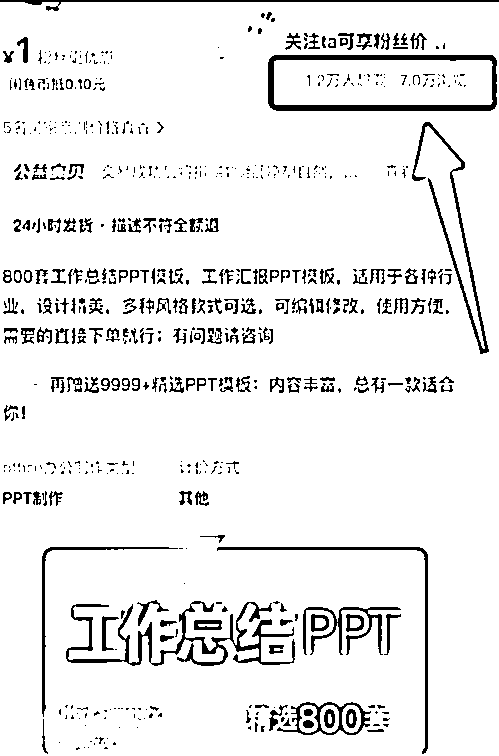
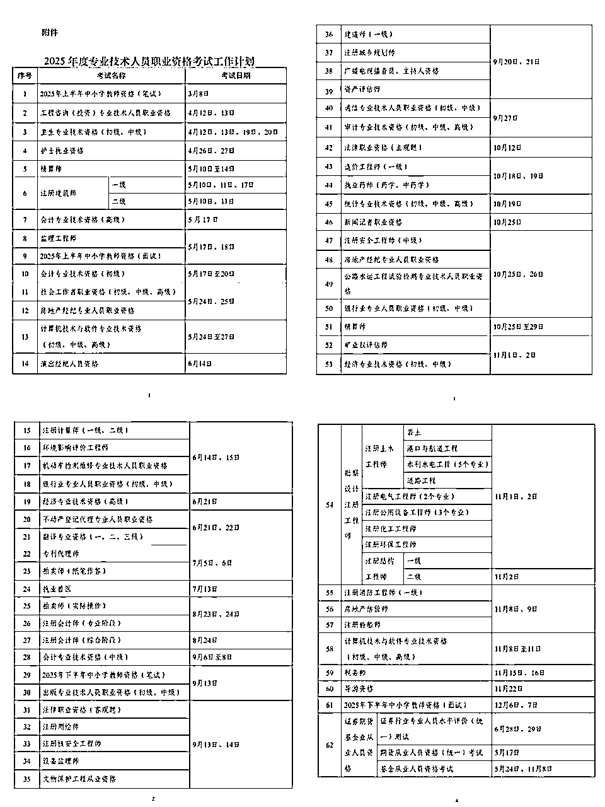
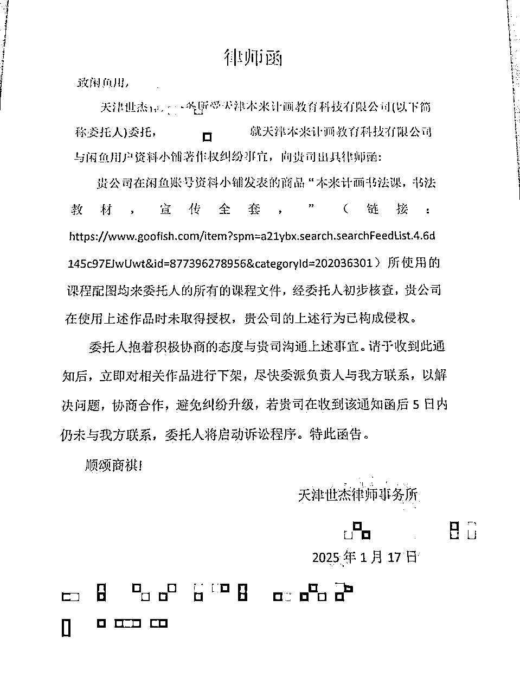
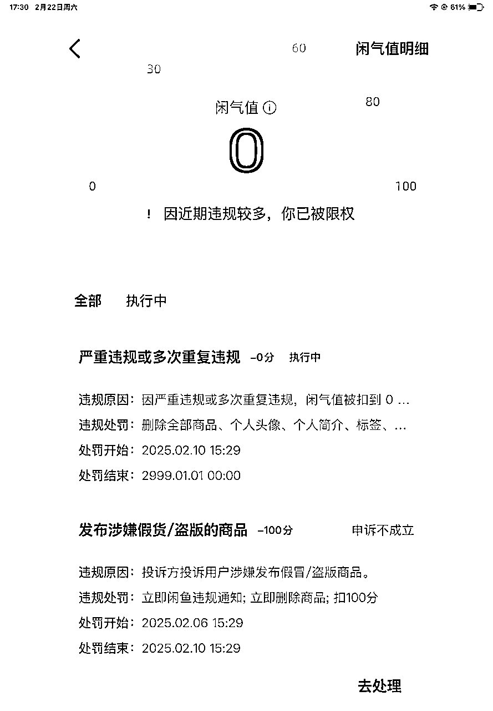

# "零成本搬运"居然真的能赚钱？闲鱼小白亲测虚拟资料冷门玩法｜保姆级SOP已跑通

> 来源：[https://ncnxi4u4wp2p.feishu.cn/docx/LertdZZ2EobRWuxtnzec1xqBnRp](https://ncnxi4u4wp2p.feishu.cn/docx/LertdZZ2EobRWuxtnzec1xqBnRp)

大家好，我是南星~

一枚地产搬砖人！通过生财赚到互联网的第一桶金

去年9月加入生财，参加了9月参加了盖洛普优势测评，12月参加了两个航海一个是闲鱼虚拟资料航海，一个是小红书自媒体商单，在参加闲鱼虚拟资料航海期间跑通了0-1，我是12月5号发布的第一个品，12月18日成交第一单，靠着均价不到3元的低客单，到2月15日入袋1600元~

加入生财之后，有一段时间是很焦虑的，看到很多大佬日入过万，周入过万，关键很多都是00后的小朋友，感觉自己不管是认知、赚钱能力、执行力都很差。

后来在听播客的时候听到了【搞钱女孩 携隐Melody：搞钱是我和世界合作的方式|人类搞钱指南】那期，突然听了一个观点，“搞钱是门技术，是可以通过练习而增强的技能”，那个瞬间真的是热泪盈眶呀，那之后才开始沉下心来提升自己的技能，我眼光不行，就找行的人来带，躬身入局，把手弄脏！

今天主要分享的是以下的几个主题：

一、新手能不能做闲鱼虚拟资料？

二、第一次做项目期间遇到的困难

三、账号被封，如何稳住心态

四、一些想说的话

* * *

# 🔥 一、【零基础逆袭指南】没资源没粉丝如何在闲鱼吃透虚拟赛道？

## 1.从最能有正反馈的项目去做

我一开始是根据自己的兴趣去选项目，23年6月前司把整个部门优化了，到24年8月才找到新工作，GAP期间听了【搞钱女孩】，24年5月开始关注生财的，那个时候通过【搞钱女孩】的链接参加过3天体验营，但是感觉门票太贵了，一直没有下决心加入，8月找到工作，有了托底，立马加入了生财（hhhh),进来生财之后真是被这花花世界迷了眼，眼看着9月的航海马上要开始，也没有特别喜欢的项目，就先选了盖洛普优势，想看看自己适合做什么，看完了之后不仅觉得找不到适合自己的项目，觉得自己本质待的这个公司也并不适合我，不过这也是件好事，我虽然不知道自己能做什么，但是知道了自己不擅长做什么，也坚定了我搞钱，早日从职场赎身的信念。

到12月的航海终于有我喜欢的项目了---【小红书商单】，我一直很喜欢小红书这个平台，每次看到做个人IP或者其他小红书相关的航海都很想参加，结果勤勤恳恳做了整个航海，也没有拿到正反馈，不过这也是正常的，世界上的事情本来也不是你努力就一定有回报，而是你努力才有成功的可能性。

终于要说到正题了，【闲鱼虚拟资料】这个项目一开始我并没有想报，因为我个人感觉并没有时间同时参加两个航海，同时对闲鱼这个平台不了解，也从来没想过要使用这个平台卖东西，这个航海是给我男朋友报的，结果他没有时间参加，我只好每天早上早起来一会儿做闲鱼（为了那个199，hhh,我真的是葛朗台），中午和晚上做小红书，还好那个阶段本职工作没有太忙。

但是没想到，有心栽花花不成，无心栽柳柳成荫，小红书没有跑通，闲鱼虚拟资料跑通了。出第一单的时候我在做饭，那天听到手机发出了一个没听见过的铃声，才发现有人下单了，立马扔下锅铲开始给客户安排出单，其实前前后后折腾了大概十分钟才把资料发出去，但是这个中间的过程还是挺煎熬的，好害怕第一单因为我没有准备好就跑掉了，因为前面13天两个项目都没有正反馈，所以航海手册上让做的前期准备都没做（请各位引以为戒，老老实实按手册执行）。

从这个事情上看，建议大家不要对任何项目有偏见，一开始练搞钱技能的时候，有第一个正反馈才是最重要的，我还记得当时出单的心情，就像在心里放了一场迪士尼烟花一样，灿烂又美好~

## 2.结合自身能力，根据自身能投入的时间选择项目

我当时做2个项目，每天还要上班，真是感觉过的过于充实了。建议还是不要搞的这么累，心态很容易崩，特别是2个项目都没反馈的时候。一定要根据自己的状态和能投入的时间选择项目，不要贪多。

## 3.为什么选择闲鱼没选小红书？

1.  小红书的审核机制更严格，闲鱼可以允许你直接复制同行的图片、文案，但是小红书是不允许的，所有东西都需要二创，虽然是个很简单的事情，但是对当时的我来说，闲鱼更适合我，也更适合小白起步。

1.  小红书需要引流到私域成交，中间是有交谈的过程的，但是本职工作比较忙的我，实在是分身乏术，闲鱼在成交的时候其实也有很大一部分客户要聊几句，但是大部分都很简短，这种程度的摸鱼还行。拉到私域再交谈再成交的链路对我实在是有点长，不过后期我也想要做小红书的虚拟资料，会去慢慢实践的。

1.  虚拟资料0成本，这个事情一开始我也没有意识到，我一直认为是要自己先买进来，再卖出去，不过根据手册操作，完全不需要HHH。

1.  不用囤货，且后期可以自动上架，自动发货，在运营一段时间之后，每天的操作大概每天花半个小时-1个小时就可以了，非常适合赚点零花钱。

# 💣二、【血泪避坑篇】新手必犯的3大致命错误！

第一次做项目期间遇到的困难

1.不知道怎么选品

2.抱着侥幸心理上了强版权产品收到律师函

3.下架了所有强版权产品还是被封店了

## 1.不知道怎么选品

1.选红海产品，素材类、学习资料、合同，这类受众广，弱版权的产品。带有品牌名的、人名的千万不要碰。

2.选【想要：浏览数≥1：10】

3.紧追时事，过年期间Deepseek的品还是非常好卖的，年前2025计划类的品都很好卖，不同时间段会有不同时段的爆品，这里给大家分享一下《2025年度专业技术人员职业资格考试工作计划》。可以根据计划去准备一些考试资料。

4.其他的选品方法还是多看航海手册，常看常新~生财有术网页版

## 2.抱着侥幸心理上了强版权产品收到律师函

我一开始出单还可以，元旦当天出了50单，后来有段时间选不到好的品，出单就在变慢。当时看到几个课程，在闲鱼榜单上排名很靠前，价格也很高，当时的版权意识确实太薄弱了，直接就上了，爆单是一定的，但是很快就迎来了第一个处罚，当时只是强制下架，我就没有太在意，尝到了甜头就一直陆续在卖不同的课程，这种操作下，不到1个月就收到了好多警告，但是没有实际处罚，我还是抱着侥幸心理，终于在1月17日收到了律师函。当时真是吓的不轻，把所有的课程类产品都下架了。但是没想到这个事情还是没完。

## 3.下架了所有强版权产品还是被封店了

经历之前的“律师函”风波，我下架了所有课程。但是还是陆续接到投诉（不是你删掉就没人投诉了，只要你上过侵权的品，任何时候他们想投诉都会抓取之前的资料进行投诉），这中间没有任何处罚，后来有一天正在出单的时候，忽然发现被禁言了，因为多次违规直接被扣了100分，店铺永久封禁。所以强版权的产品真的真的不要碰哦。

目前比较确定的会被投诉的品有：K12、新东方、迪士尼、爱奇异、国产电影、电子书、所有带人名的课程，远离侵权品，保住闲鱼店！

# 🆘三、【封号自救指南】上了强版权产品，收到律师函，怎么办？

1.首先，如果上了强版权产品，在收到投诉的时候不要太慌张，一般一次两次的不碍事，及时下掉。

2.收到律师函的时候也不要慌张，大部分是委托了律师群发的，不一定会真的起诉，就算真的起诉赔偿也不是要多少赔多少，千问不要私下去联系，建议先找律师看一下判断情况再做下一步。

3.账号被封了，心态不要崩，因为崩也没有用，重新养号重新做，不要再犯同样的错。要知道已经走通了从0-1，再做也不是难事。

最后，闲鱼虚拟资料真的是个不错的新手项目，只要好好按步骤，有一点耐心都是可以拿到结果的。

# 💌四、【致迷茫者书】：为什么说虚拟资料是普通人最后一根救命稻草？

关于拿到结果，我有一点点想法，希望可以和各位圈友分享：

1.  我认为，赚钱是个认识自己的过程，我在赚钱的过程中会发现自己喜欢什么、不喜欢什么、擅长什么、不擅长什么，我觉得这点很重要，如果选择了自己不喜欢不擅长的领域，那么在执行过程中真的会觉得很痛苦，很难坚持，这也是为什么我在线下做其他项目赚的多，但是我也坚持不下去的原因。

1.  每做一次项目都是一次积累，哪怕这次没成功，但是赚到了经验，就能积累起来，真的是每一步都算数的。因为赚钱真的是个技能，在这个过程中我们锻炼了自己的眼、脑、手、心，积累了选品、学习、执行、心力的这些能力，这些就是我们在项目中赚到的最宝贵的经验，哪怕这次没拿到结果，也为以后的成功做了很大的积累

1.  只要多尝试，总会找到适合自己，或者说是让自己能赚钱的项目。

1.  心态要好，没有一劳永逸的赚钱方式与渠道。 我中间心态崩了很多次，因为卖强版权产品被举报、因为一开始一直没有出单崩了，但是崩着崩着就习惯了。赚钱真的要心态好。

1.  最后跟大家分享我今年最有感触的一句话，来自《飞驰人生2》里张弛说的一句话，“我努力过无数次了，机会只会出现在这其中的一两次。”我会一直努力，抓住这一两次的机会。与各位共勉。

最后，非常非常感谢航海教练钟哥，有求必应，有问必答。感谢志愿者放空老师以及其他志愿者们，感谢生财团队的付出，还有我亲爱的圈友们，感谢2024年的最后一个月和各位共同航海，以及希望我们未来还可以共同搞钱！