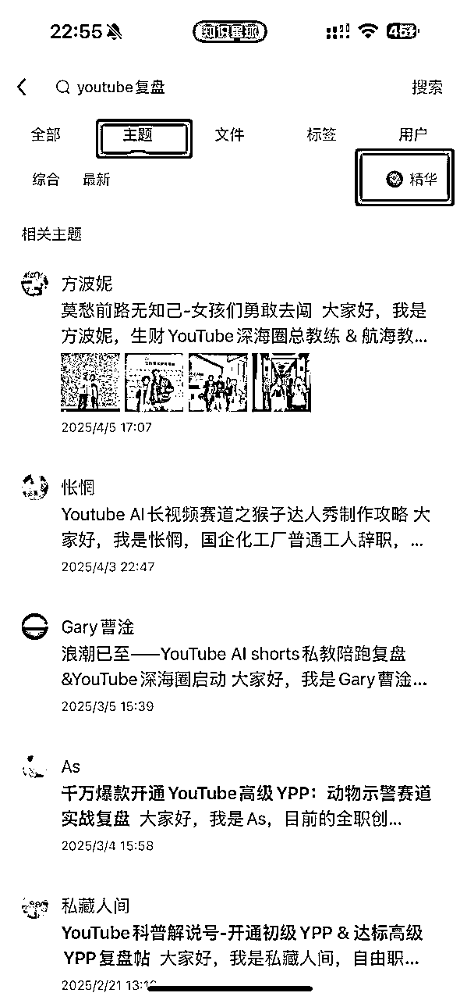
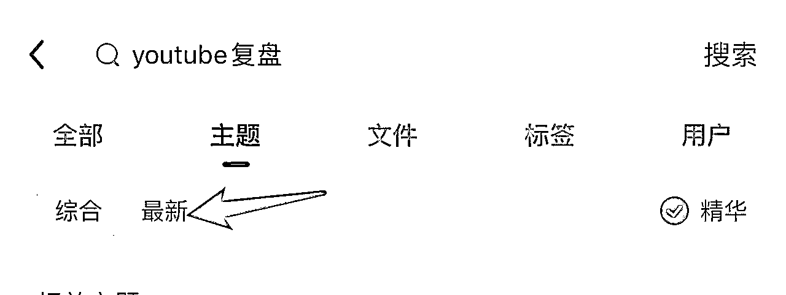
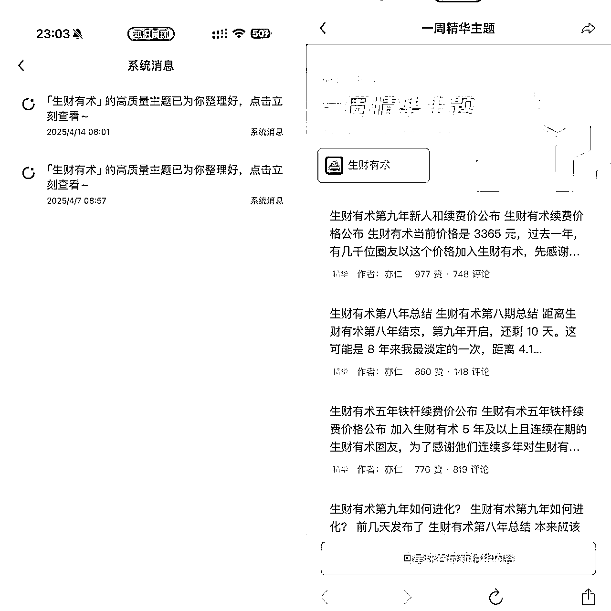
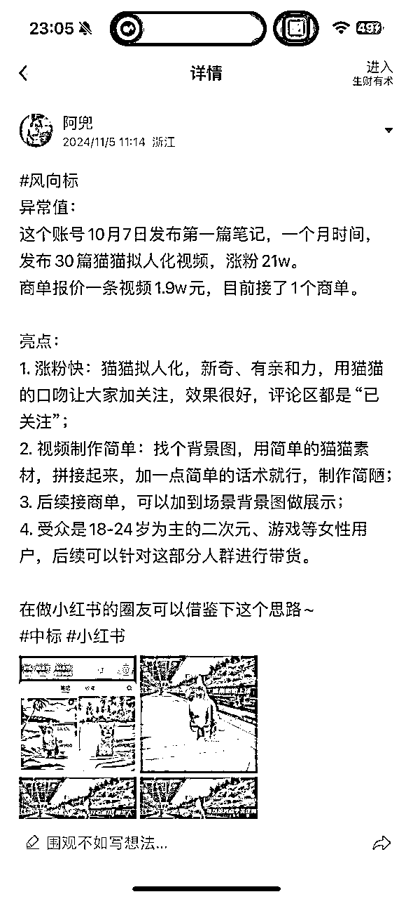

# 职场人如何把生财有术变成赚钱外挂：一个职场人的生财高效使用指南（含方法、表格与案例）

> 来源：[https://e5nmp70vrx.feishu.cn/docx/N0wwdgqb8oaJ0DxpvrTcxHLsn7b](https://e5nmp70vrx.feishu.cn/docx/N0wwdgqb8oaJ0DxpvrTcxHLsn7b)

# 1.关于我

大家好，我叫绿子，加入生财一年半。

第一年加入时，做的快团团赛道，月销售额破10w

今年在做的Ai赛道，3个月的时间，副业利润已经10万了。

在生财有术这个圈子里，刚开始做项目时，得到过很多朋友的帮助。在这里，你会找到很多一起赶路的人，很多人会真诚地聊天。这也是我喜欢生财有术这个圈子的原因。

如果你刚打算做副业，这篇文章适合你读。

我们这类打工人，时间是碎的、精力是有限的、琐事又多，但又特别想搞钱、转型、提升。最怕的不是没资源，而是看了很多，却啥都没做。

我刚开始加入生财时，走了一些弯路，比如：刷了一堆帖子，收藏加了不少，结果一次都没再点开过；

每个精华帖项目看着都挺牛，真要自己去执行时，压根不知道从哪开始；

今天会讲清楚怎么高效看帖，也会帮你筛选到适合你的内容，真正搞到钱。

# 2.圈友你好，这是我的生财使用指南

本文适合刚开始做副业的朋友阅读

目录

一、真正的高手都在经营自己的舒适圈

二、如何刷帖？别碎片刷帖，先从搭建「个人输入系统」开始

三、从信息噪音中搜出搞钱机会：我在生财有术的高效搜索法

四、职场人身份下，怎么高效看帖？

五、案例：从轻试错的小项目开始，先挣5千块

六、结语

* * *

## 一、真正的高手都在经营自己的舒适圈

很多职场人都有同样的困惑：工作已经够累了，下了班还想赚钱，但又没动力、没精力，所以不想变，能混一天是一天。

这几年我们被“跳出舒适圈”这句话洗脑太久了，好像是只有不断挑战自我、换赛道、做不熟的事，才能搞到钱。可是最近元宝接入微信给了我一个启发：腾讯永远在自己的舒适圈里搞钱。

微信借助QQ那代用户起盘，元宝依托微信生态扩张用户，IMA直接复刻公众号逻辑，路径熟、资源熟、用户熟。它们不需要折腾，只需要在熟悉的地盘里不断复制、叠加、优化，把原有的经验变成一整套稳定可复制的赚钱模型。

比如你做社群做了三年，那就别急着去搞视频号、搞剪辑培训，而是思考如何把社群变现路径拆解、固化、产品化，卖服务、做陪跑、出模板，让别人为你的“舒适”买单。

把熟悉的事情做到极致，是普通人最稳、最可持续的赚钱路径。

我边工作边搞副业的这几年的经验来看，只要方法选对了，既不会太累，也能搞到钱。

想赚钱，可以从 你不讨厌、门槛低、有成就感的事情 开始。比如：

不用跳出舒适圈，把你擅长的那件事做到极致。这，才是普通人最应该做的事。

## 二、如何刷帖？别碎片刷帖，先从搭建「个人输入系统」开始

怎么吸收优质内容？我做了一个输入到变现的流程系统：

使用「收集→筛选→行动→复盘」的全链路阅读闭环。

### 2.1、筛选阶段：利用碎片时间，结构化阅读

没必要一口气看完所有帖子，只需要把对你有价值的信息存起来。要么每天按顺序看，要么搜索关键词查找感兴趣的内容。

早上通勤20分钟，中午饭后20分钟，晚上睡前20分钟……

### 2.2、创建只有自己的生财精华群

我专门建了一个只有自己的生财精华群，主要转发三种内容：

第一种、有用的创业思维干货帖

第二种、与自己业务有关的复盘帖

第三种、有可迁移潜力的工具帖

只挑对“当前阶段”有帮助的内容，快速扫结构，有收获就转发到群里，每天晚上睡觉前看完有帮助的地方，而不是全文。

不做判断，不焦虑，先囤起来。

### 2.3、整理阶段：用飞书表格做自己的搞钱数据库

表格结构如下：

| 内容一级分类 | 内容二级分类 | 作者昵称 | 重要等级 | 可复用点 | 可迁移点 | 下一步行动 | 复盘笔记 |
| 创业思维帖/ | 一、思维帖 | 作者是谁 | 解决当前问题的程度（1-5分） | 模型 / | 我自己的业务能不能直接套 | 执行 / | 实际尝试结果和新认知 |

### 2.4、复盘阶段：每周定期扫一遍表格

把用过的、没用的标记一下，拆出几个小模型或SOP。这个阶段最容易挖出自己的“信息套利点”。

我每周会看一次表格，删掉无效的，整理优质内容，输出成小的内容包或尝试项目。

## 三、从信息噪音中搜出搞钱机会：我在生财有术的高效搜索法

### 3.1、关键词搜索4步法

#### 第一步：拆解关键词，组合搜索词组

别上来就搜“副业”或者“搞钱”这种大词，太泛。需要先把一个大话题拆成更细的关键词，再进行组合搜索，建议围绕项目本身去拆关键词。比如：

*   副业 ，能拆解为：小红书选品、闲鱼实操、AI视频、Ai 出海、Ai 绘画、社群成交

*   引流 ，拆解为： 视频号引流、私域引流、社群引流、小红书截流、知乎截流

### 第二步：优先看关键词下的精华帖内容

精华帖一般是项目复盘、避坑指南、流程SOP等内容，含金量很高。

如图所示：

### 第三步：再用“最新”排序看最近的玩法

信息是不断变化的，项目也是有生命周期的，最新的帖子能看到别人正在做什么，踩了哪些坑，有哪些新的迭代方法。

特别是有些细分领域变化很快，比如AI工具、副业选品、小红书算法，记得用“最新”排序查看，保证你获取的是当下还有效的信息。

### 第四步：善用关键词搭配法，精准找到实操类信息

除了基础的关键词组合，还可以加上这些高命中关键词一起搜：

*   SOP：能看到项目完整操作流程

*   复盘：有真实项目经验和反思

*   经验

*   踩坑

举个例子：

比如你想了解“如何做副业社群”，基础词是“副业 社群”，那你可以进一步搜索：

*   副业 社群 SOP

*   社群 成交 话术

*   副业 陪跑 模板

*   社群 收益 复盘

*   社群 起盘 流程

这样一搜，搜到的就不会是泛泛而谈的“我也想搞副业”，而是已经实操、有成果、有拆解、有路径的内容。

### 3.2、关注优质圈友的输出

生财每天的新内容太多了，信息爆炸的情况下，怎么阅读？我会选我认定有价值的作者，然后关注，定期看他们发的东西。

另外，生财里，有贵人计划，是指你在第一次得到龙珠，可以参与贵人计划，感谢帮助你的贵人。而这些贵人，一般乐于帮助人，有机会可以链接上，互相成就。

### 3.3、关注每周一早上的星球精选

七天会在每周一定时整理最新的优质内容，在此好好阅读，去筛选自己感兴趣的内容阅读

## 四、职场人身份下，怎么高效看帖？

我们这一类职场人，时间是碎的、精力是有限的、琐事又多，但又特别想搞钱、转型、提升。最怕的不是没资源，而是“看了很多，却啥都没做”。

所以，我自己摸索出一个「节奏感+目标导向」的看帖策略。

### 4.1、何时阅读帖子最合适？

我一般是在精力刚刚好但不忙的时候读

通勤路上（地铁/打车）：不需要深度思考，只挑“灵感型”内容，比如别人的搞钱故事、复盘类内容，给自己一点“搞钱情绪”。

午休/碎片时间：看“技巧型”内容，比如话术模板、结构框架、实操清单，能迅速看完，留存到表格。

下午脑子钝的时候：扫“可转化”的项目案例，看有没有能借用到我工作/副业中的点。

周末1小时深度阅读：翻“知识表格”里标注过的重要内容，系统复盘输出，或筛选出下一步行动。

### 4.2、用这些问题，筛选一篇帖值不值得看：

1.  这个内容，我能不能复用到我的工作/副业/表达中？

1.  这个项目，有没有我能尝试的部分？有没有门槛低的入口？

1.  这个人的打法，能不能给我新的思路？我愿不愿意模仿一遍？

1.  作者是不是长期在做这件事？（真诚地、讲“自己踩过的坑”的才靠谱）

1.  有没有讲“具体流程、工具、话术”？（真正落地的干货，一定会细节满满）

1.  有没有可复用点？（不是炫耀结果，而是你能照着做的那种）

如果答案全是不能，我就不看了，直接丢掉。有自己的阅读节奏感，才能不焦虑、不内耗。

## 五、案例：从轻试错的小项目开始，先挣5千块

你不需要一开始就做成大项目。先用小时间试错，小收入试水，是最稳的路径。

案例：制作猫meme 视频，涨粉 4 万粉

去年我刷到风向标“猫meme”短剧视频，如图：

于是尝试着做了3条视频上传小红书，当天就破万次播放量，发现这个赛道能爆，就批量做，做了七八个号，一个月时间，有一个账号粉丝 4.3 万，其余百粉千粉的居多。这些账号加一块也能值五六千了。

启发点：

1.刚开始时，照着做，就能有收入

2\. 项目起点很小，但信心从“第一次成交”开始

## 六、结语

在“看得多、做得少”的信息焦虑时代，真正拉开人与人差距的，从来不是资源多少，而是你有没有一套将信息转化为行动，并持续复盘的能力。

你可以不用天赋，不靠关系，只靠清晰的结构、可控的节奏和真实的执行力，慢慢把副业变主业，把信息变钱，把焦虑变自由。

打败情绪、战胜拖延，才是普通人逆袭的起点。别看别人做了多少，先踏实走好自己的每一步。2025，一起稳稳搞钱！