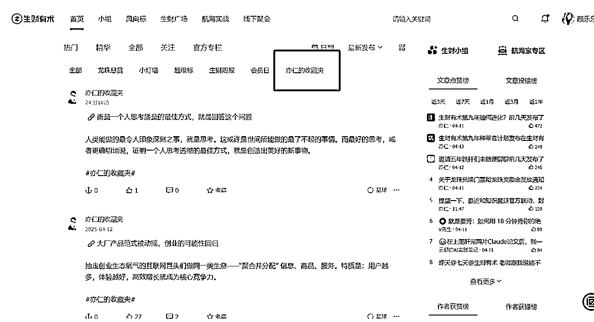
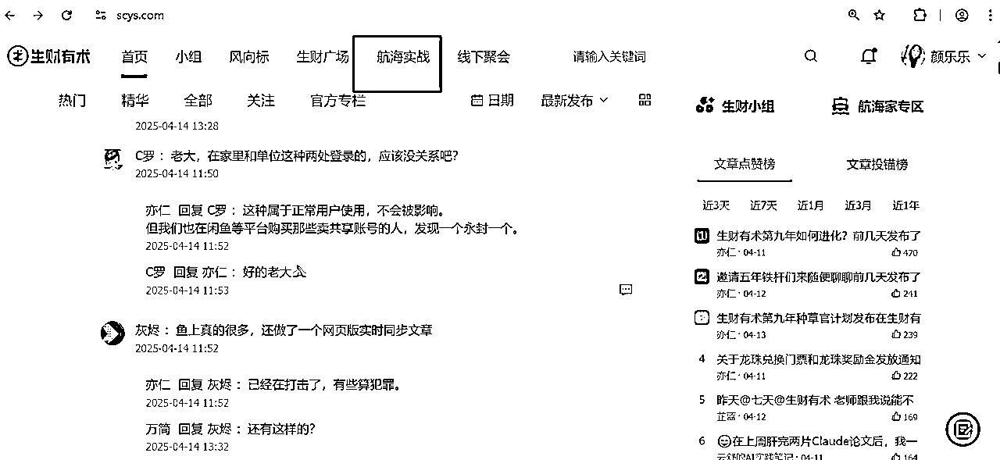
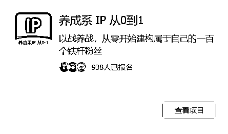
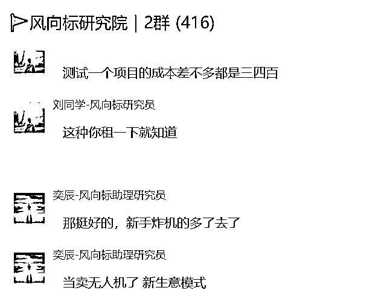
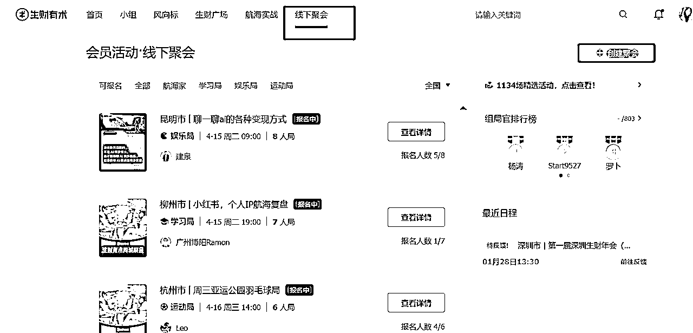

# 职场妈妈加入生财3年转型自由职业，我的使用心得！

> 来源：[https://shengcaiyoushu01.feishu.cn/docx/AWbpdAGsforTHXxKT77cTnlwnGg](https://shengcaiyoushu01.feishu.cn/docx/AWbpdAGsforTHXxKT77cTnlwnGg)

# 颜乐乐自我介绍

哈喽，生财的新伙伴们！

我是颜乐乐，一个5岁男娃的妈妈，加入生财3年，2022年加入生财，目前是生财传术师。前互联网运营，主要负责品牌自媒体的运营。

这三年参加了10多次航海，跑通自己的闭环，现在已经自由职业啦！目前主要是给广大实体门店和公司提供小红书获客陪跑服务。我去线下见老板的时候，老板都觉得我流量的见识很广，其实主要是因为老刷生财，哈哈！

如果你新加入生财，也是一个职场伙伴，那我的方法肯定适合你。身在职场肯定是有一门自己的技能的，不然在职场怎么混得下去了。只要有一项技能，不管是财务，HR，运营，还是秘书，剪辑，设计师，这些技能就是一定可以变现的。

但在这之前，我估计你还没做好准备，所以你来到了生财，恭喜你，这一步，你已经非常棒了！打败了你身边那些天天摸鱼的99%同事。

# 生财新圈友你好，这是我的生财使用指南

# 第一步：构建一个基本的商业认知

这一步是我之前在做的时候忽略掉的，上来可能就去刷精华贴，可能会陷入很焦虑，但手又没法行动的状态。所以我当年入了生财后，其实有段时间焦虑到不敢打开。

## 1、先刷生财思维课

先去刷生财思维课，构建基础的商业思维，比如最小MVP，先赚到第一块钱。有了这些思维后，我们再去看项目就不会嫌项目小，赚得少。因为所有的项目都是从第一块钱开始，然后再去放大的。

另一方面是在职场呆久了，会觉得，不做点什么大事业，怎么变现呢？不找到一个好项目就变不了现，作为职场人，我们去搞副业，创业，最好的资源就是利用好我们自己。因为你去投任何的项目，都会有资金或者别的投入，但如果我们潜力孵化自己，卖自己，最多也是损失自己的时间，相对来说就是试错成本更低一些。

生财思维课：https://appamvpb5mq9834.xet.citv.cn/p/course/ecourse/course_2eXapUKTQZ1V9nFBMoy2LZOTLMm?entry=2&entry_type=2002&scene=%E5%88%86%E4%BA%AB&share_type=5&share_user_id=u_6194f85fe8d5f_Y9HUHYbZaE

## 2、读这2本书

这两本书一度是我上下班通勤路上的读物，亦仁益语收录的是亦仁之前的一些分享。

## 3、亦仁收藏夹

亦仁的收藏夹会收录亦仁自己刷微信看到的好文章，相当于帮我们做了一个信息源头的筛选。我在这里也得到过非常多的启发，比起短视频，长文真长脑子。

# 第二步：找到自己搞钱的方向，赚第一块钱

看完思维课，可能会对商业有一个大概的了解，但还是不知道自己要干什么。

那我们就会盘一下，哪个你更想做，先去尝试。尝试可以不是说要等到航海才可以，随时都可以启动，因为搞钱，做事业，自己就是第一责任人，要自己先积极行动起来。

在航海开启报名的时候，积极报名航海，在航海中拿到结果的方法，就是多参与，我自己参加过10多次航海，会有试错，但很正常，多试几个，就知道自己不适合什么了。深度参与，比如说12天的打卡，你可以打到15天，21天，自我成长这种事，就是你投入在那里，时间看得见的。在短剧航海，和小红书航海中都拿到过变现结果，赚了几个门票。

如果你已经有想法了，那可能会有以下2个方向

## 1、 个人IP路线

如果你和我上面聊的想法一致，想要卖自己，就一定会涉及到个人IP这块。关于个人IP的内容，我们鱼丸有整理出专门的个人IP合集。可以把这一部分先看完。

鱼丸整理个人IP合集

https://scys.com/content/collection?id=IfRPIqBQ&from=1

个人IP一定会涉及到发朋友圈，因为你不发朋友圈是没法成交的，用户要了解你。

（1）怎么发朋友圈

发朋友圈可以帮助我们立起自己的IP形象，让用户知道，我们现在在干什么。

毕竟你决定要卖了，要是自己不宣传，人家怎么知道要跟你买呢？

不知道怎么发朋友圈，我推荐看下面的贴子

朋友圈运营

梁靠谱老师《四年发了八千条朋友圈，销冠的成交心法》

https://scys.com/articleDetail/xq_topic/588555582285524

芷蓝老师 《100 个朋友圈营销技巧》

https://scys.com/articleDetail/xq_topic/588555582285524

杨涛老师 《微信生态中细致运营的一百条小技巧》

https://scys.com/articleDetail/xq_topic/51558582585224

我的贴子《6个月发了1000条朋友圈变现15W，总结一下我的经验。》

https://scys.com/articleDetail/xq_topic/2855451514151441

我的贴子《如何做一条 我的十年视频》

https://scys.com/articleDetail/xq_topic/2855288542822141

（2）怎么做公域引流

如果你的微信里好友有限，那做公域是必然的事。

目前公域首选还是小红书+公众号，操作起来更简单，同时你不能拍视频，或者不能漏脸，做图文也一样可以获客。怎么来做这些获客，可以参考生财的航海手册。

小红书引流：https://scys.com/activity/landing/3041?tabIndex=0

公众号爆文写作(ip)：https://scys.com/activity/landing/4664?tabIndex=0

AI+自媒体：https://scys.com/activity/landing/5119?tabIndex=0

## 2、项目路线

想要更快变现，不想去通过技能打造个人IP，可以去做项目。项目筛选维度可以是从生财的航海项目里筛选，近三期的项目都是比较容易跑通闭环的。

我们可以打开生财网页版 https://scys.com/

比如：

2025年3月 小红书高客单航海，小红书虚拟商品，AI小说，视频号直播，

2024年12月 闲鱼虚拟资料，小绿书带货，小红书虚拟资料-教育篇

打开项目后，我们可以看到【航海手册】

参考手册去行动就可以了，如果还遇到问题，我们可以在网页生财搜索相关问题来寻找答案。

（3）素人IP养成

如果你觉得自己还不是特别牛，但又想做IP，那我推荐你可以看一下2025年3月航海的，【养成系IP】

https://scys.com/activity/landing/5124?tabIndex=0

# 第三步：保持商业觉察，薅生财羊毛

嘻嘻，作为学姐，我来教大家几招赚点小钱，薅生财羊毛。

## 1、风向标

那如果你是个职场人，想多赚点钱，那就可以去发风向标。

风向标中标都是可以送术值的，比如今年的续费，100个术值就可以兑换2个碎片，兑换一张门票。

当然比一千多门票更贵的，是会在发风向标的过程中，我们会从一个内容消费者变身内容观察者。

运用我们第一步学到的生财思维，会去分析这些账号，流量是怎么转化的，他是怎么赚钱的，可操作性如何？

把这些分析整理了放在风向标，你就会经历，中标，术值+1的快乐。也可以进入风向标研究院，和更多的圈友链接。

## 2、写自己的总结精华贴

你去做了项目，可以复盘然后分享经验给伙伴们，真诚的分享会获得生财的奖励，比如我，就因为发了一篇精华贴得到了一个龙珠碎片。

发贴的几个关键点：

（1）可复制性

（2）真诚无广

（3）能真正帮助到圈友

## 3、申请做生财航海志愿者

从被服务者变成服务者，可以让更多圈友看到你，同时可以参与到一个大型社群是如何把社群运营SOP化的。这些经验的学习，比外面大几百的社群运营课值多了。在实战中学，未来自己如果做课程，做社群，也可以复制这些方法呀。新来的伙伴可以先参与几期，但尽量去报一期志愿者体验一下。

每一期还有术值奖励，如果你做得好，得到的术值也堪比发精华贴的龙球碎片了。

## 4、参加或组局线下活动

做副业，创业，搞钱，本身是个孤独的事情，但生财有线下组局，同城的活动可以让我们找到更多同频的伙伴。平时线上一个商业活动大几百。生财的线下局，基本都是付押金参与！这个羊毛超大超划算！

上面是我关于如何使用生财的分享。

祝你有一个快乐的生财之旅。最后我想说，其实你很棒，在你报名那一刻，就会和身边的人拉大差距了，但不能光在心里，一定要落到行动上，行动才是生财的唯一办法。

生财的信息量非常大，人在海量信息的时候是会焦虑，这是正常状态。当你出现焦虑的时候，其实是宇宙在提醒你，你要变成更好了。每天可以安排固定的时间看风向标内容，平时尽量不要刷，用搜索的方式，服务我们自身的业务，这样可以减少焦虑的同时，又可以用好生财去解决我们的业务问题。