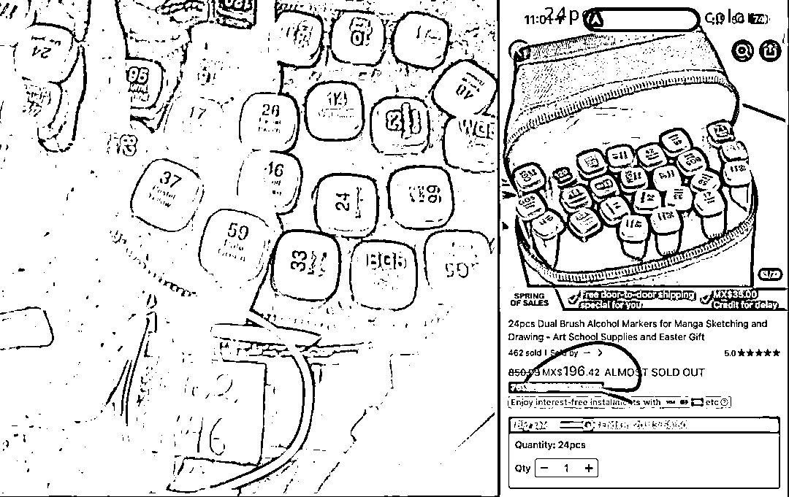
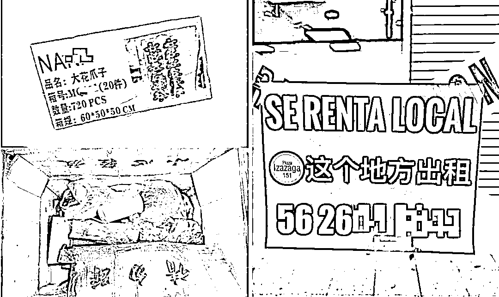
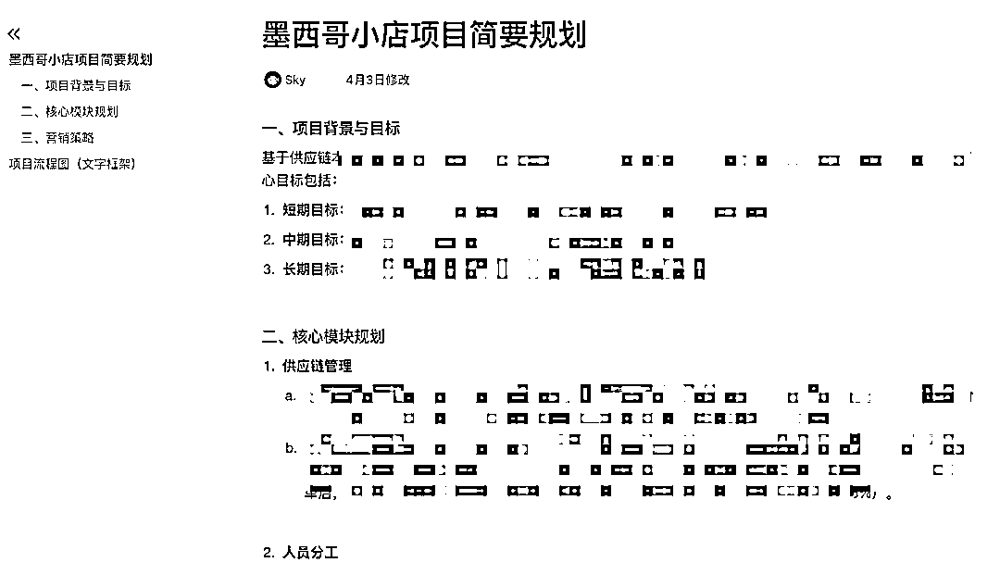

# 墨西哥实地考察发现的巨大信息差

> 来源：[https://throughone.feishu.cn/docx/NaPTd1BhboxDrbxMKCbcH807n8g](https://throughone.feishu.cn/docx/NaPTd1BhboxDrbxMKCbcH807n8g)

大家好，我是Sky老思，一位TikTok跨境卖家。由于近期美国关税的不稳定性对美国跨境卖家带来了较大的冲击，再加上TikTok在今年年初开放了墨西哥市场，这使我对墨西哥市场产生了浓厚的兴趣。

因此4月初飞到了墨西哥实地走访考察了一番，再一次印证了“读万卷书，也要行万里路”。饶是出发前针对墨西哥市场做了那么多的功课，也无法削减当我踩在墨西哥土地上那一刻的耳目一新的感觉。

就像在出发前，几乎每一位同学都会说墨西哥很危险，语言是经过渲染的，情绪是容易被放大的，仿佛即将奔赴的是刀山火海，稍不留神就会被抢劫绑架。但只有落地墨西哥之后，才会发现一个正经商人做生意的区域并没有那么“可怕”。

btw，经过4天马不停蹄的考察学习，获取到了许多有价值的一手信息，一句话总结：遍地机会但又荆棘丛生，这是一座面向勇敢者的金矿。

接下来我将从市场的现状、机会、风险、TikTok商家落地思路四个方面和大家分享我的思考，希望对大家有所帮助。

### 一、墨西哥市场真实的现状

#### 线下零售主导的消费习惯

在墨西哥落地电商生意，还是有不小的挑战的。墨西哥消费者对线下渠道的依赖是根深蒂固的，绝大多数消费者更习惯在线下购物，同时这些线下购物的消费者中，又有一大半的人在购物中习惯使用现金。

当然，这和当地商家的引导也密不可分（商家为了避税，会让消费者用现金支付，并给一些折扣），这和20年前的中国很类似。

(Peña y peña市场)

#### 跨境电商基建的短板

同时我们时常讲的跨境电商两大基建——线上支付、物流体系——都不太成熟。目前在墨西哥没有支付宝、PayPal等普及度极高的线上支付平台，在当地只有MercadoPago线上支付相对成熟，但普及率并不高。

物流体系方面，虽然随着Shein、Temu等平台的进入，已经在不断催熟、高速发展，但距离成熟的物流体系，仍然有一段路要走，例如在物流端的最后一公里成本，可以高达商品价值的15%，且偏远地区覆盖率不足50%。

这两大基建问题，将会成为限制墨西哥电商高速发展的桎梏。

### 二、机遇：未被摘完的“低垂果实”

有问题同样也有红利，在墨西哥市场，我们可以看到两个非常明显的机遇。一是价差，二是竞争密度。

#### 线上线下价格错配红利

墨西哥线下批发市场与线上零售存在显著价差。有许多产品以当地一手货商的批发价拿货非常便宜，而线上却卖的比较贵，直接将这些产品上架到电商平台，就可以获得较大的利润差。

(左图线下价格/右图Temu价格)

上图可以看出，线下标注的批发价是46比索（这还不是最低价，只是标价，向下至少还有20%的空间），而Temu上的价格是196比索，价格差4-5倍。换言之，直接把商品图往Temu半托管店铺上一挂，出单了再去线下采买，再加上物流包材，都还能赚至少3倍的利差。

当然了，也不是所有类目的所有产品都是这样的，有一些产品在线下卖场的价格和线上电商平台的价格差不多，甚至有的线下比线上更贵，因此需要时常在当地市场扫货，并不断的筛选，才能找到这些线下与线上有巨大利差的产品。

#### 新兴市场窗口期的结构性机会

对比成熟市场（美国、东南亚等），墨西哥有三大差异化优势。 首先是竞争密度较低，在墨西哥，亚马逊的中国卖家占比不足15%，远低于美国的60%，因此仅仅依靠成熟的运营打法，中国商家在这个市场就会有很大的增长空间。

其次从产品接受度的角度来看，墨西哥消费者对中国制造的接受度远高于欧美市场，墨西哥的制造业也非常依赖中国进口的原材料。在墨西哥的首都——墨西哥城（Mexico City）甚至还能看到义乌城、广州城、数码城等卖场，这些卖场中档口的实控人70%以上都是中国人。

(随处可见贴有中文的货箱)

再者，TikTok Shop在今年2月初全面开放入驻至今仅仅两个月的时间，但墨西哥的增长速度远超同期开放的欧洲国家，墨西哥消费者明显表现出了对于TikTok内容电商形式的接受度比欧洲市场要高很多。

(TikTok墨西哥办公室)

综上来看，即便当地市场的基建尚未成熟，入局者很难触达大多数层级的消费者，但低垂的果实仍然还有很多，这是一个入局的窗口期。

### 三、实操落地的风险与解法

我们了解到了当下墨西哥电商市场的现状，也看到了一些诱人的“低垂果实”，但具体以什么角度切入，什么姿势落地，仍然是需要谨慎思考的，否则稍不留神就会踩中陷阱。

#### 核心挑战与风险点——货

一旦作为商家开始入局这个一个，首当其冲的就需要思考“货”的链路如何解决，包括货从哪里来、怎么运到本土、时效多久等等。因此，就会遇到第一个挑战——供应链压力与资金压力。

目前国内直发墨西哥的海运周期长达45-60天，且清关不确定性较高（墨西哥海关抽查率约20%）。对于初入这个市场的新卖家，一批货的资金在海上就要压2个月的时间，对资金的利用效率显然是不友好的，这个物流黑洞就是吃掉资金利用效率的第一个巨大的挑战。而一旦选品失误，库存滞销风险就是第二个巨大的挑战。

那么如果我们不备货，货从哪里来？这就是个问题。

当然了，如果我们比较有魄力，上去不管三七二十一先压一批货，那这个问题也可以被短暂的解决，但接下来就需要思考货品销路的问题。营销渠道有哪几个？成功率如何？如果失败了，能否尽快找到本地的“下水道”？库存风险如何化解？

这就还是回到货上。在这样的新兴市场中，“货”就是一切的根源。那么在这种情况下，这道题如何解呢？

#### 实操落地的解法——关键角色

这道题的解法在一个关键角色上。

在上面的描述中我们会发现，只要我们自己备货，就需要顶着巨大的压力与风险，虽然我们都知道自己备货在商业模型中利润率是最高的，但与早期所需要承担的风险相比，性价比是不高的。

因此早期切入不要自己做一批卖家（一手批发商，从国内供应链直接进货）。从国内供应链直接备货到墨西哥的船期需要2个月，在销售量不稳定的情况下，压2个月的货钱在物流上风险是极大的，且资金占用率也是非常高的，但收益并没有想象中的高。

而我们以二批卖家（从当地的一批卖家手上拿货）的身份切入，这时就会发现这时候拿货成本并不会高很多，但是风险是直线下降的，这样风险和收益的性价比对早期切入的商家来说才是足够高的。

在这个模型中，就必须提到我们前面讲到的关键角色了——能在墨西哥当地跑市场的人。

我们需要在当地有自己团队的人或者能找到帮你跑市场扫货的伙伴。需要再强调一次的是，这个关键环节是非常必要的，由于当地线下市场与线上电商存在着巨大的信息差，如果在当地没有这个角色，找到好货的效率会非常低，产品在成本上也很难具有优势。

(墨西哥线下市场的各种货)

当然，就像在本文开头说的一样“这里遍地机会但又荆棘丛生，这是一座面向勇敢者的金矿”。如果愿意肉身来到墨西哥，成为这个“关键节点”，那么生根发芽的机会非常大。

我此次走访线下卖场的过程中，遇到了好几位来自中国温州、江门、广州的老板，甚至还看到了一对夫妻带着5岁的女儿举家扎入这个市场。

许多老板来到当地也才半年到一年左右的时间，但是业务已经做的非常稳定，而不像很多在美国、东南亚地区的中国老板，往往扎根本土很多年才能长出稳定的业务。这也是新兴的发展中市场的魅力之一。

关于此次墨西哥市场实地考察的所思所想就和大家分享到这里，虽然我觉得我已经说了很多了，但我仍然觉得我很难把那种感受用文字描述出来。

读万卷书，也要行万里路，期待想要做这个市场的伙伴们也可以亲自踏上这个市场，感受墨西哥空气的温度。

PS：我们自己的团队已经在积极尝试墨西哥市场，也期待和更多布局墨西哥市场的小伙伴们一起交流、合作，共同进步。

最后，祝愿大家可以在出海路上遍地生花，一切顺意。