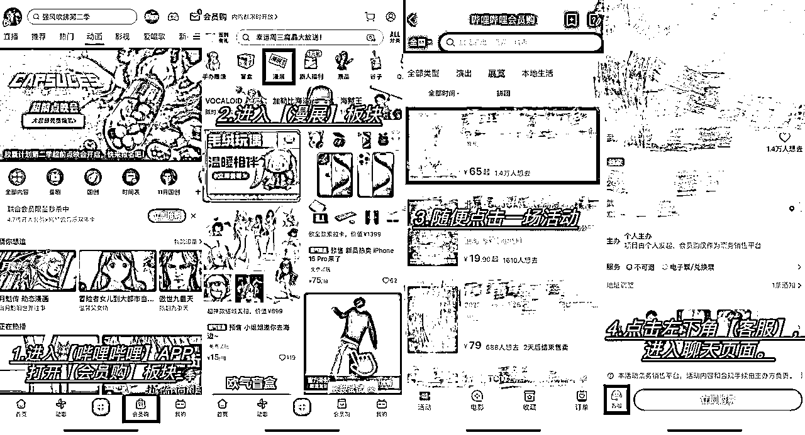

# 暨《漫展活动运营手册》|活动领域的全流程指南

> 来源：[https://x8v5nxpql1.feishu.cn/docx/NdIidEtSkoyt28xpFAwc45p7nVe](https://x8v5nxpql1.feishu.cn/docx/NdIidEtSkoyt28xpFAwc45p7nVe)

# 一、内容前言📣

大家好，我是鲈鱼 👋

还记得在 2023 年的时候，我在星球发布过一篇关于《如何从零到一办一场漫展》的精华帖（🔗跳转链接：https://t.zsxq.com/sG4jo）。虽然“漫展”这个话题比较小众，但那篇发布后收到了很多朋友的「正反馈」，大家都觉得这个行业很新奇、有意思，了解了【漫展活动运营举办】背后的完整逻辑。

时间一晃已经过去两年，虽然我本人已经不在一线深耕这个行业，但在这段时间里，围绕“漫展活动”这个领域，我又有了一些新的思考与沉淀。特别是在平台机制、内容传播、活动运营等方面，也见证了很多新的模式的诞生，还有行业的演进过程。

这两年中，我还运营了一个专注于漫展运营知识的垂直账号——「哔叔聊漫展」，期间陆续回答了非常多伙伴们，关于漫展的疑问，也整理出了一份超过 4 万字的《漫展百问百答手册 4.0》，帮助不少从事传媒、动漫、策展工作的朋友更加系统地了解这个行业，并促进了不少行业资源的链接。

而现在，我终于把这份两年打磨的核心成果呈现出来，也就是这本《漫展活动运营手册》，需要注意的是，本手册的全部字数在 25～30 W+之间，覆盖了漫展活动从策划、组织、宣传、执行到活动收尾的全过程。

这觉得这本手册不仅仅是一份完整的活动指南，可以直接作为行业 SOP 和执行手册使用，指导大家从零到一步步的搭建活动，帮助更多对这个行业感兴趣的人，真正理解并参与到这个行业中来，还可以帮助大家在自己的项目中，带来更加系统的思考与实践路径。

多的不说了——欢迎大家自行 Enjoy it ✨

如果你在阅读过程中有任何问题，也欢迎随时来找我交流。—— 鲈鱼

补充百问百答手册： （4.2w字，集合了活动举办的100+问题）

🚩「手册目录」内容↓↓↓

# 手册地图

### 关于手册「内容权限」de 补充说明

本手册内容含有较多权限文档，并不是在内容上有所保留限制。权限部分内容主要都是作为额外补充，不是活动举办运营的必要内容，是想要进一步把活动做得更好的小伙伴们，后续需要进阶所学习的。（如果有对权限内容感兴趣的小伙伴，也欢迎大家私信链接，我来给你开权限~）

一般情况下，大家也是用不到这些额外内容的，且对大部分活动运营的小伙伴来说，文档公开的内容，其实已经可以支撑一场中小型活动的启动。而如果出现了太多的学习内容，很有可能一下子看的太多，或者学的太多，也就不知道怎么下手去做了，这就是我对于权限内容的设计逻辑。

# 模块01 漫展活动的基础内容【科普篇】

## 1.1 什么是漫展

(1)了解漫展活动的基础概念（简单信息）

1.  内容文档链接：

(2)了解漫展活动当前的市场状态

内容文档链接：

## 1.2 漫展活动的营收组成

了解漫展活动的营收组成：门票、摊位、产品贩售、广告赞助。

（1）门票收入

*   普通门票(现场&预售)

*   VIP门票(现场&预售)

*   特殊票种(内场签售等)

内容文档链接：

（2）摊位收入

*   商业摊位

*   同人摊位

*   食品摊位

*   游艺合作

1.  内容文档链接:

1.  内容文档链接：

1.  内容文档链接：

（3）产品收入

*   官方周边

*   官方代理产品

（4）广告赞助

我们的广告赞助收入部分，主要为合作企业提供展位内容策划提案、展区规划等全方位内容，帮助合作企业聚集粉丝，展示品牌。根据活动规模的不同，我们的合作模式也会有所变化

1.  中小型活动招商赞助合作

中小型活动主要以产品物料赞助合作，或线下渠道曝光合作模式为主要重点内容。因为我们活动前期的规模相对较小，加之活动区域性问题，所以一些头部的合作就会比较，中小型活动的广告赞助收入其实非常有限。

*   二次元人群属性相关品牌（小型）

*   当地年轻人群粉丝有需求的商家（广告宣传）

*   部分被活动吸引来的各类品牌，同时也包括自己的资源关系

内容文档链接：

内容文档链接：

1.  大型活动招商赞助合作

大型活动的招商赞助主要以【品牌冠名】、【活动冠名】、【活动协办】【展商IP入驻】这四块为主。

## 1.3 漫展活动不适合/适合的活动举办人群

我们首先需要了解的是：启动一场漫展活动是很简单的，但想要真正把它做好是很难的。因为活动所涉及到的内容是非常综合的。时至今日，我也不能说自己有能力从零到一，有把握落地一场“绝对”不出错的完美活动，它对人的要求，确实很高。

同时，我一直对于“办展”的观念，其实是能劝一个，就劝回来一个。大家有想法确实是好事，我们也支持，但它真不是一个好活儿，它可能是动漫产业有关领域里面一个最苦最累的环节（且没有之一）。而且，我觉得劝人和教人做漫展的，其实是很不道德的。可能从此让别人，半只脚踏入了火堆，走上一条不归路，一不小心就在过程里，丢失原本的自己，然后不断挣扎往复，这是大部分的现状。

*你要理解，没有什么是一蹴而就的，光鲜亮丽的背后，更多的是那些负重前行的岁月。

（1）适合举办漫展活动的人群：

但也会有很多小伙伴比较适合切入，利用本来自身资源与优势，结合在行业里进行沉淀，或者作为业务环节渠道的一个解决方案等，那么有哪些小伙伴，会比较适合举办漫展活动呢？我来为大家详细讲解一下：

*   领域内比较合适，愿意深耕发展的人

*   本身具备同类型、同属性业务的相关人员

*   重合人群行业的参与者们

内容文档链接：

（2）不适合举办漫展活动的人群：

那么什么样的小伙伴不太适合举办活动呢？我认为主要的衡量因素，一方面是项目经验，一方面是活动成本，一方面还有自己对于行业的思考和认知。

同时，我们也并不推荐没有相关领域经验的人群，还有相对年轻的群体，或者单纯想要挣大钱、圈钱的人去加入到活动的队伍里来，因为活动确实没有大家想的那么美好，更多的时候，我可能还是首席劝退师的角色。

*   无相关领域内容、经验的人群

*   相对年轻的群体（大部分18岁以下的年轻群体）

*   想要做场活动圈完钱就跑&想要挣大钱的人群

内容文档链接：

## 1.4 当地市场的需求验证

如果我们想要在当地从零到一去落地一场漫展活动，我们首先需要检验当地的活动市场，能否可以支持我们活动落地的举办。

*   如果仅从市场运营的角度来看，没有说完全做不了活动的城市。基本上每个城市都可以实现活动的举办，只能说活动规模的上限可能会有所不同。（市场容量、其他优秀活动数量...）

*   这部分具体考量，前期主要看的还是活动主办的【运营能力】、【活动组织落地能力】与【活动执行能力】；在活动运营的后期，如果想要继续深耕发展，主要比拼的是活动的【综合运营效率】与【综合运营成本优势】。

在活动开始前，我们首先需要做的，就是快速了解当地活动市场的综合水平，多去借鉴市面上优秀活动内容，来提高自己对于活动行业的理解能力。好的市场需求验证，可以很好的帮助我们提高活动的稳定性，降低活动试错的成本。

*在做一件事情前，我们应该花更多的时间放在思考上。去把这件事情想得更清楚再去做，这样方便我们在后续执行中，根据不同情况，对活动整体进行迭代，使得活动运营更好。

那我们就需要好好的在活动启动前，做好详细的市场调查以及需求验证工作。

（1）线上市场需求验证方法：

*   哔哩哔哩平台

*   小红书平台

内容文档链接：

（2）线下市场需求验证方法：

*   本地线下活动参与3-5场

*   本地漫圈人员咨询

内容文档链接：

## 1.5 补充：活动学习思路（拆解学习法）

商业拆解的能力，在我们的活动运营中非常关键。因为天底下没有什么新鲜事，你所计划的，一定会有其他活动方想到过。你所经历的，一定也有其他活动方经历过。

比起漫无目的的盲人摸象，不如找那些活动已经经历过市场检验，以及有自己一套运营方法的活动方们学习。如果你想了解活动的更多内容，想要把活动做得更好些，他们永远是我们最好的老师，没有之一。通过向他们“致敬”，来让自己少走些弯路。你要把对方拆到比对方，更了解他自己。当你真的把这些东西看得足够多了，你就什么活动问题都没有了（活动本身就没有那么难）。

我们的活动起步，没有什么绝对的核心跟方法论。只有看得足够多了，实操问题才会更少，才知道如何更好的去做。也只有开始做了，把所有能踩的坑全给踩了，才能说真正的做好一场活动【学习的路上，真的就只有“多看”和“多做”了】

（1）拆解活动类型：

*   全国各地最新的、与自己活动体量一致的活动公司

*   不同城市区域老牌漫展活动

*   部分涌现的“黑马现象级”活动

*   头部活动品牌

内容文档链接：

（2）拆解活动品牌的搜集：

*   B站主页推荐

*   平台话题热度

*   圈内嘉宾活动行程

内容文档链接：

（3）拆解活动内容：

1.  展会学习拆解思路，七大活动拆解法介绍分享；

1.  搭建自己的活动方法论，提高活动运营稳定性；

1.  更多学习内容：行业报告、头部访谈；市场热门活动主流内容热度分析；互联网内容搜索能力

内容文档链接：

# 模块02 漫展活动的启动准备【启动篇】

## 2.1漫展活动的策划

我们的活动需要策划内容，来帮助活动做好整体的启动。传统策划内容会相对视角上比较全面一些，主要是形式，但在实际应用上会缺乏很多内容。而我们活动应该所注重的，更多是执行策划案，来专门围绕活动进度，还有各阶段的反馈去运营，并不断调整。大家可以根据自己的需要，进行参考设计。

（1）漫展活动传统策划案内容：

*   活动背景

*   区域活动与环境市场分析

*   活动内容策划

*   活动招展招商计划

*   宣传推广策略

*   活动组织架构与人员分工

*   活动预算评估

*   活动风险与管理

*   活动筹备方案执行计划

*   活动结束评估与改进

*   总结

内容文档链接：

（2）漫展活动中的执行策划案内容（核心）：

大部分小伙伴的策划，其实把重心都过重放在了【活动的资金】以及【活动内容分配】上，这其实是不太对的。我们漫展活动的策划案，主要的重心是在【项目流程执行策划案】上，也就是根据你的【活动预算】和【活动预期】。

围绕活动主题进行相关设计，在考虑到的是成本把控的“落地性”，对应数量的人群服务的前提下，根据活动不同的时间阶段，对不同环节的内容做好具象化管理。据活动运营的不同进度阶段进行设定。

内容文档链接：

## 2.2 漫展活动的举办时间

（1）活动常见举办时间参考：

我们所有活动的日期，按照月份排列，顺序分别是：

1.  元旦&跨年活动；【12月31日-1月1日；推荐指数：5颗星】

1.  寒假活动；【除过年前后时间，寒假结束前1-2周周末举办；可以尝试在周边城市进行巡回（酒店展）】

1.  春日开学活动；【开学后一段时间的周末，一般来说在3月底，顺便进行五一活动的宣发】

1.  五一活动；【三天假期，节假日有活动人流加成；推荐指数：6颗星】

1.  暑期活动；【可以是7月开头刚放假的1-2周，也可以是8月初和8月中旬 推荐指数：5颗星】

1.  暑期结束开学活动；【看与暑期的活动时间间隔，7月份办，9月份可以跟一场，不然直接筹划国庆活动】

1.  国庆活动；【国庆基本是必做的，是全年活动流量最好的一个节日 推荐指数：6颗星】

（2）漫展活动时间制定的综合考虑因素：

*   当地活动时间与外地大活动撞展

*   节日卖点

*   季节出行原因

*   其他干扰因素

内容文档链接：

## 2.3漫展活动的举办场地选择

漫展活动的场地，首先需要考虑到交通问题，像是市中心、地铁口沿线等交通便捷的场地，方便用户出行，可以优先选择。场地最好有部分自带流量，可以增强我们活动的宣传影响力，获取到更多的客流，方便活动的顺利举办。

（1）活动场地内容基础介绍：

1.  活动场地的基础讲解

*   活动人流与场地面积计算公式

*   场地选择注意要点

内容文档链接：

1.  活动场地的补充经验分享

*   当地活动过往合作参考

*   拿场地前，提前思考如何布置

*   场地方的沟通

内容文档链接：

（2）活动场地的介绍及选择建议：

1.  小型活动场地（活动人流＜1000）：

*   宴会厅酒店/婚庆酒店

*   酒吧（特殊类型活动）

*   商场

内容文档链接：

1.  中型活动场地（2500＜活动人流＜6000）

*   艺术中心

*   体育馆

*   创业艺术园区&文化产业园

内容文档链接：

*补充场地：【创业艺术园区场地】内容，合作比较特殊

1.  大型活动场地

*   会展中心

## 2.4漫展活动的【举办主体】与【活动品牌】

我们的活动品牌想要在当地深耕运营，就一定离不开组织正式化的内容。

那活动的举办主体，还有活动品牌内容就显得尤为重要。

*   个人

*   公司

内容文档链接：

（1）漫展公司的举办主体

1.  漫展公司的执照注册内容（公司后缀、注册资本、执照经营范围）

内容文档链接：

1.  漫展活动举办的相关资质参考&索引

内容文档链接：

1.  漫展公司创立流程与相关费用说明

内容文档链接：

（2）漫展公司的活动品牌

1.  漫展活动的取名与注意事项

内容文档链接：

1.  漫展活动的商标内容讲解

内容文档链接：

1.  漫展活动商标的注册实操（机构代办、个人申请、第三方申请）

内容文档链接：

## 2.5漫展活动的报备与审批

关于我们活动的举办原则和相关规定内容，只要我们的活动举办超过200人及以上（有规模）。有舞台演出、门票收入、相关产品贩售（有买卖交易），都是一定需要报备的。

*补充内容

（1）漫展活动的报备与审批

1.  活动辖区公安局备案 与 对应材料内容参考

内容文档链接：

*补充内容1：《活动备案申请书模板》

*补充内容2：

*补充内容3：

1.  文旅部门活动审批

内容文档链接：

1.  市场监督管理局报备

内容文档链接：

（2）漫展活动所涉及的相关条例内容

*   中华人民共和国治安管理处罚法

*   大型群众性活动安全管理条例

*   各类动漫游戏会展交易活动应按规定报批

*   营业性演出管理条例实施细则

*   中国人民共和国民法典

## 2.6漫展【客服号】与【活动群聊】冷启动

在我们的活动开始举办前，就需要提前考虑好活动群聊，还有活动客服号的搭建工作。这一步必须要在我们活动开始宣发前就要做好冷启动。否则开时候就没法直接联系上，转化还有链接效果就会差很多。

（1）漫展活动客服号的创建

内容文档链接：

（2）漫展活动交流群的【创建】与【冷启动】经验分享

内容文档链接：

## XXX2.7漫展活动物料内容

漫展活动物料是我们活动的一个重点内容，它涉及到了活动所有的线上下环节。在大部分活动举办时，物料部分主要的作用就是锦上添花，不能把重心进行偏离，活动的整体设计，主要还是以活动落地执行，成本把控与游客的现场体验为主。

不能光凭自己主观臆想去判断，而是从游客出发，看看大家真正需要的是什么，围绕痛点进行不断的优化，提高整体满足度。

*   宣传美术物料

*   官方产品物料

*   游戏活动物料

*   展位搭建物料

*   门票赠品物料

内容文档链接：

# 模块03 漫展活动的内容设计【内容篇】

## 3.1漫展活动内容设计的基本逻辑

我们的活动内容设计上有些基础逻辑，我们活动举办，本身并不是内容堆积。

我们所有的活动内容设计，一定思考好与活动联系的重要性，就是它是不是游客们所真正喜欢的。我们所有的运营手段和现场活动内容都是围绕这点来进行设计的，无一例外。

我们不能过度拘泥于活动形式的部分，同时在内容设计上一定要核算好活动成本（关键因素），做好整体活动的内容分配，思考落地后能不能达到想要的效果，不断减少活动落地可能会出现的问题环节。还需要在活动结束后，时刻关注好活动游客的反馈，做好重视工作。

内容文档链接：

## 3.2漫展活动的游戏内容设计

我们现场活动的整体设计，主要就是通过填充漫展活动的内容，吸引到更多游客进行现场游玩，提高现场游客参与感，使活动的氛围更好。现场活动一般主要由各类【官方主题活动】与【现场游戏】组成。

官方主题类活动：官方赛事入驻、同人作者作品展示、声优见面会、漫画家签售、国内外人气coser

季节性活动：开学季、福利季、二次元灯会（灯谜）...

场内活动区域设计：电玩区、模玩区、摄影区、休闲区、游戏区、桌游区、周边售卖区...

古风活动：投壶、射箭、猜谜...

日式：捞金鱼、水风船、套圈、戳纸盒、钓仓鼠、射击、日本相扑、画面具...

内容文档链接：

## 3.3漫展活动的舞台活动设计

我们整场漫展的活动时间，一般是在上午9点-9点半入场，下午4点半-6点左右结束，总计是在7到9小时。而舞台活动时间分为上下午两场，上午场是十点钟到中午十二点，中间休息一个半小时，下午是一点半到下午四点钟结束，也就是有4.5到5个小时需要我们进行内容填充。

舞台活动部分的内容很重要,可以说我们的活动大概率是靠舞台活动去撑起来的。在舞台处最好可以配备一名专业的二次元主持,并合理进行活动的流程安排。

好的舞台活动可以增加游客的场内停留时长,让游客感受到场内活动热闹的氛围,提高商摊产品收益,还可以增加游客与活动的交流粘性,增强其对活动的认同感。而舞台活动一旦有缺失,或是没有做好,大概率会爆雷，降低活动口碑，所以在内容设计上需要注意。

*一场活动的好坏往往不仅在于活动本身，举办的周备与否。更关键的是在游客心中的价值，游客觉得你好，你才是真的好；游客觉得你不好，不论你本身如何，那你就是不好的。

更多时候我们一定要站在游客用户的角度去代入思考，他们真正需要的是什么？不仅仅是我们做了，更关键是如何让他们参与进来？如何让他们感受到？这其实是大部分活动方们所需要思考的问题。

（1）舞台live报名

有关舞台live的报名招募，我们会在活动前，通过各平台的官方账号，发布相关舞台内容的报名信息（时间、地点、报名舞台形式内容、报名流程），进行舞台招募。

如果有感兴趣的舞台人员，可以通过填写活动申请表格信息，提交相关审核材料（音频或过往相关视频），通过审核后，即可完成官方的舞台活动报名，现场参与。

*   舞台的表演时间与内容

*   报名方式与流程介绍

内容文档链接：

（2）宅舞宅曲比赛

宅舞&宅曲比赛，这类比赛可以通过活动创建，有效填充舞台的相关内容，所有的活动都比较适合，但是对于活动区域的氛围、有着很高的要求。

相对来说，小型活动的比赛会比较简单，因为没有那么高成本的舞台搭建费用，和对应完善的赛事系统，在组织上就没有那么多的成本。

但大部分小活动舞台比赛，基本都会有比赛人员素质不齐，或者招募不满的问题，现场活动效果也会很差。最后往往变成虚假宣传，比如活动提前宣传的奖项，活动现场可能直接没有，或者直接内定，这些都需要避免。

中大型活动做这块就相对重一些，首先是活动前的宣传报名，就很吃地区，一二线参与比赛的会多一些，质量也高，但同时也不排除撞展或是其他事件，导致比赛招募不到人员。

像是三四线城市，大部分都是兴趣爱好者，如果按照正常情况，可能连赛事报名提供的审核视频都通过不了初选，而且也没有什么人报名，不通过又没人，放到现场效果又会很炸裂...

所以在比赛设计时，一定要提前做好预估，确定活动的正常招募与流程环节，避免踩雷。

同时，一场正式的中大型赛事，对于大展会的配置来说，其实成本也很高，舞台现场的特展搭建、裁判评审团邀约、赛事奖金、活动宣传及物料等...

像是中大型的地区的活动品牌，每年可以申请成为国内专业赛事的地方赛区协办，比如中国国际动漫节、Chinajoy等，借助其势能，提高活动品牌效应。

内容文档链接：

（3）舞台商演人员合作招募

我们可以通过本地演艺群或者机构，进行商演人员的招募，以填充舞台表演内容。

对于漫展活动而言，如果不能邀请嘉宾进行活动造势，不如将预算都挪到商演部分，这样不仅可以将舞台内容填满，还可以提高活动当地动漫圈子的影响力，增强线上宣传能力。

舞台商演live部分的内容可以说是舞台的重点核心部分，把这块跑通了以后，舞台部分基本成功了一半，里面的门道其实也有很多互惠互利的关系。

舞台内容不用多说，宅舞与宅曲表演，一首曲子大概是在4-6分钟左右，一般来说一场活动的舞台live数量，大概有20-40个live节目，也就是3个小时，我们总的舞台活动内容主要有4.5个小时，也就是说，只要表演的节目足够多，你的舞台活动容错率就会高很多，不会出什么大问题。

同时，这也不会特别考验主持人的个人能力，只需要对着台本看时间安排，一个个报幕即可。

*   舞台商演的优势

*   舞台商演的合作价格

*   舞台商演人员的后续维护

内容文档链接：

（4）活动嘉宾参展

我们活动邀请的嘉宾内容，主要以专业coser活动现场助阵、配音工作室嘉宾现场签售、舞见唱见嘉宾现场表演互动这三类为主。我们邀请嘉宾参与活动，主要目的就是为了提高展会的行业口碑，增强活动的专业性，积累会展品牌在圈子里的势能，还有一部分是作为活动噱头，提升带动活动的宣传力度与出票量。

前者是可以的，但如果将它作为“增加门票营收”的一部分，基本上是不用想了（像卡琳娜这类极少数顶流嘉宾除外）。

这里需要补充说明，嘉宾会自带流量，但是在当地举办活动，当地因为其来参展活动的，基本上不会有太多粉丝，一方面是受众人群面小，另一方面还与城市的地理交通有关。

像嘉宾这块主要适合中大型活动，结合进行宣传造势（现在市面主流的活动内容，基本上也都是“嘉宾展”，同质化也会相对严重一些）。

但如果预算有限，活动规模没有那么大，小活动前期暂时就不用考虑了，不推荐用嘉宾展起步，相对成本就会很难把控得住，活动预算会砍掉一大半，启动会很重。

需要注意的事，我们不能为了“嘉宾”而“嘉宾”，我们可以把更多的活动预算，放在其他活动内容上进行填充，反馈到游客的活动体验环节上。

同时，也可以适当邀请些小嘉宾参与活动，逐步活动这部分内容结合商演部分跑起来。如果活动后续发展有需要，就可以再酌情考虑这部分内容。在选择时优先考虑行业影响力和市场热度，推荐不同领域可以涵盖的种类多一些，这样可以吸引到更多不同喜好的群体来到展会。

对接嘉宾资源可以通过平台后台私信，或者联系嘉宾经纪人和一些工作室。

1.  嘉宾活动邀约

内容文档链接：

1.  嘉宾参展费用参考

内容文档链接：

1.  嘉宾签售内容设计（内场&VIP）

关于嘉宾签售内容的设计，我们主要会根据活动不同门票票种的种类，在设计上会有所不同。目前我们市面上有关活动的签售内容，主要有两种。

一种是票务的优先签售权，也就是针对于活动，不再设计额外签售的票种了，而是结合门票等级权益，进行优先级区分。

比如，我们活动的现场会在签售区域，设计不同的门票通道。普通票、VIP票各排一条队伍，两条通道轮流签售。同时可以在票务权益的设计上，结合签售嘉宾的相关物料，进行赠送，这就是结合票种等级的设计内容。

还有一种，也就是为签售活动，在活动现场，设计专门的内场区域，为嘉宾签售板块开设单独的板块。活动门票只是入场，签售还需要再购入一张内场票，来参与嘉宾部分的内容。

内场票在设计数量上是限量的，而且需要在活动前随机摇号牌，现场在区域进行专门的检票，兑换内场实体票，并领取海报或其他嘉宾周边，按照号牌入坐内场座位，按顺序排队进行签售与互动。

在签售的设计上，我们主要会根据人数，还有活动时间进行设计。如果说时间有限，就需要严格把控好每个小伙伴的互动时间（1.5分钟），互动也要适度在不影响活动正常举办的前提下进行。

比如拍摄互动提前打开视频录制模式、把要写的字提前打好（字数设置、能否TO签）、本场活动是否接受礼物投递等，都是要考虑到活动实际环节进行结合设计的。如果嘉宾老师，在活动现场有贩售周边的话，我们也要组织好相关人员，配合进行协助与管理。

如果是内场签售活动，一般在签售完成后，我们还可以设计嘉宾与普通票游客，在专门区域进行随机互动，来增加嘉宾与游客的互动性，这就是专门的内场设计。

具体关于嘉宾签售的内容，大家可以参考上的优质活动，结合自身活动需要进行设计，就不过多介绍了。

内容链接文档：

大家可以在设计时带入参考：

1.嘉宾物料是否限购，如果限购，限购几种or限购几张or每种限购几张;

2.嘉宾是否每份物料都签名;

3.嘉宾 To签几张，To签是否有字数限制;

4.嘉宾合影是自拍or工作人员拍;

5.和嘉宾合影是坐旁边合影还是嘉宾站起来合影;

6.粉丝是否可以要求拍摄嘉宾单人照片;

7.是否允许出现拉嘉宾录视频与打视频通话的行为;

8.单人签售时长控制在多久;

9.准备足够量的移动电源与打光灯;

10.提前询问嘉宾是否有自带摄影师，如未自备摄影师需在签售区安排摄影人员;

11.嘉宾可能会收到比较多的礼物，签售区是否有放置礼物的位置;

12.嘉宾休息室是否在签售区围栏内，距离签售区的距离，中途休息是否会穿过人群造成哄乱;

13.签售区与展馆各个门口的距离，是否会对着风口;

14.提前询问嘉宾当日cos角色，如着装较清凉需提前准备取暖设备。

（5）主持人撑场

关于主持人撑场，指的是在万不得已、缺乏舞台表演的情况下，比如舞台活动在活动开始前只有8-15个节目表演，或者现场活动安排突然出现了差错，导致舞台内容严重缺失，没法支撑活动的举办。

这些问题常常会出现在小型活动中，这个时候，我们就需要依托主持人的专业能力，舞台全程进行大时长的现场互动，同时再不断穿插表演节目。常见的比如说：现场玩接梗游戏、考验游客二次元知识，现场上台小游戏互动等。只要能留住游客，延长其场内的活动时间，无所不用其极...可以说更多是作为活动预案，是活动的救场神器。

核心就是福利送，送，送！将气氛炒热，不要让观众感觉到舞台冷清，不断提高现场互动。

一名优秀的展会主持人，不仅可以在这种情况下提高活动气氛，化尴尬为神奇。还能在谈笑风生的同时，拯救整场活动，兼顾人流停留与整体活动节奏的把控。

同时，主持人还需要掌握好一个度，比如舞台这边太热闹，可能人群都围在舞台，商摊产品售卖少，事后可能还会与商摊出现沟通问题，自己相关的产品部分收益也会变少...

当舞台比较冷清时，人跑的又快，活动氛围就变差了。全天舞台活动的内容要分配均衡，做好当前活动环节的同时，还要持续预热接下来的活动，时刻保持着用户的期待，然后不断满足用户的预期...

我们在做活动时，尽量避免出现类似的情况，如果出现问题，可以提前与主持沟通好活动的状况，作为预案，并设计一套备选方案，来使活动圆满举办。

（6）舞台随舞

随机舞蹈，活动官方提前在活动宣传内容中，发布舞蹈歌单与活动流程安排。游客们可以提前在参展前做好准备，舞台随舞部分的内容，不需要进行专门的报名，活动现场舞台随机播放歌单音乐内容（最新热门歌曲选段，非整首，主要是串烧内容）。

只要想跳，就可以一起加入到舞台跳舞区域，在一首音乐结束后，会快速切换新的音乐内容。会的游客可以继续随舞，而不会的游客可以在旁边等待，等到熟悉的再进行上场，具体以现场为准。

关于随机舞蹈在曲目歌单设计前，需要进行专门的市场调研，市面上常见的随机舞蹈包括：“宅舞、整活曲目、韩国男团女团kpop曲目”（*需提前调研活动当地当地，对于整活曲目和KPOP曲目的包容度，部分地区抵制kpop乃至kpop二次元嘉宾—感谢戈尔曼补充*）

可以参考活动地区的其他活动歌单，也可以发布问卷进行搜集调查（这点的好处是，一般填写的都会有所准备，所以这样子进行信息搜集会更加适合）。如果地区单独主题活动热度比较高，或者有专门的类目比较受欢迎，那就可以针对性的再做一个主题随舞活动。

对我们一般活动来说，随舞区域可以设计在舞台前面的空地区域（专门做个地贴，用围栏拦住一片区域），互动时间安排在40-60分钟之间（不用太长），活动安排一般是在活动当天主舞台内容结束后。这样不会占据舞台内容，还能在快要结束活动的时候，起到一个氛围互动作用，让游客们自己玩得开心。

对于大型活动来说，除了【活动主舞台】，还可以再专门设计一块【自由舞台区】，作为随舞及其他表演节目内容的使用，这样就可以很好的综合场内内容，同时进行。（具体需要考虑到活动成本、活动场地空间、区域活动氛围、舞台报名人员等；不然还是建议集中在主舞台上）

*随舞部分的内容设计，主要是给我们的活动的游客，一个展示自己兴趣爱好的舞台，让他们发挥自己平时在现实生活中无法表现的才艺；在进行这部分的内容设计中，也要在宣传和组织上让更多对这方面感兴趣的游客加入进来，这样才可以确保随舞部分内容的参与度和活动热度。

内容文档链接：

*补充内容：

（7）电竞游戏比赛

电竞游戏比赛，其实个人并不是非常推荐，主要是实操起来活动现场效果不是很好。

本身我们的活动游客，对于单独游戏板块题材内容，了解感兴趣的就比较有限。电竞游戏本质上也是属于同好的一种内容，如果你对游戏本身没有了解，你就很难融入，也不会理解其中的”梗“，参与不进来。

如果你把这样的内容放在舞台下，用桌椅与喷绘布置，布置成一块专区其实是可以的。但当你把它放到舞台上时，停留观看的人就会比较少，既大幅占据舞台内容的比重，又严重浪费舞台的产出价值，所以并不是很推荐。

## 3.4漫展活动的官方IP填充

这块的内容也是比较重要的，与【舞台活动】一同构成了活动专业性的体现。

一方面，用户为什么会来你的活动，是因为你这有平时见不到的东西，是只有我参加活动了，才有机会见到。如果我随处可以接触到，那就减少了“逛展”的一大兴趣性，现场也会缺失掉很多元素。

而现场官方IP的入驻，就填补了这块内容，首先由于官方是自带知名度和流量的，那么它所能给你带来的势能是很强的，而且用户属性与活动人群也完全是相同的，属于自然而成。常见的有【游戏展商】、【动画&动漫展商】、【官方展商】等，但这里我不得不给大家泼一盆冷水，因为目前市面上大部分的展商，基本都不会考虑小活动做营销。一方面是因为你的活动体量是硬伤，哪怕花钱也请不过来。

假如说你体量规模够了，另外一方面，因为地区因素，参展商们的出行成本、宣传成本，对比北上广深城市的转化效果而言，包括对比其他渠道投放来看，线下活动也是得不偿失的，所以基本是联系不上的。

在合作上，大部分展商会选择一线活动进行展位入驻，像是国内比较知名的会展品牌：Cp、cj、bw、萤火虫、国际动漫节等，基本都是官方展商自己花营销费用，做线下宣传的...

但这不代表我们无法获取相关IP资源背书，在这方面，我们还有一些其它路径，可以帮助我们有效进行官方IP板块内容的填充。

（1）官方经销代理

我们可以成为官方ip展商产品的区域代理，或者直接向官方渠道采购产品，将展商品牌作为活动产品部分内容进行填充。

内容文档链接：

（2）官方产品贩售入驻

在活动现场，我们可以通过自行搭建展位或摊位对产品进行贩售，并作为活动参展的品牌入驻，在提高展会营收的同时，将品牌在活动的宣传中进行介绍，融入到活动中。

内容文档链接：

（3）官方平台商务合作

我们还可以对通过发送商务合作邀约，或者通过在新媒体通过官方活动号，依托展会品牌，对平台展商们进行后台官方私信，进行确认合作，发送活动介绍文件,进行活动的流量置换。

内容文档链接：

（4）官方自营IP品牌

我们还可以将自己的活动官方品牌，和相关业务进行内容填充宣传。这块操作空间也很大，你可以填充自己会展的品牌资源，比如说我们可以做一个我们活动的官方品牌店铺，进行活动参展，在贩售周边的同时，填充部分官方性内容。

我们还可以将自己在本地运营，及到同类人群的业务、产品等进行融入（比如动漫店、电竞游戏俱乐部、摄影工作室...），这非常适合在你缺少内容的时候进行填充设计。

*但需要注意的是，你自己本身是没有流量的。

所以基本上在填充自己产品的这块内容时，一定要将自己产品宣传跟产品设计，设计的相对专业些，可以借鉴优质品牌，但是不要做抄袭。否则如果设计的相对较差，既无法产生引流的宣传效果，还会给用户一种活动很"廉价"的感觉，得不偿失。

（5）区域品牌合作

如果我们在当地举办活动，我们还可以进行区域性的快消年轻品牌合作，核心就是将与人群属性相同的品牌内容进行填充合作，让活动变得更具综合性一些，并满足活动的官方合作需求，与用户体验。

1.  年轻餐饮类消费品牌，比如说饮品类：阿萨姆奶茶、小茗同学、美年达、可口可乐等品牌；比如说快消品牌：茄皇统一方便面、辣条品牌等。需要注意的是，联系这类IP合作，需要直接联系活动地区品牌经销商，一般是物料合作支持，现场为其搭建活动展位。

1.  现场制作贩售类品宣

*   奶茶：COCO、世界茶饮等参展品牌，现场进行品牌宣传，设计游戏互动，并联合展会设计套餐内容

*   食品：比如说面包、蛋糕等甜品品牌，现场宣传贩售组合产品，打卡互动领周边。

1.  动漫相关类品牌参展，比如说语言类的教学机构，比如说樱花日语或者其他区域教育品牌。还比如说绘画相关，绘画教育培训、或者是绘画板的品牌（如：绘王等）

1.  当地同属性品牌，比如同城的书店、动漫谷子店铺、摄影工作室、影城等。

（6）网站合作

我们可以把我们展会的活动信息，上架至各动漫网站进行活动媒体合作，主要不是获取流量。

我们主要的目的是，获取到合作媒体平台的合作logo，然后把网站logo放置在活动宣传海报中，这样子一排，会显得非常专业，属于借势的一种低成本方案。

在物料制作上，需要提前核对信息，确认logo的使用性，不然后期物料可能会作废，需注意！

## 3.5漫展活动的摊位招募

通过摊位的招募，我们可以对场内区域进行内容填充，一方面是补充展会的相关内容，使得活动现场饱满，同时降低部分活动成本。另一方面，我们可以通过提高收益，摊位营收部分占比20%-50%左右，降低活动成本，有效分摊活动运营压力，以提高活动的稳定性。

我们活动常见的摊位类型，主要有普通商摊、同人手工摊、食品饮料摊、游艺玩具合作这四类。

（1）普通商摊

这个商摊类型为我们活动摊位的主要构成部分，也是一块核心板块。如果你的活动处于前期中小型阶段，你就会非常吃这块的资源，它将会占据你活动50-80%左右的现场内容，同时也是你活动成本把控中的一部分。

这类商摊在活动现场会有一块专门的摊位区域，售卖相关动漫产品周边，如手办、福袋、挂画及各类动漫相关产品（严禁盗版伪劣周边 与 砸金蛋类活动）。

视展会品牌知名度、活动预期人流与区域位置、参展价格也会有所不同。大部分朋友，前期都有商摊无法招募的问题出现，包括活动举办前都没有联系到合适的摊位参展人员，其实商摊类的合作。一般都会在活动策划前进行确认，需要先去与摊位主们聊，沟通意向，确定时间进行合作下来，再确认摊位的前提下去举办的... 避免现场出现没有摊位的情况。

内容文档链接：

（2）同人手工摊位

同人手工摊，顾名思义就是贩售一些【同人产品】、【原创小物】与【手工产品】的摊位。

【同人产品】是爱好者通过对ACGN内容，进行二次创作，并制作为相关类型的产品；【原创小物】就是自己的原创设计，这块会有很多形式载体，与文创类似。【手工产品】为手工制作的一些相关产品，常见的比如说一些发簪头饰、面具装饰等产品类型。

这类摊位活动现场会提供一张桌子（桌子尺寸100*60参考，可使用网格架、亚克力摆放台等辅助物品，提高产品摆放空间）、一把椅子（需特别注意:展会严禁自带桌椅、占领空地摆地摊经营，延伸布置）。

*对于大部分活动来说，同人摊位和手工摊位是归位一类的，大型活动也会根据需要，设定不同的摊位专区，但并不适用于所有活动，我们致力于科普更加普适可执行的内容。

*如有需要，大家可以通过学习方法自行进行学习，以优化该部分的摊位内容。

*   售卖范围

*   禁止售卖范围

*   违规处理方式

*   展位配置

*   摊位租金

*   摊位优惠

内容文档链接：

（3）食品饮料摊

像食品饮料摊这块合作，主要适用于中大型活动。在我们活动场内，其实是非常缺乏“吃喝”类板块内容的，游客在活动体验过程中，常常会感到口渴与饥饿，而我们活动无法满足其对于这块的需求。

这块除了【商场类活动】可以利用综合业态解决体验问题外，像是其余活动场地（如酒店、体育馆、展览中心等），甚至会出现周边没有相关门店的问题。所以，通过对食品饮料摊的招募，我们就可以非常有效的提高场内游客体验，且在满足游客的同时，增加展会营收。

*   活动场地相关部分的支持

*   食品类目选择与管理

*   摊位招募&自行组建

*   摊位合作方式

内容文档链接：

（4）游艺玩具合作

游艺玩具合作，主要是与当地游戏城或动漫店进行相关设备的合作，常见的比如说：扭蛋机、抓娃娃机、动漫产品自动售卖机、抽卡机等，进行活动入驻，填充展会内容；合作方式与上述摊位部分一致，也是按合作费用，或是相关售卖产品分成进行合作。

# 模块04 漫展活动组织与商业模式【组织篇】

## 4.1漫展公司的团队组建与人员分工

（1）为什么我们要进行团队化，以及如何团队思路（内容讲解）

内容文档链接：

（2）漫展公司行业团队化问题分析

内容文档链接：

需要注意的是，我们的行业普遍在【团队】上存在两块问题：

首先，行业人员流动性强，我们的活动人员很难有积累留存；其次，因为行业特性，在我们活动非展期运营时，缺乏其他收入组成部分，活动人力成本的开支较大，无法支持团队非展期时间的正常职能角色。这也是大部分城市地区，活动主办方的团队规模不会很大的原因（在漫展行业，3-5人就已经是一个比较大的团队规模了，且能顺利支撑大部分一二线会展业务的进行）。

正因如此，这也是一个行业缺陷，即为什么市面上大部分城市区域的头部活动，虽然具备一定规模与影响力，但活动始终看上去没那么正规，就是因为受到行业特性的限制，活动设计相对有限，且无法有效支持更大规模的活动运转，承接更多活动专业性内容，提升与之匹配的业务能力，无法对更多与之对应的问题进行妥善处理。

不少活动主办，在享受先发与品牌积累优势的红利中，缺乏对活动市场的敬畏，始终无法取得较大突破，且因为活动行业地域性的原因，大部分城市无法落地大型规模活动，头部活动仍旧只存在于一线城市中；

且大部分活动主办都并非科班出身，最初都是由动漫爱好者转变而成，行业信息内容在其中缺乏流转，其所掌握的行业内容与活动方法，都是通过自我实践积累与不断摸索所形成的，虽然能满足活动运营，但对活动整体的规划意识会比较薄弱，无法持续创造出更好的价值，进行有效拓展......

（3）漫展团队的人员配置

我会为大家提供两套团队思路：

1.  传统漫展公司（展会工作室）

我会先对传统漫展公司（展会工作室）的团队搭建与管理内容进行重点讲解，给大家提供一套基础的团队框架。

这块经验主要来自于我过往参与到活动中【工作室】的基础团队配置，且在创作时参考了当前市面上大量的活动公司的人员组成，并对一些主要业务进行职能的拆解与分化，包括组织人员构成和对应的绩效管理。同时，这个团队模型适用于大部分活动公司组织架构，也是正常我们活动最为理想化的综合配置。

内容文档链接：

岗位职能要求01：

岗位职能要求02：

岗位职能要求03：

岗位职能要求04：

岗位职能要求05：

岗位职能要求06：

岗位职能要求07：

岗位职能要求08：

1.  新型成长漫展团队

这一套是我这些年的一些经验汇总，模式相对会比较轻，更适合业务成长型的团队，可以在不同的业务规模发展下，灵活调整，满足活动所需。主要是围绕业务进行【一专多能的人员分配】+【高效工作流程】+【外部职能合作】，来满足活动配置。

这块团队模式，适合所有的中小型活动方，我们的团队人员，按照业务规模配置分别为【1-3】、【3-5】、【5-8】、【8-12】，这类阶梯式成长配置，相对来说也是比较适合活动行业的团队模式，即“有多少工作量，就对应有多少人”。

这块核心就是：

人越少越好（薪资水平要跟上对应工作量和工作能力），交流组织越高效；

能采取兼职、外部合作、外包解决，就不多一块自己专门的人负责；

不盲目追求团队规模，所有人的职能基本上都是“一专多能”的，以单独板块为主，辅以其他业务板块。

#管理&培训系统

1.成长型团队会有一套人员培训系统（大量的工作sop学习内容），这个系统可以保证每一个人员，哪怕之前没有任何相关经验，在培训完成后都能使其快速学习，拥有相对应的工作能力，这样的好处就是，在人员招募管理上，不需要过度依靠经验主义者与人员素质，且合适的人比较少，难以寻觅，使业务不依托于个人能力，能够更加的稳定；

2.成长型团队同时也拥有一套【人员工作管理系统（流程化管理）】，这套系统能够有效避免因人员流失，而带来的工作脱产对接问题，随时能够保持信息同步，随时快速掌握整体信息，快速融入至工作中。

-同时，因为人数不多，我们不必要使用更加先进且复杂的管理工具，因为形式主义会减少我们活动的交流性。在工作进度的确认环节中，我们可以保持开会沟通，来进行活动策划内容的交流，或是汇总统一活动整体的进度，针对一些活动问题，进行统一的交流碰撞。

团队可以准备一块小白板，将核心工作指标内容数据进行公开标记。

包括一些重要事项的时间点，还有不同岗位人员负责类目的招募数量情况，这个非常重要。一方面所有人都能够了解整体工作进度，对整体有着掌控感，其次它会让所有人感觉到压力，能够更好的产生做事被推着的感觉。

内容文档链接：

## 4.2漫展NPC的管理与招募

（1）活动NPC的基础内容介绍

我们现场的核心区域负责，都是优先以自己的人员为主。但因为活动现场的工作相对较多，小型活动我们的人手可能差不多够用。但是活动规模稍微大一些，就会有些吃力了，现场人手安排会明显不足。

这时候就需要进行漫展NPC工作人员的招募，来帮助展会更好的组织现场活动内容。我们可以在官方发布活动NPC的招募内容，对活动NPC进行招募。

在发布内容上，主要偏向于活动共创，满足NPC们参与活动的价值感。在招募发布后，会有一些感兴趣的用户，联系官方客服进行报名。（这个非常吃活动品牌本身的影响力，影响力越大招募越顺利，质量越好）

审核完成通过后，即加入到活动NPC群，于活动开展前，集中选择一个大家相对方便的时间段（安排在周末下午），对所有参与的活动NPC进行统一培训，明确具体岗位内容，维护展会形象。

在合作上，像我们活动的NPC画像，主要是过去有参与过我们活动的游客，对我们的活动比较认同，也比较感兴趣，于是放弃了自己的周末游玩出行计划，来参与到了活动的志愿服务当中。想要帮助更多的小伙伴参与活动，获取更好的活动体验，帮助活动维持秩序，让活动落地运营举办的更好。（*但也需要注意，如果是二次元圈子里面的人，会有很高的概率玩心很重，可能会影响到活动现场的运营，这个是需要提前筛选，或是现场做好预防的）

需要注意的是，NPC没有薪资报酬，但是会有相对应活动补贴，比如：享有官方周边伴手礼，结束后的集体聚餐，享有后续福利反馈活动的优先报名权等...

（2）NPC与志愿者的区分定义

我们的活动在宣传用词上，需要注意不能使用“志愿者”字样，而是尽可能采用“NPC”和“STAFF”，这里需要和大家强调【志愿者】和【NPC】的定义，还望大家能够在活动内容运营中，做好区分。

内容文档链接：

（3）NPC的人员招募

1.  中小型活动

小活动的NPC人员招募会比较简单，我们会在活动开始前，对报名活动NPC的人员进行招募。对活动NPC报名有意向的小伙伴们，可以通过添加活动客服或者通过网站链接、小程序表单搜集等，领取到报名表格，来填写志愿者报名表格。

通过浏览表格上的报名须知与要求内容后，了解活动初步的安排流程与内容，确认无误有空闲时间可以参加活动NPC工作，对于内容没有异议后，认真填写活动报名表格内容，并提交至官方渠道，进行审核。

内容文档链接1：

内容文档链接2：

1.  大型活动

当我们活动规模做大时，我们活动的志愿者官方招募渠道，可能无法有效招满，其人员数量远远不足以支撑我们的活动组织时，我们就需要再考虑进行社招兼职的招募了。如果我们活动组织可以招募完成，但是无法对NPC人员进行有效管理，还可以需要考虑外包专门的展览服务公司，来进行相关人员的管理和赋能，来提高活动稳定性。

关于社招兼职的招募，我们可以在活动区域当地，联系一些兼职群、校园表白墙，搭建我们活动长期的招募渠道，或者培养积攒自己的相关人员，方便管理。你也可以依托活动线下场景优势，在当地做一个动漫社团，来对相关人员进行招募并凝聚发展成展务合作人员，也能有效解决这部分的问题，作为一种只属于活动品牌自己独有的解决方案。

我们可以找一家专门对接兼职的公司进行外包，像这些公司手上会有一些平台和渠道资源，比如说：各大新媒体平台矩阵引流、兼职平台等等，可以有效帮助我们联系到很多的兼职人员，解决人员这部分的问题，甚至说说还可以帮助我们代为培训。

关于兼职机构合作的费用，主要是按人头抽成，比如说我们活动给的是单人150，那兼职机构每个人可能抽50，到NPC手上就是100元（如果需要联系，这个一定要把控好，可能会有舆论）

关于社招人员，其实有好有坏，好的是现场人员问题会得以解决，也会遇到责任心和执行力远远大于漫圈学生群体的兼职；不好的地方就是，部分兼职人员对于二次元的内容不够了解，没法理解活动参与人群，现场与游客的接触交流中就会比较尴尬，也有可能现场出现缺岗、联系不上等问题，需要注意。主要还是看招募筛选、活动培训与现场管理这三个部分了，一般来说都可以进行规避，也不会有那么多大问题。

内容文档链接1：

内容文档链接2：

（4）NPC的活动培训

我们的培训一般是从下午1点半开始，于下午四点前结束，合计2.5-3小时左右，不需要安排过多时间。主要的目的，就是在活动前进行一次碰头，做一次动员大会，并统一做一些简单的培训赋能。

*不是说一次性完全教会，这个是不现实的。我们活动现场还需要通过集合时间的再次重复讲解，还有现场管理来去让整体更加稳定。

我们主要培训的内容主要有：

1.  志愿者通用知识培训，这部分内容主要包括：志愿者服务精神、服务理念、服务基本礼仪、服务基本知识、沟通技巧等志愿者相关内容赋能，来进行标准化培训。

内容文档链接：

1.  工作内容岗位职责讲解，对志愿者开展工作任务、业务流程、规范要求等岗位职责内容的培训，包括活动时间流程安排、现场活动职责、各岗位需要重点注意的内容...同时，我们还会为志愿者们讲解对应的规则内容，对每个板块进行专门的交代。

内容文档链接：

内容文档链接：

*补充内容分享：

1.  服务技能内容这部分内容主要包括：专业知识技能培训，我们会对我们不同活动区域的志愿者进行，针对岗位进行专门的服务技能培训，来弥补专业部分的不足，更好的服务游客。

内容文档链接：

（5）NPC的现场安排

1.  小型活动（1000人以下）

关于小型活动的人员分配与现场内容，其实相对比较简单。和其他中大型活动相比，因为规模不大，所以需要的工作人员还有NPC数量不多，现场管理性也会比较强，接下来为大家介绍小型活动的现场人员安排思路内容。

内容文档链接：

1.  中型活动（2500-8000）

涉及到中型的活动，首先活动【活动执行】一定是不会少的，负责展会现场整体的管理，不然无法有效统一管理好现场内容。中型活动在人员在安排原则上，对于一些与官方直接有关的重要内容上，优先是安排自己的专门人员负责。其次是有经验、信得过的活动NPC（作为小组长），最后才是普通NPC。（自己人＞信得过的NPC＞普通NPC）

在人员分配上，尽可能不让普通NPC单独行动或负责一块活动区域，因为缺乏经验，而且没法及时管理跟进活动问题。普通NPC的安排，最好是配合自己的人手与比较信的过的活动NPC，进行辅助工作。

内容文档链接：

1.  大型活动（10000及以上）

因为我们活动区域比较大，所以我们人员的分布会涉及到多个区域板块，进行划分，在每块区域内安排不同职能的人员进行工作配合。我们主要有【外场组】、【检票组】、【内场组】、【舞台组】、【后勤组】、【展商摊位组】、【机动巡场组】，这几个组别，下面来以此为大家介绍。

内容文档链接：

*补充内容：

## 4.3漫展活动的合作（社团）

我们可以挖掘活动所在城市内的，所有学校动漫社团进行链接合作。

社团合作的好处主要有：

1.  可以充分进行高校人员联动，打通社团学校内的活动宣传点位；

1.  提高活动的专业内容，了解当地社团的活动需求；

1.  增加社团的票务合作营收（不以为主，但一般一家社团就是几十人，相当于一个大票代了）

1.  有效填充舞台内容，专门的舞台内容，或者社团舞台live、舞台剧、节目自由行等活动内容。

* * *

*   当地动漫社团的挖掘

1.我们可以通过城市，搜索到城市里的所有学校；

2.学校名称+动漫社关键词，一个个联系匹配，对相关动漫社团进行全网搜索，

--还可以通过qq名称、官方平台账号，对接到社团关键人物；

3.表明活动方身份，确定合作事宜，链接合作。

*   社团合作对应职责

1.在自己的社团群内发布漫展信息，协助展会进行校内曝光宣传，促进活动信息的扩散（社团会议、单页派发、表白墙宣传等）；

2.转发相关新媒体平台（Bilibili、微博、公众号、QQ空间等）的活动宣传内容，并在相关评论区发布与展会活动相关的评论或宣传；

3.展会提供社团一份门票，社团进行票务代理，在展会前结算售卖张数。

4.社团内有想协助展会（现场工作）意向的小伙伴，可以申请展会社团志愿者，为展会游玩的小伙伴提供更好的服务，让更多的小伙伴有更好的展会体验。

5.社团内有想上台进行舞台表演的小伙伴，可以报名展会的社团live，为展会提供更多优质的舞台内容，并免去相关票务费用。

*   社团活动福利

1.社团特供门票、享票务折扣-5元（或7.5折）每人；且社团门票享有优先入场权利，与额外的官方无料伴手礼（社团专属）；

2.社团参与活动人数足够多，组织负责人员免票（最高3张），现场免费提供“社团宣传位”【社团参展人员需满18人＋，只用于社团宣传（仅用于拉新、社团人员招募），不可以售卖产品】

参展的活动物料（展架、DM单）需自理，提交官方审核后，方可进行现场展示；

3.社团名（或LOGO），在展宣上体现露出。享有活动官方线上各新媒体平台（抖音、小红书、微信公众号、微博、qq空间）渠道曝光，及展会现场舞台两侧X展架进行曝光；对优质社团进行活动资源推广，让当地更多人群了解社团内容。

4.社团人员报名舞台live现场活动，可免门票入场，且可以对社团进行一个有效曝光；

5.针对长期合作的优质社团，会提供更大的平台跟舞台，还有部分扶持资金，可以深度对接后续合作内容（包括城市性商演、相关专业人员指导）

*   社团合作内容经验分享

*   社团合作话术参考

内容文档链接：

# 模块05 漫展活动的平台电子票务上架【票务篇】

## 5.1B站票务上架

我们在B站上的活动推广，主要还是在漫展板块，通过上架活动，进行门票预售与活动品牌宣传，让当地感兴趣的游客看见并选择。我们可以通过平台后台联系平台客服，然后获取合作商务人员名片进行联系，提交活动材料，获取系统后台后，即可上线活动。

按照正常上架平台获客，带来的人流波动相对较大，具体以活动品牌当地知名度、活动宣发内容、地区氛围、活动撞期、活动时间这几块因素为主。

酒店展在50-200左右，体育馆和商场展在300-800左右，会展级别的活动会选择与官方深度合作，结合节假日官方产品活动，比如流量推荐、上bannar等，获取更多流量转化。

在什么情况下，可以选择与官方进行深度合作呢？

首先，如果你的活动举办城市，氛围非常好，有非常多的活动主办，那你活动在当地的影响力一定要深，要达到行业与用户共识的那种。同时在平台上多积累活动案例，活动数据也非常好非常稳定，让官方可以作为参考并选择。

从官方平台运营的角度来说，因为官方的流量给谁都是一样的，为什么把流量单独给到你，就是因为你有其他人比不了的过人之处，你能最大化的利用好流量，而且选择你大概率不会出错，实现平台展会游客的三方共赢，也是他们最好的选择，固势而谋，顺势而为，谋定而后动，这点值得你反复思考。

还有种情况，就是活动在本地活动区域，占比了地区近市场的80%份额，没有可以产生直接威胁的其他活动品牌，这时候你可以考虑提出与官方的合作。

因为漫展的地域局限性很强，平台的流量是全国范围内的，平台业务也有盈收发展需求，只要业务在，就会有合作诉求，平台想要将这部分流量进行转化，那就必须要把这部分地区流量，对接给不同区域内可以承载转化的活动方载体，填补业务生态。

在没有直接合作的情况下，是在300-1500左右，深度合作后视活动区域，在2000-8000左右，数据仅供参考，具体根据活动的宣传覆盖面、品牌效应会有波动。

b站票务部分在后期，会占比我们活动门票的很大部分，但在前期我们不能过多指望，一方面是活动知名度有限，另一方面是你的活动质量不够稳定，没有那么多能力去做好活动交付，承接不住，就很容易有问题，要考虑清楚。

（1）联系平台客服，获取对应活动票务上架负责名片

（2）添加好友，提供活动材料内容

内容文档链接：

（3）常见问题

1.  关于活动上平台的时间:

--推荐提前15日左右，具体看区域票务负责通过好友时间，还有沟通链接效率，无固定标准。

1.  关于票务核销的方式：

--到时候b站会有一个专门的票务“APP”，专门可以查看活动票务情况，并对活动二维码进行现场核销。

1.  关于活动票务的结算:

--活动上架没有费用，售出票务会有平台服务费抽成（预售门票的10个点；现场票6个点）

--活动项目部结束后，等7-14个工作日，后台显示活动余额后，发起提现。

1.  关于上架的操作

--以前是文件信息统一打包，然后给客服进行审核上架。目前是审核后，会提供一个后台系统，自行调节活动信息。

## 5.2抖音活动团购联系上架（进阶内容）

抖音平台除了活动账号运营部分的内容，主要还有团购带货的业务板块，在抖音同城业务板块的发展下，平台从22年底开始兴起了漫展活动的团购业务，于23年2月份寒假档至9月份暑期档为业务发展期，涌现了很多现象级案例。

简单来说，就是通过给活动上架抖音团购后台，再联系mcn机构进行合作带货，提供活动特色卖点与过往的活动素材，再由机构负责进行整体的内容策划，并联系对应达人或素人，进行视频分发，对活动进行推广带货。

门票的团购带货效果，目前主要取决于活动内容、视频剪辑素材质量与带货视频数量，通过给活动上传大量的混剪视频，并通过拼概率的方式，打造爆款视频，提高活动热度，实现团购门票的带货。

以下为一些需要注意的团购内容：

01.活动团购业务，只适合中大型的漫展活动一方面是有过往活动内容的积累，在宣发上比较好运营；另一方面是，只有这类活动才能够很好的承接住这部分团购流量，做好现场服务，满足游客活动体验。

而且需要重点提一下，抖音漫展团购的消费群体，主要画像还是18-28区间感兴趣的三次群体，需要拿捏好这类人群，对于整场活动的占比比重，不然现场氛围很有可能把控不住。

单场团购的门票数量，会根据“投放视频数量”和“活动本身运营能力”会在200-800、1200-2500，3000-5000这3个档位，主要还是看爆款视频的概率数量。

以目前市面情况来看，因为活动方们都意识到了抖音团购的带货能力，所以平台一下子涌现了很多活动进行流量宣发，且内容的营销属性都过强，所以整体相关流量会大幅降低。且因为之前劣质活动洗刷掉了部分用户活动认知，所以大部分活动主要都集中在第一档，难以突破。

对于活动方而言，团购业务最好是同步其他平台一同上架的，这不仅是为了增加活动的营收费用，更关键的需要提前锁定好用户，防止被其他活动方引流，因为如果你没有上架活动，而你在活动区域内的对手上架了，那么这一部分群体基本就被其先发优势引导了。如果对方活动做得还不错，那么后续活动宣发就很难再把这一部分用户吸引过来，基于活动运营来说，也是很有必要的。

02.目前市面上大部分上架的团购活动，在宣传内容上，都是机构们用其他活动素材混剪所编辑的，他们并没有任何活动经验，也并不了解整体行业的运营。他们只考虑到团购收益和如何更好的带货，而并没有从活动本身出发，考虑活动的交付能力，就导致活动后续产生一系列问题。

*我们要知道，我们的活动永远无法做好，那些超出我们当前能力范围的事；如果缺少业务沉淀与积累环节，缺乏对于各类问题的有效处理经验，那这部分额外的增量不会与你适配，过度的放量只会让活动遭受毁灭...所以在选择合作机构时，一定要注意筛选，确定对方真的有合作能力，规避那些以运营费用为主要盈利模式的合作机构。

03.目前整个市场出现了大量依托团购模式，纯粹为了圈钱而举办的活动滋生，这些活动丝毫没有考虑到游客体验与行业发展，他们没有意识到自己影响了整个平台用户对于漫展行业活动的对外认知，是十分恶劣的。在团购上架合作的过程中，一定要认清自身的活动体量，避免过多宣传，导致游客出现预期不满，产生服务落地相关的问题，消耗信任，降低活动区域内的口碑。

在机构的合作筛选中，明确好合作的具体事宜，随时跟进最新数据，保持好信息沟通，减少活动问题。

这部分内容，主要适合中大型活动方了解，对接到合适的活动方即可。

接下的文档引用内容主要是6w字的《抖音活动团购自组建运营》内容，其中没有权限的内容，方便大家参考了解合作模式。有权限的内容，适合想要自己搭建抖音团购平台渠道的活动方们。

（1）前言介绍

内容文档链接1：

内容文档链接2：

（2）活动团购常见的两种服务方式

对我们活动方来说，我们平台进行活动上架，主要有【机构代运营】和【商家自运营】这两种模式。下面我会为大家讲解两种模式不同的区别，以及对应在实际业务中的流程。

内容文档链接1：

内容文档链接2：

## 5.3微店票务上架

微店是近些年新出的一个票务平台，我们活动如果要做自己的线上票种，可以下载【微店】APP，通过注册后台商家版，进行活动上架。并通过自己其他平台的导流，进行票务线上售卖。

微店的好处就是我们的线上店铺票务工具，能够大幅降低我们活动其他平台售票的扣点费用。关于微店上架服务的价格，主要是6800块一年的店铺上架费用，及千分之六的票务服务抽成。

关于票务核验：现场软件扫码，会有专门的票务板块（具体可咨询客服）

*具体内容大家可以根据活动需要进行选择，非必选项。

*补充内容：与微店类似的就是自营的小程序开，。如果选择第三方小程序做活动产品上架入驻，比如说有赞，年服务费用也是相同的。如果说选择自己开发小程序，其实个人是并不主动推荐的，主要原因就是一方面会有额外的活动成本；

另一方面就是从功能性来说，可以有太多替换性的方法，不一定需要用到新工具，而且没法充分利用，只会提升用户的下单转化路径，还需要学习使用操作，以上就是不推荐的原因。

但如果你是本身具备一定活动体量的活动公司，那我其实更推荐去做一个小程序来作为自己活动品牌的私域工具和承载体，主要也有以下原因，平台下单电子票，会有扣点分成，会减少我们票务这部分的利润；品牌此时需要一个工具，来提高对外的形象跟使用性，同时可以拓展延伸活动品牌相关内容，比如说周边或者其他业务信息，打通微信端等等【主要看的是不同阶段时活动规模，还有使用性】

## 5.4CPP票务上架

CPP是COMICUP漫展的票务购买，及活动交流软件，适合于同人主题活动的上架合作。【独家3%抽成费用；非独家7%】

关于CPP平台的上架流程:

01.直接上架活动,软件后台会不通过审核;

02.会有客服联系你，再跟客服进行对接。

# 模块06 漫展活动的宣传【线上宣传篇】

在活动的宣发上，我们需要先了解我们的用户核心画像。

一方面是本地的兴趣学生人群，年龄区间以13-18左右为主，这块也是我们同城运营的核心，因为你前期活动知名度有限，缺乏专业性，也很难有外地的游客专门过来参与活动，基本上的活动主力都是集中在当地。

这里面的大部分游客，参与活动都是图一个“新奇特”，可能之前从来没有见过，也没参加过类似的活动...而我们的活动，对这部分人群来说，主要就是作为一个线下游玩的选择，填充社交场景，增加群体的链接感。

这部分人群，对于我们的活动还没有形成认知，对刚开始起步的我们来说相对合适些，容错率较高。因为不太了解，所以无法对比出具体的价值，只要现场活动氛围够好，内容填的丰富一些，参与就会很开心，活动就可以举办的很成功。

另一方面是动漫属性相关人群，年龄在19-26左右，具有相对资深些的二次元属性，这部分人群随着你活动专业度提升的发展，比例会不断上升，对于你的活动要求也会相对高一些。这部分人群，如果自身没有相当的“专业”程度，容易被吐槽，口碑可能会直接下降，如果想要在本地深耕前期就需要尽可能避免这个问题。

同时，会展行业也属于服务行业，每个游客对于服务的预期不同，我们永远无法同时满足所有人，而且很多时候，很多东西就凭我们当下的能力是做不到的。

在更多的时候，我们要从中思考分析，真正与我们当前相关，游客们更需要的是什么？努力提升我们可以优化的部分，接纳那些我们无法改变的事情，谁不是在泥泞中打滚，弯腰掏泥巴经历过来的呢，凡事都会有成长的过程。

对于这类人群，从前期活动的角度来说，因为我们的模式比较轻，经验相对比较缺失，比较难以满足其对于活动的需求。所以我的建议是，在前期我们要适度把控好活动的宣传内容，一方面减少专业性内容的宣传比重，通过降低活动预期，让该群体的选择决策变低，筛选过滤减少活动群体的数量，并在宣发上不进行过度承诺与宣传。

这样通过活动宣传所来的人群，基本上也都了解你活动的水平，后面活动只要不与宣传部分有太大差异，就不会有太大问题。那为什么我们前期要适当规避掉，本身的专业游客人群呢？为什么这块游客人群容易出现差评率呢？

其实，换位思考就可以很好的理解这个问题了，核心就是这部分人群的出行单位成本很高。

有可能是专门奔着你的活动噱头来的，结果你现场没有把活动做好落地，或者非常敷衍，就很难受...

也有可能是cos人员准备了很久的妆造，结果活动现场没组织好，装备白浪费了...

还有可能是上班党，休息日专门和朋友组队，放松出来玩，结果专门花时间出来遭罪了，浪费时间、钱也白花了，很糟心等…

且从服务角度上来说，我们永远不能让我们的用户受到委屈，否则无法满足服务，只会不断从其他环节增加我们额外的运营成本

1.  这个问题在前期无法避免，我们只能去不断降低这部分比重。

1.  不要为了获取更多流量，而去填充一些无法落地的活动。

1.  确定了内容就不要现场模糊概念，大概率会踩雷。

因为考虑到活动的整体运营问题，所以会把这部分人群单独举例做特别说明，

其实问题的核心，都是源于我们组织能力的问题。在前期，我们的活动体量和经验都很缺失。

*没有人不想把活动做好，去做一场差活动。多数情况下，都是没办法.....

在前期，你必须要承认一个事实，我们就是没有能力，去做好深度用户的服务，满足他们的活动预期。如果想要在本地做沉淀，前期就要减少对他们的干扰，劝退并保留他们对于活动的印象。

不要在自己起步未稳的时候，消耗用户的信任，这对于我们来说得不偿失，永远失去了一个粉丝

到了后期，想要继续将活动发展下去，就要将活动变得更加专业化，产出更多活动价值，这也是必然的。

同时，我们活动的宣发周期一定要充足，不能着急，时间推荐在3-5个月左右（活动规模越大时间越长，反之亦然），最少不能少于2个月（还是在提前预热活动的情况下），且事先最好进行活动的验证，并完成活动群的冷启动与整体筹划搭建，同时也需要注意平台票务宣传审核上架的时间，不打无准备的仗。

## 6.1 漫展活动QQ空间转发内容设计

关于空间宣发，这块是我们私域裂变的重点内容，核心就是通过活动的展务账号，对活动内容进行不断的宣发，始终保持对用户的不断触达，持续推进活动热度，一直到活动开展的前一天，将活动气氛推到高潮，使得活动圆满举办...

（1）活动宣传周期

按照宣传周期，我们的活动可以分为：一宣、二宣、三宣...直至最后活动开始前的终宣内容...

内容文档链接：

（2）空间转发活动的设计

内容文档链接：

（3）空间转发量活动提高小技巧

主动出击，与游客聊熟聊透，请求转发，极限一换一。

内容文档链接：

## 6.2 漫展活动的线上【平台自由行转发/漫展体验官】

本部分内容，主要是针对于展会门票与线上曝光流量的置换内容。我们所有自由行内容设计思路，永远只有一点，就是通过票务还有活动权益，去置换一个当地漫圈人员的宣传曝光。并借此提升展会的宣发内容（图片和人员参展），吸引到更多的活动游客。

（1）平台转发自由行

自由行的种类一共有七种，分别是cosplay自由行，摄影自由行，三坑【国风汉服，Lolita、制服（JK/DK）】自由行、FURRY自由行(FURSUIT毛绒)、特摄。游客通过我们的活动线上的宣传要求内容，进行申请。通过审核后，即可成功获得自由行名额，在漫展举办期间免门票自由逛展。

*   报名流程

*   活动福利

*   进场流程

*   审核标准

*   通过率问题

内容文档链接：

（2）漫展体验官

漫展体验官与自由行类似，但对申请人的要求和审核会更严格，这俩不是一个标准，权益也不同，自由行只有免门票入场。而体验官是深度合作绑定，它的形象是可以被公开的，而自由行只是票务与单人员曝光的置换，这是两者的核心区别。

根据漫展不同，主办方提供的体验官福利也不同。

体验官申请方式主要有：【coser】【国风汉服】【Lolita】【宅舞舞见】【二次元类型主播】【相关类型博主】。

内容文档链接：

## 6.3 漫展活动的官方新媒体平台账号运营

我们活动在线上的新媒体宣发平台主要有：抖音（视频）、小红书（图文）、B站（深度内容）这3个主内容类型，下面根据每个平台的特性来进行不同的介绍。

（1）抖音平台官方运营

抖音是近些年我们漫展活动，一个需要重点运营的平台，在抖音平台的运营目的：是让更多人知道活动，并进行同城流量精准获客

抖音上的账号运营主要有几块方向：

*   官方品牌：官方运营，以对外品牌性展示为主，活动合作@话题，平时更新一些展会趣味性的内容，工作室花絮分享，定期活动回顾，在活动进行时开启舞台内容直播与现场游场介绍；

*   活动预热：我们可以在活动开始前，不断对过往活动内容进行回顾，像是舞台、现场、官方录制等混剪内容（在每场活动保留视频图片等内容素材），活动前进行同城发布，引流其他平台票务或私域，进行活动转化，这块主要以内容变现为主

*   视频直播带货：这块涉及到电商部分的内容，以产品变现为主，对于整个项目来说，有几个相对重要的作用；

我们的会展项目在非展期时间，是没有其他项目收益来源的，而带货业务可以说与会展业务天然契合，完美弥补了这块弱势。我们会展本身就有着很多合作渠道与产品货源，每次活动结束后，也会有大量的货品积压库存，除非是下一场活动举办，或是当地开设实体门店，否则是很难清掉的。

而线上渠道带货，一方面可以减少货品积压的风险，另一方面也维持了项目的整体收益，避免活动周期问题及黑天鹅事件所带来的不确定性，增加更多收入渠道，养活会展业务团队；同时，还可以丰富你的线下货品种类，可以说是两全奇美。

内容文档链接：

（2）小红书平台官方运营

小红书平台运营部分的内容，其实所有平台运营逻辑基本是通的，小红书平台属性主打天然种草，因此也就衍生出了一整套方法。这部分内容我们会以平台服务商的视角，来去对小红书平台的运营内容进行部分介绍。

对于我们一般的活动运营来说，我们只要搭建一个【活动认证账号】和一个【活动人员IP】账号，就够用了。

【活动认证账号】主要的作用是官方权威，更新一些活动宣传内容和活动现场展示，做一些互动，运营上来说就差不多了。

而【活动人员IP】可以是工作室，也可以是活动主办个人，最好是工作室的角色，这样后续如果出现人员变动，账号也不会受到太大的影响，活动人员IP的特点，就是有着更多的信任和熟悉度，而且不会受到太多官方的局限性；

在活动方面，活动人员IP可以通过展示活动运营内容、展会的活动花絮等活动相关内容，来满足大众的好奇心，增强游客与活动的参与感，获取更多联系。

还可以做行业内容输出、活动感悟、讲故事吐槽等一系列平台互动，定期再尝试做一些行业爆款仿写，再跟一些热点，就可以让活动品牌效应增强，更加形象立体的同时，不断积累平台影响力。

#关于更多在平台运营的方法：

*   活动现场进行平台相关的话题打卡活动

*   引导游客在平台分享自己有关活动的真实感受

*   运营相关的展务人员账号

*   发布活动搭子组队线上平台活动

*   相关领域人员种草安利（博主推广）

*   聚光投放

内容文档链接：

*进阶内容：

（3）哔哩哔哩BILIBILI

我们在b站上，主要的流量并不是以官方账号为主，而是以活动上架为主。

在b站这个行业兴趣主流的平台上，用户属性是天然契合的，但我们传统流量碎片化的宣发内容，对于任何平台而言都是等同于营销引流的行为，这种薅流量的行为，对于平台方与用户来说都没有价值，是对双方的消耗，内容运营上需要思考。

想要b站上深耕账号，需要投入很高的内容成本，打造一个案例，或者长期去投入，我们可以通过展会工作室日常、行业吐槽、玩梗等形式，与用户产生互动，提升品牌的影响力，通过内容的不断宣发，进行联动，凸显活动专业性，增强业内口碑，打造展会对外品牌形象。

（4）新媒体像素拆解对标学习法

*进阶内容：

# 模块07 漫展活动的宣传【线下宣传篇】（选修）

线下渠道适用于所有活动，但是小型活动因为人员有限，所以很难照顾到这部分的内容，所以我们把精力集中到线上即可。如果后期有需要，再考虑说增加线下渠道的建设。

## 7.1漫展活动票代招募合作

（1）普通活动票代的基础内容

作为活动主办，我们活动首先是需要盈利的，而不能说纯粹用爱去发电，只有把活动持续运营下去，才是对活动最好的负责。而大部分活动盈利的核心，说白了其实就是通过卖票来挣钱，以解决活动整体营收的问题。

只要你的活动在举办开始前，能够把游客数量确定下来，且出票量非常好，人流预测比较合适，你活动前后就会进展的非常顺利。那为了能够稳定并提前确定好当场活动营收的区间范围，除了线上平台票务的预售和门店线下渠道曝光宣传部分，我们还需要打通用户端销售渠道。

这时我们就可以通过招募更多的票务代理，来帮助我们的活动进行游客拓展。我们会招募各类学生群体（主要是因为只有学生群体才会愿意做票代，刚踏入社会或者成年人它也是不会在乎的，也不可能接受去做的），作为我们活动的门票代售。

这部分群体通过自己独有的宣传渠道和优势，比如说圈内影响力，还有各主要渠道（QQ空间私域、朋友同学关系等；新媒体平台内容在本文不做任何介绍，因为这跟票代系统没有什么关系），来帮助我们活动进行曝光宣传，并对其中有意向的人进行转化，贩售门票。

通过帮助我们的活动贩售门票，票代人员可以根据出票量的不同，享有不同的票务结算价格（卖的越多，结算价格越高），赚取一些日常的零花钱，还可以不用买门票免费参加我们的活动（需达到一定出票量，注意票代人员也是我们的一个游客，在这套系统里你一定要有这个意识，后面也就都会理解了），还可以在每场活动领取到我们活动专属的周边伴手礼。【这就是大部分活动票代的福利内容了】

同时，考虑到我们的【活动区域】和【主要人群年龄层】，票代人员可以很好的帮助我们打通学校方面的宣传。

（2）漫展活动票代“售票”系统（*超进阶内容）

在新媒体流量时代发展前，我们漫展活动票务的一个主要销售渠道系统，即漫展票务代理的“售票系统”内容。可以说这套系统的流传时间和年代跨度是非常久远的，预计”系统模型“发展的时间是在零几年，国内展会形态慢慢兴起的时候。它是一个被时代遮掩，即将失传的秘籍内容。

*   票代售票系统的发展

*   实体票不应当放弃

*   自有渠道建立的优势

*   票代“售票”的效果

内容文档链接：

1.  什么是漫展票代？票代售票线下系统的模型介绍

内容文档链接：

1.  票务代理“售票系统”的组成

拥有“售票系统”的漫展公司，它其实并不能称作为活动公司，它应该是卖票公司。它主要的核心人员业务，除了美工（有可能也是自己来）可能没有票务指标，其他所有的岗位就只有票务人员，根本不会专门跟你招什么客服，设什么商务的专门岗位。

要么老大（主要负责人的称谓）自己都做了，要么都是卖票的人兼着做，所有人都是按票务考核来的，没有例外。

真的不和你开玩笑，夸张到狗来了都得做个票代，卖几张票再走。

这套系统的核心就是，将所有可能与活动产生关系的人，发展成我们的活动票代。如果他成为我们的票代了，那他自己就会买一张票到活动（只有售出一定数量的票后才免票），我们就能多卖一张票；且能够有效曝光，不断触达传播到他们身边的同好群体，为下一场活动做铺垫，是一个长期的过程。

根据不同人员的属性和身份，我们的人员组成由大往小，主要由以下五类角色人群组成：

-1-漫展的票务板块负责人

内容文档链接：

-2-漫展官方的票务组-组长（票务专员）

内容文档链接：

-3-外部合作的票代头子

内容文档链接：

-4-官方直接招募合作的票代人员

内容文档链接：

-5-官方票务组长&外部合作票代头子手底下的票代组员

内容文档链接：

1.  “售票系统”的运营维护

1.票代人员的发展

我们可以按照上述人员类型介绍，将相应的人群进行意向招募转化，并且将活动的忠实粉丝发展为票代人员。

同时，我们的票务人员也需要通过活动，来进行不断地筛选。再由官方进行针对性的培养，以提高活动的宣传效应。外向型的女性成员的会比较容易出票，偶尔也会有一些“黑马选手”卖的很多，这时候就要及时将人才留住，住逐步培养转化为票务组组长。

*需要注意的是，所有的票代都具有【活动周期】的特质，大部分票代平均生命周期是在3场活动，也就是半年左右，之后大概率就会迭代，这时我们就需要不断招募新的票务人员进行补充，以满足活动宣传配置。

内容文档链接：

2.票代人员流程案例介绍

*   线上意向确认&信息搜集

*   线下邀约

*   签订合作合同内容

*   话术分享

内容文档链接：

3.票代人员的活动维护

在票务代理人员的后续维护上，我们可以通过活动福利、定期聚会等，来增强其对于活动的参与感与认同感，同时满足其通过顺利举办活动所带来的价值成就感。

对于一些出票量稳定且数量相对较高的票代，我们还可以通过增加部分活动激励、周边产品等方式，来进行专门的回馈，进行长期维护，并逐步发展为票务组长人员，提高活动运营能力。

内容文档链接：

4.异地活动票代合作方式

如果我们是在异地举办活动，因故而无法线下签订合作，也可以通过线上远程的方式进行合作签订。

联系感兴趣的票务人员，让其提供姓名、电话与地址信息，将门票按照单份进行快递投放。

内容文档链接：

5.门票的投放与结算

01.投放

我们活动投放的门票，一般都是按份（10-30张）进行投放的，具体数量主要可以根据我们的活动情况进行调整。但推荐单次不要放太多，避免票务投放浪费，最佳可以投放10张，在售完之后进行相关的补票。

内容文档链接：

02.结算

*   如果是小型活动，我们活动会在展前一周，或是展会前天晚上进行结票（不需要过多干预）；

*   如果我们举办的是中型活动，如果售卖量相对平稳，我们就在活动开展前选择一个合适的时间，统一进行结票即可；如果活动热度比较好，那就每周进行一次结票；

*   大型活动，我们就需要在展示开展前，按照每周进行一次定期的票务结票，并于活动前结清剩余的票务内容。

展前多次结票的目的和优势：

01.有助于活动方随时了解票代的活动出票情况，结合线上统计整体出票量，做好票务的随时跟进；

02.防止票务人员手头票款相对较多，有效预防跑票、或是钱花完、管理不当等票款流失等问题；

03.帮助活动方在活动开展前，回来部分活动成本，进行后续内容的设计与跟进。

我们通过与票代人员，签订《结款单》进行部分结票，直到活动开展前进行最终结票，填写对应的《结款、退款单》，再根据剩余部分票务的售卖数量进行提成结算，并对未售门票进行相应的退票，保留单号作为结算凭证。

*注意，所有结票时间，一定要在活动前结束，防止活动中出现“黄牛”、“跑票”等活动问题。

1.  票代售票系统运营的实质

我们的票代人员主要是学生群体，核心出票量分布，一定是【职业学校＞大学＞初中＞小学＞高中】。对于学生群体来说，在他们那个年龄段，能够接触到与活动工作室（组委会）挂钩的事情，对她们来说就已经是一件非常有价值且值得炫耀的事了。

而且，“售票系统”会有它自己的维系方法，我说得难听一点，尽管我不喜欢用这个词，去形容我当年努力所奋斗的事情，但使用这套系统的活动公司，大概率的核心本质上就是一家“打着漫展名号，以卖票为核心的传销公司”，并不是一件很美好的事......

*   票代的组成

*   票代的痛点

*   票代的系统

*   票代的挣扎

*   票代的迭代

*   票代的淘汰

*   票代的总结

内容文档链接：

## 7.2漫展线下同城门店合作

同城线下肄业合作这块，主要属于商务BD的职能，目前很多活动的主办方在这块都相对比较薄弱。因为大家的注意力基本上都放在了线上平台的流量竞争上，反而忽视了当地传统线下渠道的的建设。

这也是很多行业线下板块的通病，但在同城线下环节中，其实是存在着很大一部分机会的。因为重视线下的活动方并不多，或者说很多活动方他并没有时间精力，也招募不了其他人去负责这部分的事情。

这就表明只要你做了线下，基本上整个线下市场都是你的，也没有人会想着跟你抢，这些都属于你活动额外增量的部分。你如果只有线上，你会被“平台”和“同类竞品”所掣肘，永远处于博弈的下风，你当下的【稳定】和【存活】实际并不是你所能决定的，我们不能把我们的模式只建立在这个上面，它应当拥有更多的保险，去掌握在自己手中。

内容文档链接：

（1）漫展活动商务BD介绍

我们的活动，如果组织人员比较简化，没有设立专门的商务岗位。那这个岗位要么由活动主办（组织者）自己负责，每场活动线下针对这个板块进行不断的积累。

前期先不考虑合作的太多，以合作质量为主，后面再一家家的拓展；要么就是结合到其他已有核心岗位（常见于票务管理、摊位合作招募人员），设定专门的绩效考核作为指标，比如说每月多少门店合作数量、多少出票量，以满足我们活动前期线下渠道板块的建设。

内容文档链接：

内容文档链接：

（2）门店合作实战经验与技巧

根据门店属性的不同，我们合作的门店类型主要有：【学校周边门店】、【区域品牌合作门店】、【网红门店】、【年轻人群同属性&二次元属性门店】这四大类，根据门店类型不同，合作方式也会有所不同。

关于门店的数据搜集，不同门店主要有以下开发渠道来源

1.  学校周边门店，网页或地图搜索，当地不同区域的所有的小学、初中、高中、大学、职业学校，并绘制学校表格，每个学校周边的门店不论类型，都可以挖掘合作。

1.  区域品牌合作门店，搜索参考其他活动合作连锁品牌，联系当地城市活动合作负责人，或者直接总部预约拜访，所有的同类型属性，都可以进行挖掘。

1.  网红门店，搜索当地各生活服务平台（抖音、大众美团、小红书）排行榜，搜索同同类型用户门店进行合作。

1.  年轻人群同属性门店，像是年轻人客户群体的商家，常见的主要有：文创店、饰品店、簇绒tufting、奶油胶流沙等diy手工门店、电玩城、舞房、潮玩店、猫咖宠物店、剧本杀桌游店等。

1.  二次元属性门店，像是二次元兴趣人群同属性商家，主要有：动漫店、模玩店、IP主题店、品牌快闪店、lo裙店、汉服店、流沙diy店等

我会开始为大家一一介绍不同门店的 合作方式 与 注意细节。

内容文档链接1：

内容文档链接2：

内容文档链接3：

内容文档链接4：

（三）漫展活动线下商务实战经验分享

1.  拜访工作流程内容讲解

我们在前期，需要把上述介绍的相关类型门店进行汇总，做好充足的【信息搜集】，并整理出来，在区域内进行初步划分明确活动需要多少合作商家，与想要达成的活动效果，然后进行【目标设定】，比如多少家店，多少个区域覆盖等。并对目标进行拆解，做好对应的策划安排，比如说每天见多少个客户，意向转化率维持在多少，签多少合作单等，把这些内容具象化。只关注这些与展会线下曝光有着直接关联的数据，并做好执行层面。

*   工具推荐/常用物料

*   工作流程介绍（前中后）/链接技巧

*   场景模拟/话术参考

*   线下票务的设计分类

*   微信标签分类内容营销管理

内容文档链接：

1.  活动门店的后续结算

在活动结束后的一周内，我们会对门店进行票务结算。关于线上结算的方法，我们一般是采用线上销卡+图片拍摄的处理方式，让商家将未售出的活动门票，进行裁切拍摄，拍摄内容要体现门票编码、裁切失效的完整票面，作为凭证发送给你，然后结款售出的门票。

*   合同模板

*   结算讲解

内容文档链接：

1.  活动门店的后续维护

在合作商家的后续维护上，先以学校周边门店来举例子，我们在与商家合作中，很多时候不能只有业务合作。我们其实更要像谈恋爱一样，去不断增加与商家的互动机会，促进关系，维系感情，只有这样，合作才会长久。

我过往的实操经验告诉我，说实话大部分的门店，真的很少有人在乎你的流量置换，还有票务分成，因为对他们来说没那么多价值，去卖力的帮你去做宣传。能够与你一直保持合作关系的，基本都是有“感情基础”的，是因为看见你正在做的事，了解你的为人，才愿意选择不断的帮助你，真诚才是真的。

*   各类情况管理处理方案

*   不同商家的维护思路

内容文档链接：

1.  有关商务的正确合作心态

这部分内容，主要是想和大家分享一下，在我们线下合作的过程中，我们应该保持怎样正确的心态，去进行商务洽谈。因为在商务合作中，被“拒绝”是一件非常常见的事情，即使是最顶尖的商务，也只能不断降低这个概率，而不能说一定会成。而且如果你不能接受挫折，承受不了压力，那你也很难成为一名合格的销售，因为这本身就是相悖的。它其实本来也不是一件简单的事情，但如果你选择了这个身份，也就是等于说你做好了接受所有“遭遇”的准备，那委屈、心累，都是你的家常便饭，这都是你的必经之路。

内容文档链接：

# 模块08 漫展活动的预案【问题处理篇】

## 8.1漫展活动现场人流问题

（1）人太多

即活动人流超出活动场地设置，活动现场拥挤不堪，无法有效管理。

内容文档链接：

（2）人不够多

即活动现场相对空旷，活动冷清，活动氛围不足。

内容文档链接：

（三）人太少&其他活动意外情况

内容文档链接：

## 8.2活动公关舆论应对

关于舆论公关，我们首先的要义，是需要我们进行第一时间的处理，且直接做好回应，避免后续发酵。如果第一时间没有做好回应，后面不论任何时间，也一定要做正式回应。（如若处理不当，会严重影响到活动品牌本身，互联网是有记忆的，需要重视）。

关于应对舆论时的【心力】问题，我们的展会也是服务行业，心态上会在与人的磨合中也会不断变得疲惫。你可能会发现【你自己的好】，和【别人心里所认为的好】其实是两个东西，更多时候咱们自己内心问心无愧就好，不用被过多影响。

*   第一时间发布公开声明

*   同步解决产生问题的人

*   更高级别的公关处理方案

内容文档链接：

## 8.3活动竞争问题

一般来说我们面对竞争时，原则上还是不主动和不过分参与的。但当我们面对对方一再的挑衅和一系列恶性竞争行为时，忍无可忍便无需再忍，一味的迁就与退让，只会滋生对方的嚣张气焰，这时就应当采取合适的行为去维护我们的权利。但也需要适度，而不能过于陷入到竞争当中。

因为我们的行为都是伴随目的的，要在理性分析后，再做出决策，采取相对措施，因为竞争吵架本身是没有用的，解决问题才是核心关键。

最后总结一下，不论我们在竞争中处于何种阶段，我们不主动竞争，也不会过分参与竞争，而是专注做好更卓越的自己，为更多人提供更好的活动。同时在竞争上，我们不轻易出手，但一出手就是绝招。

内容文档链接：

# 模块09 漫展主办相关杂论

## 9.1关于知识付费

## 9.2关于活动聚合的相关思考

## 9.2关于精神内耗

# 模块10 漫展活动所有可能会用到的工具【展会工具篇】

## 10.1票代相关合同表格（二选一）

（1）第一套票代表格内容

使用合同表格内容：

## 10.2摊位合作合同表格

使用合同表格内容：

使用合同表格内容：

## 10.3展会业务合同表格

使用合同表格内容：

使用合同表格内容：

使用合同表格内容：

## 10.4活动人员合同表格

使用合同表格内容：

使用合同表格内容： （小型活动内容无需复杂，信息采集即可）

## 10.7活动报备合同表格

使用合同表格内容：

使用合同表格内容：

使用合同表格内容：

使用合同表格内容：

舞台搭建相关补充内容：

## 10.5活动成本计算表格

使用合同表格内容： （核心内容，推荐每个主办都要学会这个计算方法）

使用合同表格内容：