# 体制内工作者，生财有术让我体制内的稳定与副业的野心共同生长

> 来源：[https://shengcaiyoushu01.feishu.cn/docx/LEA7dy2Fzofwokxo1wPctqbjnac](https://shengcaiyoushu01.feishu.cn/docx/LEA7dy2Fzofwokxo1wPctqbjnac)

# 关于我

生财的小伙伴你好，我是星球帅彬，也是一名传术师。

我是一名体制内工作者，副业帮做养殖户的父母在互联网贩卖大闸蟹，加入生财有术后，标志着传统大闸蟹行业的互联网突围之路。

我在航海的过程中不断锻炼自己的能力，私域获客能力提升。

用真诚的心去和私域的客户做朋友，去年通过生财有术的航海实战，私域复购率提升了40%，客单价翻了一倍。

很多人问我：“体制内工作稳定，何必折腾？”我的答案藏在生财有术星友的标签里——这里让我明白：稳定≠停滞，真正的铁饭碗是持续进化的能力。

如果你和我一样，想用业余时间在互联网上赚到“第二份收入”，这篇文章或许能帮你少走一些弯路。

# 生财新圈友你好，这是我的生财使用指南

帮你解决：

*   体制内稳定但渴望增加收入

*   拓展职业可能性，希望利用业余时间轻资产创业

*   兼顾主业与副业

适用人群：

*   体制内副业刚需者（解决复购率低、资源整合等卡点）

*   传统行业转型者（ 解决互联网转型、流量获取）

*   轻资产创业者（解决启动成本、风险控制）

*   个人IP打造者（解决信任背书、精准获客）

## 1.生财有术，到底能给普通人什么？

很多人以为生财是“一夜暴富秘籍库”，其实它更像一个实战训练场+资源链接池。

生财金句：“普通人赚钱，80%靠跟对场域，20%靠自身努力。航海是离‘场域红利’最近的入口。”

加入生财后，总结出3条核心价值。

### 1.用案例打破认知盲区

1）比如我做大闸蟹时，一直苦恼复购率低。后来在星球搜“私域“，”复购”看到很多案例

某圈友通过“老客户拼团+抽奖裂变”，3个月把复购率从15%拉到60%。

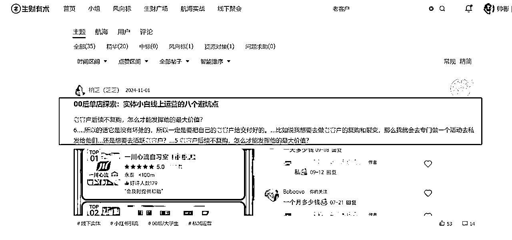

点击进去更精彩

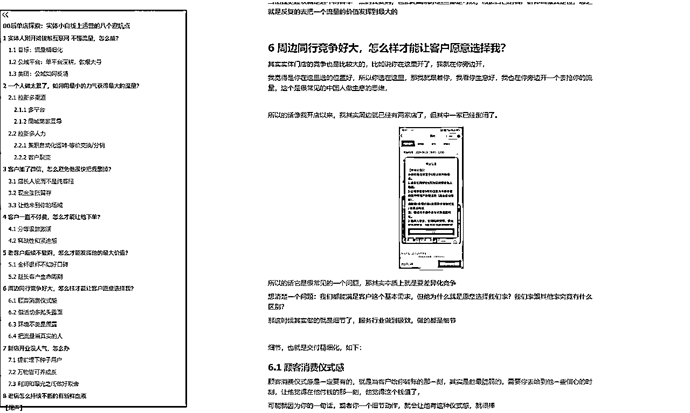

某圈友疫情期间，用快团团卖牛肉，做到上海地区评分前列。

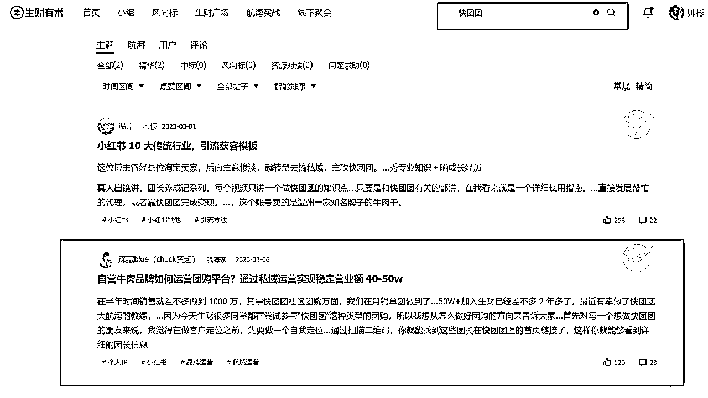

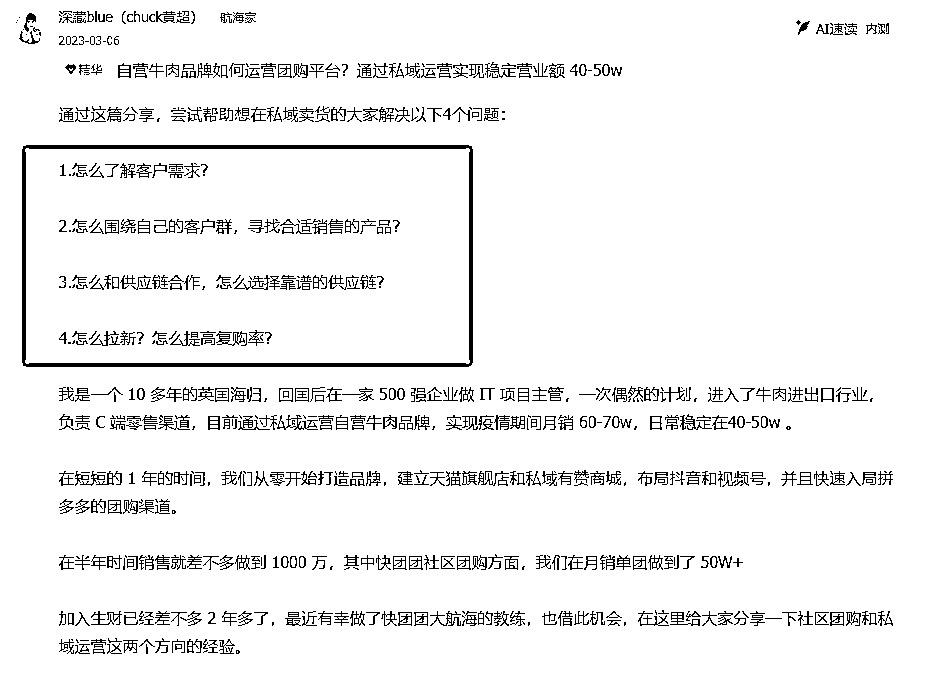

某圈友在四五线城市的连锁烘焙门店，通过从 0～1 搭建私域体系，让每月营业额增长了 50w+。

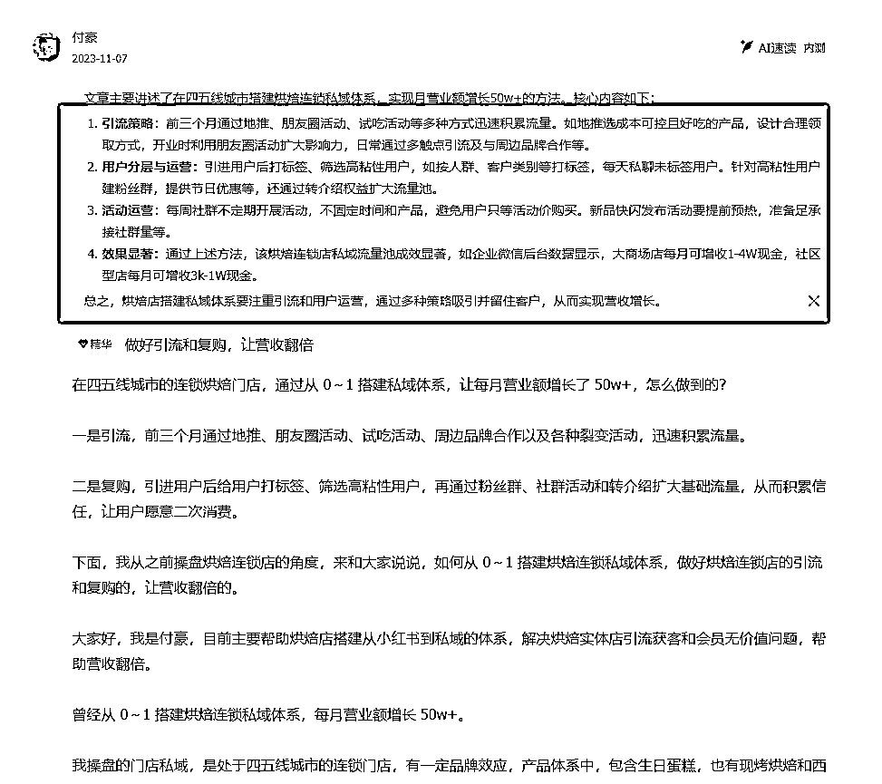

2）我通过举一反三，在生财分享我的卖蟹经历，积极的链接同频的圈友，在加入生财有术后思维和大闸蟹的复购率都得到了相当高的提升，思维上从服务好客户变成了和客户做朋友。

生财的精华帖，本质是“已验证的赚钱模型”，你缺的只是“适配自己业务的微创新”。

先赚“第一块钱”，再谈天花板

### 2.用航海实战逼你下场

1）去年我参加“IP 朋友圈运营”航海，目标是“21天跑通引流-转化-复购闭环”。

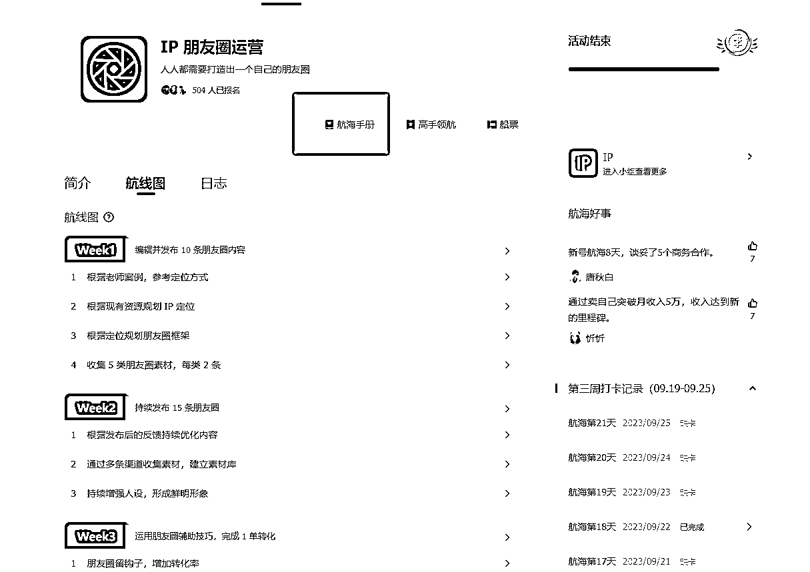

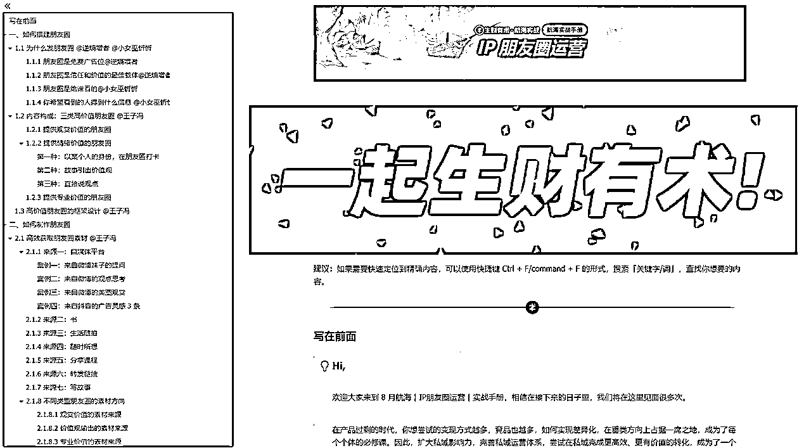

2）航海期间，群内每天同步数据、复盘问题，甚至有圈友帮我优化了朋友圈话术。

3）最终我的私域成交率从5%提升到12%，还对接了2个快团团帮卖资源。

4）这次航海让我知道了如何真正的去做一个真实的人，往大了说就是真实的IP，并且能否给我的客户提供价值。

航海的意义，是让“想赚钱”变成“真行动”。

加入航海，下场才能破局 ,航海的最大价值，是有人逼你“从想到做”。

### 3.用链接放大资源杠杆

1）我通过生财书写龙珠贴认识了生财做个人IP的圈友，我付费向他学习，打造了生财有术共学群+大闸蟹代理的模式。将我互联网付费的课程共享给群里的圈友，大家每天在一起讨论如何更好的做好私域电商，在群里共同生财有术。

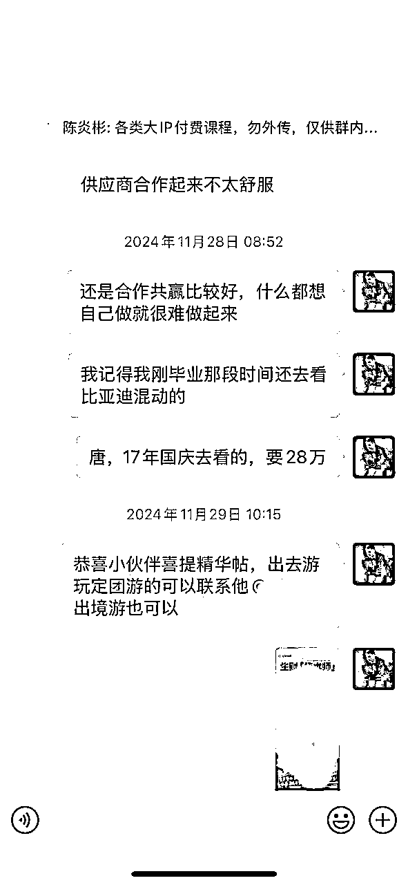

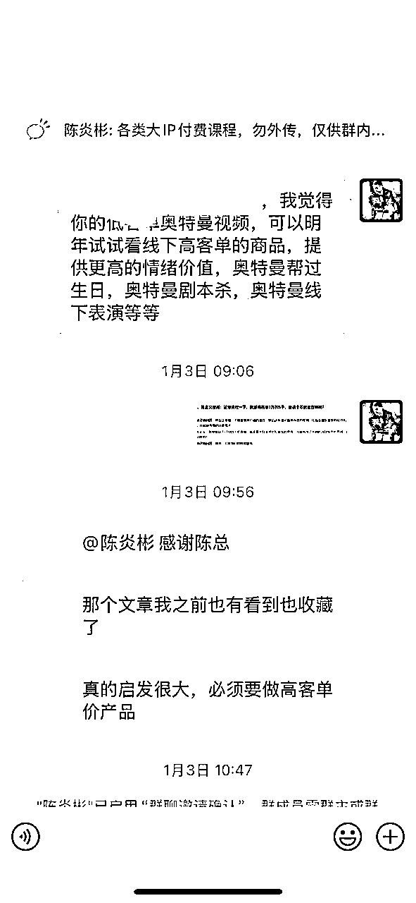

2）通过生财官方的微信群，认识了常州老乡，合作了户外瑜伽+户外烧烤+清蒸大闸蟹模式，让瑜伽和大闸蟹相结合，增强了生财圈子里面的传播范围，让家乡的大闸蟹名气越来越高。

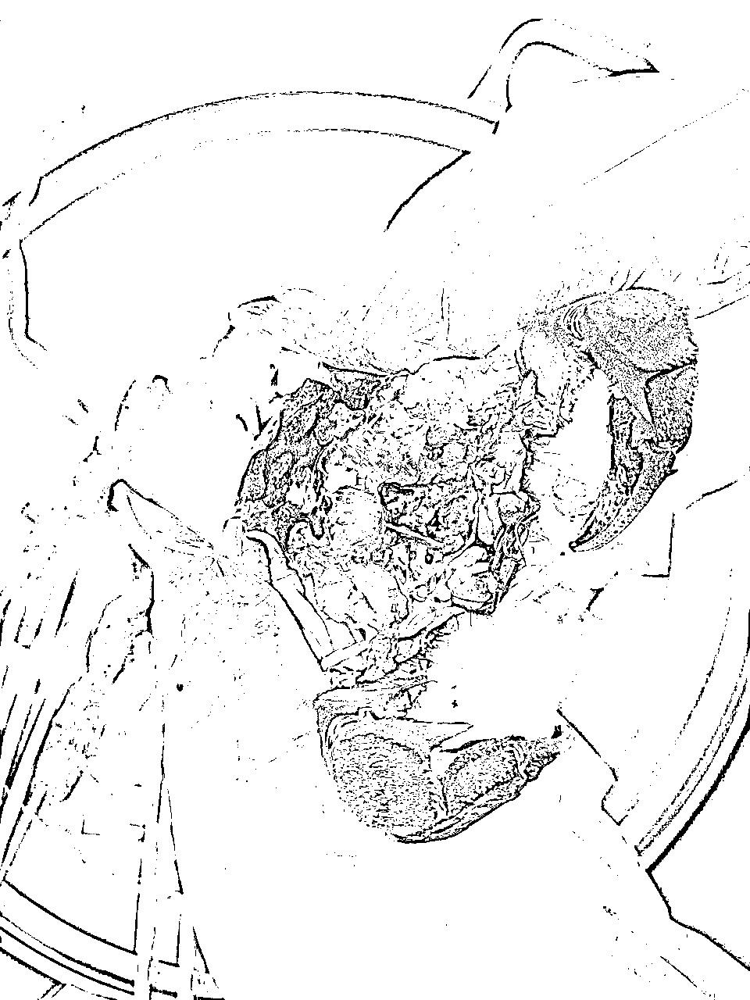

在生财，人脉不是“加个微信”，而是“你能帮别人解决什么问题”。

作为体制内工作者，或许习惯了稳定的节奏，但内心始终藏着一团火——想用副业证明自己的价值，甚至突破收入天花板。

我已迈出关键一步：通过大闸蟹电商和私域获客赚到第一桶金。但如何从“月入过万”到“规模化增长”？如何避开内卷红海，找到差异化的生财机会？

生财有术的答案很简单：用对资源，跟对人，做对事。

## 2.体制内+副业，如何借力生财？

我的主业是“铁饭碗”，副业是“高风险高收益”，而生财帮我找到了平衡点。

### 1.轻资产启动：从“信息差”切入

1）大闸蟹赛道竞争激烈，但我发现“高端定制市场”仍有空白。

2）参考生财中《小众品类暴利打法》，我主推“企业定制礼盒”，特点是激光打印，UV彩打，定制版礼盒，客单价从200元拉到800元，利润率超28%。

赚钱的本质是“满足需求”，而非“自我感动”。

### 2.私域精细化：用“标签”提效

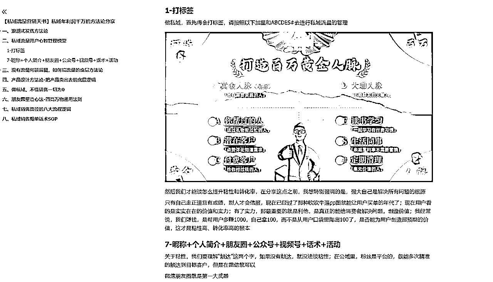

1）过去我的客户混在一个群里，转化率极低。后来按生财《私域标签管理SOP》，把客户分为：

*   企业采购（需求：发票、定制）

*   家庭用户（需求：优惠、赠品）

*   代理（需求：佣金、独家政策）

2）针对性运营后，单客户年消费从500元增至3000元。

### 3.资源整合：抓住“不对称机会”

1）生财圈友分享过，小资源聚合形成大竞争优势。

2）我联合很多圈友推出228元“断脚蟹套餐”，用他们的流量池引流，给圈友10%的提成，后续复购皆有10%的提成。在中低消费端占据一席之地，开展农村包围城市的策略。

## 3.写在最后

生财有术不是“金矿”，而是“地图” —— 有人用它挖到宝藏，有人抱怨地图不准。

区别只在于：你是否愿下场，是否肯死磕。

如果你也想：

*   用业余时间多赚一份收入

*   避开“单打独斗”的坑

*   抓住时代的新红利

4月18日，加入生财有术，用一年时间，和万名实战派一起，把“想法”变成“结果”。

毕竟，“看见”机会的人很多，“抓住”机会的才是赢家。