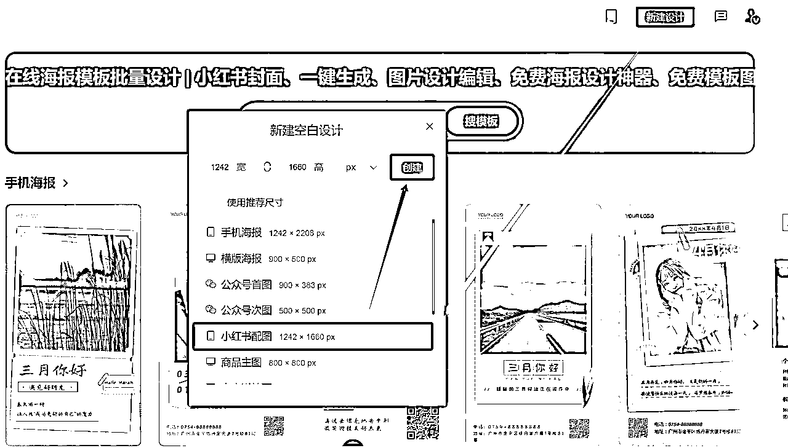
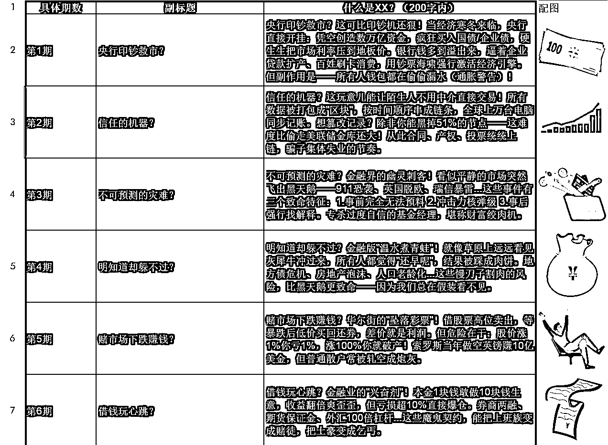

# 4步解锁，AI小红书爆文量产秘诀！（案例+保姆级教程+工具）

> 来源：[https://i23vi4cvyf.feishu.cn/docx/OcwrdGRrAoKZEsxuT98crImpnwf](https://i23vi4cvyf.feishu.cn/docx/OcwrdGRrAoKZEsxuT98crImpnwf)

大家好，我是晓智！专注 AI 写作、绘画、海报的炼丹家AI 工具作者。

发现好多朋友都是已经掌握了各种批量提效技能，但在内容创作上还是头疼，投入精力时间测作品，经常又没好的数据反馈...试试换个方向，同样的创作技巧，可能就事半功倍了！

本篇我会分享如何在小红书找到合适的内容方向、DeepSeek输出选题及内容、炼丹家设计批量制作小红书封面及配图，让大家都能掌握【更省时间、降难度、显效果】的本领。

# 正篇开始！

根据近期我对批量小红书封面的对标调研，发现有一类方向，几乎是通过同一种技巧生成的内容，那么只需要找到热门的细分定位，做小红书就很轻松了。

打开小红书APP，直接搜“每天学点”，能直观看到热度排行榜。

例子①金融类【高赞、热门、高效】，已发布198篇图文笔记，有了17.2万粉丝，获赞跟收藏量高达42.1万，基本上篇篇都是高赞笔记。

例子②心理学类【快速吸粉、高互动】，仅发布36篇图文笔记，就吸引了17.2万粉丝（真巧，跟上面一样，我自己都觉得看懵了还确认了下），获赞跟收藏量高达19.4万，近期百赞千赞更是常有的事。

例子③养生类【持续输出、高收藏】，已发布201篇图文笔记，拥有1.9万粉丝，获赞跟收藏量高达41.6万，同样几乎都是高赞笔记。

不要局限在“技术牛逼无敌”的思维里，运营视角也同样重要。

科普、材料类的素材，用户互动数据高，很容易上热门推荐。

接下来，

我将用四步教学如何批量制作“例子①金融类”吸睛图文，

其他都是触类旁通的。

# 用到的工具有：

①炼丹家AI（接入DeepSeek R1）：https://www.liandanjia.com/

②炼丹家海报：https://poster.liandanjia.com/

# 实操步骤目录：

①批量生成选题。②生成对标风格文案。③批量生成笔记封面。④批量生成笔记内页配图。

文章较长细节多，建议收藏后慢慢看哈！

# 第一步：批量生成选题

首先，根据对标的赛道，利用炼丹家AI批量生成选题。

打开AI工具，输入指令，

> 请帮我列举50个最热门的金融词汇，以表格输出。表格格式有三个字段，字段一：具体期数（第1期到第50期），字段二：金融词汇（中文），字段三：对应金融词汇的副标题（10个字以内，吸睛描述，例如：到底是什么？）。

我们把50个选题相关内容，直接复制进“Excel文件-金融”存起来。

注：①炼丹家AI对话有默认上下文关联长度，需要可以到“对话设置”里把长度调至最高 100000 token，避免AI输出中途因为上下文关联长度受限就不回复了。

②这里可能有些朋友会遇到文本表格复制到Excel中内容会被分成多行的问题，是因为文本中带了手动换行符或者回车符导致，解决方法可以是复制内容到word中把手动换行符（^l）以及回车符（^p）都替换成文档中没有的字符或字符串，复制到Excel之后再把替换的字符或字符串替换成换行符或回车符就可以恢复了。

③建议用WPS表格去新建、保存，兼容性好。

# 第二步：生成对标风格文案

举例两个高效方法，一个是让AI根据你提供的对标文案进行风格学习，然后结构表格形式输出上面50个金融词汇的选题内页文案。

打开AI工具，输入指令，

> 请根据我接下来提供的文案，你将对其结构和特点进行深入分析总结，分析过程无需输出。分析完成后，请我指定一个选题，你将根据刚刚分析的文案风格，创作一篇全新的内容。我提供你要学习的文案内容为：xxx

AI学习分析完成后，让它按我们选题输出，确认风格效果。

注：炼丹家AI，上下文联系按钮默认开启，没开记得打开。

感觉效果还不错，就把其他选题相关一次性发给AI（注：这里举例发送10个），按结构表格形式一并创作输出。

打开AI工具，输入指令，

> 请按顺序帮我把“xxx、xxx、xxx...”金融词汇及对应副标题选题进行刚刚分析学习的风格输出文案，以表格输出。表格格式有三个字段，字段一：金融词汇（中文），字段二：什么是xx？（字数200以内），字段三：举个例子（字数200以内）。

这输出质量跟效率真的很棒！直接把需要的复制进“Excel文件-金融”存起。

还有另一个便捷方法，是让AI根据上面输出的50个金融词汇及副标题，按照我们要的文案结构风格，延伸输出。

打开AI工具，输入指令，

> 请根据我提供的主题”做空 赌市场下跌赚钱？”，按照以下文案结构进行分析输出：①什么是做空？：解释做空/赌市场下跌赚钱？的概念，200字以内。

②举例说明：直观清晰、准确，200字以内。

内容风格关键点：结构（分点+例子）、语言风格（口语化、俚语、互动等）、内容要素（定义、杠杆解释、盈亏计算、风险警示等）。

确认符合内容要求后，让AI将刚刚的选题都展开输出对应内页文案，最终以表格形式处理给我。

打开AI工具，输入指令，

> 请按顺序帮我把刚刚50个金融词汇及对应副标题选题，进行上面定义的文章结构风格以表格输出。表格格式有三个字段，字段一：金融词汇（中文），字段二：什么是xx？（字数200以内），字段三：举个例子（字数200以内）。

注：举例的两个方法，我分别用的两个对话窗口实操，避免太多数据混乱在一块，影响AI输出质量、准确度。

# 第三步：批量生成笔记封面

打开炼丹家海报，可以选择右上角新建设计 - 小红书配图（1242x1660）

先简单设计一个适合的封面模板，这里我们可以在模板 - 小红书封面，找到一个很适合的风格做一部分调整，接着点击上方批量套版设计。

进入炼丹家设计批量设计器中，选择需要替换项，点击下一步。

注：①这里展示文字、图片全部支持批量化替换的操作。

②如果跟表格参数顺序不同，替换会乱，这里优先考虑到海报编辑里，调整图层优先级，其次再考虑调整表格排序。

考虑到也有批量更换图片的需求，一样很简单，我就一块做进教程里。

下面是通过刚上面整理的“Excel文件-金融”表格文件，把我们封面需要的信息做筛选，再加上带图片后的格式,新表格文件保存名为“Excel文件-封面元素”。

注：①图片需要在表格中，选择嵌入到单元格，才是正常对应上的格式。

②不用奇怪为啥我表格有黑色背景，不影响使用。

支持导入Excel表格，选择追加新数据或全量覆盖数据，这里表格内格式就是我们刚刚对应行列整理好的“Excel文件-封面元素”；不清楚格式，也可以先选择导出为Excel表格，按对应内容格式把新的整理进去，再导入Excel。

我们选择刚刚编辑好的“Excel文件-封面元素”表格导入，只要符合对应结构即可完成关联数据，十分方便！

注：①表格内，如果每行部分有数据，部分没有，就有可能出现点击替换一直转圈圈，正常操作都是秒执行。

②表格内，如果有富文本格式，导入后可能会出现部分[object Object]不兼容的情况，可以在表格内提前对数据进行清楚格式，再导入。

确定内容数据没问题，点击生成批量套版作品，会进入最终的样式编辑页，不调整就点击右上角下载作品，勾选上全部需要的画板即可。

轻轻松松，11个笔记就快速做完啦，无论多少个其实都是一样操作！

# 第四步：批量生成笔记内页配图

步骤基本跟第三步一致，我快速过一下，打开炼丹家海报，选择右上角新建设计或预先准备的笔记内页模板，排个版，再点击左上角批量套版设计。

进入炼丹家设计批量设计器中，选择需要替换项，点击下一步。

用刚上面整理的“Excel文件-金融”表格文件，把我们笔记内页需要的信息做筛选,新表格文件保存名为“Excel文件-笔记内页元素”。

点击导入“Excel文件-笔记内页元素”表格，接着选择全量覆盖数据。

确定内容数据没问题，点击生成批量套版作品，会进入最终的样式编辑页，不调整就点击右上角下载作品，勾选上全部需要的画板即可。

这样笔记内页配图笔记，也瞬间搞定啦！

注：①提升笔记素材质量方面，还可以对海报上图文元素做细分排版、设计，让AI对资料做对应分类，再批量替换设计输出。

②相信大力出奇迹，很多高质量也是慢慢堆量、迭代出来的！

以上四步，利用AI高效批量生产图文笔记，特别适合风格统一的爆款流量图文账号，提效起来不要太舒服啦！

小红书平台，此类性质内容越容易让用户互动反馈，就越能推向更高的流量池。

注：小红书的评分体系，叫作：CES=点赞数（1分）+收藏数（1分）+评论数（4分）+关注数（8分），笔记分数越高，排名越靠前。

# 举例一些金融新媒体变现方式：

带货金融书籍：躺着也能赚佣金

小红书的带货功能简直是个宝藏，只需挂上金融类书籍的链接，用户一旦通过你的链接下单，佣金就自动进账。选书也是门学问，得挑那些热门、经典或者自带话题的，比如《穷爸爸富爸爸》、《聪明的投资者》，这类书总能戳中理财小白的心。

金融知识付费：变现新风口

卖笔记、卖课程：如果你对金融知识有独到见解，不妨把学习笔记、思维导图、投资策略整理成付费内容。比如：《2025年必学的5大金融投资策略》《如何用30分钟掌握一个金融概念？我的高效学习秘籍》

社群变现：私域

建个金融投资社群，收取会员费，定期分享投资心得、深度解读市场动态，甚至搞个线上投资研讨会，边学边聊，氛围热烈的同时，也是在建立信任！

小红书商单：接金融广告

当粉丝数量达到一定规模后，借助蒲公英平台接金融类广告，实现流量变现。还有加入专业机构也是一条捷径。机构的优势在于广告资源丰富，而且手续费比小红书平台更低。

注：跟钱近的，真都好赚钱，我近期调研案例都看到好多支某宝、某团黑钻会员等投放图文广告。

卖号：简单粗暴

如果你的账号已经积累了一定数量的金融类粉丝，卖号也是个不错的选择。直接将账号转让给有需求的金融公司或个人，既能快速变现，又能省去后续运营的麻烦。

# 最后

AI时代，无论是做什么，我们都将不断学习和实践，找到适合自己的高效运营方式。

助大家都能轻松做流量，副业搞钱就不再是遥不可及！

都到这里啦，记得点赞、在看、转发，因为我需要您的反馈。

小手一赞，年薪千万！！！