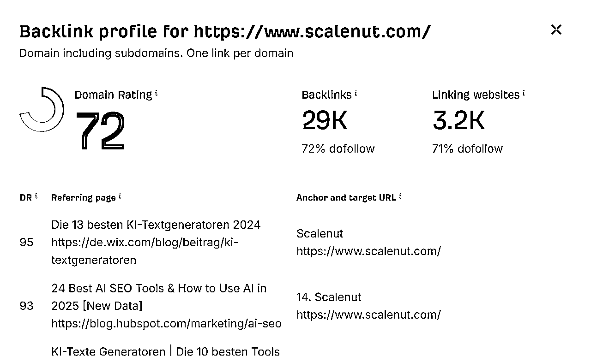
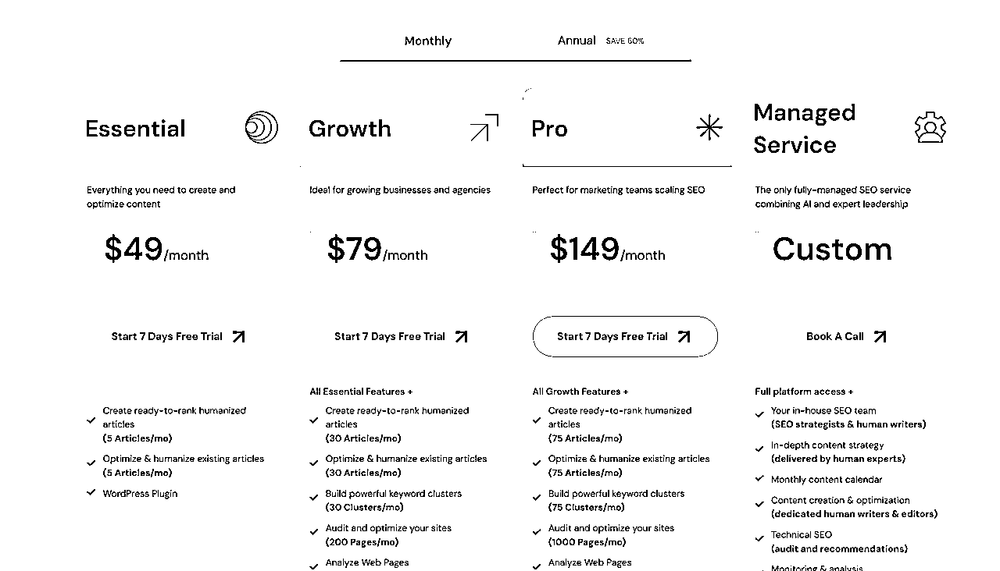
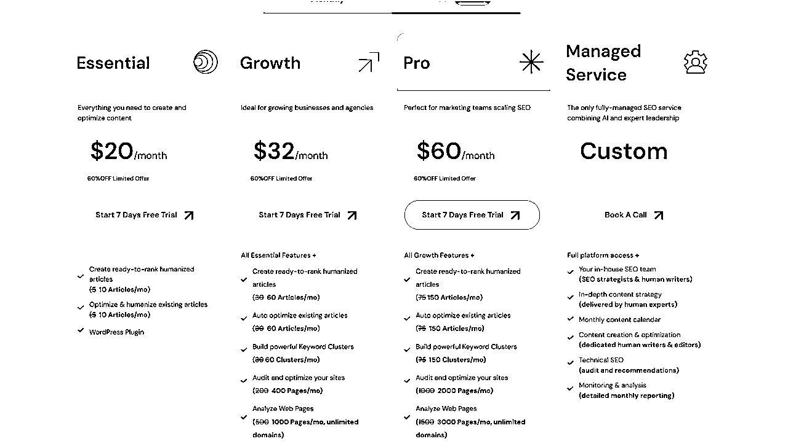

# 497 Scalenut

> 来源：[https://vz1gcav68m.feishu.cn/docx/NFAXdQRwmoWFdUxh9qmcgMFCnZU](https://vz1gcav68m.feishu.cn/docx/NFAXdQRwmoWFdUxh9qmcgMFCnZU)

# 更新日志

## 2025-04-15

*   Toolify 有产品是没有收录的，可以和其他的产品榜单交叉去看；

*   这些优秀的产品，没法模仿，只能学习。

*   最近分析的几个产品，MRR 并不是很高，从产品复杂程度完全不成正比；

*   最关键的，这几个产品都是AI SEO 相关的，这不是打自己的脸吗？

*   这几家公司都有面向B端用户，这不是收入不太好预估；

# 基本信息

## 产品链接

## Loading Page

## 流量

### 基本信息

### 外链

## 竞对产品

https://www.scalenut.com/comparisons

*   Surfer seo

*   clearscope

*   Jarvis ai

*   frase

# 产品分析

## 💡 产品价值：这个 SaaS 产品解决了什么核心问题？

*   核心问题与价值： Scalenut 旨在解决内容创作者和营销人员在高效创建高质量、且符合 SEO 标准的长篇内容时面临的核心挑战。传统的内容创作流程往往涉及多个分离的步骤和工具：关键词研究、竞争对手分析、内容大纲撰写、内容写作、SEO 优化、内容审核等，这个过程既耗时又复杂。Scalenut 通过将 AI 驱动的内容创作（利用 GPT 等大型语言模型）与先进的 SEO 数据分析（如 NLP 关键词提取、SERP 分析、竞争对手内容结构分析）整合到一个平台中，显著提高了内容生产的效率和最终内容的搜索引擎排名潜力。其核心价值在于：

1.  节省时间: 大幅缩短从主题构思到发布就绪内容所需的时间。

1.  提升内容质量与 SEO 效果: 通过数据驱动的建议，帮助用户创作出更全面、更相关、更易于排名的内容。

1.  简化工作流程: 将多个工具的功能集成于一体，减少在不同工具间切换的麻烦。

1.  规模化内容生产: 使团队能够更轻松地产出大量符合标准的内容。

*   细分市场： Scalenut 属于 AI 驱动的内容营销平台 (AI-powered Content Marketing Platform) 和 SEO 内容优化软件 (SEO Content Optimization Software) 的细分市场。它与 Jasper (原 Jarvis)、Copy.ai 等 AI 写作工具竞争，也与 Surfer SEO、Frase.io、Clearscope 等侧重 SEO 内容优化的工具有交集和竞争。Scalenut 的特点在于试图更紧密地融合这两者。

## 👤 目标用户：这款产品的典型用户是谁？

*   典型用户特征： Scalenut 的目标用户主要是那些需要持续产出高质量、以获取自然流量为目的的内容的个人和团队。具体包括：

*   内容营销人员 (Content Marketers): 需要规划、创建和优化博客文章、网站页面等内容以驱动营销目标。

*   SEO 专家/经理 (SEO Specialists/Managers): 负责提升网站的搜索引擎排名，需要工具来研究关键词、分析竞争对手并优化页面内容。

*   营销机构 (Marketing Agencies): 为客户提供内容创作和 SEO 服务，需要高效的工具来管理多个项目和交付成果。

*   博主/自媒体人 (Bloggers/Publishers): 依赖内容吸引读者和流量，寻求提高写作效率和内容排名的方法。

*   自由撰稿人 (Freelance Writers): 希望提升向客户交付内容的价值和效率，特别是需要 SEO 优化服务时。

*   中小企业主/市场部 (SMB Owners/Marketing Teams): 内部资源有限，需要一个多合一的工具来处理内容和 SEO 需求。

*   用户群体细分：

*   初学者/个人用户: 可能更看重易用性、AI 写作辅助和基础的 SEO 指导功能（对应其较低价格套餐）。

*   专业营销人员/SEO 人员: 更关注高级 SEO 功能、竞争分析深度、内容优化评分的准确性以及 AI 定制能力（对应中高价格套餐）。

*   代理机构/大型团队: 除了功能深度，还会关注协作功能、用户席位数量、API 接口、批量处理能力以及客户管理相关功能（对应最高价格套餐或定制方案）。

## 🤔 用户需求：用户为什么需要这个产品？痛点是什么？

*   用户的痛点 (没有 Scalenut 时)：

1.  工具碎片化与低效: 需要在关键词研究工具 (如 Ahrefs, Semrush)、AI 写作工具 (如 Jasper)、SEO 优化检查器 (如 Surfer SEO)、抄袭检测工具、内容编辑软件之间来回切换，数据和流程不连贯，效率低下。

1.  内容构思与大纲困难: 确定写什么、如何组织内容结构，特别是针对 SEO 目标时，需要花费大量时间研究 SERP（搜索引擎结果页）和竞争对手，手动整理耗时费力。

1.  SEO 优化盲点: 单纯的 AI 写作工具可能无法生成符合特定关键词优化要求的内容；而传统的 SEO 工具又不直接辅助写作。如何确保内容既有创意又满足技术性 SEO 要求是个难题。

1.  内容质量与深度难以保证: 快速产出内容可能导致深度不足或未能覆盖用户搜索意图的关键点，影响排名和用户满意度。

1.  规模化生产瓶颈: 依靠纯人工或分离的工具链，很难在保持质量的同时大规模地产出 SEO 友好的内容。

*   Scalenut 如何满足需求：

1.  集成化平台: 将关键词研究、NLP 分析、AI 写作、内容优化评分、抄袭检测等功能整合，提供一站式解决方案。

1.  自动化内容规划: 提供如 "Cruise Mode" 这样的引导式工作流，自动分析 SERP、提取关键术语、生成内容大纲建议，简化规划过程。

1.  AI + SEO 协同: 其 AI 写作功能紧密结合 SEO 分析结果，旨在生成既流畅可读又包含关键优化元素的内容。实时优化评分提供明确指导。

1.  提升内容全面性: 通过分析排名靠前的竞争对手内容和 NLP 关键术语，帮助用户创建更全面、更深入的内容。

1.  加速内容生产: AI 辅助写作和结构化流程显著提高了内容的产出速度。

## 🗣️ 用户评价：用户如何评价这款产品？（好评与差评）

*   主要优点 (综合 G2, Capterra 等评测网站信息)：

*   多合一功能强大: 用户普遍称赞其整合了内容研究、写作和 SEO 优化的能力，节省了购买和学习多个工具的成本和时间。

*   SEO 功能深入: 特别是 NLP 关键术语提取、竞争对手分析和内容优化评分功能受到好评，认为对提升内容排名有实际帮助。

*   "Cruise Mode" 引导模式: 被许多用户认为是亮点，极大地简化了从关键词到完整初稿的流程，尤其适合快速启动内容项目。

*   AI 写作质量尚可: AI 生成的内容被认为是一个不错的起点，可以节省大量基础写作时间，尽管仍需人工编辑。

*   性价比: 相较于分别订阅顶级的 AI 写作工具和 SEO 内容优化工具，Scalenut 通常被认为提供了不错的价值。

*   客户支持: 部分评论提到其客户支持响应及时且有帮助。

*   主要缺点或抱怨 (综合 G2, Capterra 等评测网站信息)：

*   AI 输出仍需大量编辑: 和所有 AI 写作工具一样，生成的内容可能存在事实错误、重复性、缺乏深度或独特的观点，需要用户进行大量的人工修改和事实核查。

*   学习曲线: 虽然有 Cruise Mode，但平台功能较多，部分高级功能（如自定义 AI 指令、深度 SEO 分析）需要一定的学习时间才能熟练掌握。

*   用户界面 (UI/UX): 部分用户认为界面有时会显得有些复杂或不够直观，特别是对于新手。

*   偶发性 Bug 或性能问题: 有用户报告遇到过平台运行缓慢、功能出错等技术问题。

*   功能限制: 相比于市场领导者，某些单点功能可能不够强大（例如，其关键词研究数据库可能不如 Ahrefs/Semrush 全面，AI 写作的灵活性可能不如 Jasper）。

*   信用点数限制: 像许多同类工具一样，其定价基于信用点数（如 AI 字数、报告数量），部分用户觉得额度不够用或对消耗规则感到困惑。

*   信息来源示例：G2 (截至 2025 年 4 月有超过 350 条评价，综合评分约 4.7/5), Capterra (超过 300 条评价，综合评分约 4.7/5)

## 🔍 获客渠道：它是如何找到用户的？

Scalenut 采用了多元化的获客策略，侧重于数字营销渠道：

*   内容营销 (Content Marketing) & SEO: 这是他们的核心策略之一。Scalenut 拥有一个活跃的博客，发布大量关于内容创作、SEO、AI 营销等主题的文章和指南，旨在吸引有机搜索流量。他们自身的产品就是用来优化这类内容的，因此他们非常注重通过高质量内容实践自己的价值主张，争取在相关关键词（如 "AI content generator", "SEO content optimization", "content brief template" 等）上获得良好排名。

*   联盟营销 (Affiliate Marketing): Scalenut 拥有一个积极的联盟计划。许多评测网站、YouTube 频道和营销博客都在推广 Scalenut，并在评测和教程中加入联盟链接。这是 SaaS 产品，特别是工具类产品常用的获客方式。

*   付费广告 (Paid Advertising): 很可能在 Google (SEM) 和社交媒体平台（如 LinkedIn, Facebook）上投放广告，目标是那些搜索相关解决方案或符合其目标用户画像的用户。

*   社交媒体营销: 在 LinkedIn、Twitter 等平台保持活跃，分享产品更新、行业见解、用户成功案例等，与潜在用户互动。

*   产品评测网站: 在 G2, Capterra, TrustRadius 等平台建立良好的口碑和可见性，这些平台是许多 B2B 买家决策过程中的重要信息来源。

*   AppSumo 等 Lifetime Deal (LTD) 平台 (可能早期使用): 许多 SaaS 初创公司会通过在 AppSumo 等平台提供限时终身或大幅折扣的交易来快速获取早期用户、现金流和市场反馈。虽然 Scalenut 现在已较为成熟，但早期可能利用过此策略。(需要进一步核实其是否上过 AppSumo)

*   口碑推荐: 随着用户基数的增长和满意度的提升，现有用户推荐成为自然的增长渠道。

依据: 其官网有活跃的博客和资源中心；搜索 Scalenut 评测会发现大量带有联盟链接的文章和视频；在 G2/Capterra 等平台有显著存在；这是此类 SaaS 工具常见的增长模式组合。

## 💰 商业模式与收入：它如何赚钱？盈利状况可能如何？

*   商业模式: Scalenut 采用典型的 SaaS 订阅制 (Subscription-based) 模式。他们很可能提供 免费试用 (Free Trial) 或有限功能的 免费计划 (Free Plan) 来吸引用户体验，然后通过 分级付费套餐 (Tiered Pricing) 进行变现。

*   定价套餐 (基于官网信息，可能随时间变化): 通常会提供多个套餐，例如：

*   Essential/Individual: 针对个人用户或小型团队，提供基础功能和较低的 AI 字数、SEO 报告额度。价格可能在 $20-$40/月区间（年付更低）。

*   Growth: 针对成长型团队和营销人员，提供更多额度、更多用户席位以及像 "Cruise Mode" 这样的核心功能。价格可能在 $40-$80/月区间。

*   Pro: 针对大型团队、机构和需要高用量的用户，提供最高的额度、更多高级功能（如抄袭检测、团队协作）、优先支持等。价格可能在 $80-$150+/月区间。

*   Enterprise: 为大型企业提供定制化的解决方案、API 访问、专属客户经理等，价格通常需要联系销售获取。

月付：

年付

*   收入估算 (MRR/ARR):

*   估算方法: MRR ≈ 网站月访问量 (Monthly UV) × 平均转化率 (Visit-to-Paid Conversion Rate) × 平均每用户月收入 (ARPU)。

*   数据假设与依据:

*   网站月访问量 (UV): 根据第三方工具（如 Similarweb，数据可能有波动和误差）的公开估算，假设 Scalenut.com 近期的月访问量在 11万 / 2 左右。（声明：此数据为公开估算值，仅供参考，需访问 Similarweb 等工具获取最新估算，且实际内部数据可能不同）。

*   平均转化率: SaaS 行业从网站访问到付费用户的转化率差异很大，通常在 0.5% 到 2% 之间。对于有免费试用/计划的工具型 SaaS，且市场竞争激烈，我们保守估计一个 1.0% 的转化率。

*   平均每用户月收入 (ARPU): 查看其定价，中端套餐 (Growth) 大约在 $60-$80 左右。考虑到有低价套餐和高价套餐，以及年付折扣，我们可以估算一个平均 ARPU 为 $65/月。

月付ARPU = (49 * 30% + 79 * 30% + 149 * 30% + Custom(1000) * 10%) =183.1

年付ARPU = (20 * 30% + 32 * 30% + 60 * 30% + Custom(1000) * 10%) = 133.6

根据各自一半进行估算 = (183.1 + 133.6) / 2 = 158.35

*   估算结果:

*   MRR ≈ 55,000 (UV) × 1.0% (Conversion) × $158.35 (ARPU) = $8.70925 万

*   ARR ≈ $8.70925 万 (MRR) × 12 = $104.51100万

根据22 年报道，未来要做到 ARR 1000万，在根据当时的流量估算，使用上面的ARR 可以推出 当时的 22年的ARR 是 400 - 500 万之间，那么可以看的出来上面的ARR算是合理 范围。有待进一步考证

*   重要提示: 这只是一个基于公开数据和行业基准的极其粗略的估算，实际收入可能与此相差巨大。 影响因素众多，包括真实流量、转化率、ARPU、客户流失率 (Churn)、不同区域定价、企业客户收入占比等。

*   融资信息: 根据公开信息（如 Crunchbase），Scalenut 在 2022 年初宣布完成了 400 万美元的种子轮融资，由 Titan Capital 和 Saama Capital 领投。(来源：Crunchbase, TechCrunch 等科技媒体报道)。后续可能还有未公开的融资。盈利状况未知，早期 SaaS 公司通常优先考虑增长而非盈利。

## 🧠 学习借鉴：我从这个产品身上学到了哪些值得借鉴的点？

*   深度整合解决复杂流程: Scalenut 成功地将 AI 写作和 SEO 优化这两个原本可能分离的领域深度整合，直接解决了内容创作者的核心痛点，而不是仅仅提供单点工具。这种“工作流即产品”的思路值得学习。

*   引导式用户体验创新 (Cruise Mode): 对于一个功能复杂的平台，通过一个结构化、分步骤的引导模式 (Cruise Mode) 来降低用户上手门槛，同时保证输出质量，是一个非常聪明的用户体验设计。

*   明确的价值主张和目标用户定位: 产品清晰地定位于“加速创建有排名的内容”，直接命中目标用户（内容营销和 SEO 人员）的 KPI 和痛点。

*   利用内容营销实践自身价值: Scalenut 自身就在积极使用内容营销和 SEO 来获客，这既是有效的增长手段，也向潜在用户证明了其产品的有效性（吃自己的狗粮）。

*   平衡功能深度与易用性: 虽然仍有提升空间，但 Scalenut 尝试在提供强大功能（如 NLP 分析）和保持相对易用性之间找到平衡点，这对复杂 SaaS 产品至关重要。

## 🚧 挑战与壁垒：分析该产品，有哪些做法是我难以复制或实现的？原因是什么？

*   技术壁垒:

*   高质量 AI + SEO 整合: 同时精通最新的 AI 模型（并进行微调适配）和复杂的 SEO 算法（需要持续追踪 Google 更新并进行数据分析）并将其无缝结合，需要顶尖的 AI 和 SEO 工程人才，技术门槛高。

*   实时数据处理与分析: 高效地爬取和分析 SERP 数据、竞争对手内容、进行 NLP 处理，需要强大的后端架构和数据处理能力，成本和技术复杂度都很高。

*   数据壁垒:

*   SEO 数据积累: 准确的 SEO 判断需要大量历史数据和持续的数据更新。后来者难以在短时间内积累同等规模和质量的数据。

*   用户行为数据 (潜在): 大量用户使用平台产生的数据，可能被用来反哺优化 AI 模型和 SEO 建议，形成一定的数据网络效应（虽然可能较弱）。

*   品牌与信任: Scalenut 经过一段时间的市场运营和用户积累，已建立了一定的品牌知名度和用户信任度。新进入者需要时间来建立声誉，尤其是在 AI 生成内容质量和 SEO 效果承诺方面。

*   先发优势与用户基础: 在 AI 内容+SEO 结合的赛道上，Scalenut 相对于更晚的进入者拥有一定的先发优势，已经获取了一批早期用户和市场份额。获取这些已被教育和服务的用户成本更高。

*   生态位竞争: 市场已经存在多个强大的竞争对手（Jasper, Surfer SEO, Frase 等），它们同样拥有技术、资金和品牌优势，新产品需要找到非常明确的差异化才能突围。

## 🤗 电梯演讲：如果我是产品创始人，如何用一句话向潜在用户推销它？

“Scalenut 是您的 AI 内容营销军师，能帮您在几分钟内完成从关键词研究到发布就绪、且针对搜索引擎优化的高质量内容，让您的内容创作速度提升 5 倍，排名更高！”

(这句话强调了目标用户痛点 - 速度慢、排名难，核心价值 - AI 驱动、SEO 优化、速度提升，以及最终收益 - 更高排名。)

## 🚀 创新机会：如果我做同类产品，可以有哪些差异化策略？

1.  极致垂直化/行业化:

*   策略: 专注于某个特定行业（如金融科技、医疗健康、法律服务、本地服务业），提供针对该行业术语、合规要求、内容模板和 SEO 特点的深度优化。

*   优势: 能更精准地解决特定行业用户的痛点，建立专业壁垒。例如，为医疗内容提供事实核查辅助和 E-E-A-T（经验、专业、权威、可信）优化建议。

1.  工作流/场景化:

*   策略: 不追求大而全，而是聚焦于内容营销工作流中的某个特定高痛点场景，并做到极致。例如，专门做一个“内容更新与重优化”工具，或者“程序化 SEO 内容生成”工具。

*   优势: 解决具体问题更深入，用户定位更清晰。

1.  增强 AI 的“思想性”与“独特性”:

*   策略: 研发或整合更先进的 AI 技术，不仅是生成文本，更能辅助生成独特的观点、数据洞察、故事叙述或品牌声音一致性。可能结合用户输入的企业知识库。

*   优势: 解决当前 AI 内容普遍存在的“平庸化”问题，提升内容的核心竞争力。

1.  更强的协作与项目管理:

*   策略: 围绕内容团队的协作流程进行设计，提供更强大的审阅、批准、版本控制、任务分配、内容日历等功能，使其成为内容团队的协作中心。

*   优势: 满足中大型团队和机构用户的管理需求。

1.  数据与效果追踪闭环:

*   策略: 更深度地整合 Google Analytics, Google Search Console 等数据源，不仅帮助创作，还能追踪发布后内容的实际表现（排名、流量、转化），并基于数据提供再优化建议，形成完整的 PDCA 循环。

*   优势: 让用户清晰看到内容投入的回报，增强产品粘性。

1.  定价模式创新:

*   策略: 探索更灵活的定价，例如基于最终内容表现效果付费（难度极高，但有想象力），或者提供更细粒度的按功能/用量付费选项。

*   优势: 可能吸引对传统订阅模式不满意的特定用户群体。

我的差异化方法是否可能比它更好地解决用户问题？为什么？

*   可能。 例如，“极致垂直化”策略能为特定行业用户提供 Scalenut 等通用工具无法比拟的精准度和效率，因为它更懂该行业的“语言”和规则。同样，“数据与效果追踪闭环”能解决用户“内容发出去了，然后呢？”的痛点，提供更完整的价值链。关键在于差异化策略是否真正击中了现有工具未被满足或满足得不够好的强需求。

## 🎉 可行性评估：我（或我的团队）有能力做出类似或改进的产品吗？

*   资源需求:

*   技术人才: 核心需要顶尖的 AI/NLP 工程师、熟悉 SEO 的全栈工程师、强大的后端架构师、经验丰富的 UX/UI 设计师。

*   资金投入: 早期研发、云计算资源（尤其是 AI 模型训练/推理和数据处理）、市场推广、团队薪资都需要大量启动资金（可能需要种子轮/天使轮融资）。

*   市场渠道: 需要建立有效的获客渠道，如内容营销能力、SEO 专业知识、销售能力（如果面向企业）或合作伙伴网络。

*   特定数据: 可能需要购买或合法获取高质量的 SEO 数据、网页数据，或针对特定行业的专业知识库/数据集。

*   资源匹配:

*   自我评估: 这需要您（或您的团队）进行诚实的自我评估。我们是否拥有或能够吸引到所需的技术人才？我们是否有融资渠道或足够的自有资金启动？我们是否具备市场推广和销售的能力？我们是否有获取关键数据的途径？

*   成本可承受性: 即使能获取资源，成本是否在可控范围内？SaaS 产品的研发和运营成本，尤其涉及 AI 和大数据时，通常非常高昂。需要仔细进行成本核算和财务预测。

结论: 从零开始做一个功能完全对标 Scalenut 的产品难度非常大，资源需求极高。但如果采取差异化策略，从一个更小的切入点开始，例如专注于某个细分领域或特定功能，可行性会相对提高，但依然需要核心的技术能力和一定的资金支持。

## 🧭 我的用户获取：如果我做这个产品，我将如何找到我的第一批用户？

基于差异化策略，选择一个相对低成本且精准的方式：

1.  聚焦利基社群: 如果选择垂直化策略，则深入该行业的线上社群（论坛、LinkedIn 群组、专业协会网站、Subreddits），积极参与讨论，分享价值，并在合适时机介绍你的解决方案。成为社群内的专家。

1.  内容营销 (精准切入): 创作高度针对性的内容，解决目标细分用户 最 痛苦的 具体 问题。例如，如果做法律行业的内容工具，就写“如何为律师事务所博客撰写符合 E-E-A-T 的文章”，并在文章中自然引荐你的工具。

1.  手动外展 (Manual Outreach): 精心挑选一小批（例如 50-100 个）最符合你理想用户画像的潜在客户（个人或公司），进行个性化的联系，提供早期试用机会，并争取深度访谈和反馈。

1.  建立等待列表/早期试用计划: 在产品正式上线前，通过一个简单的着陆页宣传你的核心价值和差异点，吸引感兴趣的用户注册等待列表。为早期用户提供特殊优惠（如折扣、终身权益的一部分）以换取他们的反馈和支持。

1.  利用个人网络: 向你认识的可能属于目标用户群体的朋友、同事或前同事介绍你的产品，寻求试用和推荐。

1.  参加小型线上/线下活动: 参与目标用户聚集的小型行业会议、网络研讨会或本地聚会，直接与潜在用户交流。

核心原则: 早期用户获取的关键是 精准 和 深度互动，而不是追求广度。目标是找到那些对你的差异化价值感受最强烈的“种子用户”，并与他们建立紧密关系，共同打磨产品。

## ✨ 我的优势：为什么是我来做？我具备哪些独特优势？

这需要您进行自我反思。以下是一些可能的优势方向：

*   行业背景: 我在 [某个 Scalenut 未深度覆盖的特定行业] 有多年的从业经验，深刻理解该领域用户的痛点、术语体系和内容需求。

*   技术专长: 我或我的团队在 [某项关键技术，如特定 AI 算法、大规模数据处理、特定领域的 NLP] 方面有独特的技术积累或创新。

*   现有资源/渠道: 我已经拥有一个相关的博客/社群/客户群，可以作为启动的基础。或者我在目标客户群体中有广泛的人脉。

*   独特的市场洞察: 我发现了一个 Scalenut 及其竞品都忽略了的重要用户需求或市场趋势。

*   成本优势: 我有能力以更低的成本获取关键资源（如人才、数据）。

*   执行力/学习能力: 我或我的团队拥有超强的学习能力和快速迭代的执行力，能够在竞争中快速适应和改进。

请您结合自身情况，思考并明确您的独特优势。 没有独特优势，在激烈竞争的市场中突围将非常困难。

## ❤️ 热情与坚持：我对这个领域/产品方向有足够的热情吗？

这是创业中最重要但也最主观的问题之一，只有您自己能回答。请扪心自问：

*   问题驱动: 我是否真的对帮助用户解决“高效创作高质量 SEO 内容”这个问题充满热情？即使这个过程充满挑战和挫败？

*   领域兴趣: 我对 AI、内容营销、SEO 这些领域本身是否抱有浓厚的兴趣，愿意持续学习和探索？

*   用户导向: 我是否愿意花费大量时间与早期用户沟通，倾听他们的抱怨和建议，并以此驱动产品迭代？

*   长期承诺: 我是否做好了心理准备，可能在至少半年甚至更长时间内都看不到显著的成果（用户增长、收入），但仍然能保持动力和投入？

*   韧性: 当遇到技术难题、竞争压力、用户流失、融资困难时，我是否有足够的韧性去克服它们？

如果以上大部分问题的答案是肯定的，那么您可能具备了创业所需的关键心理素质之一。 缺乏真正的热情，很难在漫长而艰难的创业旅程中坚持下来。