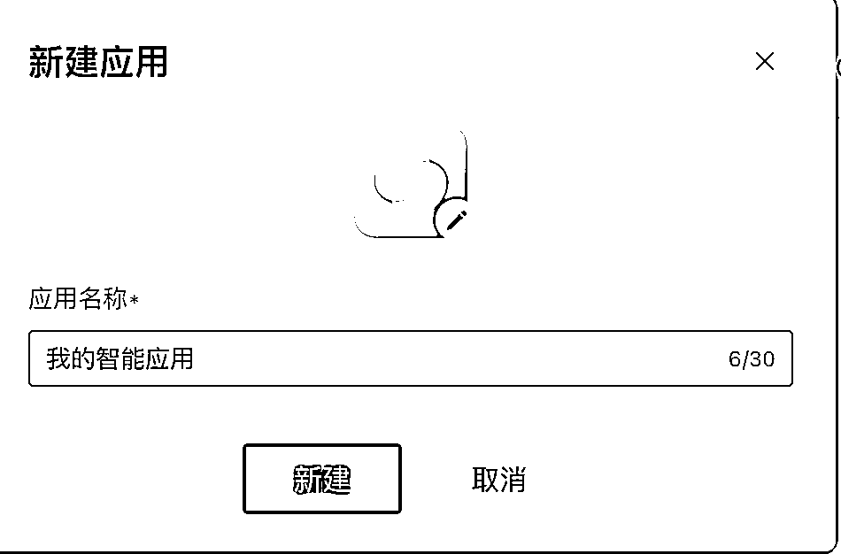

# 腾讯云大模型知识引擎的MCP上手指南

> 来源：[https://iik3odicycr.feishu.cn/docx/FHzldqyfXo3jogx6w07cSshPnnh](https://iik3odicycr.feishu.cn/docx/FHzldqyfXo3jogx6w07cSshPnnh)

## 什么是MCP

MCP（Model Context Protocol，模型上下文协议）是专为大语言模型（LLM）应用设计的开放协议，旨在实现LLM与外部数据源、工具的无缝集成。它通过统一的接口规范，将原本分散的API插件集成简化为“即插即用”的模式，如同AI领域的"USB-C接口"，解决传统API插件集成中存在的多协议适配、高开发成本等问题。对于企业和开发者来说，这意味着AI应用和Agent的边界将进一步拓展，开发门槛也进一步降低。

去年11月由Anthropic发布以来，MCP协议迅速吸引了技术极客与开发者的关注。开发者们将各种场景功能封装成MCP Server提供服务，探索协议落地的可行性。而今年3月，Manus的火热则掀起了新一轮关于协议标准的讨论。虽然Manus并未直接采用MCP协议，但这一应用让业界看到了多Agent协同的想象力。协同的核心就是标准协议。可以说，MCP协议的普及和落地，带来了Agent和大模型应用开发的新范式。

## 腾讯云大模型知识引擎支持MCP

4月14日，腾讯云宣布大模型知识引擎升级支持MCP协议，用户在搭建应用时，可以通过大模型知识引擎调用平台精选的MCP插件或插入自定义MCP插件。

目前，知识引擎平台已经精选了多款MCP Server，包括腾讯位置服务、腾讯云EdgeOne Pages、Airbnb、Figma、Fetch、微信读书等，涵盖各类专业信息获取、网页部署和预览、网页解析获取等场景。精选MCP插件之外，用户也可以按照 MCP协议配置已经部署的MCP SSE服务，在应用中灵活调用。

大模型知识引擎为企业和开发者提供了标准模式、工作流模式和Agent模式等三种开发方式，用户可以在工作流和Agent这两种模式中快捷使用MCP Server。在工作流模式下，用户可以自定义工作流来响应用户的需求，通过拖拉拽知识引擎的各种原子，编排所需的流程。而Agent模式则由大模型进行任务自主规划和工具调用，无需代码，几步即可开发一个智能体应用。

比如，用户可以利用腾讯位置服务MCP插件，搭建路线规划助手。在Agent开发模式下，点击添加MCP插件，即可根据需求添加腾讯位置服务的MCP工具。

## 实操腾讯云大模型知识引擎实现MCP

由于是在腾讯云平台操作，所以需要先完成一些前置准备

### 前置条件

腾讯云账号

预览中有实名认证指引，如果没注意，可以跳转：https://cloud.tencent.com/document/product/378/3629

开通大模型知识引擎

如账号没有额度赠送的情况下，需要购买对应的资源包

计费说明：https://cloud.tencent.com/document/product/1759/106152

购买页面：https://buy.cloud.tencent.com/lke


我这个是已开通的，没开通会有个开通提示，直接开通，点卡片进去。

https://lke.cloud.tencent.com/lke#/app/home

## 实操过程

在https://lke.cloud.tencent.com/lke#/plugin-center/home 插件页面，可以看到MCP插件。


来，我们跟着文档走一下这个流程。

点左边的应用或通过链接跳转https://lke.cloud.tencent.com/lke#/app/home




### 新建应用

输入说明。我这里有一个了。


点击图标切换agent模式，

### 设置提示词

我们搞个提示词

```
# 任务目标
作为天气查询小助手，你需要根据用户输入的城市名称，提供准确的天气查询服务，并针对查询结果给出相应的穿衣建议。

# 任务流程
1\. 使用GetWeatherInfo工具查询城市明天的天气信息
2\. 根据天气信息生成个性化的穿衣建议，包括符合温度的上衣、裤子、外套等着装建议，以及是否要带帽子、雨伞
3\. 按照以下要求输出天气信息
- 城市：<地点名称>
- 天气：<具体天气状况和温度>
- 穿衣建议：<具体的穿衣建议>
```

也可以让ai优化一下


### 添加插件

然后下滑到插件处添加插件


点击添加插件，选择对应的mcp插件，我刚才已经加好了天气，现在再加一个地图。


可以按需添加。

也可以在提示词引用插入插件


### 应用调试

在应用调试的对话框中测试应用的表现，例如输入北京、南京等城市名称的正面示例，可以获取结果。


觉得效果ok就可以发布。

### 调整能力边界

修改提示词

```
# 角色任务
作为天气查询小助手，你的主要任务是提供准确的天气查询服务，并针对查询结果给出相应的穿衣建议。

# 任务流程
1.用户输入城市名称，使用GetWeatherInfo查询城市今天、明天和未来3天的天气信息
2.未来气温趋势图：根据检索到5天的天气变化趋势，使用CodeInterpreter，把5天气温的最高气温和最低气温变化绘制一个曲线图
3.未来气温趋势总结：根据未来3天的气温变化，描述变化趋势并输出穿衣建议，比如“气温有波动”，或者“气温呈下降趋势”

按照以下格式输出天气信息
- 城市：<地点名称>
- 明日天气：<具体天气状况和温度，对比今天到明天到天气变化>
- 明日穿衣建议：<明天穿衣建议>
- 未来天气变化：<未来气温趋势总结><未来气温趋势图>
```

调试发布


## 搭建路线规划小助手

应用创建：单击创建应用，填写应用名称并上传头像。


模式切换：点击头像，将应用模式从标准模式切换到 Agent 模式。


点击添加插件，根据需求添加腾讯位置服务的 MCP 工具。


提需求并用ai优化提示词


对话框测试效果


发布应用


分享体验链接

