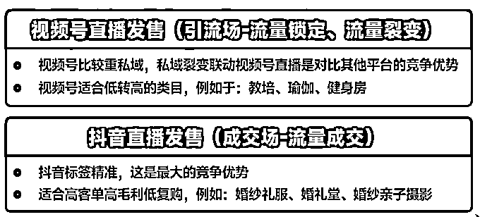
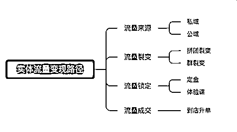
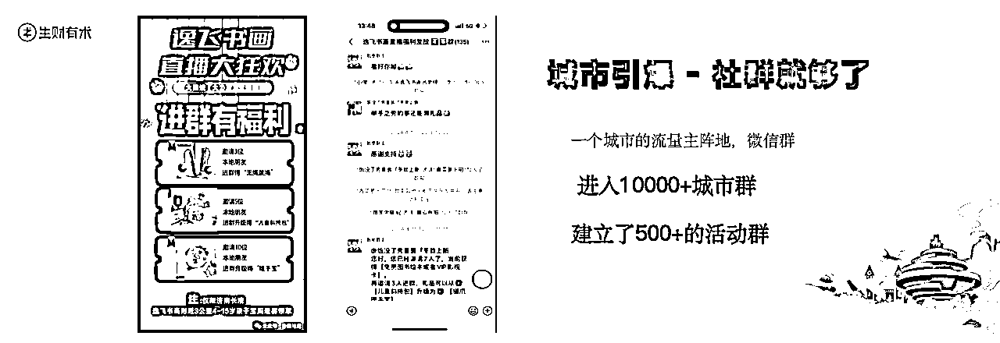
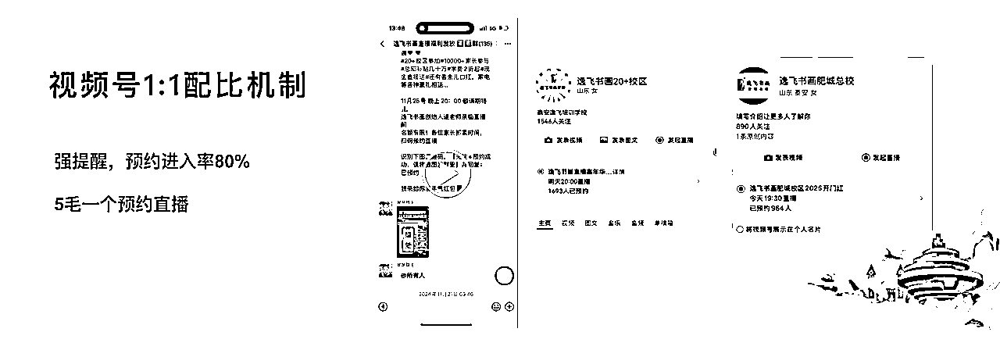
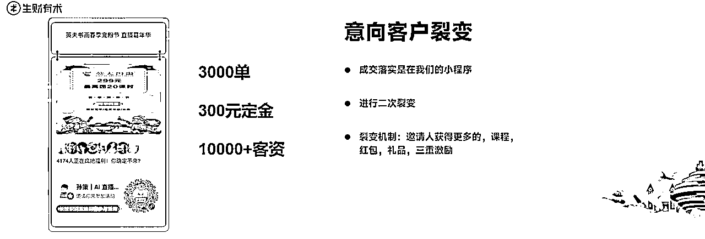

# 孙策：视频号直播发售，如何帮助实体一场收款 200 万

> 来源：[https://shengcaiyoushu01.feishu.cn/docx/Pr4kdNqHEoQuffxxkyzcFk6en9e](https://shengcaiyoushu01.feishu.cn/docx/Pr4kdNqHEoQuffxxkyzcFk6en9e)

## 嘉宾介绍

孙策，同城实体操盘手，实体直播专家，团队进店交付实体 5000 家。

# 1.创业经历

大家好，我是孙策，今天我给大家分享的主题是，就是如何通过一场视频号的直播发售，帮助实体老板一场收款 200 万。

顺便做个自我介绍，我16年开始创业，到目前为止算是10年吧，这十年做了4个项目。

第一个项目是工美拍卖的业务，第二个项目是做淘宝客，因为在15年16年的时候，淘宝客还是属于上行的一个赛道，所以当时在高校领域还做到了头部的成绩。

第三个是加入生财后做的一个线下拉新的业务，帮助淘宝、支付宝，京东、美团这样的公司，帮他们做流量，所以说这个我们也相当于说做了一个算是比较头部，所以说前三段的业务的话其实还是比较顺的。

到了22年开始我们开始做同城赛道，当时在山东泰安起盘，我们想说这个业务能不能在单一城市打通，打通的时候，我们就开始做山东济宁，淄博还有聊城，还我们做了一下江西的城市，我们发现不仅是参与一个城市能跑通，其他城市也OK，我们就觉得这个业务其实区域化也 OK 了。

所以到了第三年的时候，也就是说去年了，我们开始疯狂地全国化，比如说我们大概是我们自己做了两期，包括跟生财合作了四期，已经是六期，然后我们从山东做到山东的所有城市，包括河北的所有城市，包括江苏的所有城市，安徽的、江西的包括做到现在广东。所以说我们在每个城市都合作了大量的实体老板，把帮他们做出一定的业绩。

到 25 年之后，我们给我们今年定的基调是什么呢？就是我们要全面拥抱付费，拥抱根据地，在每个地区建立根据地其实对于我们这套逻辑来讲，因为我们去打付费的话，第一个点就是单个客户的获取成本比较低，就可能2-300块钱一个，其实对于我们来讲这个成本很低很低。

第二点我们开始就要全面拥抱AI，就说我们因为我们是面对面地给商家去做流量，让他做转化，我们都是跟大量的实体老板在沟通，所以说我们知道实体老板的痛点在哪里，所以说的话我们发现有大量的可以用AI去提效的机会，所以说我们就是全面拥抱AI。

第三点就是建立中心化获客与地区交付模式。就是说可能是在我们中心化，然后我们投流，然后获取商家的合作，我们再把订单派发到各地，比如地方的圈友，然后来进行交付这样一个逻辑。

接下来我说一下为什么这么选择的逻辑。

# 2.业务选择逻辑

很多圈友在找业务的时候，他会面临一个很大的问题是什么呢？就是也没有花大量的时间去调研。但事实上我们在做同城这个业务的时候，我们前前后后花了6个月的时间去调研这个赛道到底能不能做。因为我们笃定：你只有把这个业务想清楚了，做起来才会足够坚定。

但是很多圈也会出现一个什么样的问题，就是我在选择业务的时候，我是情绪化去选择，我觉得这个业务OK，我也没有做调研，可能看到这个业务两三天他就觉得我要值得去投入了，任何业务的起盘都是充满各种问题了，你必须要解决大量的问题之后才能拿到结果。

所以说对很多新人来讲，或者很多一些项目老鸟来讲，假如他没有进行一个长时间的调研之后才去选择，当他碰到了问题的时候，他会觉得说这个项目是不是不OK？是不是有问题啊？那么他就会不断地干，不断地换业务，这个做一下另一个业务再做一下，本质上是什么呢？

他没有想清楚这个业务的底层逻辑是什么？

我该不该投入？

我投入之后，后面我该花多长时间去投入？

所以说当时我们在选择同城有三个点，第一个点叫竞争小。

竞争小，为什么叫竞争小啊？其实就是我们要一定要记住一个点，就是现在创业的门槛越来越高，也要说你只有拿到这个领域的头部第一名、第二名或第三名，你才能拿到这个领域内的钱。

你想一下，如果说你是二三十名甚至三四十名，你怎么可能赚到这个行业的钱呢？所以说我们要找到一个点，我们如何在一个区域内拿到第一名？一个地方大家第一名，当时我们想来想去同城是可以的，因为在同城来讲的话，其实你成为你当下城市的第一名并不难。只要说我们打败我们这个城市内的其他对手就可以干了，我们成为第一名，我们就可以拿到这个城市中所有的资源，同时获得巨额的利润。

第二点就是对标案例多。就是说你在做一个业务的时候，焦虑的其实并不是什么，本质上是因为你知道我要达到这个目标缺少一个可执行的路径。那可执行的路径去怎么去找呢？那就找对标案例嘛。

那怎么能找到更多的对标案例呢？

全中国各种各样的城市都有对应的成熟的一个同城业务，你只要发现这个同城业务的一个老板他做得比较OK，你学习只要你付钱，他大概率会教给你。为什么呢？因为你没有任何竞争，假设说我在山东你在杭州，你把这个城市打得特别好，那我在山东做这个业务，我给你付钱也OK。我们离得这么远又不是竞争对手，他就会告诉你，所以说我们就可以找到对应的对标的案例，且可以 copy 他，这是同城一个巨大的一个优势。

第三个点就是可复制。就是单一城市下跑通，你是可以拓展到其他城市了，如果说你一个城市可以做 100 万，十个城市大概能做多少钱？是不是 1, 000 万？这个账很好算的，就说你如果说你有能力做 20 个城市，那你就是 2,000 万呀！所以说对于一个业务来讲，你不仅要考虑它的规模化，你还要那个考虑它可执行的路径，这就是一个比较 OK 的一个可执行的一个路径。

分享2个案例。

案例1：

有一个同城，是一个安徽的一家公司，它是一个做同城标招聘网站。他在山东其实做得特别多，然后在滨州做了，在菏泽做了，他在滨州、菏泽一年都是做几百万量级的，主要做同城招聘服务嘛。

他是从滁州本地单城市做到快 600 万营收的时候，他其他觉得我这个业务可以去 copy 了。所以说他做了两套增长逻辑，一个叫 SaaS 提供，第二个叫陪跑服务。

同时他赋能了全国多少 400 多个区县，做这个本地的招聘网，他们现在年利润都稳定在千万了。

案例2：

一个叫做国科优选，另一个叫做亿绘驿站。也是一个同城业务的一种，他们具体是怎么做的呢？

就分为这三方，一方是平台，平台的话负责中心化的直播+供应链，也就是说平台负责找到供应链，然后他找供应商主播，他在社群里进行直播进行卖货。

一方是门店。门店负责用户的拉新，就是可能拉新一些老头老太太的，还有用户的一些服务。

一方是用户。这些用户主要是中老年人群，他们比较孤独，因为其实现在很多都是空巢老人，他买一个东西他并不会，这个店长他可以去教他怎么去买，然后他还可以教他这个产品怎么使用。

所以他和这个老头老太太的粘性就会特别特别越深，这就是这套模型成熟的一个基点。

只要说在一个社区搞一个码，也就是在社区跑通一个店，那很简单，他只需要乘 10 乘 100 乘 1, 000 乘1万。其实这个模型就很简单，无非就是说我中心化的一个公司能支撑一家店，还是支撑 10 家店，还是支撑 100 家店，还是支撑 1, 000 家的店，这就是一道数字题。

所以他在一个区干到了多个区，再干到多个市，这也是同城的一种。

既然同城的业务那么多，要如何选择呢？

当时我们定了三个点，第一个点就是要看这个同城业务有没有人能拿到大结果？

因为假设说这个业务有人拿到 1 个亿的，你冲进去才能可能拿到 1, 000 万， 如果这个行业的头部就是几百万，你进去充其量就拿到几十万。你看最早的无人直播，视频化的一个无人直播，当时比较火爆的那几个人，其实他一个月是最高赚到近 100 万。当时有很多人涌进来，因为他没有思考一下就那几个人赚到 100 万，你涌进去你能赚 100 万很难呀，你能赚 10 万就不错了。

所以如果我们想拿更大的结果，我们就看这个行业的头部拿多大的结果，然后我们去选择它就 OK 了。

第二点就是说有多少人拿到了结果。

比如说一个业务，假设有 10 个人或者是5-60个人拿到，结果我们涌过去才可能有机会拿到结果。如果这个行业内这只有3-4个人拿到结果，你涌进去可能真的是拿不到结果了。所以说有足够多人拿到的结果才有可能是我们，因为我们只是一个普通人。

第三点就是这个团队存在多久了？

假设说这个行业的头部他是 6 个月就拿到的，结果大家想一下我们该选不选择这个业务？他用 6 个月拿到结果，和一个行业的头部他用3年拿到的结果，大家要选择哪一个？ 我们应该选择3年的。

为什么？因为证明这个业务的壁垒度不高，别人能拿到 6 个月，可能这个业务会出现一个更牛的团队，他可能又有资源又有资金，又有团队涌进来，就把你的收割掉了，所以说对于我们普通人只能找一个什么赛道呢？慢慢建立起你的优势的一个赛道，如果说你涌进去，别人短时间打不败你，你就有机会。如果说别人用资金、资源、团队能快速把你收割掉，这样的业务你就不要选。

回到说我们，我们是做的是同城实体一个服务，因为当时我们找了这个业务，我们发现这个业务中其实很多团队他拿到亿级或几亿级的一个营收，那意味着说是不是我们也进去，我们可能有千万级的机会，虽然可能不是我们，但是最起码说它可能有千万级的机会。

第二点就是说对于实体营销这个领域，其实存在特别多的长的一个时间，可能是九几年、零几年、 10 年一直都有，因为你可以发现实体老板是一直存在的，特别是我们中国人一思考创业，就是开个店。

# 3.同城实体的痛点

既然我们选择了同城实体服务这个赛道，我们要思考同城实体老板他的流量困境有哪些呢？有几个痛点：

## 3.1流量困境

*   痛点1：自然流量枯竭

现在大量的实体老板，因为他地受制于地理位置，他可能叫线上消费分流，包括进店人数持续下滑，就是你没有自然流量了。

*   痛点2：线上流量越来越高

因为线上是一个竞价逻辑，而且不仅价格在增高，转化率还在降低，所以说就会造成很多大量的实体老板，他不花钱就没曝光，这是现在大量的实体老板是面临一个很大的流量困境。

## 3.2 平台规则绑架

*   痛点1：平台计算你的利润率

还有一个就是平台规则绑架，平台不会让你滋润的活，他会让你叫卑微的活着，也就是让你艰难的活着，让你成为平台的打工人，做电商的应该特别能体会。

*   痛点2：代价内卷螺旋

现在平台的算法会倾向于推荐更低价的一些商品，还有推荐一些让你被迫进行对比。比如说 a 火锅店， b 火锅店它在这个区域内，那平台会让他俩同时展现让你去选择，其实就是刻意地就让你比对方低，因为现在抖音和美团也在打架，就是我抖音上比你美团低，美团上要比我们抖音低，所以说现在就是大量的实体老板被平台流量规则的一个绑架。

还有一个点叫转化困境。

你看大量的实体服务的一些团队，他们偏向于流量端的一些服务，其实这个逻辑是有问题的，为什么？其实很多实体老板他缺的并不是流量，他缺的是什么？有三个点，

*   痛点1：转化体系的一个缺失

很多老板他的转化率很差的，很多人一开业，尤其一些餐饮老板他会大量地去买量，他可能是 99、89 或者 79、69 的这种低价的团购，疯狂地让用户进来，突然有这么多的用户，你想他的团队是有限的，他的服务能力是有限的，他进来了大量的人，那意味着说他们还没开业就倒闭了。

就大量人会觉得，你的服务不好，你的菜品不好，他会觉得你的店不好，这么一波下去反而把这个店给搞死了，所以说他们本质上就是缺少这个转化体系。

*   痛点2：升单体系的缺失

很多老板他错把团购品当成他店里的一个利润品。卖一些团购，可能说 100 - 200 的券，如果说这个实体老板通过计算，我还有一个 10 块 20 块也能赚。如果说他把这个团购品当成那个牛品，那这个店就意味着离倒闭不远了，因为还有退费率。

*   痛点3：复购体系的缺失

还有你平台的广告费，你会发现如果说他没有把这个团购这个订单转化成复购或者是转化成新单，那意味着说他这个机构，这个实体老板其实差不多就over。

# 4.同城实体的机会

所以说对于同城实体来讲，那我们服务的机会有哪些呢？

第一点就懂引流，我们可以帮他带来客资。

第二点就是懂转化，我们可以帮他带来一个交易额。

第三个点就是懂操盘，我们可以陪跑达成结果。

这是三大服务的机会。其实我们现在走出了一套比较成熟的一个体系，就是说我们建立一个同城的一个服务IP。然后你通过这个IP，你可以通过去付费，或者通过去分享，或者是通过去开沙龙的方式，然后你可以获取 b 端老板的合作。

那我们用什么样的产品去变现啊？我们用去结果服务产品去变现，这个重点讲一下啊。

你会发现大量的博主，他的课程的退费率越来越高。为什么呢？

因为买老板上课太多了，小红书课、抖音课、 AI 课。他上的课太多了，他已经上麻了，而且这只是第一个点。

第二点因为实体他老板他太忙了，并不说这个课不行，他是学了之后没有时间去做。

所以说我们主要是做的是什么啊？主要做的是结果服务嘛。就说咱们之间合作，我帮你拿多少业绩，你来给我多少钱，就按照这逻辑去打。

而且我们发现这套逻辑放在投放端获客成本特别低，别人可能卖那种直播的陪跑，或者是一个城市的一个抖音的一个陪跑，他们获客成本可能到几千块钱。但是我们打结果服务，这个去打那个抖音的付费的，我们发现这 200 块钱，我们是 1/ 10 一个差距。

其实通过抖音的我们会发现，其实结果服务应该是未来是一个巨大的一个方向，因为通过价格就是 1/ 10 的这个广告费，我们就可以看出来。

第三点就是AI 产品赋能。

因为 AI 产品可以切入到实体老板的各个端口，像流量端、转化端吸引大量的实体可以去服务，就大量的 AI 工具其实可以去服务的，如果现场有很多做 AI 的，我觉得大家其实可以思考一下，深入到实体老板这一环节，你会发现 AI 的提效的机会特别多，因为你 AI 解决的问题的价值越大，那你售卖的价值就越高。

如果你能帮助老板，因为对于实体老板来讲，他都是 ToB 的，都是一个老板，你可能帮他解决一个 10 万的问题，你收他个一两万，其实还不难。

其实结果服务就是进入他的店里用私域裂变+直播发售的方式帮商家拿结果，然后我们拿佣金，具体是怎么去做呢？

## 4.1 为什么是直播？

首先对于实体老板来讲，他本身是有大量的意向客户的。可以举个例子，一个婚纱礼服店的老板，他可能一个月的销售额是 20 万到 30 万，现在是 4 月份，其实他 5 月份、 6 月份，他大概率还是 20 多万还是 30 万，所以说我们通过直播可以提前成交，干了他未来的客户，这第一个点。

第二点沉睡客户，就是积灰客户。

这类客户光靠我们员工去发掘，我们会发现很难，但是我们通过直播就很简单，通过直播去唤醒这些沉睡的客户，就是客户看的时间越长，其他本质上其实客户越多，其实更容易达到结果。

第三个点叫老客户，因为大量的私聊，他本身是有老客户的，我们通过把他老用户拉到我们直播间里，然后我们通过设计一定的机制把他们老客户让他去推荐，那意味着说，我们老客户回来再推荐一波新客户进来，又确定做出一批交互的第四个点就是店铺的影响力，大量的实体老板，其实他对在这个地区他是有一定影响力的。

第五个点就是通过付费，就是因为现在那些抖音或者是视频号的一些平台，它已经把我们各种行为标签标得特别精准了，你通过付费就是能投放到你有需求问题人中。

那行为标签有哪些呢？

第一个年龄，他可能是 20 岁到 35 岁这个区间，先把年龄卡死。

第二个购物标签，就是购物都买些什么？可能是一些精致化妆品，你通过他的消费，就锁定这个人群。

还可以通过他的一些所在的位置，如果说他是来旅游，就待这几天了，那肯定不是我们的客户，那他是在这里长待的，才是属于我们的客户。

所以说你通过一些标签，你越理解你的用户，然后其实你的投放越精准。

## 4.2 为什么是私域裂变？

因为大量的实体老板本身是有一定的私域沉淀的，因为很多实体老板他一些之前的客户他加进来，可能这个老板的私域有几千用户，他不懂得去挖掘。

还有老带新是实体本身的一个传播方式，其实大量的实体老板他获取新客户还是靠口碑，口碑就是老带新就私域裂变，所以说我们就用了两个点，一个是私域裂变+直播发售，我们用这样的一个方式，其实我们发现大概率情况下可以覆盖 80% 的一个实体老板，所以我们就大概是做了这两套产品。

一套产品就视频号直播发售，一套产品是抖音直播发售，视频号是适合什么呢？

视频号是适合这种低转高的类目，就说因为视频号它是比较重私域的。就是因为私域裂变是视频号直播对比其他平台一个很大的一个竞争优势，因为你只要点赞或者是分享，它大概率可以推到你朋友那里。

所以说视频号是一个重私域的，那视频号既然重私域它适合做什么？它适合做流量的锁定和流量裂变。所以说我们把视频号的这套逻辑放在哪类实体门店上啊？放在这些像瑜伽、教培、健身房这样一个类目。

还有抖音直播。

抖音直播我们把它当成一个叫成交场，也叫流量成交，因为抖音有一个优势，它标签特别精准，这是标签最准的一个平台，这是最大的一个竞争优势，所以说它就适合哪种类目，就是高付费性的行业。

高付费性的行业有哪些呢？就是高付费意味着叫什么？这个行业高客单、高毛利、低复购。那高客单、高毛利、低复购有哪些呢？比如婚嫁礼服，很多人可能就结个一次婚，最多两次或者三次；或者是说那个产康月子中心，这都是些很高客单的，很低复购的，他都是疯狂地去做付费投放的。

我们把视频、抖音直播发售这个点放在这类用户群体上，所以说当时我们就构建了这两套产品，几乎能覆盖这个城市中 80% 的客户。

## 4.3实体流量变现路径

回来说实体流量，一个变现路径里面的路径有三个点，有四个流程。

第一个点就是流量来源，流量来源可能来自于私域或者公域，然后流量进来了，我们很多人是想着流量进来了直接成交其实是不对的，因为你相当于说把流量浪费掉了。

假设说你进来了 100 个客户，那你可以通过一些流量裂变，做群裂变，做拼团裂变， 100 个支付，你把他裂变成再给你 100 个，是不是说你的广告费就降低了 1/ 2？

之前假设说我们采购客户 100 块钱，如果说你通过裂变用户，然后做了一倍，你的广告费百分之上变成了多少钱了？变成了50%，对不对？

然后还有一个叫流量锁定，为什么要流量锁定呢？其实刚才咱讲大量的实体老板，他的承载能力是真的有限的，你给他 100 客户可能就把他给做死了，你需要给他细水长流。

所以说当他进行转化的时候，我们需要把他那些精准客户先转化掉，所以说当我们给他做来了 100 个客户或 1, 000 个客户的时候，我们接下来最大的一个点，我们是帮他进行筛选，要把最高意向的客户给筛出来，然后进店来转化。

后面的再慢慢进行转化，因为他的交付是很有限的，所以说我们通过定金或者体验课把他那些意向客户给他筛选出来。

然后第四个点就是流量成交，流量成交就是到店升单，就是说我们把一个 100 多或 200 多的一个客户，把他升到 3, 000， 5, 000 甚至1万，这就是大概的流量变现路径。

## 4.4如何做一场直播发售？

那我们是如何做一场视频号直播发售呢？我们分为这几个环节，就是五大点，

第一点就是区域裂变，

第二点就是预约裂变，

第三个点就是直播裂变，

第四个点私域裂变，

第五个点就到店裂变。

我简单讲一下，就是我们一个视频号直播发售的一个流程是什么样子的？

首先大家思考一下是什么？就是说其实对于一个城市流量的引爆，其实不用搞什么短视频，你只需要做好一个社群就够了，因为大家想一下我们两大主流的流量平台有谁平台贡献？一个是微信，一个是抖音，对不对？但是如果说你从抖音获得全程的流量曝光，那这个场景太高了，但是你从在流程体系内你获得全程的流量曝光，这个不贵。

那具体我们怎么做呢？大家想一下你现在微信体系内什么样的东西，你的打开率还会高一些？

第一个当然是私信，对不对？别人发给你私信的话，大概率你都会看。

然后第二个是什么？就是微信群，红包群，工作群，物业群，所以说我们想是说什么叫打造一个同城嘛？我们要思考一下一个用户打开率最高的是有哪些？有这几个哈。

第一点可能一些叫家校群，第二点是你的物业群，就是说你小区里建立一些物业群，是不是物业型打开率很高？还有一些你商家的一些福利性是不是也打开率比较高？其实工作群你继续发活动，你把你踢出去嘛？这个很难，就是说，所以说对于一个城市的流量矩阵地其实很简单，你找到对应的群就好了。

所以对于一家店来讲，如果说他想做一个全程的引爆活动，其实不用做抖音，也不用做视频上的直播，其实做了一个微信群其实就够了。

那既然我们做了群之后，我们还需要干嘛？当然是这个时代中最高效的直播嘛！这里讲一个点，就是直播很简单，有预约就可以。所以说在这个节点的时候，因为对于视频号我们做了大量的直播的一个预约，因为对于视频号来讲，他的预约进入率很高的，假设说你预约 1, 000 人，它可能在开播率刹那进入 800 人到 900 人，大概是这样一个进入率。

第二点对于视频号来讲它有强提醒，你只要预约了，它会强提醒。第三个点就是预约路径特别简单，就说你预约一个直播间，你只要扫码，扫码之后你只要扫进去就可以。

当我们做完预约的时候，我们需要干嘛？就开播，开播我们需要对于视频号直播有两大要素，第一就是做转发，第二就是做停留。

为什么要做转发呢？就是视频号我们要理解它是在私域体系内，你只要持续地让直播间里的用户持续地做什么动作，他们确实就在做什么动作。

第二，就是你要把进入直播间这批人给他留住，他那可能一拨人哐哐哐地就是那个转发之后进来留住他，这样的话你的流量就变成一个螺旋往上。

第三个我们在直播的时候要干嘛呢？在直播的时候疯狂地让他们做转发，疯狂地留住他们，就疯狂地每隔 10 分钟送一波礼品，这样的话我们视频号、直播间就正向流水了。其实这一套逻辑的话，适用于40-50%的店，只要是低转高的店都适合你，很容易做出稳定的直播间来，在线人数 100 人到 200 人，直播间就大概是这样一个情况，这一波我们大概拖了多少人呢？

就说当时我们是累计卖了多少个定金啊？累计卖了是 3, 000 多单，几个大校区 3, 000 多单的话，每个定金的话是300 块钱左右的定金，然后大概获得了多少客资呢？就1万客资，你看 300 个 3, 000 的定金和1万个客资，其实相当于说这1万的客资已经很值钱了，然后我们还卖了是 3, 000 单的一个定金，所以说就是说我们在直播间我们会干嘛呢？

我们来了这些流量，我们会卖一个什么东西？我们不是在视频号、直播间直接挂车卖东西，为什么没做这个动作呢？是因为我们是成交落实在我们一个小程序中。因为你若是在这个小程序中，我们还可以干嘛？还可以进行一波裂变。

就是说直播间我们是让他在小程序买了之后，我们再让每个人再拉一个人，所以说当时我们卖出了 3, 000 多单，然后让他进行实际的在一项课后再进行二次裂变。

这是当时我们的一个购买的一个数据，然后我们咱回到这个点啊。

我们再串一下这个路径，当我们从公域和私域，我们建了群，拉了预约，做了群裂变，拉了预约，在直播间卖了一个定金，卖了一个体验课，最后再到店成单升单。

所以我们做了3万的流量，进入直播间听了 6 分钟的话，我们大概是卖了十三千单， 3, 000 单，这个成交比例大概是 10% 左右。这 3, 000 单我们大概转多少了？我们整体达人转出 200 +万。

这就是我们第一套产品线，叫视频号直播，抓手是基于低转高这套逻辑去走，所以说如果说我们在场有自己本身是自己老板的话，可以试一下这套逻辑，这套逻辑我们已经验证过很多了，确实都很好用。而且我们也带了大量的人去试这个产品线也没问题。还有最后就是抖音，抖音其实就是纯做纯付费就好了。

最后的最后，祝大家生财有术！

内容总结：

