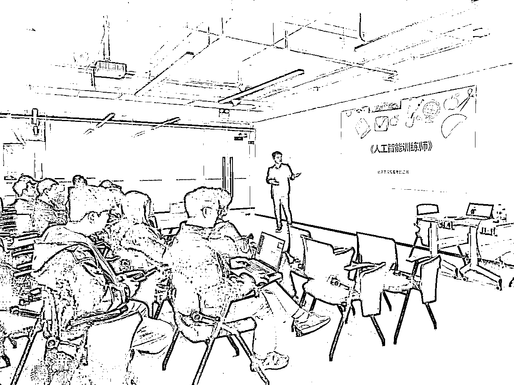

# 一位AI传术师的生财成长日记:从好奇上船，到回归主航线

> 来源：[https://shengcaiyoushu01.feishu.cn/docx/UFkEdbdbKoVNMNxKzdbczl4Snec](https://shengcaiyoushu01.feishu.cn/docx/UFkEdbdbKoVNMNxKzdbczl4Snec)

# 关于我

我是佳文，“生财有术”平台上的多项航海项目教练，包括：GPT提效、Coze私人助理、ComfyUI、AI赋能电商、DeepSeek入门等。

我公司主要服务于政府及企业客户，通过AI赋能帮助他们完成提效降本与创新突破，也为更多想搭建AI生产力工具的人提供一整套方法论和实战支持。

同时，我也是广东省人工智能训练师考评员，福建省海峡人才毕业生就业生指导中心特聘讲师。

我的经历并非一帆风顺，甚至和大多数人想象中的科技创业者完全不同。

*   2014-2018年，我是一名乡村医生，在基层卫生院为几千名慢病患者做跟踪随访、日常诊疗；

*   2018-2020年，我转行进入互联网，从客服做到运营，逐渐掌握了用户增长、内容运营、社群搭建等底层方法；

*   2020-2022年，我在企业中担任中层管理，开始主导多个部门的协调工作，从业务、营销到产品项目都要全链路操盘；

*   2023年至今，我正式走上创业之路，将AI与企业管理系统深度融合，服务了超过100家中小企业、团队，构建了自己的企业AI解决方案体系。

我知道很多人和我一样，不是一开始就走在光鲜的主线上，而是一路打怪升级、在不断试错中找到方向。所以，我愿意把我的路径与你分享，也希望你能在生财的这艘“巨轮”上，不只是兴奋，更能靠岸。

# 生财新圈友你好，这是我的生财使用指南

适用于刚加入生财和对AI、副业、一人公司感兴趣的朋友。

能解决你以下卡点：

*   不知道从哪里开始看

*   想做项目但方向不明确

*   学了很多却没法落地

## 请跟着这4步来用好生财👇

### 1.先确定你想做的事

问自己一句话：

“我现在最想搞懂/做成什么？”

比如：

*   想学会用GPT提效

*   想搭建自己的知识星球

*   想把AI应用到工作/副业中

先定目标，才能少走弯路。

### 2.选一个模块先开始

别急着全看，先挑一个航海项目（21天课程）试着跟完：

*   想提升效率 → GPT提效 / Coze / 自动化工具

*   想输出内容 → AI写作 / 公众号写作 / 可视化

*   想变现副业 → 星球搭建 / 训练营 / 电商模块

21天坚持跟下来，胜过天天看但没动手。

### 3.建一个“个人学习工作台”

用 Notion 或 飞书建个简单文档，记录：

*   学了什么

*   做了什么

*   下一步干啥

不需要复杂，只要能清晰看到进度就够。

### 4.有意识地开始分享

你可以：

*   写一篇“航海复盘”贴

*   总结一个你常用的AI技巧

*   发一个你做的副业/服务小成果

输出的过程就是成长的过程。你不需要很厉害才开始，但开始之后你会越来越厉害。

别焦虑内容太多，从你最关心的一件事开始，一步步来，你也可以在这里走出自己的路。

## 🚢【启航篇】看山是山，看水是水｜第一次被信息差轰炸的兴奋

我的AI航程，起点其实并不在生财有术，而是在我自己对AI技术的不断摸索中。2020年，我开始研究AI在企业营销、合规、财务、客服等场景的落地方案，那时还没有ChatGPT，更谈不上“全民用AI”，或者说，当时研究的内容根本就算不上真正的AI。

但真正让我打开视野的，是2023年底的GPT4发布。

我意识到，AI从“工具”变成了“接口”，从“辅助”变成了“伙伴”。我开始研究如何用它服务企业、做成系统解决方案。而这条路上，我遇到了“生财有术”。

初入星球，我的心情就是：

"原来副业也可以这么系统地玩！原来知识能变现，社群能盈利，公众号能年入百万，自动化能极致提效......"

像一个刚上船的新人水手，面对这片内容海洋，我简直兴奋得不知所措。每天都在看别人做什么项目，每一篇帖子都让我觉得“这也太值了”。

我看别人的公众号变现案例、星球搭建笔记、课程运营SOP、销售话术拆解、AI训练营设计……

于是，我开始：

*   同时研究Coze、公众号、知识星球、小红书、Notion、自动化工具；

*   同时在想：要不要我也开个星球？是不是我也能开课？能不能做副业做得比主业强？

每天都像在挖宝藏，又像在海上乱飘。

这个期间，我沉迷于发掘【风向标】，试图得到“认可”，努力想融入这个圈子，探索不同的赛道。

完全脱离了我自己的主业，事实证明，去探索的这个事儿，有用，但没太大用。

没有正反馈的日子是很难熬的，有一段时间我努力的“戒生财”，尽量不去打开网页去看大家在干什么，因为每次一打开，8小时就很快过去了。

## 🌪【迷航篇】看山不是山，看水不是水｜焦虑与拉扯

兴奋之后，是一种莫名的焦虑。你可能也有这种感觉：

*   为什么别人随便写个星球月入5万？

*   为什么别人做个AI工具分享就涨粉几千？

*   为什么别人搞自媒体、开课、写推文都那么快？

我开始怀疑：我是不是太笨？我是不是选错方向？我是不是也该抛下企业服务这块，转去做B端轻资产产品？

每天沉浸在星球内容里，但越来越焦虑。

*   什么都想做，什么都做不透；

*   什么都在学，但没时间沉下来打磨自己的核心服务；

*   脑子很忙，脚步很乱。

这是很多新手都会走过的“迷航阶段”：你看别人什么都行，觉得自己什么都不行。

但我意识到一件事让我豁然开朗：

你看到的是别人分享的成果，却没看到他们沉默时的打磨；你追逐的是别人的轨道，却忘了你本来的目的地。

所以，我暂停了追风，开始“回望航线”。

开始参加航海

开始写一些长文

开始分享一些我的AI使用心得

开始主动去面对焦虑，接受它，并对抗它，最终解决它

小白也可以靠AI写文章/论文，实现日赚2000元（23年，应该是最早的一批AI写作玩法教程）

AI写作的春天来了--知网AI智能写作平台上线（AI写作续作，时至今日依然好用）

生财一年，航海我打通关了（算是阶段性总结，该回归主业了）

## ⛵️【返航篇】看山还是山，看水还是水｜回归主线，反向赋能

我开始问自己：

*   我最擅长什么？

*   什么事情，是我干得久、干得深、干得稳的？

*   我的客户是谁？我能为他们解决什么问题？

答案其实一直都在我身上：我就是一个做企业服务的人，我能把企业问题和AI能力结合起来，我有从战略到落地的服务经验，我懂组织、懂产品、懂场景。

“我不是来换航线的，我是来装船补给的。”

这时我重新看“生财有术”，角度就完全变了。

我开始从中提炼能为我服务的模块：

*   从副业项目里，学信息包装与产品定义；

*   从写作航海里，学结构化表达、用AI写方案、写课程、写SOP；

*   从小红书精华贴里，借用视觉呈现的方法，给B端产品做可视化；

*   从AI小组里，学习如何用工具节省运营成本，提升客户满意度。

我不再被内容带着走，而是有意识地去“取用”。

于是，我逐渐搭建出一套系统：

📦 「企业级AI赋能服务工具包」

*   一套GPT场景引导系统

*   多种AI办公/运营工作流

*   自主研发智能体模块库（Coze为主）

*   知识库+SOP标准库（做知识交付）

🎯 「客户落地服务标准流程」

*   战略对话 → 痛点诊断 → 场景设计 → 工具配置 → 团队培训

我开始专注打造一个品牌角色：

用AI帮企业降本增效，让每家企业都能拥有自己的AI教练。

回到本业，开始围绕着企业场景，进行一定的内容输出

创业、副业找伙伴，找投资？一篇文章说清如何让人能听懂你的项目（商业计划书心得）

老年教育为什么是近二十年最值得关注的赛道（综合赛道拆解）

WPS+DeepSeek办公提效（企业级工具使用）

DeepSeek+多维表格使用（企业级工具使用）

多维表格+知识库搭建/调用（企业级工具使用）

## 🧭 生财航海，是我的加油站，不是方向盘

生财的“航海项目”几乎每个季度都会更新，紧跟互联网前沿趋势，涵盖AI、内容创业、电商、自媒体、自动化、虚拟IP等多个模块。从第一次航海，一路看下来，不难发现，它几乎总能抢先覆盖“热门机会”。

但也因为航海项目通常以“21天”为周期进行，不少伙伴浅尝辄止：刚开始信心满满，中途被别的项目吸引注意，最后什么都没做成。课程结束，文件躺在硬盘，行动却停在原地。

我一度也这样，直到我意识到：“你不是来集卡的，是来航行的。”

如果你只是想快速收集航海项目资料，那你收获的是知识碎片，

如果你能将航海项目反哺你的主业路径，那你收获的就是系统成长。

有些模块，我会参与深度学习，比如《AI办公提效》《智能体开发》《Cursor应用》这些和企业内训高度关联的；

有些模块，我会“借知识来赋能客户”，比如《视频号带货》《电商智能化》《内容SOP》在我帮客户打营销系统时就能用上；

有些模块，我纯粹观望了解，为的是不掉队，比如《小红书》《闲鱼带货》《IP打造》，知道发生什么，但不会自己下场做。

📌 我不会再焦虑“别人做什么”，而是清楚地知道“哪些知识是我服务企业的配件”。

哦对了，还有一本书，应该在7月左右要出版了，AI+企业服务类别的，如果你认可我的内容，可以在出版后，凭此贴截图，来找我领取一本“签名版”，哈哈~

## 🎯 给AI型新人和副业探索者的航海推荐组合

如果你和我一样，是做GPT或AI相关服务的，可以重点关注这几类航海项目

*   工具类：Cursor、Coze、ComfyUI、智能体提效、AI写作、GPT提效（提升效率和交付水准）

*   表达类：公众号写作、AI写作、知识可视化课（提升你为客户讲清楚价值的能力）

*   商业类：IP孵化、数字人、AI变现路径、ChatGPT+自媒体（帮你搭建入口和影响力）

*   运营类：SOP设计、小红书、公众号、小绿书……

如果你是内容创业者、社群运营者、自由职业者、一人公司起步者

*   先选一个最小项目试做21天，比如一个栏目、一个训练营、一个知识星球；

*   从航海中提取落地模块，如成交页写作、训练营结构、自动化SOP，让它“为你所用”；

*   不要盲目求快，任何高质量项目，起步都是100小时。

## 🧭【回望与指引】给每一个初见生财的你

每一位刚进入生财有术的伙伴，都会经历阶段性的转变。

不论你是做AI、做社群、做自媒体，还是想开启一个“一人公司”，这些路径都能在生财里找到启发。但重点不在“看了多少”，而是你能“沉下去多少”。

📌 在“看山是山”的阶段：

*   放宽心，把星球当作“探索期孵化器”，多看多记，不急着行动；

*   找3个与你背景接近的优秀星友，看看他们是怎么结合主业走出路径的；

*   制定21天学习计划，而不是21天变现计划；

*   如果你还没有确定方向，可以尝试“边做边学”：写公众号日更、做一次带货直播、跑一次自动化流程，哪怕失败也有经验。

📌 在“看山不是山”的阶段：

*   多参与“风向标”和“生财朋友圈”的分享，多问、多晒、多复盘；

*   用写作记录混乱，用输出倒逼思考，比如写“我的航海日志”、“我的项目进度”等；

*   允许试错，给自己设定探索上限：比如一个月内只调研2个项目，不再叠加；

*   记住：副业和主业没高低，适合你、能持续、能稳定变现的，就是好路径。

📌 在“看山还是山”的阶段：

*   聚焦主业，把生财的内容作为你主业的“AI增程器”或“内容引擎”；

*   把做项目变成“打造作品”，不止做项目赚钱，更做项目积累你的IP资产；

*   适当承担社区角色（比如做航海志愿者、领队、教练、或者发经验贴成为传术师），用输出倒逼深耕；

*   如果你是独立创业者，记住：你不需要什么都做，只要打磨一件事成为“可被记住的名片”。

✅ 建议总结：

*   用 Notion 或飞书/ima等工具，创建一个“个人生财工作台”，整理你每次航海、每个模块的学习精华；

*   每次航海结束后，自我复盘三件事：我做了什么？我留下了什么？我还缺什么？

*   关注“任务型”模块而非“概念型”模块，后者容易上头，前者才能产出；

*   给自己一年时间，去打磨一个闭环的小系统（比如一个副业流程、一个培训产品、一个可复用模型），这就是你的一人公司雏形。

你不需要成为最懂AI的人，也不需要去复制别人的商业模式。

你只需要找到那个最适合你的“服务场景”，并用AI，做出最有你风格的那套解决方案。

生财有术是一艘船，方向盘在你手上，

愿你早日驶入自己的主航道，也成为他人的灯塔。

——吴佳文

企业AI服务教练｜生财有术传术师