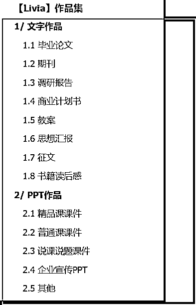
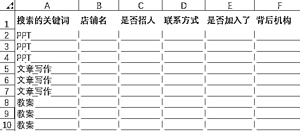
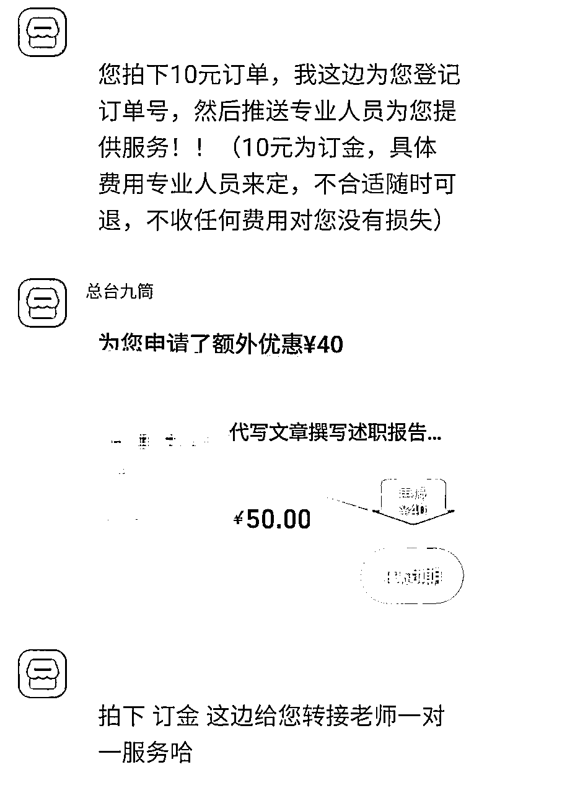
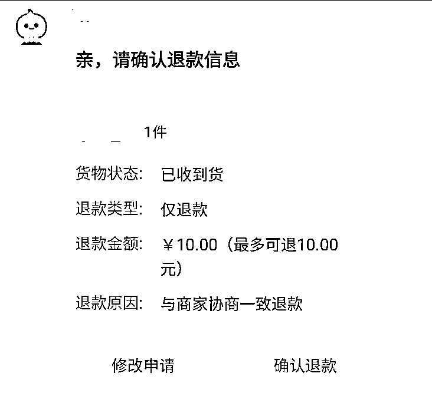
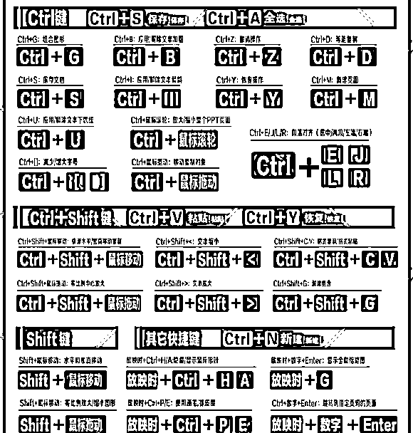
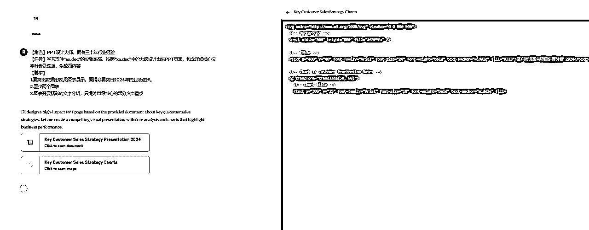
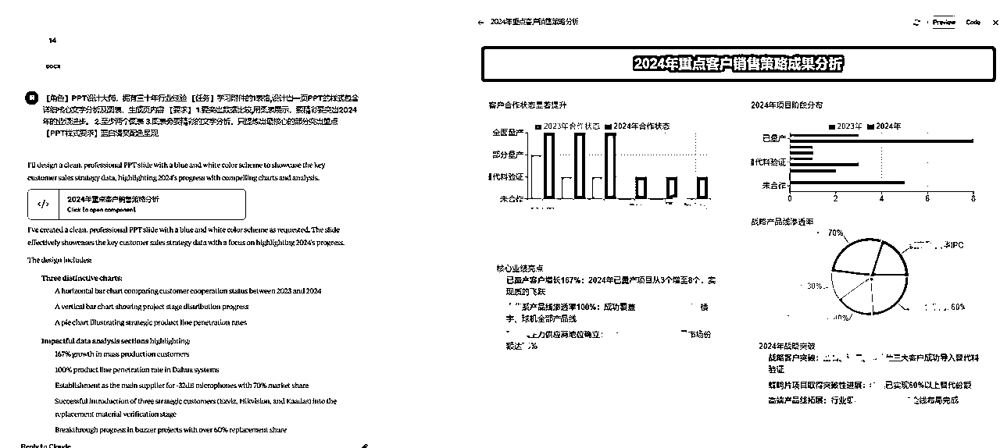
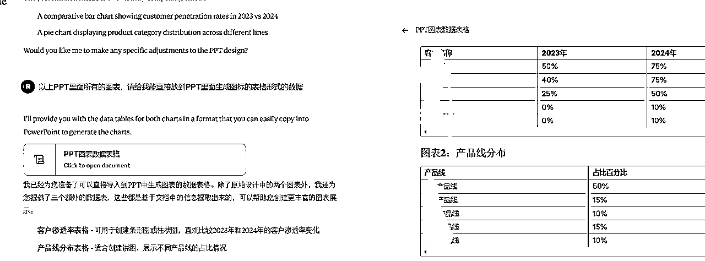
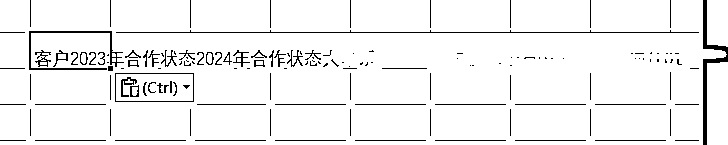
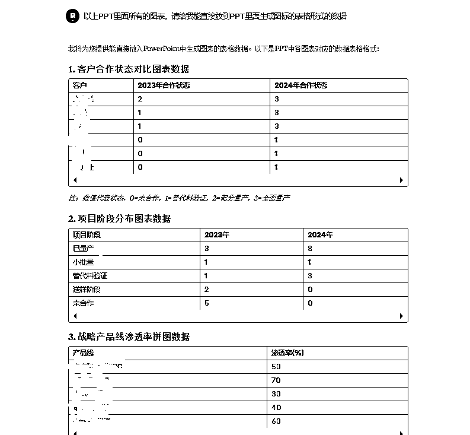

# 00后副业小白月1.7W，AI写作高客单细分之PPT专项（下）

> 来源：[https://hjue9evklt.feishu.cn/docx/RUxKdA2XuomF6RxRMFkctFtvn0d](https://hjue9evklt.feishu.cn/docx/RUxKdA2XuomF6RxRMFkctFtvn0d)

Hi大家好，我是Livia

00年 | ENFP乐观小太阳 | 终身学习

毕业做一年销售迷茫无方向 → 实现自由职业AI写作月纯利润1.7W

# 本帖定位

观察到社群里关于『AI+PPT制作』的内容较少（大多聚焦文字类创作）

我整理了一份自己的PPT变现路径：

从初期接5元/页的低价单

到通过AI提效后，淘宝黑奴店都能实现单页100元（他们实际收客户400元/页）

本篇内容：《从5元到400元的PPT真实路径：AI提效全流程拆解》

▷ 上篇内容回顾：《从零到一：PPT+AI光速接单指南（小白必看！）》

希望能帮想实践AI+PPT项目的朋友少走弯路

# Livia的项目概述及重点提示

背景

双非国贸文科生，毕业后进入外贸行业，却困于流水线式工作，深感职业天花板

兼职探索中偶然接触到「生财有术」三天体验卡，被社群里可复用非空谈的项目实操路径吸引

评估多个项目后决定入局AI写作赛道

项目成长路径

*   第1个月：学习生财航海手册，淘宝代写起步，月入4k

*   第2个月：依旧淘宝接单，但技术迭代客单价提升，月入8k

*   第3个月：链接海盐团队指导，跑通「流量+SOP」闭环，单月收入翻倍至1.7w

*   现状：多平台分发，收入持续指数增长...

放张我的部分订单记录吧（每次都会详细的记录单价和时间看是否还有提速空间）

# 1/ 订单来源

做高客单PPT的设计师最怕什么？你手里明明握着价值五位数的设计能力，但接的全是几块钱一页的低价单。

这根本不是能力问题，是战场没选对！

高价订单就像藏在深山里的宝藏，不会自己跑到大众市场让你捡。

下边我会从源头上给宝子们介绍下高价客单都是哪里来的？让你的报价单后面直接多加个零~

# 1.1 筛选出不那么黑奴的黑奴店

## 1.1.1 作品集准备

提前准备一些作品集，作品集分为多个类别：

演讲稿、征文、商业计划书、教案、PPT等

如果你之前从未涉足这些领域，完全可以先从网上寻找素材进行二创！

实用技巧：

前往小红书、百度文库或知乎等平台搜集资料，这不仅是为了"伪装"经验，更是快速了解各类文案格式的捷径。

将搜集到的资料进行改编，形成你的"作品"后，建议按类别整理并上传至飞书链接，方便展示。

有些客服出于安全考虑不愿点你的作品集链接，此时只需再发送作品截图即可。

以下是我之前拿去应聘的飞书链接目录，供参考~

我的作品集行不行啊？

别担心，大多数商家并不会仔细检查作品细节，他们只需要看到你"有能力"完成任务。

你只是在争取一个机会，一旦接到单子，用心完成即可

## 1.1.2 当海王发消息给100+家淘宝店

前期多流汗，后期少流泪——先在淘宝上面试100+店铺

为啥面试这么多店铺？

这是一劳永逸的时间投资

选择一家提成0.4而非0.1的店铺，长期下来差异巨大

因此，初期一定要"广撒网"，不要放过任何潜在机会

准备工作：

先在淘宝设置一个虚拟的收货信息（姓名、电话、地址）

作为默认地址，后续会用到

具体操作：

*   依次搜索类似关键词："代写"、"文章写作"、"商业计划书"、"PPT".....

*   建议一次性将同一关键词下的店铺穷尽下拉店铺列表，

逐个发送消息，感觉你可以点进去的店铺基本都找过了

再搜索下一个关键词，避免店铺遗漏

*   发送简单一句

"咱店铺还招人不？"

*   发完不要立即回复那些店铺的消息，稍后统一处理

数据追踪：

强烈建议创建表格记录店铺情况。

通常100条消息中，约有50个招写手，实际有效店铺约40家（因为有些店铺背后是同一机构）。

记录每家店铺的微信联系人、企业名称对应关系，方便日后溯源。

小贴士：发送大量消息后，平台可能会要求滑动验证，完成即可继续。这是正常现象，不必担心。

## 1.1.3 拍下立刻退后——集中获取联系方式

50家里约有20家有效店铺会要求你"拍下立刻退"

这是他们增加店铺流量的一种方式，对你而言没有任何风险

因为你已经设置了假的收货信息（嘻嘻，前面设置好啦

对方也一定会在下单10秒内申请退款

操作流程：

*   按照店家要求拍下10元订单

*   立即申请退款

（这边客服一般会直接弹窗口为您申请退款，直接点击确认即可

*   店家会在退款后提供联系方式，微信/企微，稍后登记的时候统一加即可

另外20家店铺则无需此步骤，会直接给你微信或企业微信联系方式。

## 1.1.4 和客服私聊，加入企业微信/群聊系统

获取联系方式后统一微信发作品集

全部完成上述步骤统计好店铺后，再统一回复并添加联系方式

添加好微信后，即使对方立刻通过了你的好友请求，也不必立即回复微信消息，这一步也全部统一处理

初次操作可能会感到紧张，担心没有及时回复会错失机会

实际上，淘宝客服习惯了异步沟通，你最终回复即可，无需过度在意时效性

这一步要学会"当海王"，统一管理多个渠道。

微信回复模板：

"您好，我是来应聘写手的

211/985研究生，具有XX时间的行业经验

以下是我的作品集请您看一下"

（附上截图或作品集链接）

通过面试后三种常见接单群模式：

*   企业微信接单：平台会对客户信息进行隔离，防止你直接联系客户。

这种最常见，通常店家会邀请你加入他们的企业微信，这相当于一个接单系统。

加入方式通常是通过企业微信链接申请

等待就好，有些店铺可能需要等待2-3天才会通过你的申请。

*   微信直接对接：客服直接与你沟通，不与客户建立联系

*   微信群聊模式：客服将你拉入与客户的群聊，直接在群内沟通

## 1.1.5 时间投入预估

完成以上流程的时间分配：

*   作品集准备：1天

*   群发淘宝消息：2-3小时

*   拍单退款操作：2-3小时（约1/3的店铺需要此操作）

*   发送作品集沟通：2-3小时

*   加入企业微信/微信群：被动等待，无需额外时间

总计时间投入：约2天左右

这看似耗时，但操作起来很简单，且这波筛选动作能大大提高后期订单性价比，划算！

## 1.1.6 心态调整担

以上这些初期操作可能让你感觉像个"海王"，

可以这么想：

店铺需要优质写手，你也为他们增加了流量和曝光

通过筛选你也得到了订单来源

对双方都有益的呀，双赢！

## 1.1.7 提成点确认

关于提成比例：

*   企业微信模式：成功加入企微接单群后，私聊最初联系你的客服询问提成点

*   微信直接对接客服模式：直接询问提成对方可能不理你，可以等到在接到派单时观察实际情况

*   微信接单群模式：成功加入微信接单群后，私聊最初联系你的客服询问提成点

提成参考：

0.4-0.5属于相当高的提成比例，而市场主流在0.1-0.3之间。

你的目标是找到提成更高的平台。

## 1.1.8 排除风险店铺，结算周期越快越好

风险评估：

微信直接对接，没有固定结算文件细则的合作方式，存在较高跑路风险。

相比之下，企业微信群内人数较多且有结算的详细规则的平台跑路几率相对较低。

建议：结算周期越短越好

我的第一个成功完结的单选的是完单立结的合作店家

完成任务后立刻收到了200元微信到账，稳稳的幸福~

至此，小白的接单渠道已经搭建完成

祝大家找到不那么黑奴的黑奴店！！！

# 1.2 闲鱼运营自己的一手单

其实大家可以发现很多生财的其他AI写作项目大佬短时间内就可以取得比我高很多很多的成就，是因为我犯了一个不走出舒适区，只知道接淘宝单的错误。

自主引流VS平台

1000块钱的订单

闲鱼自己引流，你的收入 = +1000

淘宝被动接单，你的收入 = 1000*提成点，≤400（0.4是很高的了！）

这边建议大家尝试接单两周后，不要学我沾沾自喜：

"哇，我已经可以不靠端盘子就赚到钱啦"

1000和1000*0.4哪个更值得你算算就知道啊！不要沉溺！赶紧躬身去做流量！

流量获取的捷径

关于流量贴，我直接推荐大家去看bu懂老师的全链条经验贴，指路以下经验贴。这里有完整的自主引流策略，让你摆脱平台依赖，实现收入质的飞跃。

流量端能月GMV17w的大佬，快去学！！！

https://scys.com/articleDetail/xq_topic/4848282444142428

# 2/ 订单制作

# 2.1 推荐的PPT文本AI工具

本篇另外推荐了适合PPT的各个AI工具的使用玩儿法

PPT制作前我们的工具要准备好，上篇帖子提到了AI的底层逻辑和AIPPT制作的全流程，直接跳转就好

上篇：提到AIPPT、AI工具、AI文案底层逻辑

https://scys.com/articleDetail/xq_topic/4848118412481228

关于AI的工具，我们生财自己的AI写作航海手册里面已经写了非常详细的对比

大家直接学习即可，我作出一些小小补充

使用推荐：

国内AI基本都是免费的，但是说实话用来接单，质量通常不够用（Deepseek可！！）

国外的如果你想获取真正的Claude或ChatGPT等早期较为成熟的AI服务，购买外国账号对于新手来说，又是一个小小的障碍点

建议直接去某宝买一个日租体验账号，价格在3元/天左右

这些日租服务通常会提供一个网页链接，你只需输入所购买的兑换码即可使用

工具差异体验试试：

可以通过简单的案例来体验不同AI工具的差异

假设你需要制作一份关于医美行业的商业计划书

先从网上搜约1000字的基础资料

然后将这些内容提交给AI，测试不同工具的效果

提示词示例：

【角色】PPT设计大师，具有三十年行业经验

【任务】帮我把以下文案转化成10页PPT样式，给我一个PPT设计大纲，包含封面、目录、章节页、内容、结尾页

# 2.2 PPT做高价单必须掌握的基本功

想要接高价单，不用把所有的基础技能都学会，推荐几个PPT的基本操作，学会了可以节省操作界面和时间。

该动起来很方便

#### 为啥必学？

对于高价客单，扎实的PPT基本功是不可妥协的基础。

当市场被AI生成的同质化PPT充斥时，真正的差异竞争优势在于"专业人才+AI辅助"的组合。

当大多数人仅停留在"让AI生成PPT"的初级阶段时，专业设计师能识别AI的局限性，并进行关键优化：

从排版逻辑、视觉层次到信息传递的节奏感，这些需要人类设计思维的判断。

#### 基础技能：1-2天速成

###### 默认设置

图片压缩：不压缩文件中的图像设置

多格式导出：PDF/讲义/视频

版式设计：主题字体/颜色预设、母版编辑、批量图片插入（相册功能）

批量操作：母版编辑、主题字体/颜色预设、一键统一元素样式（如iSlide插件应用）

参考线：制作时打开保证对齐

文件管理：自动保存时间调整（5秒间隔）、撤销步数设置（150步）

兼容性处理：导出PDF/视频/图片格式、字体嵌入、跨设备排版测试

###### 快捷键

shift键的用法

shift+鼠标

水平或竖直移动 / 等比例放大或缩小 / 每次旋转15度

ctrl键的用法

1.ctrl+鼠标滚轮 快速放大缩小

2.ctrl+d 快速复制

3.ctrl+s 保存

4.ctrl+z/y 撤销/恢复

ctrl+shift的组合用法

1.ctrl+shift+鼠标拖拽 竖直或水平复制

2.ctrl+shift+alt+鼠标滚轮 等比例中心放大

文字/文本框

ctrl+e 居中对齐

ctrl+r 右对齐

ctrl+l 左对齐

ctrl+ 】 放大字号

ctrl+【 缩小字号

ctrl+b 加粗

# 2.3 终极高客单秘籍——CLAUDE大法！

## 市场分析

上篇已经提到了基础的PPT如何与AI结合使用学习

但高价单PPT通常排版复杂，普通的AIPPT工具确实难以应付复杂的数据整合需求（比如跨地域销售对比、动态趋势图表、多维度客户画像等）

所以给大家推荐一个价高事儿少的品类——数据类PPT！

市场分析、数据分析类PPT的需求一直很旺盛，尤其是年末总结阶段——根据行业报告显示，2024年第四季度仅某设计平台的数据类PPT模板下载量就激增了240% ，而像金融、零售、酒店等行业在年终汇报中普遍存在数据堆砌但可视化不足

许多打工人面对Excel表格时，往往因缺乏专业PPT和数据分析技能，这时候我们的机会就来了~

以下我推荐一个制作PPT排版的好AI——CLAUDE！

## CLAUDE的数据展现优点

Claude对数据类内容有着敏锐洞察力

当你提供包含多维数据点的素材时，它不仅能识别关键数值，还能建议哪些数据应作为视觉焦点突出展示，为不同数据特性推荐最匹配的图表类型（如趋势数据适用折线图，构成比例适用饼图等）。

## 示例

一份采购经理的年终总结，表格很零散，给了我20多个零散的表格文件

投喂前改excel格式为word格式。因为CLAUDE识别不了Excel，需要你把表格复制到word再投喂给它

页面排版提示词参考：

【角色】PPT设计大师，拥有三十年行业经验

【任务】学习附件“xx.doc”的17张表格，按照“xx.doc”中的大纲设计出来PPT页面，包含详细核心文字分析及图表，生成页内容

【要求】

1.要突出数据比较,用图表展示，要精彩，要突出2024年相较于23年的业绩进步。

2.至少两个图表

3.图表旁要精彩的文字分析，只提炼出最核心的部分突出重点

【PPT样式要求】蓝白清爽配色呈现

## CLAUDE的排版界面

1.它生成的时候右侧会有代码生成slide格式的代码运算，等~

2.最终生成的排版展示

## 如何把排版预览变成你的PPT

你只是得到了一个板式，如何快速生成和他一样的数据

### STEP1 提示词参考

以上PPT里面所有的图表，请给我能直接放到PPT里面生成图表的表格形式的数据

### STEP2 得到数据

### STEP3 EXCEL表格内容转化

通常你从claude里面直接复制的这个EXCEL格式复制的并不对.内容全都跑到一个单元格里了如下所示，还得再借助一下KIMI

为啥用KIMI?

CLAUDE你接下来可能还要用到生成下面的页面，为了不打断维持其连贯性，让KIMI来完成这种简单的格式转换的工作吧~合理进行小弟分工

提示词：帮我把“...（CLAUDE复制的数据）”转化成EXCEL表格的格式

### STEP4 原始数据插入PPT图表

原始数据拿到了，直接在PPT里插入同款图表类型即可得到排版上的同款图表

# 尾声

AI+PPT系列就暂时告一段落，后续我会出更多和AI相关的变现经验和技巧并和大家分享

感恩AI写作，让我这样的普通文科生短期内实现自由办公

## 致谢：

生财社群指路——迷茫中指引赛道

海盐团队带练——帮我将卡点逐一击破

AI时代的希望——人人皆有翻盘的机会

如果你现在仍然困顿于自己并不喜欢的那份工作中，

希望我的这篇小帖能够给到大家希望和启发。

我这样毫无背景的普通人，尚能借AI之翼挣破枷锁，你定能找到属于自己的破局点！