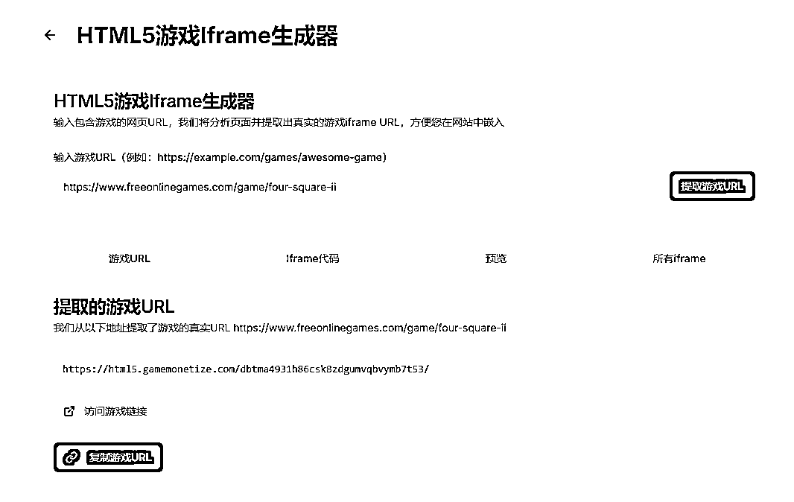
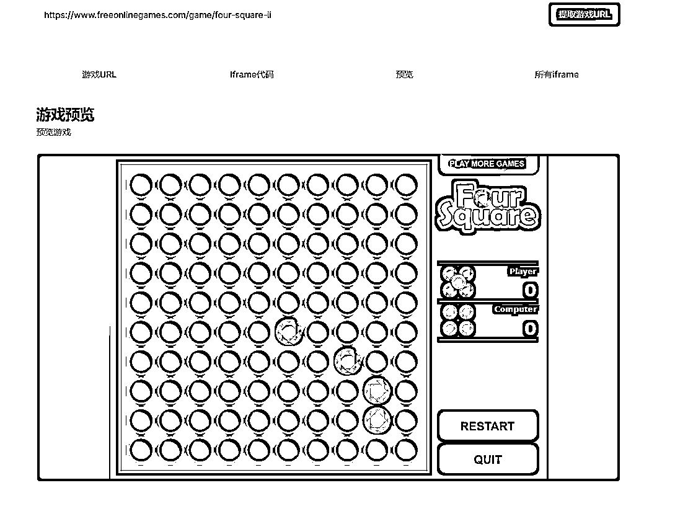
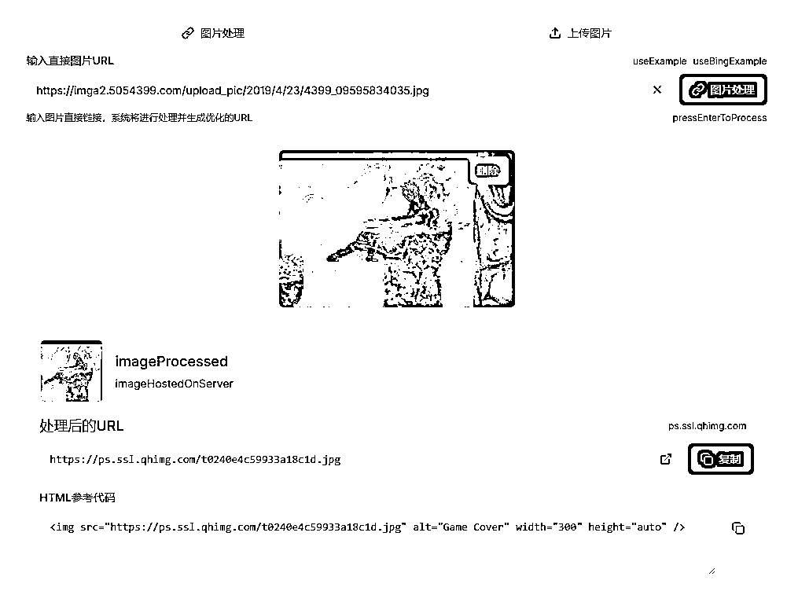
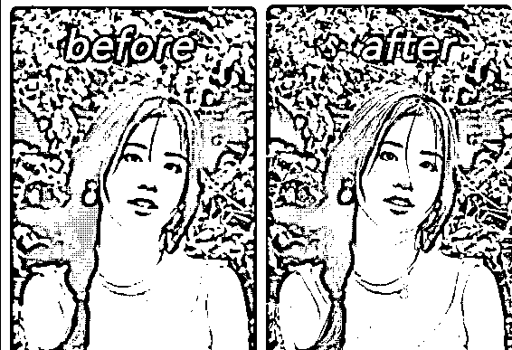
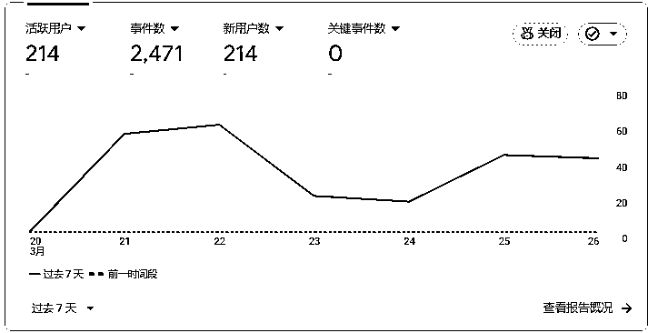
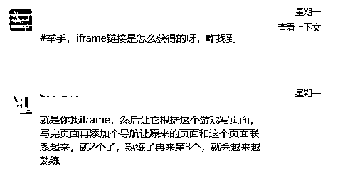
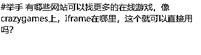
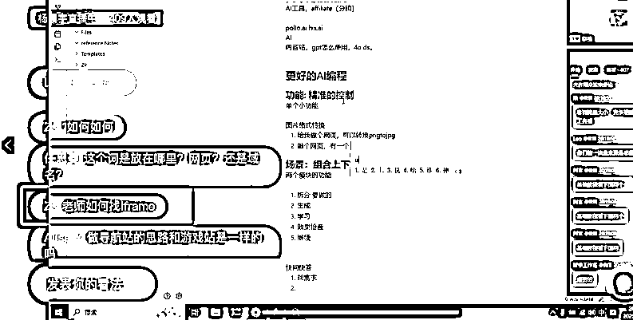
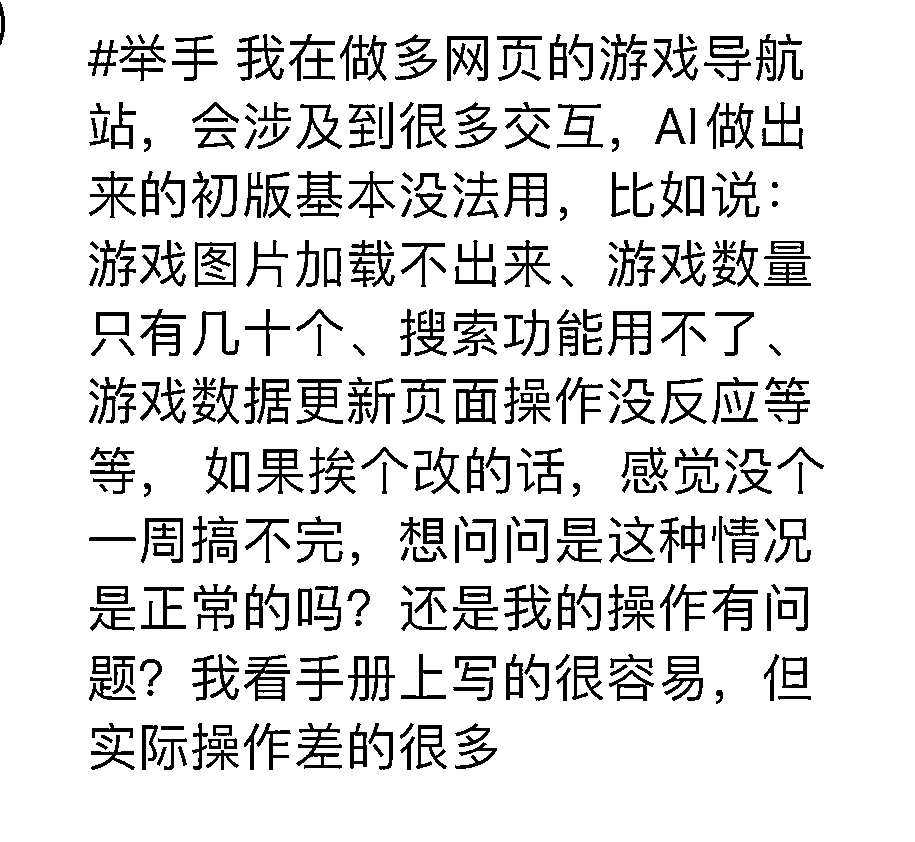

# 《在航海中找需求，用cursor做了一款游戏站快速获取iframe工具》

> 来源：[https://ubmao208bn.feishu.cn/docx/RYvqdiOLxo7An9xFHOeccKNYn9t](https://ubmao208bn.feishu.cn/docx/RYvqdiOLxo7An9xFHOeccKNYn9t)

hello大家好，我是参加这一期web编程航海的船员。加入生财三年多了，但这次是头第一回发长文，因为这次感觉真的可以实际帮助到和我一起参加航海的圈友们，为大家提高效率，闲言少叙，直奔主题。

# 一，功能介绍

https://gamingtoolshub.top/这是我参加这次航海到目前做的第二款工具，工具功能很简单，就是可以从其他游戏网站页面中获取到iframe,embed,或者是名为game_url这种json格式下，隐藏下的游戏源url。

可以采集的网站我放在了飞书文档 ，因为每个网站反爬虫的规则不同，有些是动态页面的，有些是国内不让访问的，这类网站要专门写代码，所以如果准备常做游戏站出海的，大家都可以编辑增加新网站，我来完善功能，具体功能如下：

还有一个简单的功能是获取游戏封面正常的src的url地址，避免直接复制别人的游戏封面会出现图片破损的情况。

今天也收到了我们群里圈友的反馈很开心：

# 二，为什么做这款工具

参加了这次web航海的圈友应该都知道，如果是按照航海手册进行，那么实操的第一个章节的主题就是，上线属于一个自己的游戏站。因为我也是按照航海手册一步一步进行的，自然也上线了属于自己的游戏站，在这个过程中遇到的第一个卡点就是，找到一个想上的游戏或者在某个网站看到一款自己相中的游戏，也想上架到自己的网站上，结果要花好长时间去找iframe。

虽然大家都知道去找iframe，但是不找不知道，找起来是真的费时间。虽然有痛点，不过自己当时也没想弄这样一个工具，因为我的编程也就停留在for，white循环阶段，以前也没做过网站，所以想着还是先把cursor驾驭熟练再说。

于是我花了差不多5天时间做了本次航海的第一款工具，一款可以图像增强的工具。这个工具是因为我过去喜欢摄影，我身边也有一些喜欢摄影的朋友，偶然聊天我发现也是个小需求，刚好练手所以就做了一款图像增强工具类似下面的效果。

虽然我知道当时市面上这种工具挺多的，但是和朋友圈能结合起来我感觉也有点意思。（ps：第一款工具的流量）后来发给我朋友，她说她要发给每个找她拍照的模特哈哈。

这些不是重要的，重要的是这个过程我发现大家用的都是css，html和javascrip最简单的组合，而我上来用boltnew生成的网页给我弄的是什么next.js框架，我当时也不懂，但是看着网站UI设计挺漂亮的不忍心扔掉，后面做出来的网站因为有路由build静态页面还部署不了，迟迟不能上线。

于是就一点一点学习了next.js基础，api调用，反爬虫，如何通过worker服务器代理，还有网站被微信屏蔽如何申诉等等...真的是一个卡点要花好久才能解决，解决这些问题的过程中也为开发这款工具积累了一些经验，大家可以选择一种难点的语言，虽然会遇到更多问题，但是进步很快。

因为航海群里的消息每天我都会看一遍，直到我做完第一个工具我发现还有很多圈友再问“怎么获取游戏frame”。甚至今天直播都有圈友还再问这个问题。

虽然有圈友已经洞悉到这个需求了，但是没人满足需求，而我刚好像感觉目前我会的东西应该能比划一下了，于是花了一天时间做了这款工具。

还有图片src功能也是根据圈友在群里聊天中发现的：

# 三，新人怎么能让cursor做出这种的工具

我目前也是小白阶段，下面是我目前做工具web的流程。希望可以帮助比我更加小白的圈友，大致步骤如下（仅供参考）：

1.我会先和deepseek聊，我想做什么样的东西和他探讨一会，然后我就会和他说好的我现在就要做这样的一个东西，你现在是一名非常优秀的UI和UX设计，但是我要找我的另一位优秀的设计师朋友blotnew请你给我提示词。

（然后他就会给你非常精准的UI设计提示词，当然你可以脑补一下这些提示词生成的画面，修改一些细节)

2.我会告诉blotnew采用next.js技术给我生成个网页，内容如下：复制刚刚的提示词。他就会给你生成一款令人满意的设计内容。把代码下载下来，再用cursor打开。

3.然后终端运行安装必要的库npm install，再运行npm run dev，你就可以成功打开刚刚你在blot看的界面。

4.我觉得很重要，你最好要理解next.js框架下每个文件的功能，如果不知道很难约束cursor的行为，我喜欢用的提示词：你是一个高级程序员请检查所有代码充分的了解这个项目，并回来告诉我每个文件是做什么的，我是超级编程小白越详细越好，用中文。（这个提示词要常用，因为每次你准备开发一个与上一个不太相关的功能时要记得新建一个new chat那么最好第一句话就发给他这个）

5.之后你会对项目结构有个大概的了解，比如UI设计每个框都是对应什么功能，如果你要给这个框里加功能最好能@一下这个文件。如果在这个UI基础上新设计内容，最好让cursor先进行UI设计不要让他UI和功能同时进行不然很容易出错。

6.实现功能板块，我认为真的要掌握一些代码基础，比如你直接和cursor说给我找到游戏网站里的iframe，大概率他都是找不到，要不就是找的不精准。你可能需要和他讲你要用正则表达式，有些游戏的url不在iframe里可能再embed里，或者你要查看网页源代码自己找到真正源url截图给他，他才醒悟原来这个网站的游戏隐藏在了json当中。

相反如果你不知道embed标签或者json这些概念，那么甚至都不知道该怎么向cursor提要求自然就实现不了这些功能，这个环节我最喜欢的就是和豆包打电话，比如问他typescrip和javascrip的区别，next.js最核心的20个关键词...

7.然后功能和设计都翻译后，就是上线，我一般会用vercle因为他比较支持next.js不用安装库，会和cursor说：接下来我要配置到vercle上，你检查下没少什么文件吧，仔细检查。弄好了把代码上传到vercle就实现了。

这个环节没有贴图是真的不知道怎么贴，因为和cursor交互得有上百条问答环节。

tips：最好多用截图功能发给AI让他回答问题。常识简单问题用好豆包，和豆包打电话效率比问deepseek高出好几倍。

# 四、总结和展望

基本上述内容就是从我为什么要开发这个工具，和如何让cursor开发的一个逻辑，希望可以帮助还在寻找游戏iframe浪费时间的圈友们节约一些时间。

如果大家有什么好的想法，后续准备继续做游戏站的小伙伴们，也可以加入你们想获取源游戏url的大型网站，或着有其他需求都可以在留言告诉我，这样大家都不会缺游戏素材，我们一起来慢慢完善这个工具（虽然目前技术可能有限，但也会尽力满足大家的要求）。

然cursor很厉害了，但是还是建议大家花些时间了解下编程代码基础，不然真的难于上青天。目前还有很多地方存在欠缺，后续还要学习提升自己如何进一步提高自己的编程能力，如何推广，如何做SEO，如何找关键挖需求...，希望这次web航海期间可以和同行的圈友们，持续精进，共同成长，航海结束后都能做出一个相对让自己满意的作品。