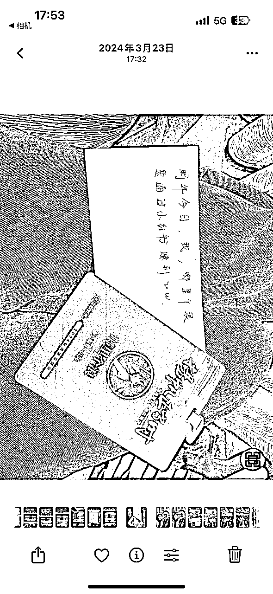
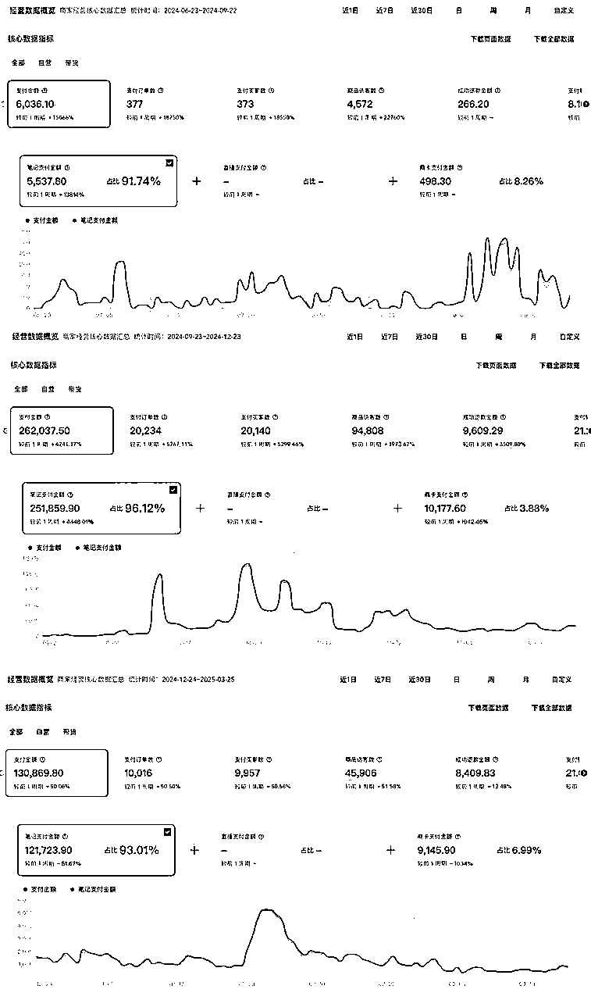
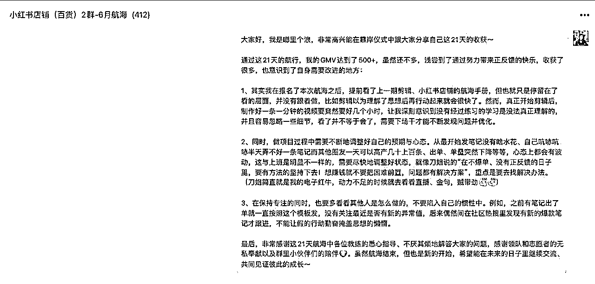
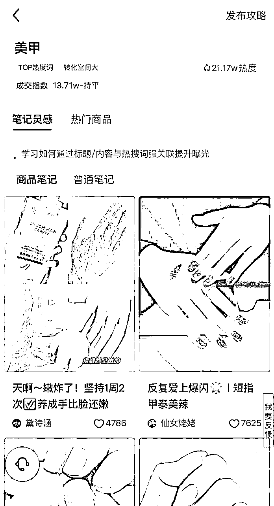
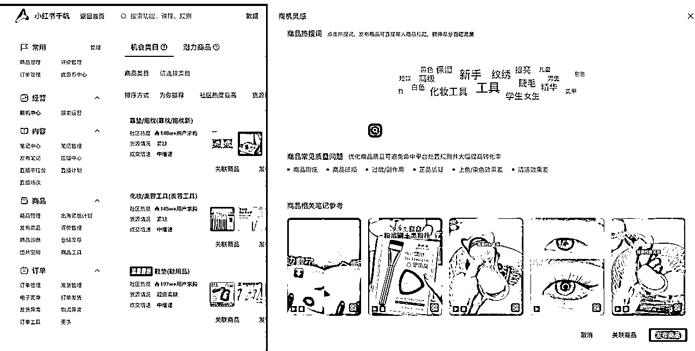
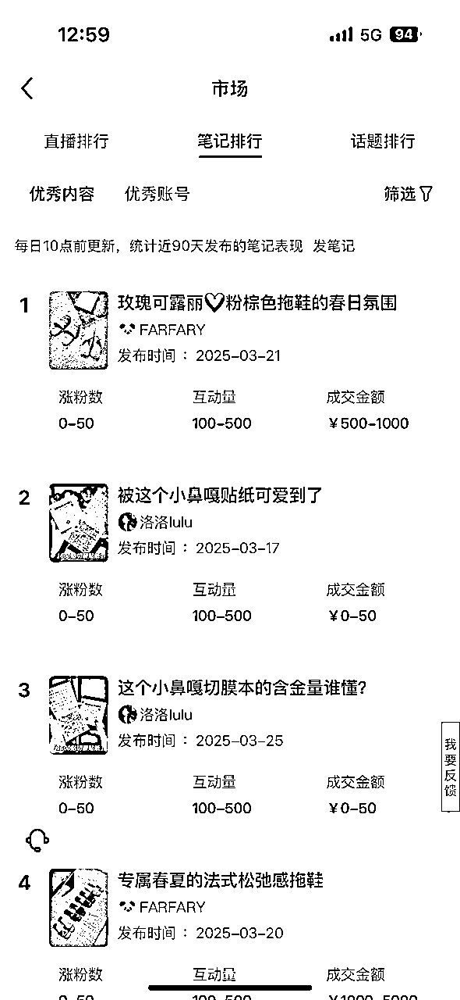

# 从生财小白到小红书电商爆单：我的2年生财之路踩坑与复盘

> 来源：[https://mpiymj8zzz.feishu.cn/docx/SCzxdrAfyohWyIxBG5Oc5Rdnn0x](https://mpiymj8zzz.feishu.cn/docx/SCzxdrAfyohWyIxBG5Oc5Rdnn0x)

大家好，我是林汐然，大家可以叫我汐汐、汐然（原名啷里个浪，这个名字给很多圈友都带来了困扰，都不知道该怎么称呼我，改名喽～）

我主业原是程序媛，后面竞聘转岗协助研发总监管理部门，副业做的小红书电商，最近刚刚离职把小红书电商扶正，来生财联合办公开启我的轻创业之路。

去年3月份我参加了线下航海家见面会，时过一年当时写下的目标现已达成，今天来交作业啦～

（利润率50%+）

加入生财2年，我从生财小白，尝试失败了三个项目，从赚到第一块钱到小红书电商爆单，一路走来有太多想要和大家分享的了。

本文重点是给大家分享我的成长历程和做小红书电商的经验和方法，还有机会，期待大家看完也能搞💰

接下来从几个部分给大家分享：

1⃣️ 生财历程——从0开始到赚到 20w

2⃣️ 小红书爆单历程与复盘

3⃣️ 新手做小红书电商的8个技巧

4⃣️ 加入生财 2 年的感悟

# 一、生财历程——从0开始到赚到 20w

从什么也不懂，看帖子都要先查很多名词是什么意思，到赚到第一块钱，再到小红书爆单赚到20w，我经历了几个重要的阶段，如果你是还没有拿到结果的小伙伴，可以参考我的历程。

## 生财缘起

之前机缘巧合下加了一些圈友，发现他们都同时在安利生财（当时还不知道是拉新季），就很好奇生财到底是什么，我也想进去看看。418拉新前，只要涛哥有直播我不加班的情况下就都进去听，涛哥次次讲的都不重样，简直被涛哥直播迷住了，心想他怎么这么厉害好像什么都知道，生财应该很不错，再加上有年度优惠就付费加入了。

## 加入后初感受

就像刘姥姥进了大观园，打开了新世界，不时发出感慨：哇塞！这也可以？好牛啊！原来除了上班，竟然还有这么多赚钱的方式！

慢慢地逐渐陷入了大家都好厉害，就我这么菜的感觉，陷入了迷茫，那我可以做什么呢？

## 三个项目失败

我先后试了三个项目，都失败了，踩了几个新手很容易踩的坑：

#### 第一个坑：盲目选项目，流量≠变现

听说小红书对普通人有非常大的红利，于是第一次航海报名了小红书运营航海，当时具体做什么是没有定方向的，需要大家根据自己的情况确定方向、做账号定位。

一方面，我没有产品和服务可以提供，从擅长和喜欢出发，感觉自己好像也不专业，没太多值得公众分享的（大家不要像我一样，你认为是常识的东西真的很可能很多人都不知道，不信你看之前因教人如何坐高铁地铁等而走红的打工仔小张的评论区）；另一方面我刷小红书看的样本也不够多，思维比较局限，不知道可以做什么。

觉得这样空想下去不行，得赶紧干起来。在没有充分调研了解同行的情况下，就盲目选择了看起来数据还不错、制作起来似乎也不难的文案号。发布了笔记后确实流量还行，一度陷入了虚假的流量繁荣。直到有一天，一个pr给我发邮件邀请合作，我兴高采烈地加了对方v，她告诉我一篇笔记合作就给10块钱，满怀期待的心一下破碎了，我这才去研究了下同行的情况，之前的头部基本都已经停更了，中小粉丝账号接的大多商单都是一眼就能看出是广告的笔记，报价都不高。

#### 第二个坑：缺乏对标思维

夏天快来了，凭需求和兴趣(女生大多不是在减肥，就是在想减肥的路上)选择了减肥赛道，切了一个细分——小基数梨形减脂塑形，分享运动和饮食经验。虽然第 13 篇笔记就小爆涨了几百个粉丝，但没有吸取第一次项目失败的经验，事先没考虑好变现方式，想快速赚到钱又不想骗别人，这个账号就停更了。

回过头来看，是可以再多了解下其他同行的变现方式，再决策是否要继续运营的。

#### 第三个坑：缺乏迭代思维

经过了前两个项目，我觉得在小红书运营上比之前略明白了一些，碰巧看到航海关于小红书有了定向的主题—小红书旅游，我又报名了。运用之前学的，再加上自己之前也经常在小红书搜旅游攻略，更能从用户视角上知道大家关心什么，写了几篇爆款笔记。

不像卖货可以直接在平台上直接成交，这个项目是需要先把客户引流到微信上再谈单。我遇到了新的问题：

1、想要白嫖平台的流量，引流到微信的方式是需要不断变化避免被平台发现的。我也尝试了一些引流方式，今天方法可以，但明天可能就行不通了。

2、我是前端流量到谈单都是由我自己完成，对于回复的及时性要求比较高，而我白天要上班，稍微回复不及时客户就不再理我了。

从前端流量获取到引流微信，流失了非常多的流量，当时又比较短视，没有尝到甜头，尝试了一些解决方法但都停留在表面，没有再深入研究浅尝辄止。

平台要发展要赚钱要留住用户，势必是要跟着平台的发展不断调整策略的，不能指望偷懒凭一个套路就可以一劳永逸，需要不断迭代。

## 命运的齿轮开始转动

24年3月，看到要举办航海家线下见面会，嘉宾阵容据说是七年来最豪华的一次，毫不犹豫定了闹钟蹲守报名，当时我还不是航海家，特意请了2天假从成都飞杭州，就想去开开眼。

果然没有让我失望，除了分享的信息密度外，最令我触动的是，圈友们白天听分享，晚上夜话，甚至有圈友基本彻夜没睡都在聊业务，让我切实地看到、感受到一群爱折腾、爱搞钱又非常努力的鲜活的人，而且现场聊了后发现大家很多也都是尝试了很多项目、踏踏实实做才逐渐有了今天的成绩，我摒弃了作为搞钱小白短期暴富的幻想。

涛哥在会上让大家在纸上写下“明年今日，我，xxx，要通过xxx赚到xxx钱”，还没通过上班外的方式赚到一块钱的我，不知道写下什么目标合适，直到大会马上结束了，主持人说要将卡片交给工作人员，我这才颤颤巍巍地写下“明年今日，我，啷里个浪，要通过小红书赚到20w”。

也就是这股力量，让我莫名地相信自己可以，才开始了后面的变现之旅。

## 赚到第一块钱

回成都之后，我在生财上看到了一条风向标，立马去闲鱼上看了情况，我把在小红书上学到的对标思维运用了起来，仿着对标做图文、写文案，然后就真的出单了。后面有一天流量爆了，消息基本不断，虽然一单就挣几块钱，甚至最低的就几毛钱，我兴奋地连睡觉都不舍得开静音，生怕错过生意，半夜手机三点多响了都马上睁眼回消息。

后面发现很多同行都直接拿我做的图片去发布，甚至很多连水印都没去的，心里并没有生气，很开心我也可以成为别人的对标啦！

就这样通过这个风向标赚回了门票钱，让我体验到了通过非工资赚钱的快感，初步建立了原来除了上班，我也可以赚到钱的信心。

## 转战小红书电商，航海跑通流程

之前一直在小红书上没有变现，我觉得这回要干点离钱近的事情，报名了24年6月份的小红书百货电商航海。在航海开始前学习了上一期的小红书店铺、剪辑特训航海手册。确实反馈很快，发的笔记很快就出单了，21天航海期间共卖了500+GMV（客单价在基本在9.9），虽然还不是很多，但再次给了我“我也可以赚到工资以外钱”的正反馈。我觉得这事能干，航海结束后继续做了下去。后文会分享下我爆单的经验。

## 通过联合办公申请

下定决心从职场打工人转为自由职业。

## 申请加入航海家

跳出信息茧房，我也想开眼看世界。

与生财的故事，未完待续....

# 二、小红书电商爆单历程与复盘

我是从参加航海开始发布的第一篇笔记，测到第 18 个品才爆单的，在爆单之前基本每天都没用完过小红书10 个订单的解密额度，从零星出单到爆单我做对了哪些呢？

1、选品，多维度验证品的潜力

我发现这个品是看到它突然出现在抖音创意中心的，属于功能性有用类的品，刚刚在抖音上有起量，很早之前在刀姐的星球里也看过这个品，马上去小红书上看了表现：

（1）、看销量：

（a）按销量排序，有几个店的销量在1w+以上，最高销量是3w+，验证是大爆品，有小红书上有很大市场。

（b）销量高的店最近都没有测这个品，并且最新评价大都是几个月之前的，再往下翻了其它销量的商品，也没有看到近期加购较多的，初步验证出是过往周期爆的。

（2）、看内容表现：

（a）在多个时间都有笔记都爆过，再次验证有很大市场，爆品是重复的。

（b）看近期基本没有发这个品相关的笔记，极少量发的也是之前的脚本，再次验证是过往爆的，近期竞争很小。

（c）最近几个月虽然没有这个品的笔记爆过，但按需求搜索关键词，有笔记爆过，同时将这些封面保存下来留待测试。

（3）、看评价：

小红书和抖音上这个品的负面评价及评论较多，我在小红书上看到有组合售卖的（它跟另一个东西一起用），虽然销量远没有只卖单品的店高，但评价要好非常多，于是确定了单品低价引流+主推组合套餐的售卖方式，以降低商品负反馈、提升客单价。

2、第一时间执行，占据早期测品先发优势

当天晚上把抖音上新出现的脚本扒下来混剪，第二天早上把笔记发上去了。

测了大概10条笔记，小眼睛都不高并且一单都没有出，我停掉了对这个品的测试。尽管我前面已经反复验证了这个品是没有问题的，而且这个品的脚本和封面标题还有很多值得测的，我当时并没有测试到位，但我还是不够坚定以我当时的内容制作能力可以卖爆它，担心又错过了其他的品，转测其他的品

大家不要像我一样，如果前期判断品没问题的话，还是要坚持测试到位再换品。

3、看到有上升趋势后及时跟进，做好细节，重视人工干预

过了几天，突然连出了6单，感觉机会来了，回头继续发笔记测这个品，赶紧补人工干预（评论区维护、订单好评、晒单笔记）

4、爆款是重复的，老品需要新素材才能再次爆起来

抖音的最新脚本、这个品之前的爆款封面标题、同功能不同品/同需求没有带货笔记的爆款封面标题，我都拿来组合测试。

最终爆的几篇笔记都是：近几个月同功能不同品/同需求没有带货笔记的爆款封面标题+抖音新的脚本。

5、降低负反馈

除了之前说的主推组合套餐外，还有：

1、根据买家的反馈（如差评、咨询多的问题），优化商品细节、回复话术

2、制作使用方法的视频和图文教程

3、做好售后保障：及时联系买家处理差评、退款

# 三、新手做小红书电商的8个技巧

### 1、先完成再完美

对于新手来说，很容易陷入虚假努力。选了半天品，老想对比看看还有没有更好的品，以期可以一击即中，心理上压力很大，拿不到反馈行动上也自然慢慢会变惰性。看起来投入了不少时间，一直在选和看，却一直迟迟下不去手发笔记测。可能刚看好了品，第二天又发现了新的品，又想再观望下。

借用刀姐的话 “没有选出来好的品，只有测出来还不错的品，测品就是看在当下的时间以你的内容制作能力能不能把它卖爆”。如果当下你只能选到这个，那就先发上去再说。

实在纠结的话，又没有多余精力开新店铺，可以在一个账号下同时测2-3个品做数据对比，优胜劣汰。

### 2、选品

小红书电商最重要的就是选品，选品定生死，我比较喜欢用的选品方法是抖音选品、小红书站内选品，

（1）抖音选品

小红书是兴趣电商，抖音是兴趣电商的领头羊，所以可以站在巨人的肩膀上，去选在抖音上爆的在小红书上也非常有潜力的品。但需要注意的是：

*   小红书的用户人群和抖音上的不太一样，不要凭自己主观想法（我喜欢、我想要、我觉得），在抖音上火的未必在小红书上会爆，你(不)喜欢、你(不)需要也不能完全代表小红书用户的想法。

去小红书上看看真实表现（这个品有没有爆过、同类需求的品/素材有没有爆过），可以用品名、产品背后的需求/效果来延展搜索。

*   尽可能多刷多看培养品感、占据先发优势。每天都刷，刷得多了，自然可以更早地发现哪些品是新出来的并入场。我之前爆的那个品一开始出现在榜单上，后面就消失了一段时间，因为榜单只显示最近周期排名更靠前的品，有潜力的、爆发性没那么高的就会被pk下去了。

（2）小红书站内选品

*   三方平台：如灰豚，三方平台有滞后性，我目前基本没有用，基本全是靠手刷

*   养小号：看到同领域有低粉爆款的笔记都进行互动（点赞/收藏/评论/关注），时间长了平台会知道你喜欢什么，从而持续推荐，这样可能会更快地发现小红书的低粉爆款。

*   千帆：之前有商家榜单可以看到近期爆款带货笔记和账号，3月1日下架了，大家可以在以下几个地方看优秀同行来培养网感

*   社区热搜词

*   商机中心

*   数据中心-市场

（3）抱大腿

*   抖音：榜单上看到达人把A品带火了，可以点进达人看看近期还有没有其他品也表现不错

*   小红书：监测对标最近没有新上品

### 3、重视人工干预

重视人工干预，多看同行的玩法，蹲反馈、同行高赞/高互动评论（如惊喜盒子、搞笑评论、争议性评论、分享其他妙招...）、好评反馈等。

虽然并不是每条人工干预都一定起到大作用，但是做了就会拉高概率。借用雪姨在航海家大会上说的“赚钱是概率事件，你能做的唯一一件事情就是——想尽办法，提高概率”。人工干预做起来后真的太香啦！我有一个蹲反馈评论最开始有10+人跟，我回复完还有人再回复谢谢之类的话，直接30+评论到手，把笔记推向了更大的流量池。

### 4、善用、优化关键词

我的账号因为被关小黑屋限制了2次，担心再发违规概率会大影响店铺，有几个月没有发笔记，到现在还在持续出单，后期的搜索流量比较大，综合转化率在20%+，功能性的品比较吃搜索流量，可以适当多铺一些关键词。

关键词来源：

*   参考对标：对标怎么写你就怎么写，修改非核心内容。

*   小红书搜索关键词的下拉列表、关联词

*   千帆-社区热搜词：看自己做的类目热搜、蓝海、飙升词，以及优秀笔记都是这么用的

*   千帆-数据-搜索数据：看自己笔记大家是通过什么搜索进来的

### 5、细节做到位

我在航海期选的第一个品就出了单，虽然出的单不多，但是这给了新手小白的我足够的正反馈，非常兴奋，笃定坚信了刀姐说的“坚持发200条笔记，至少能赚到2w块钱”，觉得有第一单就可能有一百单一千单。当时我剪辑视频非常慢，牟着一股劲就想着要每天多发笔记，人工干预、数据分析、晒单全都没做，也没有及时监测最新的爆款，可以说出单全靠蛮力，结果可想而知，发了90篇笔记只卖出97单。细节做到位，在正确的方法上努力坚持才有助于更快地拿到结果。

### 6、靠谱的供应商很重要，感觉不对赶紧换，别犹豫！

流量获取后，供应商(产品质量、物流)和售后一定程度上决定了能走多远。

我爆的品，最开始1688上卖的实力商家不多，联系了一个供应商初始感觉非常配合，可能是因为当时有1000单现货要发吧。后面单量下来了，也就没那么及时响应了，每天都要花很多的时间盯发货、催揽收、处理物流停滞、破损补发，对方响应也不及时，但当时抱有一些损失厌恶心理，好不容易才讲价优惠的、又是辛辛苦苦对接的新系统不太想又重来一遍。坚持了一段时间，最终还是爆雷了，不光投入了大量精力，还因为丢了百八十单，被平台判定虚假轨迹扣了2分。

### 7、算好账，腾出时间做最重要的事

爆单之后可能大量的客服消息随之而来，大家可以找自己的家人朋友、临时花钱请人帮忙处理客服消息，将时间和精力投入到产出更高的事情上-选品测品。

现在小红书也有了智能客服，是免费的，如果消息量不大，并且能提炼共性的话，大家可以在里面自定义自动回复信息，降低响应时长、提升回复效率。

### 8、促转化、降低负面反馈

一个品总会有好的和不好的评价，有热度别犹豫，乘胜追击！没有完美的品，我们没法改变品本身的问题，但可以做一些力所能及的事情去减少负面评价的产生：

1.  商品优化

优化商品细节，根据用户的反馈（如评价、咨询多的问题），在能触达到用户的地方都进行体现（如sku名、商品详情图、笔记评论置顶等），可以一定程度地提升客单价、前置环节减少售后和差评。

当sku多的时候，用户往往容易难以决策，可以用🔥、90%的选择等等帮助用户决策。

1.  晒单有礼

晒单好评非常有助于提升转化，我观察自己小号做的晒单笔记小眼睛有很多，可见有很多买家是会通过晒单做购买决策依据的。也看到有同行的带货笔记没爆，但晒单笔记爆了，带动了销量增长。

1.  好评

有文字的订单评价会被平台随机选取显示到商品笔记评论区（显示为购后评价），这些优质的评价对于买家来说可信度更高，对商品点击率和转化率都有所帮助。大家可以主动邀请买家，尤其是在刚跟买家聊完天的时候，虽然只有极少数会同意，试一试总还是有机会的。（注意邀好评不要说的太直接太明显，会有被判虚假交易的风险）

1.  做好售后

态度好一点，想象一下自己是买到不称心商品的买家，期待得到怎样的回应，就知道该怎么去和买家沟通了，一般来说给买家红包补偿，大多买家都会同意友好处理的。一定不要让买家觉得你是在说她的不对，我曾经跟一个买家反复确认使用方法是否正确，买家觉得是不相信她，后面干脆退全款也不要、拒绝沟通拒绝协商。咱们的目的就是花小钱了事、赚更多的钱，那就没必要在耗费太多时间去跟买家纠缠，不如拿这个时间来测品。

当然，对于十分无理取闹的买家还是可以多坚持一下的，目前小红书还没有像pxx一样特别偏向买方，只要我们拿出合理的证据，即使投诉到平台也会认定投诉不成立。

【小tips】：

*   匿名差评，可以在电脑端登录千帆，筛选差评找到对应的订单号，再通过订单号到客服工作台搜索框/订单管理里搜索就可以直接找到买家。

*   常用话术可以整理到客服工作台话术库或者添加到手机输入法里（如讯飞输入法），这样就不用每次都手动输入重复内容了，同时也降低了响应时长。

# 四、加入生财2年的感悟

1、多参加线下，线下的体感是完全不一样的。线上聊千遍，不如线下见一面。

2、用战术上的勤奋，掩盖战略上的懒惰，是最大的陷阱。先考虑好变现方式再行动，多看看同行做的怎么样、怎么做的，单纯为爱发电很难持久。

3、万丈高楼平底起，不要眼高手低。当事情>自己的时候就是问题，遇到问题并不代表自己就能力不行，只是需要时间去解决，不要浅尝辄止，有那么多人都做成了，大概率下自己遇到的问题别人都经历过，都是有解决办法的。

4、心态是最好的风水，相信相信的力量！

# 写在最后

非常感谢涛哥(@杨涛)，让我下定决心加入生财，才有了这2年的成长。也非常幸运能遇到刀姐（@v小刀），她的真诚、认真、死磕到底的劲、强大的能量场真的让人忍不住想要靠近，妥妥的电子红牛！时常想这么优秀的刀姐还这么努力，我还有啥可以偷懒的呢！感谢许老师(@许老师～生财投资孵化)审核通过我的联合办公申请，让我从职场打工人无缝切换，感受到浓浓的创业氛围。感谢其他圈友们在过往中给我提供的帮助与建议。

最后想说，先完成再完美，经验是在实践中不断习得的，只要我们一直在行动，就一定会不断地遇到新问题，不断地解决问题的过程本身就是成长的过程。因上努力，果上随缘，与其每天忧心忡忡，不如稳住心态、耐下性子，专注做好当下该做的事，未来还没发生的就兵来将挡水来土掩吧！

希望这篇文章，能给大家带来些许的帮助，我走了那么多弯路取得了小小的阶段性成果，相信大家也可以不断翻过一座座山峰！

欢迎大家一起分享交流呀，让我们一起定个目标，写下：

“明年今日，我，xxx，要通过xxx赚到xxx钱”

共勉！！期待大家都能搞到💰！！！