# Raindrop.io：全平台所有终端都能使用标签管理工具

> 来源：[https://hcnbp72sxrxf.feishu.cn/docx/QrrQdpXJWoJ5NPxgPf4cu8Z1nvd](https://hcnbp72sxrxf.feishu.cn/docx/QrrQdpXJWoJ5NPxgPf4cu8Z1nvd)

# 介绍

如题：

不是只在谷歌浏览器，换其他浏览器（比如火狐），甚至换个手机（Safari可以用）都可以打开Raindrop.io

我们用Chome直接搜Raindrop.io，第一个就是官网啦

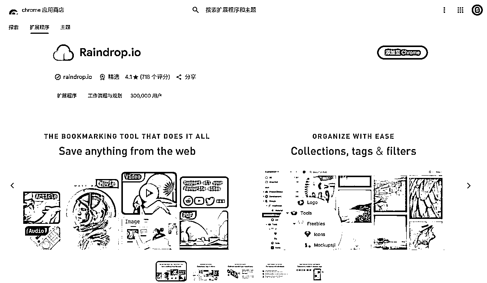

注册需要谷歌邮箱账号（推荐），国内apple store可直接关联，首次注册是苹果手机的话尽量不选apple id注册，咱用谷歌邮箱！方便电脑搭配使用

# 跟着官方看功能

raindrop.io官网帮助页面，可以重点看的3部分：

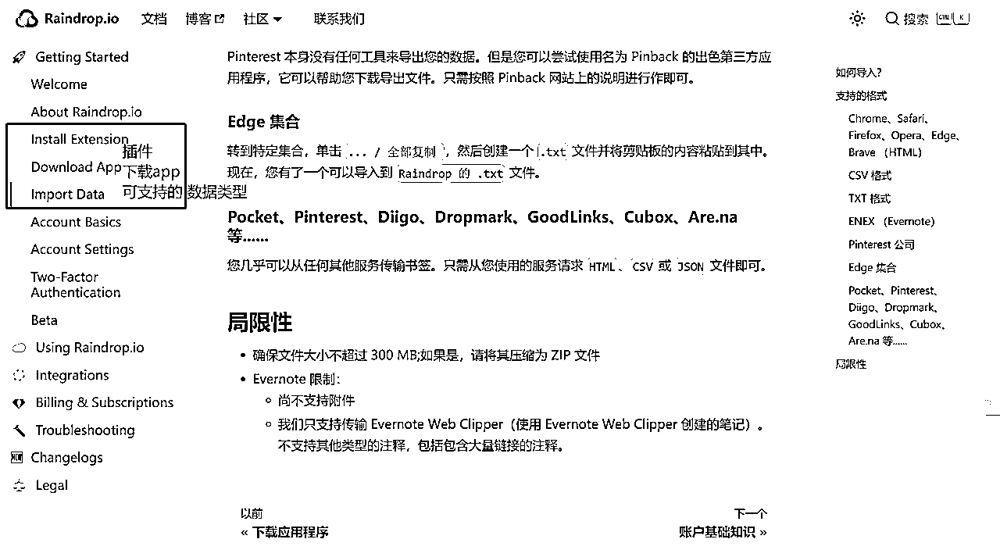

这里用到了沉浸式翻译插件，没有安装可以左转沉浸式翻译官网安装网页翻译插件

## 一、插件

### 安装

根据官网一步一步来就行，很简单。

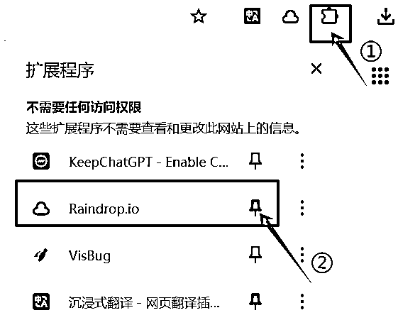

最后固定插件位置，右上角出现云朵标志后，遇到想收藏的网页直接点击，网页就能保存

### 使用

#### 3种建立书签的方式

1/可以在Raindrop.io的用户页面添加网址，出现在具体类别的收藏夹后再点击编辑备注和标签。

2/原网页右键点击空白处，可以直接创建书签

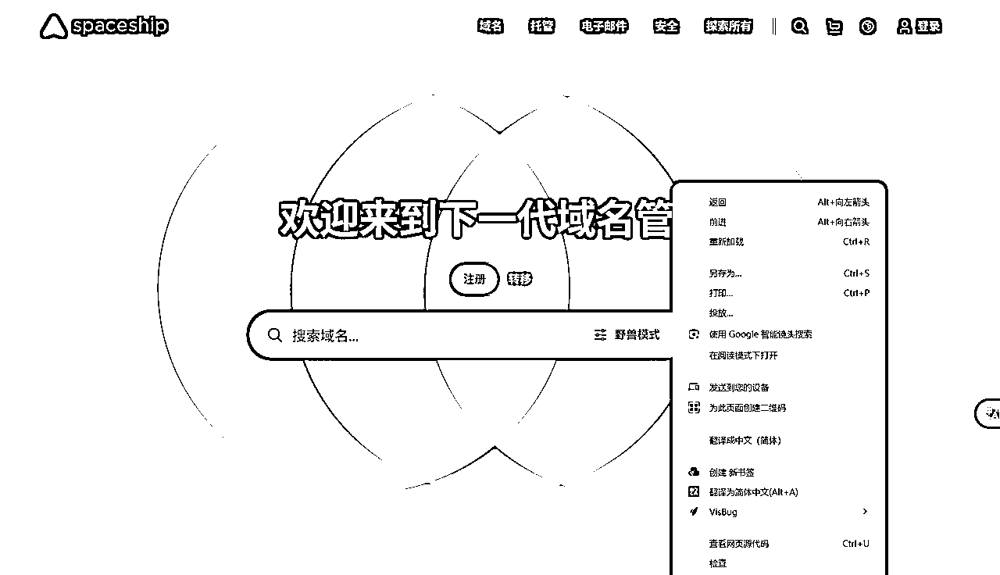

3/在右上角的☁标记处可以添加+编辑新建的书签——官方使用指南里的方法。

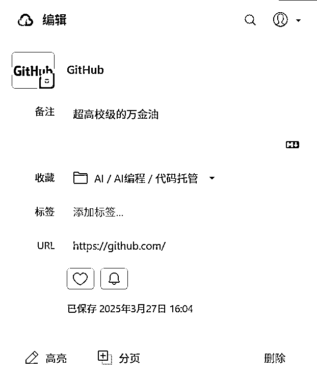

我们点一下云朵标志直接编辑卡片，编辑完毕后点下卡片区域内空白位置就算保存了

#### 在收藏夹下创建子夹

右键点击固定类别的文件夹“创建嵌套的的集合”建立一个小收藏夹，命名即可。可无限层级创建。

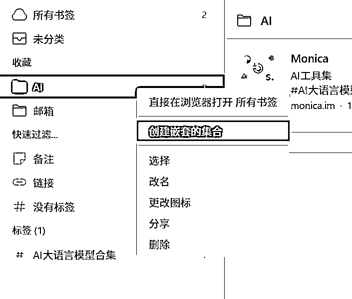

#### 用❤置顶标签

右键点击，添加至最喜爱的，解决了一个网址不能占用两个标签的问题。

快速过滤新增一栏【最喜爱的】，不自主设置是不会出现这一栏的。这样就可以迅速定位常用网站啦。

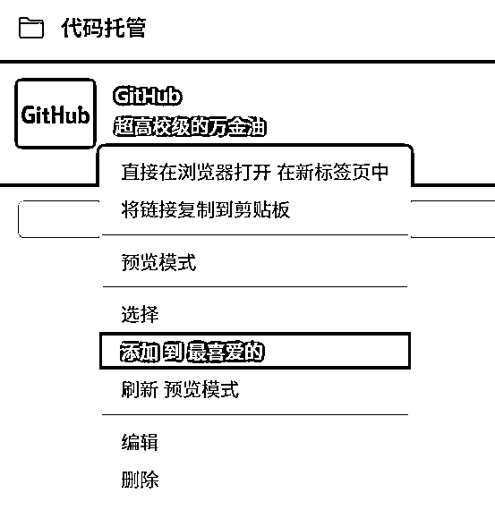

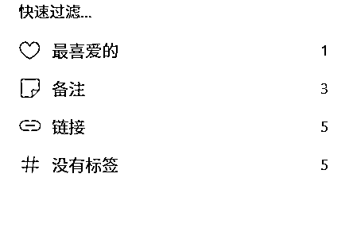

## 二、下载

国区手机可以直接下载app，安卓苹果都有，或者Safari苹果自带浏览器打得开登录，这个真的超方便！

## 三、可支持的数据类型

绝大部分都可以使用👇

# 导入书签

先从其他浏览器打开书签-导出书签选项-下载到桌面：

点击左上角账户-导入-上传档案，

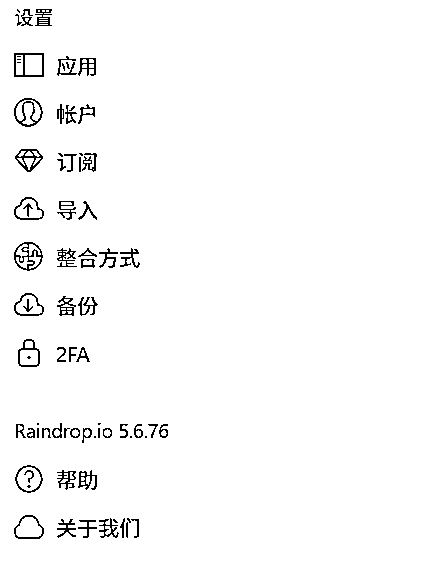

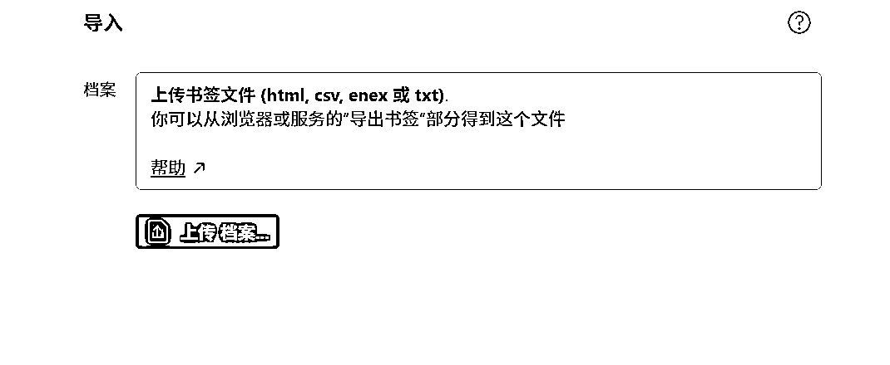

粘贴从其他浏览器复制过来的书签文件夹

大功告成！

最后我们调整一下收藏夹，这样看上去清爽多了！

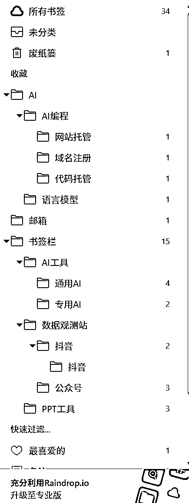

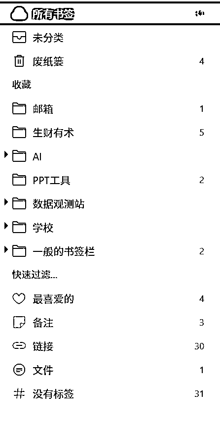