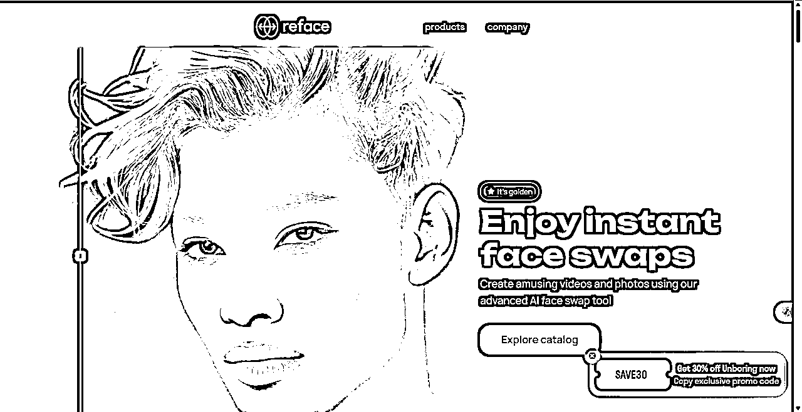
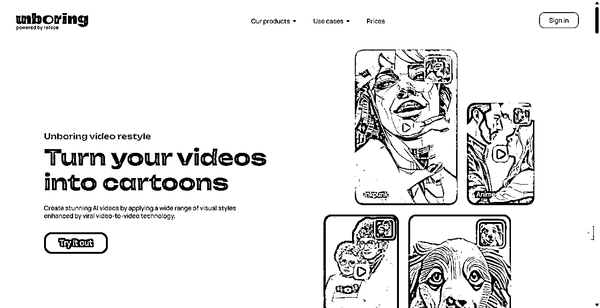
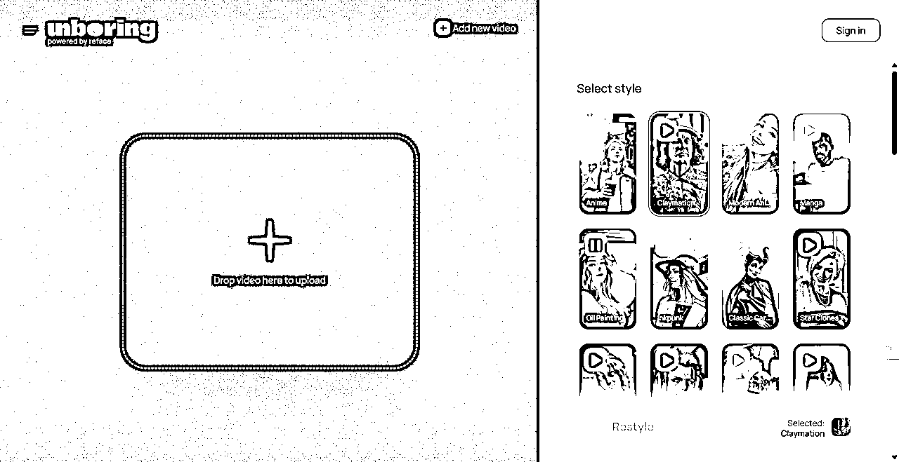
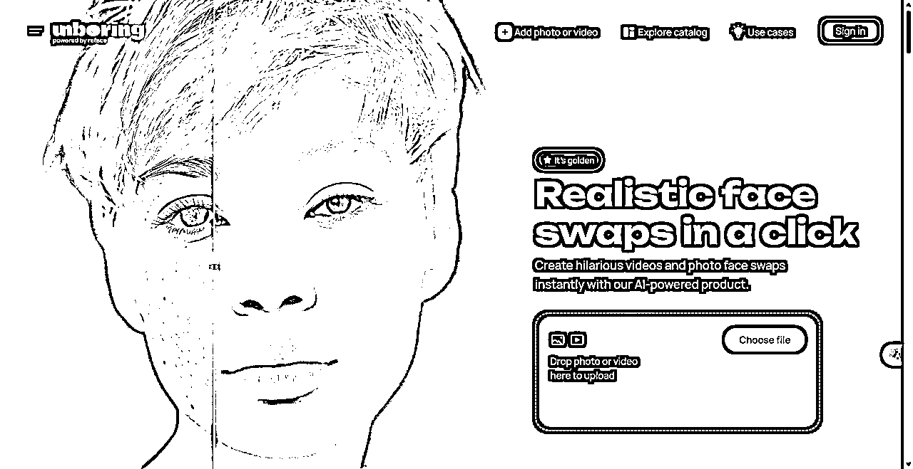
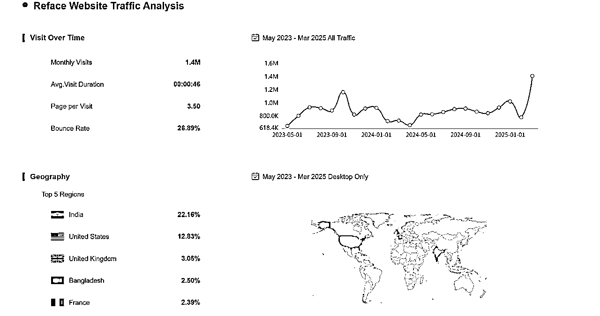
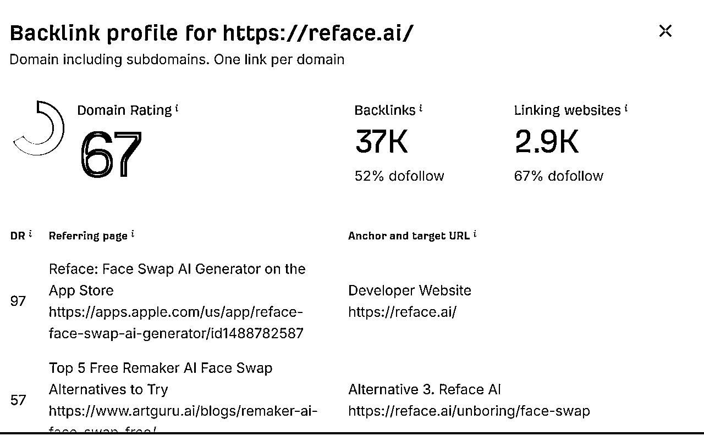
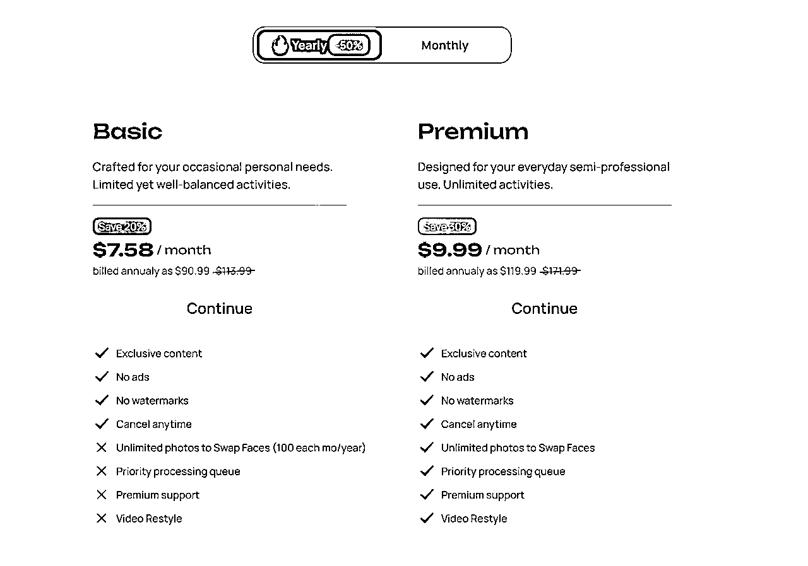
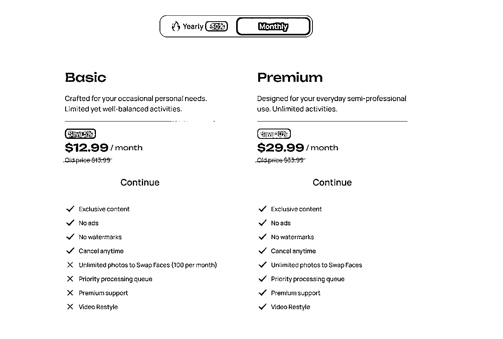

# 133 Reface

> 来源：[https://vz1gcav68m.feishu.cn/docx/PoUvduwxGojyj1xAguJcChignie](https://vz1gcav68m.feishu.cn/docx/PoUvduwxGojyj1xAguJcChignie)

# 更新日志

## 2025-04-16

*   随便看了一下发现，这个产品3月份居然被 ghibli 这个词带来了 差不多 50 w 左右的流量；

*   为了翻这个居然翻了好几次才翻到，总体非常隐藏；

*   整体感觉好混乱，每一个关键词的不同做不同风格的Loading Page，并没有统一的入口；

*   这个产品首页具体对应有 4个 移动端产品，其中一个app的MRR 高达 40w其他量相对少一些；

*   Meme 独特的方式，让产品有机会快速传播

# 基本信息

4个移动端产品

## 产品链接

https://reface.ai/

https://apps.apple.com/us/app/revive-ai-photo-animation/id1616862692?mt=8

https://apps.apple.com/us/app/restyle-ai-headshot-generator/id1667311093

## Loading Page

## 流量

### 基本信息

### 外链

# 产品分析

## 💡 产品价值：这个 SaaS 产品解决了什么核心问题？

*   核心价值与功能: Reface 是一款利用人工智能（主要是生成式对抗网络 GAN 或类似技术）驱动的移动应用程序，其核心功能是让用户能够将自己的脸（通过自拍或照片上传）无缝地“换”到各种视频、GIF 动图或静态图片模板中人物的脸上。它为用户创造的核心价值在于提供了一种简单、快速、有趣的方式来创作高度个性化、具有娱乐性和社交分享潜力的视觉内容。用户无需具备专业的视频编辑技能，即可生成看起来相当逼真（或至少是滑稽有趣）的换脸效果，满足了人们在社交媒体时代进行自我表达、娱乐和社交互动的需求。

*   细分市场: Reface 主要属于 AI 驱动的消费者内容创作 (Consumer Content Creation) 工具 市场，更具体地说是 移动端娱乐性图像/视频编辑应用 细分领域，特别侧重于利用 AI 实现“换脸”这一特定效果。它可以看作是传统照片/视频编辑工具在 AI 时代下的一个创新分支。

## 👤 目标用户：这款产品的典型用户是谁？

*   典型用户画像: Reface 的目标用户主要是广大普通消费者，特别是年轻群体（如青少年、大学生、年轻白领），他们是社交媒体（如 TikTok, Instagram, Snapchat, Facebook, Twitter 等）的重度用户，热衷于寻找新奇有趣的方式来创造和分享内容，追求个性和娱乐。他们通常不具备专业的编辑技能，需要简单易用的工具。没有特定的行业、职位或公司规模限制，主要面向个人（B2C）。

*   用户群体细分:

*   社交达人: 频繁在社交媒体发布内容，希望用新颖形式吸引关注的用户。

*   Meme / GIF 爱好者: 喜欢制作和分享搞笑动图和表情包的用户。

*   普通娱乐用户: 只是为了好玩，与朋友分享或自娱自乐的用户。

*   早期技术尝鲜者: 对 AI 新技术应用感兴趣，愿意尝试各种新奇 App 的用户。

## 🤔 用户需求：用户为什么需要这个产品？痛点是什么？

*   用户痛点:

1.  内容创作门槛高: 传统视频/图像编辑软件（如 PS, AE）操作复杂，学习成本高，普通用户难以快速制作出高质量的个性化视觉内容。

1.  缺乏新颖有趣的表达方式: 在社交媒体信息爆炸的环境下，用户需要独特、吸睛的内容来表达自己或吸引他人注意。简单的滤镜或贴纸已显平庸。

1.  时间成本: 即使使用一些简化工具，制作有趣的内容也可能耗费较多时间。

1.  娱乐性需求: 用户有通过轻松、幽默的方式进行自我娱乐和社交互动的需求。

*   产品如何满足需求: Reface 通过其核心的 AI 换脸技术，极大地降低了创作门槛。用户只需上传一张照片，选择模板，即可在几秒或几十秒内生成效果惊艳（或搞笑）的换脸视频/动图。它提供了新颖独特的视觉效果，满足了用户对个性化和趣味性的追求。整个过程快速便捷，迎合了快节奏社交环境下的需求。其娱乐属性强，非常适合社交分享，满足了用户的娱乐和社交需求。

## 🗣️ 用户评价：用户如何评价这款产品？（好评与差评）

信息来源综合自 App Store、Google Play 评论区、社交媒体讨论及部分科技媒体评测。

*   主要优点 (好评):

*   效果惊艳/有趣: 很多用户对其 AI 换脸的效果表示惊叹，认为非常逼真或极其搞笑。

*   简单易用: 操作流程简单直观，几乎没有学习成本。

*   内容库丰富: 提供大量且持续更新的视频、GIF 模板，涵盖电影片段、名人、搞笑场景等。

*   娱乐性强/病毒式传播潜力: 产品本身很有趣，易于引发用户在社交媒体上分享，带来乐趣。

*   速度快: 相较于手动编辑，生成速度快。

*   主要缺点 (差评):

*   订阅模式/价格: 免费版限制较多（如水印、广告、模板数量、处理速度、每日次数限制），而订阅价格（尤其是早期采用的周订阅）被部分用户认为偏高。

*   隐私担忧: 用户需要上传面部照片，引发了对个人生物信息数据隐私和安全性的担忧，担心数据被滥用（尽管公司声称有隐私保护措施）。

*   效果不稳定/Bug: 有时换脸效果不佳，出现扭曲、模糊或不匹配的情况；部分用户报告遇到 App 闪退或其他 Bug。

*   内容重复性/新鲜感下降: 对于长期用户，如果模板更新不够快或缺乏创新，可能会感到玩法单一，新鲜感逐渐消失。

*   广告干扰: 免费版中的广告体验有时被用户诟病。

*   道德伦理风险: “深度伪造”(Deepfake) 技术的潜在滥用风险（尽管 Reface 主要用于娱乐）是社会层面的担忧，可能间接影响用户观感。

## 🔍 获客渠道：它是如何找到用户的？

Reface 的获客策略高度依赖其产品的病毒式传播特性：

1.  病毒式营销/口碑传播 (核心): 产品本身生成的内容极具趣味性和分享价值。用户将自己制作的换脸视频/动图分享到 TikTok、Instagram、Facebook 等社交平台，引发朋友和关注者的好奇和模仿，从而带来自然增长。这是其最主要的获客方式。

1.  App Store Optimization (ASO): 优化在苹果 App Store 和 Google Play Store 的关键词排名（如 "face swap", "AI video", "funny editor" 等），提高搜索可见性。

1.  社交媒体营销/广告: 可能在 TikTok, Instagram, Facebook, Snapchat 等平台投放付费广告，精准触达目标年轻用户群体。广告素材通常直接展示产品最有趣、效果最惊艳的换脸案例。

1.  达人营销 (Influencer Marketing): 与社交媒体上的网红或内容创作者合作，让他们使用 Reface 创作内容并进行推广，利用其影响力带动下载。

1.  媒体报道/PR: 在产品上线初期或达成重要里程碑（如用户量激增、获得融资、推出重大更新）时，通过媒体报道获得曝光。其新颖的技术和快速增长曾吸引了大量科技媒体关注（例如 TechCrunch 等）。

## 💰 商业模式与收入：它如何赚钱？盈利状况可能如何？

*   商业模式: Reface 采用典型的 免费增值 (Freemium) 模式。

*   免费版: 用户可以免费下载和使用 App 的基本功能，但通常会有限制，例如：生成的内容带有水印、有广告干扰、可使用的模板数量有限、处理速度可能较慢、每日生成次数有限制等。

*   付费订阅 (Pro): 用户可以通过支付订阅费（通常提供周度、月度、年度选项）升级到 Pro 版本，以解锁全部功能和更优体验，例如：去除水印、无广告、访问所有高级模板、更快的处理速度、无限次生成等。早期似乎以较短的订阅周期（如周订阅）为主，后来可能调整为更常见的月度和年度订阅。

*   收入估算 (MRR/ARR):

*   估算依据: 准确的 MAU 和付费转化率是商业机密，难以获取。我们只能基于公开信息和行业基准进行非常粗略的估算。

*   用户基数: Reface 曾宣布在 2020 年达到数千万甚至上亿的下载量。我们这边根据web的流量进行预估 1.4M / 3.5 = 0.4 M

*   付费转化率: 消费级 Freemium 应用的付费转化率通常在 1%-5% 之间。考虑到 Reface 的娱乐属性和价格敏感用户，我们取一个相对保守的转化率，比如 1.5%。

*   ARPU (平均每付费用户收入): 按年和按月付费比例1:1；7.58 - 9.99 => 8.7; 12.99 - 29.99 => 21.49，最终确定平均每月 ARPU 为 15 美元。

*   移动端其中2款APP，统计的数据MRR分别为 400k 和 20k

*   估算结果:

*   MRR ≈ MAU × 付费转化率 × ARPU + 移动端MRR

*   MRR ≈ 0.4m × 1.5% × $15 + 420k ≈ $510k

*   ARR ≈ MRR × 12 ≈ $6,120k

*   重要声明: 这只是基于多重假设的粗略估算，误差可能非常大。 实际 MAU、转化率和 ARPU 可能与假设值有显著差异。

*   融资信息: 根据公开报道（如 TechCrunch），Reface (原名 Doublicat 的公司) 在 2020 年获得了由 Andreessen Horowitz (a16z) 领投的 550 万美元种子轮融资。后续可能还有其他融资，但未找到确切公开信息。这笔早期融资验证了其潜力和市场吸引力。盈利状况未知，可能仍处于投入期以维持技术研发和用户增长。

## 🧠 学习借鉴：我从这个产品身上学到了哪些值得借鉴的点？

1.  技术驱动的“魔法”体验: 利用前沿技术（AI）将复杂操作简化为“一键式”体验，创造出让用户惊叹的“魔法感”，这是引爆流行的关键。

1.  聚焦核心价值，保持简洁: 产品功能非常聚焦——就是换脸。没有堆砌过多复杂功能，使得核心体验突出且易于上手。

1.  强病毒传播设计: 产品生成的内容本身就极具社交分享属性，内建了增长引擎。思考如何让产品的产出物自带传播力。

1.  Freemium 模式的有效运用: 通过免费版吸引大量用户尝试，再通过付费订阅提供增值服务变现，是消费级应用常见的成功模式。关键在于平衡免费版的体验和付费版的吸引力。

1.  快速迭代与内容更新: 对于娱乐性应用，持续提供新的模板和内容是维持用户活跃度和新鲜感的关键。

1.  抓住趋势和时机: 在 AI 技术逐渐成熟、短视频社交爆发的节点推出，顺应了市场趋势。

## 🚧 挑战与壁垒：分析该产品，有哪些做法是我难以复制或实现的？原因是什么？

1.  核心 AI 技术壁垒: 开发出效果逼真且运行高效的换脸 AI 模型需要顶尖的机器学习人才、大量的训练数据以及持续的研发投入。这不是普通小团队能在短时间内轻易复制的，技术门槛相当高。

1.  先发优势与品牌认知: Reface 作为早期爆红的换脸应用，已经在全球范围内积累了大量的用户和品牌知名度。后来者需要付出更多努力才能获得同等的用户关注。

1.  用户基数与潜在的网络效应: 虽然不是强网络效应产品，但庞大的用户基数意味着更多人可能在社交圈看到 Reface 的内容，从而形成一定的认知优势和用户习惯。

1.  数据与模型优化: 持续运营中积累的用户行为数据和反馈，可以用来不断优化 AI 模型的效果和推荐算法，这是一个持续强化的优势。

1.  应对隐私与伦理挑战的经验: Reface 必须投入资源处理与面部数据相关的隐私法规（如 GDPR, CCPA）和伦理问题（如防止滥用），这需要专业的法律和公共关系能力。新进入者同样面临这些挑战，且可能缺乏应对经验。

1.  内容授权与合作关系: 部分高质量模板可能涉及版权内容（如电影片段），Reface 可能已经建立了一些内容合作或许可，这对新进入者可能是个障碍。

## 🤗 电梯演讲：如果我是产品创始人，如何用一句话向潜在用户推销它？

“想把自己变成电影主角或搞笑 Meme 吗？用 Reface，只需一张自拍，AI 就能让你在一秒钟内惊艳（或笑翻）你的朋友圈！”

## 🚀 创新机会：如果我做同类产品，可以有哪些差异化策略？

1.  更强的自定义与创作自由度:

*   允许用户上传自己的目标视频/GIF 进行换脸，而不仅限于官方模板库。

*   提供换脸后的二次编辑工具（如调整融合度、添加文字/特效、剪辑等），让用户有更多创作空间。

1.  细分领域深耕:

*   专注于特定文化或社区（如动漫、游戏、特定影视 IP 粉丝圈），提供高度定制化的模板和体验。

*   探索 B2B 应用场景（需极其谨慎处理伦理和授权问题），例如用于个性化营销视频、虚拟试穿（服装/发型，但需确保效果）、员工培训娱乐化等。

1.  技术差异化:

*   追求更高精度的面部表情/细节同步，提升真实感。

*   融合语音克隆/转换技术，实现音视频同步的换脸+换声（伦理风险极高，需严格控制）。

*   全身替换而非仅仅是面部替换。

1.  隐私优先策略:

*   强调设备端处理（如果技术可行且效果可接受）或更透明、更严格的数据隐私保护措施，以此吸引对隐私敏感的用户。

*   提供匿名化或模糊化选项。

1.  商业模式创新:

*   除了订阅，探索按次付费或模板包购买等模式。

*   为高级创作者提供更专业的工具套件和更高的收入分成（如果允许用户创作模板）。

*   差异化策略是否更好？

*   提供更强自定义和创作自由度的策略，可能更好地满足那些有更强创作欲望、但仍缺乏专业技能的“进阶”用户的需求。

*   隐私优先策略可能在日益关注数据安全的当下吸引特定用户群体。

*   技术差异化如果能实现显著的效果提升，自然是核心竞争力。

*   这些差异化策略的关键在于能否精准定位目标用户群，并在技术、产品体验或商业模式上真正做出优势。

## 🎉 可行性评估：我（或我的团队）有能力做出类似或改进的产品吗？

*   资源需求:

*   核心技术人才: 顶尖的 AI/机器学习工程师（尤其在计算机视觉、生成模型领域）、后端工程师（处理高并发、数据存储）、移动端工程师（iOS/Android）。

*   资金投入: 大量的研发投入（人才薪酬、算力成本 - GPU 服务器租赁/购买）、市场推广费用、法务合规成本。

*   数据资源: 用于训练和优化模型的面部数据（需要合规获取）、丰富的模板内容（可能涉及版权）。

*   基础设施: 可靠且能弹性扩展的云计算平台。

*   产品与设计: 优秀的产品经理和 UI/UX 设计师，确保用户体验。

*   法务与合规: 处理隐私政策、用户协议、版权问题、伦理风险评估。

*   资源匹配:

*   这需要基于“我（或我的团队）”的具体情况来判断。

*   技术: 是否拥有或能够招募到顶级 AI 人才？这是最大的瓶颈之一。

*   资金: 是否有足够的启动资金或融资能力来覆盖高昂的研发和运营成本？

*   数据/内容: 获取合规数据和丰富模板内容的渠道和成本如何？

*   市场: 是否有独特的市场切入点或渠道优势？

*   法务: 是否具备处理复杂法律合规问题的能力？

*   对于大多数初创团队而言，完全复制 Reface 的技术和市场地位是极其困难的。但如果具备某方面的独特优势（如特定 AI 技术突破、特定社区资源），并采取差异化策略，则可能存在机会。成本方面，尤其是 AI 研发和算力成本，对早期团队来说是巨大挑战。

## 🧭 我的用户获取：如果我做这个产品，我将如何找到我的第一批用户？

假设我采取了差异化策略（例如，专注于某个特定游戏社区的换脸工具）：

1.  深度融入目标社区: 成为该游戏社区（如 Reddit 子版块、Discord 服务器、相关论坛）的活跃成员，理解其文化、术语和热点内容。

1.  创作“种子内容”: 使用我的工具制作与该游戏高度相关、有趣且高质量的换脸内容，并在社区内自然地分享（避免生硬广告）。展示产品的独特价值。

1.  内测邀请: 在社区内寻找对这类工具感兴趣的核心玩家或内容创作者，邀请他们参与早期内测，收集反馈并建立早期口碑。

1.  与社区 KOL 合作: 与该游戏领域有影响力的小 V 或主播合作，让他们试用产品并创作内容分享给粉丝。

1.  利用现有平台: 在 TikTok、Twitter 等平台，使用与该游戏相关的热门标签发布用我的工具创作的视频。

1.  Product Hunt / BetaList 发布: 面向早期采用者社区发布产品，获取初始关注和反馈。

1.  建立等待列表/早期访问激励: 通过简单的着陆页收集早期感兴趣用户的邮箱，提供优先体验权或早期优惠。

核心是精准定位、深度互动、价值驱动，而非大水漫灌式的推广。

## ✨ 我的优势：为什么是我来做？我具备哪些独特优势？

这个问题的回答高度依赖于“我”的背景。以下是一些可能的独特优势：

*   技术优势: 我或我的团队在某个特定的 AI 子领域（如 3D 面部重建、表情迁移、低资源模型训练）有独特的技术突破或专利。

*   社区/领域优势: 我对某个目标细分市场（如特定游戏、亚文化群体）有极其深入的理解、人脉资源或影响力。

*   数据优势: 我能合规地获取到某种独特或高质量的数据集，用于训练出效果更好的模型。

*   设计/体验优势: 我有创造极简、有趣、病毒式用户体验的成功经验。

*   资源整合优势: 我有能力快速整合所需的顶尖人才、资金或战略合作伙伴。

*   独特的视角: 我能从一个不同的角度看待用户需求，例如更注重创作过程的赋能而非仅仅是结果的消费。

如果缺乏上述任何显著优势，那么进入一个已有强大竞争对手且技术门槛高的领域，将面临巨大挑战。

## ❤️ 热情与坚持：我对这个领域/产品方向有足够的热情吗？

这同样需要自我反思。我需要问自己：

*   我对 AI 技术本身及其在创意领域的应用是否感到兴奋？

*   我是否真正关心用户如何通过这类工具进行表达和娱乐？

*   我是否对所选的细分市场（如果采取差异化策略）充满热情？

*   当面对技术难题、用户增长缓慢、负面评论（尤其是关于隐私和伦理的质疑）、变现压力时，我是否有足够的内在动力去持续解决问题、与用户沟通、迭代产品？

*   我是否愿意并能够投入至少半年甚至更长时间，在可能没有显著回报的情况下，专注于打磨产品和验证市场？

如果答案是肯定的，那么热情将是支撑团队度过初创期困难的重要燃料。如果仅仅是看到了表面的“风口”或“乐趣”，而缺乏深层热情，那么在遇到挑战时很容易放弃。