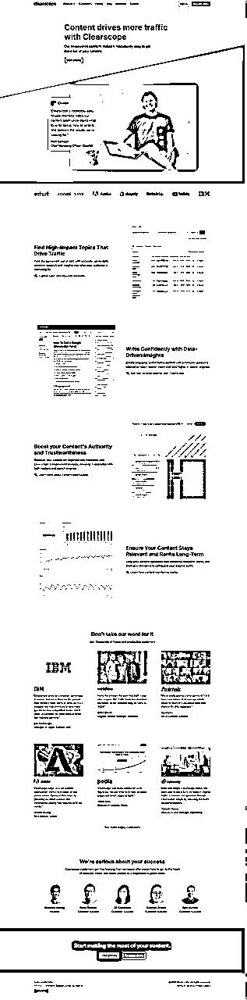
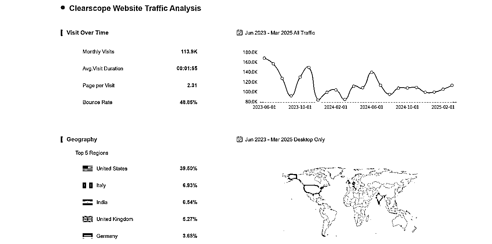
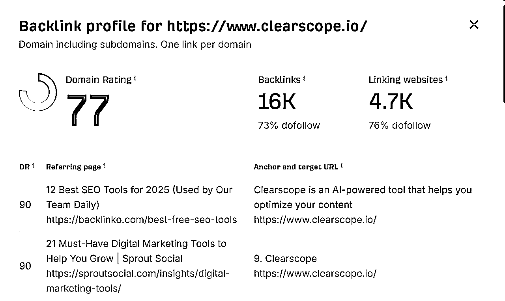
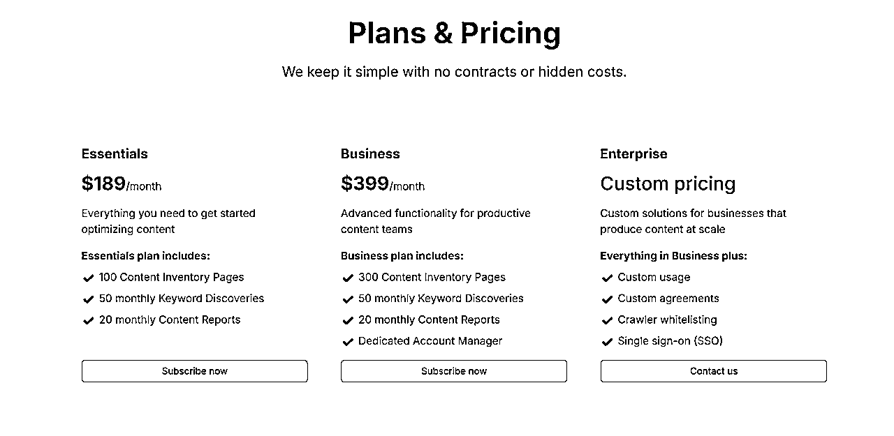
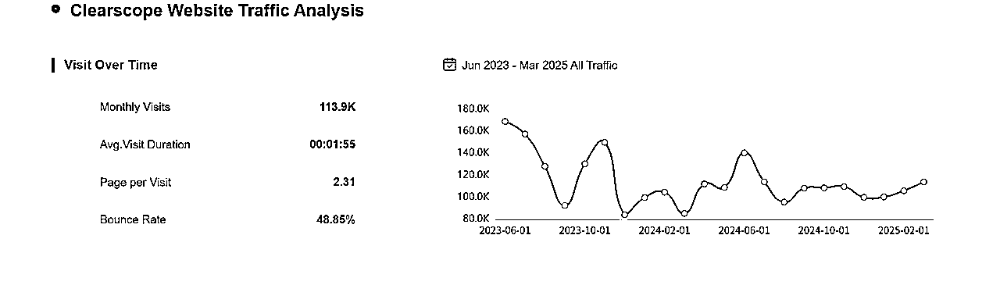

# 501 Clearscope

> 来源：[https://vz1gcav68m.feishu.cn/docx/D4ajdGqR4oWFsJxryRjcB20jnAb](https://vz1gcav68m.feishu.cn/docx/D4ajdGqR4oWFsJxryRjcB20jnAb)

# 更新日志

## 2025-04-11

*   这个产品感觉一个字 牛

*   从网站标题上来看，好狂啊；但看了一下确实是业内专家做的产品；这个产品的收入，可能更多是商务订单；

*   从我之前了解的 AI SEO 内容相关的产品来说，社媒返回的结果不是特别理想。但对着都是积极的态度，如果这个产品的整个完整的SOP，这种产品完全不用关心流量。

*   流量为啥下滑呢？

# 基本信息

标题

Clearscope: The #1 Content-First SEO Platform

描述

Clearscope is the #1 content-first SEO platform that empowers marketing teams to drive more traffic through streamlining SEO and content optimization, keyword identification, workflow management, and content monitoring.

## 产品链接

https://www.clearscope.io/

## Loading Page

## 流量

### 基本信息

### 外链

# 问题清单

## Clearscope 解决了什么问题？

Clearscope 是一款功能强大的软件工具，旨在增强数据驱动的内容开发、企业内容营销和自然搜索性能。它利用先进的算法和全面的数据分析，帮助企业创建高质量、针对搜索引擎优化 (SEO) 的内容，从而提高网站流量和用户参与度. Clearscope 的核心在于解决内容创建者在竞争激烈的在线环境中难以生产出能够获得高搜索排名并吸引目标受众的内容的问题.

具体来说，Clearscope 通过分析搜索引擎结果页面 (SERP) 中排名靠前的现有内容，为用户提供关于目标关键词的相关术语、内容长度、可读性等方面的实用建议. 这使得内容创建者能够更有效地理解谷歌等搜索引擎对高质量内容的期望，并据此优化自己的内容策略和执行.此外，Clearscope 还提供内容清单管理功能，帮助用户跟踪现有内容的优化水平和性能，以便及时进行更新和改进，防止内容过时而导致搜索排名下降.

通过自动化以往需要手动完成的内容优化过程，Clearscope 旨在帮助用户节省时间和精力，使他们能够更专注于创造引人入胜且具有权威性的内容，最终实现更高的有机流量和更好的业务成果.

## 用户是谁？

Clearscope 的目标用户群体广泛，主要包括以下几类：

*   内容营销人员和团队： 这是 Clearscope 最主要的用户群体，他们需要利用该工具来规划、创建和优化博客文章、网站页面等内容，以提升其在搜索引擎中的可见性，吸引潜在客户.

*   搜索引擎优化 (SEO) 专业人士： SEO 专家使用 Clearscope 来进行关键词研究、竞争对手分析和内容优化，以提高网站的整体搜索排名和自然流量.

*   数字营销机构： 代理机构利用 Clearscope 为其客户提供高质量的 SEO 优化内容，帮助客户实现其营销目标.

*   自由撰稿人和博主： 个人内容创作者可以使用 Clearscope 来确保他们创作的内容能够被搜索引擎有效索引，并吸引更多读者.

*   企业和大型组织： 拥有大量内容需求的企业，例如 IBM、Adobe、Shopify 等，也使用 Clearscope 来规模化其内容优化工作，确保其内容在竞争激烈的市场中保持领先地位.

总而言之，任何希望通过创建和优化高质量内容来提高其在搜索引擎中可见性并获得更多自然流量的个人或组织，都可以从 Clearscope 中获益.

## 用户为什么需要它？

用户需要 Clearscope 的原因主要在于它可以帮助他们解决内容创建和 SEO 优化过程中面临的诸多挑战：

*   提高内容在搜索引擎中的排名： Clearscope 通过提供数据驱动的关键词建议和内容优化指导，帮助用户创建更符合搜索引擎算法的内容，从而提高其在搜索结果中的排名. 许多用户报告称，使用 Clearscope 后，他们的内容获得了显著的排名提升和自然流量增长.

*   节省时间和精力： Clearscope 自动化了内容优化过程中的许多繁琐任务，例如关键词研究和竞争对手分析，从而节省了用户大量的时间和精力. 用户反馈表明，Clearscope 可以帮助他们每篇文章节省 1.5-3 小时的优化时间.

*   创建更全面的内容： Clearscope 分析排名靠前的竞争对手的内容，识别需要覆盖的关键主题和子主题，确保用户创建的内容比竞争对手更全面，更能满足搜索用户的需求.

*   提升内容质量和相关性： Clearscope 基于最新的 SEO 趋势和用户搜索意图提供可操作的建议，帮助用户创建更具权威性、更值得信赖的内容，从而提高用户参与度和转化率.

*   简化内容创作工作流程： Clearscope 与 Google Docs、WordPress 和 Microsoft Word 等常用内容创作工具无缝集成，使得用户可以在他们熟悉的环境中进行内容优化，无需切换平台，从而提高了工作效率.

*   确保内容保持长期有效： Clearscope 提供内容监控功能，帮助用户跟踪现有内容的性能，并在需要更新时发出警报，确保内容始终保持相关性并获得良好的搜索排名.

总之，Clearscope 为用户提供了一个强大而易于使用的平台，帮助他们更高效地创建和优化高质量的 SEO 内容，最终实现其在线营销目标.

## 用户是如何评价它的？包括好评和差评？

Clearscope 在多个用户评论平台和社交媒体上都获得了普遍积极的评价。

好评：

*   易于使用和直观的界面： 许多用户称赞 Clearscope 的界面非常友好和直观，即使是 SEO 新手也能快速上手.用户表示，他们可以轻松地培训其团队成员使用该工具.

*   有效提高 SEO 排名： 大量用户报告称，通过使用 Clearscope 的建议优化内容，他们的网站排名得到了显著提升，自然流量也随之增加. 案例研究也支持了这一点，例如 Webflow 通过使用 Clearscope 使非品牌关键词的有机流量增长了 130%.

*   出色的客户支持： 用户普遍对 Clearscope 的客户支持表示满意，称其响应迅速且乐于助人.

*   节省时间和提高效率： 用户反馈表明，Clearscope 显著缩短了内容优化所需的时间，使得内容团队能够更高效地工作.

*   提供有价值的数据驱动的见解： Clearscope 基于对排名靠前内容的分析，为用户提供关于关键词、内容结构、可读性等方面的实用建议，帮助用户创建更符合搜索意图的内容.

*   与其他工具的良好集成： Clearscope 与 Google Docs、WordPress 和 Microsoft Word 等常用工具的无缝集成受到了用户的欢迎，因为它简化了内容创作和优化工作流程.

差评：

*   价格较高： Clearscope 的定价相对较高，特别是对于小型企业、个人用户或预算有限的团队来说，这可能是一个显著的缺点. 一些用户认为，与其他替代工具相比，Clearscope 的价格并不具有竞争力.

*   关键词发现功能不够强大： 一些用户认为 Clearscope 的关键词发现工具功能有限，不如一些专门的关键词研究工具.

*   缺乏 AI 写作功能： 尽管 Clearscope 声称是 AI 驱动的平台，但它主要专注于内容优化，不提供 AI 写作或 AI 辅助的内容概要功能. 一些用户希望 Clearscope 能够提供更全面的 AI 功能。

*   报告分析可能复杂： 一位用户认为 Clearscope 的报告分析部分可能有点复杂.

*   报告更新不够实时： 有用户希望 Clearscope 能够更实时地更新报告，以反映最新的搜索结果变化.

*   对关键词密度过于强调： 有用户指出 Clearscope 对关键词密度的强调可能过重，而谷歌实际上并不将关键词密度视为重要的排名因素.

用户评论来源：

Clearscope 的用户评论可以在以下平台找到：

*   G2: Clearscope 在 G2 上获得了 4.9/5 的平均评分，用户称赞其直观的界面、提高 SEO 排名的有效性以及卓越的客户支持. 然而，一些用户也提到了其较高的价格.

*   Product Hunt: Product Hunt 上目前没有 Clearscope 的用户评论.

*   Backlinko: Backlinko 的一篇评测对 Clearscope 的内容优化功能给予了肯定，但对其基本的关键词研究工具提出了批评. Backlinko 的一项研究也表明，内容全面的程度（通过 Clearscope 的内容等级衡量）与更高的谷歌排名显著相关.

*   X (Twitter): Twitter 上关于 Clearscope 的讨论主要集中在其功能和与其他 SEO 工具的比较上，用户分享了使用 Clearscope 提高内容质量和 SEO 效果的经验.

*   YouTube: YouTube 上有许多关于 Clearscope 的评测和教程，用户分享了他们使用 Clearscope 进行关键词研究、内容规划和优化的经验，并对其易用性和有效性表示赞赏.

*   Reddit: Reddit 上关于 Clearscope 的讨论包括用户对其功能（特别是关键词清单功能）的评价，以及与其他内容优化工具的比较. 一些用户认为 Clearscope 的关键词清单功能非常有用，但也有用户提到其价格较高.

*   其他平台： TrustRadius 上 Clearscope 的评分为 8.0/10，用户对其内容研究和优化能力、关键词分析和竞争对手分析表示高度赞赏. GetApp 上 Clearscope 的评分为 4.9/5，用户称赞其易用性、功能和客户支持.

总的来说，Clearscope 获得了用户的高度评价，尤其是在内容优化、易用性和客户支持方面。然而，其较高的价格是用户普遍关注的一个缺点。

## 它是如何找到用户的？SEO 吗？口碑吗？投放吗？达人营销吗？

Clearscope 主要通过以下几种方式获取用户：

*   内容营销和 SEO： Clearscope 自身非常注重内容营销和 SEO。其官方网站和博客提供了大量关于内容优化、SEO 策略和 Clearscope 产品使用的教育资源. 通过创建高质量的 SEO 内容，Clearscope 能够吸引那些正在寻找内容优化解决方案的潜在用户.

*   口碑传播： Clearscope 的许多用户对其产品和服务表示非常满意，这自然会带来口碑传播。用户在行业论坛、社交媒体和评测网站上分享他们的积极体验，从而吸引新的用户.

*   案例研究和客户成功故事： Clearscope 在其网站上发布了许多案例研究和客户成功故事，展示了各种规模和行业的公司如何通过使用 Clearscope 实现了显著的 SEO 效果和业务增长.这些真实的案例有效地证明了 Clearscope 的价值，吸引了潜在用户。

*   行业活动和合作伙伴关系： Clearscope 可能会参加各种数字营销和 SEO 行业的会议和活动，以提高品牌知名度并与潜在客户建立联系。此外，它可能与相关的技术和服务提供商建立合作伙伴关系，以扩大其用户群体。

*   达人营销 (影响者营销)： Clearscope 可能会与 SEO 和内容营销领域的知名人士合作，通过他们的渠道推广产品，吸引他们的粉丝和受众。例如，Clearscope 的创始人 Bernard Huang 本身就是行业内的知名人士.Clearscope 还会邀请行业专家参与其网络研讨会.

*   网络研讨会和教育内容： Clearscope 定期举办关于 SEO 和内容营销的网络研讨会，邀请行业专家分享见解和最佳实践. 这些免费的教育内容吸引了潜在用户，并展示了 Clearscope 在该领域的专业知识。

*   搜索引擎广告 (投放)： 虽然研究材料中没有明确提及，但 Clearscope 可能也会进行搜索引擎广告投放，以针对那些搜索相关关键词的潜在用户。

产品访问量：

根据 Toolify.ai 的数据，Clearscope 的估计月访问量约为 10.6 万. 然而，需要注意的是，Similarweb 等第三方工具提供的网站流量数据通常是估计值，可能与实际数据有所出入. Ahrefs 是一款更专业的 SEO 工具，通常被认为在估计网站的自然搜索流量方面更为准确. 如果能通过 Ahrefs 查看 Clearscope 的流量数据，将能获得更可靠的估计。

## 它赚钱吗？多少？

商业模式：

Clearscope 采用订阅制的商业模式. 它提供多种不同的订阅套餐，以满足不同规模和需求的用户.

主要的套餐包括：

*   Essentials： 针对入门级用户，提供基本的内容优化功能和有限的报告及页面额度，月费为 189 美元.

*   Business： 针对有更高需求的内容团队，提供更高级的功能、更高的报告和页面额度，以及专属客户经理，月费为 399 美元.

*   Enterprise： 针对需要大规模内容优化解决方案的企业，提供定制化的功能、使用量和协议，价格需要联系 Clearscope 获取.

用户还可以根据需要购买额外的报告和内容清单页面. Clearscope 不提供免费试用.

估算收入：

根据 Toolify.ai 的数据，Clearscope 的估计月访问量约为 113.9K. 然而，这个数据可能包含重复访问，因此月独立访客数 (UV) 可能会略低。

根据 Page per Visit 可以故算出 MUV = 113.9K / 2.31 = 49.3k

转化率方面，由于 Clearscope 主要面向企业用户，且价格较高，保守估计转化率为 1%。

为了估算 MRR，我们需要考虑不同套餐的付费比例。由于没有公开数据，我们进行如下假设：

*   Essentials 套餐用户占比：60%

*   Business 套餐用户占比：30%

*   Enterprise 套餐用户占比：10% (假设平均月费为 1000 美元)

根据公式：MRR = 月 UV * 转化率 * (套餐 A 付费比例 * 订阅价格 + 套餐 B 付费比例 * 订阅价格 + 套餐 X 付费比例 * 订阅价格 +...)

MRR = 49.3k * 0.01 * (0.6 * 189 + 0.3 * 399 + 0.1 * 1000) = 164.218k 美元

其他市场里面并没有相关的产品

因此，Clearscope 的估计月度经常性收入 (MRR) 大约为 16.2 万美元。

需要强调的是，这只是基于一些假设的保守估计。实际的月独立访客数、转化率和不同套餐的付费比例可能会有所不同。此外，Clearscope 还可能通过提供定制化的内容营销和策略服务来增加收入.

## 我从这个产品身上学到了什么我以前不知道的东西？

*   采用 案例研究和客户成功故事 的方式去做推广；之前了解到这个很重要，但一直没有特别在意，但结合这个产品在来看，通过打造标杆，去收集更多的成功真实的案例本身就自带流量；

*   如何结合自己的优势，并结合自己的能力构建自己的影响力；

通过对 Clearscope 的分析，我学到了以下以前不知道的东西：

*   内容等级的细致划分： Clearscope 将内容质量和相关性细致地划分为 A++ 到 F- 的等级系统. 这种直观的评分方式能够帮助内容创建者更清晰地了解其内容与排名靠前内容的差距，并指导他们进行优化。

*   LSI 关键词的重要性及其在内容优化中的应用： Clearscope 强调使用与目标关键词密切相关的潜在语义索引 (LSI) 关键词来提高内容的全面性和相关性.这让我更深入地理解了搜索引擎在理解内容语义方面的能力，以及如何在内容创作中更好地利用 LSI 关键词。

*   内容清单管理对于长期 SEO 效果的重要性： Clearscope 提供的内容清单管理功能能够帮助用户监控现有内容的性能，及时发现需要更新和优化的内容. 这让我认识到，持续的内容维护和优化对于保持长期的 SEO 效果至关重要。

*   IBM Watson 在内容优化领域的应用： Clearscope 利用 IBM Watson 的自然语言理解技术来分析内容，提取元数据，并为用户提供可操作的建议. 这展示了人工智能技术在提升内容优化效率和效果方面的巨大潜力。

*   网络研讨会作为有效的用户获取和品牌建设手段： Clearscope 通过定期举办由行业专家参与的网络研讨会，不仅为潜在用户提供了有价值的教育内容，也有效地提升了其品牌在 SEO 和内容营销领域的权威性.

## 它的什么做法，我并不容易？为什么？

Clearscope 的一些做法对我来说可能不容易实现，原因如下：

*   与 IBM Watson 等先进 AI 技术的深度集成： Clearscope 能够利用 IBM Watson 的自然语言理解服务进行内容分析和优化，这需要与 IBM 建立合作关系并具备深入理解和应用这些复杂 AI 技术的能力，这对于个人开发者或小型团队来说可能是一个巨大的挑战，需要相应的技术积累和资源投入。

*   构建和维护高质量的搜索引擎结果数据： Clearscope 的核心价值在于其能够分析排名靠前的 SERP 内容并提取有用的信息。构建和维护一个能够提供准确、及时的搜索引擎结果数据的系统需要大量的技术投入和持续的资源维护，包括处理不同地理位置和语言的搜索结果。

*   建立广泛的企业级客户群： Clearscope 的客户包括许多知名的大型企业，例如 IBM、Adobe、Shopify 等. 获得这些大型企业的信任并建立长期的合作关系，需要强大的品牌声誉、完善的销售和客户成功团队，以及满足企业级客户复杂需求的定制化解决方案能力。

*   提供卓越的客户支持和培训： Clearscope 以其响应迅速且专业的客户支持而闻名. 提供这种水平的客户支持和免费培训需要投入大量的人力资源和建立完善的支持体系。

*   维持较高的定价策略并保持用户满意度： Clearscope 的定价在同类产品中属于较高水平.在维持高价格的同时，仍然能够获得用户的普遍认可和积极评价，这需要产品本身具有显著的价值和卓越的用户体验。

## 如果我是产品的作者，我如何只用一句话，把产品推销给用户？

“Clearscope：人工智能驱动的内容优化平台，助您轻松创作高排名、全面的内容，显著提升自然流量和 SEO 效果。”

## 如果我做一个产品解决同样场景的同样问题，我可能采用哪些和它不同的方法？我的方法比它能更好地解决用户的问题吗？

如果我做一个类似的产品，可能会考虑以下不同的方法：

*   专注于更亲民的定价策略： Clearscope 的高价格是许多潜在用户的障碍。我可以开发一个功能同样强大但价格更具竞争力的产品，或者提供更灵活的按需付费模式，以吸引更广泛的用户群体，特别是小型企业和个人用户.

*   更深度集成 AI 写作功能： 虽然 Clearscope 主要侧重于优化，但用户对 AI 写作的需求也在不断增长。我可以更深度地集成 AI 写作助手，提供更全面的内容创作流程，从研究、生成到优化一站式解决.

*   提供更全面的 On-Page SEO 分析： 除了关键词和可读性，我可以提供更深入的 On-Page SEO 分析，例如链接建设机会、Schema 标记建议、网站结构优化等，帮助用户更全面地提升内容质量.

*   开发更强大的免费增值或免费试用模式： Clearscope 不提供免费试用，这可能会让一些潜在用户望而却步。我可以考虑提供更慷慨的免费增值版本或更长的免费试用期，让用户充分体验产品的价值后再决定是否付费.

*   专注于特定的内容形式或行业： Clearscope 的目标用户群体较为广泛。我可以选择专注于特定的内容形式（例如，电商产品描述、技术文档）或行业（例如，医疗保健、金融），提供更定制化的解决方案.

*   利用新兴技术提供创新功能： 例如，可以探索利用更先进的语义分析技术、基于用户行为的个性化内容推荐，甚至语音优化功能，提供 Clearscope 所不具备的独特优势。

## 我能做出来吗？需要什么资源？需要的资源我能承受吗？

创建一个与 Clearscope 类似的产品需要大量的资源投入.

*   技术专长： 需要一个在人工智能（特别是自然语言处理和机器学习）、软件开发（包括 Web 开发和 API 集成）以及数据分析方面拥有深厚专业知识的高技能团队。

*   强大的基础设施： 需要可扩展的服务器基础设施、大量的数据存储能力来存储和处理海量的搜索结果数据，以及用于访问和抓取搜索引擎结果的可靠 API（同时遵守道德和法律准则）。

*   高质量的数据源： 需要从各种地理位置和语言获取全面且最新的搜索引擎结果数据，这可能涉及与数据提供商的合作或复杂 Web 抓取技术的应用。

*   无缝集成： 需要投入专门的开发工作来构建和维护与常用内容创作平台（Google Docs、WordPress、Microsoft Word 等）以及其他相关的营销和 SEO 工具的无缝集成。

*   专业的客户支持： 需要一个训练有素且响应迅速的客户支持团队，能够为具有不同技术水平的用户提供有效的培训、入门帮助和持续的技术支持。

*   有效的营销和销售： 需要一个对 SEO 和内容营销领域有深刻理解的强大营销和销售团队，能够制定和执行有针对性的产品推广和客户获取策略。

开发类似 Clearscope 的产品需要大量的资金投入，涵盖团队薪资、基础设施成本、数据采集费用、营销和销售投入以及持续的研发投入，以保持竞争力。

市场进入的挑战包括：

*   成熟且资金充足的竞争对手： 内容优化市场已经有 Clearscope、Surfer SEO、MarketMuse 和 Frase 等成熟的竞争者，它们拥有强大的品牌知名度、庞大的用户群和充足的资金支持。

*   需要差异化的价值主张： 为了吸引用户从现有解决方案转移，新产品需要提供引人注目且明确差异化的价值主张，无论是通过创新功能、卓越性能、更具吸引力的价格点还是专注于特定的细分市场。

*   建立信任和信誉： 获得 SEO 专业人士和内容营销人员的信任和信誉将是一个巨大的障碍，因为他们非常依赖这些工具的准确性和可靠性。

*   潜在的高客户获取成本： 在竞争激烈的市场中获取新客户的成本可能很高，需要明确且高效的营销策略才能实现正的投资回报率。

## 我如何找到用户？

寻找类似产品的用户可以采用以下策略：

*   有针对性的数字营销： 实施高度有针对性的数字营销活动，重点是通过 LinkedIn、行业博客和出版物、SEO 相关的社区和论坛以及目标受众经常使用的付费广告平台来接触内容营销人员、SEO 专业人士和营销机构。

*   内容营销： 制定强大的内容营销策略，围绕内容优化技术、SEO 最佳实践、使用新产品的好处以及与现有解决方案的比较来创建有价值且信息丰富的内容，旨在吸引在该领域积极寻找信息和解决方案的潜在用户。

*   免费增值或免费试用模式： 提供具有有限但有价值功能的引人注目的免费增值层级或延长的、功能丰富的免费试用期，让潜在用户亲身体验产品的核心价值主张，鼓励采用并转化为付费计划。

*   战略合作伙伴关系和合作： 与营销和内容创建生态系统中的互补工具和平台（例如关键词研究工具、分析平台和内容管理系统）建立战略合作伙伴关系，以扩大覆盖范围并为更广泛的受众提供集成解决方案。

*   影响者营销和思想领导力： 与 SEO 和内容营销领域的主要影响者、思想领袖和受人尊敬的声音合作，推广新产品，利用他们的权威和影响力在其粉丝中建立知名度和信誉。

*   积极的社区建设和互动： 创建并积极培育一个社区论坛、在线群组或社交媒体平台，用户可以在其中联系、分享反馈、提出问题并相互学习，从而培养归属感并为产品开发提供宝贵的见解。

*   卓越且主动的客户支持： 提供出色、主动和个性化的客户支持，包括全面的入门资源、随时可用的帮助以及致力于及时有效地解决用户需求的承诺，从而建立用户忠诚度和积极的口碑推荐。

*   清晰地突出独特的差异化： 强调并清晰地传达新产品与市场上现有解决方案相比的独特优势、创新功能或卓越性能，重点关注它更好地解决的特定痛点或提供的新功能。

*   实施早期采用者和 Beta 测试计划： 为早期采用者和 Beta 测试人员提供特别奖励、独家访问和反馈机会，以收集宝贵的见解，根据实际使用情况完善产品，并建立一批热情的拥护者。

*   开发强大的推荐计划： 通过为成功的推荐提供有吸引力的奖励或福利来激励现有用户推荐新客户，从而利用口碑营销的力量来推动用户的自然增长。

为什么是我？我有什么独特之处和这个产品需要的能力特别契合吗？

这一类的产品，本身需要对SEO 内容有丰富的经验和影响力；在没有这些的情况下，只能通过其他的方式进行补齐，是有挑战的。

## 我喜欢这个产品吗？或者说，如果半年我都没有正反馈，我能够在半年内持续不断地和用户沟通、迭代这个产品吗？

我对 Clearscope 本身及其所解决的问题表示认可。我相信内容优化对于在当今的数字环境中取得成功至关重要，而 Clearscope 提供了一个有价值的解决方案。

至于长期投入，在没有直接用户反馈的情况下持续迭代产品可能会很困难。然而，凭借我对市场的了解和分析能力，即使在最初的六个月内没有直接的积极反馈，我也能够利用行业趋势分析、竞争对手分析和对潜在用户需求的推测来指导产品的迭代和改进。与用户沟通并收集反馈对于产品的长期成功至关重要，我会积极寻求各种渠道与用户互动，了解他们的痛点和需求，并根据反馈不断调整和完善产品。

# 结论

Clearscope 是一款领先的人工智能驱动的内容优化平台，因其易用性和提高 SEO 效果的有效性而备受赞誉，尤其是在预算充足的大型组织和内容团队中。其优势在于用户友好的界面、有价值的关键词建议和无缝集成。然而，其高昂的定价以及在 AI 写作和页面分析等方面的局限性为竞争对手提供了机会。

内容优化市场竞争激烈但持续增长，这得益于自然搜索对于企业日益增长的重要性。虽然创建直接与 Clearscope 竞争的产品需要大量的技术和财务资源，但专注于价格合理性、集成 AI 写作或细分市场的差异化方法可能会取得成功。

最终，创建成功的竞争产品的可行性取决于对用户需求的深刻理解、提供优于现有解决方案的独特优势的引人注目的价值主张以及对创新和客户满意度的持续承诺。通过分析 Clearscope 获得的见解为探索此类机会提供了一个有价值的起点。