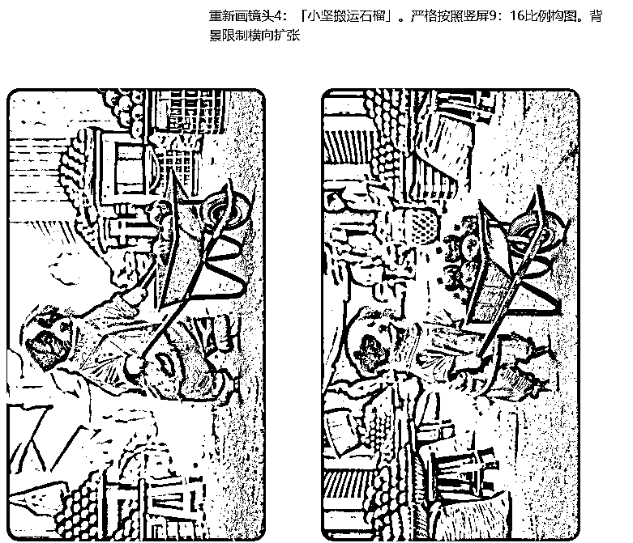

# Youtobe 第一次航海总结复盘 从“素人”到“航海者”的心路历程

> 来源：[https://p76vqogctb.feishu.cn/docx/VGMXdJilGohhUVx3AmgczwXYnHf](https://p76vqogctb.feishu.cn/docx/VGMXdJilGohhUVx3AmgczwXYnHf)

从“素人”到“航海者”的心路历程

大家好，我是老鹰，一个刚刚加入生财有术的“素人”。虽然这不是我第一次写项目复盘，但这次是我加入生财后的第一次航海，心情既兴奋又忐忑。兴奋的是，终于有机会系统地学习Youtube运营；忐忑的是，作为一个新手，我能否跟上大家的步伐，甚至做出一点成绩？

到目前为止，我的频道数据并不亮眼：订阅用户427，观看量6万。说实话这个数据在项目里可能算是“垫底”了。但我分享这个数据的目的不是为了比惨，而是想告诉大家：在航海前，一定要预设好合理的预期。当你看到最终的数据时，不至于因为落差太大而心态崩掉。

3月航海实战我不仅学到了很多技能，更重要的是我对自己有了更清晰的认识，这里分享一些自己在这次航海中的心路历程和一些感悟吧：

主要包括这四部分的内容：航海前的准备、正式航海的执行、遇到的问题及解决方法、最终的收获和下一步计划。

# 频道数据

这是截止目前为止我的频道的整体数据。订阅用户数427。观看量60000\. 还有比我更低的吗？当然放上这个数据的目的不是为了比惨，而是想说在航海前一定要预设好自己的合理预期。当你看到最后的数据的时候不至于产生较大的落差而导致自己的心力受损。

# 航海前准备：从“盲目尝试”到“目标清晰”

在3月份的Youtube航海开始前，我已经在1月份尝试过制作视频了。我按照航海手册找到了一个熊猫故事的爆款视频，试图模仿和复刻。但那时候的我，完全是一个“小白”，对视频制作的理解仅限于“完成视频”这个目标，没有想那么多。根本没有深入思考：为什么要复刻这个视频？它的爆点在哪里？这个视频的核心内容是什么？是否是自己喜欢的内容？自己是否有能力做到？

最后我花了一周时间完成了80%的内容，但最终还是没有完成。现在回头看，失败的原因很简单：“我当时还不具备复刻对标视频的技能”。讲这一段题外话的目的是，通过这一次失败的经历我对自己第一次航海的目标预设没有那么高了，因为我已经清楚的知道自己有几斤几两了。【设定目标时一定要量力而行】，不能好高骛远。

所以在正式航海前，我调整了自己的明确目标：

1.  掌握Youtube shorts视频的完整制作流程和所需技能。

1.  执行航海手册的内容，寻找网感。

1.  制定频道的定位及长期发展规划。

这些目标看起来不算宏大，但对我来说，已经是一个不小的挑战了（可以给我点点赞哦）。

# 正式航海：从“迷茫”到“渐入佳境”

## 赛道选择：纠结后的决定

在赛道选择上，我还是产生了纠结了。前面讲过已经做过了一个熊猫故事的视频（半成品），但当时不知道这是 AI 动物故事（真的小白无疑）。确定最终的赛道的时候其实还是纠结了一天，航海手册里推荐的赛道类型都很火，但是自己没有一个明确的判断标准，不知道自己适合哪个赛道。

最终我选择了AI动物故事，因为发现自己之前尝试的熊猫故事视频正是这一类型。这领悟力连自己都感觉没谁了——有时候，选择赛道并不需要想得太复杂，适合自己的才是最好的。

## 视频制作：严格对标，少走弯路

在视频制作过程中，我严格按照航海手册的指导进行。这里有一个特别重要的点想分享给其他小白圈友：

【不要添加自己的想法，按照对标视频复刻是王道】。这里的“复刻”并不是100%照搬，而是理解对标视频的核心逻辑和爆点，然后用自己的方式呈现出来，这些在航海手册和教练的【高手领航】直播课都有强调。

## 筛选对标账号：数据更新很重要

赛道选择以后就是按照航海手册的方法找对标视频，我刚刚开始时候看的航海手册里面的很多对标账号的数据是2024年12月份的时候的，不是最新的。最后是按照 Gary 曹教练的领航课直播之后的手册进行筛选的，手册的内容是非常全面和实用。

这里可能大家会问这样的问题，这次航海有一千多人，就这几个类型的赛道。大家对标的频道也就这几个。是不是会有很多人对标相同的视频，从而导致同质化的内容太多而影响平台的推流呢？

刚开始的时候我也是这样认为的。但后面发现这其实是一个误区。

虽然大家都是在复刻同一个频道，甚至是同一个视频。但大家的起点不一样（即使都是小白）情况下做出来的视频是完全不一样的。很明显的一个例子就是我跟一个圈友对标频道和视频都完全一样。他的频道在第一周就已经有700个订阅者了和5万播放量了。而我的那时候还是10个左右的订阅者。这其实就是个体的差异所导致的了。

温馨提示：筛选对标账号时，一定要使用最新的数据，这样才能更准确地找到适合自己的对标视频。

## 对标视频拆解：从“整体”到“细节”

按照航海手册，我使用圈友分享的视频帧拆分工具，将视频按时间长度进行拆分。拆分的目的是让我们理解每个分镜头的情景画面。比如拆分到比较小粒度的分镜头后，我们可以先聚焦在一个画面的创作上，然后再逐步扩展到整个视频。

这是我拆分对标视频后的整个分镜头的图像。总共16个分镜头。

这里有一个需要大家注意的点：就是分镜头的镜头运镜方式选择。一般是使用中景进行拍摄，但有些画面是需要写提示词告诉模型运用远景镜头或者其他运镜方式（什么是运镜可以参考这篇文章：AI绘图知识点补充：摄影景别提示词与效果展示）。如果不注意这一点，后面图生视频时就很难做到你想要的画面。

比如图1：如果小狗狗已经是靠近镜头的位置，后面在图生视频的时候要让他从远处走向镜头则不会成功。

## 文生图脚本：AI助手的强大助力

我自己的习惯是在视频拆解完成后，我会把这些图片喂给AI助手（如KIMI、Gemini、GPT-4o）提取提示词，然后自己重新梳理一遍。这样做的好处是：

1.  增强模型的理解能力。模型不仅能了解我的创作意图，还能确保自己对整个视频故事内容的开篇、冲突、过程、结尾这些场景都是熟悉和了解的，你甚至可以问问它有什么建议来优化这个故事。

这一步其实就可以提供给我们一些微创新的空间了。比如它会建议我在场景1和场景2之间增加一个小狗狗下定决心要靠自己来改变没钱的困境的镜头。但最终是否采纳模型给你的建议你自己做最终的判断和把握（开始不建议做任何创新，先完全对标复刻）。

AI助手的分镜头提示词可能是这样的：

自己重新整理后的应该是这样的：

重点就是：

先告诉模型DALL.E 我要创作的短视频整个故事内容和每个分镜头的情节是什么样的。

1.  提取故事角色。我们发现上面的整个故事就三个角色。主角小狗狗、另外两只嘲笑者小狗狗。我们可以先告诉模型这个故事里面的三个角色的特性是什么样的。模型就能知道每一个场景下的角色特性是什么样的了，而不用每次都描述主角小狗狗穿穿什么衣服，外观怎么样的等。这样的方式也能最大限度地保证角色的一致性。

## 角色特性设定：让角色更鲜活

角色特性设定的这一步目的是让模型理解我们创作的角色是什么样的，这样后续可以省略很多角色的重复描述。这个基本也是在模型的帮助下完成的，大家可以通过和模型的对话来反复调整每个角色的特性。直到你满意为止（在这里我就不展开细节讲解）。

* * *

🐾 角色名称（可自定义）： 小坚

* * *

外貌特征

*   种类：小型犬，黑白毛色，偏素净

*   体态比例：小脑袋，拟人化直立姿态，瘦小身形，比例写实

*   服装：

*   破旧、脏兮兮、带补丁的大T恤

*   撕裂的裤子

*   始终赤脚，无鞋袜

*   眼神：大而湿润的眼睛，充满悲伤和渴望

*   动作习惯：轻微佝偻、内敛站姿，不主动张扬

* * *

情绪与气质

*   核心情感：安静、忧伤、脆弱

*   气质关键词：孤独、内敛、敏感、让人怜爱

*   情绪表达：容易受伤、渴望关爱，但仍然坚韧地活着

*   氛围感：让人想抱紧、保护，令人心软

* * *

背景设定（可拓展）

*   来自破败城市的某个角落

*   曾遭遇遗弃，但仍保有一丝希望

*   常常独自待在狭小空间中，不与人争、不吵不闹

*   可能有一个温柔的梦想：找到属于自己的一个“家”

## 文生图模型的选择

1.  DALL.E /DALL.E3

DALL.E 模型是目前我发现能比较好理解自然语义的模型了。不需要你写专业的提示词就可以画出比较满意的图画了。但前提是得让模型理解你的创作意图。这一点非常重要和关键。如果一次不行就多次。

DALL.E 模型的问题总结分享：

1.  DALL.E 总是出竖直的图像但是是横向构图的问题和解决方法。之前也有圈友分享过这个问题的解决方法就是多尝试几次。我这里总结出来这种问题的解决方式是用提示词来强化模型构图的规则：

严格按照竖屏9：16比例构图。背景限制横向扩张。

但有时候即使这样告诉模型要按照竖屏9：16比例构图，仍旧会出来竖直的横向构图的图像。

这时候我们可以尝试把这个问题告诉模型，问问他是什么原因导致的。他会给出建议。按照他给出的建议多尝试几次就可以成功出真正的竖屏9：16比例的图像了。

## 图生视频

按照整理好的分镜头表格的序号一个个分镜头的图像全部生成后，接下来就是图生视频的过程了。这个过程相对简单一些。这里主要介绍尝试过的几种软件：

1.  可灵 -- 最优推荐（白嫖）。

1.  Runway -- 第二优先推荐（白嫖）。

1.  海螺 -- 第三推荐（我自己购买的会员）。

1.  即梦 -- 大家可以尝试，有时候不同的场景画面不同的软件的效果不一样的（白嫖）。

1.  Vidu -- 如果是没有会员的话视频分辨率不高（白嫖）。

图生视频问题：

在生成一个分镜头：人类给小狗狗一个硬币的时候始终无法出来小狗狗的前爪接住硬币的动作效果。提示词如下：

一只拟人化的小狗狗抬起它的两只前爪温柔的触摸人类的手里的一个硬币。小狗狗的前爪把整个硬币全部覆盖， 小狗狗面对镜头做出微笑的表情。要求动作流畅，丝滑连贯。

在多次尝试和优化提示词后仍旧有时候不能完全准确。

出现这种问题我总结出来大部分是跟我们的分镜头中的主体的动作姿态有关系的，如果我们提供的分镜头的图像中人类的手和小狗狗的前爪距离较远、高度不一样都无法实现小狗狗的前爪触摸人类手里的硬币的动作。

我采用的方法是：生成三张分镜头，第一张人类的手和小狗狗有距离的图像，第二张是人类的手和小狗狗的前爪紧紧靠在一起，第三张是小狗狗手里拿着硬币而人类手里没有硬币的图像。然后在runway里面用首尾帧的方式来生成视频。比如下面的图像：

## 视频剪辑

最后一步的剪辑，包括视频的分镜头、音频都可以按照航海手册进行完成。没有太多需要细讲的地方。

注意两点：

1.  视频画面的动作和背景音乐的卡点要完全一致和合拍。

1.  视频去水印的问题。我是通过调整视频页面大小方式直接把水印覆盖掉的方法来搞的。这样做有一个弊端就是如果视频的画面分辨率不够，在通过放大视频画面的话容易导致画面失真。

# 总结：从“小白”到“入门”的蜕变

## 技能总结

*   在航海期间完成了10个视频的完整制作、发布、数据分析、内容迭代的全部流程，无论是对标分析、爆款视频拆分、提示词撰写、用户数据分析、内容优化等过程步骤都有了比较好的掌握和了解。这一点是完全达成了我预设的航海目标。

*   对如何更好的使用 AI 工具有了更进一步的心得和理解，在什么环节使用什么样的工具来帮助我提效有了更好的认知。虽然目前的视频制作效率还不够高。但我相信随着对工具的熟悉程度的加深和更多的尝试会有更大的效率明显提升。

*   整个航海期间通过阅读其他优秀圈友的分享（群内文字分享、直播、航海好事墙），对Youtube 平台的规则和一些玩法有了更深层次的认知和了解。这也给了我更大的信心继续深耕Youtube赛道。

## 心路历程

不知道是否跟我自己的预设目标比较低有关。在航海过程中我都当着是一个平常的项目来做，自己没有太大的目标压力一定是3-6个月要达成YYP的条件。中间其实也是很焦虑过赛道的选择、制作视频过程中的频繁抽卡而不得理想的图像、频道的定位问题。但是通过跟其他圈友的交流分享后才知道有些问题，可能以我现在的能力水平和认知还无法找到答案，与其考虑那么长远产生焦虑，还不如现在踏踏实实的想着如何更好的优化视频内容质量，来获取更大的流量来得实在——因为这些是已经验证过的可以爆的内容。

在整个过程中保证自己的目标专一不要被其他的非关键因素影响。当我们遇到一个卡点的时候比如：我多次遇到过模型给出来的分镜头图像，始终是竖直画面而实际是横向构图的情况。这时候我就会选择先跳过这个分镜头而进行下一个分镜头，很多时候不知道是运气的原因还是模型的原因。很大可能下一个分镜头就能出来非常满意的图像。当你把其他的分镜头都完成了，在回过头来重新画之前的分镜头，这时候也许就能得到你满意的图像了。

学会分析视频数据。在我发布了第5个视频后，我重新对前面的4个视频前30秒划走比例较高（平均达到了30%以上）的原因进行分析。通过分析发现其实前5秒我的视频画面不够有亮点是主要原因，要么是有明显的动作或者表情瑕疵、要么是角色形象不够能够引起观看者的共情。找到了原因后就是针对这些点进行一步一步的提升和优化。这个时候，虽然我能找到问题的原因，但真的能不能优化到对标视频那样的完美是另外一回事了。这个过程也许无法一步到位，但我们可以通过逐步迭代的方式来改进。因为这个过程是自己必需消化和经历后才能真正提升的地方。当然更高效的方式，是通过请教其他圈友或资源的帮助来更快达成目的。

# 下一步计划：从“入门”到“精通”的进阶

1.  目前，我的频道还没有达成YYP开通条件，所以我会继续坚持视频的发布和内容优化。重点是针对爆款视频的爆点因素组合进行尝试，找到最适合自己的内容方向。

1.  提升视频制作环节的效率，重点是提示词的模板化和部分自动化。这样才能更高效的支持更多爆点因素组合测试验证过程。

1.  在达成YYP的过程中思考频道的长期定位发展路径：我会思考频道的长期定位和发展路径。比如如何打造独特的个人IP，如何与其他创作者合作，如何拓展更多的变现方式等。

# 航海只是开始，未来无限可能

这次Youtube航海，让我从一个“素人”成长为“入门者”。虽然距离“高手”还有很长的路要走，但我相信只要保持学习的心态，不断优化和迭代，我的未来一定会有更多的可能性。希望我的复盘能对大家有所帮助，也期待在未来的航海中，与大家一起成长，共同进步！