# 飞书多维表格-DeepSeek字段搭建

> 来源：[https://lxkvj39q93t.feishu.cn/docx/VxE0dSRRso9GhexzMWuccCoBnub](https://lxkvj39q93t.feishu.cn/docx/VxE0dSRRso9GhexzMWuccCoBnub)

大家好，我是做企业AI培训服务的佳文

生财有术GPT提效、coze私人助理、comfyui、AI电商、DeepSeek教练

最近DS的船员都被抠抠搜搜只给一点额度的飞书多维表格中的DS字段困住了，我来给大家找个解决方案

飞书多维表格中，DeepSeek的字段是【限量免费】的，用完了就没了，就又要充值

那如果我每天使用的量不大，但是想白嫖一点使用额度，要怎么处理呢

# 1、打开扣子 coze.cn

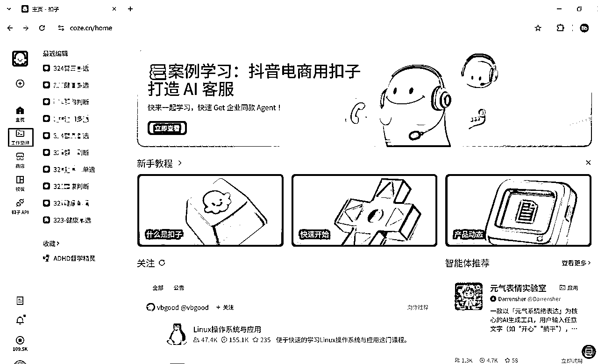

# 2、进入“工作空间”

# 3、选择“项目开发”

点击右上角的“创建”

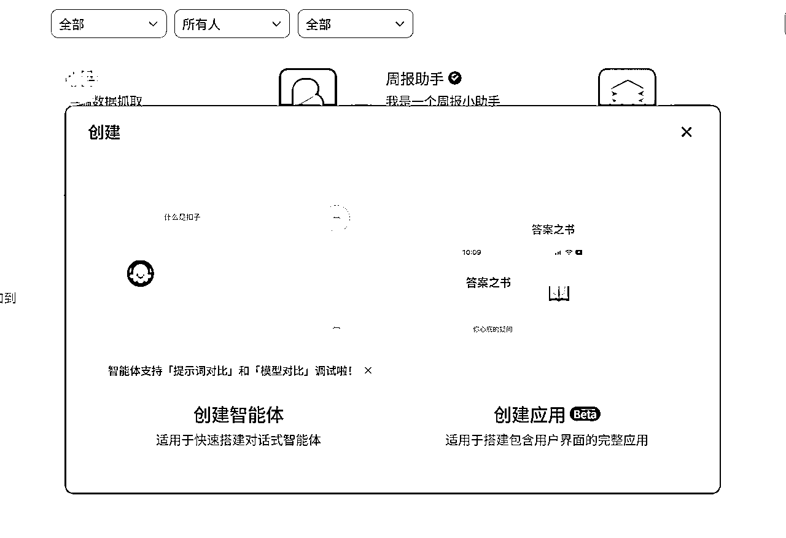

选择“创建智能体”

# 4、随便起个你喜欢的名字

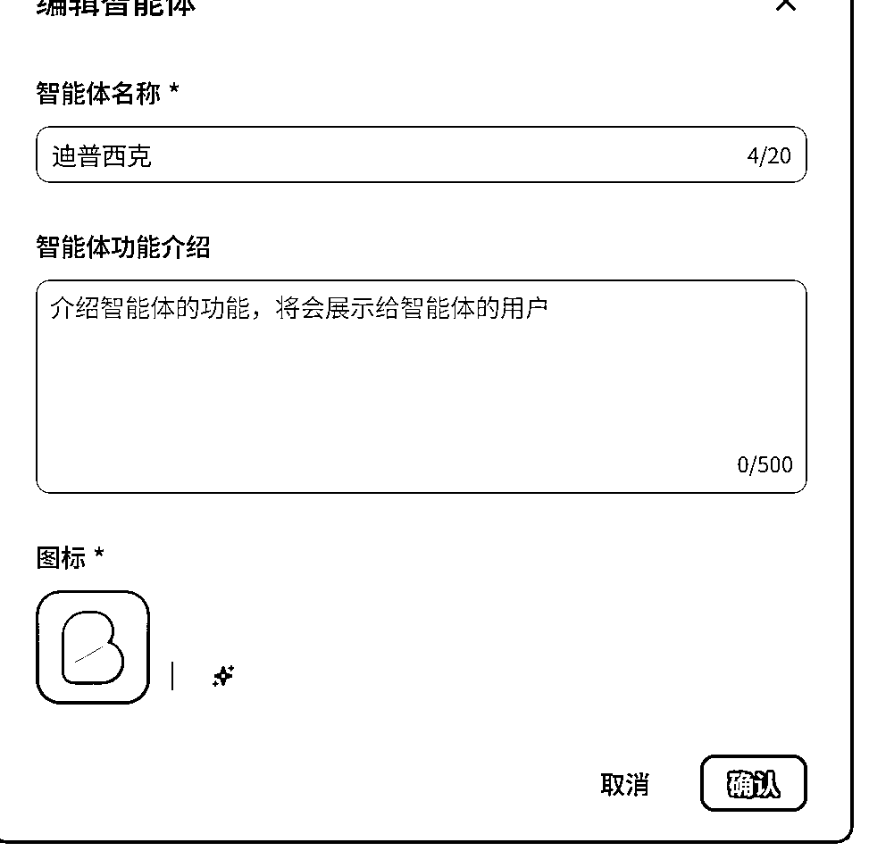

# 5、修改调用的大模型

选R1还是V3看你喜欢，当然也可以做两个

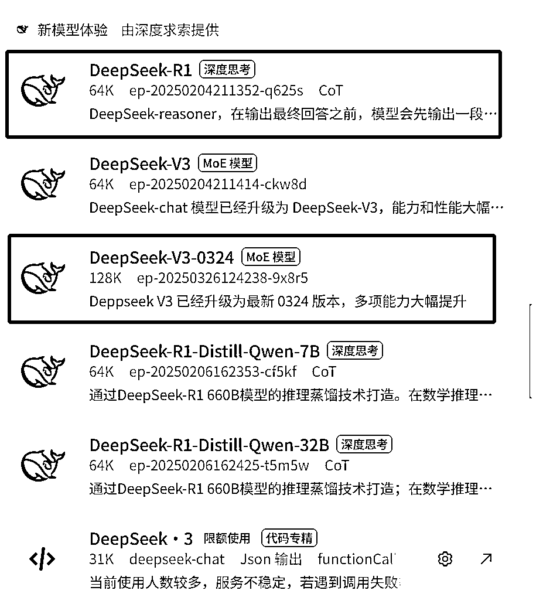

# 6、点击设置，微调模型能力

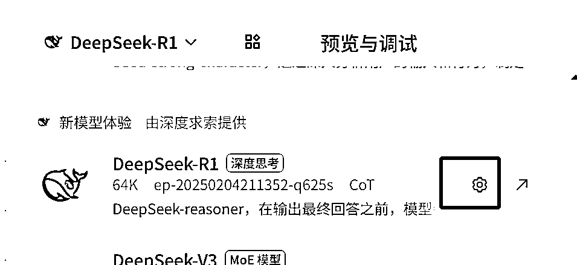

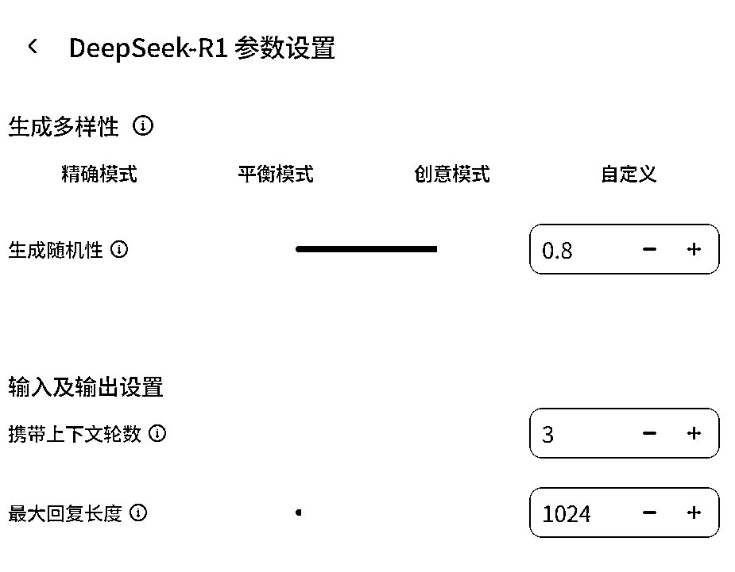

# 7、根据你的需求，调整

默认模型能力是携带3轮上下文（记忆），最大回复1024（输出长度），随机性0.8（智能性）

鼠标放在这里会有提示怎么调整

调整好了，反正是自己用的，什么欢迎语之类的都不用设置，就是一个字

莽！

# 8、直接点击右上角的“发布”

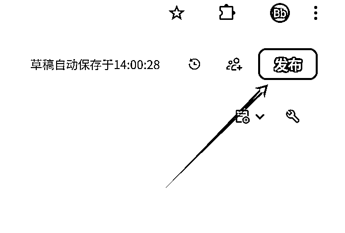

会提示你让你补充

我们莽村的不补

# 9、把其他都关掉

都不要，我们莽村的只用飞书多维表格

如果没有授权，先做一轮授权，按提示操作就行，授权完成之后进入配置环节

# 10、配置多维

先在标题这里输入你喜欢的名字

# 11、提交表单

点击下面的表单去填写

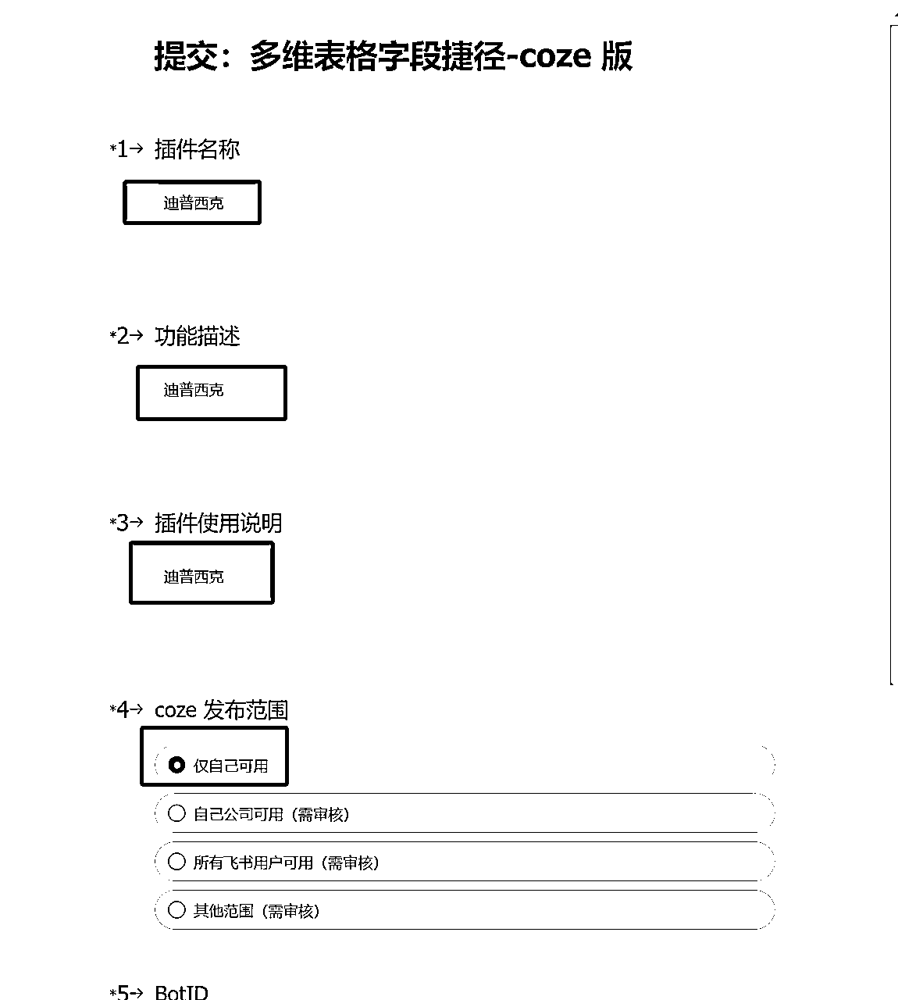

自己使用，写什么说明，写什么描述，直接写插件名！

莽！！！

# 12、发布

提交成功之后，回到页面，就可以发布了

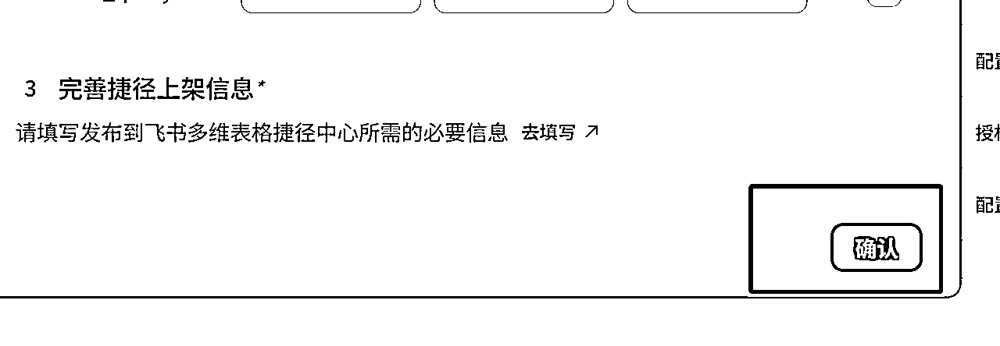

页面变成了“已配置”状态，就可以发布了

人工审，一般白天15分钟左右审完

然后下楼买杯瑞幸去，喝完回来就可以用了

喝完回来了

# 13、使用

再来说说怎么使用

打开飞书多维表格，从第二列开始用

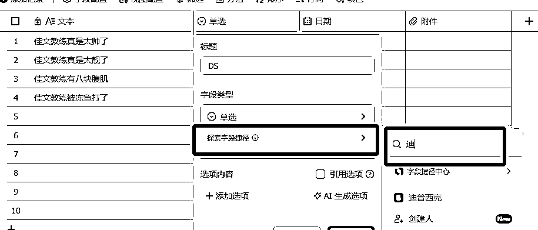

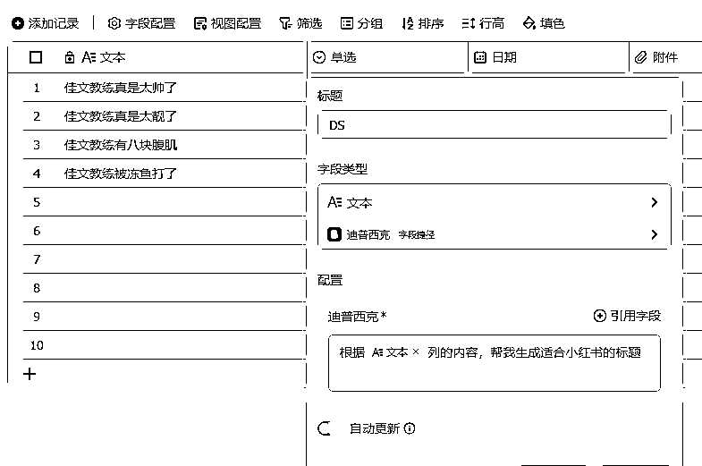

效果还行，我很满意！

# 14、计费说明：

每天coze会赠500点数（价值5毛）

deepseek扣费说明：

每天送的500点问个几十轮是没啥问题的

更多的使用，老老实实的氪吧

# 15、其他说明

想有更多AI功能？自己写工作流搭一下就好了，搭建参考往期航海中的coze打造私人助理航海手册，本贴就不多教了

祝大家都能今年随着AI莽到钱！！！！