# 如何借助生财 AI 小组，拥抱 AI 变现机会？

> 来源：[https://shengcaiyoushu01.feishu.cn/docx/WlYUdNOdAo8nH0xaLTWcfnhEnLc](https://shengcaiyoushu01.feishu.cn/docx/WlYUdNOdAo8nH0xaLTWcfnhEnLc)

大家好，我是小鱼。

先几句话介绍一下自己：

1.  生财有术 04 号员工，工龄即将满 5 年

1.  做过几款小产品，比如历年《生财日历》和《项目精选》小报童，累计销量 25 万+ 册

1.  在团队当过会员运营负责人，做过 418 项目统筹，尝试过新增渠道搭建，待过情报研究组，现在社区内容部负责生财小组，希望帮助圈友们在各个垂直领域做深、做透

听我说这些经历，你们可能已经发现了，这些年我的业务方向调整了好几次。每次开始新业务，说实话我会不适应，面对模糊不清的问题时，也会产生畏难情绪。

AI 对我们来说，可能也是这样一个东西。

但我这些年最大的感悟就是：不确定性是人生的常态。每次遇到新的机会、不懂的领域时，只要敢跳进去，往往会有意想不到的收获。拥抱 AI 最重要的一点，就是先相信自己 - 相信自己能学，也相信自己一定能学会。

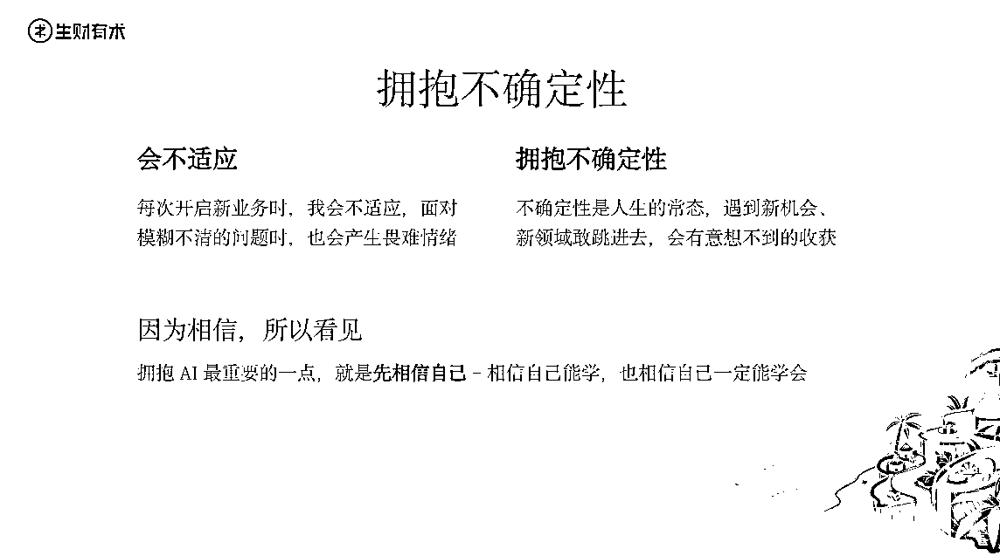

最近因为工作调整，我集中看了不少圈子里关于 AI 的精华内容和风向标。发现大家会聊这些问题：

*   AI 工具层出不穷，到底要怎么学？

*   看其他人已经在用 AI 赚钱了，但是自己还没找到切入点？

*   知道一些 AI 变现的案例，但是不知道如何参与进来……

所以今天，我想作为生财的 AI 课代表，把看到的、听到的、感受到的 AI 信息，以及生财团队在 AI 领域的动作，分享给大家。

主要是以下几个模块的内容：

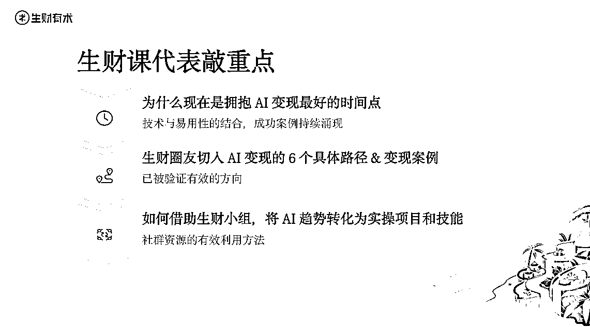

## 一、为什么现在是拥抱 AI 变现最好的时间点

AI 是每个人都需要关注的机会，这应该是咱们圈友的共识了。

我想强调的是：现在恰恰是普通人用 AI 赚钱的最佳时机。

### 技术门槛与变现可能性达到了平衡点

前 2 年，AI 工具还不够成熟，普通人不好驾驭。当时需要大量提示词工程知识和技术背景，才能让 AI 产出有真正价值的内容。

但是现在，随着 DeepSeek 等新一代 AI 模型的上线，普通人上手 AI、用好 AI 的难度大大降低。你只需会提问，就能获得专业水准的输出 ——这是历史上第一次技术与易用性的完美结合。

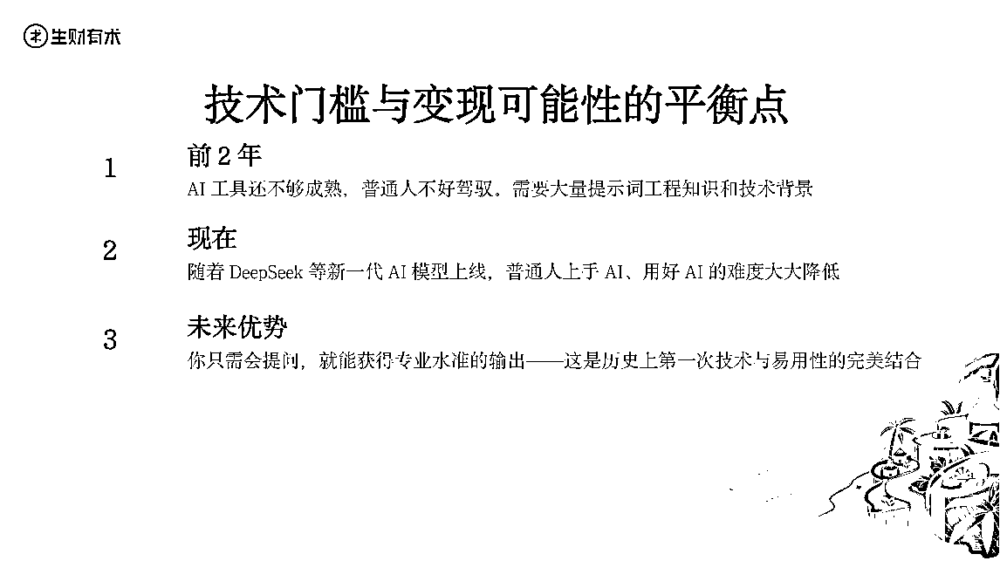

### AI 正在赋能各行各业，成功案例持续涌现

过去一年，生财有术涌现了不少圈友的 AI 案例：

*   圈友 @刘小排，做了几十款 AI 产品，目前年营收近千万，前几天还受邀参与了程前朋友圈的访谈；

*   圈友 @阿彪，小团队打造了年利润过千万的 AI 产品，可以与字节系产品抗衡；

*   圈友 @大漠，出海萌新，从留学行业转行做 AI 产品，已有多款产品跻身出海榜单前 100，最好的是 17 名；

*   圈友 @花生，Al Native Coder，一人开发的 AI 应用登顶 App Store 付费榜首；

*   圈友 @裘裘笔记，短短 2 个月转型为 AIGC 设计师，获得头部 AI 公司 Offer；

*   圈友 @汤姆CC，04 年大学生做 AI 自媒体，春节期间短视频账号直接涨了 30w 粉，一个多月有 50+ 个商单找到他……

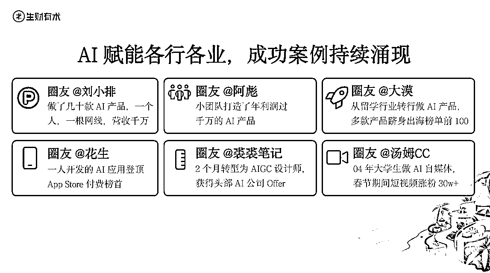

重要的是，这些例子中有不少人也是非技术背景，从 0 开始进入 AI 行业的普通人。

### AI 时代的核心价值正在放大

AI 时代的核心逻辑是：你一个人可以变成十个人，可以认知更好，可以成长更快，可以赚更多钱。

从 ChatGPT 的推出算起，AI 的商业化才刚刚开始。其实最好的入场时间不是第一批，而是当成功案例已经跑出来、确定性增强的时候 —— 这个时间点就是现在。

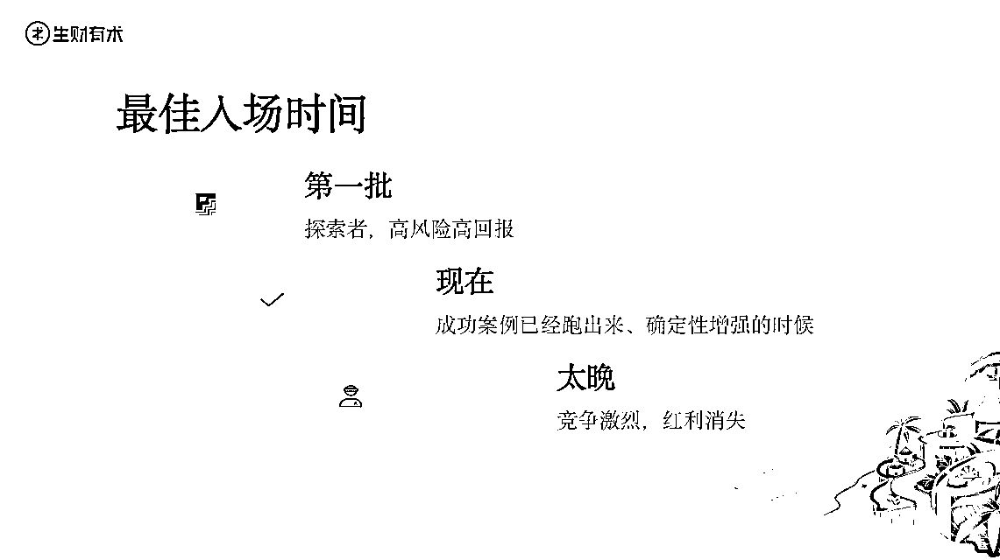

现在拥抱 AI，就是拥抱未来。

## 二、生财圈友切入 AI 变现的 6 个路径 & 案例

聊到这里，可能会有圈友说：是的，我现在也想用 AI 赚钱，但是具体应该怎么做呢？

接下来，我会给大家分享 6 个已经被验证过的 AI 变现路径，这里的已被验证是指：

1.  已经有人做跑通了

1.  跑通的人群还不算少

1.  其中有人拿到大结果

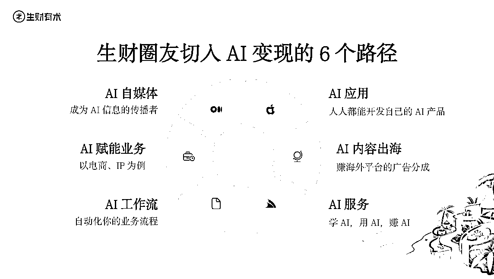

你可以对照一下自己的情况，看看哪个最适合你。

### AI 自媒体：成为 AI 信息的传播者

#### 项目简介

先来看第一个被验证的 AI 变现路径 —— AI 自媒体

一句话介绍这个项目 —— 做普及“AI 相关知识”的内容创作者，成为 AI 产品、新闻、资讯的传播渠道。

这个项目在最近这段时间集体爆发，过年期间，随手刷刷视频号，都能看到大量 AI 主题的视频或者直播。当时，简单的 DeepSeek 提示词用法、隐藏提问技巧、用 AI 写脚本、朋友圈文案、做各种业务的视频，都能轻松获得大量流量。

*   适合人群：信息敏感、喜欢分享的人

*   所需技能：基础内容创作能力，会用手机做视频就够了

*   入门门槛：低，不需要精通 AI，只需比大多数人多了解一些

*   变现周期：3-6 个月

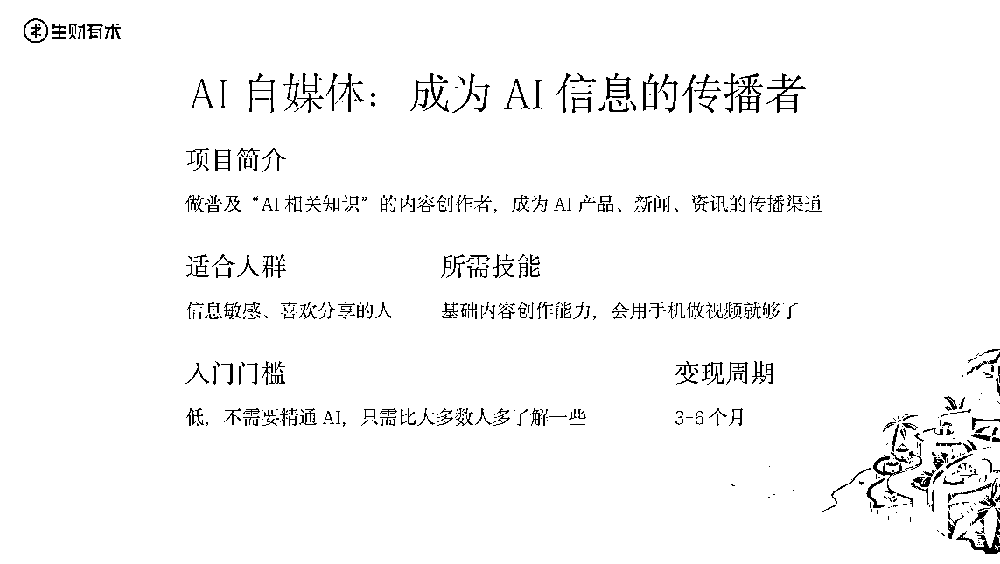

虽然已经火热了一段时间，但我想说，现在仍然是入局 AI 自媒体的好时机。

#### 一些观察

给大家透露一些内部消息：

*   需求旺盛：AI 领域的热钱还在继续，越来越多的 AI 产品产出，需要有各种 AI 自媒体进行宣传推广，拿字节来说，商单还会有很多条产品线，包括飞书 / Trae / 扣子 / 火山方舟……

*   供给稀缺：有些公众号现在已经接不到广告了，但是 AI 自媒体商单报价却普遍达到阅读量的 5 倍以上，有圈友做小红书、甚至即刻这样的图文平台，都有 AI 厂商来寻求合作，且基本没有讲价空间；

*   海外蓝海：不少 AI 公司还在找人做海外推广，想要搞海外影响力，因为可选的英文区 KOL 价格高又难找，海外市场比如 X（Twitter）、YouTube Shorts、Instagram Reels、TikTok 等都有很大空间。

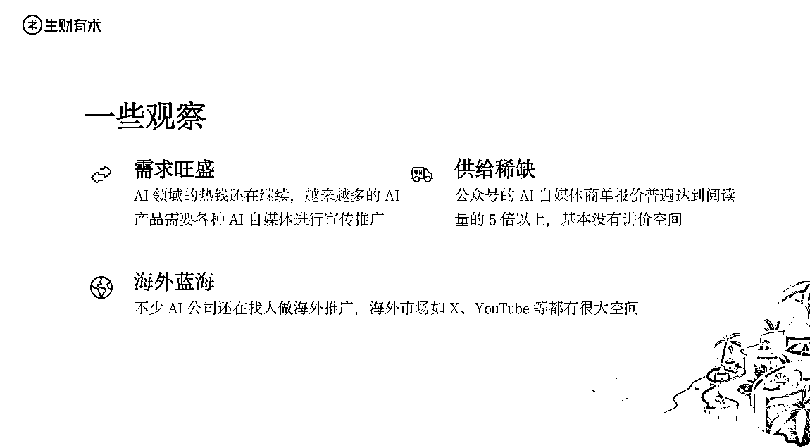

#### 圈友案例分享

已经有不少圈友在 AI 自媒体领域中拿到结果了，你可以在生财小组中看到很多类似案例——

圈友@Ann，最早一批做 AI 自媒体的成员，也是 3 月航海的教练。她偶然发现豆包用于检查作业、和小朋友互动，就在抖音发了几条相关视频，没咋想变现。结果发了 4 条后，就有广告主主动找上门。

之后半年，她合作的品牌包括豆包、九章随时问、纳米 AI 搜索、AI Mate、猫箱、豆包爱学、即梦、夸克、今日头条、百度，还有一些小程序等。她说：“去年 10 月之前，我的内容与 AI 领域并无关联。所以，我想给大家一些信心：如果我可以做到，你们也一定可以！”

@Ann的星球帖分享：《【项目实操】AI教育+抖音，1个月接7条广告过程分享》

做 AI 自媒体，你觉得至少要有多少个粉丝你才能接广告？

答案是 20+ 个。

圈友@蘑菇，她小试牛刀发布了第一条视频，就收获了 300+ 的赞藏，还接到了第一个商单。她接广告的时候，粉丝也就 20 多个。

很多人以为粉丝少就接不了单，其实这是一个误区。蘑菇说积累大量粉丝、打造个人 IP、运营社群这条路对她来说太长了，所以从一开始，她就明确了自己的定位：不做 IP号，只做接广号。后面蘑菇又发了 7 条视频，其中 3 条都是商单。

@蘑菇的星球帖分享：《做AI自媒体账号发布第一条视频后接到了商单》

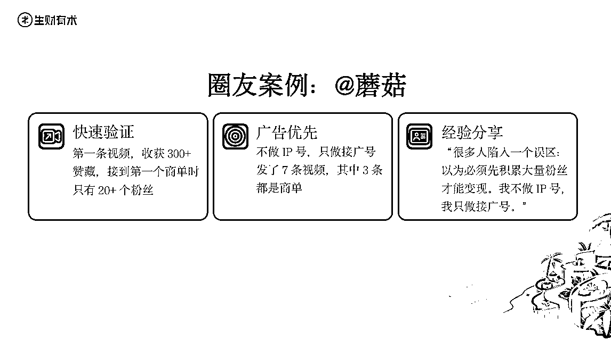

圈友@汤姆CC，是一位 04 年的大学生，他在春节期间制作 DeepSeek 系列视频，后续直接涨了 30w 粉，一个多月有 50+ 个商单找到他。

当时 DeepSeek 很卡，全网都在讲怎么流畅使用。当很多人都做这个主题后，他转做 DeepSeek 的具体使用技巧和教程，出了好几个百万、千万的爆款视频。

因为视频偏向于提效科普，后续还有人联系他做 AI 提效主题的线下课程，变现方法不至于商单。

@汤姆CC的星球帖分享：《春节期间制作DeepSeek系列视频：从0到1的AI自媒体成长经验分享》

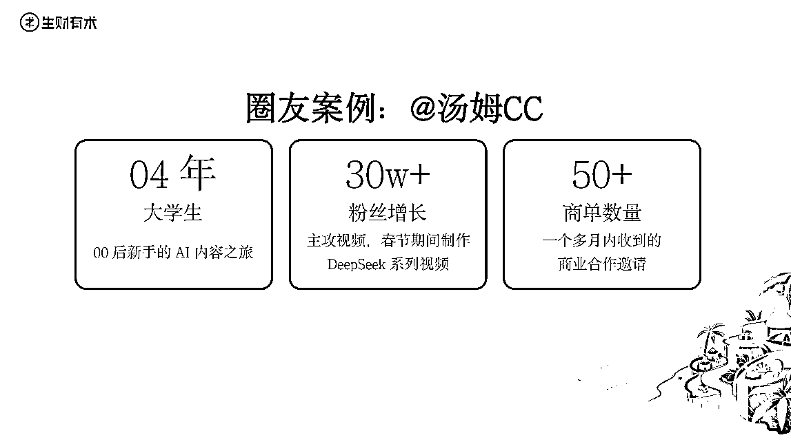

在知识爆炸的时代，信息的过滤器比生产者更值钱。做 AI 自媒体，你不需要是 AI 专家，只需要比受众多懂那么一点点就够了。

因为很看好这个方向，我们也和圈友合作成立了一家 AI MCN。如果你对这个项目感兴趣，可以大胆实操起来，未来我们会通过 AI MCN 拿到稳定的商单，对接给咱们圈友，让大家专注把内容做好。

### AI 应用：人人都能开发自己的 AI 产品

#### 项目简介

如果说 23 年最多的钱还是流向了大模型公司，那么从 24 年后半年开始，越来越多投资团队把目光转向了 AI 应用。

去年 11 月，亦仁的超级标就推出了“AI 应用”项目。

简单来说，AI 应用就是借助 AI 编程、AI 设计等工具快速实现的 AI 产品，包括 AI 网站、AI APP、AI 插件等。

很多人听到这些词，会觉得，“我不懂技术，和这些事情应该没有关系吧”，但正如小排老师所说，我们已经通过 AI 实现了“技术平权”。

过去开发软件需要专业的编程知识和产品设计能力，成本很高。但现在，AI 工具让技术门槛大幅降低，不懂技术的人通过一定学习，也能独立完成 AI 应用开发。

*   适合人群：有产品思维，对技术有基础了解的人

*   所需技能：产品思维，用户需求洞察能力

*   入门门槛：中等，需要学习 AI 编程工具

*   变现周期：3-12 个月

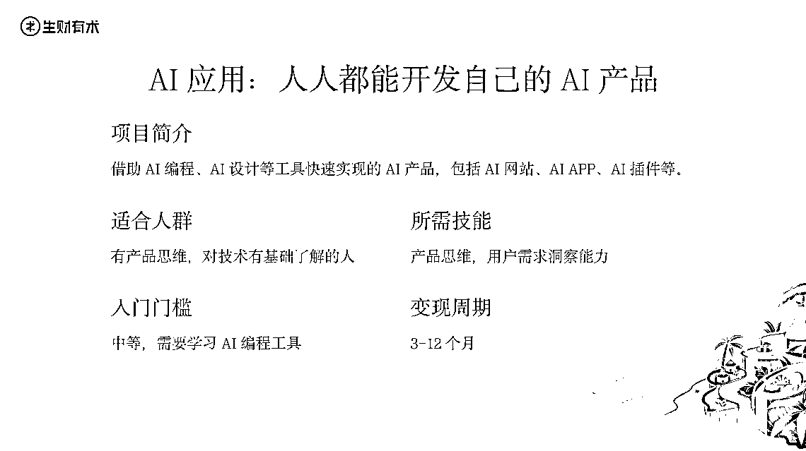

#### 一些观察

*   场景化应用更赚钱：通用的 AI 工具竞争激烈，用户付费意愿有限。而针对特定场景的 AI 应用，解决了明确痛点，用户更愿意付费。AI 应用的商业模式很清晰，包括：

*   订阅制：基础版免费，高级功能付费

*   使用量付费：按照 API 调用次数收费

*   结果付费：按照生成内容数量 / 质量收费

*   比如这次分享，我的 PPT 就是 AI 工具做的。前 8 张免费，想生成更多页数就需要收费。我在试用过 8 张后秒付费，就是因为直观看到了产品效果，转化流程非常顺畅。

*   核心竞争力变了：如果说之前“技术能力”还是壁垒的话，在 AI 应用领域，核心竞争力已从“技术能力”转向"“产品思维”"和“用户洞察”。找准用户真实需求，快速验证、持续迭代产品、给用户带来好的体验才是关键。

*   试错成本降低：借助 AI，开发一个 MVP 的时间已经从数月缩短至数天甚至数小时，这意味着你可以尝试更多创意，快速验证市场需求。

*   Build in Public：国内的 AI 产品可以在小红书完成从需求收集到产品开发到冷启动的全过程；海外 AI 产品则可以借助 Reddit 完成同样的操作。

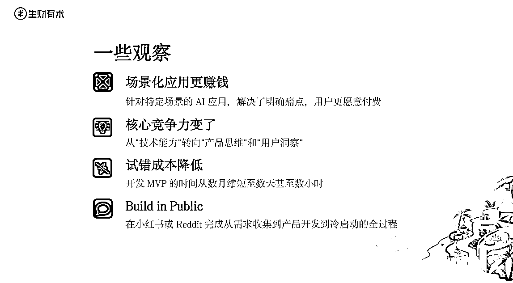

小红书最近推出了一个活动“独立开发者大赛”。你可以看到不少 AI 产品，在小红书平台完成了商业的完整闭环。比如想到需求时，先去小红书搜索下看看多少人关注；推出产品前发个小红书，看看有没有人感兴趣；推出后再告诉姐妹们我已经做出来了。这样产品就自然完成了第一波冷启动，甚至有后续自传播的发生。

#### 圈友案例分享

关于 Build in Redbook，圈友@花生 的“小猫补光灯”是一个典型案例。

有一次，他女朋友在剪辑视频时提到，需要给女生做补光的卡片，然后花生就去小红书搜索“补光”，发现确实有很多数据高的爆款笔记。他意识到，这是一个真实高频的需求，于是借助 Cursor 工具快速开发并发布了这款产品。

App上线后，花生去小红书分享了下，其中一条笔记获得了 118 万的阅读、7.3 万的赞，并获得了超 3 万的 APP 下载量。这个“Build in 小红书”的产品最高时达到 AppStore 分类排行榜第 20 名；后续推出的付费版“小猫补光灯Pro”，更是在短短 6 小时内登顶所有付费应用榜第 1 名。

@花生的星球帖分享：《AI博主花生分享小红书爆火App开发经历》

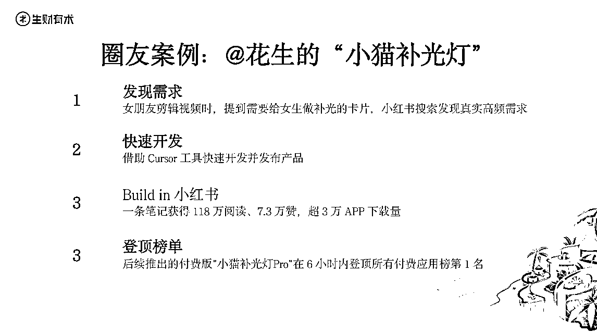

关于AI 应用，还有个大家熟悉的头部榜样，刘小排老师。

前段时间，小排老师上了程前朋友圈的访谈，我现在一想到他，就有一个非常具象的画面浮现出来：一个人，一根网线，N 个 AI 员工，千万营收。

他开启 AI 创业后，发布的第一款产品叫 Raphael AI，从 0 起步，到超过 100 万月活用户，只用了一个月的时间，还拿下了全球 AIGC 产品增长榜的 15 名。用户全靠自传播，没做 SEO，也没做任何付费推广。一个人用 AI 工具实现了一切。

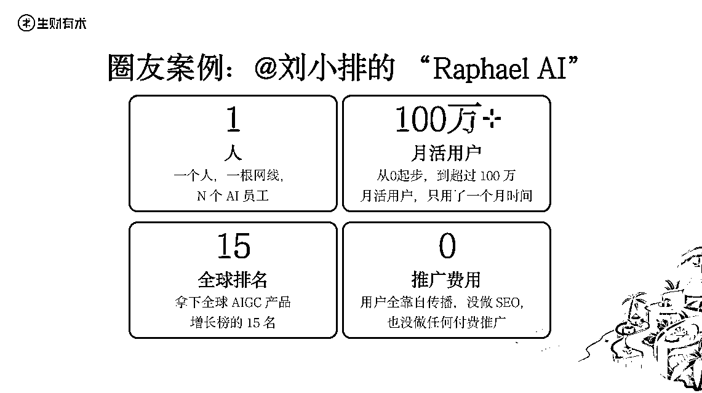

很多人困惑，AI 绘画已经是红海领域了啊，小排老师的产品怎么实现爆发式增长的。核心在于它“让一大群不会用 AI 画图的用户、突然就会用 AI 画图了”。

透露一嘴啊，小排老师正在和我们合作，筹备 AI 出海产品课程；还将作为 SCAI 实验室的联合创始人，孵化一批做 AI 应用的圈友。

详情可以看许老师最近发布的招募帖：《SCAI实验室正式开放申请》

一个“只要有想法，就能做产品赚钱”的时代，真的来了。

### AI 内容出海：赚海外平台的广告分成

#### 项目简介

过去一两年，AI 模态模型能力持续加强，文本、图像、语音、视频生成质量都有了质的飞跃。

尤其是视频模型，发展很迅猛，国内的玩家比如快手的可灵，Mini Max 的海螺，字节的即梦等，视频模型在国际上都处于领先位置。这大大降低了优质内容制作的门槛，普通人也能通过 AI 工具创建高质量视频。

在这样的背景下，适合普通人入局的第三个 AI 方向，AI 内容出海之 YouTube Shorts 就出来了。

一句话介绍这个项目 —— 利用 AI 生成视频内容，发布到 YouTube 和 Shorts 等平台，从中获取广告分成收益。

*   适合人群：对海外平台感兴趣，想要尝试 AI 生成视频

*   所需技能：基础 AI 视频工具，内容策划能力

*   入门门槛：中，需掌握 AI 视频生成工具和平台规则

*   变现周期：3-6 个月

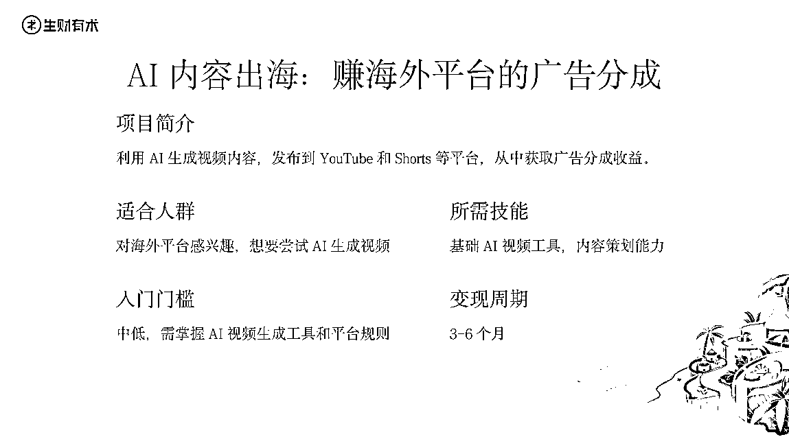

#### 一些观察

*   平台红利明显：为了与 TikTok 竞争，YouTube 推出 Shorts 并开通广告分成计划，为创作者提供了新的变现渠道。而 YouTube 对 AI 生成内容没有限制流量推送，AI 萌娃走秀、AI 萌宠唱歌、AI 音乐、AI 故事等多个赛道在 Shorts 板块都很受欢迎。

*   AI 给内容出海带来的 3 个革命性变化：

*   生产门槛的降低 —— 不需要真人演员、实地拍摄和专业剪辑，也能模拟出爆款内容的核心元素

*   生产效率的提升 —— 从脚本、演员、拍摄到后期，全流程可压缩至一小时内完成，创作者只需专注于创意和内容设计

*   创作边界的拓展 —— 有些视频元素还挺夸张的，比如飞天入地、变身融合、奇珍异兽等，而 AI 让这些想象快速呈现出来了

*   竞争格局变化：短期内，模仿现有 AI 爆款内容是快速入局的有效途径；长期来看，AI + 人工创意的结合将成为主流，对纯 AI 和纯人工内容形成降维打击。如果你现在进入，持续打磨能力的话，也会在长期发展中形成先发优势。

注：此部分信息源自生财有术 YouTube 实战深海圈手册。

#### 圈友案例分享

去年 12 月，生财有术组织了一场有 3000+ 人参与的 YouTube Shorts 航海活动，后续又推出了 YouTube 深海圈产品，经过几个月时间，已经涌现出一批成功案例：

*   圈友@As ，经历了赛道转换的摸索，从猫猫跳舞、治愈动物到动物示警，最终找到突破口，创作出多个十万级播放量的爆款，成功开通两个高级YPP账号。

*   圈友@逸凡风顺 深耕 AI 动物示警、AI 动物救援赛道，通过系统分析找到了此类视频的爆款要素 —— 激发用户的同情心和情绪共鸣。目前他的账号也实现了稳定的美金收入。

*   圈友@六只猫 展示了坚持的力量。他先后探索了达人秀、AI 猫猫故事、动物示警、国风美女走秀、Reddit 故事号、解说号等六个不同赛道，终于找到适合自己的内容方向，两个账号成功达到高级 YPP 条件。

*   圈友@NaNa 作为一位拥有十年互联网运营经验的老手，被 YouTube Shorts 兼具 AI 技能积累和美金收入的双重价值所吸引。通过持续深耕，她成功获得了超过 3000 美金的收入，全网涨粉 10 万+，累计播放量达 5000 万+。

YouTube Shorts 小组直达链接：https://scys.com/groupV2/164

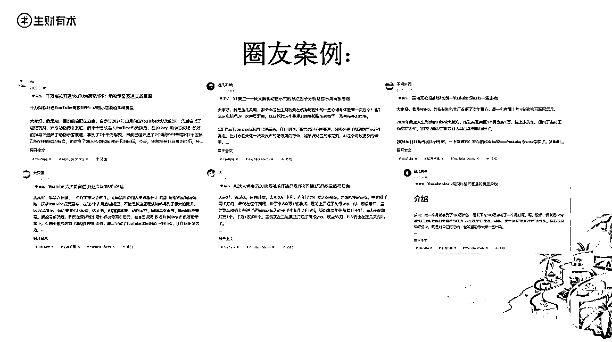

借助 AI，内容出海的可能性被极大扩展。今天的一个视频，可能连接的是全球数百万观众和广告主的钱包。

值得一提的是，深海圈的主教练之一 @Gary 老师，是在生财有术看到 AI Shorts 这个项目后才开始实践的。后面他在社群分享自己的实操内容，被评为精华帖，成为传术师，12 月底来杭州参加了传术师线下见面会，被亦仁看见。

然后航海负责人邀请他参与私教陪跑，做出来的成绩非常好，实现了人均 YPP，现在我们围绕 YouTube 深海圈，也在进一步的合作中。

@Gary的星球帖分享：《致未来黑暗中的我，三个月以来的创业感悟：分享、链接、“弱关系”的贵人和愿力》

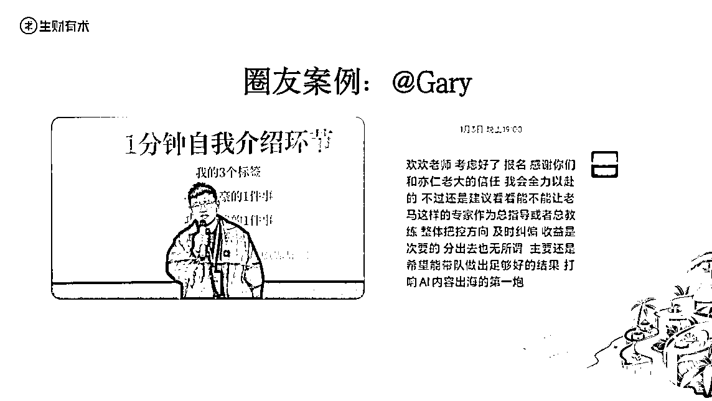

今年生财有术有一个关键词叫"看见”。我们会通过一些方式，比如说团队成员来线下见面会，比如#生财朋友圈专栏运营，再比如鱼丸头像换成真人……让更多人被看见。

我觉得大家也可以通过一些方式，包括主动去做分享，主动参与活动，主动在各种能够留下痕迹的地方让自己被看见，这样就有了更多的可能性。

### AI 服务：学 AI，用 AI，赚 AI

#### 项目简介

很多圈友第一次了解 AI，可能是从 AI 绘画开始。早在 21 年 12 月，就有圈友分享了一个 AI 绘画工具。

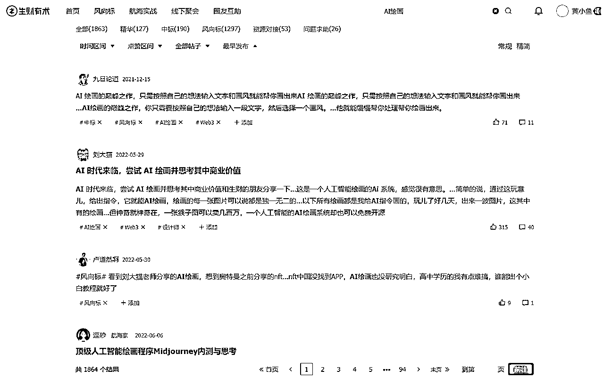

围绕 AI 绘画，后续衍生出了一系列 AI 服务，比如：

*   老照片修复

*   艺术二维码

*   平面海报设计

*   室内设计

*   SD 高清修复

*   IP 形象设计

*   电商换装

*   AI 换脸技术

*   ……

说白了，AI 服务就是，当你学习并掌握 AI 技能之后，可以通过为他人提供各类 AI 相关服务获取收益。

AI 服务的延展性非常广，大家可以留心身边的各个需求场景，很容易找到一个快速切入的需求点，掌握对应的的技能变现。

在闲鱼、淘宝上搜索“AI 代 X”，也能看到非常多成熟的、被验证的服务需求。

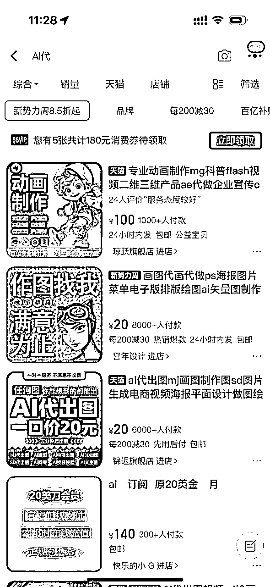

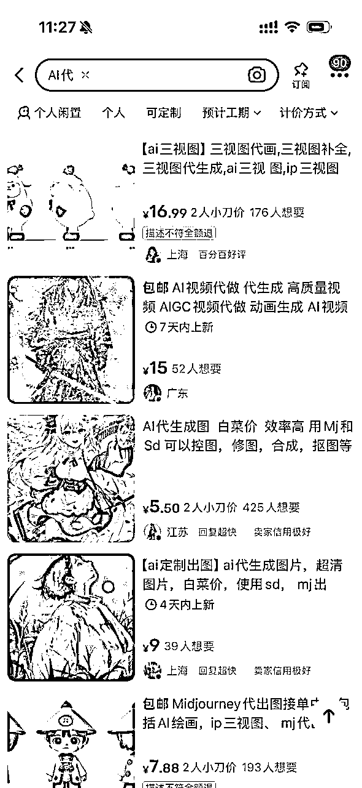

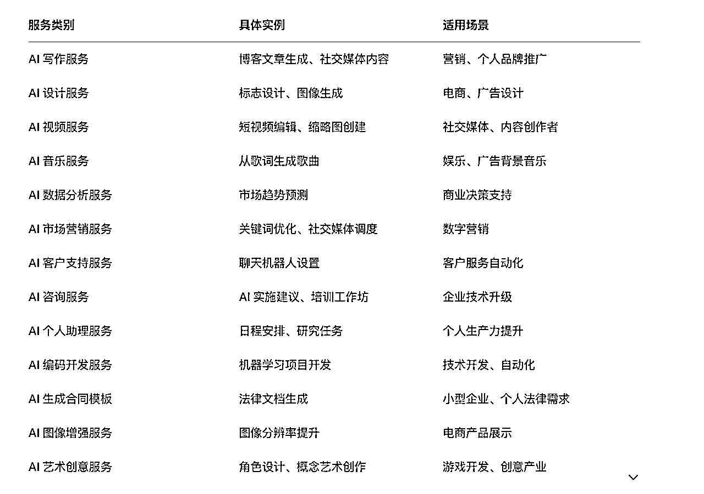

*   适合人群：具备特定领域知识，愿意与人沟通的人

*   所需技能：AI 工具使用能力，特定领域专业知识

*   入门门槛：低，能熟练使用 AI 工具即可起步

*   变现周期：1-3 个月

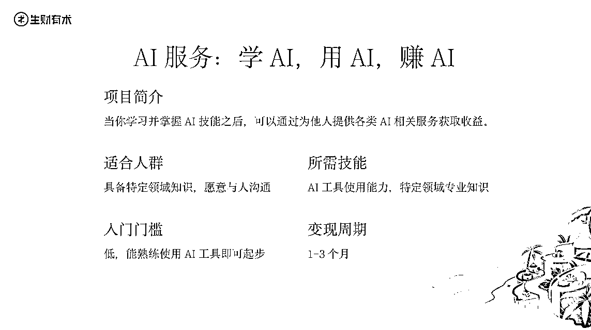

#### 一些观察

*   服务细分加速：随着用户个性化需求的出现，AI 服务正向更垂直、更场景化的方向发展。人类的“惰性”使然，很多人愿意花钱省时间。“人 + AI ”的组合模式，正在成为未来服务的主流形态。

*   技能门槛与服务定价两级分化：基础的 AI 代写等服务价格走低，而结合专业领域的 AI 咨询服务价格稳步上升。拿 AI 代写来说，已经有公司，只做一个细分学术品，计算机的毕设，就实现了一年 4000W 营业额；也有圈友专做 B 端的咨询服务，一场培训就可以收到 10 万块。

*   个体到团队的规模化机会：AI 服务不仅可以作为个人副业，还能发展成团队工作室甚至成规模的公司业务。一两年前跟着生财做 AI 代写的不少圈友，现在都成立了自己的团队。

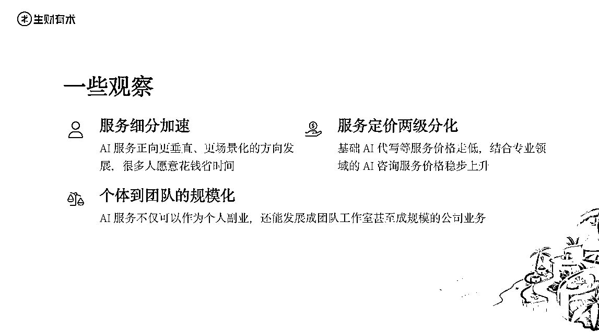

#### 圈友案例分享

我在生财小组内，同样看到了非常多通过 AI 服务赚到可观收益的案例。

比如 5 年老圈友@李白。他是一名工作 7 年的产品经理，跟着航海开始做 AI 代写，短短 2 个多月就获得了 4 万元多的收益。

他的经历很适合大家参考。从淘宝写手起步，在淘宝搜索“写作”、“文章”等关键词，向排名靠前的商家表明应聘意愿。在这个过程中，他持续锻炼能力，建立了标准化模板，真的实现了边学边赚钱的状态；

在专业形象逐步打造起来之后，2 周后，他就开始运营自己的闲鱼店铺，将重心转向自营流量，独立承接起订单。

至此，完成流量、产品、转化的全部闭环。

@李白的星球帖分享：《新人入局AI代写2个月收益4w+保姆级分享》

圈友@Daemon，在风向标看到有人卖 coze 工作流，想到自己作为产品经理，逻辑架构还不错。

虽然是代码小白，但是完全可以借助大模型完成代码开发，至此踏上了智能体开发之路，用 AI 工具撬动了 2000+ 的智能体订单。

@Daemon的星球帖分享：《代码小白借助AI工具拿下2000+的智能体订单》

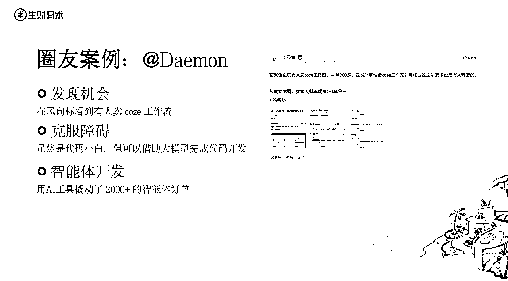

除了直接变现，习得 AI 技能还能帮你拿到更好的工作机会。圈友@裘裘笔记，之前是短视频老师，看到 AI 对传统设计行业的冲击后，决定放弃稳定工作转型 AIGC 设计师。

她在短短 2 个月里，经历了 3 个重要节点：

1.  入门三周，接到人生第一单 AIGC 商单

1.  潜心研究 AI 创作技巧，分享心得，一个月内从零积累到 1000+ 粉丝

1.  两个月后，收获某人工智能头部公司的 AIGC 设计师 Offer

@裘裘笔记的星球帖分享：《两个月从短视频老师到 AIGC 设计师，我的经验复盘》

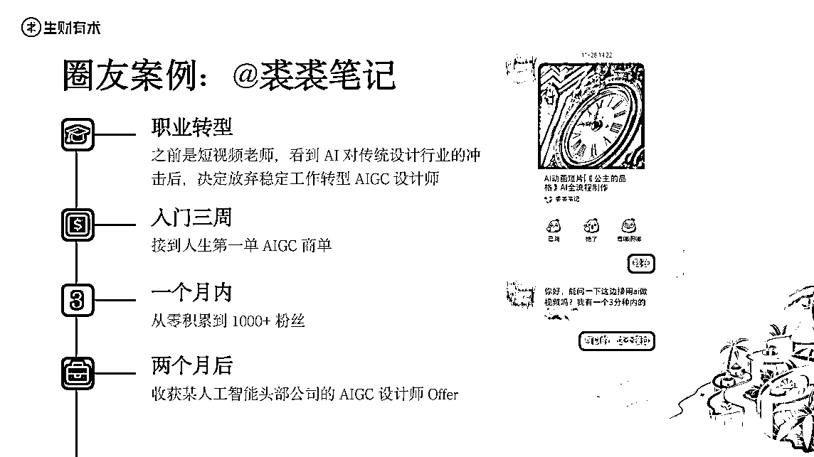

AI 服务不仅是技术能力的体现，更是专业领域知识与服务意识的综合竞争。最终胜出的不是谁会用 AI，而是谁能用 AI 解决真实的商业问题。

### AI 工作流：自动化你的业务流程

#### 项目简介

#### 

剪映 & Capcut 的产品经理说：“大模型加上开源平台，让 ComfyUI、Coze 这样的平台成为创作利器。很多内容创作者可以通过节点，自由搭建和封装工作流，满足各种需求，更高效地进行内容创作。”

这就是为什么你会在生财小组里看到很多“AI + 小红书”、“AI + 公众号”、“AI + 视频号”的玩法，大家都在用 AI 工作流把效率提高 10 倍。

一套好的 AI 工作流搭建好后，原本要忙活一两天的工作，现在可能几分钟就搞定了。AI 真的在改变我们工作的方式。

*   适合人群：有专业知识但想提高效率的人

*   所需技能：只需要会用基础 AI 工具，会梳理流程，会一点编程更好

*   入门门槛：中等，需要了解你的行业流程，知道想优化什么

*   变现周期：1-3 个月

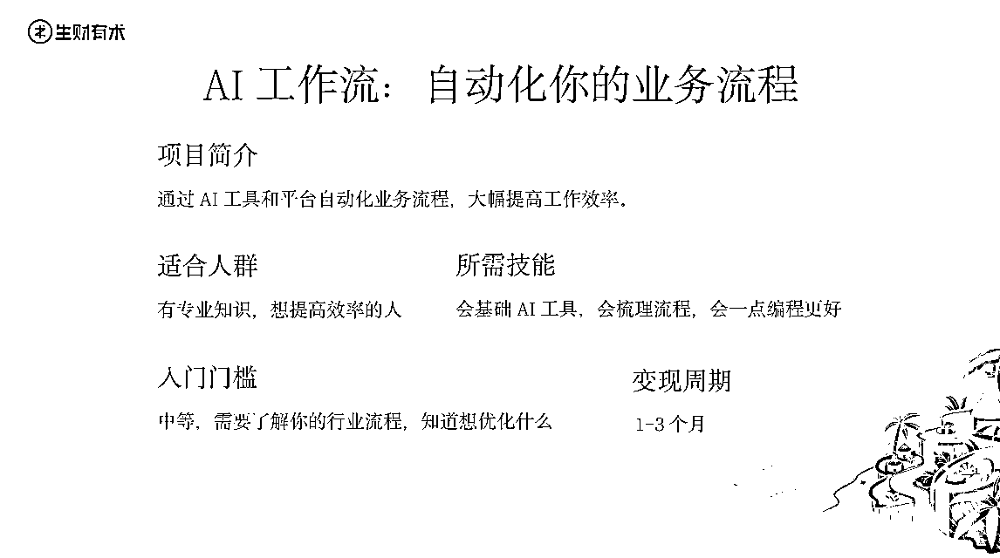

#### 一些观察

关于 AI 工作流，有几个现象可以关注下：

*   需求爆发：很多公司，特别是中小企业和个人创业者，都在寻求方法，想要用更少的资源做更多的事情

*   门槛变低：ComfyUI、Coze 这样的无代码平台让普通人也能搭建复杂的自动化流程

*   解决方案稀缺：虽然工具多，但针对特定行业的完整解决方案很少。你懂行业、懂需求，做出的 AI 工作流不仅自己用，还能卖给其他人

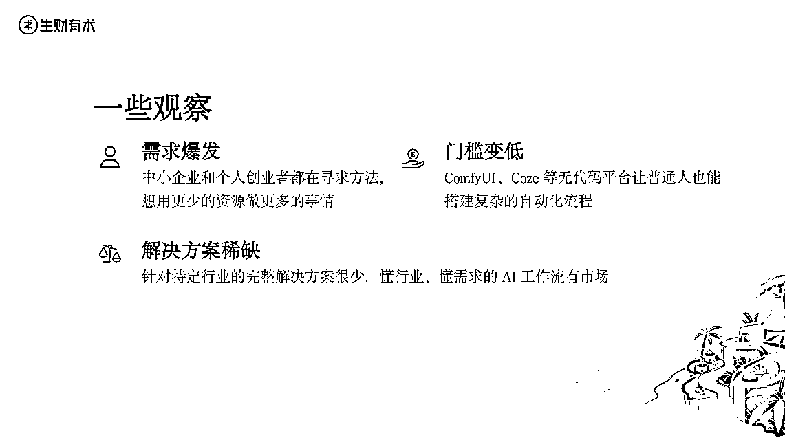

#### 圈友案例分享

生财有术圈内，同样有不少 AI 工作流的实践玩家——

圈友@富贵，公司主要做小红书高客单线索业务。她说，“我们并不关心市面上 AI 其他科技发展成什么样，在我的团队里，没有生财力的 AI 都都是虚假狂欢。”

最近她分享了《小红书一键提取图文标题到飞书多维表格》，用快捷指令调用 API 接口执行 Coze 工作流，已经有不少圈友跟着做出来了。

@富贵的星球帖分享：《小红书一键提取图文标题到飞书多维表格》

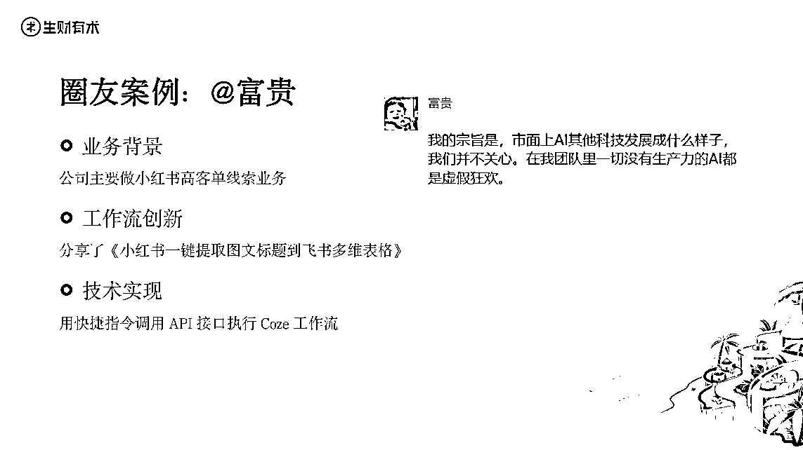

前些天，新一期的航海家俱乐部启动了，航海家@阿甜在群里分享了自己的数字人口播全平台自动更新工作流。

她老公给他搭建了一整套工作流：首先用工具去抓热榜内容，看看现在什么样的话题能够引发大家关注；然后把这个内容导入飞书，让飞书给它改写；改写完之后就是用数字人模仿真人去拍摄的视频；视频出来之后自动剪辑，剪辑完之后批量上传。

这套原本要花 1 个多小时的流程，现在 5-10 分钟就能搞定。

分享后，很多航海家愿意付费购买这一整套方案。

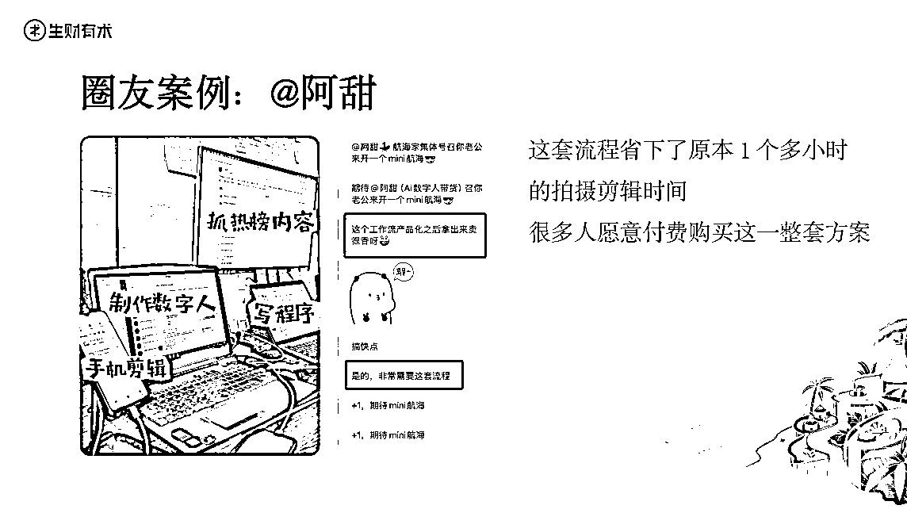

掌握 AI 工作流，告别重复性工作，用 10x 速度实现你的战略落地。

### AI 赋能业务：以电商、IP 为例

#### 一些观察

AI 不光改变了内容创作，也在重塑各行各业。对老手来说，AI 能大幅提效；对新手来说，AI 降低了入门门槛。

对生财圈友来说，把自己的业务和 AI 结合，优化产品和服务，是切入 AI 的好方式。

下面以 2 个生财热门领域：电商、IP 为例，分享下可以如何借助 AI 进行业务赋能。

*   适合人群：已经在做电商、IP 的人，或者想快速进入这些领域的新人

*   所需技能：行业基础知识，会用 AI 工具，会重新思考业务流程

*   入门门槛：中低，有业务基础者可迅速上手

*   变现周期：已有业务的立即见效，新业务 1-3 个月见效

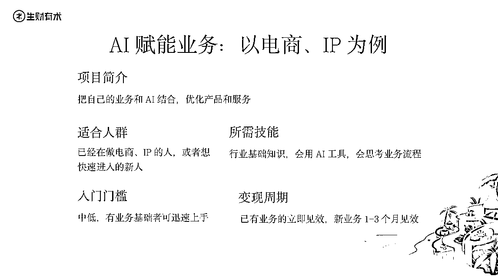

#### AI 赋能电商

3 月航海中，我们上线了一个选题“AI 赋能电商”。航海手册里面有几个非常明确的场景：

1.  模特换装：一次拍摄/生成基础模特形象，快速更换展示不同服装款式

1.  商品换背景：同一产品在不同使用场景下的展示效果

1.  商品试用图生成：快速生成用户使用产品的效果图

1.  模特换脸：根据目标人群定制不同风格、年龄段的模特形象

1.  模特换脸视频：创建动态展示商品使用效果的视频内容

这些操作大大缩短了产品上新周期。

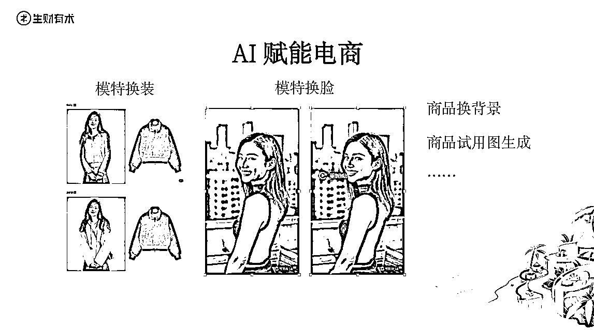

现在每周在生财有术视频号上，生财有术的合伙人坤汀也会对谈一些 AI 领域的实践高手，前段时间就对话了国内 AI +电商领域的头部武彬老板。

AI 赋能电商已经渗透到方方面面了，从选品，到关键词，到 SEO，到内容，到营销……每个环节都可以借助 AI 提效。

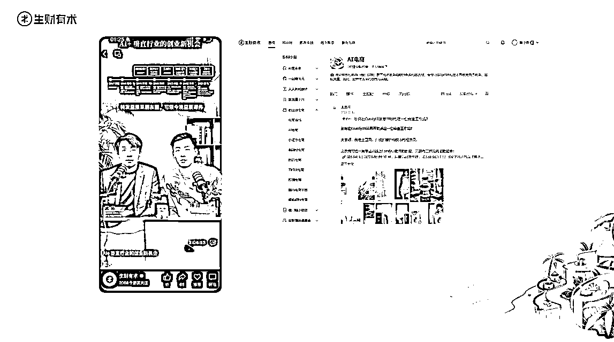

生财小组中，单独有个模块叫“AI 电商”，感兴趣的圈友也可以去看看这里的内容，感受一下。

#### AI 赋能 IP

3 月航海还有个选题叫“AI 赋能 IP”。

在生财有术，我们认为大多数个体都要做的事情，就是 IP。现在有很多企业家，比如雷军、周鸿祎、江南春等，都在做自己的老板 IP。

打造 IP 是成本最低、效率最高的用户信任建立方式。 在这个人人皆可做 IP 的时代，AI 的出现，也大大降低了普通人做 IP 的门槛。

很多做 IP 的时候会有个困惑即怎么定位，这里其实就可以请教 AI，告诉它你的诉求是什么？你有什么优势……在不断对话过程中，就有机会找到适合的定位。

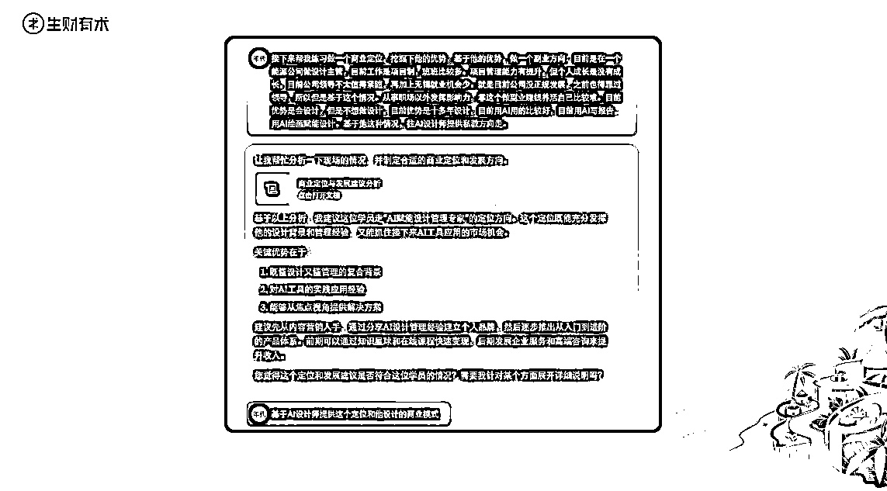

除此之外，你还可以借助 AI 梳理产品，用 AI 提高内容创作效率，航海手册中也罗列了不少场景 ——

*   用 AI 写作：比如公众号文章、小红书文案、朋友圈

*   用 AI 作图：比如文章配图、运营海报、个人 IP 形象、红包封面

*   用 AI 做视频：比如写脚本、配音与数字人口播、AI 生成图文动画视频

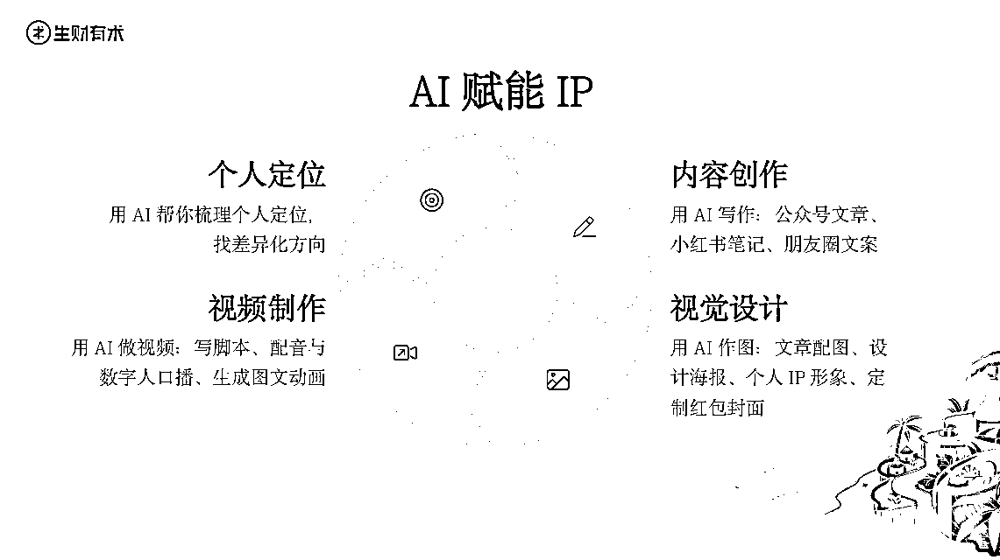

以前每天吭哧吭哧写 10 条朋友圈已经非常了不起，现在通过 AI 你可以轻松产出 30-50 条优质内容，而且质量普遍比手搓好。

未来商业竞争的核心，不是谁更努力，而是谁能更好地用 AI 工具重塑业务。落后者将不得不用 10 倍的努力，去追赶先行者用 AI 带来的 100 倍效率。

总结一下：

*   如果你现在还是纯新手，可以从 AI 服务和 AI 自媒体入手，边学边分享；

*   如果你有自己的业务，可以用 AI 工作流重新审视业务各环节，找出可以用 AI 提效的部分；

*   如果你想长期深耕，选择有一定门槛但更持久的项目，AI 内容出海和 AI 应用都是不错的方向。

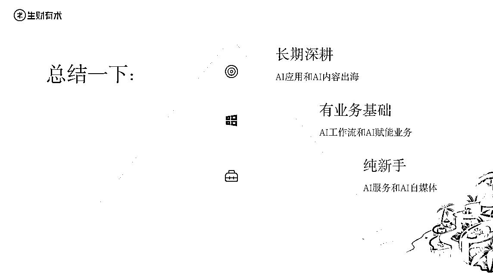

## 三、如何借助生财小组，将 AI 趋势转化为实操项目和技能

说完路径和案例后，我想从官方视角画个重点，告诉大家作为圈友，如何利用生财小组，把 AI 趋势变成实实在在的能力和收入。

### 看风向标，感知 AI 趋势

生财有术有不少“黑话”，其中有一句是这么说的：“江湖赚钱看生财，生财赚钱看风向标”。

很多时候信息差就是钱，生财 AI 风向标，能让你更早发现有价值的信号。

大家日常可以进入生财小组中的“AI 全部”板块，感知当下潮水的涌动。前面我提到的案例中，比如Daemon，就是看到风向标中的案例，接到了自己的第一个 AI 服务单子。

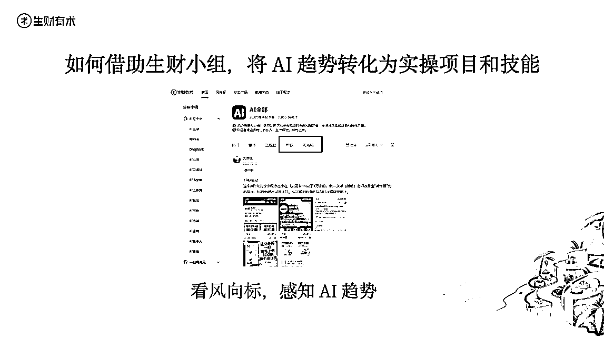

时间紧的圈友，可以直接锁定亦仁发布的 #超级标。

“不需要很多成本，一万块差不多，多一点十万八万，反正不是要投入很多钱的那种。通过一个具体的信息差或者机会，小团队或者能力不差的个体，努力干有机会干到 100 万甚至更多。”

今天我们分享的几个 AI 方向，也基本都是亦仁认证的 #超级标。不少圈友，也都是看到超级标直接入场，拿到了很不错的结果。

*   AI 自媒体：抓住 AI 领域热钱与自媒体广告投放的新机遇

*   AI 视频出海：通过 AI 生成的各种视频，上传到 Youtube 和 Shorts，获取广告分成

*   AI 应用：从百万到亿级收益的超级机会

*   AI 服务：把你学会的 AI 技能，拿来给别人做服务

### 刷小组内容，建立 AI 框架

之前在星球看内容时，一个问题是各个主题的信息都放在了一起。

所以我们通过生财小组，把不同的主题内容进行了分类，你进入生财 AI 小组，看到的全部都是 AI 相关的内容。

集中地看这种聚合类信息的好处是，可以帮你快速建立自己的框架，形成体感。

比如生财联合办公空间的负责人许老师，看完小组内容后，在找新的项目方向时，就可以快速形成自己的判断。

AI 小组内还做了二级分类。热门话题如 Manus、Deepseek，以及一些热门项目如 AI 应用、AI 自媒体、AI 写作等，都有单独的 Tab 栏。

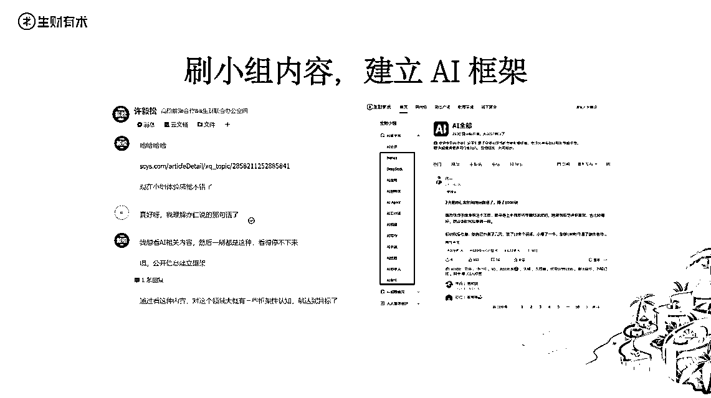

过去这段时间，经过圈友的自发分享、官方发起的 #龙珠悬赏，还有定向约稿，现在 AI 小组里面，已经有了 8790 篇帖子，诞生了 270 位精华帖作者。

强烈建议大家花时间查阅里面的精华内容。

你会发现，很多圈友在借助 AI 进阶时也遇到不少卡点，看看他们对问题的思考和解决方案，会给你带来很大启发。

### 下场实践，参与 AI 航海

生财小组里面，不仅有 AI 主题的内容，我们还把所有过往和正在进行的 AI 相关航海做了聚合。

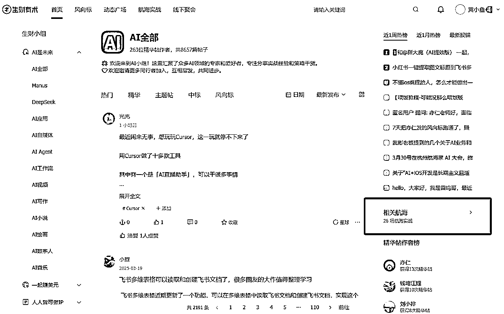

从 22 年11 月第一场“AI 绘画”航海，到“ChatGPT+海外工具”“ChatGPT+自媒体”，再到“Sora”“AI 编程” “AI 特效直播变现”“Coze”“AI 写作”……已有超过 3 万人次的圈友参与到各个 AI 主题的实战活动中。

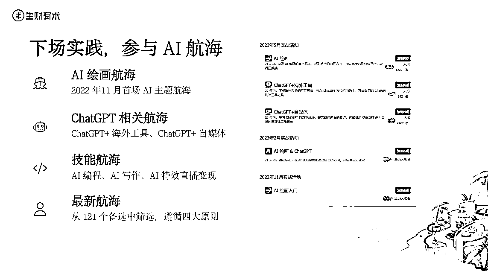

我们认为，在一个正确的方向下持续行动、持续尝试，拿到结果是非常自然的事情。在正确的方向下，这是大前提。

航海就是生财帮你选准方向后，设计一个行动氛围，带大家下场。最新的 3 月航海选题从 121 个备选中筛选，遵循四个原则：空间够大、有10倍潜力、有快速反馈、能低成本切入。

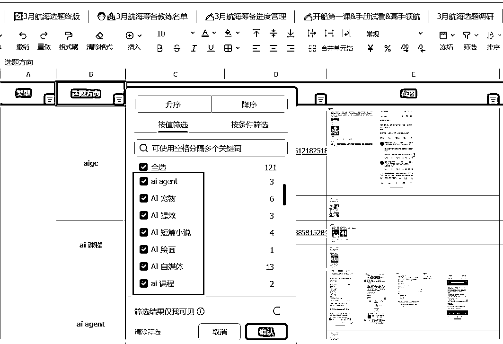

参与航海实战，可以让你通过实际行动提高认知，掌握技能，获取经验，链接圈友和资源，从而在 AI 变现路上走得更稳、更快。

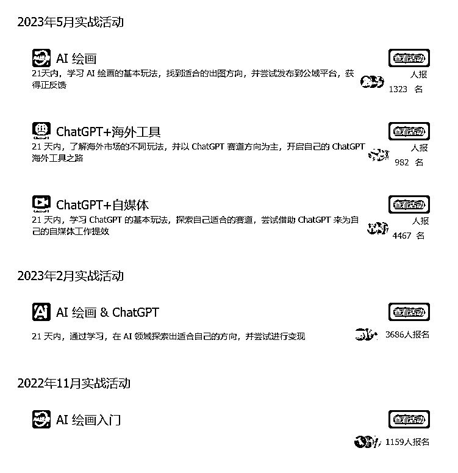

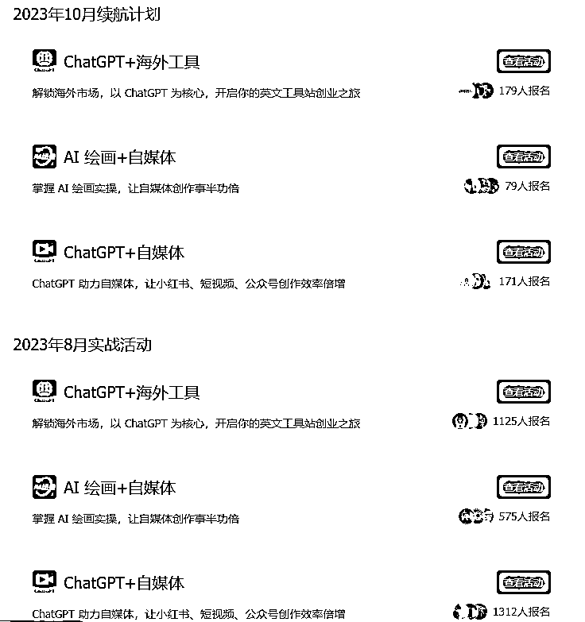

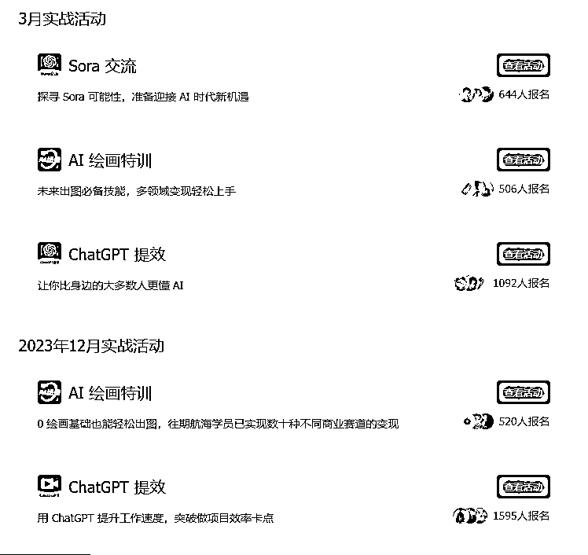

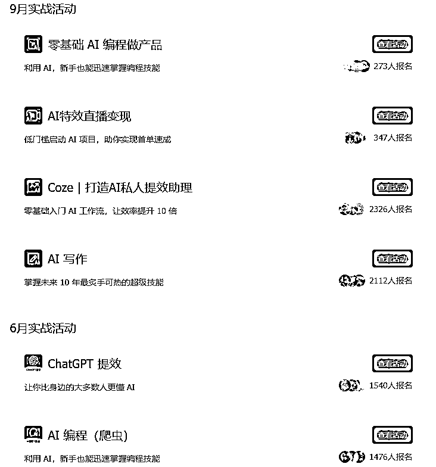

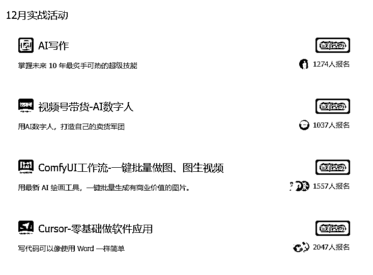

### 分享 AI 经验，让自己被看见

非常重要的一点：当你学习 AI、践行 AI 后完成项目闭环，一定要把整个过程分享到生财有术，让更多人知道你的业务进展。

今天分享的很多案例作者，都是因为输出了优质内容，获得了更多机会。比如 Gary，林悦己的产品被 SCAI 实验室投资，裘裘成为航海家 AI 大会的见面会嘉宾，Ann 担任航海教练……

### 成为深度 AI 实践者，加入 AI 传术师俱乐部

生财有术也在全力加速拥抱 AI，我们正在规划和成立一个聚集生财有术最牛逼的 AI 使用者的社群 —— AI 传术师俱乐部。

当你在 AI 领域取得一定成果，这个俱乐部将为你提供更深层次的交流和合作机会。

想象一下，一群持续研究 AI 的高手聚在一起，会碰撞出怎样的火花？

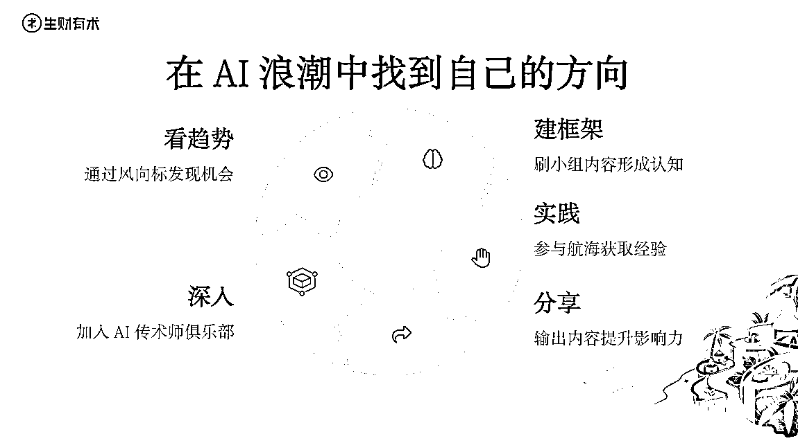

以上就是我今天的全部分享，祝大家都在这波 AI 浪潮中，找到自己的方向。

