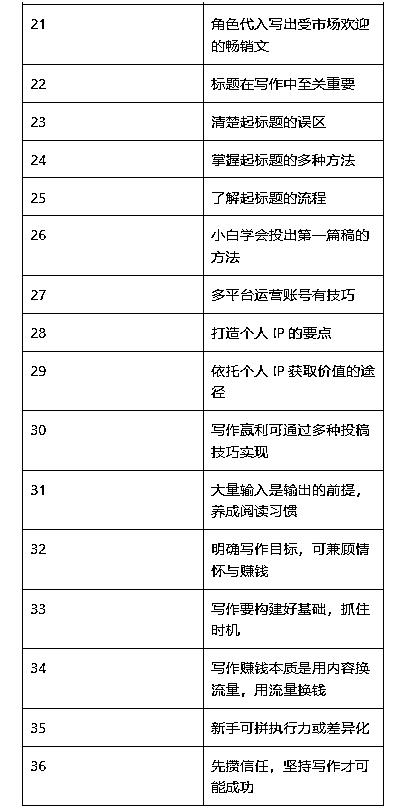

# 《零基础 21 天突破，AI+拆书的道与术。》

> 来源：[https://eqc9f6vzuhv.feishu.cn/docx/WtTfdUgUooI8Ygx11PhcxlwanEd](https://eqc9f6vzuhv.feishu.cn/docx/WtTfdUgUooI8Ygx11PhcxlwanEd)

为什么在AI时代下，我们还要坚持学习拆书的技巧？

这是一个很有意思的提问，但也是一个稍显幼稚的问题，咱们用一个比较直接的例子先回答一下：“你家的汽车导航，为什么导得出路线却教不会你开车？”

各位圈友们大家好，我是拆书八年的拆书写作者，也是通过「微拆写作法」的拆书方式写出过100多篇10W+爆文的 AI 拆书写作导师。

为了让咱们热爱阅读写作、或是对 AI 浪潮下感到焦虑的写作者、或是被 AI 整自卑的拆书小伙伴能够正确认识 AI 、拥抱 AI 、使用 AI，让它成为咱们的“先贤辅佐”。

接下来，微微老师将从 AI+拆书方面的“道”与“术”，全面地给大家分享「AI与拆书」之间的联系，以及咱们可以如何做到人机结合拆书，跟上 AI 时代的步伐，更新迭代自己在拆书、写作、阅读中的能力。

（最后一节有关于 AI 拆书的使用流程分享，记得码住噢！）

# 一、人工拆书路径的【道】。

前不久，有个圈友问我：“现在用 AI 不到10秒就能读完一本书，我为什么还要吭哧吭哧学拆书技巧呢？”

我觉得这个问题挺常见的，因为100个小伙伴里边，肯定有不下于六七十个会掉进这类经典的错误里。我也没有着急解释，而是反问了一个有意思的问题：

“如果说，现在给你一台能够自动切菜的机器，请问你就能够当大厨了吗？”

AIGC 时代更要学习、掌握拆书技巧？是的，你没有听错，因为这是普通人想要切换到“超车赛道”的关键核心，好比说你拿到了“阿斯顿马丁Valkyrie V12”的引擎，却没有技巧、经验去驾驭它。

咱们拆书的目的并不是「读书」，而是「把知识变成你的肌肉记忆」。

给大家举一个真实的案例，来自于前阵子同事向老板汇报工作时，即使使用了 AI 却依然被骂的结果，具体是什么样的情况呢？

简单来说，他是通过 AI 去拆解了《金字塔原理》这本书（我也不知道他用了啥提示词，不过可以肯定是没有啥技巧的），AI 主要生成了“结论先行、以上统下”的回复内容。

所以当他给老板汇报时，还是会被骂“逻辑混乱”——因为AI没告诉他：

*   怎么把“结论先行”变成具体的PPT标题？

*   怎么用“以上统下”梳理老板最关心的成本数据？

这就是只会用AI“切菜”，却不会“炒菜”的后果。

咱们想要真正地把 AI 拆书活用起来，就要理解 AI 不是“四次元口袋”，它很神奇，却不是万能的，用 AI 拆书时，要记得打开“人性开关”，

## （一）拆书是思维能力的“健身房”。

从以上俺的同事案例中能够非常明显的看出来，AI 能快速输出答案，但是始终无法替代人类对知识的深度内化。

因为拆书的核心在于通过“提问-分析-关联”的流程，构建个人的逻辑体系和批判性思维。

例如，使用SCQA模型（情境-冲突-问题-答案）拆解书中内容时，需要主动思考“作者的底层逻辑是什么”“如何迁移到实际场景”，这一过程是AI无法代劳的。

咱们可以通过场景还原来把这个知识点以简单化的方式捋清楚，比如你去超市买酸奶。

如果在没有拆书技巧的加持下，一般只会对 AI 输入“根据《中国居民膳食指南》，告诉我怎么选好的酸奶？”这样的表面提示词。

AI 大概率会给你一个教科书般标准化的输出：

*   蛋白质≥2.9g/100g；

*   碳水化合物≤12g；

*   配料表第一位是生牛乳。

然而咱们的现实情况很有可能是你站在货架前，发现所有酸奶都标“生牛乳”，于是买了最贵的某品牌，回家喝了一口直接吐了——浓稠得像胶水，根本咽不下去...

而如果对拆书技巧已经有一定的熟练程度，那思维上就会从之前的【直白单纯模式】转变为【精准戳痛模式】，比如在提示词上就会有明显的升级：

“我是健身小白，预算有限，请结合《膳食指南》第58页酸奶选购要点，对比蒙牛、光明、简爱三款低温酸奶的性价比。”

AI 大概率会有更详细、更全面的回复，比如类似这样的：

到这里还没有结束呢，由拆书带来的思维除了在直接提问上会有更精准的信息，而且还会经常用到一个经典的追问技巧：瞄准要点刨根问底。

比如“为什么书里强调‘低温酸奶’，但办公室没冰箱的人怎么办？”。这时候咱们基本上能够得到更完善的回复，也就是：

*   书中标注“低温酸奶活菌数更高”，但 AI 会补充说明“常温酸奶钙含量相同”；

*   健身期人士可以买简爱（控糖优先）；

*   日常饮用选光明+自配蜂蜜包（平衡口感与营养）；

*   用美图秀秀AI制作《酸奶选择决策树》贴冰箱。

这就得到了更符合真实感受的答案：选酸奶就像找对象——光看体检报告（AI 数据）不够，得处着舒服（口感）。

没有基础的使用 AI，只能让它给到咱们成分表，而有了拆书的基础支撑，才能从中让它教我们如何过日子。

## （二）拆书是知识内化的必经之路。

在信息爆炸的互联网时代下，大量的信息直接怼到眼前已经让人看不过来、学不过来，而如今 AI 的浪潮来临，咱们更像是站在知识的自助餐台前，看似琳琅满目，实则消化不良。

因为即使 AI 工具可以瞬间生成书籍精华笔记时，但真正的知识内化，从来不是简单的信息搬运，而是需要像拆解精密仪器般的深度加工过程。

所以咱们需要让书中的知识从“信息存储”升级为“认知操作系统”，必须要掌握拆书方法论打破“知识速食”陷阱的独特价值。

拆书强调对书中金句、案例、观点的深度剖析，而非简单复述。

比如咱们以《原子习惯》的四步法为例，AI 虽然能精准提炼“提示 - 渴求 - 反应 - 奖励”的框架，但是拆书教练却能敏锐捕捉到第四步“身份认同”的深层价值。

比如用户分享“想通过早起提升自律”的目标时，拆书教练不会停留在制定闹钟计划，而是追问：“你希望成为怎样的人？这个习惯如何定义你的新身份？”...

正在于咱们在拆书上会采用这种追问、刨根问底的方式，才能在知识土壤中埋下种子，让被动的知识接收转化为主动的身份建构。

而这种追问能力，即使是最基础的，也是 AI 工具无法自动完成的。

咱们也能从不少认知科学研究中了解到，知识内化需要经历三个关键阶段：信息输入（编码）、深度加工（存储）、实践输出（提取）。

AI 工具擅长前两个阶段，但第三个阶段的个性化干预正是人类智慧的用武之地。

当用户在“反应”环节遇到执行障碍时，拆书教练会结合具体场景设计干预方案：用“如果 - 那么”的条件反射公式替代模糊计划（“如果 6 点闹钟响起，那么立刻掀开被子”），通过环境设计降低行为启动成本。

这种深度拆解能力，本质上是将显性知识转化为隐性能力的过程。

就像陶艺家将陶土塑造成艺术品，拆书教练通过提问引导学员发现知识背后的逻辑脉络：“这个案例中的成功要素，在你的工作场景中有哪些迁移可能？”“如果改变其中一个变量，结果会发生什么变化？”...这些问题如同思维手术刀，帮助用户剥离知识的表层结构，直达问题本质。

真正的学习革命，发生在当我们意识到知识不是现成的商品，而是需要亲手锻造的工具。拆书方法论教会我们的，不仅是如何读书，更是如何在信息洪流中建立自己的认知坐标系。

当 AI 成为高效的知识助理，人类更需要培养的，是提出“为什么“的洞察力、设计“如何做”的创造力，以及将知识转化为改变的行动力。

这才是应对未来不确定性的核心竞争力。

而这种人类独有的“追问系统”——也是区分普通读者与专业拆书家的分水岭。

在这里，微微分享一下关于专业拆书家的核心能力模型，大家可以参考学起来：​

在学习的过程中，记得一定要给自己建立“拆书追问清单”，比如：

*   这个知识点打破了我原有的哪些认知？(激活认知冲突)；

*   在我的典型场景中，哪个环节最可能发生应用偏差？(场景预判)；

*   如何设计不超过3步的微型实验验证该理论？(最小可行性实践)；

*   哪些跨领域知识可以增强该方法的有效性？(知识杂交)。

这种深度拆解过程，本质上是在构建个人的“认知免疫系统”——当海量知识通过AI加速涌入时，我们既需要机器的信息处理效率，更需要人类独有的批判性思维和创造性重构能力。

真正的学习力跃迁发生在“将书本DNA重组为个人操作系统”的过程中，而这也是 AI 时代每个终身学习者必须掌握的元技能。

## （三）拆书是抵御“AI依赖症”的护城河。

这一点应该不少小伙伴都有逐渐感受到，过度依赖 AI 会不仅仅只是导致思维惰性那么简单。

当我们习惯了用“小爱同学”查天气，用翻译软件读外文，用 AI 生成工作总结时，思维的肌肉正在经历一场静悄悄的退化。

就像长期使用代步工具会导致腿部肌肉萎缩，过度依赖 AI 同样会削弱人类最珍贵的思维能力 —— 提出问题的洞察力、联结复杂事物的创造力，以及对人性温度的感知力。

斯坦福大学2023年的追踪实验显示，过度依赖 AI 解题的大学生，脱离AI环境后数学推理能力下降41%，逻辑链条构建效率降低34%。

这印证了认知心理学的重要发现：

当人类将思维过程外包给算法，大脑的神经网络会像长期闲置的肌肉般萎缩。就像是认知神经科学的一项研究表明大脑具有“用进废退”的特性。

当我们把思考任务外包给 AI，负责逻辑推理和情感处理的前额叶皮层就会逐渐怠惰。

更危险的是，AI 生成的“完美答案”正在消解人类直面真实世界的勇气——就像《活着》中福贵面对苦难时展现的生命韧性，在 AI 生成的“正确人生指南”里被简化为成功学公式。

而拆书技巧能帮助用户从“答案消费者”转变为“问题设计者”，比如经典的“三维拆解法”就可以激活大脑的深度处理机制：

横向拆解文本结构（福贵的命运转折点如何推动叙事发展），纵向挖掘文化基因（儒家伦理对苦难承受力的影响），立体构建现实联结（当代职场压力与小说中的生存困境有何异同）...就像是给咱们的思维提供了一套思维健身操。

这种靠 AI 无法生成的情感深度内容，拆书就能培养起来，特别是对人性复杂性的感知力。

复旦大学要求论文核心部分禁用 AI 生成、浙江大学研发的AIGC检测系统准确率达92%，这些构成制度护城河。

但根本防御在于培育“慢思考”能力——就像《活着》展现的，在急速变迁的时代里，正是那些看似“低效”的情感沉淀，构成了抵御异化的终极铠甲。

当 AI 能瞬间生成完美答案时，人类要做的是提出更尖锐的问题；当 AI 能高效处理数据时，人类要守护的是对情感温度的感知力。

这种在拆解经典中培育的认知免疫力，正是数字时代保持人性坐标的锚点——它让我们在享受技术红利的同时，始终保有穿透算法迷雾、触摸真实世界的勇气与智慧。

拆书，是抵御“AI 依赖症”最坚固的护城河 —— 在理性与感性的交汇处，重建属于人类的思维尊严。

当然，尽管人工拆书技巧是基于人类认知经验的智慧结晶，拥有着人类特有的认知弹性与价值判断，但是并不意味着完全拒绝 AI 拆书。咱们要拒绝的，一直都是摒弃其中一方择其一的做法。

AI 拆书是数据智能与知识工程的跨界融合，它能通过构建动态知识图谱、训练认知模型算法、优化语义理解系统，重塑知识解构的底层逻辑。

也就是说：AI 拆书实现了知识解构的三重突破。

# 二、AI 拆书方面的【道】。

尽管 AI 无法拥有咱们作为人类特有的情感认知维度，但是它的知识联结速度比人类快 1.8 万倍，并且每 72 小时自动更新迭代，能够形成不断进化的认知生态系统。

AI 在知识解构的突破，不是简单的效率提升，而是对认知范式的革命性重构。

比如在认知维度上，通过预训练语言模型捕捉文本深层语义网络；在效率维度上，借助并行计算架构实现万级文本的同步解析；在形态维度上，利用动态知识图谱完成结构化知识的自动生成。

这种技术跃迁不仅重构了知识萃取的效率边界，更在认知科学层面拓展了人类对知识本质的理解。

所以，咱们需要借助 AI 的“理性”，把咱们作为人类的“感性”融合进去，让理性与感性在知识重构中实现完美共振，既有速度又有温度，打造知识转化与认知进化的协同引擎。

## （一）AI 是维度升级的“三角支架”。

虽然人类拥有着“感性”这张王牌，但是在效率这个能够直接影响“时间成本”的关卡上，毋庸置疑 AI 具有不可撼动的地位。

一本 30 万字的著作需要人类投入 200 小时进行深度解读，而 AI 拆书技术的突破，将这一过程压缩至秒级单位。

这种颠覆性的能力重构了知识获取的范式，完全打破了知识萃取的三个维度：认知维度的深度穿透、效率维度的指数级提升，以及知识保鲜的动态更新。

想要避免陷入“信息过载-效率低下-认知停滞”的不良循环，就要先从 AI 拆书的绝对优势打开视觉：

### 1、认知维度。

比如用《原则》这本书作为例子，当 AI 面对《原则》这类包含 268 条准则的复杂文本时，其处理逻辑远超越传统书评人的线性解读。

通过 NLP 技术与知识图谱的结合，AI 能够瞬间建立准则间的关联矩阵，如同用 X 光透视文字的骨骼结构。这种能力相当于 50 位专业书评人同时工作，不仅能识别显性的概念层级，更能捕捉隐性的逻辑脉络。

翻译成人话也就是说：它用「语言翻译器」+「知识地图」，把书里的所有规则瞬间连成一张网，相当于同时有 50 个顶级拆书专家在工作。

不仅能发现明面上的概念层次，比如 “原则 1→原则 2→原则 3”，还能挖出暗藏的逻辑链条，比如 “原则 17 背后其实和心理学的决策陷阱有关”。

它在分析投资原则时，AI 会自动关联心理学中的决策偏差理论，构建跨学科的认知框架。

它会自动「跨界组 CP」，突然就把心理学的 “决策偏差” 理论拉进来，帮你搭建一个跨学科的知识框架；这可不是简单的划重点，而是像搭乐高一样，把零散的知识点拼成 3D 立体结构，让你从 “知道一个点” 变成 “理解一张网”。

这种深度解构并非简单的信息抽取，是通过语义网络的构建，帮助读者在知识碎片中建立立体认知体系，实现从单点理解到系统思维的跃迁。

AI 拆书就像给你的大脑装了一个「知识导航系统」，不仅帮你看清每个知识点的位置，还能自动规划出一条从单点认知到系统思维的升级路线。

### 2、效率维度。

我觉得《三体》三部曲的拆解案例，完美展现了 AI 的效率奇迹：37 秒生成人物关系网、文明演进轴与核心概念树。

要知道，可以理解为37 秒 = 人类 200 小时：它能在眨眼间生成人物关系网（谁是谁的破壁人）、文明进化时间表（从地球到三体到宇宙毁灭）、核心概念树（黑暗森林法则 VS 降维打击），比你追完一部电视剧还快。

AI 的阅读姿势很叛逆，好比说人类是一页页翻书（线性阅读），AI 则是把整本书扔进 “知识搅拌机”，同时分析剧情套路、隐藏的哲学梗和科幻设定。

这种效率提升源于 AI 对阅读过程的重构 —— 传统阅读依赖线性信息摄入，而 AI 采用并行处理模式。

通过机器学习算法，AI 能同时解析文本中的叙事结构、主题隐喻与科学设定，将复杂的叙事体系转化为可视化知识图谱，就像“一边吃火锅一边涮毛肚、肥牛、蔬菜，还能品出汤底配方。”

某教育机构实验数据显示，AI 处理专业书籍的速度是人工的 17 倍，相当于 1 天读完 17 本《高等数学》，而且它还能自动生成练习题、考试题，就像你刚学完公式，AI 立刻给你布置应用题，实现知识框架构建与应用场景的无缝衔接，直接打通 “学→用” 任督二脉。

这种效率革命不仅节省时间，更重要的是释放了人类的认知资源，使我们能够专注于批判性思考与创新应用。

简单来说，AI 就像给大脑请了个 “知识外卖员”，它不仅帮你把外卖（知识）快速送到家，还直接帮你做好营养搭配（构建框架），你只需要专注于品尝和消化（深度思考），甚至还能开发新菜式（创新应用）。

### 3、知识维度/保鲜。

传统纸质笔记的静态属性，在 AI 拆书的动态知识库面前显得力不从心。

AI 的大脑会自动升级，每 3 天就更新一次知识库，就像手机 APP 自动升级到最新版本，永远掌握台积电的最新芯片工艺、全球信息的最新变动，甚至连行业大佬的最新吐槽都能实时捕捉。

这种能力构建了一个自我迭代的知识生态系统。

比如分析科技竞争时，AI 突然从量子计算领域拽出一个新发现，把几十年前的半导体历史和今天的前沿科技串成糖葫芦，让你瞬间看清「历史规律→未来趋势」的隐藏剧情。

某智库研究发现，AI 提供的信息新鲜度比人类快 40%（相当于你刚看到新闻标题，AI 已经读完了全文并画好重点），给出的决策建议准确率提高 28%（约等于 10 次预测对了 8 次）。

这种动态更新知识的能力，直接把纸质笔记变成了“老古董”，比如你的笔记本还在记 2020 年的芯片数据时，AI 已经自动把 2025 年的行业动态塞进《芯片战争》的解读里，就像给旧书配上实时弹幕。

AI 拆书不仅是“导航”“外卖员”，而且给你的知识体系装了个「时光穿梭机」：既能让你站在过去的经验上看现在，又能拽着未来的趋势解释历史，让你永远走在知识的最前沿 ——

而你的纸质笔记，可能连昨天的新闻都没更新呢。

AI 拆书的价值不仅在于效率提升，更在于推动认知方式的变革。当 AI 能自动生成适配不同读者的知识路径时，阅读将从信息积累转向认知重构，从被动接受转向主动探索。

例如，针对青少年读者，AI 会根据认知特点调整知识呈现方式，通过 AR 技术将《星空》中的星象与物理原理结合，使艺术鉴赏课的参与度提升 3 倍。

这种个性化的知识服务，正在重塑教育公平的内涵。随着 AI 技术的迭代，其将深度融入知识管理、决策支持等领域，成为个体认知进化的核心驱动力。

而AI 拆书技术的成熟，标志着人类正迈向一个知识获取与应用的新纪元。当机器承担起信息解析的重任，人类或许将真正回归思考的本质 —— 用智慧驾驭知识，以创新重塑未来。

## （二）AI 是三大核心路径的“杠杆”。

随着 AI 的浪潮已至，如今传统阅读方式已难以满足深度认知与高效应用的双重需求。

AI 拆书技术凭借其独特的认知逻辑与智能算法，构建起一套覆盖解构、萃取、迁移的完整体系，将书籍的价值转化为可操作的认知工具。

也就是把书变成「知识蛋白粉」—— 帮你快速吸收精华，还能直接转化成肌肉（也就是能力）。咱们可以从三大核心路径解析 AI 拆书的技术内核与应用价值：既能深入理解，又能用得快。

### 1、结构拆解。

AI 就像一位知识外科医生，专门给书籍做结构手术。

当它遇到《认知觉醒》这类认知科学著作时，可不像咱们逐字读书那么简单。AI 首先绘制“元认知 - 潜意识 - 心流”三维概念地图，把书里 27 个学习方法分成输入 / 处理 / 输出三大系统，还能自动画出方法之间的关系图。

咱们用比较容易理解的方式来说明的话，也就是概念定位、方法论分类、知识延伸。

*   概念定位：用类似语言侦探的技术，把书中的核心概念像棋子一样摆在三维棋盘上，找出它们之间的联系；

*   方法论分类：用算法像整理积木一样，把相似的方法堆到不同的模块里；

*   知识延伸：自动关联《原则》《心流》等其他领域的经典书，搭建知识类比桥梁。

如此一来，能够非常明显地感受到，AI 整理后的知识框架至少能让学习效率提高 30%或以上，本质上就是把藏在书里的隐性知识变成可视化地图，把零散的知识点连成完整的知识网络。

### 2、主题萃取。

这一点在 AI 拆解《人类简史》这类跨越百万年的大部头著作时表现的尤为卓越，就像在做知识浓缩果汁，单纯用“虚构故事能力 × 合作规模”这个公式，就能把 432 页内容压缩成精华版：

直接抓住书中核心逻辑——人类通过虚构故事扩大协作规模，从而推动文明进步。这相当于用数学公式解释历史规律。

*   比如构建 SWOT 分析矩阵：

把农业革命、工业革命、科技革命这些大事件，像填表格一样分到优势 / 劣势 / 机会 / 威胁四个格子里（四象限模型），就像在玩历史版的 SWOT 分析游戏。

*   或是生成认知卡片：

用层层提炼的方式，把核心观点变成 36 张知识闪卡，相当于把整本书的精华做成便携式学习手册，支持碎片化学习。（比如《新媒体写作创富》。）

*   还有动态时间轴：

AI 会根据最新考古发现和 AI 伦理报告，不断更新历史事件的因果关系链，就像给历史纪录片加了实时弹幕，随时修正剧情逻辑。

这种浓缩方法能保留原书 85% 的干货，同时让信息量密度暴增 5 倍。

关键在于 AI 能精准抓住那些“历史转折点”—— 也就是人类文明升级的核心按钮，就像在迷宫里找到了正确的开关。

### 3、场景迁移。

AI 在拆书中的“场景迁移”运用，不仅能将书籍理论转化为多场景的实操方案​（如职场沟通、亲子教育等），通过模拟对话、生成工具包（如决策树、自评表）和定制训练计划，而且也是帮助用户在不同情境中快速应用知识，解决现实问题，提升学习转化效率的利器。

比如用拆解《非暴力沟通》这类实用指南书作为例子，将理论转化为可操作的行为指南，就像把教科书变成了真人互动游戏：

#### （1）情景化训练：像玩游戏一样练沟通。

AI会预设12种常见场景​（比如职场被同事甩锅、孩子发脾气、朋友借钱等），生成一套类似“角色扮演游戏”的对话系统。（比如包含 200 + 分支的沟通决策树。）

每个场景下都有200多种对话分支，比如当孩子打翻玩具时，你可以选择不同回应方式（批评/冷静沟通），AI 会实时反馈对方的情绪变化和结果。

比如当你想向老板提出加薪时，AI 会像游戏 NPC 一样给出三条对话路径：

*   直接版：“我工作很努力，要求加薪 30%。”

*   非暴力沟通版：“过去半年我主导了 3 个项目（观察），看到成果被认可很欣慰（感受），希望能获得与贡献匹配的薪资（需要），能否在季度评估后调整我的薪资？（请求）”。

*   数据增强版：可以结合我们的行业薪资报告，以及绩效数据去生成具体话术。

每个选择都会触发 AI 的实时反馈，比如选直接版会提示“可能引发对抗情绪”，选沟通版则会生成老板可能的反应及应对策略，就像给你的谈判配上即时字幕和战术指导。

#### （2）每日自检：像健身打卡一样记录沟通习惯。

AI 会把书中的核心方法论（观察、感受、需求、请求）变成可视化的工具，比如变成手机上的每日健康雷达图：通过每天在手机端记录沟通表现，比如“今天我是否客观描述事实而非指责？”...

给自己今天的沟通质量打分，AI 会生成带语音解读的分析报告。

比如咱们在一周、一个月的记录里发现，自己在“表达需求”方面评分最低，那就可以针对性练习《非暴力沟通》第三章内容，提升咱们对应较为薄弱的点。

给大家分享一个参考模板哈：

#### （3）科学训练计划：像私教定制健身一样学沟通。

当然，或许很多小伙伴到了这一步都会在想，虽然 AI 能够给咱们带来这么多可直接使用的方式、为咱们降本增效，但是如何制定一个高效的计划是很难入手的。

那就可以结合行为心理学中的“21天习惯养成法”，让 AI 设计循序渐进的训练任务，自动生成个性化反馈报告。

比如阶梯式任务，前7天专注“观察练习”（只描述事实不评价），中间7天叠加“感受表达”，最后7天完整运用四要素。

每天完成任务后，可以把情况分享给 AI ，它的回复堪比专业级指导，比如职场新人练习“请求”技巧时，AI 能够发现他总用“你应该”句式，便会自动推送《非暴力沟通》第五章案例，并生成改进建议：“试试把'你应该按时交报告'改成'能否在周四前给我初稿？'”

AI ，也可以是你的私人教练、一对一指导老师。

使用 AI 拆书的用户，沟通能力提升速度会是传统读书会的3-5倍，核心在于AI构建了一个​“学-练-改”的完整闭环么也就是“认知 - 行为 - 反馈”的闭环系统。

这就像有个24小时在线的沟通教练，既教你心法口诀，又陪你过招拆招，还能随时给你改作业——想学不会都难。

AI 拆书的价值远远不仅在于以上的单个功能模块，更在于其构建的智能生态系统。

比如跨模态处理能力：同时解析文本、图像、音频等多形式内容，如在拆解《沙丘》时自动生成行星气候模型；

比如个性化适配系统：通过用户画像生成专属学习路径，如为青少年读者自动匹配 AR 场景化学习方案...

这种生态系统的构建，使 AI 拆书从单一工具升级为认知进化的智能伴侣。

未来，AI 拆书将深度融入教育、决策、创作等领域，经历从知识搬运到认知重构的范式革命，成为个体认知升级、认知跃迁的核心驱动力。

所以，咱们不是要拒绝 AI 拆书，而是要以人类的感性为锚，以 AI 的理性为帆，以机器的精准延伸人类的视野，以人类的温度赋能知识的未来，共同编织一张由代码与心跳共同书写的认知经纬图。

## （三）AI 是赋能个人升级的“加速器”。

就像是上文提到的，当 AI 成为你的私人学习助理，会给生活带来怎样的改变？如果 AI 成为咱们的拆书伙伴呢？

那不仅能够帮咱们把厚厚的书变成“随身技能包”，而且也能让学习、工作和思考效率翻倍，动态升级咱们的知识体系。

### 1、学习加速。

这是一个告别低效啃书时代，比如以前要啃透 5 本专业书，可能得花上几个月时间。

现在用 AI 拆书，5 分钟就能自动整理出内容大纲，把密密麻麻的文字变成清晰的知识树。

比如学生角色，运用有效的提示词去拆解《战略管理》，就能发现书中 60% 的内容其实都是重复案例，那咱们只要直接锁定重点章节，复习效率定能至少翻三倍。

职场人同样能受益，在 AI 帮助下拆解《领导力梯队》等 10 本管理经典，系统生成了包含沟通技巧、决策模型等模块的个人领导力提升计划。

那每周只需花 3 小时，就能针对性地补足“团队激励”这类短板。

创业者更是如获至宝，也是咱们圈友们该早些掌握的方向，比如用 AI 解析 20 份行业报告，3 小时就能完成竞争对手的产品矩阵分析。

以前要请咨询公司做的事，现在自己就能搞定，省下来的钱用以开发产品、提高激励、开源更多项目...那不香吗。

### 2、创作开挂。

微微相信作为自媒体从业者，咱们都有遇到过创作瓶颈的时候，比如素材难求、或是找到素材又要耗费大量时间去挖掘痛点...

如果用 AI 拆解 10 本爆款文案书、或是100篇爆款文章，系统就能自动生成融合“痛点直击 + 情感共鸣”的写作模板—— 写稿速度直接提升 70%-100%。

这不仅限于写作，其他行业、领域同样适用，比如产品经理优化 APP 界面，可以通过 AI 拆解用户体验经典书籍，获得包含色彩心理学、交互逻辑的决策流程图。

如果是人工尝试，可能做 A/B 测试要试错十几次，现在按图索骥，几次就能找到最佳方案。

更别说假如咱们融合 20 本教育专著，AI 能够自动生成 OMO 课程框架。线上微课 + 线下工作坊 + 社群打卡的组合，完课率也会咔咔上升。

### 3、思维升级。

最神奇的是 AI 拆书带来的思维进化，这是从知道到做到的蜕变。当 AI 拆解《思考快与慢》后，会生成认知偏差自查清单。

比如通过 AI 解析《穷查理宝典》，系统会建立包含心理学、经济学等多学科的思维检查清单，这是跨学科思维的培养，像是逆向思维、概率思维、正向思维、发散思维等等都能组合或者联系在一起。

还有抗压能力训练模型，来自 AI 拆解《反脆弱》的成果，可以通过模型训练，把项目失败转化为成长机会，从容应对各种突发状况。

这就是 AI 拆书对个人升级的加速魔力，它不是冷冰冰的工具，而是能把知识转化为生产力的智能伙伴。当 AI 的理性分析遇上人类的独特思考，我们正在见证一场静悄悄的认知革命。

# 三、人工拆书路径的【术】。

从以上人工拆书、AI 拆书的【道】里能够发现，对于 AI 工具，咱们都不该形成依赖性，毕竟 AI 是手术刀，真正有价值的是咱们握着“手术刀”的手。

想要在拆书的路上走得更远、走得更稳、走得更好，AI 始终是辅助而不会是主角。

因此接下来，微微老师将会先带领大家通过「微式拆书」的底层逻辑和新颖技巧，打好关于关键的拆书思维、技巧方面的【术】，助你更好更快地产出高效的提示词。

## （一）结构清晰：像搭积木一样拆解内容。

任何一本书都有内在的框架，比如“问题→分析→结论”“背景→事件→影响”或“理论→案例→应用”，传统的拆书思维都是解构主义。

传统拆书法的核心逻辑源于解构主义认知范式，其本质是通过拆分文本的线性结构来提取信息，类似于将完整的积木塔逐层剥离为独立木块。

这种方法遵循“从局部到整体”的认知路径，典型操作包括按章节切分内容、提炼“问题→分析→结论”的逻辑链条，或通过思维导图将书籍拆解为树状分支。

这种拆解过程看似系统化，实则暗含认知陷阱。

因为这种拆解方式虽能快速获取显性知识，却牺牲了隐性认知框架的完整性，如同获得积木块却丢失设计图纸，最终限制知识的创造性应用。

因此，微微结合“逆向思维”的用法，反其道而行进行了改良，转而像“搭积木”一样拆解内容。

“生活的理想，就是为了理想的生活”，张闻天这句箴言非常适用于内容创作领域。当我们将复杂的信息体系比作积木城堡时，拆解过程便成为一场充满创造性的思维游戏。

这种结构化的拆解方式，不仅需要自顶向下的逻辑分层，更需要逆向思维的破局能力，在传统框架中寻找新的重组可能。

那具体「微式拆书」是怎么运作起来的呢，咱不藏着掖着，直接给大家上全流程哈。

### 1、框架测绘。

先不急着看内容，而是像侦探一样，通过目录和关键词，反推出作者写这本书的“设计图”，也就是逆向锚定作者的“建筑蓝图”。

接下来，咱们以一本对写作很有帮助的实用工具书《新媒体写作创富》作为例子哈：

#### （1）核心模块定位。

拿到这本书，第一步是翻目录，画出“结构地图”，可以理解为把目录当藏宝图，从中找出作者的“盖楼逻辑”。

有读过这本书的小伙伴应该不难理解，咱们可以将全书比作一栋三层小楼，也就是「写作基建」「内容生产」「商业变现」三大核心模块。

*   第一层是「写作基建层」，对应书中前两章，解决“为什么写”和“怎么写”的底层认知问题，比如破除“写作需要天赋”的误区，建立“持续输出比完美更重要”的理念。

*   第二层是「内容生产层」，涵盖第三到第七章，像工厂流水线般拆解选题、提纲、素材、打磨、标题五大环节，例如用“爆款选题公式”快速锁定读者痛点。

*   第三层是「商业变现层」，包含第八到第十章，从多平台运营到私域流量池搭建，最终形成个人 IP 的商业闭环，比如通过知乎专栏、小红书笔记、微信社群的组合拳实现价值转化。

其中，写作基建包含认知重塑与习惯养成，内容生产聚焦选题、提纲、素材的三维构建，商业变现则涵盖平台运营、私域流量与个人 IP 打造。

把搭建积木最重要的几个大方向拆出来后，咱们就可以用逆向思维的角度，继续往前推，也就是“这三个楼层又是由什么内容搭建起来的呢。”

#### （2）找寻“承重墙”。

测试哪些章节是地基，锁定不能拆的部分，也就是从“子模块”的方向去拆解重点的关键内容。比如咱们假设抽掉某一章，看会不会“塌房”，如果会，那它就是必不可缺的的“承重墙”。

像是如果抽掉第3章的“选题”内容→那整本书就会失去爆款核心的分享，塌！据此原则，咱们便能够从这“三层楼”里拆出它的核心组成部分：

写作基建层：

*   认知重塑：通过“自我现状分析表” 和 “市场需求调研”，帮助写作者明确 “我能写什么” 和 “读者需要什么”。

*   习惯养成：建立 “晨间灵感采集 + 晚间结构化输出” 的生物钟，配套 “番茄钟 + 语音速记” 工具组合，破解拖延症难题。

内容生产层：

*   选题系统：开发 “热点追踪器”（结合百度热榜、微博热搜）和 “需求探测器”（利用知乎话题、小红书笔记），筛选出 “高共鸣 + 低竞争” 的黄金选题。

*   提纲模板：设计三种提纲版本 —— 极简版（3 个核心观点）、进阶版（观点 + 案例 + 金句）、豪华版（故事引入 + 逻辑推导 + 行动号召）。

商业变现层：

*   平台矩阵：根据各平台调性制定差异化策略，比如头条号侧重信息增量，公众号注重深度解读，小红书强调视觉呈现。

*   私域运营：打造 “内容 - 社群 - 产品” 三级漏斗，通过免费电子书引流到微信，再通过付费共读会筛选高价值用户。

像玩积木一样，先看完整的构造，不要一上来就想着每一章的细节，这也是传统拆书法的弊端，基本上都是从第一页开始读，读一章拆一章，容易陷入细节问题。

而搭积木拆解法，先是站在上帝视角，看清作者怎么“布局规划”，后续拆解时就能预判哪些是干货，哪些是铺垫。

#### （3）基础单元提炼。

当咱们经过以上两个拆书步骤后，基本上该有的关键知识点、内容细节都会呈现出来，接下来也就是根据每层楼的对应主体，从书中提取有明确记忆点的信息。

比如咱们这本《新媒体写作创富》，就是 12 个可复用工具：

*   认知工具：自我 SWOT 分析表、市场需求雷达图；

*   写作工具：爆款选题 9 公式、提纲构建十六字诀（总分总 + 起承转合）；

*   变现工具：个人品牌 3 个 1000 理论（1000 个精准粉丝 ×1000 元客单价 ×1000 天周期）、产品迭代反馈表。

咱们来过一遍以上所学的内容，其实就是搭积木的过程先分大块，这本书先把写作变现拆成地基（认知）、骨架（内容）、血肉（变现）三部分。

每部分再细分具体操作，比如地基部分教你如何做自我分析和市场调研，血肉部分教你如何在不同平台发不同内容，最后把这些模块像搭积木、拼乐高一样组合成赚钱系统。

### 2、模块装配。

那拆出来以后就意味着咱们学会了吗，有90%的人停留在这一步：掌握了拆书方法、拆出比别人更多的优质内容、也延伸了很多方面的知识信息...

但是一旦遇上需要使用的情况，基本上10次有10次都会是【拆出来的知识】=【我忘记了】/【好像是这样】/【我再想想】...

如果把书拆出来以后，相应的内容无法在扩展接口（场景应用），那也失去了拆书的意义：实现知识的高效复用与创造性变现。

因此，懂得怎么去活用这些拆出来的知识，便是拆书的重中之重。咱们不仅要了解一本书的构造，也要尝试代入每本书作者的视角，“他”想我们怎么去更好地学到这些内容呢。

还是以《新媒体写作创富》这本书为例子，传统写作教材往往先讲理论再举例子，但这本书反其道而行之。

比如教选题时，不是先讲定义，而是直接抛出用户痛点：“为什么你写的文章没人看？”

接着给出解法：“爆款选题公式 = 痛点 + 热点 + 价值点”，最后提供工具：“三库一图”灵感收集法（选题库、素材库、金句库 + 热点雷达图）。

这种「问题→解法→工具」的结构，就像游戏里的任务指引，让读者带着目标学习。

咱们就可以像搭建积木一样，动态组合知识积木，把书里的干货搭成能直接用的“工具箱”，而不是零散的零件。

#### （1）先搭地基——锁定最硬核的干货。

在每层楼的知识点里，通过有效的对比找到“镇书之宝”。

比如第三章“爆款选题公式”，要直接看作者一直强调、且是本章节最核心的结论内容：“90%的爆款都符合这9个公式，比如‘痛点+解决方案’型”...

咱们把这9个公式单独列出来，当作地基积木块，之后给地基打钢钉。

这里打钢钉的意思主要指的是要通过案例绑定，增强咱们的记忆感、印象感，在每个公式后面直接贴一个书里的案例，比如举个例子：

“痛点公式”后贴：“案例：第三章P58《月薪3000如何靠写作逆袭》这篇小红书爆文”。

此外进行数据加固，直接加上作者给的“证据”，比如举个例子：“作者用这公式3个月涨粉5万”...

#### （2）搭中层——把知识点串成“生产线”。

这是一个把所有拆解出来的知识点进行融会贯通的过程，原理也很简单，也就是用现成的架子挂零件，找到书中现成的流程模板（比如第四章的“十六字真言”）：结论先行→ 以上统下 → 归类分组 →逻辑递进。

咱们只要把地基的“选题公式”塞进这个架子，就能得出能够联系上书中其它关键的知识点，比如：

*   结论先行：新媒体文章常见的 “观点 + 论据” 结构，可以在文章中的开头通过结论先行吸引读者；

*   以上统下：使用 “疑问 - 回答” 模型（如 5W2H）分解问题，确保每一层级都支撑上层结论；

*   归类分组：建立 “选题库、素材库、金句库”，并通过分类管理提升写作效率；

*   逻辑递进：横向结构需按逻辑顺序排列（如时间、重要性、因果关系），标题设计需体现逻辑递进，如 “现象→原因→解决方案” 的常见式演绎。

当然也可以使用反向组装的方式，比如从最后一章倒推怎么用前面的知识：比如第八——十章说“写作变现的模式”，你就马上回头：

到第1、2章找到对应的认知，到第3——7章挖掘适合写文的必要因素。

#### （3）加外挂——让知识能变形。

这一点就是关于【拆书之知识管理】模块，感兴趣的小伙伴可以留言，如果有需要的人比较多，微微会在下篇帖子里专门写这个哈，这里就分享核心的内容是：

【延伸思考】。

咱们也可以理解为安插替换卡槽，在关键位置留“插件接口”，比如在“痛点公式”旁边标注：

*   【可替换案例】换成你所在领域的例子；

*   【可升级版本】加上行业最新数据。

之后把不同章节的知识点设计成可联动模块，制造组合开关，比如把第五章的“素材加工”和第六章的“文章打磨”绑在一起。

咱们用一个浅显易懂的例子给大家从0到1过一遍哈。假设你现在要写一篇母婴类的爆款文章：

首先就是调取地基模块：根据第三章的“选题公式”，去确定适合的选题方向，比如“别让孩子上早教班！真正有用的启蒙方法是这3个”。

再是启动中层流水线，比如用争议标题吸引点击，再用第六章的“打磨技巧”，后是嵌入第七章的“标题技巧”总结全文写一个有效性的标题。

最后是加载外挂插件，比如把书里的“职场妈妈案例”换成“全职宝妈案例”，以及加入小红书最新算法规则（书中没有的，你自己补充的“扩展卡槽”）...

咱们不一定要逼着自己短时间内掌握这些思维、技巧，可以把书中复杂的写作技能拆解成「3+2+1」训练模式，比如：

3 天专项突破：集中攻克标题设计，每天拆解 10 个爆款标题，用 "热词替换法" 和 "悬念钩子法" 实战练习；

2 周刻意练习：根据平台特性调整内容，比如在知乎写深度长文时，重点训练「观点 - 案例 - 金句」三段式结构；

1 月综合应用：将写作与多平台运营结合，用公众号文章引流到小红书，再通过知乎专栏沉淀专业形象。这种节奏就像健身私教课，既有针对性训练，又有整体塑形。

就像装修房子要重新规划房间布局，要从作者的角度去学习这本书，把写作知识拆成“问题间”“工具间”“练习间”，用“先实战再补理论”的方式，边学边用。

## （二）承上启下：让模块之间自然衔接。

拆书不是机械切割，在拆书写作中模块间的逻辑衔接是构建知识流动性的核心，所以拆出来的知识点都要用心留意、思考是否能构成「承上启下」。

它不仅是段落间的简单过渡，更是认知路径的引导与思维深化的关键环节。通过系统化衔接策略，可实现从“信息堆砌”到“认知跃迁”的转变。

传统拆书往往陷入“机械切割”的窠臼 —— 将书籍拆解为孤立的知识点，如同把完整的建筑拆成零散砖块，既丢失了结构美感，更割裂了知识间的有机联系。

微微在方面的拆书技巧创造性地引入“认知脚手架”理念，通过系统化衔接策略实现模块间的自然流动，让知识传递更具思维纵深。

这种拆解方式不仅重构了知识组织形式，更在“承上启下”的衔接机制中激活了知识的流动性价值。

### 1、认知路径的隐形桥梁。

这是模块衔接的三重境界。

传统拆书常采用“问题 - 答案”的直线结构，如同在知识孤岛间架起独木桥。咱们的拆书技巧则构建了“情境 - 逻辑 - 价值”的立体衔接体系：

*   情境共振：在《非暴力沟通》的拆解中，不仅呈现沟通公式，更通过“职场冲突场景还原→公式应用→效果对比”的递进结构，让读者在代入感中自然过渡到方法论。

*   逻辑嵌套：将《高效能人士的七个习惯》的拆解设计为“个人管理→人际协同→团队赋能”的螺旋上升路径，每个模块既是前一模块的延伸，又是下一模块的伏笔。

*   价值延伸：在拆解《穷查理宝典》时，将 "多元思维模型" 与 "投资决策案例" 交叉呈现，形成 "理论 - 实践 - 验证" 的闭环认知链。

这种衔接方式如同故宫建筑群的“廊腰缦回”，让知识流动既有曲径通幽的惊喜，又保持整体结构的严谨性。

### 2、从线性拆解到生态重构。

这是动态反馈的智能衔接：传统拆书如同静态地图，而新型拆书更像实时导航系统。以《影响力》的拆解为例：

*   用户画像驱动：根据目标读者的年龄、职业等特征，动态调整“互惠→承诺→社会认同”的模块顺序。如针对职场新人，咱们可以先拆解“权威”原则，再引入“喜好”策略。

比如咱们的受众群体是宝妈想搞副业，就调换顺序，先讲“社会认同”（怎么让客户觉得你靠谱），再讲“互惠原理”（怎么用赠品引流）。

*   数据热力衔接：通过分析读者互动数据，智能调整模块间的过渡方式。当检测到“社会认同”模块的完读率下降时，自动插入“从众心理实验”的短视频案例。

比如咱们在拆书的过程中发现“社会认同”这部分总划走，可以给自己插个短视频——比如放《鱿鱼游戏》里所有人跟着疯抢糖饼的片段，秒懂什么叫从众心理。

*   认知缺口补偿：在拆解《思考，快与慢》时，若发现读者对“启发式偏差”理解困难，系统会自动链接《快思慢想》的相关章节，形成知识补完机制。

比如要是看《思考，快与慢》卡在“启发式偏差”这种术语上，不用去查百度，思维会自动跳转到《快思慢想》里对应的漫画讲解页...

这种动态衔接机制，使拆书过程成为不断自我优化的认知生态系统。

咱们掌握了新式的拆书技巧后，不仅会知道在学习的过程中哪里会卡壳，还能把难懂的知识变成爱看的短视频、表情包画面，甚至根据昨晚刷抖音的喜好调整教学方案。

这种智能拆书就像会自己进化的导航系统，能根据你的阅读情况不断优化学习路径，形成一个动态升级的知识生态。

# 四、AI 拆书方面的【术】。

看到这里，小伙伴们肯定会有些疑惑：“人工拆书的技巧那么高大上，那为什么还要用 AI 呢？”

答案很简单：传统人工拆书常受限于个人知识储备和时间精力，而 AI 拆书就像配备超级外脑的思维助手。

AI 能24小时持续追问概念盲点，自动生成正反方观点辩论，甚至将量子物理教材与《道德经》进行跨维度的智慧对照。

当人类拆书者还在纠结于某个理论的理解时，AI 已经完成了上百种解读视角的交叉验证。这种突破性的知识解构方式，正在为终身学习者打开认知升级的新维度。

如果说人工拆书像按图索骥的地图册，AI 拆书则是搭载了实时路况的智能导航系统 —— 它不仅能精准定位你的知识盲区，更能在你阅读的每分每秒动态调整学习路径。

这是微微老师近8年来在拆书方面的压箱底宝藏，可以说即使是单独掌握了一项技巧，你也能够获得源源不断的输出能力，以及从书中拿下一个又一个的爆款因子，写出优质、高价值的内容。

## （一）追问法：像侦探一样挖掘深层信息。

追问法的本质是通过连续提问，咱们人与人、自己在阅读时内心向作者提问的一般方式就不过多阐述，去向 AI 搜索就有一大堆提问、追问的方法。

所以咱们这里主要教给大家，如何引导 AI 或自己深入分析书中观点，这种方法尤其适合复杂理论或争议性内容。

这里直接用案例给大家指导哈，比如拆解《乌合之众》时，可以设计问题链：

*   第一问：“作者为什么说群体是‘冲动且易受暗示的’？”；

*   第二问：“这种特性在现代社交媒体中如何体现？”；

*   第三问：“如果作者生活在今天，他会如何评价网络暴力？”。

通过层层追问，AI 会从书中理论延伸到现实案例，例如结合“微博热搜事件”分析群体心理。

操作步骤：

*   先让AI提取书中核心观点；

*   再针对观点设计“为什么”“如何应用”“如果……会怎样”三类问题；

*   最后用 AI 生成答案并整合到拆书笔记里（也可以让AI给你整理成笔记再自己优化）。

一般提示词参考（可修改）：

请按照以下步骤拆解《乌合之众》中关于群体心理的核心观点：

#提取核心理论#

用100字总结勒庞提出的“群体冲动且易受暗示”的核心机制（如集体无意识、情绪传染等）。

#设计递进式问题链#

-理论溯源：为什么勒庞认为群体比个体更易陷入冲动与盲从？

-现实映射：结合微博热搜事件（如近期XX事件），分析群体暗示在社交媒体中的传播路径。

-时空延展：假设勒庞使用抖音/推特，他会如何解释网络暴力中的群体极化现象？

#生成结构化答案#

每个问题的回答需包含：

-书中理论依据（引用原文或核心观点） ；

-现实案例解析（具体事件+数据支撑） ；

-延伸思考（与其他群体心理理论的对比，如桑斯坦的“信息茧房”）。

#整合拆书笔记#

将答案转化为笔记模板，包含：

- 理论卡片（关键词+核心公式）；

- 案例库（事件名称+群体行为分析）；

- 金句摘录（勒庞经典语录+现代版改写）。

#示例输出要求#：

理论溯源：勒庞指出群体的"无意识"特性使其易受直接断言影响（P.23），如微博#XX事件#中，某大V的情绪化发言（案例）在2小时内引发300万次转发，印证了群体暗示的"传染性"机制..

## （二）批判性思维：挑战作者观点，激发思考。

拆书不是照本宣科，而是加入个人见解。通过对比不同观点，可以让内容更立体。你也可以理解为：

就是读一本书时，别光点头说 “对”，还要学会问 “为什么”，多问几个“真的吗？”“有没有例外？”“这道理放现在还行得通吗？”...比如：

*   作者说的这个结论，证据够不够？

*   他的例子有没有以偏概全？

*   如果换个角度看，结论会不会相反？

咱们举个具体的例子，比如《乌合之众》说群体都是无脑的，这时候就要启动“挑刺模式”：

*   找漏洞：现在网上追星的粉丝群，虽然疯狂打榜但也组织严密，这算不算勒庞说的"无脑群体"？

*   对照现实：作者那个年代没社交媒体，现在的热搜话题传播速度比书里说的快100倍，结论还成立吗？

*   补充新视角：加入《影响力》里的“社会认同原理”来分析，可能发现群体行为不全是被动盲从，也有主动模仿的成分。

挑刺并不意味着抬杠，而是像侦探破案一样，找出观点背后的逻辑链条。保持开放心态，最后可能发现作者是对的，也可能发现新视角。

还是不太清楚的同学，可以采用以下的实操三板斧：

抬杠式提问：

每看到个观点就问“这事反过来能成立吗？”比如作者说短视频让人变傻，你就想想有没有人通过短视频学技能变厉害；

找证据链：

像侦探查案一样，看作者举的例子够不够多、数据是不是十年前的老黄历（比如用2023年直播带货数据验证《引爆点》里的流行理论）；

跨界打劫：

把其他领域的知识拽过来PK，比如用脑科学解释《思考快与慢》里的双系统理论，可能发现新的矛盾点。

牢记，关键不是否定作者，而是防止自己被带节奏。就像吃鱼要挑刺，读书要挑理，最后留下的才是真正能消化吸收的营养。

*   一般提示词（可调整，使用类型因人而异）：

「假设挑战型」，提示词公式：

“作者认为 [核心观点]，但这个结论是否隐含了 [某假设]？如果这个假设不成立，结果会怎样？”

案例：

原观点：“群体总是非理性的”。

提示词：

“作者认为群体总是非理性的，但这个结论是否隐含了‘个体理性必然高于群体’的假设？如果现代研究证明群体也能通过算法实现理性决策（如维基百科协作），这个观点会被推翻吗？”

「证据检验型」，提示词公式：

“支持 [核心观点] 的证据有哪些？这些证据是否存在 [样本偏差 / 时效性问题 / 逻辑漏洞]？”

案例：

原观点：“女性更擅长语言学习”。

提示词：

“支持‘女性更擅长语言学习’的研究数据来自哪些国家？是否考虑了教育资源分配差异？如果某国女生因政策倾斜获得更多语言训练机会，结论是否成立？”

「替代解释型」，提示词公式：

“除了作者提出的 [原因]，是否存在其他可能的解释？如何验证这些解释？”

案例：

原观点：“短视频成瘾是因为算法推荐”。

提示词：

“除了算法推荐，是否还有社交压力（如‘不看就落伍’）或心理需求（如逃避现实）的因素？如何设计实验区分这些变量？”

「价值冲突型」，提示词公式：

“作者的建议是否与 [某价值观] 冲突？如何平衡不同立场？”

案例：

原观点：“为提高效率，企业应推行 996 工作制”。

提示词：

“这个建议是否与‘尊重个人休息权’的价值观冲突？如何在效率与员工权益之间找到平衡点？”

当然咱们并不是一味地按照一句一字的传统提问（别小看 AI 的思考能力），也可以采用进阶的技巧，比如组合提问法，将多个模板组合使用，形成递进式追问：

*   假设挑战 → “作者认为高薪能留住人才，是否隐含了‘金钱是唯一动机’的假设？”

*   证据检验 → “有哪些研究证明高薪与忠诚度的直接关联？样本是否覆盖不同行业？”

*   替代解释 → “除了薪资，是否还有企业文化、晋升空间等因素？如何量化这些影响？”

*   时空局限 → “在 AI 可能替代多数岗位的未来，高薪留人策略是否依然有效？”

只要避免模糊提问，比如 “这本书有什么问题？”，以及控制复杂度，每次提问聚焦 1-2 个批判性维度，避免 AI 陷入信息过载，还有保持中立语气，使用 “是否存在其他可能” 而非 “作者完全错误”，引导 AI 进行建设性讨论。

按照这样正确的批判角度，就不容易让 AI 产生“幻觉”，也不会给到咱们乱七八糟，或是单纯吐槽没有价值的答案。

## （三）模仿对话：让书中人物“活”过来。

这是一个非常有意思的技巧，通过角色扮演或跨时代对话，赋予 AI 特定角色身份，可以生动展示书中观点的冲突与融合，强制其跳出常规回答框架。

这一点相信大家也有尝试过，比如每次向 AI 提问的时候，都用“假如你是一个...”“你现在是一个...”，这个方法并不困难，大家可以再熟悉一遍。

比如拆解《论语》时，设计问题：“如果孔子和现代教育家讨论‘因材施教’，他们会如何对话？”

AI可能生成如下对话：

*   孔子：“教无类，但需根据弟子性情施教。”

*   现代教育家：“您的理念与今天的个性化学习不谋而合，但AI技术能精准分析学生数据，实现更大范围的‘因材施教’。”

这种对话既保留原著思想，又融入现代视角，方法也很直接。

操作步骤：

*   确定对话双方的角色（如书中人物 vs 现代专家）；

*   输入指令：“生成一段对话，讨论[书中观点]在今天的应用，要求语言口语化，观点鲜明。”

*   编辑AI生成的对话，确保符合原著核心思想。

一般提示词（可修改）：

请按照以下步骤生成《论语》"因材施教"观点的跨时空对话：

#角色设定#

-古代思想家：孔子（需引用《论语》原文，如"中人以上，可以语上也；中人以下，不可以语上也"）

-现代专家：AI教育研究员（需结合大数据、自适应学习等技术）

#对话框架#

-传统理念：孔子阐述因材施教的核心逻辑

-现代挑战：专家提出技术如何突破古代局限（如资源分配不均）

-融合创新：双方讨论"AI+教师"协同模式的可能性

#输出要求#

-语言风格：口语化对话（避免学术化表达）

-观点碰撞：体现"技术赋能"与"人文关怀"的辩证关系

-文化符号：自然融入"六艺"、"算法"等古今对照元素

#示例输出格式#：

-孔子："丘尝言'视其所以，观其所由，察其所安'，施教如医者把脉，需因人而异。"

-研究员："您的观察式教学与我们的'学习分析系统'异曲同工。系统通过分析200万学生的答题轨迹，能自动生成个性化学习路径。"

-孔子："善哉！然算法可解知识之惑，何以育人之德？"

-研究员："我们正尝试将您的'克己复礼'思想转化为情感计算模型..."

当然以上的提示词比较适用于一些需要结构化提示的 AI 工具，像是DeepSeek的话咱们就可以直接提问：“如果孔子和现代教育家讨论‘因材施教’，他们会如何对话？”

## （四）新旧视角对比：连接过去与当下。

“拆书时对比不同时代的读者理解，就像给书中观点做‘时间体检’。”通过对比不同时代读者的理解，可以凸显观点的普适性或局限性。

这个知识点其实是在说，拆书就像一面“时间镜子”，能照出书中观点在不同时代读者眼中的样子。

当咱们通过拆书，把同一本书放在不同时代背景下解读时，我们就能直观看出哪些观点是永恒的真理，哪些只是特定时代的产物。这背后有三个关键逻辑：

### 1、滤镜效应。

拆书会带着当前时代的滤镜去解读旧书。

比如20年前畅销的成功学书籍，现在的拆书稿可能会指出其中"狼性文化"的局限性，而保留"自我驱动"这类普适价值。

这种对比就像用现代医学重新解释古代药方——既能看到古人智慧，也能发现认知局限。

### 2、共鸣测试。

经典书籍的拆解最能体现这点。

比如《红楼梦》里的婚姻观，清代读者可能关注门当户对，当代拆书则会侧重女性意识觉醒。

通过对比不同时代的拆解重点，就能发现哪些内核始终引发共鸣（如人性刻画），哪些细节已不合时宜（如科举制度描写）。

### 3、语境剥离实验。

拆书常把观点从原书中抽离出来单独呈现。

当某个观点在唐宋、民国、当代三个时代的拆解中都被反复强调时（比如"己所不欲勿施于人"），就证明其普适性；反之若只在特定时期被突出（如文革时期对斗争哲学的推崇），则暴露时代局限性。

比如：

*   古代人读《论语》会重点关注 “君臣父子” 的等级秩序，因为当时是封建社会；

*   现代人读《论语》可能更关注 “因材施教” 的教育理念，因为现在更重视个人发展。

通过这种对比，能看出：

*   观点的普适性：比如 “因材施教” 在不同时代都被认可，说明这个理念有跨越时空的价值；

*   观点的局限性：比如 “等级秩序” 在现代社会被批判，说明它受限于古代社会结构。

举个例子：

《红楼梦》里的 “女子无才便是德”，在清代被视为真理，但今天会被批评为性别歧视。这种对比能帮我们看清：

观点的对错往往和时代背景挂钩，避免盲目迷信或全盘否定古人的智慧。

本质上，拆书就像知识考古——既挖掘经典著作的永恒价值，也标注出需要"文物保护"的过期观点。这种动态解读恰恰是纸质书做不到的，也是数字时代阅读进化的体现。

就像用 X 光片对比同一个人的过去和现在，拆书时对比不同时代的解读，能让我们更客观地看待书中观点 —— 哪些是永恒的智慧，哪些只是时代的产物。

关于微微改良后的拆书底层逻辑、拆书技巧就到这里啦，咱们再给同学们留一个小小的作业，这里不放模板啦，可以根据类似这样的思考去想想怎么向 AI 提问哈：

比如：“对比[书中人物/观点]在[旧时代]和[新时代]的解读差异，各举一个例子说明。”

接下来，咱们给大家做一个小结之后，就进入到咱们的【AI+拆书】环节，会根据 AI 工具的特性，去给大家指引不同类型的书籍，该运用哪个 AI 工具辅助。

咱们可要搬好小板凳，准备好收看收听下部分的内容哈。

## 附：基础的拆书工具箱示例（国内AI版）。

说句大实话：AI就像高铁，拆书技巧就是你的车票——光知道高铁快没用，你得知道：

*   什么时候该上车（用 AI 处理信息垃圾）；

*   什么时候该下车（用拆书深耕知识沃土）。

尽快建立自己的拆书工具箱，下次看到AI三秒读完一本书时，就能悄悄打开拆书工具箱——这是普通人思维崛起的秘密武器。

# 五、AI+拆书人机结合的【道】与【术】。

咱们话不多说，根据以上学习到的知识，直接来分步拆解与AI协作，以拆解《原则》为例，简单演示如何用提示词分步生成内容（想要深度版的小伙伴，参考以下演示行动起来，自己执行记得更深！）：

步骤1：提取核心框架。

输入：“将《原则》第一章拆分为‘核心原则’‘案例’‘应用建议’三部分，每部分用50字概括。”

AI 输出：

*   核心原则：极度透明、求真务实；

*   案例：桥水基金通过透明文化避免决策失误；

*   应用建议：建立反馈机制，鼓励员工直言。

步骤2：追问深化内容。

输入：“为什么‘极度透明’在企业管理中难以推行？举一个反面案例。”

AI 输出：“例如某公司强制公开所有会议记录，导致员工因害怕被断章取义而不敢发言，反而抑制创新。”

步骤3：生成新旧视角对比。

输入：“如果工业时代的管理者看到‘极度透明’理念，他们会如何反驳？”

AI输出：“工业时代注重层级管理，管理者可能认为透明会削弱权威，导致决策效率下降。”

关于 AI 工具的使用，这里就不详细分享流程，内容有些多，详解看大家的反应如何，如果大家都感兴趣，可以多留言，微微会另外写一篇哈。这里咱们就提醒一下同学们，在使用过程中要避免常见误区。

*   误区1：过度依赖AI导致内容同质化。

*   解决方案：在AI生成初稿后，加入个人案例或独特视角。例如在拆解《高效能人士的七个习惯》时，补充自己实践“要事第一”的经验。

*   误区2：结构松散缺乏主线。

*   解决方案：用“问题链”串联内容。例如拆解《影响力》时，以“为什么人们容易被说服？”为主线，围绕六大原则展开。

拆书的核心是“重构与连接”。拆书不仅是压缩信息，更是通过逻辑重组、批判思考和创意表达，让读者在短时间内获得深度启发。

无论是追问法、角色扮演还是新旧对比，核心目标都是让知识“活起来”。

结合AI工具时，需牢记“人为主，AI为辅”——用提示词引导AI生成素材，再用个人见解赋予灵魂。

# 六、彩蛋。

当我们用AI拆解《傲慢与偏见》时，算法能精准提炼人物关系网，却难以复现简·奥斯汀笔下微妙的社会讽刺；当AI将《国富论》与区块链经济并置时，它呈现的是数据关联，而人类才能洞察制度演化的深层隐喻。

真正的智慧拆书应是“人机双螺旋”：让AI承担知识图谱构建、模式识别等底层工作，人类则专注于价值判断、情感共鸣与创造性重构。

正如人机协同理论强调的——模糊性任务需人类主导，标准化流程交由AI迭代。真正有效的 AI 拆书，本质上是人机协作的艺术。

唯有将 AI 的效率优势与人类的创新思维深度融合，才能在信息过载的时代，持续产出既有温度又具深度的知识产品，真正实现 “AI + 拆书” 的价值重构。

牢记，AI是知识的“解构引擎”，而人类才是“意义导航仪”。