# 3月AI应用-Web网站航海小白踩的坑

> 来源：[https://ekcwwaypjw.feishu.cn/docx/XzzRddJSBo2mqkx12X1cEF31nNd](https://ekcwwaypjw.feishu.cn/docx/XzzRddJSBo2mqkx12X1cEF31nNd)

大家好，我是liliya，生财4年老圈友，这次参加AIweb航海，成功上了4个站，其中3个游戏站，1个AI绘画工具导航站，目前还没什么流量，也没有取得经济上的收益，但是在这个过程中的学习实践的收获非常大，熟悉了上站的流程，这个对于年轻人来说可能很简单，可是对我这个文科生老人家是非常大的挑战。

在航海开始第一个站还比较顺利，但是后面就一路卡点，直到航海结束图片网站那里卡住了就一直没过去，我的经历和心态应该就是大多数小白的经验了。

这一篇帖子分享新手在claudflare过程中踩过的所有坑，之后重新梳理了各种截图，是对航海手册的补充，希望能给还没有上站成功，使用claudflare时遇到困难的圈友有所帮助。

由于图片较多，请移步飞书

# 一、做出第一个web网站的关键点

## 1.最难的就是开头的那几步

根据志愿者的统计，到航海到三分之二的时候，只有三分之一的人上站成功了，最后的结果我没有统计，不过看到一些水日志，能够感觉到很多人都卡在第一步第二步那里了。

如果能尽快完成第一个网站，大家就能有正反馈，就会有信心有意愿去做进一步的探索，如果一开始就太难了卡住了，很有可能就连开始都不开始了。

那么，为什么大家都卡住了呢？可能年轻人不理解，就像学霸不理解为什么学渣学不会一样。航海手册的内容特别丰富，但是对于我这个文科生而言，最难的是理解每个词的含义。

可能搞过计算机或者接触过代码的人都认为一些基本概念是常识，所有的表述都是默认大家有一定基础的，知道什么是部署、什么是网站解析、什么是域名，以及各种软件操作中注册登录等步骤，也是默认大家都完成了且掌握了基础操作的，所以很多步骤和截图就有跳跃，因为教练认为这都不用写。

但是，但是，以我这个小白的操作中遇到的问题，以及大家在群里问的各种问题，我发现，其实最核心的问题就是我们不知道各种基本概念，以及各个网站是干吗的。这些内容手册里都写了，但坦白说我看不懂。

## 2.尽快拿到正反馈

昨天下午用了将近两个小时的时间，帮助一位之前因为出差没有跟着航海走的圈友，完成跑通了游戏站上站的全过程。在给他讲的过程中，我加深了对WEB网站的理解。

他完成了第一个网站的上站之后，很快就开始要研究下一个站做什么的问题了，因为收到了正反馈，看到自己的努力和尝试有了成果，一个做好的网站，这种激励和正反馈，对于我们完成项目和继续努力简直太重要了。

那在这个过程中，最难的部分，就是最开始的那几步，如果开始的这几步顺利的话，后面就会很有信心和兴趣了，哪怕赚不到钱，一个网站上站成功也是值得炫耀的事了呀。

## 3.不知道自己不知道

阻拦我的不是懒惰也不是没时间，而是努力但是看不到方向的绝望，第一个网站成功上站是稀里糊涂的，甚至还在航海第二天还是第三天短暂地上过榜，但是就没有办法复制。

在第二个站上站过程中卡了一周多，在第18次遇到同样的问题问教练的时候，他告诉我要删除重复和多余的项目，确保一个域名对应一个github文件，直到教练一张截图一张截图地帮我看，才找到了我的问题。

原来就是因为手册“绑定域名截图1”这里少了一个页面，所以这里错了之后就一直错一直重复建项目，进不到下一个步骤。

还有一个卡点就是在做导航站的时候，我一直看不懂手册的内容，直到有一天加了一个导航站做成功的圈友，咨询他，才知道是我不理解什么是“书签”，原来书签是网站收藏的那个东东，原来每个浏览器都有对书签进行编辑和下载的功能。

由于我不理解这个词，所以导航站那里所有基于书签的操作我都看不懂。理解了这个词之后所有的操作我就都懂了。

以上两个卡点都是“我不知道自己不知道”的内容，因为如果我知道是哪个问题不懂，就可以直接问AI，问GPT或claud，发生了什么事，我想要什么结果。可是对于不知道自己不知道的东西，就没法问也没法学了。

## 4.找到自己的“最近发展区”

我在学习发展心理学的时候，有一个特别重要的概念叫做“最近发展区”，就是说儿童现在的水平是10，在老师帮助下才能学到的水平是20，那么10-20之间就是“最新发展区”，如果太容易，学生会觉得无聊，如果太难，学生会觉得挫败，难以学习。

那么教师教学过程中是要提供支架，就是逐步引导学生理解新知识，实现从10到20的进步。人的大脑在学习的时候，也是要把新的知识和自己旧有的知识建立链接，才能理解新知识，如果太难太远，连不上，就没法学会新的内容。

因此，对于我们来说，无论是WEB航海，还是生财的其他帖子，都有一个识别和找到自己的“最近发展区”的过程，这个特别重要。对于大佬的帖子，主要学习认知思路和理念；而直接学习操作效率最高的，就是比自己水平高一些的但又不是高特别多的人，生财里一直强调我们在市场上做的事情就是30分教20分的，说的也是一回事。

良辰美教练在高手分享的时候一直强调，尽快跨过操作流程这个部分，大家在群里问的还都是开始的那些问题，几十条上百条都是一样的问题，尽快完成这个阶段。不是我们不想尽快完成，而确实是有难度。

## 5.教学相长

我今天在指导圈友的时候，把上站的流程又走了一遍，刚好把自己的导航站也成功上站了，虽然有点丑。所有的步骤都走了一下并截图和标注，航海手册里几页缺的部分也补充完整了。

还学会了截图的快捷键，是win+shift+s，以前都只会在微信里截图保存，还要找临时保存的地方，再编辑图片的话又要好几步，这就导致写文章插图效率特别低，学会了截图操作，再把图片保存到印象笔记的时候，就快很多，还有对图片编辑的按钮，我把箭头、方框什么的都标注上去了，效率高了好几倍。如果还没有上站成功，使用claudflare时遇到困难的圈友看到这里，希望有所帮助。

# 二、游戏站等各类网站上站cloudflare的操作

## 1.做网站是什么

写到这里的时候先把我给圈友讲的大白话，做web网站就好比我们要在抖音上发视频，发视频只是第一步，良辰美上站100个相当于我们在抖音上发100个视频，发视频只是第一步，还要搞流量，然后才能广告或者卖货变现。

现在我们做的上站的工作，相当于是一个从来没有用过手机的人，要完成拍视频、剪辑、配音等工作，并且把视频发到账号上，账号的注册登录头像简介啥啥都没干呢。我们现在只是在做第一步，学习拍视频。游戏站相当于找一个爆款视频，一比一照着拍个一样的，找一个别人做好的游戏网站套个壳，就是IFRAME地址的意思。

## 2.上站工作主要分为三个部分

第一部分是域名，也就是网址，可以在spaceship等网站上购买，使用信用卡，便宜的域名xyz、online等等也就不到10元人民币一年。

第二部分是代码，就是过去需要码农手搓，现在使用AI工具做，比如大模型chatGPT/Claud,或者编程工具bolt/cursor/winsurf等按照我们的需求写好代码，然后保存到github上，github相当于一个保存代码的云端平台，可以修改、展示成果。

第三部分是claudflare,相当于把域名和代码安全连接起来的工具。所以在后面的操作中，主要是两个阶段，一个是claudflare和域名的连接，一个是claudflare和github连接。

## 3.小白版航海手册之claudflare的使用

WEB航海手册生财有术·资料文档 https://scys.com/view/docx/EECxdMzegoy8AAxVkq5cm9sTnvd#Sj7JdF5kyodEahxZzsfcJm8Bnjd中，这部分内容是3.3.3.3，绑定域名后托管网站,一共有20张截图。前面已经完成了两步工作

1.域名购买dreamimage.art

2.代码已存放到github上名为“aidanghang”

### （1）claudflare的注册登录绑定域名(图1~图4)

图1 打开claudflare官网，用邮箱注册登录。

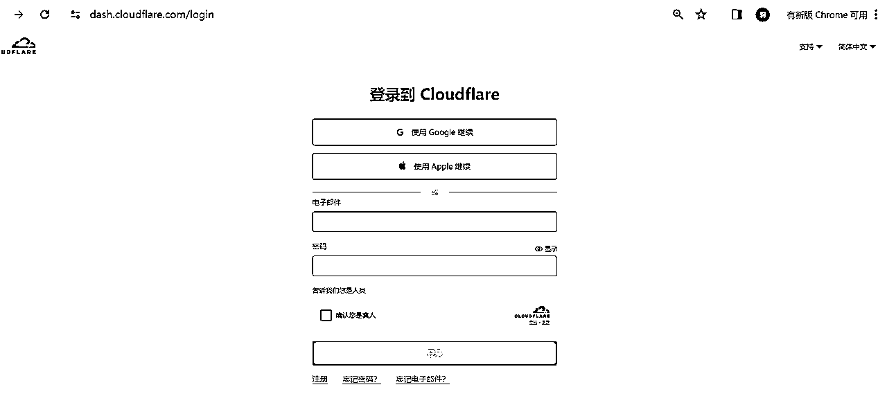

图2 登录进去后，点右上角“添加”，会出来一个下拉框，点连接域：

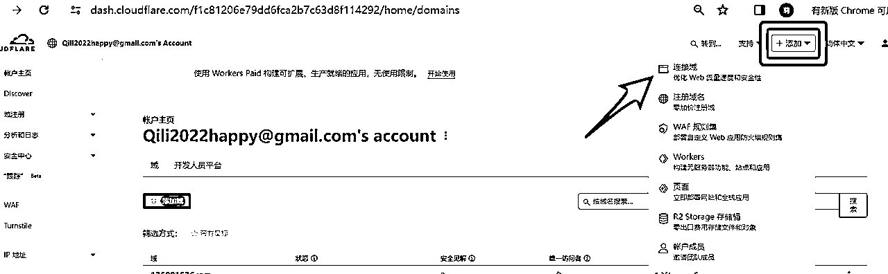

图3 把前面购买的域名填入

图4 选FREE,点继续

### （2）设置DNS(图5~图13)

图5 出现以下页面，忽略中间，点左侧DNS（这里是跟航海手册不一样的地方）

图6 找到页面最下方的两个网址，即子域名

图7 放大看看，这两个网址等下要复制的

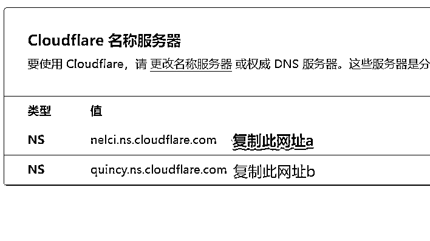

图8 回到买域名的spaceship管理域名的页面

https://www.spaceship.com/application/domain-list-application点域名

图9 出现右侧功能栏，点Nameservers&DNS

图10 点change

图11 出现两个子域名网址，把图7中的网址复制过来，替换原有的网址，不用管是什么意思，照做就好

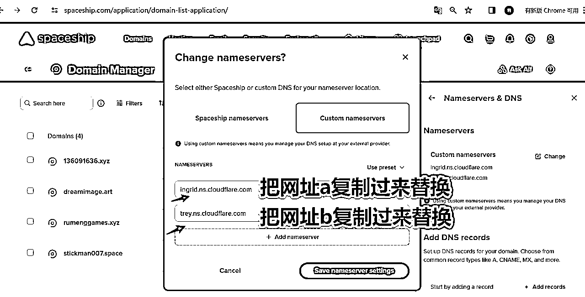

图12 替换之后点save保存

图13 保存之后会出现右上角的一句话

### （3）设置pages与github关联（图14~图26）

图14 回到claudflare页面,右上角点“转到”，是要跳转到主页

图15 在最上面搜索框输入“主页”两个字，

图16 进入主页，看左侧是红框的样子，点域名

图17 进入dreamimage.art,点右上角“添加”

图18 出现选项框，选第4行“页面”

图19 进入work and pages 页面，点“pages”

图20 进入pages页面，点右上角“添加”

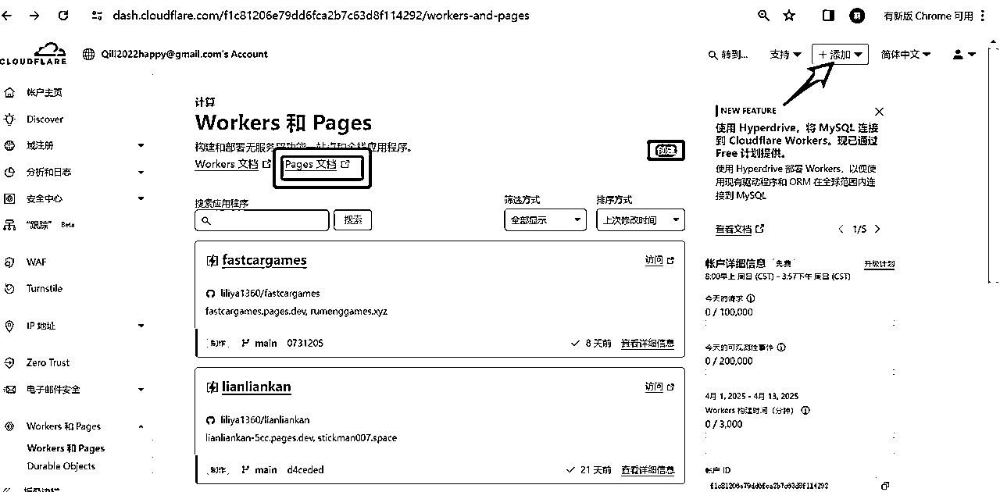

图21 进入创建应用程序，点连接到Git，这一步开始是要连接到Github仓库

图22 选择一个存储库 aidanghang

图23 放大这个页面，点右下角“开始设置”

图24 设置构建和部署，点右下角“保存并部署”

图25 稍等等构建和部署要花时间的

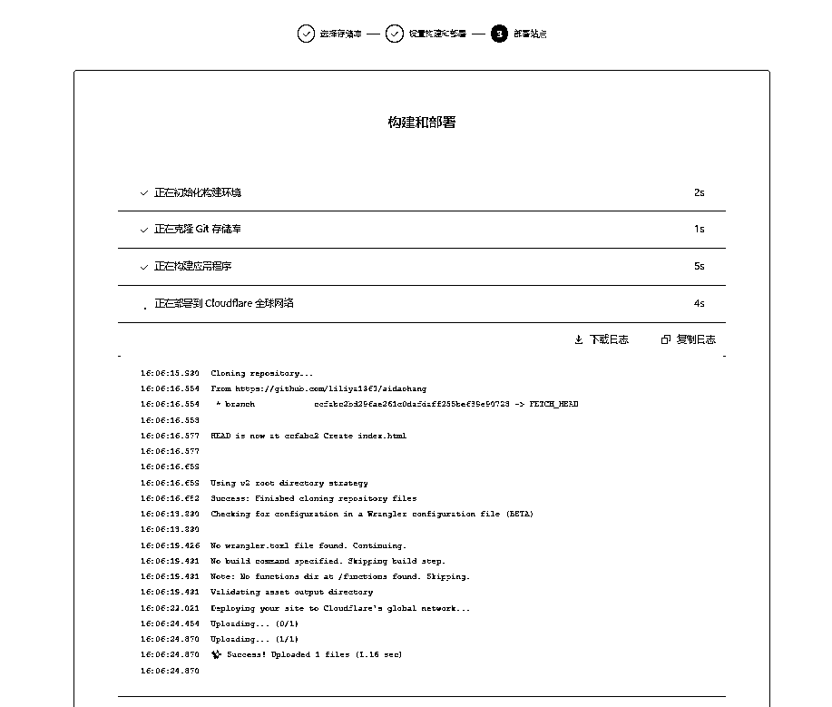

图26 成功部署，点“继续处理项目”

### （4）设置自定义域（图27~图32）

图27 回到主页，点自定义域

图28 设置自定义域

图29 添加自定义域，输入购买的域名，我输入“dreamimage.art”,点继续

图30 这里有一个我踩坑多次的地方，如果出现图30这里的“该项目与现有项目关联，请使用其他域，或找到已使用此域的项目，将其删除”的字样，就跳转到后面看删除图8~图11的操作

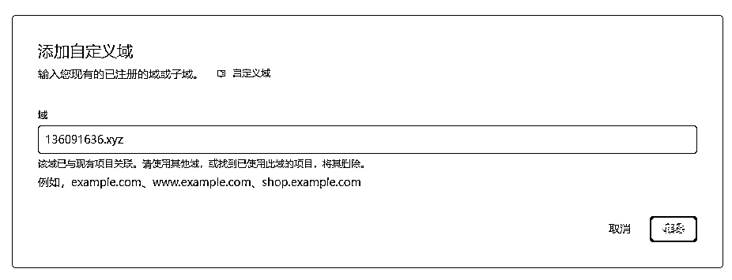

图31 确认新DNS记录，点激活域

图32 验证中，完成后点左侧“账号主页”

### （5）设置SSL/TLS(图33~图37)

图33 回到账户主页，找到域名，最后一列的三个点，点一下，出现一个列表，点选配置SSL/TLS

图34 出现以下页面SSL/TLS，点右侧“配置”

图35 在自定义处，点“选择”

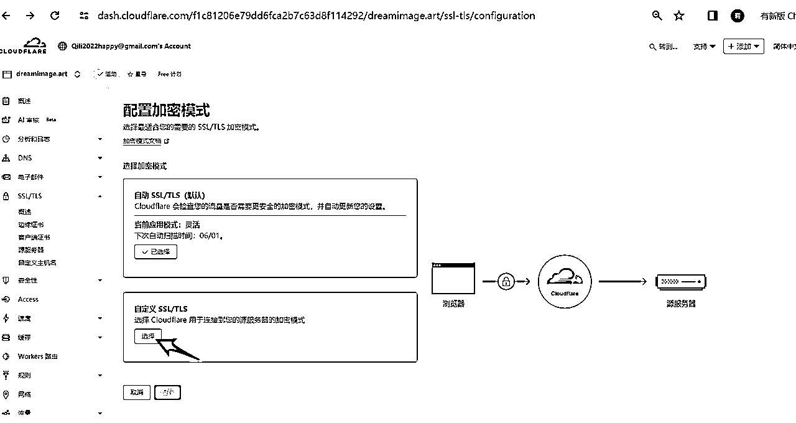

图36在自定义对话框里点选择；选择FULL即“完全”模式，再点保存

图37 完成啦，点击域名dreamimage.art,我做的粗糙的导航站，还可以优化。

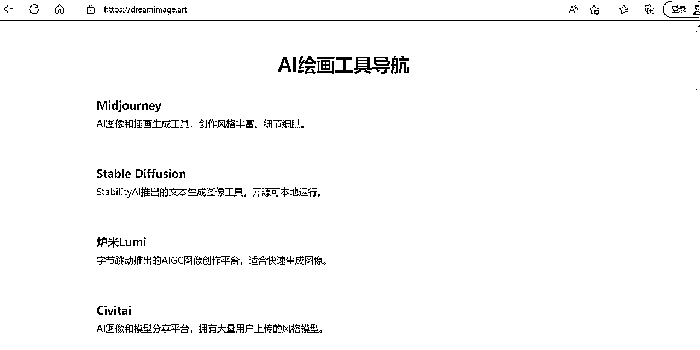

# 三、各种文档删除操作

在整个上站的过程中，以及看船友们在群里的提问，各个地方的重复操作之后，找不到删除的地方是一个普遍的问题，不知道是不是国外的软件对于“删除”的操作非常谨慎，都藏在很隐蔽的地方，不认真找是找不到的。

结合我自己使用过程中的摸索和操作，汇总了这几个常见的删除的操作，来应对错误操作回去重新开始，但文件名重复的问题。

## 1.Github项目删除（删除图1~删除图6）

删除图1 在github仓库页面点setting

删除图2 页面最下方delete this repository

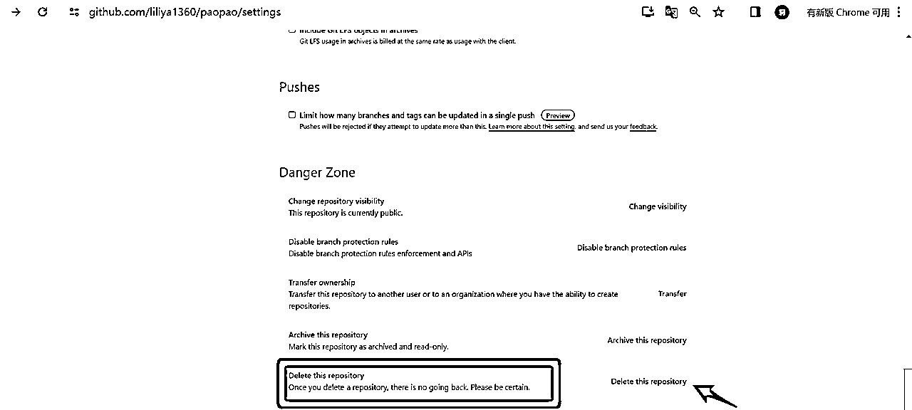

删除图3

删除图4

删除图5

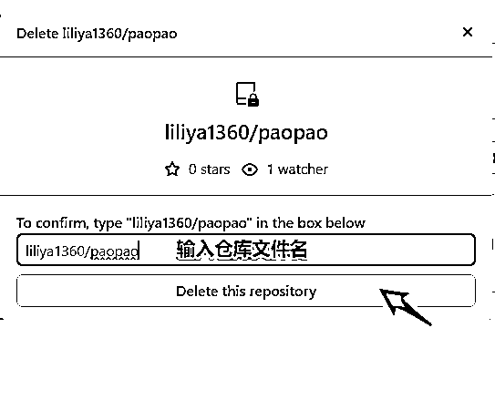

删除图6

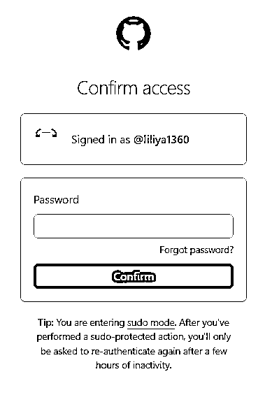

输入密码后确认，删除完成。

## 2.claudflare管理的github项目与域名解套（删除图7~删除图15）

前面图29的那个地方，如果之前做过操作但是错了，想重新来，对不起，就告诉你该域重复，所以需要删除原有使用这个域的项目。但是，找到并且断开它，是一个系统工程。

删除图7（图30）

删除图8 先回到works and pages,挨个点0429、0428、mbti这些项目，看看是哪个项目把上述的域名占了，其中一个名为mbti的项目下面显示那个重复的域名，所以需要删除这里。

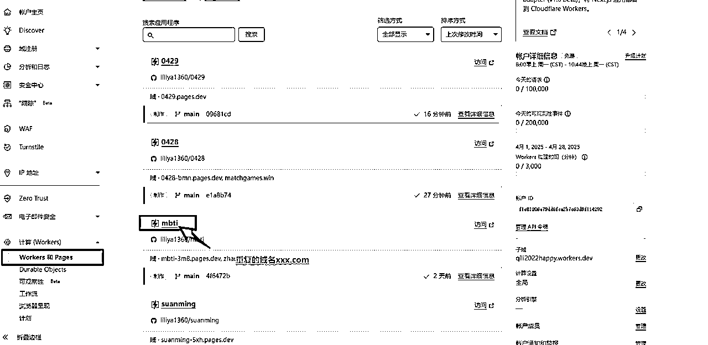

删除图9，点开mbti后发现，果然是这个名为mbti的github项目占用了这个域名，所以需要把它删除。

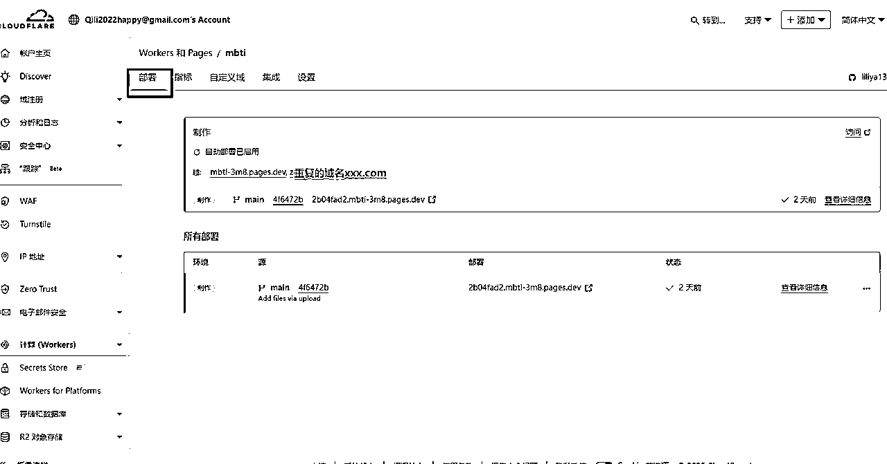

删除图10，点选“自定义域”，就出现以下页面，在右下角三个点点开，出现“删除域”，点选即可删除。

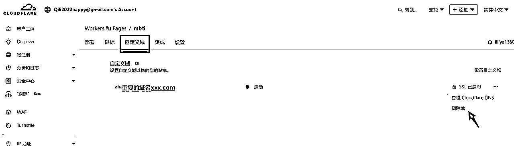

此时就把域名和项目解套了，可以重复上一步图29、图30，完成域名的配置。

## 3.删除项目

删除图11~图13 拽到网页最下方，点红色小字“删除”，这个位置极为隐蔽，不知道设计网站的人是怎么想的

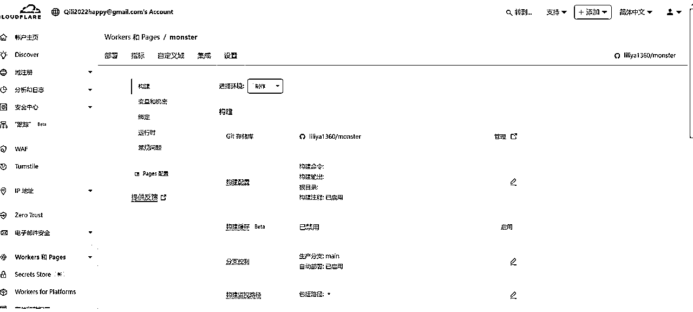

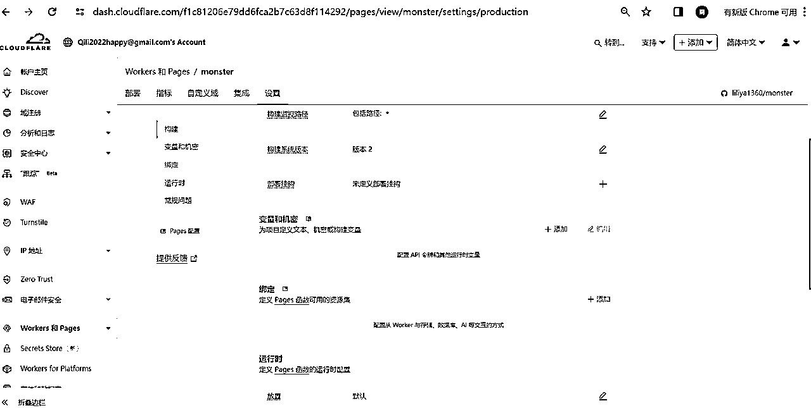

删除图14

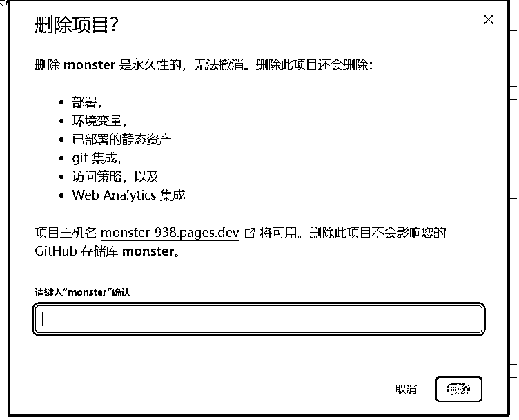

删除图15

删除图16 不出意外的是，意外出现了，这里还不让删

于是又研究了许久，GPT真是好用，我把这个截图发给了GPT，它告诉我在删除这个之前，还要先重复前面解套删除图8-10的环节。自定义域下，点后面三个点，就出来了“删除域”，点选即可删除

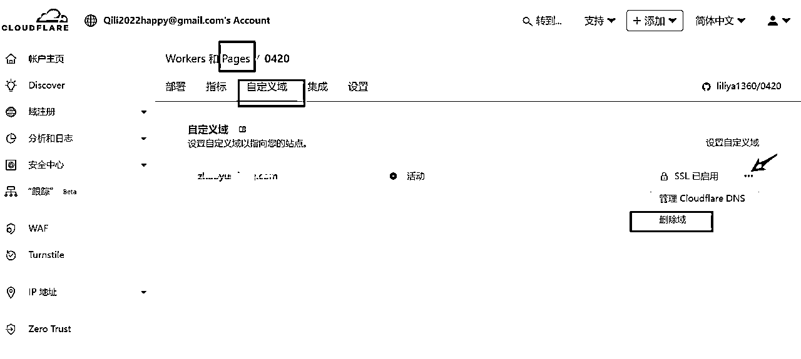

再次回到删除图9~图11底部，点删除，就完成了删除重复项目的动作，继续前面图39之后的动作。

## 4.claudflare管理的域名删除（删除图16）

删除图17（图32）如果前面出错了，重复了，就可以在这里的右侧最后一行“从claudflare删除”,这样就可以把之前重复的、报错的域名删除掉。

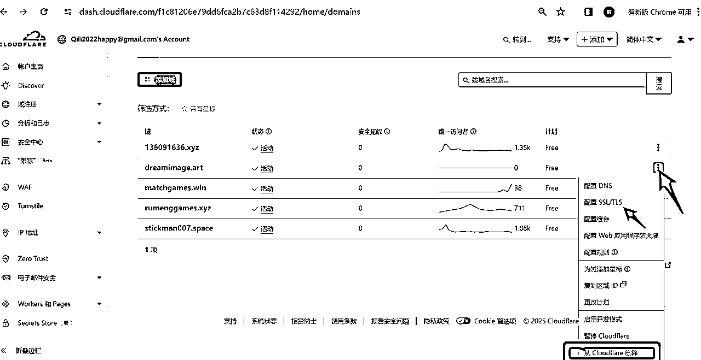

# 四、其他收获

希望卡在claudflare这里的圈友能够少走一点弯路，快速跨过流程的坎，进入到下一个阶段。上站完成只是第一步，我在群里问教练，下一步要做什么的时候，教练说要先上100个站，做到非常熟练，学习找需求，找热词、学习SEO，搞流量，比较简单的是adsens,广告收入等等。

原来这就像抖音账号第一个视频发布，要想变现，需要找爆款对标，流量起来之后，再带货或者卖课等等，找到合适自己的变现模式。

仅仅是21天的开始，从一个新手到能上4个站，还是要夸一夸自己呀。三个游戏站：136091636.xyz;rumenggames.xyz;stickman007.space;一个导航站：dreamimage.art。

学习使用manus,cursor,继续使用bolt，以及很多操作、心态上的进步，距离良辰美老师说得月入万刀差距很大，可是毕竟已经开始了呀。

天辉老师一直保持在船员榜榜首的，几年前就是看了他的帖子开始学习AI绘画，是我用AI的起步的引领者，看他每天的更新和学习的过程，非常受鼓舞。

他说良辰美教练是上到第20个站的时候开始逐渐入门的，持续挖掘需求、持续做，前面有一个榜样，跟着走就好。

还有一个感悟就是，任何一件事情都是有积累的，年前参加生财超级标，以及有了copy小排老师的动作，对于AI的理解相对多一点，所以一开始的时候上手比较快，后面导航站比较复杂没搞定，也没关系，我慢慢来。

感谢小排老师 https://scys.com/articleDetail/xq_topic/4848511545851418，这篇文章给我的启发最大，其他的文章我还在努力学习中；感谢良辰美教练、志愿者可伊，感谢天辉老师、奋斗，以及其他朋友们，加油，为日入万刀的目标，梦想总要有的，万一实现了呢！