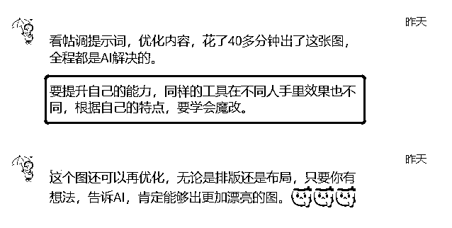
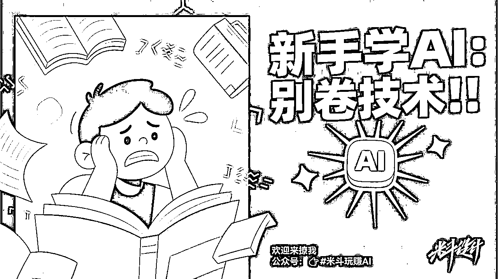
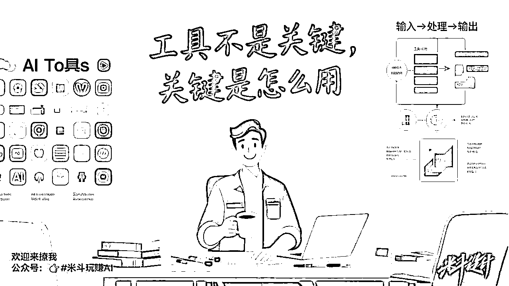
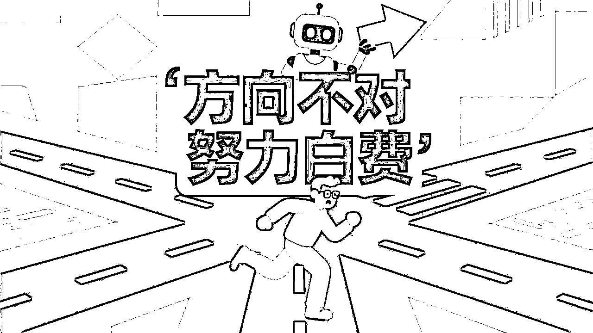

# 别再乱学了！新手学AI最实用的3个实操指南，学会比别人快5倍

> 来源：[https://s296cam1nz.feishu.cn/docx/Y0ggdpoaSo0h7JxVTKJcebbsnVc](https://s296cam1nz.feishu.cn/docx/Y0ggdpoaSo0h7JxVTKJcebbsnVc)

Hello，我叫米斗，品牌商业增长顾问，AI视觉营销设计师，分享能解决实际问题的AI工具/方法！请多多指教~

前言：

有圈友在问，新手如何去学习和使用AI？

当时在社群里面已经回答ta了，我想其他圈友应该也有同样的问题，于是我就写了这篇文章。

# 新手怎么学AI？别卷技术，先搞懂这3件事

## 💡 别盲学！大多数人学AI的第一步就错了

最近有朋友问我：AI工具这么多，我是不是每个都得学会？

老实说，我特别能理解这种焦虑。

AI日新月异，工具更新跟坐火箭一样快。

但我的答案是：不用卷技术，更不用全都会。

你真正要搞懂的是——怎么把AI用到自己的业务里，用出结果。

今天我想跟你聊聊，新手学AI前，最应该明白的3件事。

少走弯路，早点见效。

* * *

## 第一件事：AI不是魔法棒，而是效率放大器

🧠 金句总结：同样的工具，不同的人用，效果差距巨大。

AI不是主角，你才是。

工具就像锤子，你想钉钉子，它就是神；你拿它切菜，那就是笑话。

有次我在做图，调提示词、改细节，40分钟搞定，全程AI完成。

重点不在于我用了哪个AI，而是我清楚我要什么——这才是关键。

你是不是也常常反过来了？

一打开新工具就开始研究怎么用，而不是问自己到底要解决啥问题？

### ✅ 如何用好AI：

*   不要为了学工具而学工具，先问清楚“我要解决什么问题？”

*   有目标就有思路，有思路AI才能帮你。

*   工具越用越多，但你要让它服务你的思维，不是主导你的思维。

* * *

## 第二件事：别学技术，先学“场景+流程”的应用思维

🧠 金句总结：工具不是关键，关键是你用在哪儿、怎么用。

### ✅ 商业提效的本质，是“场景适配”

AI用在哪儿，效果完全不同。

做设计、写公众号、跑社群，AI都有不同用法。

你要从自己每天的工作流程里找机会点，把AI套进去。

### ✅ 学工具不如学“工作流”

比起死记Prompt，不如建立一套你自己的AI流程。

比如“输入——加工——产出”，更容易复制、优化、真正落地。

我经常做的事就是：

找到业务里的需求 → 选合适的工具 → 跑通流程 → 打包变产品。

甚至我请技术做出AI工具，再卖给同行。

他们不在乎你用哪个AI，只在乎“能不能提效、省时间”。

### ✅ 如何做？

*   列出你每天最花时间、重复多的工作

*   找1个AI工具试着接进去

*   建立自己的“AI流程卡片”：写文流程、图像流程、社群流程都行

* * *

## 第三件事：先白嫖、再魔改、再做成自己的工作流

🧠 金句总结：新手入门，先低门槛起步，再靠实战不断魔改。

很多人一上来就买课、装插件、报班，其实没必要。

先用免费的，试试看能不能解决你的小问题。

比如你让AI写篇文案、出个方案、整理笔记。

试几次你就知道，它值不值得你深入用。

我经常做的事就是“魔改”Prompt（提示词）。

明明是同一个工具，用在我手里效果可能更好。

关键就在于：我调教得更贴合自己的需求。

只要你有想法、会表达，就能把AI变成自己的超级助理。

### ✅ 如何做？

*   从你当前的问题出发：写内容、做PPT、处理表格都可以

*   找免费工具（元宝、ChatGPT、文心一言等）开始试用

*   把你的需求写清楚，不断优化提示词

*   流程跑通后，沉淀成你自己的“AI SOP”

* * *

## 🔚 方向不对，努力白费。AI也是~

前段时间，AI热到爆炸，大家都在卷炫技、写高级Prompt。

但老实说，如果不能服务业务，不能落地创造价值，就没意义。

真正决定命运的，从来都不是技能，而是方向。

你努力的方向对了吗？AI只是助推器，不是终点。

学对方向，比学会所有工具都重要。

所以，新手学AI：

别怕不会、别卷技术。

搞懂这三件事，你就已经比80%的人走得快了。

👉 想继续学AI实操、选工具、建流程？

欢迎关注我【米斗玩赚AI】，持续更新真实案例+高效玩法。

你现在在用AI做什么？欢迎留言告诉我～