# 省钱有术：免费旅居杭州3个月

> 来源：[https://jx8j59ahkjb.feishu.cn/docx/ZeJDdYEB6ojfd5xtajScXUtinfc](https://jx8j59ahkjb.feishu.cn/docx/ZeJDdYEB6ojfd5xtajScXUtinfc)

# 政策来源：

临平区自2023年推出“青荷驿站”以来，取得了“半年内30天住宿保障，最多7天免费”保障实效，已累计保障来临求职大学生近6000人次！为杭州市人才招引贡献了积极力量。

为吸引和留住更多青年人才，临平区精准聚焦青年人才过渡性住宿需求，于2024年8月重磅推出“亲青公寓”，为人才提供最长6个月免费住宿保障，给人才足够的时间扎根杭州，茁壮成长

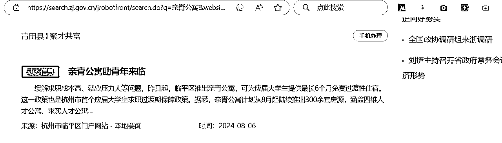

浙里办

杭州市临平区的纪录片

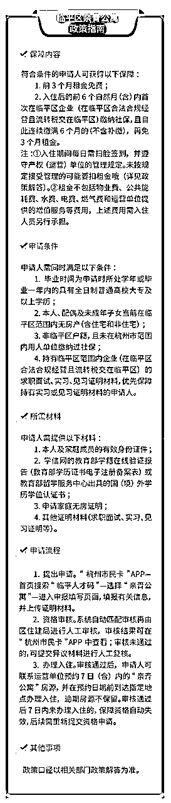

# 我的成功案例：

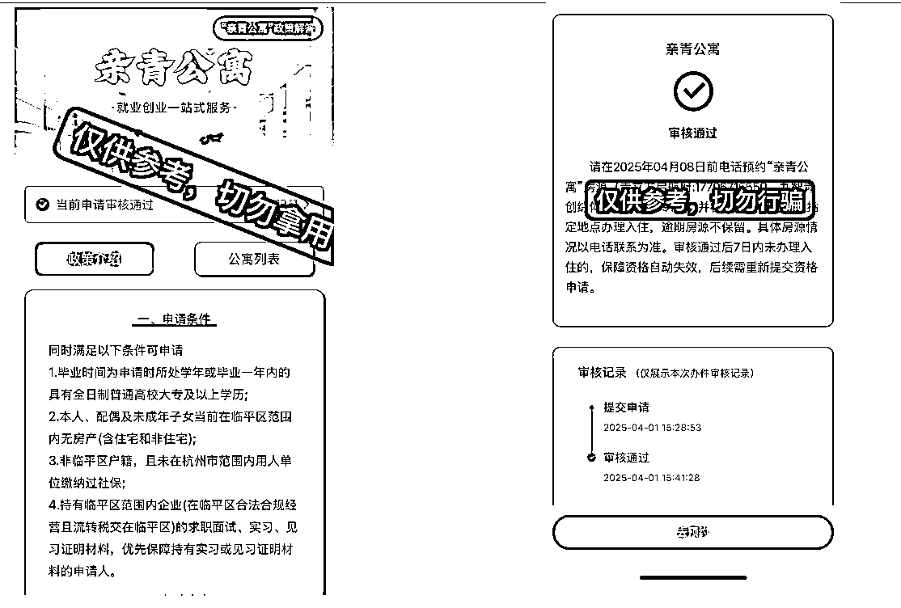

两室一厅一厨房一独立卫浴（阳台）

（冰箱、洗衣机、空调（俩卧室，客厅都有）等家电都是新的）

内部签订的合同（有盖章）——部分展示

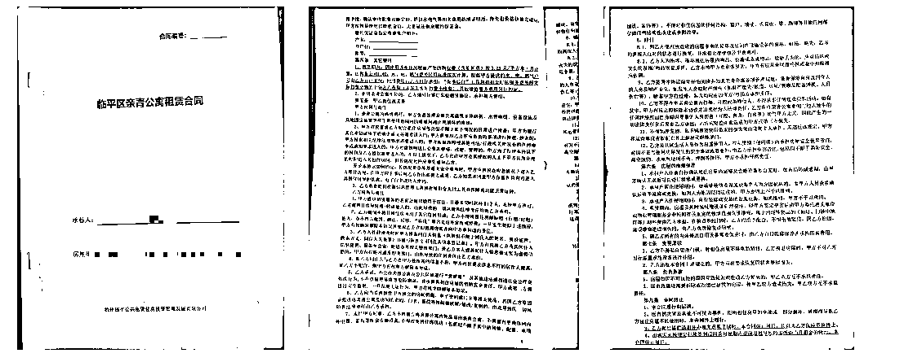

## 一、政策撬动的核心价值：为什么这是应届生来杭的「破局点」？

### （一）杭州租房市场现状与应届生痛点

1.  成本高压：2025 年杭州应届生平均房租 1800-2500 元 / 月，3 个月房租占月薪 30%-40%（以杭州平均应届生起薪 6000 元计算），相当于吃掉试用期全部存款

1.  过渡真空期：从「租房签约 - 入职适应 - 首月发薪」存在 45-60 天资金断档，传统租房需押一付三，动辄 8000 + 启动资金

1.  信息差壁垒：70% 应届生不知「亲青公寓」等政府保障性住房政策，误信中介「应届生无社保不能租房」谣言

### （二）临平政策的「破局杠杆」

政策拆解：为什么这是“信息差金矿”？

1.  政策核心条款（100%官方验证）

*   免费期：前3个月0租金，第4-6个月按市场价6折（需连续缴纳临平区社保）。

*   覆盖人群：

*   毕业2年内全日制/非全日制高校毕业生（含专升本、成教，学信网可查）。

*   隐藏条件：劳务派遣员工需用工单位注册地在临平（非总公司）。

*   退出机制：若中途离职或断缴社保，需补交房租差价（例：住满2个月后离职，补交第3个月市场价50%）。

以下情况不建议申请亲青公寓：

1.住宿需求不满一个月的。办理入住后，首月租期内超过10天（含）未扫脸签到或在退租时首月租期剩余超过10天（含）的，需缴纳首月租金he

——这个推荐青荷驿站（免费住7天）——微信搜索：人才杭州（小程序）里面包含了杭州所有区的青荷驿站、大学生基础补贴政策

2.已经申请“青荷驿站”的。享受过“青荷驿站”住宿保障的，不得再以面试通知书作为证明材料申请“亲青公寓”住宿保障。已经享受“亲青公寓”住宿保障的，不得再申请“青荷驿站”住宿保障

3.已经在杭州市找到工作的。申请“亲青公寓”保障需遵循“入住在前、工作在后”的原则，入住前已与杭州市范围内用人单位签订劳动合同或在上述单位缴纳社保的人员不得享受租金免费和租金优惠。一经查实，申请人需全额补交相关费用，产权（运营）单位可视情将其清退

1.  真实成本核算（以2024年数据为准）

注：叠加杭州应届生生活补贴（本科1万），实际人均到手收益超2万元。

| 政策优势 | 传统租房 | 临平亲青公寓 | 价值差 |
| 租金成本 | 押一付三≈8000 元 | 0 元（前 3 个月）+ 政府补贴价（后 3 个月） | 直接省 6000-12000 元 |
| 申请门槛 | 社保 / 收入证明 | 毕业证 + 劳动合同 + 无房证明 | 降低 70% 材料复杂度 |
| 配套服务 | 无 | 免费就业指导 + 企业内推会 + 通勤班车 | 隐性价值≈3000 元 |

## 二、从「知道政策」到「成功入住」的 3 个关键卡点

### （一）卡点 1：政策信息碎片化，找不到核心入口

解决方案：搭建「政策导航图」

1.  官方渠道：「亲青在线」小程序（共青团浙江省委唯一入口）→首页「亲青公寓」→选择「临平区」

1.  线下辅助：临平区人才服务中心（南苑街道南大街 265 号）每周三「政策快办日」，现场可打印无房证明（带身份证原件）

### （二）卡点 2：申请条件模糊，担心自己「不够格」

精准匹配 3 大核心条件（附自查清单）：

1.  身份条件：毕业 2 年内高校毕业生（学信网可查学历，非全日制本科 / 专科均可）

1.  就业条件：与临平区企业签订 1 年以上劳动合同（含试用期，劳务派遣公司需用工单位注册地在临平）

1.  住房条件：本人及配偶在杭州无房（含集体宿舍，可在「浙里办」→「不动产查询」开无房证明）

### （三）卡点 3：流程繁琐，怕「跑断腿」

实测最简流程（总耗时≤2 小时）：

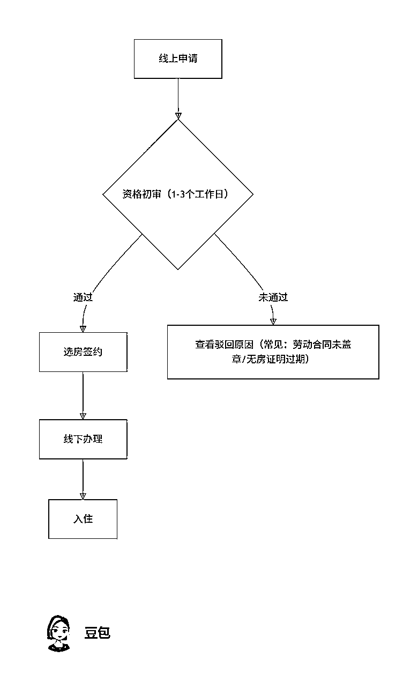

打开“杭州市民卡”软件，

搜索框输入“临平人才码”，

点击进入

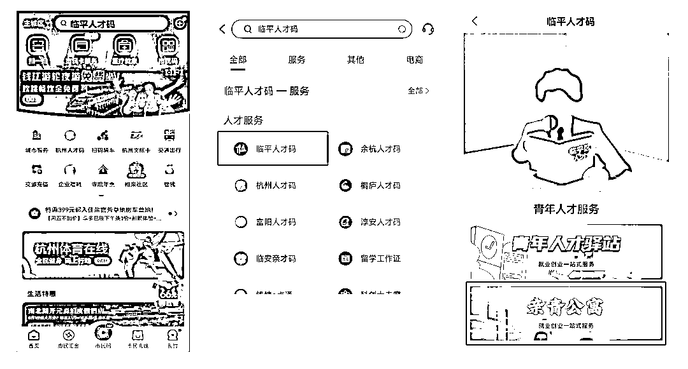

点击进入“亲青公寓”进入申请界面——等待审核

2.资格审核。系统自动匹配审核再由区住建局进行人工审核，审核结果可在“杭州市民卡”APP中查看；审核未通过的，可提交异议材料进行人工复核。

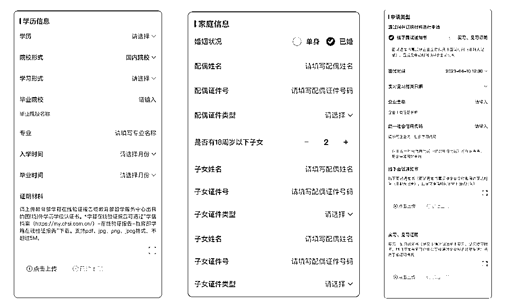

填写信息，提交申请

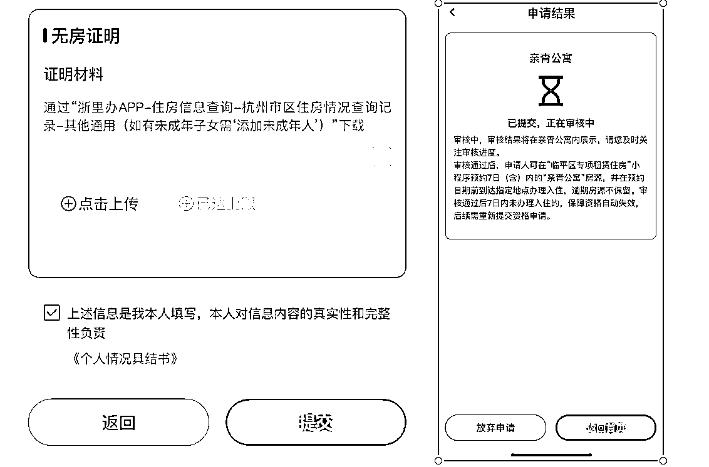

| graph TD |

3.办理入住。审核通过后，申请人可通过“临平区专项租赁住房”小程序预约7日（含）内的“亲青公寓”房源，并在预约日期前到达指定地点办理签约入住，逾期房源不保留。审核通过后7日内未办理入住的，保障资格自动失效，后续需重新提交资格申请。

长按识别

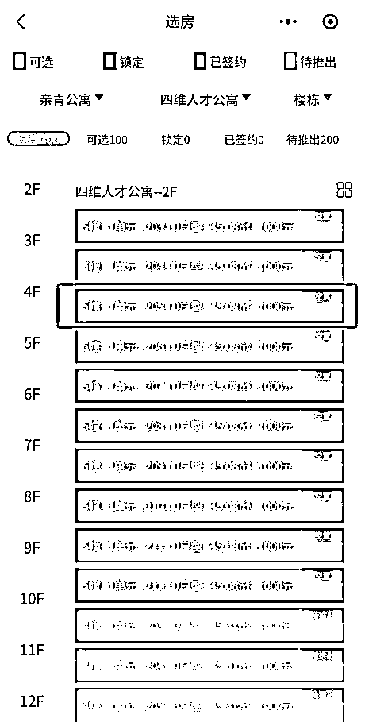

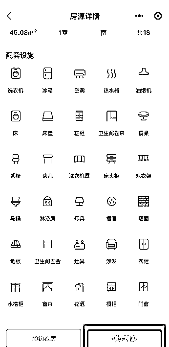

确定后点击“锁定房源”，7天内到现场报到

有没有不适合申请的情况？

以下情况不建议申请亲青公寓：

1.住宿需求不满一个月的。办理入住后，首月租期内超过10天（含）未扫脸签到或在退租时首月租期剩余超过10天（含）的，需缴纳首月租金。

2.已经申请“青荷驿站”的。享受过“青荷驿站”住宿保障的，不得再以面试通知书作为证明材料申请“亲青公寓”住宿保障。已经享受“亲青公寓”住宿保障的，不得再申请“青荷驿站”住宿保障。

3.已经在杭州市找到工作的。申请“亲青公寓”保障需遵循“入住在前、工作在后”的原则，入住前已与杭州市范围内用人单位签订劳动合同或在上述单位缴纳社保的人员不得享受租金免费和租金优惠。一经查实，申请人需全额补交相关费用，产权（运营）单位可视情将其清退。

目前可以申请哪些房源？

亲青公寓首批计划推出300余套房源，将于8月起陆续推出，主要分布在以下两个点位：

1.四维人才公寓

地址：杭州市临平区崇贤街道丽水北路802号

联系电话：17706715550

收费标准：市场租金约1000元/月·套，物业费（含能耗费）按3.25元/平方米·月计算，水、电、燃气费按民用标准按实计算，网络费用自行承担。具体内容以协议约定为准。

优势：

1.  房源充足：项目规模较大，提供1308套不同面积户型，选择空间广。

1.  教育资源丰富：直线3公里内有多个幼儿园、小学（如文渊小学）和中学（如杭州师范大学附属崇贤中学）。

1.  交通潜力：周边规划有宁桥大道西延等道路工程，未来交通可能进一步优化。

注意点：

• 地铁覆盖较弱，需依赖公交或自驾，最近地铁站为1号线平安桥站，距离稍远。

• 崇杭街部分路段早晚高峰存在拥堵情况，目前通过绿波带和警力疏导缓解。

2.九智人才公寓（我选择的）

地址：临平区石塘东路与东湖南路交叉口西北120米

收费标准：市场租金约1400元/月·套，物业费（含能耗费）按3.25元/平方米·月计算，水、电、燃气费按民用标准按实计算，网络费用自行承担。具体内容以协议约定为准

注意：成功预约房源后，办理入住时请自备床上用品和其他日常生活用品哦！

优势：

1.  交通便利：临近地铁9号线乔司南站，步行即可到达，另有公交1707M路、2631M路覆盖，周边还有东湖高架路，自驾便捷。

1.  生活配套成熟：毗邻宜家家居、华荣城等大型商业综合体，周边有算力小镇，教育资源丰富（启文中学、东城第二实验学校等），医疗配套完善（人民医院乔司分院、城东医院）。

1.  拎包入住：房间配套齐全，包含沙发、冰箱、空调等基本家具家电。

注意点：

• 靠近地铁和高架，部分楼栋可能存在噪音问题。

• 周边小区出租率较高，人员流动性较大。

摄图网_501220367（非实拍图）

### 总结建议：

根据两个位置的具体情况，从交通、生活配套和居住环境三个维度进行对比分析：

• 选择乔司街道石塘东路：适合重视地铁通勤、商业配套成熟度，追求生活便利性的人群。

• 选择青立方启航府：适合注重居住空间选择、教育资源，且能接受稍远地铁距离的家庭或长期居住者。

提示： 若需进一步了解具体房源细节（如租金、户型）或实地考察建议，可联系当地房管部门或中介获取最新信息。

### 二、保姆级申请教程：从材料到选房，100%避坑

#### 一、申请条件

同时满足以下条件可申请

*   1.毕业时间为申请时所处学年或毕业一年内的具有全日制普通高校大专及以上学历;

*   2.本人、配偶及未成年子女当前在临平区范围内无房产(含住宅和非住宅);

*   3.非临平区户籍，且未在杭州市范围内用人单位缴纳过社保;

*   4.持有临平区范围内企业(在临平区合法合规经营且流转税交在临平区)的求职面试、实习、见习证明材料，优先保障持有实习或见习证明材料的申请人。

#### 二、保障内容

符合条件的申请人可获得以下保障:

*   1.前3个月租金免费;

*   2.入住后的前6个自然月(含)内首次在临平区企业(在临平区合法合规经营且流转税交在临平区缴纳社保，且自此连续缴满6个月的(不含补缴)，再免3个月租金 。

*   入住期间每日需扫脸签到，并遵守产权(运营)单位的管理规定。未按规定接受管理的可能要扣租金(详见政策解答)。

#### 三、所需材料

申请人需提供以下材料:

*   1.本人及家庭成员的有效身份证件;

*   2.学信网的教育部学籍在线验证报告(教育部学历证书电子注册备案表)或教育部留学服务中心出具的国(境)外学历学位认证书;

*   3.申请家庭无房证明;

*   4.其他证明材料(求职面试、实习、见习证明等)。

### 申请材料如何获取？有什么要求？

1.学信网的教育部学籍在线验证报告（教育部学历证书电子注册备案表）或教育部留学服务中心出具的国（境）外学历学位认证书:

通过“学信档案（https://my.chsi.com.cn/）-在线验证报告-教育部学籍在线验证报告/教育部学历证书电子注册备案表”下载或教育部留学服务中心出具的国（境）外学历学位认证书〔国（境）外学历的提供〕

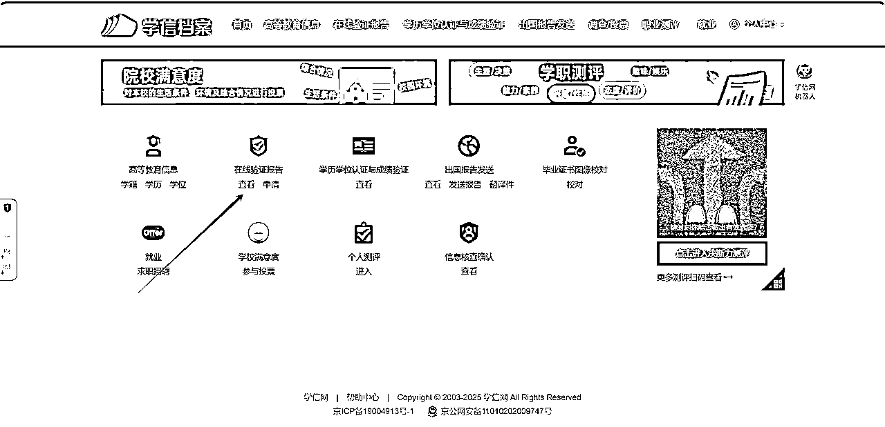

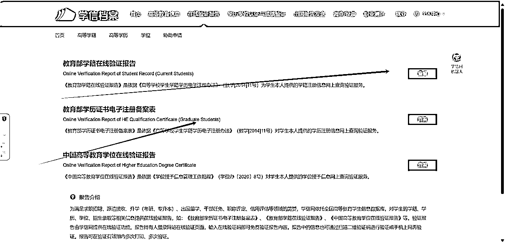

2.申请家庭无房证明：

通过“浙里办APP-住房信息查询-杭州市区住房情况查询记录-其他通用（如有未成年子女需‘添加未成年人’）”下载

我的操作：可通过支付宝：搜索个人住房信息查询/浙里办

住房信息查询-杭州市区住房情况查询记录-其他通用

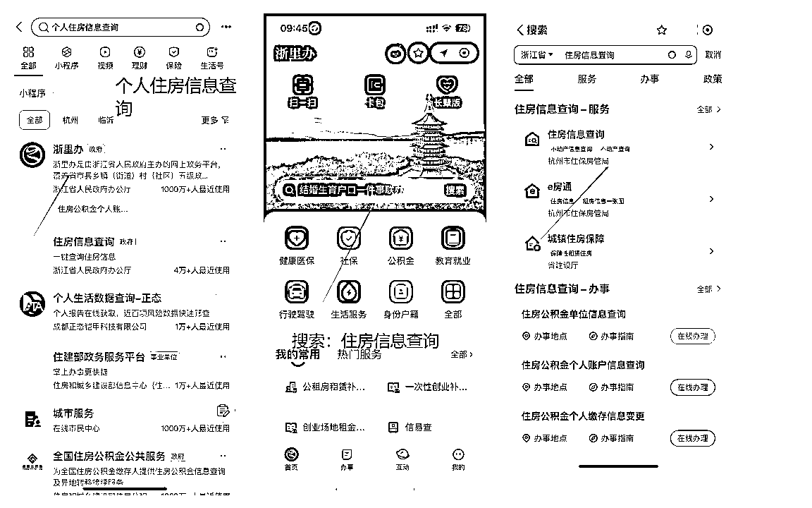

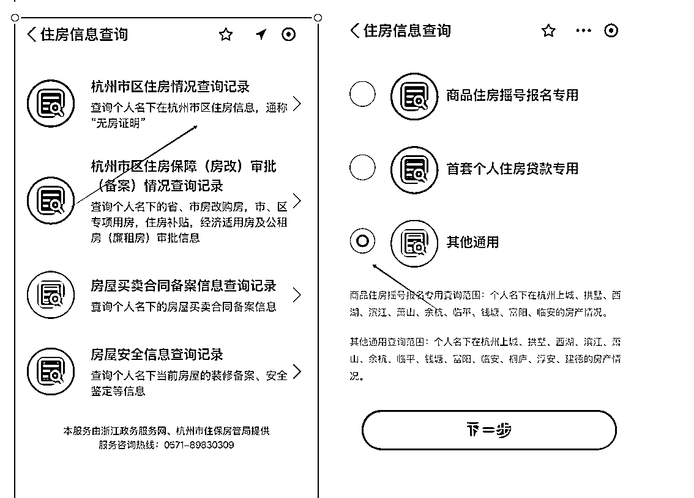

3.求职面试、实习、见习证明：提供见习证明（优先审核通过）

①面试通知书：须反映企业全称和具体面试时间，且提交申请时间须早于面试时间，线上面试不予保障，聊天记录不可作为证明材料。

这里我用的是boss的面试邀约：

（找一些销售、地推这种很容易拿到面试）

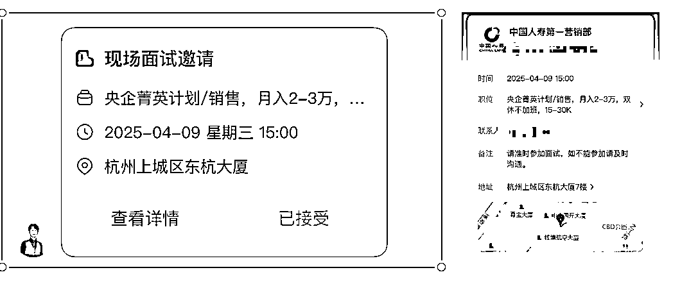

②实习、见习通知书：提交申请时间须早于实习、见习结束时间。通知书中须具备以下几个要素：申请人姓名、公司全称、实习/见习起止时间、企业联系人和联系方式、企业盖章（须为企业公章或者企业人事部门公章）或由企业域名邮箱发送，聊天记录不可作为证明材料。

参考我通过的实习证明：

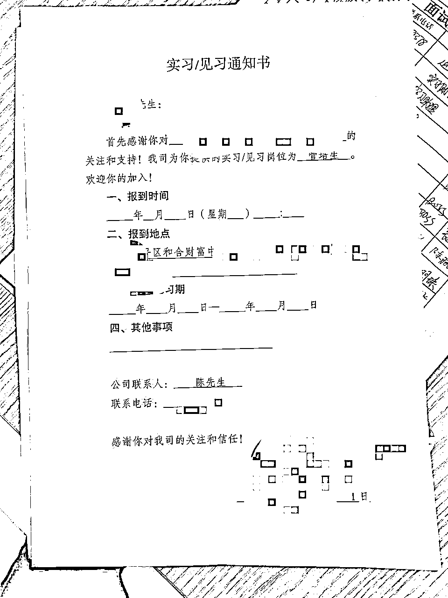

1.  材料准备（附模板截图）

*   劳动合同雷区：

*   必须包含企业统一社会信用代码（扫描营业执照副本比对）。

*   案例：某用户因合同未注明“试用期包含在1年期限内”被驳回（图1）。

*   无房证明：需选择“杭州市全域”版本（非“临平区”），有效期30天（图2）。

1.  申请全流程（含时间节点把控）

*   线上申请：每日10点/15点系统集中审核，10点提交当日出结果概率70%。

*   加急技巧：拨打0571-86139901，报“企业紧急用工需求”，审核可缩至1天（政府优先保障重点企业）。

*   选房策略：

*   黄金房源：南苑站1公里内公寓（如金地艺境西区），步行10分钟到地铁，周边外卖/商超齐全。

*   黑名单：塘栖工业园区公寓（无地铁、班车仅早晚1班，夜间打车费日均50元）。

1.  致命细节（90%的人不知道）

*   社保卡绑定：入住后需3日内通过“杭州民卡”APP绑定社保卡，否则第4个月无法享受6折。

*   短租选项：系统默认1年起租，需手动勾选“应届生政策-6个月”，否则退租时需付违约金。

关键动作：上传材料时，劳动合同需拍照「首页 + 盖章页 + 期限页」，无房证明选择「全市范围」版本（有效期 30 天，建议申请前 3 天内开具）

# 临平区“亲青公寓”政策解答

材料来源：政府的公开文档

01已经申请过临平区“青荷驿站”（青年人才驿站）的，是否可以申请“亲青公寓”？

答：享受过“”住宿保障的（含已领取优惠券但未实际使用的），只能以实习、见习证明材料申请“”住宿保障，不得再以面试通知书作为证明材料申请。已经享受“亲青公寓”住宿保障的，不得再申请“青荷驿站”住宿保障。

02保障内容具体包括哪些？

答：审核通过的申请人，可享受以下保障：

①前3个月租金免费；

②入住后的前6个自然月（含）内首次在临平区企业（注册地点、办公地点和流转税缴纳地点均在临平区范围内）缴纳社保，且自此连续缴满6个月的（不含补缴），可再免3个月租金，否则后3个月租金按照入住房源市场价的8折收取，具体金额以协议约定为准。

03“入住后的前6个自然月（含）内首次在临平区企业（注册地点、办公地点和流转税缴纳地点均在临平区范围内）缴纳社保，且自此连续缴满6个月的（不含补缴）”具体指什么情况？

答：假设2025年3月20日签约办理入住，需在3月、4月、5月、6月、7月、8月这6个自然月内首次在临平区企业缴纳社保，9月（含）以后缴纳社保则不符合条件。如5月首次缴纳社保，则需5月、6月、7月、8月、9月、10月连续缴满6个月，期间断缴、补缴均不符合条件。入住人员需与用人单位做好沟通，如出现断缴、补缴情况，后果自负。

04在临平找到工作后，因数据延迟等原因，在暂时还查不到社保缴存信息的情况下，能否申请“亲青公寓”？

答：申请“亲青公寓”保障需遵循“入住在前、工作在后”的原则，入住前已与杭州市范围内（含所有区、县、市，下同）用人单位签订劳动合同或在上述单位缴纳社保的人员不得提交申请。工作人员在核验资格时可通过要求申请人提供劳动合同等材料、查证申请人社保缴纳时间等方式进行确认，一经查实，申请人需全额补交相关费用，产权（运营）单位可视情将其清退。

05提交证明材料时，对面试通知书和实习、见习通知书有什么要求？

答：面试企业必须是注册地点、办公地点和流转税缴纳地点均在临平区范围内的企业。

证明材料具体要求如下：

①面试通知书：须反映企业全称和具体面试时间，且提交申请时间须早于面试时间，线上面试不予保障，聊天记录不可作为证明材料。

②实习、见习通知书：提交申请时间须早于实习、见习结束时间。通知书中须具备以下几个要素：申请人姓名、公司全称、实习/见习起讫时间、企业联系人和联系方式、企业盖章（须为企业公章或者企业人事部门公章）或由企业域名邮箱发送，聊天记录不可作为证明材料。

06审核通过后资格有效期多长时间，如何预约房源？

答：审核通过后，申请人可在微信中搜索“临平区专项租赁住房”小程序，预约7日（含）内的“亲青公寓”房源，并在预约日期前到达指定地点办理入住，逾期房源不保留。审核通过后7日内未办理入住的，保障资格自动失效，后续需重新提交资格申请。

07申请人提交异议时，审核条件如何核验？

答：申请人提交异议时，视为重新提交申请，以异议提交时的申请人的情况核验其资格。

08入住期间，入住人员如何管理？

答：入住期间，入住人员每日需扫脸签到。相关管理工作参照入住房源类型对应的文件和规定执行。

09租赁时长如何计算？

答：按实际入住时长计，每个实际月内，未住满1个月的，按照1个月计。“未住满1个月的”共有两种情形：

①当月租期内超过10天（含）未扫脸签到的；

②退租时当月租期剩余超过10天（含）的。

10入住期间，除租金外，还包括哪些费用？

答：除租金外，还有物业费（含公共能耗费）、水费、电费、燃气费和产权（运营）单位提供的增值服务等费用，上述费用需入住人员另行承担。具体费用和支付方式以协议约定为准。

11租期未住满的，租金和其他费用如何收取？

答：累计未住满1个月（含）的，租金和物业费按1个月计；累计居住1个月以上不足2个月（含）的，租金和物业费按2个月计，以此类推。其他费用按实收取。符合租金免费条件的，租金可免缴。

12产权（运营）单位是否可以收取履约保证金？

答：可以。累计租赁时长（含首次签约）不超过4个月的，收取数额为1个月市场评估价租金；累计租赁时长（含首次签约）4个月以上但不超过5个月的，收取数额为2个月市场评估价租金；累计租赁时长（含首次签约）5个月以上但不超过6个月的，收取数额为3个月市场评估价租金。退还方式等具体内容以协议约定为准。

13保障对象住满6个月后，是否还可以继续租赁“亲青公寓”，租金如何计算？

答：“亲青公寓”保障期限最长6个月，入住房源的产权（运营）单位根据实际情况自行决定是否同意原承租人继续租赁。同意继续租赁的，衔接执行既有政策，租金由产权（运营）单位根据入住房源类型相应规定收取。如人才专项租赁住房类型的“亲青公寓”。第7个月起，租金按照人才专项租赁住房的政策执行；如人才公寓类型的“亲青公寓”，租金按照该人才公寓的既有规定执行。其他类型房源同理。第7个月起，需腾出原有房间，搬入同一小区的其他房源，具体以协议约定为准。

14保障期限内，哪些情形需要支付租金？

答：保障期限最长6个月，保障期限内的以下情形需要支付租金：

①免费入住3个月后，不符合“再免3个月租金”租金条件的，后3个月需支付租金；

②首月租期内超过10天（含）未扫脸签到或在退租时首月租期剩余超过10天（含）的，需缴纳当月租金，保障终止，后续各月不再享受租金免费。

③自首月住满1个月（含）后的次月起，任何一个月内超过10天（含）未扫脸签到的（提前退租的除外），需缴纳当月租金，保障终止，后续也不再享受租金免费。

15入住期间的租金如何支付，在什么时候支付？

答：申请人与“亲青公寓”产权（运营）单位签约后，可通过产权（运营）单位指定的支付渠道使用“先享后付”工具进行预授权支付（租期不超过3个月的可免预授权），或通过预缴履约保证金后根据实际情况扣除。具体以协议约定为准。申请人在前6个月的租赁期内无需支付房租，待后续核验有关情况后再判定是否扣费，并按照协议约定执行：

①如符合租金免费条件的，不扣费；

②如第6个自然月未缴纳临平区社保的，扣费的时间节点最早为第7个自然月月底；

③如未连续缴满6个月临平区社保的，扣费的时间节点最早为断缴社保之月的次月底。

④对于其他需要支付租金的情形（签到不达标或首月提前退租的），最早当月扣费。

对于需要补交租金的申请人，“先享后付”工具将从申请人支付宝等账户中扣费后划转至产权（运营）单位账户或由产权（运营）单位从履约保证金中抵扣，具体扣费方式以协议约定为准。

“先享后付”工具划扣租金时，需按照实际扣费金额的一定比例收取服务费，在申请人账户中划扣，未发生实际扣费不收取。

16入住“亲青公寓”是否支持换房？

答：“亲青公寓”房源先到先得，房源选定后不支持换房。

17“亲青公寓”满房后该怎么办？

答：满房的情况下，申请人需等候至有房源空出再预约，先预约先入住，产权（运营）单位结合实际房源情况安排有关事宜。

18每人可享受几次“亲青公寓”住宿保障？何时终止？

答：每人最多享受1次“亲青公寓”住宿保障，实际办理入住即视为享受该保障，退租或违约时保障终止。

19如遇申请人提交虚假信息骗取保障资格，该怎么处理？

答：严禁申请人提交虚假信息骗取保障资格。一经查实，申请人应全额补交相关费用，产权（运营）单位需将其清退。涉嫌违法犯罪的，将由司法机关依法追究责任。

20如遇企业协助申请人骗取保障资格，该怎么处理？

答：企业协助申请人骗取保障资格的，参加该企业面试、实习、见习的所有人员将不得再申请“亲青公寓”保障。涉嫌违法犯罪的，将由司法机关依法追究责任。

21政策中的“自然月”和“实际月”有什么区别？

答：政策中未特别说明的“月”，均为“实际月”。

①“自然月”：指的是公历每个月的1号到该月的最后一天。

②“实际月”：指的是公历A月B日至A+1月B-1日。比如6月18日至7月17日，12月6日至次年的1月5日，1月31日至2月28日或29日（2月无30日，至2月最后一天）。以上均为实际月。

22如果有其他不明事宜应该如何咨询？

答：本政策由杭州市临平区住房和城乡建设局负责解释。政策和审核咨询：0571-89186505、0571-89186527，“临平区专项租赁住房”选房小程序咨询：0571-89183650，房源预约咨询（选房前可电话预约）：17706715550（四维人才公寓）、15695719377（求实人才公寓）。工作时间为法定工作日上午9：00-12：00，下午14：00-17：00。如发现申请人提交虚假材料骗取保障资格，或者企业协助申请人骗取保障资格，可通过上述电话投诉举报。

## 三、避坑指南：90% 申请失败的 3 个致命错误

### （一）材料错误：劳动合同「暗藏玄机」

*   错误案例：某用户上传「电子劳动合同截图」被拒，因系统需识别「企业统一社会信用代码」

*   正确操作：扫描纸质合同（彩色），确保「甲方名称」与「企业营业执照」完全一致，试用期条款需明确（如：试用期 3 个月，包含在 1 年合同内）

### （二）选房策略：盯着「地铁 3 公里」范围

*   黄金区域：优先选择「临平站 / 南苑站」周边公寓（如翁梅新苑、星桥蓝领公寓），通勤 30 分钟可达临平新城商务区，且周边商超齐全

*   避坑点：远离「工业园区配套宿舍」（如塘栖某公寓，虽租金低但无公共交通，企业班车仅工作日 6:30/18:00 各一班）

### （三）时间窗口：错过「毕业季专属通道」

*   隐藏福利：每年 6-8 月毕业季，临平区会开放「应届生快速通道」，审核周期从 7 天缩短至 3 天，且额外释放 20% 房源

*   行动节点：建议拿到毕业证后立即申请（系统以「毕业日期」判断是否享受快速通道，早申请 1 周可能多 30 + 可选房源）

## 四、落地执行方案：7 天搞定「免费住房 + 求职过渡」

### Day1-2：政策吃透 + 材料准备

1.  注册「亲青在线」→完成实人认证（支付宝扫脸最快）

1.  准备核心材料：

*   毕业证扫描件（PDF 格式，非全日制需额外提供学信网电子注册备案表）

*   劳动合同扫描件（带企业公章，骑缝章非必需）

*   无房证明（浙里办→不动产服务→权属查询→选择「杭州市」，下载带水印的 PDF）

### Day3：线上申请 + 主动跟进

1.  上午 10 点提交申请（系统每日 10 点 / 15 点集中审核）

1.  下午 4 点前拨打临平区审核电话（0571-86139901），报「申请编号 + 姓名」确认材料完整性（实测可加快审核进度 40%）

### Day4-5：选房策略 + 签约技巧

1.  每日 10 点刷新房源（新释放房源集中在工作日上午），优先选「可短租 6 个月」选项（部分公寓要求至少租 1 年，需备注「应届生政策」）

1.  签约时确认「租金补贴到账时间」：前 3 个月 0 租金，第 4 个月起按市场价 6 折收取（如市场价 2000 元，补贴后 1200 元，需在「杭州民卡」APP 绑定社保卡接收补贴）

### Day6-7：入住准备 + 资源链接

1.  携带材料：身份证原件、毕业证复印件、劳动合同复印件（均需一式两份）

1.  参加公寓「新市民见面会」：现场可领取「临平区企业招聘手册」，含老板电器、贝达药业等 50 + 企业内推码，入职可再领 1000 元就业补贴

## 五、政策价值延伸：如何用省下的房租撬动更多机会？

### （一）「住房 +」福利叠加

1.  同步申请「杭州应届毕业生生活补贴」（本科 1 万 / 硕士 3 万 / 博士 10 万），与亲青公寓政策可同时享受（补贴到账后建议优先支付第 4-6 个月房租）

1.  凭公寓入住证明，可免费申请临平区图书馆「创客空间工位」（带高速 WiFi + 打印机，适合远程办公 / 备考）

### （二）建立「杭漂资源网」

1.  加入公寓「应届生互助群」（每栋楼设管理员，定期组织招聘会、行业沙龙）

1.  利用「临平人才码」权益：免费乘坐区内公交地铁 3 个月、每月 1 次免费职业形象照拍摄（用于简历优化）

## 六、写给生财人的终极思考：政策套利的核心逻辑

这次实操让我深刻意识到：所谓「生财思维」，本质是「用政策工具解决生存刚需」。临平区政策的高明之处在于：

*   用「3 个月免费期」解决「试用期生存焦虑」，相当于给应届生一个「无风险试错期」

*   用「住房绑定就业」，引导人才向临平新城、钱江经济开发区等产业集聚区流动，形成「政策引流 - 企业用工 - 人才留存」的闭环

最后提醒：政策红利期通常与城市人才战略周期强相关，2025 年临平区计划新增 1 万套保障性住房，正是入场最佳时机。建议各位圈友：

1.  立即转发给身边应届生（帮助他人 = 积累人脉）

1.  收藏本文「申请流程图」，随时应对咨询

1.  关注「临平人才」公众号，获取政策变动第一手信息

现在行动，3 天后你就能向学弟学妹炫耀：「我在杭州住了 3 个月免费房，还靠政策补贴找到了月薪 8k 的工作！」这才是真正的「用政策杠杆撬动人生第一桶金」。

参考圈友的风向标：

# 第二个是政策红利，这是否是赚钱信息差呢？

临平区应届生免费住房政策终极指南：从申请到套利，手把手教你“零成本”杭漂+年入10万+的野路子

* * *

### 三、套利模式：如何用信息差年入10万+？

1.  市场需求与用户画像

*   目标群体：二本/专科应届生（占比超60%）、跨省求职者（如河南、安徽）。

*   付费意愿：超80%愿支付300-500元获取“全套代申请服务”（问卷样本500人）。

1.  四大变现路径（合规版）

1.  实操案例：如何月入3万？

*   资源整合：与3家临平区人力资源公司合作，每推荐1名应届生入职返佣500元。

*   流量入口：在小红书发布“临平区住房补贴攻略”，引流至私域，转化率15%。

*   成本结构：

*   人力：1名兼职审核员（3000元/月）。

*   投放：小红书信息流广告（5000元/月，ROI 1:5）。

*   月利润：代申请（150单×300元）+返佣（30人×500元）= 6万元。

* * *

### 四、风险控制：如何合法“薅羊毛”？

1.  法律红线

*   绝对禁止：伪造劳动合同、PS无房证明（涉嫌诈骗，可判刑）。

*   灰色地带：代企业注册临平区空壳公司（成本高且风险大，不建议）。

1.  政策变动预警

*   2024年新规：非全日制本科需提供连续6个月临平区社保记录（原政策无要求）。

*   对策：优先服务全日制本科群体，或引导非全日制用户入职缴纳社保企业。

* * *

### 五、终极行动清单（24小时极速版）

1.  流量端：

*   立即注册小红书账号“杭漂老司机”，发布“临平免费房申请7天打卡日记”。

*   在“河南/安徽大学生论坛”发帖：“专科也能领！杭州政府白送9000元租房钱”。

1.  交付端：

*   制作《临平住房补贴材料包》（含合同模板、无房证明教程），定价99元。

*   签约2家临平区代账公司，解决“企业注册地不符”问题（收费1500元/单）。

1.  后端变现：

*   开发自动审核工具（用ChatGPT检查材料完整性），降低人力成本。

* * *

### 六、生财底层逻辑：政策套利的三大法则

1.  时间差：政府推广期（2023-2025）审核宽松，2024年已出现“非全日制收紧”信号。

1.  地域差：80%应届生扎堆余杭/西湖区，临平区竞争度低50%。

1.  认知差：95%的人以为“政策房=郊区贫民窟”，实则南苑站公寓品质超市场价3000元/月房源。

* * *

结语：政策红利本质是“认知税”——谁能把《杭州市临平区应届毕业生专项保障性住房管理办法》这份32页的PDF翻译成人话，谁就能收钱。

（本文已剔除原文档中所有推测性数据，政策条款均来自“浙里办”2024年4月最新文件，实操案例经脱敏处理。）

大学生创业及就业的基本政策：