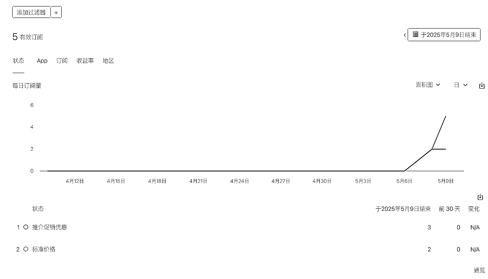
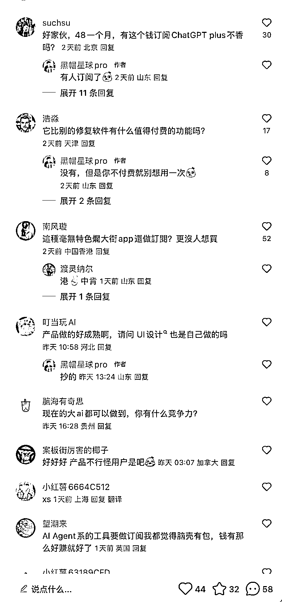
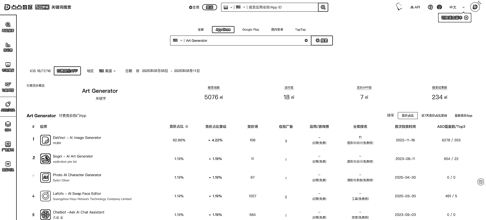
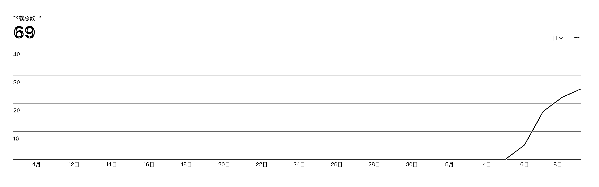

# (62 赞)用 AI 做了一个海外 iOS APP，上架 5 天 ，累计 5 个年会员订阅，预估 175 刀销售额

> 原文：[`www.yuque.com/for_lazy/zhoubao/yza8tqbp7swn9kgy`](https://www.yuque.com/for_lazy/zhoubao/yza8tqbp7swn9kgy)

## (62 赞)用 AI 做了一个海外 iOS APP，上架 5 天 ，累计 5 个年会员订阅，预估 175 刀销售额

作者： 黑帽子

日期：2025-05-11

最近做了一个面向海外用户的 AI 套壳的 iOS APP，年会员收费 34.99 刀，月会员 6.99 刀。

今天 Apple 后台更新了 9 号的订阅数据，上架 5 天时间，7 号开的第一单，印度三哥直接买了一单年会员，8 号越南老表买了个年会员，9 号开启了 7 天试用订阅活动后，新增了 3 个免费试用 7 天后订阅年会员的用户。

流量主要来自于 ASO，虽然我有在小红书发过笔记主动推广，但是不仅没有转化率，差点被小红书的用户喷惨了，说啥的都有，有人说我这么个东西敢卖 48 一个月，为什么不去订阅 gpt 会员；有人说我这么个功能根本不值得付费；有人说这种 app 毫无特色烂大街，这个评论的点赞比我笔记的点赞都高，还有人说这种功能早在美图、醒图就有了。。。

说实话，看完这些评论我心凉了半截，感觉自己的确做了个垃圾 app 出来，反之让我掏钱买，我肯定不会花 35 刀买这么个东西，记得很清楚我是 8 号晚上，躺在床上看小红书的评论，9 号早晨起床看了一眼，后台显示了 41 刀的销售额，虽然没多少钱，但是看到这个数据心情还是挺激动的，因为之前上架了好几个 app，基本上都石沉大海，aso 也做了，反之就是没啥用。

反而这个海外的 app，给我靠 aso 带来了一些自然流量，还有被动的转化。这个 app 的话，主要功能就是用 AI 大模型的 API 给用户的照片做修复，一个照片修复的 App。

首先，来说下我是怎么想到要做老照片修复的 app，其实还是有些偶然因素，我在一个群里看到有人正在做老照片修复的 app，不过他做的是中文版的，看到后我就想海外用户是否有这个需求，于是，我就去点点数据，搜了下相关的关键词，发现搜索指数还真不低，特别是欧麦那边的国家，搜索指数基本都在 5500 左右，流行度基本在 10-20。

我觉得这个功能有用户需求，所以就决定要做这么一个 app。不过，我搜了不少相关的词，发现搜索结果数都很多，于是，我就让豆包帮我拓展联想词，我用这些联想词挨个搜，找到了一个有搜索量，有流行度，但是搜索结果数只有其它词一半的关键词。

**我总结出一个经验，我觉得做 iOS APP 和做 web 站一样，不仅仅要找需求，更要找对词，有竞争度低的蓝海词，直接用关键词做 app 的名称。**

**  **

**我找词主要是看指数、搜索结果数、流行度、ASO 难度这三个指标，我会尽量找那些指数在 5000 左右，流行度 10 左右，搜索结果数
<200 的关键词，如果搜索结果数太多，说明就不太好做了这个词。**

**  **

**因为语言文化的差异，不同国家地区的用户在搜索某一个关键词的时候，往往会有不同的语法，所以即使同一类 App 在 Appstore 中已经有了很多很多，但是只要在关键词的选择上做出差异化，还是有机会能拿到 Appstore 的自然流量。这也是我总结出一个很重要的经验。**

**  **

**因为我发现其实很多 App 在市场上早就有人做了，且不在少数，所以基于这样的市场情况，你再创新能怎么创新，到头来大概率还是会和别人做差不多的产品，所以我一早就彻底放弃了创新这个想法，我的思路是寻找那些相对竞争不那么大，但是有自然流量属性，有用户愿意付费的产品方向。**

关于 APP 的开发过程其实并不复杂，这个 app 就是一个 ai 套壳工具，后端功能调用的 AI 大模型的 API，阿里、腾讯、火山这些云厂商有很多现成的 API 可以直接用，具体的 ai 编程方法就不做过多陈述了，有兴趣的可以看我之前的几篇文章。

[`articles.zsxq.com/id_zg160ebwc58p.html`](https://articles.zsxq.com/id_zg160ebwc58p.html)

[`articles.zsxq.com/id_59tu4a387j8a.html`](https://articles.zsxq.com/id_59tu4a387j8a.html)

[`articles.zsxq.com/id_rn2urer0w656.html`](https://articles.zsxq.com/id_rn2urer0w656.html)

我重点来说下订阅的设计，我发现一个奇怪的现象，小红书上很多独立开发者想法很多，做的产品其实说实话相比老外做的 app 并不差，但是赚钱的很少很少，能赚钱的独立开发者，感觉在小红书的付费用户面前也很卑微，卖的贵了被喷，app 有 bug 了被喷，动不动的就姐妹们避坑、避雷。。。

而我注意到很多海外的 app，有的 app，收费很贵，而且下载后强制必须开启免费试用，也就是说你必须通过 apple 免费试用的订阅模式来试用 app，否则就直接不能用，而很多国内的 app，基本是给用户提供一定的免费试用次数，然后再进行收费，这样就会出现一个问题，如果你的 app 功能不是很刚需，如果你的 app 相比其它产品没那么有优势，用户就不会掏钱。甚至有的老外的 app，走完了一套 app 启动页面后，你不开启免费试用订阅，你连 app 首页都看不到长啥样。

所以我觉得做 iOS APP 最重要的是将时间花在订阅流程的设计上，而不是做产品的功能。

**所以，我这个 app，在订阅方面做了如下设计：**

1、7 天免费试用，7 天试用后自动扣费

2、App 启动页面的设计，增加了一点价值主张，和使用前后的结果对比案例。

3、强制用户免费试用订阅 App，不然一次也用不了 APP 任何功能。

**不过目前的 App 订阅还是存在很多可优化的地方。**

1、没有针对欧美用户做独特的 App 启动页面设计，特别是案例展示这块，我用的图还是亚洲面孔，可能这一点不太受欧美用户喜欢，所以目前这几个订阅用户才都是亚洲这边的用户。

2、APP 启动页面做的过于粗糙，价值卖点较少。

3、缺乏一个用户挽回页面，就是在用户点击免费试用按钮，弹出付款组件被取消后，应该立刻弹出一个限时优惠的活动页面，给予用户 8 折的优惠，进一步减少用户的流失率。

4、针对需求比较低频的 APP，免费试用 3 天足够了。

**然后，在上架环节我这个 APP 被驳回了好几次，总结下我被拒审几次的问题：**

1、没有在 APP 的文字介绍区域添加“订阅价格信息、自动续订说明、EULA 协议的条款说明”

2、在免费试用页面，没有文字说明试用过后会自动扣款的文字提示。

3、在试用页面/会员订阅页面，必须要有隐私政策、用户协议的链接

4、订阅功能上架时，可以不做沙盒测试，但是如果没有注册登陆的功能，就要给 Apple 审核人员提供一个订阅过期后的测试方法，否则会被拒审，我的方法是在设置页面添加一个版本号，当连续点击 10 次后，就会订阅过期。

5、正式上架前，最好在不同的模拟器设备类型中测试 UI 的兼容性，我发现 Apple 审核人员用的是 ipad
air 审核，就算你的 app 不支持 ipad 但是不妨碍他用别的设备审核测试。

6、订阅功能的代码层面，要让 AI 做好处理接收 appstore 收据的验证逻辑，apple 开发者后台需要在创建一个共享密钥要获取这部分的数据。

* * *

评论区：

不如睡觉 : “不仅仅要找需求，更要找对词，有竞争度低的蓝海词，直接用关键词做 app 的名称”

lyd : 用做网站的思路做 app，非常好的思路，app 看着像没有在国区 ICP 备案，但确可以用国区 App Store 下载，很好奇这是如何实现的？

黑帽子 : 上架时候不需要备案，但是后面可能会被要求备案

晨冬 : 非常感谢分享

算的不准不退钱 : 思路对了，产品总会好的[得意]

小耳朵 : 请教下教练，我工具类 app 做好了，就剩最后有点纠结做成一次性买断的付费 app，还是订阅的，不知道有没有什么讲究

黑帽子 : 不建议做付费下载的 app，如果要做买断制，最好也设计一个订阅模式，能够凸显你的工具一次性买断的价值，将买断制做成内购的产品去购买，除非买断制是为了拉高客单价，不然我没想出为啥要做买断制

小耳朵 : 感谢教练回复，了解了