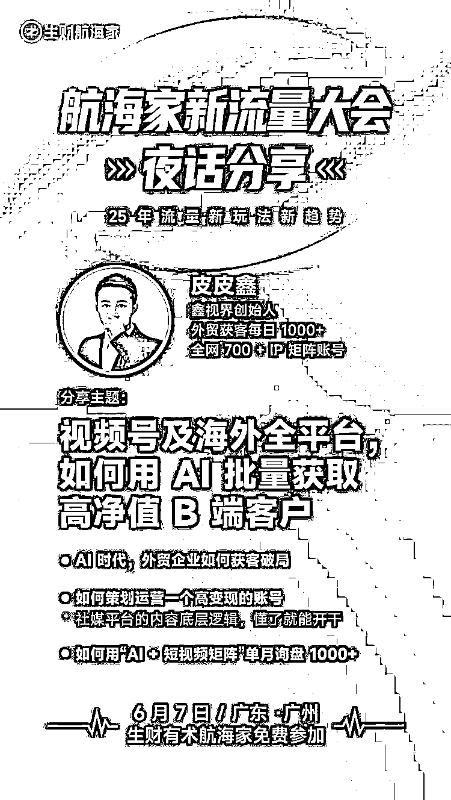

# (44 赞)想做外贸的看过来！如何用 AI 批量获取海外高净值 B 端客户？

> 原文：[`www.yuque.com/for_lazy/zhoubao/sq02vhg0ccswg5kg`](https://www.yuque.com/for_lazy/zhoubao/sq02vhg0ccswg5kg)

## (44 赞)想做外贸的看过来！如何用 AI 批量获取海外高净值 B 端客户？

作者： 皮皮鑫

日期：2025-05-22

大家好，我皮皮鑫，一个连续创业 8 年的电商人，也是一直身处一线的操盘手，现在公司两百来号人。经历了许多平台的商业周期，然后我们公司今年外贸自营板块做了 2.7 亿，团队也累计服务了 1000+的商家。

今天主要来分享一下 AI 获客型的矩阵短视频打法，但我分享的东西，可能乍得一看大家都在分享，实则你往下看，你会发现：卧槽，这叼毛，分享的完全不一样。

同时，我前两年写了一篇万字长文，我的前世今生，这篇文章可以详细了解到我，同时可以帮到很多转型的老板或者想要创业的人： [`mp.weixin.qq.com/s/VNCU_T0o_WocqaiQMISPAA`](https://mp.weixin.qq.com/s/VNCU_T0o_WocqaiQMISPAA)

我可以说是每个旧时代的失败者，但又是疯狂奔跑的人，无论我过去做的战绩多么辉煌，在一定周期下注定被淘汰。

经历了各个国内电商平台，也做到了很高的业绩。无奈之下，因公司发展过快，公司 200 多人，但因为财务最终一算账，净利润 2%，没算上库存，导致公司一年亏损 1200 万。

我又一次进入了自闭，恍惚前方是悬崖，后方是地狱。我跟我的合伙人开始思考，我们如何转型？如何填补这 1200 万的亏损？

我就跟她想着说，要么我们转做跨境外贸吧？不知是缘分还是灵机一动，我们就 2023 年初开始准备做外贸。本身自家就是干女鞋工厂的，何不把货供给外国佬呢？

我们就开始了注册各种海外账号，借着做过国内电商的基因，去做海外社媒频道。没想到做了一个月，就快速跑通盈利了。而且 0-1 的过程，就只有我跟合伙人两个人在跑，每天也干到凌晨两三点。

这次重新创业，我发现刚开始比较顺利一些。于是，我们就大量做矩阵，通过研究 AI 的形式去做账号。真的是批量产出视频，然后批量注册账号，一下子就每天获取了 1000 多个老外客户加到 WhatsApp。

随着工厂大量接单，自家父母女鞋工厂都准备要不干了。没想到我们这一搞，天天工厂爆单，大力拓展生产线，一年接了 60 万双女鞋，一双鞋利润比较低，只赚个 15 块钱。

这一年轻轻松松的赚了 900 万，补了三分之二的窟窿。后面，你也想到了，我们做的越来越顺利，一年下来总算稳住了基本盘。

我们也每天大量研究各种视频制作，招聘了很多程序员进行开发 AI 系统，就这样一举成名，霸屏了整个海外。

但海外还是我们的工厂周围，很多人看到我们这样做，很想跟我们一起学习怎么做？我们想着不能局限在这个女鞋品类，一定要多做几个品类，我们就开始做起了 IP，同步进行做着。

今天，我想分享《视频号及海外全平台，如何用 AI 批量获取高净值 B 端客户》，如果你在做外贸或者想做外贸，你一定要来听。

我可以不要脸的话，现在国内的环境多卷，不是不知道，但做了外贸之后，你会发现跟捡钱没区别。同时，你也可以想到我的结局，电商你做的再牛逼又如何？

我会从这四个点跟大家去分享：

**一、外贸破局**

我不知你有没发现一个问题，国内许多工厂是有生产力，但是没订单的情况？存在几个致命问题点

1.过度依赖阿里国际站/展会/档口等传统渠道，但获客成本逐年攀升，新客户进不来；

2.工厂团队的短板，砸钱招短视频团队，发出去却 0 转化；

3.市场瓶颈，很多原本的国家成本太高，增长比较难，就开始切换了国家以及有消费力的新兴市场；

4.收支不平衡，传统外贸团队成本高，投产比打不正或者几十万的展位，名片转化率不到 1%？

那老一批的工厂老板，太传统了，包括我爸妈也是一样，因为我爸妈做了二十多年的女鞋工厂了，是一点的流量思维都没有，注定被淘汰。

我一直认为流量在哪，我就在哪，我不会一直局限在一个平台，我只是一个偷平台流量的罢了。

选择大于努力，选择不对，努力白费，但在选择前面还有一个前提，就是你的认知，没有这个认知，你凭什么做选择？大家都知道选择大于努力啊！

外贸往社媒的方式去做，如同国内做抖音一样，社媒的获客方式，更适应货找人的时代需求。

你只会用社媒还不行，还必须要加上 AI 进行提升人效，否则很难放大。

以上几个时代的风口，我好似每次都抓住了，所以我常常被人说成“不专注”！

国外社媒平台的数据，尤其是 Tikto 的全球用户量 20.5 亿+了，相当于国内的三个抖音，你去搜一下 tk 的工厂，数据量简直爆炸，我们服务的很多行业工厂，都已经在平台上霸屏了。

国外很多人可能会说，需要魔法才能，就卡住了很多人，但殊不知还有一个信息差，就是视频号哈哈！

视频号的海外用户，达到 9 千万级，我不知大家有没刷到很多英文的视频，比如：“hello，boss....”诸如此类的。

你去细细看这些评论区，有很多的老外用户在找工厂，想要下订单。

因为现在视频号不仅是一带一路国家，同时中国也鼓励发展这个政策，很多隐晦的我不能说，我只能留在 6 月 7 号的航海家茶话会去分享，不然我要被知识星球拉黑了。

现在的 AI+社媒发展阶段就好比 2010 年左右做淘宝天猫，虽然不健全，但是机会特别大，跟捡钱一样哈哈~

AI 结合社媒平台，是目前所有的生意里唯一可以无缝实现公私域联动的流量平台，你做国内导私，是不是经常违规？但做我们这个就好很多。

我现在的目标就是，要在这几年，赚完一辈子的钱，别 tm 跟我谈长期价值，没有短期的暴利，很难支撑长期价值。

很多人跟我杠的，要么就是没创业过，要么就是创业的认知还不够，很多行业不可能干一辈子，它都是有生命周期规律的，有机会建议大家读一下易经！

人生它需要通过连续翻越，才能取得成功，而且我是经历了这么多平台行业的创业失败者，只有在这个时候，我才找到了我的更大红利期。你相信吗？人这一生，是有大运的，但这个大运不是谁都能抓住。

市面上那些培训机构，我可以说 80%的人，要么只教 AI，要么教 AI 短视频获客，但根本是落地不了的，根本没办法打包票说：“我教了你，可以一定有精准客资”，而我可以！哈哈，就是这么自信~

我们的打法是国内新媒体平台+国外社媒+AI 全自动+私域矩阵销售工具，形成的一整套打法。

我的 AI 全自动是什么呢？就是在公域断不断发广告视频获客，不用自己拍视频，全部用数字人，而且我们的数字人流量动不动几十上百万，谁说数字人没流量的？拉出来打一顿！

现在我在国内有 1000+矩阵账号，都是我自己的 IP，国外社媒有 300 多个账号，总共每天获客 1000+。

同时，用 AI 解决视频数量跟人员效率问题，极大的提升获客效果，所以我的方法百分百有效哈哈~

同时，很多人担心不会英语，怎么做外贸？买一个翻译耳机就行了，以及私域上有这个输入法，自动跳转各个国家的语言。

我们以前拍摄的视频也很简单，你可以看我自己的，就是一串英文+我日常生活视频的混剪片段，直接一天产出几千条视频出来。

 images.zsxq.com/FrsNRovwDW4m7w9uFk5eDXrYyJVw) images.zsxq.com/FuPaNIHH9wvOuT9ppuU3oFtTVQPA)

大家可以直接抄我的这个文案，发个 30 条到视频号，就会有大量的老外找你，但是你的引流路径要设计好！

我虽然不会英语，也不会法语，但是我们自己开发了一个工具，全部都可以自动跳转对应国家的语言，这个文章里放不了视频，要是放的了视频，大家就可以看到。

然后这些视频文案，我们通过 Deepseek 自动生成 100 条文案，不断仿写优质文案生成短视频。

紧接着，就放到软件里去自动剪辑视频，产出了几百条获客型视频，可以看下面的图片。

可惜，我要分享的东西太多了，这个只能到线下才能去给大家继续分享啦~期待 6 月 7 号的生财流量大会，能见到大家！

* * *

评论区：

W. : 太需要这个分享了，后续可以出全篇的分享吗？

靠岸 : mark

易芝 AI|RPA 版 : 同求