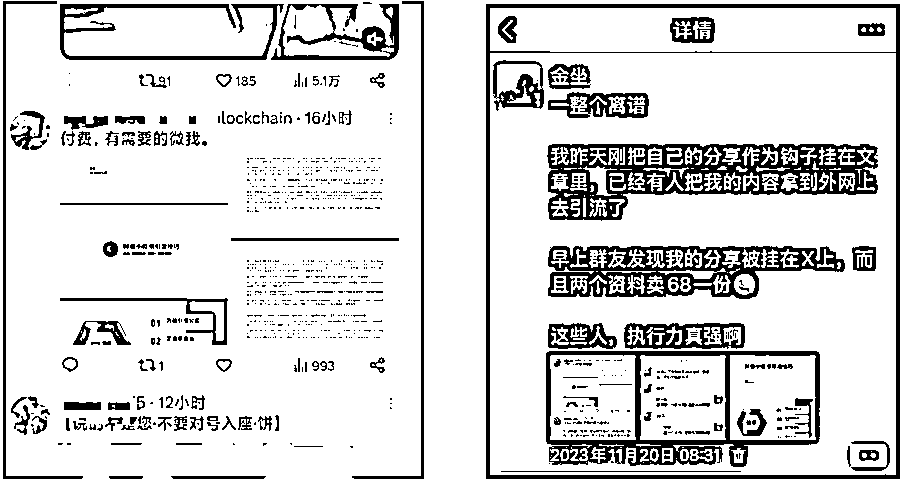

# (精华帖)(134 赞)小红书获客万能公式和操作手册

> 原文：[`www.yuque.com/for_lazy/zhoubao/mqc82w4hfscz3vsy`](https://www.yuque.com/for_lazy/zhoubao/mqc82w4hfscz3vsy)

## (精华帖)(134 赞)小红书获客万能公式和操作手册

作者： 金坐

日期：2025-05-16

**引流获客，** 这个东西应该所有行业的人都用得到，不管是个人想要做副业，还是公司想要做生意，都需要从公域导流量

应该没有人会说，自己是不缺客户的

关于《抖音小红书导流技巧和万能引流公式》这个主题的分享，我在去年和前年好多场线下分享过，那个时候是 1.0 版本，已经帮助了非常多的人，甚至连分享的 PPT 都被搬运到海外去卖

两年过去了，平台规则的不小的变动，加上我对于引流这个事情的理解也有了一些变化，所以就有了这个 2.0 版本的小红书万能公式和操作手册

大的逻辑没有变化，但是整个流程中的很多细节有了变化

前段时间在北京线下做了个分享，效果反响依然非常好

现在就把这个稿子重新整理成文字版本，大家有需要的自行观看，全文大概 16000 多字

这篇文章不涉及别的东西，**只讲一个事儿，就是讲明白怎么安全、高效地把用户从小红书搞到你的微信上面来**，就把这个事儿讲明白讲透了

包括但不限于：整个导流的逻辑应该是怎么样的？需要准备哪些东西？整个工作流程是怎么样的？怎么搞是合规的？怎么搞是不合规会被限流封号的？什么动作是平台不允许但是安全性很高的？流量应该怎么搞？内容怎么输出？导流的路径是怎么样的？怎么样增加导流的效率等等

当然，这些问题我并不是逐个去回答，而是当我把整个逻辑给你讲明白之后，上面这些问题你自然就有答案了

文章有点长共计 16000 字 正文请移步飞书：

飞书链接：[`onda9yush7.feishu.cn/docx/Ls6GdTYqYoEEGhxu1kAcJtPynlh`](https://onda9yush7.feishu.cn/docx/Ls6GdTYqYoEEGhxu1kAcJtPynlh) 密码：2025ttbf

* * *

评论区：

二米 : 宁波大佬

大梁 : 看不了

金坐 : 是不是密码没输入

叶子 : 需要输入密码

金坐 : 帖子里有写密码呀，就在链接后面

_ 君无戏言 : 学习一下

静水 : 密码在链接后面[微笑]

小 A 妹 : 学到了，感谢大佬分享