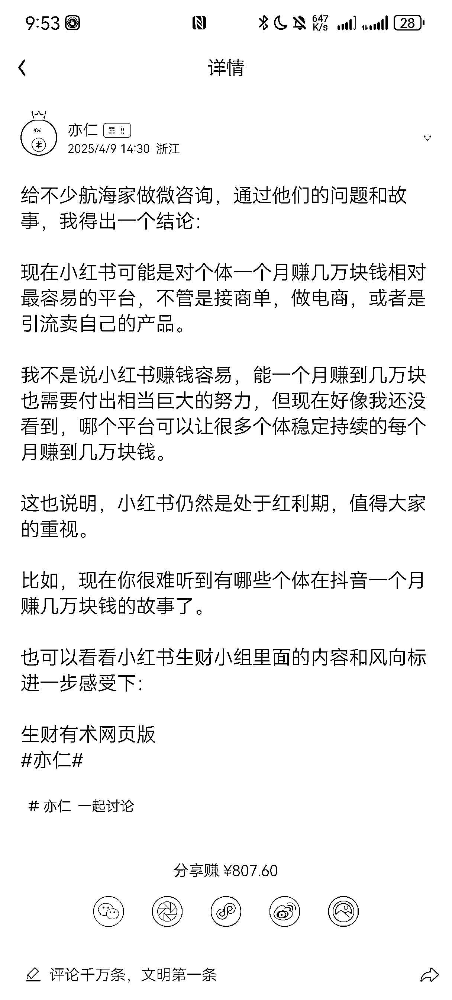

# (精华帖)(163 赞)手把手教你 0-1-10 小红书获客和私域运营（祛魅篇）

> 原文：[`www.yuque.com/for_lazy/zhoubao/bcwiigfglr8n1ggl`](https://www.yuque.com/for_lazy/zhoubao/bcwiigfglr8n1ggl)

## (精华帖)(163 赞)手把手教你 0-1-10 小红书获客和私域运营（祛魅篇）

作者： yeye

日期：2025-05-17

大家好，我叫 yeye/耶耶，汕头人，广州暨南大学大三在读，2024 年 4 月加入的生财，曾做过有货源和无货源电商（小红书、抖音）和私域（情感，雅思/托福，k12）**25 年大方向依旧是私域获客和运营。**

生财培养了我的商业思维以及各方面认知，在加入生财之前，我只知道**互联网可以做网红带货卖课和电商赚钱** （毕竟 10 个潮汕人创业有 9 个做电商哈哈哈）进入生财后才发现原来世界有这么多项目。对于我来说，大学上课出勤率 10%，生财大学出勤率接近 100%。

4.9 号亦仁老大在提到小红书相关，如下图所示

**赚回圈费真的是有手就行（一年前我不信，现在信了）** 但在赚到第一块钱之前，也因为生财各种大佬和数据而**异常焦虑** ，走了很多很多弯路，做了很多低效率的事情，曾与航海家圈友共事，面试近百家流量公司，也在一些私域/电商公司实习过。

但我发现在电商/流量公司待过的和没待过的人，中间的信息差巨大，**核心还是有没有祛魅，存在滤镜。**

因此我想结合我做多个项目经验，写一篇小红书获客和私域运营相关的文章。本文会尽可能**简单通俗** ，会用**大量的真实案例和数据** 给大家普及**如何 0-1，1-10 赚到人生第一桶金** 。

**本文适合受众：**

1.看生财有术文章没有大方向？无头苍蝇？

2.不知道选什么赛道？感觉赚钱好难

3.不知道怎么做流量/销售/营销？

4.不知道怎么全方位放大业务？（1-10，祛魅）

5.想了解运营，但不懂运营的细节？

6.不懂行业黑话？对私域/电商有畏难情绪，懵懵懂懂（比如打粉，矩阵，sop，投放）

7.直男，接触女生少的，不注重细节的（不注重细节，怎么精细化运营？）

8.缺乏执行力，不知道怎么定目标，不懂算账

9.感觉自己懂很多，但是依旧没赚到钱，迷茫

具体转移飞书

[`diopczaeo03.feishu.cn/wiki/ECSwwkvkViDJpUk0rfYcI0ZHn7g?from=from_copylink`](https://diopczaeo03.feishu.cn/wiki/ECSwwkvkViDJpUk0rfYcI0ZHn7g?from=from_copylink)

**全文 2.8w 字，预计阅读时长 45-60 分钟。**

* * *

评论区：

yeye : 发现电脑没办法@，我在评论区一起@啦，感谢～ 提供这么好的圈子，感谢万能哆啦 A 梦 感谢我的朋友 ～鱼丸 @（排名不分先后）

李雪飘律师｜tk 卖家 : 很强[强]

yeye : 谢谢！

汤不知 : 太强啦！

WD。 : 厉害

Looker : 棒

yeye : 谢谢～

yeye : 谢谢～