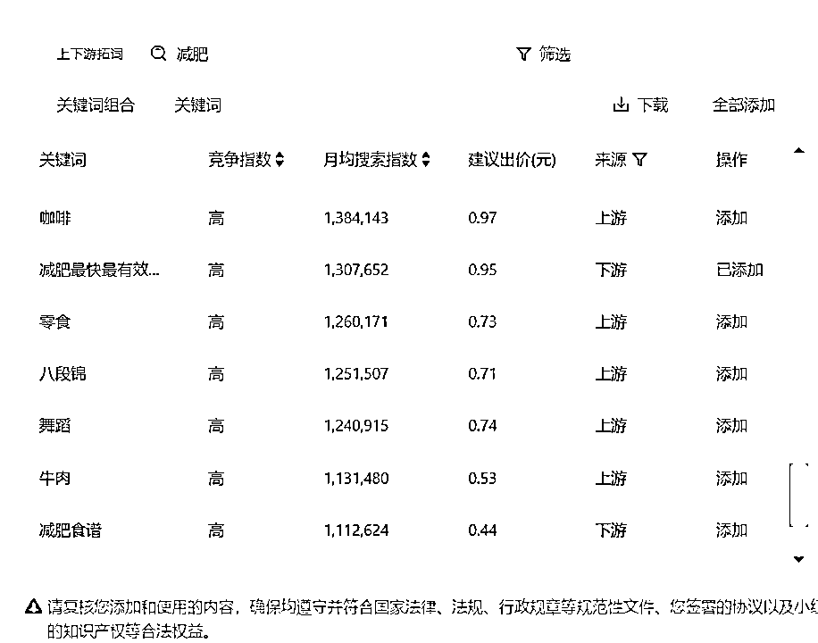

# (精华帖)(76 赞)2025 小红书本地生活，别算规模，算利润

> 原文：[`www.yuque.com/for_lazy/zhoubao/vaz5gdisneokxet3`](https://www.yuque.com/for_lazy/zhoubao/vaz5gdisneokxet3)

## (精华帖)(76 赞)2025 小红书本地生活，别算规模，算利润

作者： 富贵

日期：2025-05-16

**今天想和大家分享下，关于小红书线索类业务该如何在平台进行获客。**

**先介绍一下自己，之前在生财发布小红书的 AI 提取表格，可能有的圈友对我比较熟悉了。**

富贵，长安文化 CEO

base 杭州，小红书线索赛道头部，自持素人矩阵 5000+；

1.  2019 入局小红书护肤赛道，全流程操盘单品 0 到年销 1 亿+。

2.  2020 入局抖音电商，商务团队持 1w+食品赛道达人，杂粮榜单 Top1

3.  2024 开始切入小红书本地生活，本地类日进线索数超 2000+

4.  自营 10 家健身+康复工作室，合作客户有浙大冰虫，艺星医美，作业帮等。

# **小红书 2025 还有什么新机会？**

最近刷小红书，不知道大家有没有发现一个现象？

以前我们看小红书，可能更多是看美妆穿搭、娱乐八卦、还有一些出境的旅行攻略。

但现在，无论男女。越来越多的人在小红书上搜本地、搜服务、搜体验。

甚至你出差到了一个新城市，第一件事儿就是打开小红书，看附近的吃喝玩乐。

“成都附近美食”、“周末去哪儿”、“万象城美甲”、“广州亲子乐园”...

这背后是什么？是小红书本地生活赛道没被挖掘的大市场。

尤其对于做本地生活服务的老板们

下面具体给大家看一些行业

（宠物·留学·移民·车衣贴膜·二奢·翡翠·美业·纹绣·美甲·家具·装修·全屋定制·教培·瑜伽·私教·旅游·酒店·民宿）

这绝对是一个低成本、高效率获取精准线索的新大陆。

是当下我们的新“**美团** ”新“**大众点评** ”

截止目前，小红书月活用户有 4 亿，其中 70%月活用户存在搜索行为，所有搜索行为中 98%为主动搜索(而非受平台引导推荐的被动搜索，如评论区的置顶组件),更有高达 42%的新用户到小红书第一天就用了搜索功能。

小红书的搜索场域推广 GMV 对比去年整体增长 14 倍，跟消费相关的搜索需求增长 50%。

我们常说小红书其实不是个种草平台，在当下，已经成为了大部分女性决策的最后一站。

瞄准 Z 世代女性的零售商增加的广告投放，是小红书增长的秘诀**。**

**小红书是我们的【生活宝典】和【消费指南】。**

* * *

# 泥石流式的爆款创作，团队拿到过哪些成绩？

以前我们给护肤单品牌做到 4w 篇站内收录笔记

通过小红书持续种草，双十一达成全域达成 2000w+销售额

多个账号不同赛道均快速起号+变现

素人矩阵号数量 3000+

因为是流量型公司，穿越了从抖音到小红书的周期，可能有一天小红书规则变了，我们又会转型到下一个平台。

做爆款内容对我们来说很容易，也很简单。

但问题是，流量来了，怎么持续变现？

电商实在是太太太卷了，越来越多的人挤入了抖音和小红书的电商赛道。

打不过，我想从这里撤退了。

## **·线索类：高客单，非标品，强信任，无限复购**

小红书有三大板块，生态，电商，线索。

如果放弃电商，放弃品牌方，放弃倒买倒卖流量，我们还能做什么？

这时候有个朋友给了我灵感，2024 年，他们的服装店开在了山东，因为本身就是做女装的，通过用电商铺量宣传的方法，28 天回本。

**用电商的思维，降维打击本地，再操作一遍。**

2024 小红书全面进入买流量的时代，决定做本地生活以后，先拿自家合伙人的健身房练手，做爆款内容很快，但是限流的速度，比我们出爆款还快。

这时候我才明白，原来做本地生活，也是要“交保护费”的。

于是我一边自己试着投放，一边找业内的专业玩家学习。

一个月以后，我们的开口成本，降低到了大盘的一半。

**但是降开口，不是我们的核心目的。**

有个朋友说过“你玩自然流流量，除了因为你会做好内容，好素材，还有一个重要原因就是你没钱。”

**只要把 ROI 算正，** 对于聚光来说，其实更重要的是线索的垂直程度

。下面这张图，是我们投放 K12
的教育粉丝，那种开口可能一块钱两块钱，它就是纯羊毛党。那这种我们其实就叫它无效的开口，因为它没有价值，它的目的是奔着薅羊毛来的，这个目前我们投放的量也蛮大，一天 10 个蓝 V，能投出 2000+进粉。

聚光的笔记的垂直程度，它决定了你后端，前端搞流量这件事情不难，只有后端的承接才是一个比较难的事情。健身房两个笔记都开了 100 个私信进来，
有的笔记单篇能变现 20 万，有的笔记两个月连 5, 000 块钱都没成功变现，所以市面上很多人教我们去优化开口价格，这件事在我看来根本没有意义。

优化开口没什么用。我们目的是为了让他到店成交，优化开口，就算把他优化到一块钱一条，投放出来的这个人群消费能力不一样，根本转化不动。所以哪怕开口价格略高，也要用它。

不要去盯开口的价格，这个用户进线进到你私域里能有转化才是最核心的考核标准。我们说聚光，就等于是花钱在买粉丝，这个粉丝是值 10 块钱还是值 50
块钱，这件事在前端根本不重要。只要你后端有承接能力，你能够有强转化，粉丝在你的私域是有转化周期的，至于他是多少钱来的这件事，根本不重要。

# **蓝 V 矩阵协同，构建日产千粉的导流强引擎**

## **·找 100 个行业对标，实时监测，摸透爆款逻辑**

小红书的三方软件，目前市面有的，新红，灰豚，千瓜，各家的使用方法基本大差不差。

以前我非常热衷于在各种软件上付费，后来我们直接开聚光拿词。

同行买的词，高点击的词，以及蓝海词，这几个板块。

延展出行业推词，以词推词，上下游推词。

基本上一个赛道的词，大家常去搜索，也比较关心的，其实一共就这么多。

大多数赛道关键词甚至都不会超过二百个。

把这些你找到的关键词埋进笔记封面+标题+内容。

基本上就有机会可以创造出一个能一直吃到长尾流的笔记。

**聚光词包**

聚光词包是小红书为我们提供的一种关键词集合，帮助来更精准地进行广告投放和内容创作，以触达目标受众。

词包中的关键词，我们可以把他分为不同的类别。比如品牌关键词、产品类型关键词、功能关键词、场景关键词和受众关键词等等进行精准定位。

然后定向的这个人群就是内容账号，那这个时候你会发现你的账户流量可能来得不精准，那这个时候就要通过商业干预，这就涉及到你下一步的高级定向。

比如说搜索减肥，出现的上下游拓词，以及行业黑马词，我们会看到了小基数。

寻找小基数的 50 篇自然流爆款笔记，再去追自己的矩阵笔记。

在这里我举一个例子，我们有个客户是做脊柱侧弯的，基本上已经做到了行业 TOP1 的水平，现在也在医院展开临床，并且在小红书拿到了比较好的成绩，我们都知道这种半医疗的笔记都算是小红书高危模版，怎么给她继续按照行业搜索词做笔记呢？

我们先来打开电脑版小红书，搜当前的行业词，脊柱侧弯，看综合搜索类目下的前 8 篇笔记。

这几个笔记一般的展示的组成部分，分别为行业类比较有知名度的大 V，也就是 KOL，是第一篇丁香医生。但是这个笔记我们能参考的仅有封面，其他的没什么借鉴意义。

因为丁香医生的粉丝基数在那里，发什么内容都是有人看的。其实这个可以延伸到各个三方软件为什么会搞“低粉爆文”的原理。

因为大 V 的笔记有粉丝基数，不具备太大的爆款元素在内。

实时监测对标账号关键词，一个组长带两个小组员。他们仨其实每一个人都会手里面攥着大概 20 个到 30
个对标，就是这样按你以上操作扒出来的对标账号，他们会拿一个小账号去关注，关注之后基本上每隔两个小时左右他们就会刷一遍同行的笔记，一旦看见一个笔记开始起量了，直接追他的笔记，把你自己的云库里面的笔记跟他类似的找出来，然后直接去蹭一下这个热点。

**聚光词包**

聚光词包是小红书为我们提供的一种关键词集合，帮助来更精准地进行广告投放和内容创作，以触达目标受众。

词包中的关键词，我们可以把他分为不同的类别。比如品牌关键词、产品类型关键词、功能关键词、场景关键词和受众关键词等等进行精准定位。

然后定向的这个人群就是内容账号，那这个时候你会发现你的账户流量可能来得不精准，那这个时候就要通过商业干预，这就涉及到你下一步的高级定向。

## ·50 素人号+3-5 个蓝 v 矩阵，笔记指引直播间，稳定日导 1000+私域

小红书可以长期经营管理的 SPU，就是我们的核心资产。

浅层场进入有几个数据，第一是发现，同城，视频流。

深层场就是，搜索，关注，活动 H5。

深度阅读，10 秒的基础停留和完读。

深度互动，就是收藏，截图，保存图片，评论求推荐或者礼貌问价

（我觉得小红书这些女孩子真的都非常可爱又有礼貌，还不爱考虑性价比，称得上是当前软件生态内最好的社区环境了）

小红书的**反漏斗模型，A1 是认知人群，A2 看过人群，A3 互** 动人群，A4 电商人群。

抖音漏斗模型更注重内容的初始曝光。如果一个视频在发布后的短时间内能够获得高点赞、评论和分享，就会被算法判定为优质内容，从而获得更多的流量推荐。

小红书反漏斗模型内容的种草属性和长期价值更受关注。虽然一篇笔记在发布初期也会有一定的曝光，但更重要的是它在后续搜索中的价值。用户可能在看到笔记后的一段时间后，当有了相关消费需求时，通过搜索再次找到这篇笔记并参考。比如一篇关于旅游目的地攻略的笔记，可能在发布时吸引了一部分用户，之后在旅游旺季或者有人计划去这个地方旅游时，通过搜索被更多人发现。

# **如何搭建单人日产百条的团队**

## **·内容团队最优配比：(1+3)*N**

这个地方举个例子，生财有一期线下航海夜校项目。当天我刚好在广州出差，晚上大家的聚餐有幸受邀参加，感觉这个赛道很有趣，想着测试一下玩玩。于是拉了一组小伙伴，按照 1 托 2 的这种模式，给了他们 50 个账号，前期积累了 3 天的文件素材库，第一篇笔记发出后，48 小时内就做到了 500 个客资的进线转化。

小组长需要在 1-3 天的时间内，带着团队搭建起基础的素材库，拉齐优质笔记是什么的认知，测试出优质笔记，用优质文章分享+分析，选出爆文种子笔记，提炼出后续笔记内容方向。

笔记需要关注的封面图片、标题、正文、话题 TAG、评论区，都需要协助小组员优化。尤其注意笔记封面，优化站内点击率、cpc 成本、cpe 成本，针对笔记给出具体的修改建议。

发了 50 篇笔记以后，我们单篇笔记的数量是这样的。

48 个小时以后，我们的进线效果是这样的。

一般这个组合会出现的问题有以下四个。

1 不明确行业笔记好与坏标准

2 自身写笔记质量水平不清晰

3 后面笔记的输出方向有哪些

4 如何大规模提升笔记制作数量

一个赛道内容团队的组成是有 1 个组长，托 2-3 个员工进行笔记的分发和投放。

私域的后端数据统计是每天都要做的必不可少的工作

可以核算的数据有，单粉成本，单粉产值，回本周期，单销售客服的人效

同赛道不同的模板后端分流之后，可以进行数据对比，用数据来做选择而不是感觉

# **AI 工作流，正式进入三天出一个大模型的年代**

## **·在 AI 批量跑出无限内容的当下，我们该如何做出爆款**

熟悉我的朋友都知道，今年年初我们公司全面投入 AI。

从抖音穿越到小红书，我们穿越周期和顺利跨平台的原因是判断。

判断有的事情是不是一定要做。如果是，那当下即使再难，也要进行下去。

学 AI 不是为了降本，是为了增效。怎么能把 20 多人的公司干出 10 倍工作量？

目前从生文，生图，提示词修改。只要市面上有的课程，我都会出去学习付费。

钱交够了，韭菜当多了，逐渐修炼出来了体感。

AI 是屠龙刀，在会用的人手里，只要有刀气就可以上场杀敌，不会用的人拿来就是西瓜刀。

以下是目前团队一些比较小的进度，持续迭代中。

# 结束语

一个项目就像是种庄稼一样，它有它自己的生长周期和内在规律；

小红书，我们这些搞流量的群体，本质上是用一些方法论，加快了庄稼在某个阶段的生长流程。

优点就是起的快，别人中三年庄稼，我们半年就长出来了。

缺点是，我们这群群体，在庄稼长出来以后，没有回归商业的本质。

要么就是扩张，去搞另外的项目。要么就是遇挫，开始乱出牌。

对我个人来说，要始终保持学习，保持敬畏。

用涛哥一句话，这个年代，要么慧根，要么会跟。

去年加入生财后，航海家给了我非常大的认知提升。

感谢生财，祝大家一起生财有术。

更多的内容，我会放在航海家 6 月 7 日广州流量大会上跟现场的朋友分享，听说圈友也可以报名，感兴趣的可以来现场找我玩呀!

* * *

评论区：

劳模姐 : 今天才知道富贵老师是女生哎，关键还这么漂亮😍

朱较瘦 : 看名字也以为是帅哥，结果是个大美女