# (37 赞)2025，都给我去做小红书“买手”!---超全的买手实操攻略

> 原文：[`www.yuque.com/for_lazy/zhoubao/ipdm2d8co9hesuun`](https://www.yuque.com/for_lazy/zhoubao/ipdm2d8co9hesuun)

## (37 赞)2025，都给我去做小红书“买手”!---超全的买手实操攻略

作者： 谢无敌🐱闪亮猫传媒

日期：2025-05-21

嗨～ 我是你们的老朋友，闪亮猫传媒创始人——谢无敌。

2023 年，我将一手孵化的 IP “设计师鹏老师”
账号，从设计师主理人转型为买手角色。这一过程中，我们经历了不同维度的调整，也收获了全新的运营体验，期间账号还被官方评为 “百万买手”。

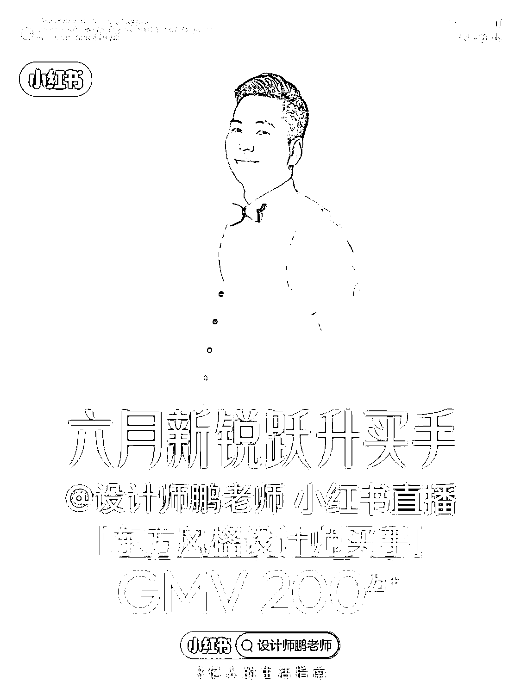

我把小红书买手运营的整个流程和经验总结了一遍，给同样想做买手的圈友们，一些参考。

**从买手准备工作，到账号定位、直播运营，再到提升转化率和带货效率，以及避坑指南** ，统统安排上！

顺便罗列一下，我过往的文章，欢迎大家阅读：

[4 小时爆卖 160 万！小红书直播我彻底玩明白了......](https://articles.zsxq.com/id_vna1sj873r0i.html)

[成长品牌大会，小红书在释放什么趋势？](https://articles.zsxq.com/id_ttnu7pc92hfb.html)

[2024 最后 2 个月，小红书这 3 个品最好卖......](https://articles.zsxq.com/id_0ezni7fxkw24.html)

[预测！2025 小红书十大热门创作趋势，保姆式拆解，附 80+案例](https://articles.zsxq.com/id_k6zhlgcbhuu2.html)

[拥抱 2025:小红书 Will 大会 10 大重点总结](https://articles.zsxq.com/id_3vv6ohe3vu1v.html)

[对话涛哥：300 家实体店店主分享，如何在小红书有效获客](https://articles.zsxq.com/id_lh4ohat0rr7e.html)

[万字分享，新手易学的社群打造成功方法](https://articles.zsxq.com/id_uk9kwnmaq243.html)

......

**接下来就到了买手实操的正文啦�***

3000 粉开播，一年单场突破千万的时尚买手@楚明 ing

一场直播销量 3.5w 单，变现 1200w+的生活买手@董洁

挖掘超萌小众设计款穿搭开播 8 个月月销突破百万的 95 后买手@肥猪靖仔子

我发现，小红书变现最快的方式就是**直播。**

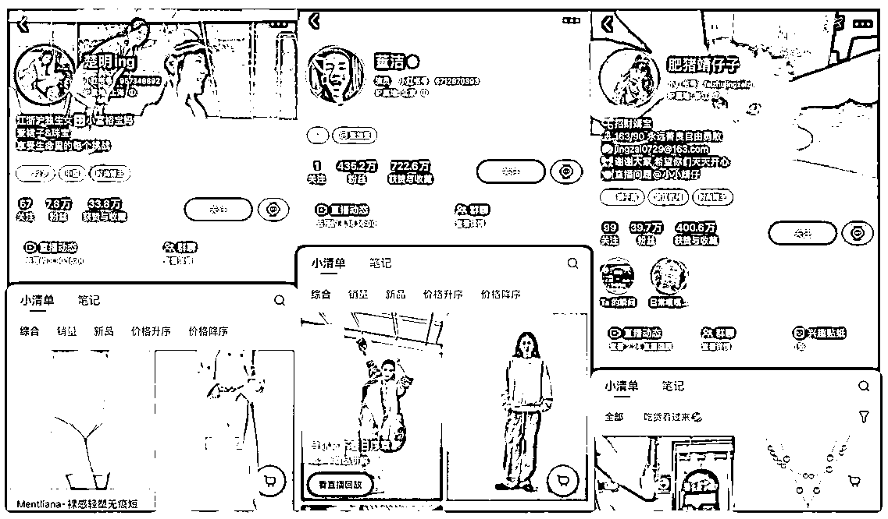

这两年，小红书上垂类买手博主涌现，关于买手的**话题热度也居高不下！**

**  **

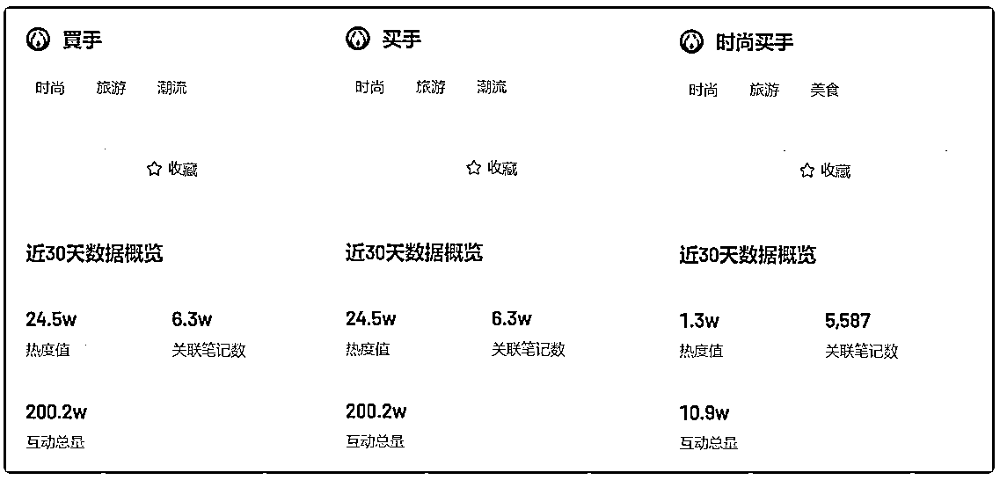

我身边也有越来越多博主入局垂类买手赛道，收入非常可观！

### 一、买手准备工作

“买手”可以简单理解为，**通过分享自己对产品的体验和推荐，带动粉丝购买产品** ，赚佣金的个人或者个人品牌。

就好比是好物种草官，通过小清单、直播方式，把自己在垂类赛道里用过觉得好的产品推给粉丝，促使粉丝下单转化。

**1.成为买手的必备条件**

1.  **完成实名认证**

这是成为买手的第一步，平台得确保用户身份是真的。

1.  **年龄要求**

需年满 18 岁，这是平台对买手的基本年龄限制。

1.  **粉丝数量要求**

至少 1000 名粉丝。

**2.开通步骤**

在小红书左上角点 “三”，接着点击 “创作者中心-全部服务-买手合作”。

完成实名认证，粉丝数达到 1000，即入驻成功。

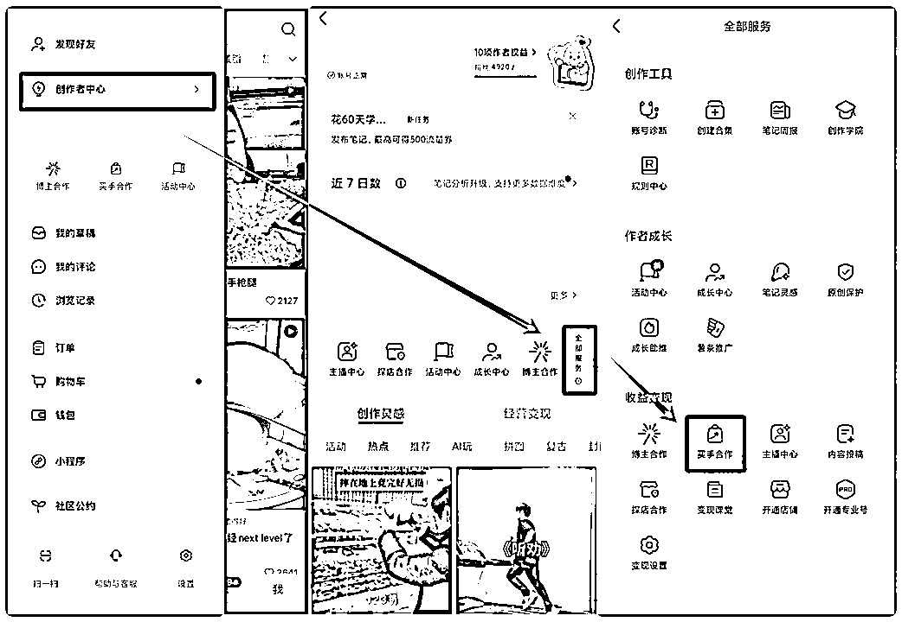

入驻后，能在买手合作中心点击 “选品中心” 选品合作，还能创建直播计划。

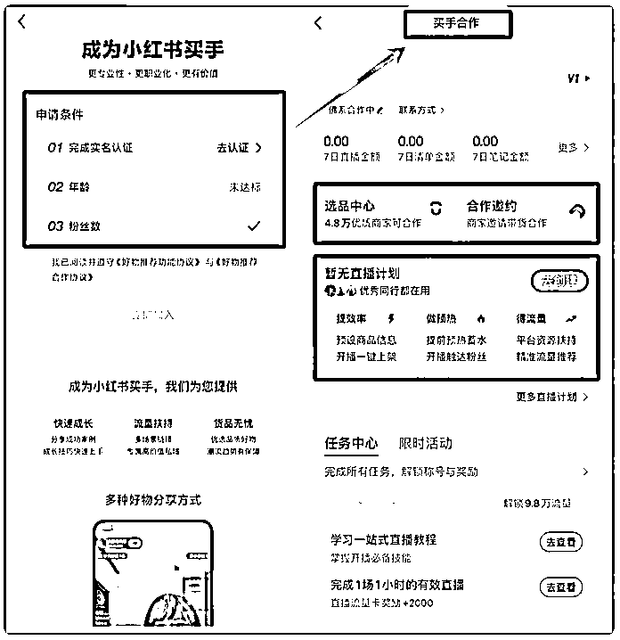

### 二、怎样做好内容布局

**1.确认账号定位**

账号定位可是小红书起步的关键，对于买手类账号来说，定位非常重要。

首先得从自己的兴趣和特长出发，**你自己对什么感兴趣，擅长什么，就从这方面入手** ，毕竟做自己喜欢又擅长的事，才能有动力坚持下去。

要是你对电子产品门清，各种手机、电脑参数了如指掌，那就定位数码类买手，分享起来有激情，内容专业，粉丝也容易被吸引。

**2.分析市场需求**

还得分析市场需求，看看**小红书上什么品类热门，什么东西大家都在找** 但还没特别突出的账号。

像这两年健身热，很多人找健身装备、健身服饰相关的靠谱买手推荐，这时候切入这个赛道，机会就会大很多。

**3.明确目标受众**

你要搞清楚你想吸引哪些人，是**学生党、上班族，还是宝妈群体。**

不同群体需求不一样，比如学生党可能更注重性价比，上班族可能更看重品质和实用性。

明确受众人群后，选品和内容风格都更有针对性。

给你说个案例：有个宝妈买手，她一开始也很迷茫，不知道咋定位。后来发现身边好多宝妈朋友都在愁给宝宝选好用又实惠的东西。

**她就抓住这个需求，把账号定位成 “高性价比母婴好物买手”。** 专门分享各种宝宝吃的、穿的、用的，都是自己精心挑选、性价比超高的产品。

这类买手账号在小红书上也非常常见。

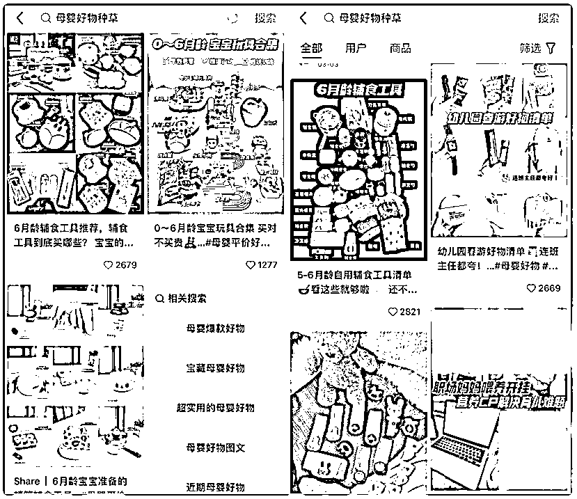

内容是以自己带娃过程中的真实体验为出发点，语言风格特别亲切，就像和姐妹们聊天一样，吸引一大波宝妈粉丝，并且**通过买手的身份，进行直播带货，推荐啥卖啥，赚得盆满钵满。**

就这么个思路，你也能找准自己的定位。

**4.品牌合作策略**

我们可以在“买手合作”-“选品中心”找到合适的商品，和品牌负责人进行联系。

主要沟通佣金比例、有没有坑位费、直播时间、合作方式，还有寄样时间这些事情。

**5.选品策略**

选品是个技术活。

产品和账号定位息息相关，先明确自己定位，是走时尚穿搭风、美妆护肤路，还是生活家居类。**定位确定了，选品方向就有了。**

**比如你定位是时尚穿搭，那就找服装、配饰这些相关货品。**

选品要选热门且有潜力的商品，多看看小红书热门趋势，什么东西大家都在讨论、都在求，咱就往这方面靠。

比如马上露营季来了，像露营相关的帐篷、睡袋这些商品就很值得选。

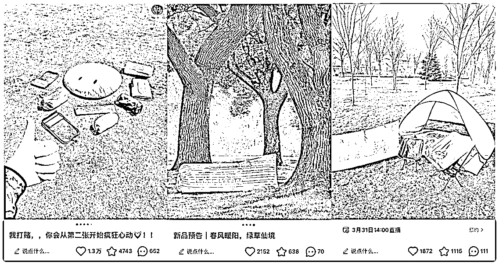

另外还要看商品的品质，质量不过关，就算卖出去了，后续售后问题一堆，还影响口碑。可以先拿样品，自己用用试试，感受下质量到底如何。

品牌**尽量选知名度高、口碑好的，大品牌自带流量和信任度** ，要是能拿到独家优惠，吸引力就更大了。

**6.商品数量**

经过我和团队，还有超 4000+陪跑学员一起测试，发现直播间选品数量在 30-40 个链接最合适。

产品太多，主播讲起来费劲，用户也挑花眼，转化反而受影响。

咱具体说说各类产品怎么分配：

**①秒杀品/福利品（必有）**

**占比 10%，数量 3-4 个，** 放在直播间最上面的位置，做引流产品，吸引用户浏览下单

**  **

**②畅销爆款（必有）**

**40%，12-16 个，** 也就是与账号人设相符合的爆款商品，为账号的内容做转化，吸引用户浏览下单

**  **

**③利润款**

**30%，9-12 个，** 能卖得动且能赚得到钱，拉大利润空间

**  **

**④特色款**

**20%，6-8 个，** 体现品牌独特调性，为账号人设做宣传

### 三、小清单&笔记

小清单是小红书平台的特色功能，也是买手**商品的主要展示入口** ，主页展示位置和店铺一样（小清单和店铺只能展示一个）。

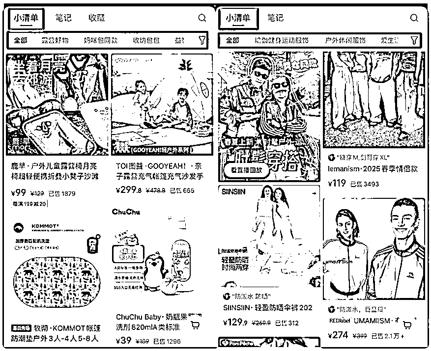

**  **

**1.如何创建小清单**

打开小红书 APP，点击左上角“三-买手中心”下滑找到“小清单”功能”功能入口。

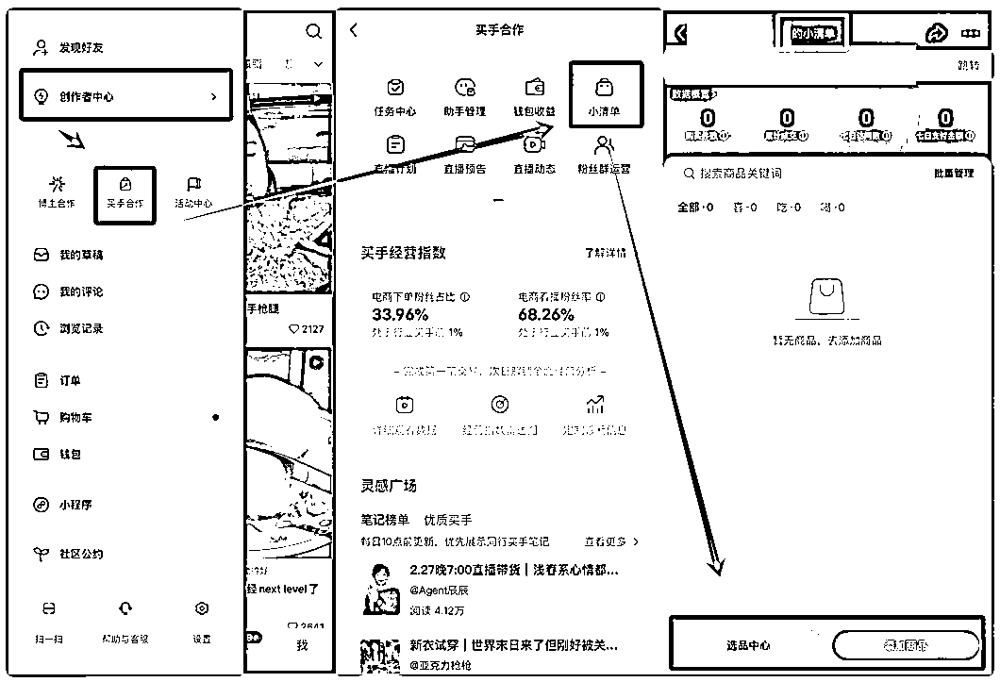

点击“选品中心”选符合账号调性的产品，点击进入产品详情页，点“联系商家”沟通确认合作方式、佣金等事项。

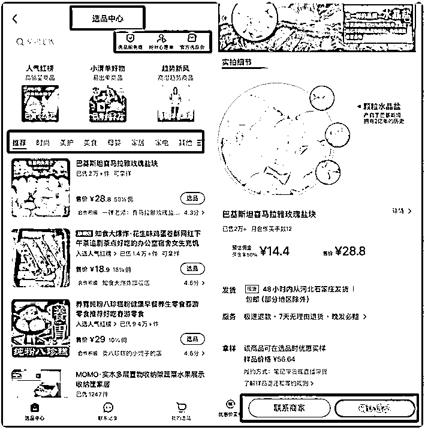

达成合作之后，就可以上下架商品，进行直播带货。

我们也可以在 “选品服务商广场”、“粉丝心愿单”、“官方选品会” 中找合适商品，沟通合作。

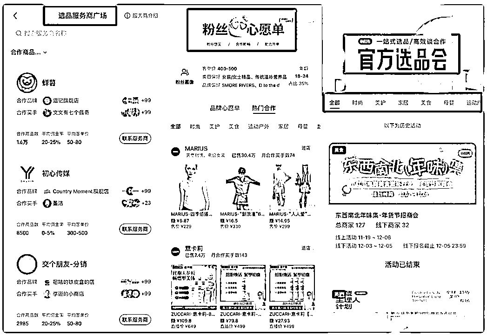

确认选品后，在 “选品” 页面查看和带货，点击 “去带货”，能选择小清单带货、直播带货，以及直播预告。

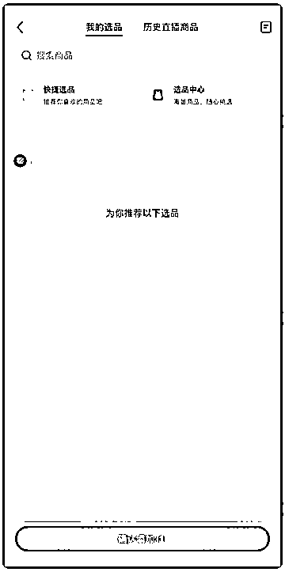

主页小清单在选择已合作商品上架后展示，可随时手动上下架。

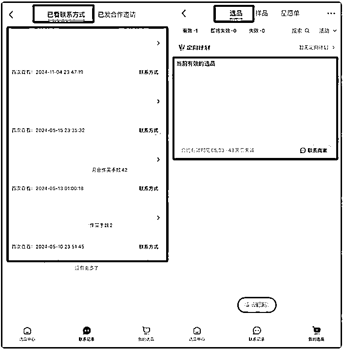

另外，开播后，可以在手机直播页面点击“购物车”-“管理”，进行商品上下架的调整。

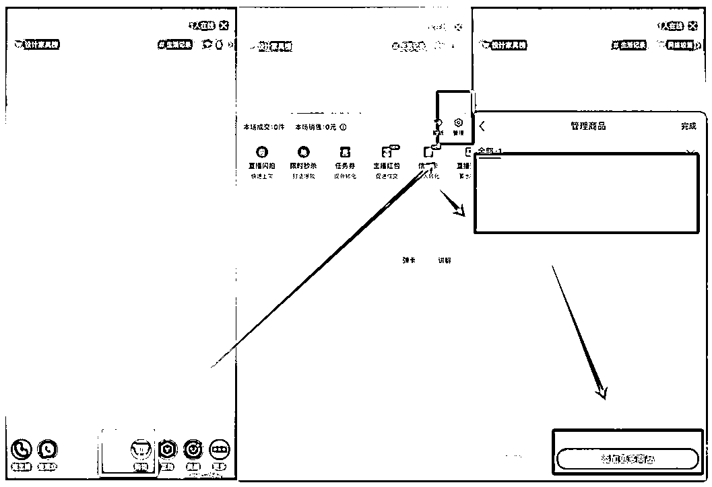

或者电脑端可以通过“直播中控台”或“计划售卖商品”进行实时的商品增加、删除或推荐语修改。

除了“选品中心”的人气红榜、小清单好物和趋势新风能找到热门商品，还能在“限时活动”中和平台活动关联，提升直播热度和曝光。

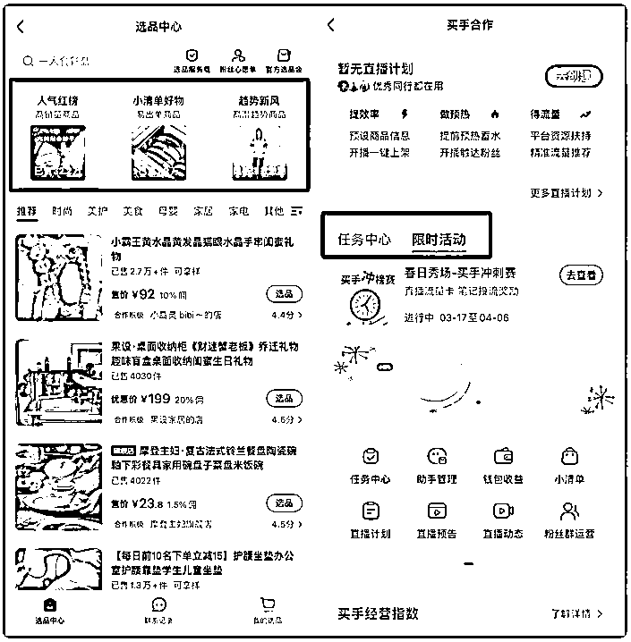

**  **

**2.直播流量入口**

目前小红书直播间的流量，主要来自 4 个地方：

**①直播间内跳转（上下滑）**

**②直播间分享**

**③笔记：预约笔记、直播当天新发笔记**

**④店铺/购物频道/订单等**

最后一项占比不多，**前三项流量占比是最高的，** 尤其第二项、第三项都是我们能够人为提升的，一定要重点做攻略。

**3.创建直播计划**

我们可以在：创作者中心-买手合作-创建直播计划-选品-发布预热笔记；

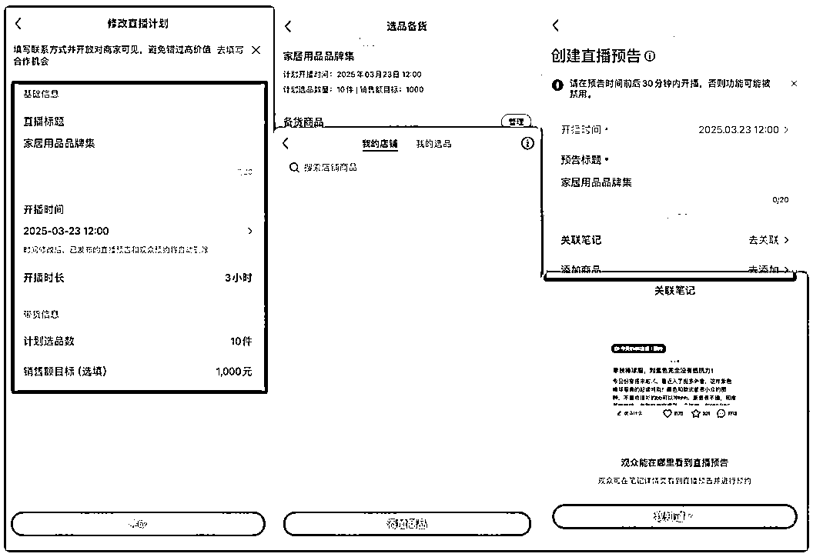

开播前可以点击直播预告直接开播：

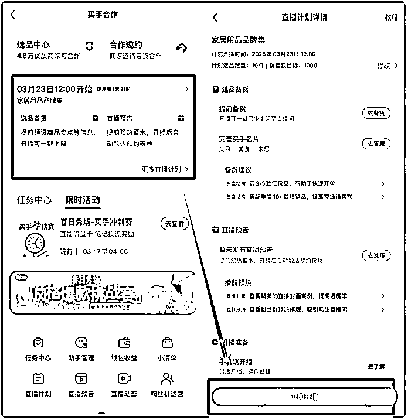

**  **

**4.直播设备**

①手机

推荐 iPhone 11 以上机型，存储空间最好在 128G 以上比较保险。安卓手机像素高、内存充足且运行流畅，也可以用于直播。

②直播相机

想要更专业效果，可考虑索尼 A7M4、A7C 或 ZVE10 等型号相机，画质清晰功能强大。

③麦克风

选音质清晰、音色自然的。

④支架

可升降调节的手机支架或相机三脚架，方便调整高度和角度，确保直播画面稳定。

⑤补光灯

环形灯或影视灯能提供均匀、柔和的光线，特别适合直播间面部补光，能让主播看起来更清晰。

⑥监听耳机

能让主播实时监听直播状态，确保直播效果达到预期。

⑦提示屏

提示屏可以将直播画面同步投屏，方便主播提词并增强与观众的互动。

⑧直播场景

保证光亮合适、镜头清晰，背景与产品的风格统一，并测试网络和收音设备，避免直播中卡顿或杂音。

**5.直播节奏**

**开场预热（前 10 分钟）** ：

开场话术很重要，例如：“宝子们，欢迎来到我的直播间！今天这场直播超精彩，给大家准备了超多福利和超赞商品，千万不要走开！”或者
“家人们，我又来啦！今天有你们一直催着要的好东西，还有惊喜优惠！”等等...

与粉丝简单互动，有一定观众数后开始讲解。

直播间人数增加后，就可以通过福利品，吸引用户留在直播间。

在话术上，介绍产品突出特点、优势和价值，吸引用户的关注.

例如，护肤类商品：“这款精华，核心成分是高浓度的烟酰胺，提亮效果那叫一个绝！用一段时间，你会发现皮肤肉眼可见地变白变透亮，而且它质地轻盈，不油腻，各种肤质都能用。”

服饰类商品：“这件衣服版型超正，修身但不紧绷，遮肉效果一流。面料是高品质纯棉，亲肤又透气，穿一整天都舒服。”

遇到直播间人数、销量破记录的 “小高峰” 时，用抽奖福利把用户持续地留在直播间，在之后的直播中，也能提升用户的下单概率，提升店铺持续性的转化。

tips：半点或整点穿插抽奖、发券等福利环节，提升观众停留时长。

**讲解商品（中途）** ：

预热完成后，介绍流程和福利，按序讲解商品。主要是畅销品、利润品、特色品的讲解。

通过与粉丝的互动，提升用户的参与感，或者安排小助理、客服、朋友来充当 “气氛组”，增加新进直播间用户的停留时长。

例如：“宝子们，你们平时买这类产品最看重啥呀？在公屏说说呗。”或者搞个小活动：“家人们，点赞到 1
万，我们马上抽一个幸运儿，送一份神秘大礼哦，赶紧点赞冲起来！”

**返场互动（收尾半小时）** ：

全部商品讲解结束后，对热门产品进行返场讲解，**也是一个转化小高峰，可以着重讲解热门的畅销产品，做促单转化。**

讲解过程中，可以利用促单话术让用户赶紧下单。

例如：“这款商品库存有限，就剩最后 XX
件啦，手快有手慢无，喜欢的宝子别犹豫，赶紧下单！”或者“现在下单，我们还送价值 XX 元的赠品，这优惠只有今天直播间有，错过可就没啦！”

直播后半段也可以预告下一场直播时间，拉动下一场的预约人数。

**售后处理：**

售后处理好了，能提升用户满意度和复购率。

直播时，就要清楚告诉用户退换货条件和流程。比如：“咱们家支持 7
天无理由退换货哈，只要商品不影响二次销售，你觉得不合适随时退。退货流程也简单，在订单页面申请退货，填好信息，把商品寄回来就行，我们收到货马上给你处理退款。”

如遇客户投诉，先安抚情绪，再了解问题，给出解决方案。比如客户反馈商品有质量问题，就说：“亲，实在不好意思给你带来不好体验，你先消消气。麻烦你详细说说问题情况，我们一定负责到底，该换货换货，该退款退款，肯定给你一个满意答复。”

做好小红书直播带货的各个环节，从**选品、直播准备到提升转化率以及售后处理** ，就基本已经完成了一场销转不错的直播带货了。

### 四、如何获得更多流量

**1.直播流量**

①直播间时长：

**建议一周固定 2-3 场，每场 3 小时以上最佳。** 如果第一个月转化不错的话，再慢慢增加直播频率。

②用户停留时长/互动率：

每个行业的标准不同，但只要记住，用户停留得越久直播间流量就越多。如果直播间人比较少，你可以利用助理号或“水军”在直播间引导评论，充当气氛组，提升用户互动率。

③直播笔记预热：

在开播前的一周或者 3-4 天内**发布预约笔记** ，让更多人知道你要直播的消息，吸引精准用户预约直播。

直播当天发布笔记，提升被平台推送到首页的概率，增加进房率。

**④封面点击率：直播间进房率=进直播间人数/直播预约人数。**

直播间的封面就和笔记创作一样，直接影响直播间进房率。可以准备 3-5 张不同类型的封面图，通过关注直播后台封面数据，当低于 1 或 2%时，及时优化调整。

**⑤直播榜单：店铺榜/主理人榜/品牌榜**

要是前面几项都做好了，直播间就有机会登上直播榜单，为直播间引来更多流量，大大提升进房率。

**2.优质直播封面**

**①首要原则：** 图片干净美观，少文字，忌营销类文案

**②图片场景：** 人物不要自拍，若有产品，需摆放整齐

【形式 1】图片只有人物：单人生活照为佳，拒绝自拍

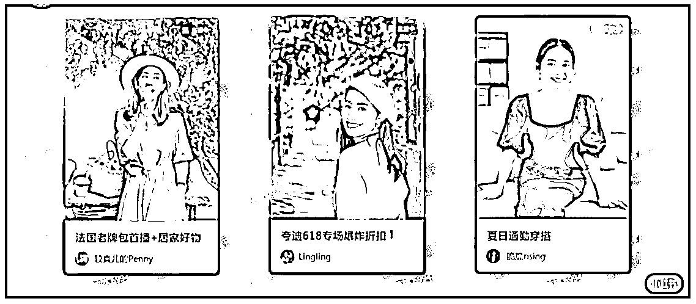

【形式 2】图片只有人物：凸显个人风格的单人写真

【形式 3】图片只有人物：单人多图拼接，直观展示效果和个人风格

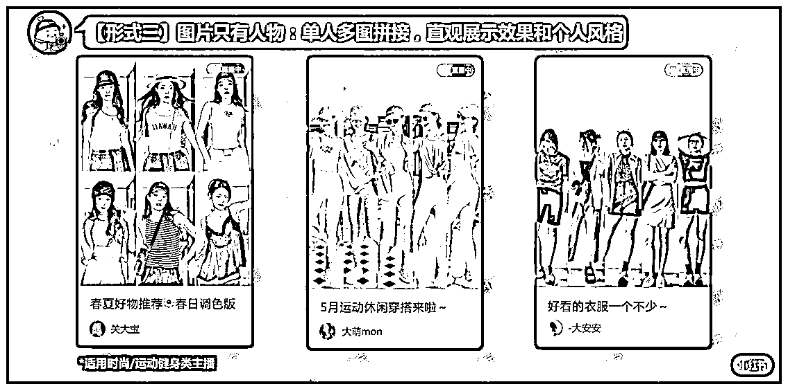

【形式 4】人物+主推商品：人物占比适中，突出直播主推商品

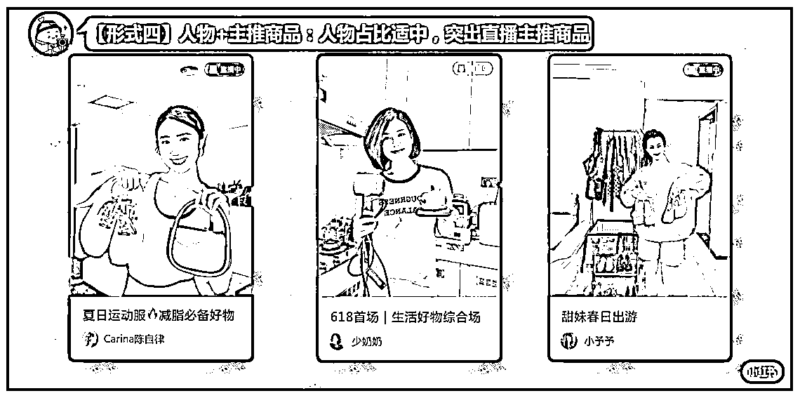

【形式 5】人物+多商品：主播占比适中，商品摆放整齐，与商品自然合照

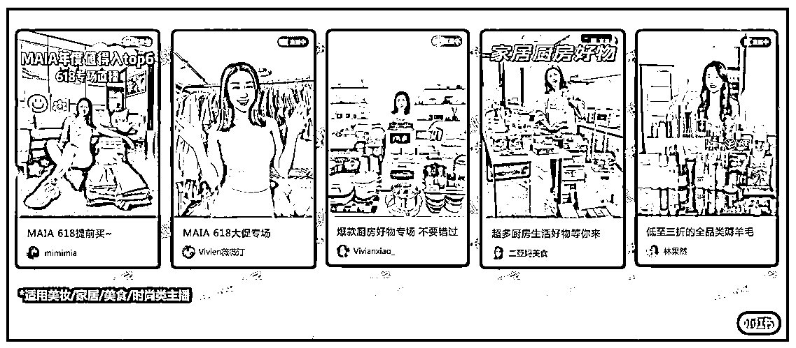

**  **

**3.优质预告笔记**

1.  形式：直播预告和日常笔记形式&风格保持一致

2.  内容：以种草为主多分享使用感受，切忌干巴巴讲价格

3.  封面：切忌大字报

4.  发布日期：提前直播日 1-3 天

5.  发布数量：发布 1-2 篇预告笔记

6.  笔记标题：利益点明确，记得添加直播预约按钮

**  **

**3.优质直播间**

布景：居家场景/干净背板+装饰物，可利用墙角增加景深

画面：镜头不要过度仰拍，明亮无黑影，若为电脑直播可增加切片（直播福利/商品信息）

【形式 1】客厅/餐厅一隅：布景有墙角+装饰物（绿植/带货商品/等）

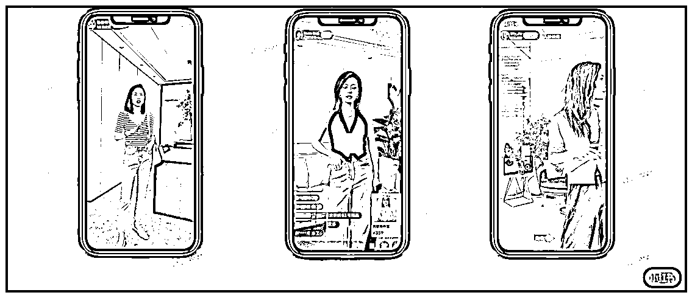

【形式 2】干净背板：无墙角+装饰物（绿植/带货商品/等）

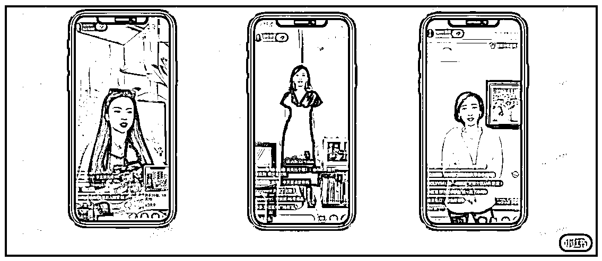

**  **

**4.笔记创作形式**

为直播间获得更多的流量曝光做准备，通过优质关联种草笔记提升直播间预约量，常见有 3 种：

**  **

**①合集拼图真人秀：** 真人+场景+不同产品图的合集形式

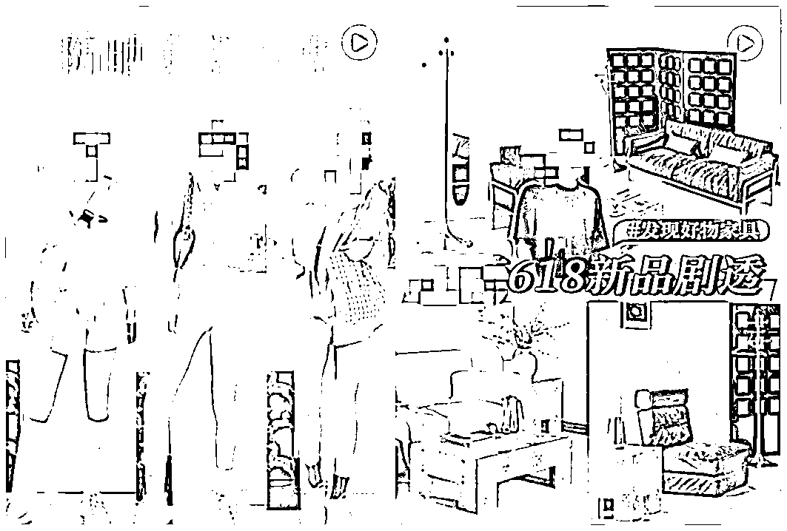

**  **

**②单场景真人摆拍：** 单图+真人+多个产品

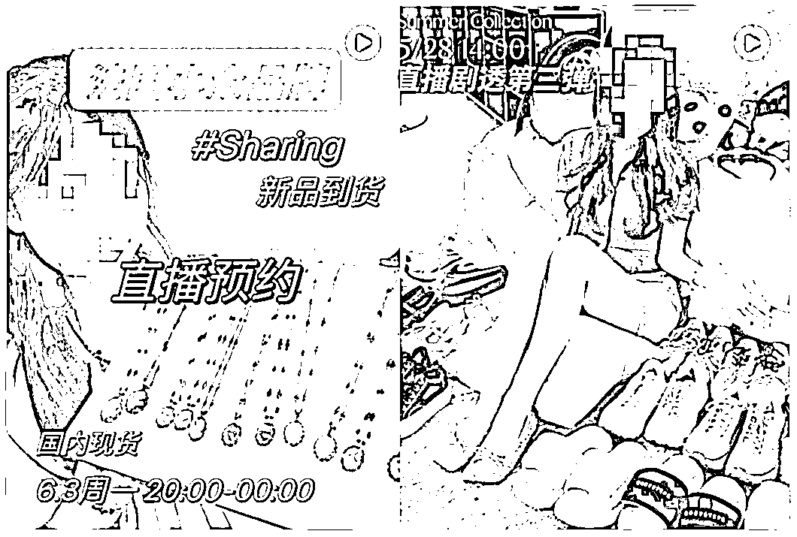

**  **

**③无真人类：** 无真人出镜的的产品合集（单图多品/单图单品拼图）

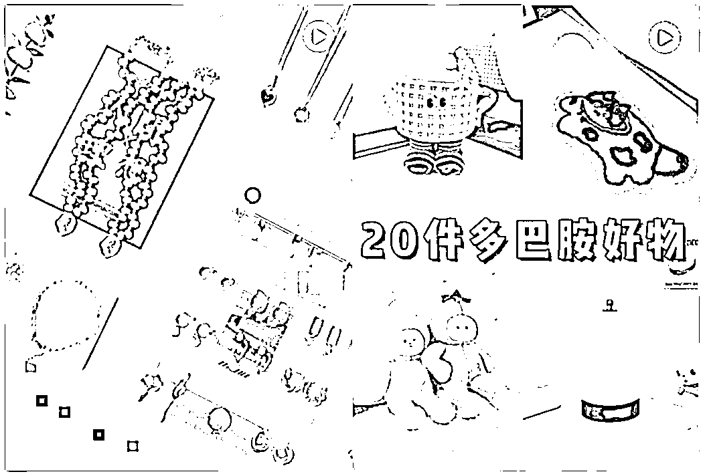

参考这些优质案例，其实好的预约笔记就是：**真人、产品合集、视频化。** 通过真实的人或场景突出多样的产品，吸引用户预约直播。视频笔记数据好，更适合做预约笔记。

**5.发布关联笔记**

**开播前笔记关联：** 选品后，在发笔记的编辑页面找到“商品”标识，点击后添加对应的商品，直播时笔记自然和商品关联。

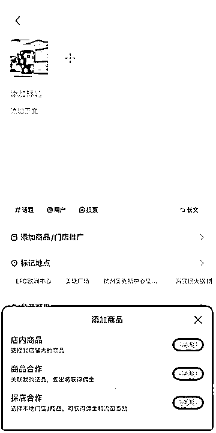

要是笔记没挂载商品链接，可以在评论区挂载：

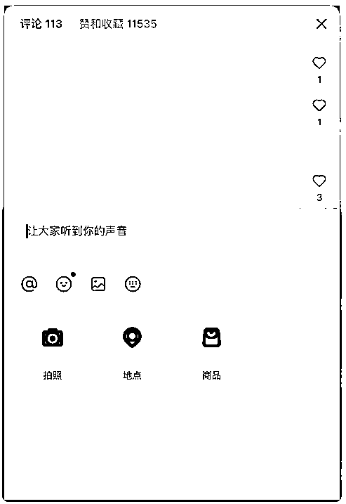

**  **

**开播时关联笔记：** 在直播界面找到 “商品” 选项，点进去看选好要卖的商品列表。选想关联的商品，点击 “关联笔记”
按钮，把提前准备好和商品有关的笔记链接输进去就行。

**6.确定笔记选题**

一个优质的选题，不仅能提升笔记的曝光量，还能提升直播间的预约量，分享 4 个选题方法：

**①关键词：** 搜索关键词是是掌握直播预约流量最快、最高效的方法。

比如你是珠宝赛道，就搜“珠宝直播专场”，找到最新的优质笔记重点对标。

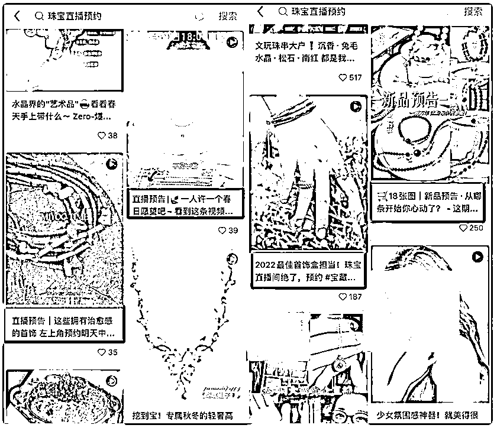

**  **

**② 长尾词：** 在搜索框输入“你所在的赛道或产品+直播预告”，像“珠宝直播预告”，在下拉词中，找到与产品相关的词作为选题。

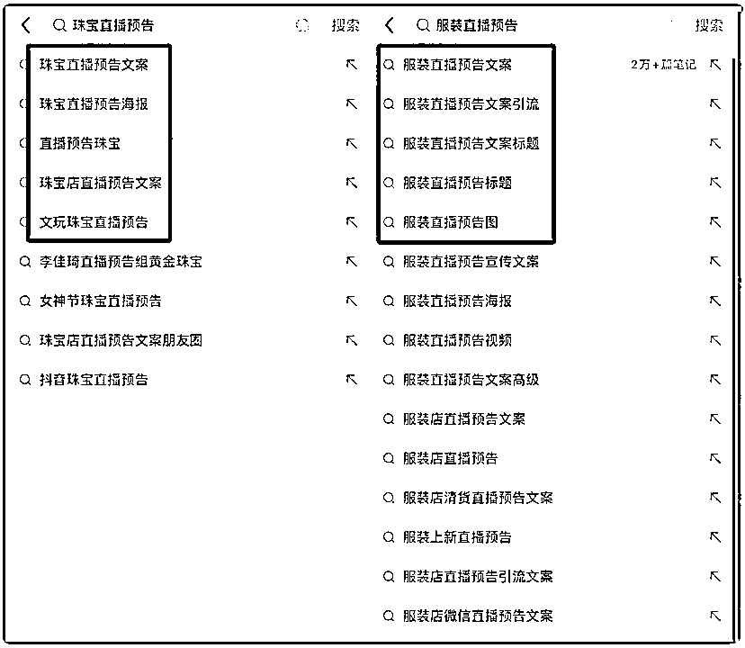

也可以点进对应关键词，找到优质笔记创作自己的预约笔记。记住，一定要近三个月的最新笔记。

**  **

**③ 同行直播间：** 通过搜索“品类词”，比如：“珠宝”，点击“可购买”、“主播”，或者“直播间”，就可以看到很多正在直播的同行账号。点进他们的账号主页，找到预约笔记借鉴模仿。

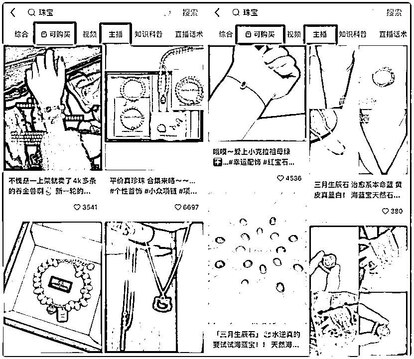

**  **

**④ 直播广场：** 还能通过“直播广场”，找到有爆款潜质的笔记账号主页收集直播选题。

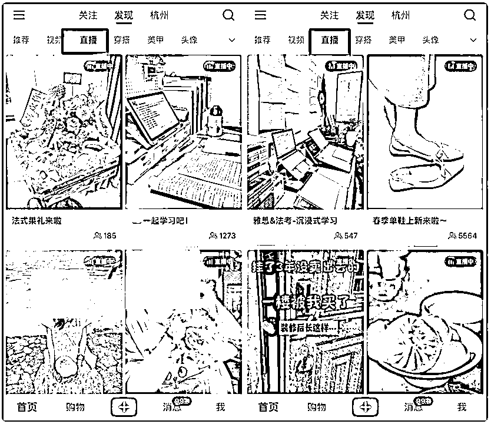

**  **

**⑤笔记选题公式：**

**季节/节日主题：** 用当下**热门话题** 吸引目标用户点击阅读，例：夏天、春夏。

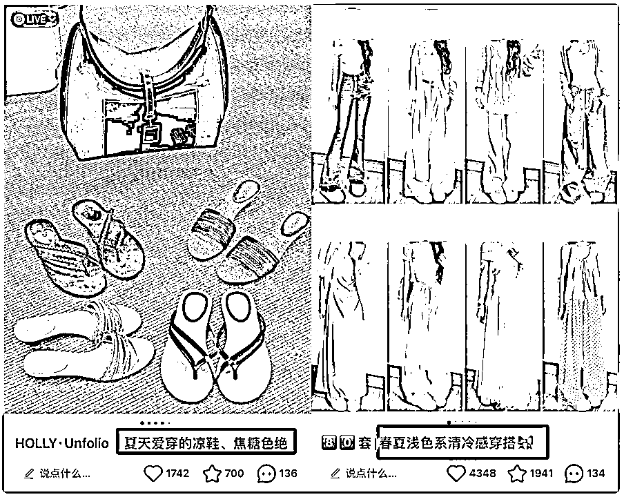

**  **

**系列主题：** 从产品的**不同风格、不同场景** 切入，圈中精准用户需求，吸引用户眼球，例：古着穿搭、vintage。

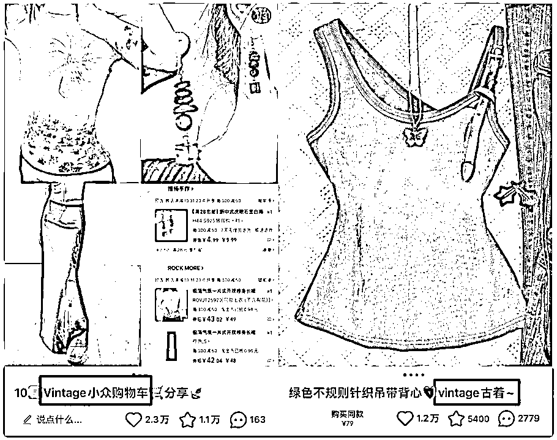

**  **

**新品预告：以新款为亮点，** 吸引目标用户关注，提升笔记点击率、预约量，例：新品+体验官。

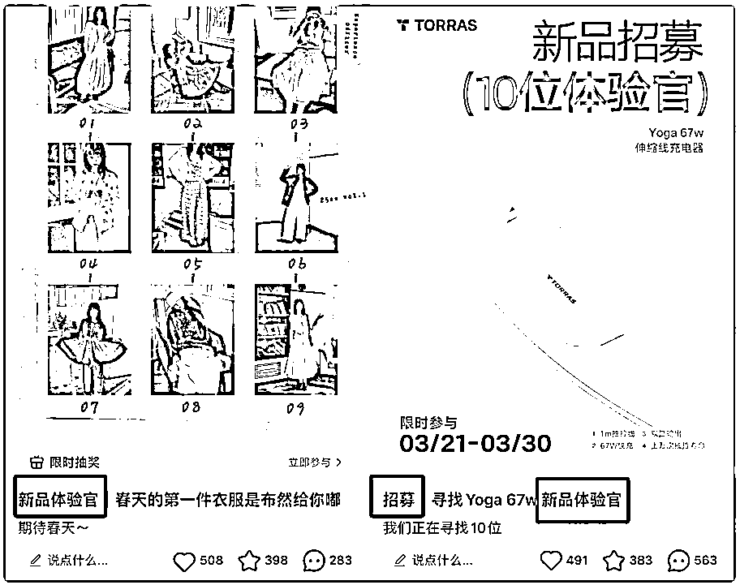

**  **

**凸显数字：** 用**显眼的数字体现产品的多样性，** 吸引用户点击，提升笔记曝光，例：1000 多单、6 家韩系小个子

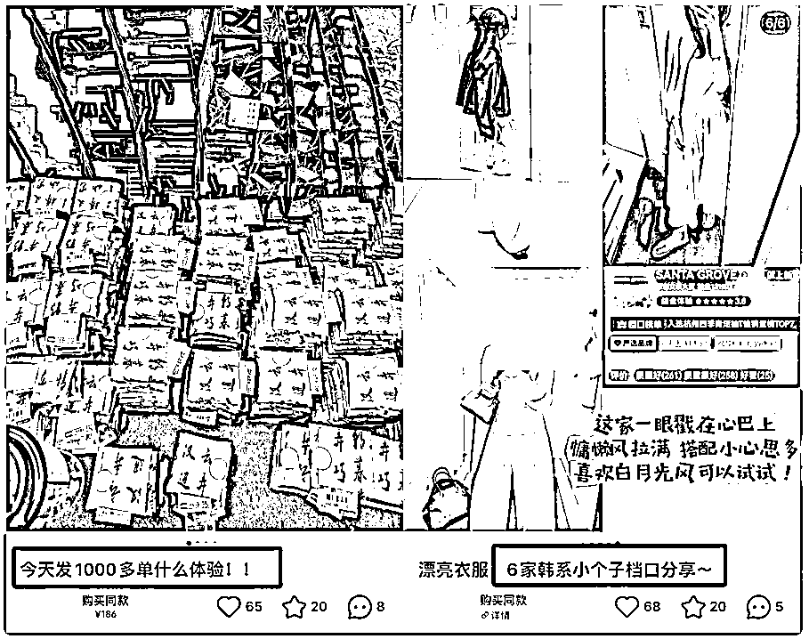

**  **

**7.直播笔记标题**

除了预约笔记选题外，笔记标题也影响直播间预约人数。标题可以侧重笔记重点和吸睛点，同时突出直播的主题、卖点、风格特色。

分享 3 个小技巧，快速优化直播笔记标题，掌握爆款笔记流量：

**①用具体画面/符号/数字进行结果描述**

原标题:南洋风家居搭配技巧

修改后:南洋风家居搭配分享，闭眼入轻松 get

**②怎么做+可以得到什么好处/解决什么痛点**

原标题:家居好物分享

修改后:这些家居夏凉好物，清爽过夏天

**③风格+产品/氛围+直播福利内容**

原标题:床品上新

修改后:天丝凉感被上新，首发福利送套

**8.直播间封面图**

除了标题，封面也很关键，一般来说，直播封面点击率达到 3%是比较高的数据。

想要提升封面点击率，可以参考这 3 种优质直播封面：**人物+商品、人物+场景、凸显个人风格的。**

**  **

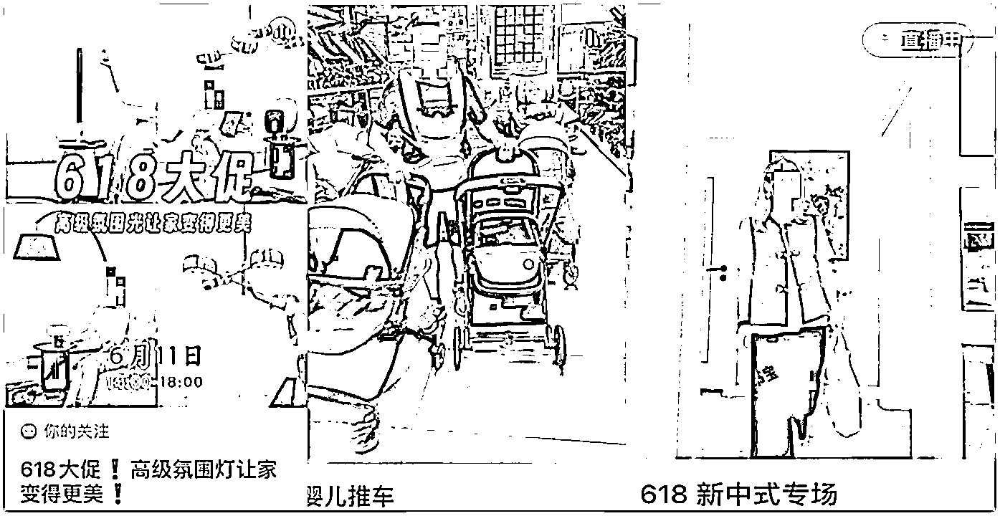

其实还是带货三要素——**人+货+场。** 哪怕审美一般，只要找准对标、学习模仿，突出优势就行。

**9.社群、个人简介**

开播前、开播时通过**小红书的粉丝群、私域群聊** 分享直播间，或是在**个人简介、瞬间动态** 里展示直播时间。

让新老用户随时了解我们的直播动态，增加直播间曝光、预约流量。

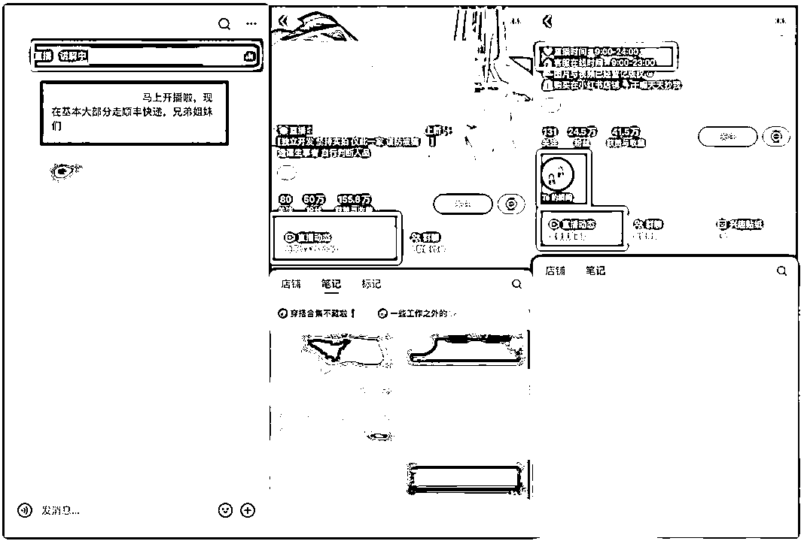

### 五、如何提升直播间转化率

**1.不同时间段内容安排**

**①开场 10 分钟：** 与粉丝简单互动，等待直播间人数增加，通过福利品，吸引用户留在直播间。或是用抽奖福利把用户持续地留在直播间，提升店铺持续性的转化。

**②中途若干小时：** 这个时间主要是畅销品、利润品、特色品的讲解。通过与粉丝的互动，提升用户的参与感，或者**安排小助理、客服、朋友来充当“气氛组”，** 增加新进直播间用户的停留时长。

**③收尾半小时：** 最后半小时也是一个转化小高峰，可以着重讲解热门的畅销产品，做一波促单转化。也可以预告下一场直播时间，拉动下一场的预约人数。

**2.直播抽奖**

很多刚开始做直播的朋友，可以用定时发放福利能更有效地留住用户，稳定直播间流量，提升产品转化，比如**红包、赠品、折扣券** 等。

**抽奖时间：** 可以设置每 15 分钟抽一波小奖，每整点抽一波大奖。

**抽奖形式：** 吸引用户关注、加入粉丝团、下单等方式进行抽奖。

ps：加入粉丝团、下单抽奖是促单效果最好的两个方式。

**抽奖或者福利提醒：** 利用小红书粉丝群、直播间右上角公告、直播间置顶评论等方式，进行多次提醒，引导用户参加

**3.群聊运营**

其实只要做好小红书粉丝群的基础运营，也能大大提升直播间转化率。

**开播前** ：通过小红书群聊功能推送预约笔记，用粉丝福利、新品上市等方式，吸引用户预约直播间。

**开播时** ：增加直播间推送量，引导粉丝进入直播间，提高进房率。同时也可以把直播间用户引导进粉丝群，方便后续转化。

**开播后** ：分享直播回放，鼓励粉丝反馈商品使用感受，收集意见，为下次直播做准备。

同时，在日常管理中，可以在群里为用户**提供售后服务、推荐产品** （群内购）提升店铺的关联产品销量，同时预告下一场直播。

**4.直播话术**

小红书直播对普通人来说非常友好，话术并没什么特别的套路。

**开场话术：** 开场得快速吸引用户注意力，建立联系，让用户愿意留下来，例如：“宝子们，欢迎来到我的直播间！今天这场直播超精彩，给大家准备了超多福利和超赞商品，千万不要走开！”或者
“家人们，我又来啦！今天有你们一直催着要的好东西，还有惊喜优惠送给大家！”

**产品介绍话术：** 介绍产品得突出特点、优势和价值，让用户心动、促进下单转化，例如：“这款精华，核心成分是高浓度的烟酰胺，提亮效果那叫一个绝！用一段时间，你会发现皮肤肉眼可见地变白变透亮，而且它质地轻盈，不油腻，各种肤质都能用。”或者“这件衣服版型超正，修身但不紧绷，遮肉效果一流。面料是高品质纯棉，亲肤又透气，穿一整天都舒服。”

**互动话术：** 目的就是增加与用户之间的互动，提升直播间的活跃度和粉丝粘性，常见的有四种。

**提问式互动——** 提问一些与商品相关的问题，有利于帮助观众解决商品上的困惑，促进转化，例如：“这一款还要再看主播展示其他颜色么？”、“刚刚给大家分享的使用小技巧大家学会了吗”。

**选择题互动——** 抛给观众一些选择，此时发言的观众购买意愿肯定不低，再做适当的引导利于商品转化，例如：“宝宝们对购物袋里面的哪件商品最感兴趣，可以评论编号，主播这边来做讲解”、“喜欢皮质的宝宝评论皮质，喜欢布艺的宝宝评论布艺”。

**刷屏式互动——** 互动发言成本很低，观众的参与度会比较高，也能让刚进直播间的观众感受到活跃气氛，增加互动量，例如：“觉得这套床品好看的宝宝们可以扣 1，让主播知道一下，下次直播主播还会选类似风格的商品”、“感觉宝宝们不够尽兴啊，是不是活动力度不够大？好，今天就给大家再增加福利，想要的宝宝们把 1 扣起来~我们再上一波福利”。

**宠粉式互动——** 主动 cue 出粉丝名字，和粉丝打招呼，例如：“欢迎 xxx 来到直播间，这是咱们的老粉了”。

**留人话术：**

**引导关注——** 通过精心设计的话术，可以引导观众关注产品的特点、优势和使用方法，吸引注意力，例如：“宝宝们，咱们家这款上衣采用的是 xxx 料子，上身特别的柔软贴肤......”

**提升商品吸引力——** 表达产品的卖点和价值，突出产品的优势，让观众更容易被吸引，增加购买欲望。例如：“我们家这口锅采用的是 xxxxx 工艺，获得过 xxxx 认证，炒菜不粘锅........”

**建立互动——** 回答观众问题，解决观众疑虑，增加观众信任感，提高购买意愿。例如：“宝宝们，有没有想让主播讲解哪一款，可以在评论区打出来“、”有没有新进直播间的宝宝，有的在评论区打个有，咱们给新粉宝宝一些福利......”。

**提升销量——** 一个恰到好处的话术可以更好地推销产品，提升销售效果，增加转化率，实现更好的销售业绩。例如：“喜欢的宝宝赶紧去下单啦，直播间专属福利错过就没有啦”。

**保证连贯性——** 话在直播过程中保持节目的连贯性和专业性，让直播节目更加流畅和有吸引力，提升观众的观看体验。

**促单话术：** 制造紧迫感，吸引用户抓紧下单。

像
“这款商品库存有限，就剩最后 XX 件啦，手快有手慢无，喜欢的宝子别犹豫，赶紧下单！”或者“现在下单，我们还送价值 XX 元的赠品，这优惠只有今天直播间有，错过可就没啦！”

**5.预热策略**

提前 3 天发布直播预告，标题带“直播剧透”、“专属福利”等关键词，正文用悬念和福利吸引关注。

短视频引流展示直播爆品和福利，私域通知在粉丝群、店铺首页发布直播提醒。

开播前，发布直播商品的合集，展示产品和福利；

开播时，通过私域在粉丝群做好直播内容的宣传和触达，增加曝光；

直播封面选择能够吸引点击的图片，例如可爱有趣的、与产品相关的、有知识点等等......

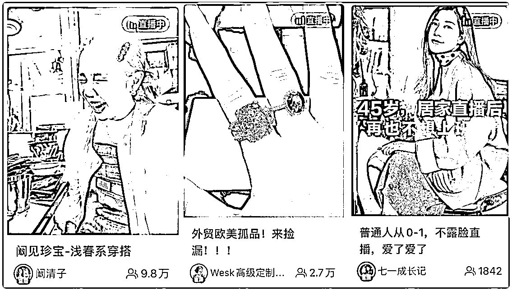

**  **

**6.商品合规**

另外，在小红书直播带货，商品合规可是头等大事。上架的商品必须有正规的品牌授权、质检报告啥的。

像食品类，得有生产许可证、卫生许可证；美妆类要有相关的备案凭证；要是卖一些特殊商品，比如医疗器械，那就更得严格遵守相关法规，提供完整的资质证明。

不然，一旦被平台查到商品不合规，直播间可能会被限流，甚至直接封掉。

需要注意的是，商品描述一定得真实准确，不能夸大功效。

比如说卖减肥产品，可不能瞎吹用了就能立马瘦十斤，得实事求是地介绍产品成分、适用人群和正常的使用效果。

**7.直播违禁词**

除此外，我们还要注意直播中避免使用违禁词，像**“最”、“极”、“绝对”、“第一”**
等词的违规风险就很高，如果没有真实的数据支撑，很容易被平台检测，判定违规，导致直播间被关停。

可以让助理在旁边及时提醒，避免违规，或者**使用其他简单易懂的词语代替，** 来降低违规风险。

**极限用语**

禁止使用“国家级”、“世界级”、“最高级”、“第一”、“唯一”、“首个”、“首选”、“顶级”等绝对化用语。

禁止使用“最高”、“最低”、“最”、“最具”、“最便宜”、“最新”、“最先进”等含义相同或近似的绝对化用语。

禁止使用“绝对值”、“绝对”、“大牌”、“精确”、“超赚”、“领导品牌”、“领先上市”、“巨星”、“著名”、“奢侈”等无法考证的词语。

禁止使用“100%”、“国际品质”、“高档”、“正品”、“国家级”、“世界级”等虚假或无法判断真伪的夸张性表述词语。

**违禁权威性词**

禁止使用“国家 XXX 领导人推荐”、“国家 XX 机关推荐”、“国家 XX 机关专供”、“特供”等借国家、国家机关工作人员名称进行宣传的用语。

禁止使用“质量免检”、“无需国家质量检测”、“免抽检”等宣称质量无需检测的用语。

禁止使用“人民币图样”（央行批准的除外）。

禁止使用“老字号”、“中国驰名商标”、“特供”、“专供”等词语。

**严禁使用刺激消费词语**

禁止使用“秒杀”、“抢爆”、“再不抢就没了”、“不会再便宜了”、“错过就没机会了”、“万人疯抢”、“抢疯了”等激发用户抢购心理的词语。

**疑似医疗用语**

禁止在普通商品中使用可能被视为医疗用途的表述，除非涉及特殊用途化妆品、保健食品或医疗器械。

**迷信用语**

禁止使用可能引起误解的用语，如“带来好运气”、“增强第六感”、“化解小人”、“增加事业运”、“招财进宝”等。

**化妆品虚假宣传用语**

禁止使用“特效”、“高效”、“全效”、“强效”、“速效”、“速白”、“一洗白”、“xx 天见效”、“xx 周期见效”等可能被认为是虚假宣传的表述。

**8.引导关注和互动的规则**

可以引导观众关注直播间、点赞、评论、分享，但不能用一些违规的诱导方式。比如说 “关注我就给你发红包”、“点赞到多少就送现金” 这种直接用金钱诱导的话术；

可以换成合理的福利，像 “关注直播间，下次直播有专属优惠”“点赞超过 XX，我们会抽取幸运观众送商品小样” 这种方式来引导互动。

### 六、如何提升带货效率

**1.直播数据复盘**

包括观看人数、观看时长、进房率、互动数据和销售数据。

**观看人数** 能看出直播间的吸引力，要是观看人数少就得看看封面和标题是不是不够吸引人，进行优化，提升数据，也可能是开播时间不对，做适当的调整；

**观看时长** 反映观众对直播内容的兴趣程度，如果观看时长短，那可能就是直播内容太无聊，得调整节奏和内容。

**互动数据** （点赞数、评论数、分享数、粉丝增长数），点赞多说明观众认可直播内容；评论多表示观众参与度高，我们可以从评论里了解观众的想法和需求；分享数多意味着直播内容有传播价值；粉丝增长数能看出直播间对新粉丝的吸引力。

如果互动数据不好，就得思考怎么调整直播话术和互动环节。

销售数据（商品点击量、下单量、客单价）商品点击量能知道哪些商品受关注；下单量则直接反映销售效果；客单价能看出观众的消费能力和购买偏好。

通过分析销售数据，我们就能知道哪些商品好卖，哪些需要调整策略。

数据分析就是为了总结哪些环节做得好，哪些需要改进，这一步对于后面的数据优化、提升变现会有很大的作用。

**优化方向：**

**1.选品：** 选品是否能让用户产生好感、提升商品的下单转化；

**2.互动：** 直播互动话术是否符合受众人群，及时优化调整；

**3.转化：** 直播转化话术的优化，例如用户痛点、需求点的补充调整，提升商品的转化效果。

**2.内容和带货结合**

首先，最常见的就是在爆款笔记中**挂上直播预告的链接** ，能把笔记的关注数据直接导流到直播间，大大增加直播关注度。

其次就是低价爆品或是热销商品，关联日常笔记中，来增加除直播之外的流量转化。

**3.粉丝分层管理**

区分直播间粉丝和已购买会员粉丝，通过群聊做好客户管理。例如：“xxx 粉丝群”、“xxx 会员群”、“xxx 日常开播群”。

针对不同的直播主题，在群里推送适合的直播链接，来促进商品的转化。

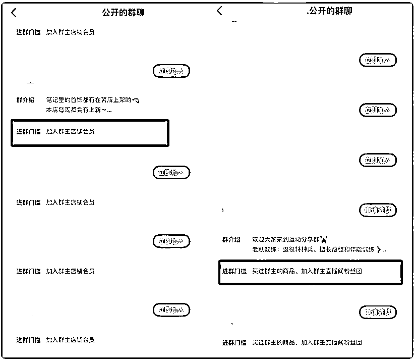

**4.引导加入粉丝群**

常见的就是利用进群福利来吸引新用户加入粉丝群，例如：进群领无门槛优惠券。

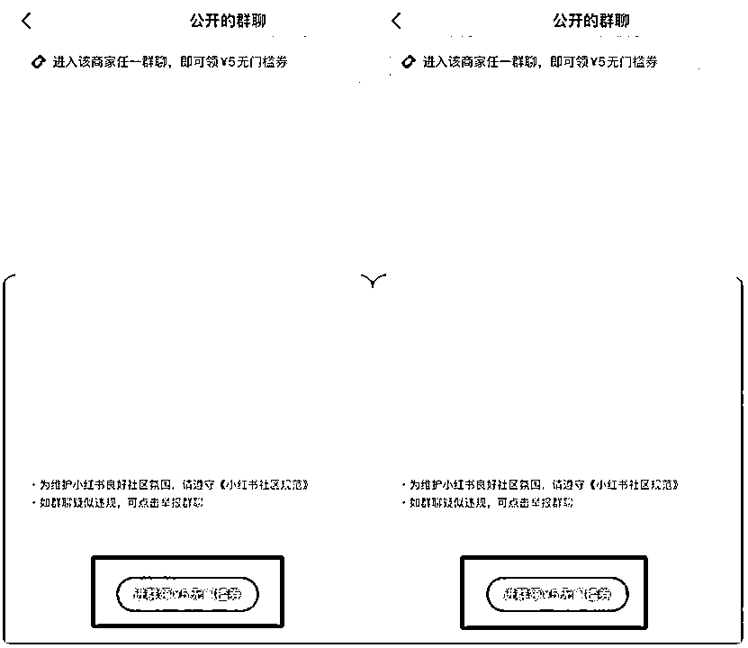

也可以在直播时，用引导话术来吸引加入粉丝群，例如：“每天 xx-xx 定时开播，粉丝群会提前推送直播动态，一定要多多关注”等。

**5.常见问题**

**问题一：开播时长建议？**

不少于 4 小时，周末不晚于下午 5 点开播，工作日不晚于晚上 7 点开播。

**问题二：如何进入“选品中心”？**

可以通过“创作者中心”-“商品合作”进入选品中心

**问题三：用户怎么购买才能算主播的佣金？**

用户通过你直播的商品进入商品详情页后，24 小时内完成下单或 24 小时内加入购物车，7 日内完成下单，都会计算为你的佣金。

**问题四：如何查看销售数据？**

直播中：主播视角的购物袋会实时展示销售数据，PC 管理后台可以查看实时数据（[`redlive.xiaohongshu.com/login）`](https://redlive.xiaohongshu.com/login）)

直播后：选品中心-我的数据。当天的销售数据第二天可在“我的数据”中查看。

**问题五：平台抽成比例是多少？**

平台将抽取佣金的 20%作为技术服务费，主播获得佣金的 80%

**问题六：佣金的结算时间？**

个人：小红书会在每月 8 号-15 号将确认收货的订单完成个税代扣后结算至小红书 app 钱包，如遇节假日将会顺延至最近的一个工作日

机构：小红书将会对公结算至机构，由合作机构进行收入发放和个税代扣

**问题七：佣金怎样提现？**

路径 1：钱包-我的收益-好物推荐收益

路径 2：创作者中心-商品合作-我-我的数据-提现

好啦，以上就是今天的超干货分享了，最后还是那句话，这个时代我们要朝“钱”看，不仅要跟上趋势，还要持续探索新的职业可能。

2025，我想带领 10000+博主在小红书持续稳定变现，欢迎你来链接~

* * *

评论区：

暂无评论