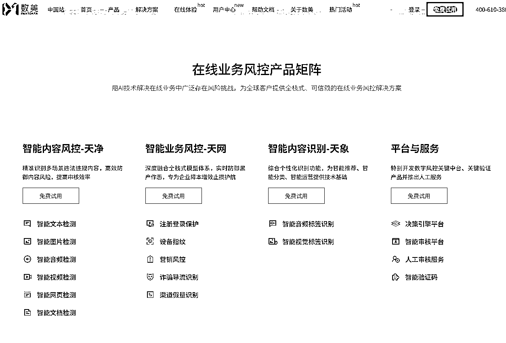

# (37 赞)（千字短文）小红书矩阵引流了 5000 个客资，总结出来的一些结论

> 原文：[`www.yuque.com/for_lazy/zhoubao/sxlmelywwi5h3zic`](https://www.yuque.com/for_lazy/zhoubao/sxlmelywwi5h3zic)

## (37 赞)（千字短文）小红书矩阵引流了 5000 个客资，总结出来的一些结论

作者： 更绪

日期：2025-05-11

各位圈友好久不见，我是更绪，**互联网最潇洒的 00 后，生财有术特级传术师，**

之前分享过一篇小红书矩阵获客的实操复盘贴，拿了个精华👉[`t.zsxq.com/Rz2Hs`](https://t.zsxq.com/Rz2Hs)

最近在实操过程中，又有了一些新发现，得到了一些结论，希望能和大家就这些结论有一些交流和讨论，

* * *

**01**

—

了解一下数美科技

所有的互联网平台，都主要会从 3-4 个方面对平台的安全风控，

**最常见的就是内容安全，**

**  **

平台会对每天产生的数以万计的图文、短视频、直播进行时刻的风控，杜绝涉及色情暴力、政治敏感等违法犯罪的内容出现在平台上，**这是法律层面的东西，平台必须控制好，不然等着下架，**

**  **

**然后是业务安全，**

**  **

这个主要就是防止我这种人在平台上搞事情，主要涉及到号码认证、验证码、设备指纹、实名核验、人脸核验等操作，**我现在干的事情，也就是在对抗他们的业务安全防控，**

**  **

**最后是应用安全，**

**  **

这个主要是涉及到 APP 一些应用安全方面的东西，和我们没太大关系，

一般像字节、网易、腾讯、阿里，这些一线的互联网大厂，他们都有自己专门的部门和产品去维护公司各个平台的业务安全，

但是像知乎、小红书这种非一线大厂，没有太多精力专门搞这个，就会外包给其它平台，比如知乎就外包给了网易的易盾，**小红书就外包给了数美科技，**

**  **

* * *

**02**

—

最重要的是账号

4 月份，我手里所有用来引流获客的账号全部被封，这些账号发的内容也全都被清除掉，大概有 100 个账号，

**但是，有 3 个账号还活着，没有受到任何影响，**

**  **

这 3 个账号与其它被封的部分账号，都在同一个 IP 和网络下，并且还和某几个被封掉的账号同时登录在同一台设备上（我都是一台设备登 2 个号），

但是它们没有被封，这三个号都是香港号，不过是非常老的香港号，之前是用户正常使用的，而且是深度使用的，因为我发现之前有很多正常的笔记内容，且有上千的收藏，

完完全全就是一个正常，且深度使用小红书的用户用过很久的号，

设备、网络、IP 都没有影响到这 3 个号，**所以打粉最重要的是账号质量，这也是数美科技披露出来的风控策略，**

* * *

**03**

—

设备第二重要

目前我打过粉的设备有 80 台左右，最近又采购了一批设备，登录了一批号，还没开始测试，

这 80 台设备中，有 6 台设备，无论什么号，只要一登录上去，第二天一定会被限制发布笔记，

**然而，**

**  **

剩下的 70 多台设备，都或多或少和这 6 台设备使用过相同的网络和 IP，但是他们没有出现这种情况，

**说明数美科技对设备的限制，比对网络和 IP 的限制更大，**

* * *

**04**

—

网络和 IP 相对不重要

**网络和 IP 这俩其实是最好解决的，设备其次，最难的是搞到高质量的账号，**

**  **

所以你看，数美科技会根据我们搞到这些东西的难易程度去采取相应的策略限制我们，

他们优先盯账号，其次盯设备，最后盯网络和 IP，

* * *

**最后总结一下，**

在流量江湖行走，永远要记住：风控是场猫鼠游戏，但真正的高手都懂得与平台共生，

当我们摸清数美科技的"三板斧"（账号-设备-网络）后，反而能逆向破解平台的生存法则：

1️⃣ 养号如养兵：真正优质的账号是能穿越周期的硬通货，建议用"三真策略"（真实用户轨迹+真人操作习惯+真情内容沉淀）打造账号护城河，

2️⃣ 设备指纹暗战：建议建立"设备健康档案"，去记录设备存在的问题，

3️⃣ 把平台当盟友：与其对抗规则，不如用"合规杠杆"（素人代发+聚光投放+内容共创）借势平台流量红利，

**记住：在流量战场上，活下来的不是最聪明的玩家，而是最懂规则的生存者。**

* * *

评论区：

更绪 : 评论区多交流，最近痴迷打粉，和平台斗智斗勇，无法自拔，

百哥 : 点赞

烽火 : 点赞，这个系列非常有用。其实也可以有机会找一批老号

辉 : 大佬厉害啊

向前 : 私人老号权重一直还是比较好的

更绪 : 是的

招财进宝 : 私人号，太耐用了

执笔 : 跪求号的资源