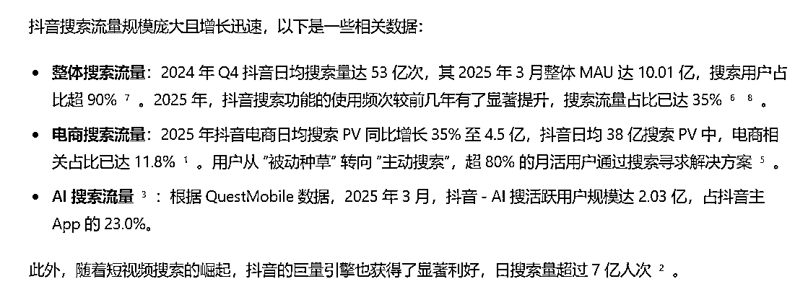
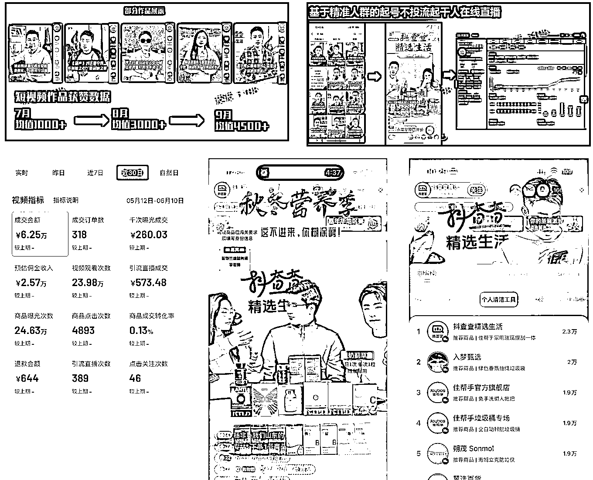
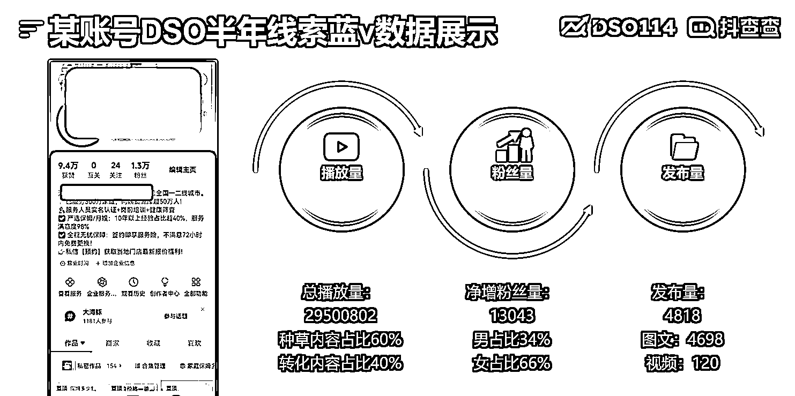
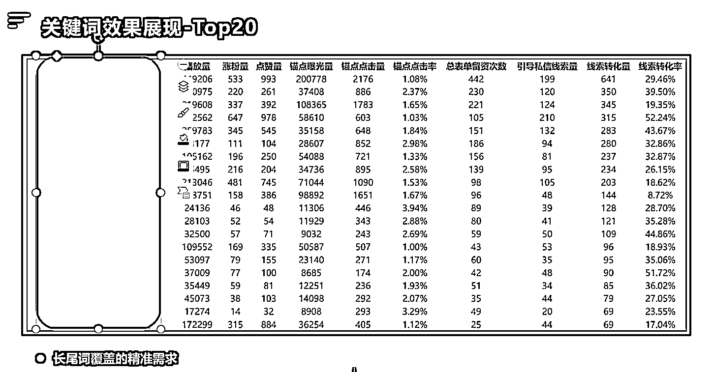
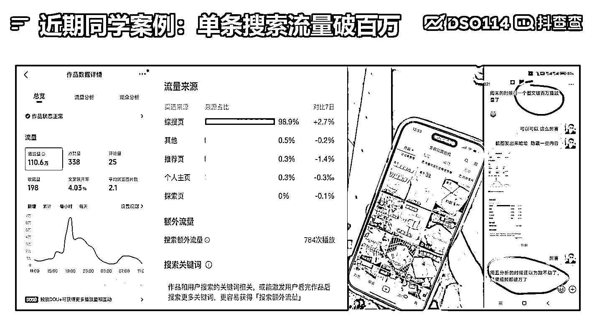
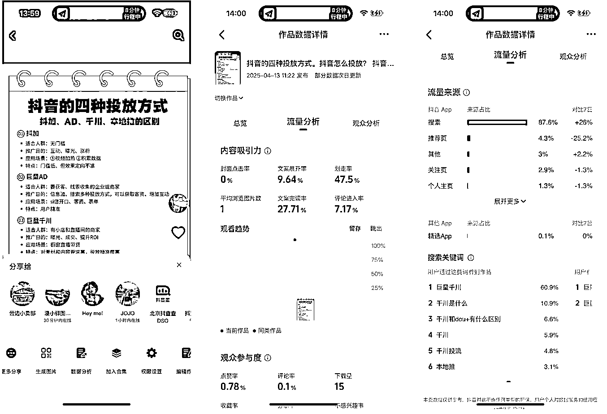
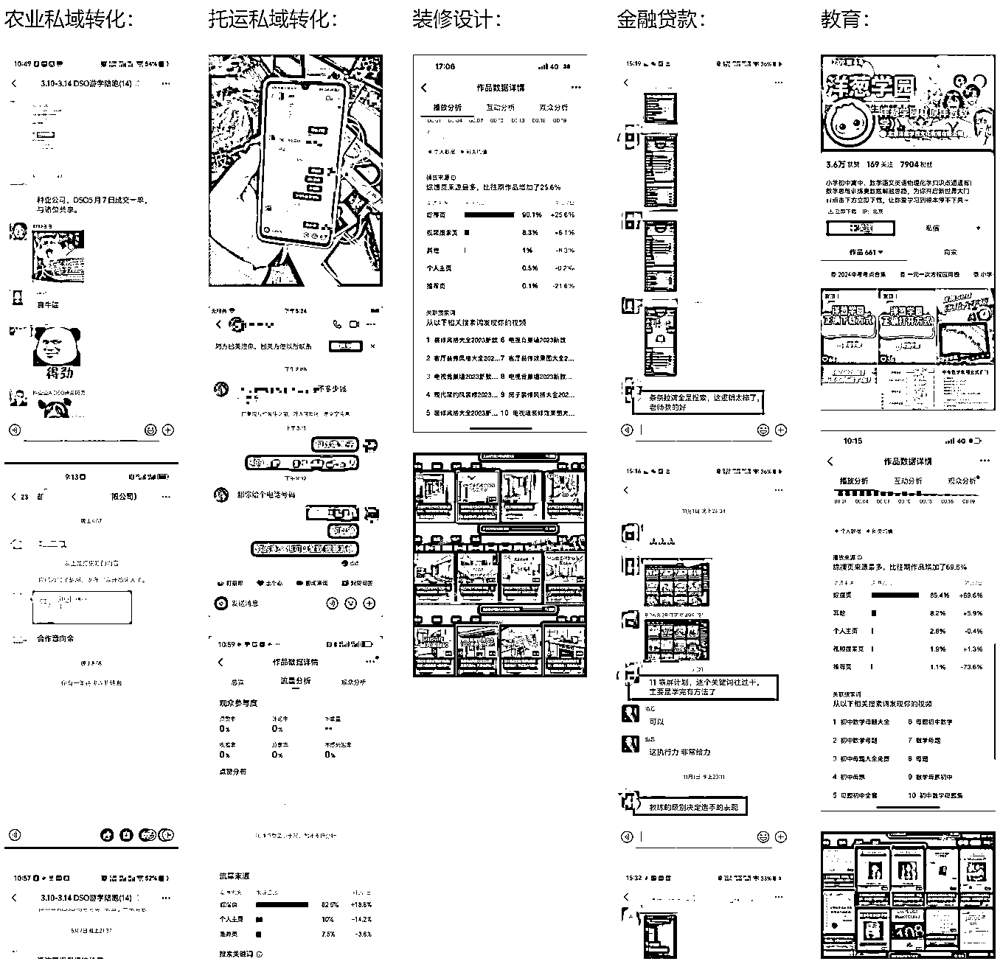
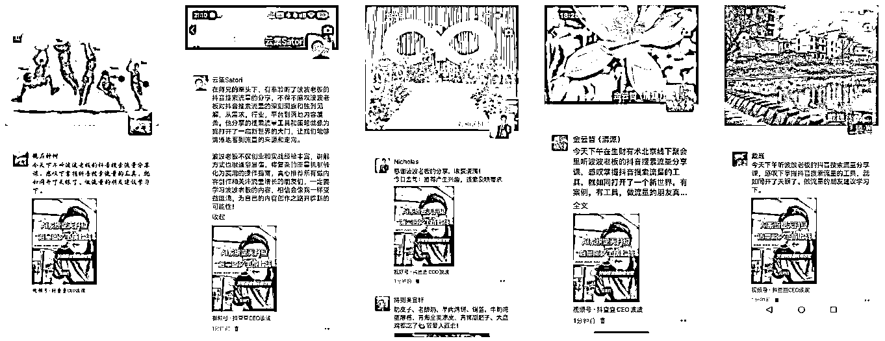
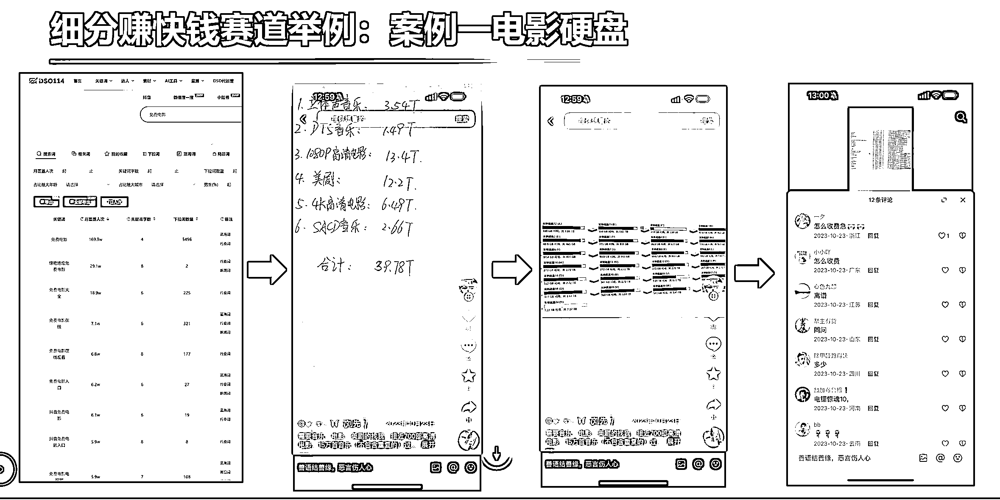
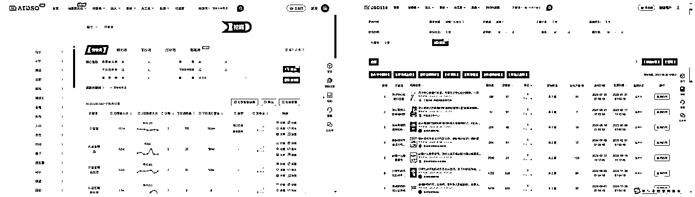

# (精华帖)(109 赞)无论你要与不要，搜索流量就在那！抖音搜索 DSO 航海即将起航！

> 原文：[`www.yuque.com/for_lazy/zhoubao/fend6m6es23ugw4h`](https://www.yuque.com/for_lazy/zhoubao/fend6m6es23ugw4h)

## (精华帖)(109 赞)无论你要与不要，搜索流量就在那！抖音搜索 DSO 航海即将起航！

作者： 波波@抖查查@爱盈利

日期：2025-05-18

大家好，我是波波，20 年加入生财，生财私董会成员，老圈友很多都比较熟悉。^_ 这次给大家带来的是关于抖音搜索流量 DSO 的航海。

飞书文档地址：[`s12is4u3s19.feishu.cn/docx/QR38d2OBToT6u8xIhMLcb0zGndb`](https://s12is4u3s19.feishu.cn/docx/QR38d2OBToT6u8xIhMLcb0zGndb)

## **一、个人介绍**

搜索流量做个 10 亿营收，不含投放！^_

在从 0-1 的创业经历中，曾利用搜索流量，赚钱，孵化产品和项目多年，成就了很多公司和个人。

19 年开始专注抖音赛道，从抖查查数据工具开始切入，然后 20 年杭州落地分公司做电商、投流、以及更多业务。几年时间把杭州分公司最高做到 200 多人。在知识付费和品牌服务领域都做到了行业头部。

还记得生财的抖音大航海第一期，就是波波当的船长。

25 年，流量生态中的来说已经卷的让绝大部分人都比较难受了，那有没有一些值得深入研究，和值得投入足够的精力去拿结果的流量获取方式呢？

**流量的焦虑** 主要来自不确定性。

而搜索流量每天每个词下面**多少流量是非常确定的** ！

拿到流量的确定性，是缓解流量焦虑的最佳手段。^_，下面我们先来看下搜索流量的基本情况。

## 二、抖音 DSO 的介绍

抖音搜索优化，我们简称 DSO（**D** ouyin **S** earch **O** ptimization），DSO 核心主要包含三大部分，**精准选词、内容覆盖、转化产出** ；这是一套通过多种运营策略，对发布在抖音平台上的内容进行优化的体系，**目的是让相关内容在抖音搜索结果页面中获得更靠前的排名，让用户在搜索某个关键词的时候，优先看到你的作品** ，对你感兴趣，进而产生留资、下载和购买等一系列用户行为。

**为啥会出现搜索流量优化呢？**

抖音的成功离不开**推荐机制** ，目前是抖音内最主流的流量分发机制。具有时效性的热点内容会很容易引爆。针对推荐流量，要么直接变现，要么给用户留下深刻的记忆。

推荐机制的优势明显，就是爆发力强，一旦爆发流量成本足够低。但是短板也非常明显，**不容易掌控，承接流量转化困难，一波流。**

所以市面上就出现了一些主流的打法：

1）蹭热点流量和搬运，主要应对的是，爆量不易掌控；

2）夸大效果和品质，过度承诺，说白了就是往死里忽悠，生怕转化不了用户浪费了流量；

3）运营团队不停的出短视频和投放素材，承接团队不停的直播和私域转化，一旦团队停止运转业务也不会再有任何增量。

这些打法都不能持久，影响流量转化。

这个时候搜索流量优化的玩法就出现了，**搜索机制** ，针对一部分，主动、明确需求的用户（抖音里是一部分，但是对于商家来讲，是足够大的精准需求人群），打造**长效内容** ，一旦打磨出转化模型，就会成为某个关键词下面的若干个流量池，如果持续积累生产，覆盖越来越多的关键词，就会积累茫茫多的大大小小的流量池，每天都在给你提供大量的精准用户。

抖音 DSO 的项目链路分为：**选词、内容生产、转化产出，** 三个部分都要做好。

**主要步骤是：**

**选词 >覆盖>排名优化（搜索点击率、完播、互动）>引导>转化**

### **2.1 自家案例分享**

**拿我们自家的抖查查账号举例** ：利用搜索流量在 24 年起号成功，自然流千人在线直播间，一直做到了今天，下图中的男孩是我家的程序员，女孩是运营同学。**普通的素人** 利用好搜索流量，结合自身优势也能够做出稳定的流量池。带货数据也从 5 月份的一个月几万块，达到年底一天好的时候可以做近 10 万的 GMV。

某企业蓝 V 账号数据分享：

对于熟悉搜索流量的同学，你的 SEO 经验和对于搜索流量的理解，放到抖音乃至更多社交自媒体平台里面，都将给你带来新的斩获。而对于不太懂流量，不太会赚钱的同学，将搜索流量作为流量的入门课，也是非常明智的选择！

实战航海，大家肯定关注的是，适不适合自己，参与后能否拿到结果，以及在以后的发展过程中，是否能够用得上，持续帮助自己不断的取得更大的成绩。

### **2.2 抖音搜索 DSO 流量是否很难学，很难掌握？**

波波无法保证每个人都可以做到极大的获得，但是可以保证，有些人可以获得超出预期的价值。我们自家一名实习生学习 DSO 用到自己工作中，在学习一周的时间拿到的成绩如下：**单挑视频 1 天的搜索流量破了百万。**

**  **

### **2.3 小知识点：怎么看自己的视频流量来源呢？**

在抖音你的作品里面，点击右下角的**三个点** ，然后里面找到**数据分析** 按钮，选择**流量分析** 选项卡，**下滑** 就可以看到流量来源，如果你的作品大部分都是来自搜索流量，那么这就是一条完美的 DSO 视频，下面还可以看到是哪些关键词带来的流量。

波波每个月都会举办和参与不少关于流量获取的沙龙活动，每次交流的时候，都会问大家，谁能够确定性的做出搜索流量占比高于 80%的抖音内容，能够举手或者寥寥无几，最多就是做过一定占比的内容，比如搜索流量占比 30%左右，然后再追问下制作逻辑，就无法回答了。

这说明**搜索流量** 获取，在抖音这类平台里，是**有巨大的信息差** 的，光知道怎么做就可以超过 95%的人。抖音的内容创作者几百万上千万，如果我们都去卷视频镜头，卷画面质量，卷颜值，卷才艺，肯定绝大部分人都是拿不到流量的。因为太普通、太平庸了，比不过，但是如果有一种流量获取方式 99%的人不懂，是不是就意味着有很大的机会？

是的，**抖音搜索流量的机会巨大** ，而且**只要你参与这次航海，就能拿到这个信息差。**

因为这次航海波波和自家的讲师小伙伴会系统的把搜索流量如何获取的方法论给大家整明白。

我们能够做到：有没有基础，都可以理解搜索流量的获取方法。

[视频：理解搜索流量和项目的关系](https://s12is4u3s19.feishu.cn/docx/QR38d2OBToT6u8xIhMLcb0zGndb#share-F9xDdgrHPo7MQVxKq3XcWYyfnzb)

## **三、****如何赚钱**

一旦你掌握了一个流量技巧，下一步就是如何用流量来**赚钱** 了。主要的赚钱思路：

1）有业务基本盘的同学，可以利用搜索流量的获取能力在自己的赛道拿到更大结果；

2）职人，可以通过掌握了流量能力，进行同行业的生意赋能，培训同行，企业陪跑；

3）流量玩家可以利用 DSO 能力在高变现小赛道进行快速变现；（航海过程中会推荐一些代表性的变现赛道）

先来看部分学员案例：

DSO 工具推出已经有 1 年多的时间了，越来越多的同学在不同行业吃到搜索流量的红利，同时开始深度布局 DSO 搜索流量的获取了。

波波在北京线下活动，给生财的同学讲抖音搜索 DSO 的知识：

变现逻辑分为**两类** ：1）有自有业务的同学，2）没有自有业务的同学。

如果你已经有成熟的基本盘业务，且已经跑出利润了，那么布局好搜素流量无疑是你的放大器，可以帮你把业务翻倍甚至是数倍数十倍。

波波曾经在生财发过一些行业通过 DSO 获取流量的案例：可以去看下。

[旅游行业：抖音搜索（DSO）线索流量获取](https://articles.zsxq.com/id_si3u3ch9fkh0.html)

[减肥赛道抖音线索获客实操案例](https://articles.zsxq.com/id_odv2zl0guaa7.html)

[轻度游戏 App，抖音搜索引流实战案例](https://articles.zsxq.com/id_5355amrotlvr.html)

[财税线索获客：抖音搜索（DSO）案例拆解](https://articles.zsxq.com/id_xupwwrrpd0wz.html)

[律师、法律行业做抖音号：搜索实战案例](https://articles.zsxq.com/id_xhuiu54b43lt.html)

[留学行业在抖音一天免费搞几百条精准线索](https://articles.zsxq.com/id_hwrs6kaqghs3.html)

这里波波插入一个之前发布的视频，里面详细讲解了搜索流量适合和哪类赛道结合。这个是针对现有业务盘的团队，告诉大家什么样子的业务最适合做搜索，效果明显，拿到结果快。如果你的业务不是很符合也没关系，也可以通过搜索流量的布局得到相应提升。^_

如果你还没有变现业务，也不用着急，我也会给大家一些快速变现方向的指导，甚至是提供一些变现的渠道。方便大家来快速上手流量获取，且拿到收益。

例如：一些大场的 CPS 项目、旅游线索获取、本地线索获取等。

## **四、DSO 工具如何使用**

除了系统的课程和方法论，会在这次航海给大家提供之外，我们还将会给大家**提供搜索选词工具** 来配合我们的选词，内容生产，以及任务监控管理。具体的使用教程可以先看下使用文档：[AI-
DSO（原 DSO114）工具教程](https://s12is4u3s19.feishu.cn/docx/UdbkdYZfYoispVxZCXmcAgqYnze)

## **五、项目难点和风险**

**正反馈周期较长：**

推荐流量拼的是**短跑** ，**爆发力** ，搜索流量玩的是**长跑** ，**耐力** ！心态崩溃，往往是失败的主要原因。

**“快”不如“持久”！** 不断的正确选词+不断的高转化内容生产，就会收获源源不断的流量。

波波这边有一个 3 年多没更的老账号，每天还有几万的搜索播放进入。还有就是新做了半年多的账号，每周 100 万搜索播放。有一些主力 DSO 内容，贡献了 80%的搜索流量。DSO 内容做起来了，是可以**吃老本** 的！

**前期：** 产品分析（包含：产品定位、目标人群、盈利模式、主要业务/功能、推广方式、经营现状等）、竞品分析（相似竞品 3 款在抖音推广内容分析）、关键词词性定位（定位方案关键词类型及数量预估）选择高转化精准的关键词进行拓量。

**中期：** 根据已选定的关键词进行内容创作（包含：排名创意、覆盖创意）、拍摄和剪辑；视频发布、运营、合集创建等，达到关键词覆盖、排名抢占、霸屏、目标转化等指标。

**后期：** 运营数据每日监控，实时数据盯盘，随时挖掘商机、黑马关键词进行策略调整，一切以流量最大化转化为目标！

**项目风险：**

因为启动成本比较轻，几乎没有任何大的系统风险。可能存在的账号风险与违规风险点：

1）堆砌低质量内容，流量分配权重下降；（比如同一个词用 DS 反复生成雷同内容，大量发布。）

2）引流行为严重，封禁蓝 v 账号线索功能；

3）还有搜索盈利主要的核心奥义是，**小赛道：** 隐藏自己找到的赛道+优质关键词，这样竞争对手就不会发现，来和你竞争抢词，避免因为竞争带来的运营成本上升。**大赛道：** 隐藏不住，有被恶意模仿，举报的风险。所以不要有平台不太喜欢的引流行为，比如简介留微信跳站外，还有内容不符合规定，或者行业属于擦边或者违禁行业等。

应对方案：如果是高暴力赛道，就需要有废号的意识，准备足够的资源。波波还是建议大家走长效经营，吃时间红利的模式，这样才能越做越强。

## 六、适合人群

有短视频拍摄、剪辑经验的优先。

**有韧性** ：执行力这种基本素质就不提了。在执行力之外，有韧性是非常重要的一个素质，项目起号有一个周期，初期正反馈一般需要一周到一个月的时间，效果爆发期，往往出现在 3 个月左右。所以没有做好坚持 3-6 个月的人不适合参加本项目。

有时间：每日花在项目的时间不低于三小时。

## 七、项目预期和注意事项

1）启动周期快的话 1 个月内看到比较明显的结果，正常情况 2-3 个月；

2）专注做 DSO，不建议和推荐流量兼着做，因为两种逻辑截然不同，如果混在一起，容易走火入魔^_；尽量先清空所有推荐流量带来的固有观念，才能研究透 DSO 的逻辑和玩法；

3）提前把剪辑和编导能力锻炼起来，一般 1 年以上经验是最佳的，如果没有经验的小白，建议先按操作手册，把剪映等工具用熟练；

以上就是抖音 DSO 做获客的介绍分享，如果你对抖音流量获客感兴趣，或者想学习赋能自己的业务，欢迎来报名 6 月航海，来一起深入参与学习。^_

* * *

评论区：

郑玮 : hh 人生何处不相逢

波波@抖查查@爱盈利 : [呲牙]

北纬 64 度 : 哇，这个好酷，期待期待

Yhx : 请问原理可以套用到小红书吗

逆旅观星 : 终于等到波哥的航海了，期待[色]

波波@抖查查@爱盈利 : 有很多原理是通的

波波@抖查查@爱盈利 : [抱拳][坏笑]

Yhx : [强][强]