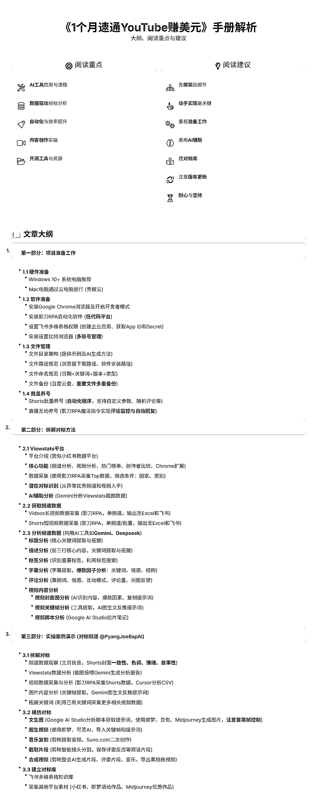

# (102 赞)1 个月速通 YouTube 赚美元！3W 字干货手册+免费开源神器，小白逆袭就靠它！

> 原文：[`www.yuque.com/for_lazy/zhoubao/nghh9o4z7rv8n5u2`](https://www.yuque.com/for_lazy/zhoubao/nghh9o4z7rv8n5u2)

## (102 赞)1 个月速通 YouTube 赚美元！3W 字干货手册+免费开源神器，小白逆袭就靠它！

作者： 越越

日期：2025-05-19

大家好！我是**Youtube 出海赚美金** 的新手小白——越越。

**本文主要亮点:**

1.从"环境设置"-"具体实操"部分,提供**详细的图文演示** 。

2.部分章节提供"特别注意"的经验提醒,尤其是"**新手最容易出问题部分** "。

3.文章思路和内容来源于:"航海+深海圈"中圈友们的日志打卡,从**实际需求** 出发完善"解决方案"。

4.本文会持续更新，本文分为“上中下”三部分，字数共 10w 字，请**及时点赞，并关注星球更新** 。

5.本文在“圈友”精华帖的基础上，对工具制作思路、代码进行完善，直接提供“成品+代码”，**保持更新** 。

**我报名参加了深海圈一个月时间，我来汇报下我解锁的“学习成就”：**

1.刚接触 Youtube 项目一个月，**已经申请了 2 个 YPP** 。

2.在“做的过程中学会根据问题，查找帖子，发现帖子里的需求点”，然后使用 Ai 分析需求、实现需求，因此在这一个月里我的 Ai 提问能力直线上升。目前我给自己能力的评价是：**能够使用 Ai 独立逆向提示词和程序** 。

3.在星球里查找相关帖子的时候，我发现有一个共性问题：帖子多数是给行内人阅读，即需要有一定基础能力的圈友才能顺利学习、复刻，**对小白圈友不友好** 。整理了圈友们的反馈和需求，花了两周时间写了一份 3W 字适合小白圈友学习、使用的《Youtube 学习手册》，学习手册中包含了我如何使用 Ai 赋能 Youtube 项目、通过“Ai+编程”实现自己的**工具自由** 。

4.将文档中提到的工具源代码和制作思路开源给圈友们，我认为“技术不是门槛，挖掘真需求才是“真门槛！””。

5.部分思路来源于@钱塘江鲤 @困困教练@李香君@曹淦等各位教练，感谢深海圈的各位教练和伙伴们耐心解答。

**飞书链接直达：**[`txt6wm3b04b.feishu.cn/docx/L5KXdFjhdoLhguxFpqZceXD8nSd?from=from_copylink`](https://txt6wm3b04b.feishu.cn/docx/L5KXdFjhdoLhguxFpqZceXD8nSd?from=from_copylink)

* * *

评论区：

李澹归 : 先赞后看

枫晓陌超强执行力 : 太厉害了。先赞后看

Gary 曹淦 : 强，无敌

Gary 曹淦 : 看完了，越总的思路完全是高维打法，不仅在 YouTube 可行，在任何一个赛道都可行，非常值得跨行、跨领域的圈友借鉴

Ai-Roi 钱多多 : 👍

轩辕 : 小白感谢博主，确实是小白的好教程

Laura : 厉害👍

白日梦想家 : 好强，新手很需要这样详细的教程