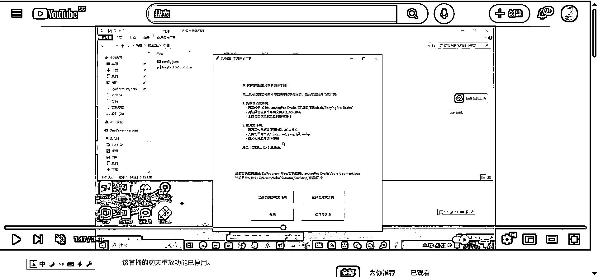

# (42 赞)关于对圈友的飞书文档《13 天开通 YouTube YPP，从 0 到 1 月入过万的自动化实操记录》的补充

> 原文：[`www.yuque.com/for_lazy/zhoubao/csc3u3f2wbtdtzcg`](https://www.yuque.com/for_lazy/zhoubao/csc3u3f2wbtdtzcg)

## (42 赞)关于对圈友的飞书文档《13 天开通 YouTube YPP，从 0 到 1 月入过万的自动化实操记录》的补充

作者： 书情小跟班

日期：2025-05-12

最近圈友 Zero 这个飞书文档热点挺高的，如下图

经过我在 github 的寻找，找到如下的项目

项目地址为： [pyJianYingDraft](https://github.com/GuanYixuan/pyJianYingDraft)[`github.com/GuanYixuan/pyJianYingDraft`](https://github.com/GuanYixuan/pyJianYingDraft)

**  **轻量、灵活、易上手的 Python 剪映草稿生成及导出工具，构建全自动化视频剪辑/混剪流水线

写这个文章也是在此谢谢 Zero 提供的思路，由于飞书文档不提供代码复制，如想复现懂技术的圈友可从项目
**[`github.com/GuanYixuan/pyJianYingDraft`](https://github.com/GuanYixuan/pyJianYingDraft) **下载代码自己跑起来。

我也是程序员，还真给我跑出来了，生财的氛围确实是好，分享利他精神

再次感谢 Zero 提供思路，我也是打开了新世界的大门

最近弄了如下图的工具

这个插件，可以对#标签 进行查找搜索，会得到以下数据 频道、观看量、点赞数、评论数、发布时间 ，有导出按钮

导出效果如下所示

如圈友感兴趣，点赞即可，后续给大家使用，我不保证永远免费，如果很受欢迎会考虑进行收费。毕竟生财是一个谈钱不伤感情的社群。

* * *

评论区：

L!N/林林/小林 : 你简直生财的油管男神