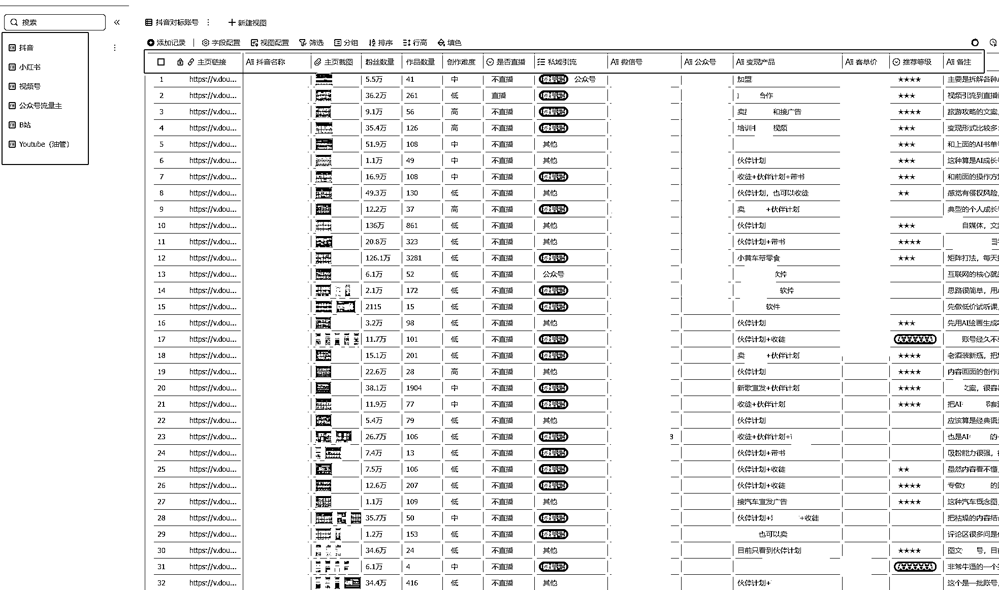

# (55 赞)如何从一个小的需求点出发，把它落地成具体可执行的大项目？

> 原文：[`www.yuque.com/for_lazy/zhoubao/vhe2ygsqnrbmz7x4`](https://www.yuque.com/for_lazy/zhoubao/vhe2ygsqnrbmz7x4)

## (55 赞)如何从一个小的需求点出发，把它落地成具体可执行的大项目？

作者： 铲哥带你飞

日期：2025-05-12

这篇文章很短，但可以应用到 99%的项目上，让你可以从一个关键词、一张图片、一个视频、一个笔记，一篇文章出发，把它落地成具体可执行的大项目。

我用这个方法，一个小时就可以挖掘出几十个，目前有人在做，并且有成功案例的项目。

* * *

# **信息（发现需求）**

刻意练习发现需求的能力，带着具体的目的（挖掘需求和成功案例），去刷内容和广告。重点去刷抖音、小红书、视频号、公众号、B 站、朋友圈（看营销内容）、淘宝、闲鱼、知识星球，其次是快手、今日头条、知乎等自媒体平台和电商平台。

每刷到一条内容，就进到这个账号的主页，看看有没有留下钩子（微信号、公众号等联系方式，可能会比较隐晦，注意观察），顺便看一下对方是怎么变现的。

注意：不要只刷自己感兴趣的内容，很多大的机会，都藏在不经意间刷到的内容中。

准备一个飞书多维表格，按平台分类，记录重要的信息，主要是主页链接（一定要记录主页链接，而不是账号，否则可能因为对方改了账号，就找不到了，但主页链接是固定的），内容创作难度，变现产品，引流的账号等。

找项目要先加后减，先让自己有更多的选择，才能做出更高质量的决策。

## **加**

先让自己有得选，所以要多挖掘一些项目，比如每个平台 50 个。

## **减**

排除掉所有错误项，剩下的就是正确答案。在众多可能性中选择两三个，你觉得最有可能拿到结果的项目，去拉满执行力。

# **调研（分析需求）**

几乎 99%的项目，都是依靠于自媒体平台和电商平台获取流量，所以只要别人去引流，就一定可以找到相应的账号和内容。

主要是分析这个需求大不大，同行水平如何，把关键词输入到各大自媒体平台（抖音、小红书、视频号、B 站、公众号、知识星球、快手、今日头条、知乎等）、电商平台（淘宝、京东、拼多多、抖音商城、闲鱼），如果是图片，就用识图功能，大多数平台都带。

1.  看对标账号多不多（如果有一批账号在做，并且持续在更新，那这个项目大概率可以赚钱）

2.  看自己能不能打的过（主要看内容自己能不能做的更好）

3.  看对标账号的交付水平（如果对方做的是专业的交付，比如一对一的咨询，要考虑自己能否做好交付）

# 思考（落地方案）

项目有了，对标账号/爆款内容也有了，接下来就是思考怎么落地。最好的办法就是从获取流量入手，也就是做内容。

把你要做的项目的对标账号和爆款内容，全部挖掘出来。然后拆解对标账号/爆款内容，拆解成可以可执行的具体目标。

1.  标题怎么写？

2.  封面怎么做？

3.  素材怎么做？

4.  文案怎么写？

5.  每天发几个？

6.  发布时间是几点？

7.  如何留钩子？

8.  如何引导用户添加微信或者公众号？

9.  用户来了，第一句话怎么引导？

把这一个一个的小问题解决掉，恭喜你，你已经从“消费者”，变成了“生产者”！并且解决了如何引流，这个最核心的问题。

还可以把想法整理一下，请教 AI，让 AI 给出建议（多问几个 AI，不同 AI 给出的结果不一样，相当于请教了不同的高手）。不需要很专业的提示词，用大白话即可，比如：我想 XXX，请给我一些具体的建议，可以让我快速把想法落地，跑通 MVP 流程。

# **行动（验证需求）**

把上一步的方案落地，主要看哪种内容形式的流量高，可以低成本快速复制，准备 5 个账号，快速去做验证，如果不行，就换内容形式，直到跑通流量获客模型。

# **迭代（优化模式）**

只会复制同行，就永远慢人一步，到了这个时候，就要想办法优化整个流程，比如内容产出流程化、更高效的引流方式、更好的成交引导话术等等，先模仿后超越，吃掉大部分的市场。

# **杠杆（放大规模）**

很多人项目跑通了，但从来没有想着如何把这个项目做大，而是又去寻找新的项目，导致错过很大一部分“先发优势”，后面做的人多了就会越来越卷，甚至最后放弃掉这个项目。

所以在跑通一个完整的业务模流程以后，一定要加杠杆，梳理标准化 SOP 流程化，该招人就招人，该上技术就上技术，把所有可替代的工作，全部分出去。

1.  人力杠杆：找线上兼职，按条数或者加人数结算，或者找线下员工，制定标准，每天每个人做几个账号，每个号发多少条内容等。

2.  技术杠杠：梳理标准 SOP 流程，借助 PRA+AI，以及 AI 编程编写脚本，实现全自动化或者半自动化。

3.  资金杠杆：直接投付费广告，快速复制放大。

所有节点，如果执行力没问题，但依旧跑不通，就通过调整上一个节点来解决。比如内容发了 100 个，流量依旧很差，那就通过换内容形式解决，如果换了内容形式还是不行，就换对标账号。

总结：信息 → 调研 → 思考 → 行动 → 迭代 → 杠杆

* * *

评论区：

杨小六 : 学到了