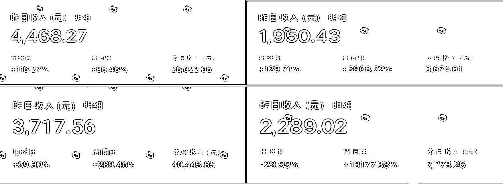
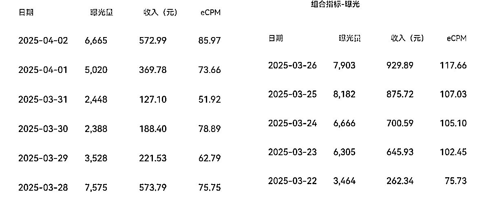
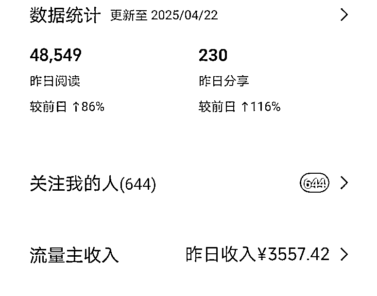
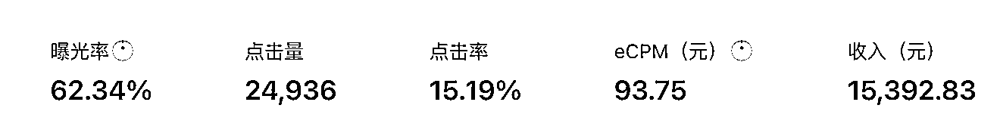
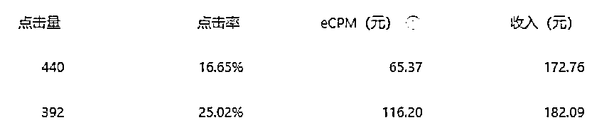
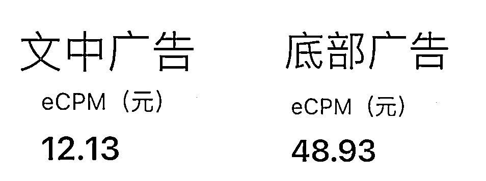
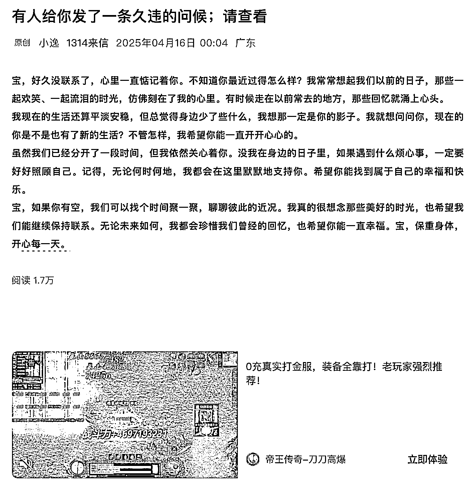
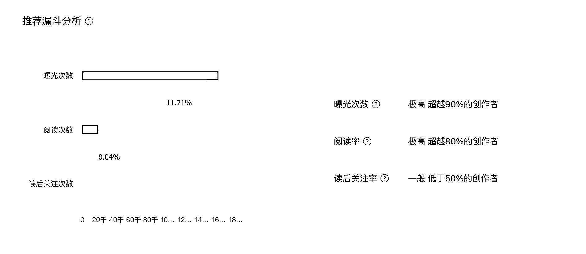
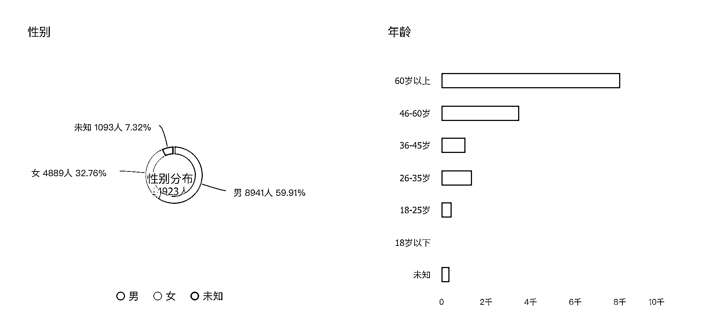

# (精华帖)(169 赞)借助 AI，ecpm100+单价的公众号实操指南

> 原文：[`www.yuque.com/for_lazy/zhoubao/efik2v6rvx40wzk6`](https://www.yuque.com/for_lazy/zhoubao/efik2v6rvx40wzk6)

## (精华帖)(169 赞)借助 AI，ecpm100+单价的公众号实操指南

作者： 张集慧

日期：2025-04-23

公众号爆文是一个很古老的项目了，有过辉煌，也有过不温不火的时候，最近也有很多圈友又在做，主要有以下几个原因：

1、流量推荐逻辑的变化，大概一年前，公众号开始有了公域推荐流量，你就算是一个 0 粉的号，也有机会出 10w+的文章，这在以前没粉丝就没阅读，想要做公众号，前期自己要想办法冷启动的年代，确实让很多新人进入的门槛低了很多。

2、AI 加持，以前的文章，要想写的好，全靠手搓，费时费力，现在，你完全可以把精力放在选题上面，文章内容方面交给 AI 就可以了。

## 爆文 or 高单价

公众号最终收益，简单来说就是一个公式：收益=阅读量*单价。

我看了往期的很多航海，还有相关的公众号文章，大家都集中在一个点上面，就是出爆文，怎样提高阅读量，怎么出 10w+,但是很少有人研究怎么做高单价，今天我不聊怎么提阅读量，我来聊聊影响收益的另一个点，怎么做高单价。

先看两个账号的数据，都是我这边在做的，eCPM 都在大几十，甚至 100 元以上，这类高单价的公众号是什么内容呢，我先卖个关子，最后说。

很多人的公众号日常就是个位数的单价，看到这种超过 100 元的单价，第一感觉就是假的，PS 的，我一开始看到这种数据，也觉得离谱，也觉得不真实，但是等我自己也做到的时候，开始看到后台各种数据的时候，我对公众号单价的理解也深了一步，下面我来一点点拆解影响单价的几个因素。

影响单价高低的核心有下面几个：曝光率、点击率、广告类型

1、曝光率，为什么先提曝光率这件事呢，因为公众号流量主，核心就是广告展示，所以第一步要确保广告曝光率能上来。比如下面的公众号文章，纯文字，只有 2-300 字，文章的缩短就是为了底部广告位的高曝光。

2、点击率

通过我对比多种类型账号的数据来看，广告点击率差异化最大的因素是人群，比如娱乐八卦类内容，广告点击率可能在 0.1%-0.5%，但是高单价的内容，点击率可以做到 15%-25%，这单单点击率差异就是上百倍。

3、广告类型

传统的内容，都是把文章写的长一些，完后考虑多加几条文中广告，刻意去关注底部广告的很少，因为长文先天的原因就造成了底部广告的曝光不足，所以也就无法兼顾底部广告。但是我观察过数据后会发现，文末广告的单价是文中的几倍。比如下图，我同一篇文章的文中广告和底部广告的单价数据如下，可以看到广告单价差异还是很大的。

那么问题来了，分析完高单价的几个因素后，我们会有一个疑问，现实中真的存在满足这几点，最终高单价的内容么？答案是肯定的，就是我下面放的这种类型的文章。就可以完美的满足以上几点，达到高单价高收益的目标，下面这篇文章 1.7w 左右的阅读，大概的收益会在 1000 元以上。

这样看着不起眼的内容，为什么会有这样的高收益数据呢，让我们来拆解他。

首先，他的内容很短，就几百字，点开正文，底部广告几乎是 100%的展现，广告曝光有了保障，这是第一步，

第二步是高的点击率，面对年轻一些的人群的内容，大家混迹互联网多年，什么是广告，一眼就看出来了，除非吸引到了自己，要不然谁会去点击广告，所以那种年轻人看的内容，广告点击率就很低很低，但是这个短短的几百字的文字，满满的感情，回忆在里面，他的目标人群是老年人。随便找一篇文章就能看到，60 岁以上人群占比超过 50%，基本都是老年人，通过数据观察，老年人有个特点，他们分不清这篇文章里面或者文章末尾的内容是广告，看到图片，就忍不住点一下，所以就造成了 bug 般的高点击率。

最后一点，底部广告这个点，为了卡到高单价的底部广告，2-300 字的短内容一箭双雕，不仅提高了曝光率，还确保了曝光的是单价高的底部广告。

最后再说下一，如图中这样的公众号内容，找个对标直接把原文扒下来，完后丢给 AI，ai 分分钟给你仿写几十篇，而且不需要排版，不需要配图，就是一坨文字就可以，内容成本极低，一个人完全可以维护几十个账号。

就这样，经过精心设计的内容，找到了高曝光率，高单价的广告类型，还吸引了高点击率的老年人人群，最终实现了 eCPM 单价过百的广告收益，这其中最核心的其实还是找到老年人的内容，因为其他几个因素，曝光率，广告类型的差异，最多也就是相差 2-3 倍，但是点击率这个点是差几十倍，上百倍的，老年人这个人群真是宝藏人群，做公众号的圈友，建议可以在这个人群基础上研究研究内容，很快就会有收获的。

* * *

评论区：

小胖 : 感谢分享[微笑]

小花 : 一直不知道张集慧老师的性别[呲牙]

阿辉|solas : 大帅哥

若凡吖 : 感谢分享

水心 : 很有帮助，感谢分享

青霜 : 请问如何找到这种对标账号？

张集慧 : 你去搜关键词：2 个未接电话，完后会看到很多账号，关注几个，后面系统会推荐更多

青霜 : 感谢